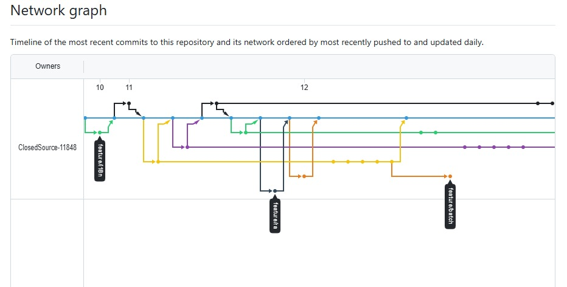
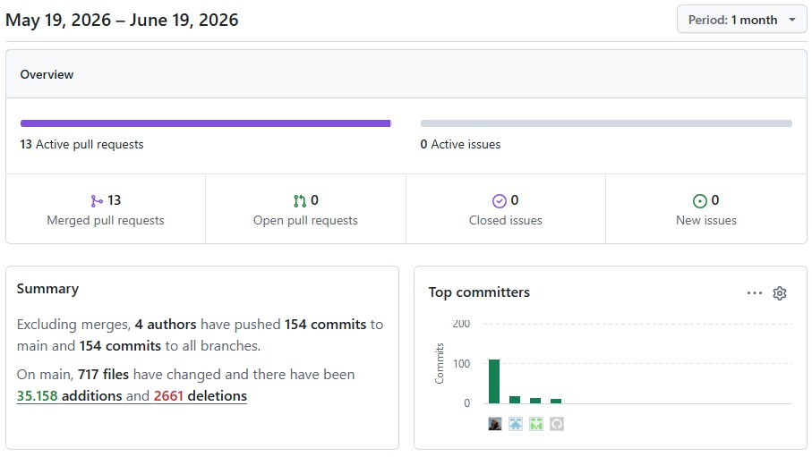
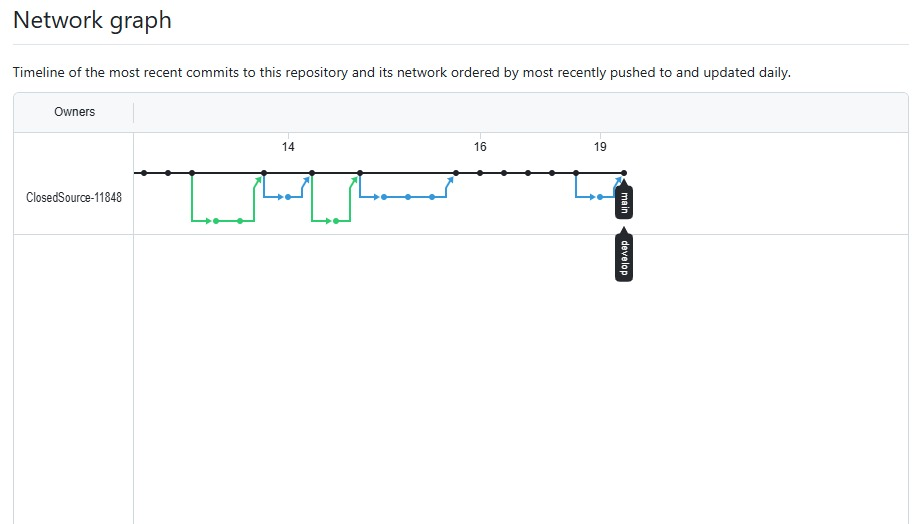

  

   

  <h1>Universidad Peruana de Ciencias Aplicadas</h1>

   

  

     
    Facultad de Ingeniería
      
    Carrera de Ingeniería de Software
      
    <strong>Periodo:</strong> 202610
      
    1ASI0729 Desarrollo de Aplicaciones Open Source
      
    <strong>NRC:</strong> 11848
      
    <strong>Nombre del profesor:</strong> Ángel Augusto Velásquez Núñez
  

  <h3>"Informe de Trabajo Final"</h3>

  

     
    <strong>Nombre del Startup:</strong> ClosedSource
      
    <strong>Nombre del Producto:</strong> QualiTrack
      
    <strong>Integrantes:</strong>
      
    <table>
      <tr>
        <td>Código</td>
        <td>Apellidos y Nombres</td>
      </tr>
      <tr>
        <td>U202116401</td>
        <td>Ruiz Madrid, Billy Jake</td>
      </tr>
      <tr>
        <td>U202322849</td>
        <td>Viza Quispe, Marlon Packard</td>
      </tr>
      <tr>
        <td>U202323911</td>
        <td>Diaz Caruzo, Edgard Daniel</td>
      </tr>
      <tr>
        <td>U202113229</td>
        <td>Castillo Yataco, Mauricio Sebastián</td>
      </tr>
      <tr>
        <td>U202321425</td>
        <td>Angulo Ramírez, Marcelo Martín</td>
      </tr>
      <tr>
        <td>U20211b387</td>
        <td>Becerra Ttito, Felix Orlando</td>
      </tr>
    </table>
  

  <h3>Junio, 2026</h3>

## Registro de Versiones del Informe

<table border="1" cellpadding="5" cellspacing="0">

  <thead>
    <tr>
      <th>Versión</th>
      <th>Fecha</th>
      <th>Autor</th>
      <th>Descripción</th>
    </tr>
  </thead>
  <tbody>
    <tr>
      <td>1.0.0</td>
      <td>05/04/2026</td>
      <td>Ruiz Madrid, Billy Jake</td>
      <td>
        Inicialización del repositorio del informe (first commit) y creación de la
        estructura base del proyecto.
      </td>
    </tr>
    <tr>
      <td>1.0.1</td>
      <td>06/04/2026</td>
      <td>Ruiz Madrid, Billy Jake</td>
      <td>
        Desarrollo del <strong>Startup Profile</strong> y agregado del perfil del
        integrante, incluyendo imágenes y estructura inicial del Capítulo I.
      </td>
    </tr>
    <tr>
      <td>1.0.2</td>
      <td>07/04/2026</td>
      <td>Ruiz Madrid, Billy Jake / Diaz Caruzo, Edgard Daniel</td>
      <td>
        Avance del Capítulo I con definición de <strong>Startup Profile, 5W+2H</strong>
        y estructura general. Se añadieron y corrigieron perfiles del equipo.
      </td>
    </tr>
    <tr>
      <td>1.0.3</td>
      <td>08/04/2026</td>
      <td>Viza Quispe, Marlon Packard / Angulo Ramírez, Marcelo Martín</td>
      <td>
        Incorporación de <strong>Lean UX Canvas, assumptions y outcomes</strong>,
        además de perfiles de integrantes con sus respectivos recursos gráficos.
      </td>
    </tr>
    <tr>
      <td>1.0.4</td>
      <td>09/04/2026</td>
      <td>Ruiz Madrid, Billy Jake / Castillo Yataco, Mauricio Sebastián</td>
      <td>
        Ajustes al <strong>Lean UX Canvas</strong>, definición de segmentos objetivo
        y consolidación de contenido del Capítulo I.
      </td>
    </tr>
    <tr>
      <td>1.1.0</td>
      <td>10/04/2026</td>
      <td>Diaz Caruzo, Edgard Daniel</td>
      <td>
        Inicio del Capítulo II con el diseño de entrevistas y estructura inicial
        de recolección de información.
      </td>
    </tr>
    <tr>
      <td>1.1.1</td>
      <td>11/04/2026</td>
      <td>Diaz Caruzo, Edgard Daniel</td>
      <td>
        Definición de la estructura de entrevistas y ajustes en preguntas
        específicas.
      </td>
    </tr>
    <tr>
      <td>1.1.2</td>
      <td>12/04/2026</td>
      <td>Diaz Caruzo, Edgard Daniel</td>
      <td>
        Registro de entrevistas, incorporación de evidencias (imágenes) y
        corrección de enlaces.
      </td>
    </tr>
    <tr>
      <td>1.1.3</td>
      <td>13/04/2026</td>
      <td>Castillo Yataco, Mauricio Sebastián / Diaz Caruzo, Edgard Daniel</td>
      <td>
        Desarrollo de <strong>entrevistas, needfinding, user personas y task matrix</strong>,
        junto con evidencia de entrevistas realizadas.
      </td>
    </tr>
    <tr>
      <td>1.1.4</td>
      <td>14/04/2026</td>
      <td>Viza Quispe, Marlon Packard</td>
      <td>
        Desarrollo de <strong>User Journey Mapping, Empathy Mapping y Ubiquitous Language</strong>.
      </td>
    </tr>
    <tr>
      <td>1.1.5</td>
      <td>15/04/2026</td>
      <td>Castillo Yataco, Mauricio Sebastián</td>
      <td>
        Elaboración del <strong>análisis de entrevistas</strong> para ambos segmentos.
      </td>
    </tr>
    <tr>
      <td>1.1.6</td>
      <td>16/04/2026</td>
      <td>Viza Quispe, Marlon Packard</td>
      <td>
        Correcciones y mejoras en <strong>Empathy Mapping</strong> y artefactos UX.
      </td>
    </tr>
    <tr>
      <td>1.2.0</td>
      <td>19/04/2026</td>
      <td>Ruiz Madrid, Billy Jake</td>
      <td>
        Desarrollo de <strong>User Stories, Impact Mapping y Product Backlog</strong>.
      </td>
    </tr>
    <tr>
      <td>1.2.1</td>
      <td>21/04/2026</td>
      <td>Viza Quispe, Marlon Packard</td>
      <td>
        Actualización de <strong>Impact Mapping</strong> e incorporación de recursos gráficos.
      </td>
    </tr>
    <tr>
      <td>1.3.0</td>
      <td>22/04/2026</td>
      <td>Ruiz Madrid, Billy Jake</td>
      <td>
        Desarrollo de <strong>diagramas de arquitectura (C4 y class diagrams)</strong>.
      </td>
    </tr>
    <tr>
      <td>1.3.1</td>
      <td>23/04/2026</td>
      <td>Ruiz Madrid, Billy Jake</td>
      <td>
        Correcciones en <strong>diagramas backend y arquitectura</strong>.
      </td>
    </tr>
    <tr>
      <td>1.3.2</td>
      <td>24/04/2026</td>
      <td>Viza Quispe, Marlon Packard / Ruiz Madrid, Billy Jake</td>
      <td>
        Desarrollo de <strong>wireframes, wireflows y diagramas de base de datos</strong>.
      </td>
    </tr>
    <tr>
      <td>1.3.3</td>
      <td>25/04/2026</td>
      <td>Diaz Caruzo, Edgard Daniel / Viza Quispe, Marlon Packard</td>
      <td>
        Incorporación de <strong>mockups y user flow diagrams</strong> de la web application.
      </td>
    </tr>
    <tr>
      <td>1.4.0</td>
      <td>24/04/2026</td>
      <td>Castillo Yataco, Mauricio Sebastián / Ruiz Madrid, Billy Jake</td>
      <td>
        Desarrollo del <strong>Capítulo V (AV1)</strong>, incluyendo Sprint 1,
        evidencias de implementación y documentación de gestión de configuración.
      </td>
    </tr>
    <tr>
      <td>1.4.1</td>
      <td>25/04/2026</td>
      <td>Castillo Yataco, Mauricio Sebastián</td>
      <td>
        Correcciones finales del Capítulo V y ajustes en documentación de
        <strong>Software Configuration Management</strong>.
      </td>
    </tr>
    <tr>
      <td>2.0.0</td>
      <td>22/04/2026</td>
      <td>Ruiz Madrid, Billy Jake</td>
      <td>
        Inicialización del repositorio (initial commit). Agregado de diagramas de arquitectura frontend para QualiTrack, incluyendo bounded contexts como Shared, Reporting & Audit (RA), Batch, Compliance & Alerts (CA), Tracking, Equipment, Laboratory e IAM.
      </td>
    </tr>
    <tr>
      <td>2.0.1</td>
      <td>23/04/2026</td>
      <td>Ruiz Madrid, Billy Jake</td>
      <td>
        Correcciones y ajustes específicos en los diagramas de arquitectura frontend de todos los bounded contexts.
      </td>
    </tr>
    <tr>
      <td>2.1.0</td>
      <td>30/04/2026</td>
      <td>Ruiz Madrid, Billy Jake</td>
      <td>
        Implementación del bounded context <strong>Shared</strong>: creación del layout principal, toolbar, footer, selector de idiomas, vista de inicio, página 'about' y página de error 404. Agregado de clases base abstractas para el API gateway y entidades de dominio.
      </td>
    </tr>
    <tr>
      <td>2.2.0</td>
      <td>02/05/2026</td>
      <td>Ruiz Madrid, Billy Jake</td>
      <td>
        Configuración inicial de Angular (angular.json, package.json, global styles, environments). Inicio del bounded context <strong>Laboratory</strong>: vistas de perfil, catálogo de productos, materia prima y gestión de personal; configuración de store, entidades y servicios API.
      </td>
    </tr>
    <tr>
      <td>2.4.0</td>
      <td>04/05/2026</td>
      <td>Ruiz Madrid, Billy Jake</td>
      <td>
        Desarrollo del bounded context <strong>Batch</strong>: vistas de lista/detalle, rutas, store y entidades del ciclo de vida. Creación del bounded context <strong>Compliance & Alerts (CA)</strong>: dashboard de alertas, rutas, store y comandos de eventos normativos. Corrección de endpoints en Equipment.
      </td>
    </tr>
    <tr>
      <td>2.5.0</td>
      <td>05/05/2026</td>
      <td>Ruiz Madrid, Billy Jake</td>
      <td>
        Implementación del bounded context <strong>Reporting & Audit (RA)</strong>: gráfico de tendencias de desviación, rutas, RA store y servicios API. Fixes en el manejo de peticiones/respuestas de las APIs de Batch y Laboratory.
      </td>
    </tr>
    <tr>
      <td>2.6.0</td>
      <td>08/05/2026</td>
      <td>Ruiz Madrid, Billy Jake</td>
      <td>
        Desarrollo del bounded context <strong>Tracking</strong>: adición del dashboard de telemetría, tarjeta de estado de equipos, rutas, store de gestión y entidades de medidas. Actualizaciones en las rutas y layout compartidos de la aplicación.
      </td>
    </tr>
    <tr>
      <td>2.6.1</td>
      <td>10/05/2026</td>
      <td>Ruiz Madrid, Billy Jake</td>
      <td>
        Actualización de los archivos de internacionalización (i18n) para soportar traducciones dinámicas en inglés (en) y español (es).
      </td>
    </tr>
    <tr>
      <td>2.6.2</td>
      <td>11/05/2026</td>
      <td>Ruiz Madrid, Billy Jake</td>
      <td>
        Integración de configuración y scripts para Mock API. Actualizaciones de UI en componentes de los bounded contexts Batch, Compliance & Alerts (CA), Equipment, Laboratory y dashboard de KPIs de Reporting & Audit (RA).
      </td>
    </tr>
    <tr>
      <td>2.7.0</td>
      <td>12/05/2026</td>
      <td>Castillo Yataco, Mauricio Sebastián</td>
      <td>
        Desarrollo profundo del bounded context <strong>Batch</strong>: agregado de tabla de lotes y vista de gestión, rutas con lazy loading, store basado en señales (signal-based state), servicios API completos y entidades para manufactura.
      </td>
    </tr>
    <tr>
      <td>2.7.1</td>
      <td>12/05/2026</td>
      <td>Viza Quispe, Marlon Packard</td>
      <td>
        Desarrollo profundo del bounded context <strong>Compliance & Alerts (CA)</strong>: vistas de historial normativo y alertas, actualización de preferencias de notificación, mejora del CaStore con métodos de alertas, y servicios API de eventos de cumplimiento.
      </td>
    </tr>
    <tr>
      <td>2.7.2</td>
      <td>12/05/2026</td>
      <td>Diaz Caruzo, Edgard Daniel</td>
      <td>
        Desarrollo profundo del bounded context <strong>Equipment</strong>: vistas detalladas y formularios de registro, configuración de enrutamiento, store basado en señales, transformadores de datos API para configuración BPM, y entidades de mantenimiento.
      </td>
    </tr>
    <tr>
      <td>2.8.0</td>
      <td>13/05/2026</td>
      <td>Angulo Ramírez, Marcelo Martín / Ruiz Madrid, Billy Jake</td>
      <td>
        Consolidación del bounded context <strong>Laboratory</strong>: integración final de entidades (laboratorio, productos, materias primas y personal), endpoints API, respuestas y adición de la gestión del store. Fusión (merge) hacia la rama de desarrollo (develop).
      </td>
    </tr>
    <tr>
      <td>2.9.0</td>
      <td>13/05/2026</td>
      <td>Ruiz Madrid, Billy Jake</td>
      <td>
        Creación del bounded context <strong>IAM</strong> para autenticación: vistas de registro y login, store, entidades y servicios API.
      </td>
    </tr>
    <tr>
      <td>3.0.0</td>
      <td>09/06/2026</td>
      <td>Ruiz Madrid, Billy Jake</td>
      <td>Apertura del Sprint 3: Reunión de planificación (Sprint Planning 3), actualización del Product Backlog en Jira e incorporación formal del sexto integrante.</td>
    </tr>
    <tr>
      <td>3.1.0</td>
      <td>09/06/2026</td>
      <td>Angulo Ramírez, Marcelo Martín</td>
      <td>Desarrollo inicial en el backend del bounded context <strong>Compliance & Alerts (CA)</strong>, implementando comandos, queries y agregados base para alertas de desviación.</td>
    </tr>
    <tr>
      <td>3.1.1</td>
      <td>09/06/2026</td>
      <td>Ruiz Madrid, Billy Jake</td>
      <td>Refinamiento de Historias de Usuario (User Stories) en Jira y corrección técnica del diagrama físico de base de datos relacional (tracking-database-diagram.puml).</td>
    </tr>
    <tr>
      <td>3.2.0</td>
      <td>09/06/2026</td>
      <td>Ruiz Madrid, Billy Jake</td>
      <td>Ajuste e integración de recursos REST en el backend para el módulo <strong>Laboratory</strong>, corrigiendo endpoints de staff, productos y stock de materias primas.</td>
    </tr>
    <tr>
      <td>3.3.0</td>
      <td>10/06/2026</td>
      <td>Castillo Yataco, Mauricio Sebastián</td>
      <td>Corrección técnica de controladores y consultas JPA en el bounded context <strong>Batch</strong> para la gestión relacional de liberación y rechazo de lotes.</td>
    </tr>
    <tr>
      <td>3.4.0</td>
      <td>12/06/2026</td>
      <td>Ruiz Madrid, Billy Jake</td>
      <td>Implementación del módulo backend para <strong>Reporting & Audit (RA)</strong>, estructurando las entidades de persistencia inmutable para auditoría exigidas por la normativa BPM.</td>
    </tr>
    <tr>
      <td>3.5.0</td>
      <td>13/06/2026</td>
      <td>Becerra Ttito, Felix Orlando</td>
      <td>Desarrollo del bounded context <strong>Tracking & Telemetry</strong> en el backend, añadiendo los comandos y controladores REST para captura de telemetría IoT.</td>
    </tr>
    <tr>
      <td>3.5.1</td>
      <td>13/06/2026</td>
      <td>Ruiz Madrid, Billy Jake</td>
      <td>Integración de eventos (integration events) intercontexto en la capa técnica para habilitar la comunicación asíncrona desacoplada entre módulos backend.</td>
    </tr>
    <tr>
      <td>3.6.0</td>
      <td>13/06/2026</td>
      <td>Ruiz Madrid, Billy Jake</td>
      <td>Implementación del módulo <strong>Subscription & Billing</strong>, integrando Stripe Checkout, valor de objetos de pago, webhooks y securización de endpoints del sistema.</td>
    </tr>
    <tr>
      <td>3.7.0</td>
      <td>13/06/2026</td>
      <td>Ruiz Madrid, Billy Jake</td>
      <td>Desarrollo del módulo <strong>IAM Backend</strong> para autenticación, configurando filtros HTTP con tokens JWT, cifrado BCrypt y reglas globales de Spring Security.</td>
    </tr>
    <tr>
      <td>3.7.1</td>
      <td>14/06/2026</td>
      <td>Ruiz Madrid, Billy Jake</td>
      <td>Acondicionamiento del dashboard de KPIs en el backend y workflows automatizados para el cálculo dinámico de tendencias de desviación (deviation trends).</td>
    </tr>
    <tr>
      <td>3.7.2</td>
      <td>14/06/2026</td>
      <td>Castillo Yataco, Mauricio Sebastián</td>
      <td>Hotfix en el controlador de lotes (BatchController) para subsanar el flujo técnico de procesamiento y descuento físico de insumos/materias primas.</td>
    </tr>
    <tr>
      <td>3.7.3</td>
      <td>14/06/2026</td>
      <td>Ruiz Madrid, Billy Jake</td>
      <td>Corrección en el controlador de telemetría (telemetry controller) para estabilizar el manejo de anomalías técnicas reportadas hacia Compliance.</td>
    </tr>
    <tr>
      <td>3.8.0</td>
      <td>16/06/2026</td>
      <td>Becerra Ttito, Felix Orlando</td>
      <td>Configuración del archivo de despliegue Dockerfile de producción y redirección de las propiedades de entorno globales (environment.ts) de Angular hacia Render.</td>
    </tr>
    <tr>
      <td>3.8.1</td>
      <td>17/06/2026</td>
      <td>Becerra Ttito, Felix Orlando</td>
      <td>Estructuración y ordenamiento de los contenidos prácticos y empaquetado del repositorio complementario <strong>Java Fundamentals Course</strong> (Starter a Completed).</td>
    </tr>
    <tr>
      <td>3.9.0</td>
      <td>19/06/2026</td>
      <td>Ruiz Madrid, Billy Jake</td>
      <td>Consolidación final del reporte del hito AV2, actualización técnica de diagramas de arquitectura C4, Swagger/OpenAPI y verificación de sincronización cloud en vivo.</td>
    </tr>
  </tbody>
</table>
  </tbody>
</table>

## Project Report Collaboration Insights

**Link de los repositorios de la organización:**
https://github.com/ClosedSource-11848

**Link del repositorio del Informe:**
https://github.com/ClosedSource-11848/ClosedSource-Project-Report

---

### Reporte de colaboración de la entrega del AV1

Durante la primera fase de elaboración del informe (Sprint 1 – AV1), el equipo ClosedSource centró sus esfuerzos en la construcción progresiva del documento, abarcando la definición del problema, la investigación con usuarios, el diseño de la solución y la documentación de la arquitectura.
El trabajo se realizó de manera iterativa, evidenciado en los commits del repositorio, donde cada integrante contribuyó en distintas secciones mediante la creación, mejora y corrección continua de contenidos.

**Billy Jake Ruiz Madrid**

Billy lideró la inicialización del repositorio y la estructuración base del informe. Participó activamente en el desarrollo del Capítulo I (Startup Profile, segmentos objetivo y ajustes del Lean UX Canvas).
En el Capítulo III, contribuyó con la elaboración y mejora del Product Backlog, User Stories e Impact Mapping.
Asimismo, desarrolló gran parte de los artefactos del Capítulo IV relacionados con arquitectura (diagramas C4, class diagrams y database diagrams), y apoyó en la documentación del Capítulo V correspondiente al Sprint 1 (AV1).

**Marcelo Martín Angulo Ramírez**

Marcelo contribuyó en la elaboración y mejora del Lean UX Canvas y en la definición de contenidos del Capítulo I, incluyendo perfiles y estructura del documento.
También participó en la consolidación de contenido y ajustes generales del informe, asegurando coherencia en la presentación de los artefactos generados durante el Sprint.

**Edgard Daniel Diaz Caruzo**

Daniel tuvo un rol principal en el desarrollo del Capítulo II, específicamente en el diseño, estructura y registro de entrevistas.
Se encargó de la incorporación de evidencias (imágenes, enlaces y resúmenes), así como de la organización de la información recolectada.
Además, participó en la integración de artefactos visuales en capítulos posteriores, como mockups y user flows.

**Marlon Packard Viza Quispe**

Marlon contribuyó en el desarrollo del Capítulo I mediante la incorporación de elementos del Lean UX (assumptions, outcomes y recursos visuales).
En el Capítulo II, participó en la construcción de artefactos de análisis como User Journey Mapping, Empathy Mapping y Ubiquitous Language.
Asimismo, tuvo un rol importante en el Capítulo IV, desarrollando wireframes, wireflows, mockups y actualizando recursos gráficos del sistema.

**Mauricio Sebastián Castillo Yataco**

Mauricio participó en la construcción del Capítulo I mediante la incorporación de contenido y mejora de la documentación.
En el Capítulo II, contribuyó en el desarrollo de entrevistas, needfinding y análisis de resultados.
Además, apoyó en la elaboración y corrección del Capítulo V, específicamente en la documentación del Sprint 1 (AV1) y aspectos de Software Configuration Management.

A continuación se presentan los gráficos de colaboración que representan la cantidad
de commits realizados por cada miembro del equipo en el repositorio del informe.

  
  
<em>Figura: Contribuciones por miembro del equipo ClosedSource durante el AV1.</em>

**Ramificación del proyecto usando GitFlow:**

El siguiente gráfico muestra la ramificación del repositorio y las visitas
registradas durante la fase AV1, evidenciando el flujo de trabajo colaborativo
del equipo.

  
  
<em>Figura: Network Graph del repositorio ClosedSource-Project-Report durante el AV1.</em>

---

### Reporte de colaboración de la entrega del TB1

Durante la segunda fase del proyecto (Sprint 2 – TB1), el equipo ClosedSource enfocó sus esfuerzos en la inicialización, configuración y desarrollo del frontend de la aplicación web QualiTrack. El trabajo se dividió estratégicamente mediante la implementación de distintos *bounded contexts* en Angular, aplicando patrones de diseño, *signal-based states* y servicios de integración con APIs. El desarrollo fue altamente colaborativo, integrando el diseño arquitectónico con la codificación de interfaces y la lógica de negocio.

**Billy Jake Ruiz Madrid**

Billy lideró la configuración inicial del repositorio frontend y la actualización de los diagramas de arquitectura para cada *bounded context*. Fue responsable de asentar las bases del proyecto, incluyendo la configuración de Angular, estilos globales, internacionalización (i18n) y entornos simulados (Mock API). Desarrolló completamente los *bounded contexts* de **Shared** (layouts, navegación), **IAM** (autenticación y registro), **Tracking** (dashboard de telemetría) y **Reporting & Audit (RA)**. Además, estableció la estructura base para el resto de los módulos y gestionó la integración final y fusión de ramas principales.

**Marcelo Martín Angulo Ramírez**

Marcelo centró su desarrollo en la consolidación del *bounded context* de **Laboratory**. Fue responsable de la integración final de las entidades farmacéuticas (laboratorios, productos, materias primas y personal). Se encargó de conectar las interfaces de usuario con los endpoints de la API, gestionando correctamente las peticiones, respuestas y la administración del estado dentro del *store* del laboratorio.

**Edgard Daniel Diaz Caruzo**

Daniel tuvo un rol principal en el desarrollo profundo del *bounded context* de **Equipment**. Se encargó de la creación de las vistas detalladas y los formularios de registro de equipos. Implementó la configuración de enrutamiento específica del módulo, la gestión del estado mediante *signal-based stores*, y desarrolló los transformadores de datos de la API necesarios para la configuración de parámetros BPM y el historial de mantenimiento.

**Marlon Packard Viza Quispe**

Marlon fue el responsable del desarrollo profundo del *bounded context* de **Compliance & Alerts (CA)**. Diseñó e implementó las vistas del historial normativo y los tableros de alertas. Mejoró la gestión del estado (CaStore) añadiendo métodos específicos para alertas y configuró los comandos para la actualización de preferencias de notificación, integrando los servicios API correspondientes a los eventos de cumplimiento.

**Mauricio Sebastián Castillo Yataco**

Mauricio se enfocó en el desarrollo integral del *bounded context* de **Batch**. Implementó la tabla interactiva de lotes y las vistas de gestión detallada. Configuró las rutas con carga diferida (*lazy loading*) para optimizar el rendimiento, implementó el manejo del estado con *signal-based stores* y desarrolló todos los servicios API y entidades necesarias para cubrir el ciclo de vida de la manufactura y el uso de materias primas.

A continuación se presentan los gráficos de colaboración que representan la cantidad
de commits realizados por cada miembro del equipo en el repositorio frontend durante esta fase.

  
  
<em>Figura: Contribuciones por miembro del equipo ClosedSource durante el TB1.</em>

**Ramificación del proyecto usando GitFlow:**

El siguiente gráfico muestra la ramificación del repositorio frontend y la integración 
de los distintos bounded contexts (*features*) hacia la rama de desarrollo durante la fase TB1.

  
  
<em>Figura: Network Graph del repositorio ClosedSource-Frontend durante el TB1.</em>

---

### Reporte de colaboración de la entrega del AV2

Durante la tercera fase del proyecto (Sprint 3 – AV2), el equipo ClosedSource centró sus esfuerzos en consolidar una versión integrada y desplegada de QualiTrack. A diferencia del Sprint 2, donde el trabajo se enfocó principalmente en la construcción de la Frontend Web Application con consumo de datos simulados, en esta entrega se priorizó la implementación del Backend con Spring Boot, la conexión real entre frontend y backend, la autenticación segura mediante JWT, la persistencia en base de datos, la integración de pagos con Stripe y el despliegue cloud de los principales servicios del sistema.

El trabajo colaborativo del equipo permitió cerrar la brecha entre la interfaz web desarrollada previamente y los servicios REST necesarios para soportar flujos reales de negocio. Para ello, se organizaron responsabilidades por *bounded contexts*, se realizaron correcciones de integración, se documentaron los endpoints mediante Swagger/OpenAPI y se validó el funcionamiento de QualiTrack en entornos desplegados como Firebase, Render, Railway y Stripe Test Environment.

**Billy Jake Ruiz Madrid**

Billy lideró gran parte de la integración técnica del Sprint 3. Participó en la planificación del sprint, refinamiento de User Stories, actualización del Product Backlog y corrección de diagramas técnicos. En el backend, trabajó en los bounded contexts de **Laboratory**, **Equipment**, **Reporting & Audit (RA)**, **Subscription & Billing** e **IAM**. Implementó autenticación y autorización con JWT, cifrado BCrypt, reglas de seguridad con Spring Security, integración de eventos intercontexto, workflows de KPIs y tendencias de desviación. Además, contribuyó con la documentación Swagger/OpenAPI, actualización de diagramas de arquitectura y consolidación final del reporte del hito AV2.

**Marcelo Martín Angulo Ramírez**

Marcelo participó principalmente en el desarrollo backend del bounded context de **Compliance & Alerts (CA)**. Su trabajo estuvo orientado a la implementación de comandos, queries, agregados base, servicios, persistencia y recursos REST relacionados con alertas de desviación, eventos de cumplimiento y preferencias de notificación. Asimismo, colaboró en la validación de la integración del módulo con los demás contextos del sistema, especialmente con Tracking & Telemetry y Reporting & Audit.

**Edgard Daniel Diaz Caruzo**

Daniel colaboró durante el Sprint 3 en la revisión técnica e integración de módulos relacionados con la experiencia web y los flujos funcionales del sistema. Su participación apoyó la validación de que los módulos previamente desarrollados en frontend mantuvieran coherencia con los endpoints reales del backend, especialmente en los flujos asociados a gestión de equipos, formularios, consumo de datos y navegación entre vistas. Además, contribuyó en la revisión de evidencias y consistencia del informe para la entrega AV2.

**Marlon Packard Viza Quispe**

Marlon colaboró en la validación funcional de los flujos relacionados con Compliance & Alerts, dashboards, alertas y comportamiento visual de la aplicación web integrada. Su aporte se centró en verificar que los flujos diseñados durante el Sprint 2 mantuvieran coherencia al conectarse con servicios reales del backend. Además, apoyó en la revisión de documentación, evidencias de ejecución y consistencia de los artefactos visuales incluidos en el reporte AV2.

**Mauricio Sebastián Castillo Yataco**

Mauricio se enfocó principalmente en el bounded context de **Batch Management**. Durante el Sprint 3 realizó correcciones técnicas en controladores, consultas JPA y flujos de gestión de lotes. También trabajó en el procesamiento de uso de materias primas, liberación y rechazo de lotes, asegurando que el módulo Batch funcionara correctamente con la persistencia relacional y la integración con Laboratory. Su aporte permitió estabilizar uno de los flujos principales de trazabilidad dentro de QualiTrack.

**Felix Orlando Becerra Ttito**

Felix tuvo un rol importante en el desarrollo del bounded context de **Tracking & Telemetry**. Implementó comandos, controladores REST y lógica asociada a la captura de telemetría IoT, mediciones, historial y estado de equipos. Además, participó en tareas relacionadas con la preparación del despliegue, configuración de entornos y conexión del frontend hacia el backend desplegado en Render. Su trabajo permitió validar el monitoreo de telemetría y la generación de información técnica para otros módulos como Compliance & Alerts.

A continuación se presentan los gráficos de colaboración que representan la cantidad
de commits realizados por cada miembro del equipo en el repositorio backend durante esta fase.

  
  
<em>Figura: Contribuciones por miembro del equipo ClosedSource durante el AV2.</em>

**Ramificación del proyecto usando GitFlow:**

El siguiente gráfico muestra la ramificación del repositorio backend y la integración 
de los distintos bounded contexts hacia la rama principal durante la fase AV2.

  
  
<em>Figura: Network Graph del repositorio qualitrack-platform durante el AV2.</em>

---

## Tabla de contenido

- [Capítulo I: Introducción](https://github.com/ClosedSource-11848/ClosedSource-Project-Report/blob/main/docs/ChapterI.md#capítulo-i-introducción)
    - [1.1. Startup Profile](https://github.com/ClosedSource-11848/ClosedSource-Project-Report/blob/main/docs/ChapterI.md#11-startup-profile)
        - [1.1.1. Descripción de la Startup](https://github.com/ClosedSource-11848/ClosedSource-Project-Report/blob/main/docs/ChapterI.md#111-descripción-de-la-startup)
        - [1.1.2. Perfiles de integrantes del equipo](https://github.com/ClosedSource-11848/ClosedSource-Project-Report/blob/main/docs/ChapterI.md#112-perfiles-de-integrantes-del-equipo)
    - [1.2. Solution Profile](https://github.com/ClosedSource-11848/ClosedSource-Project-Report/blob/main/docs/ChapterI.md#12-solution-profile)
        - [1.2.1. Antecedentes y problemática](https://github.com/ClosedSource-11848/ClosedSource-Project-Report/blob/main/docs/ChapterI.md#121-antecedentes-y-problemática)
        - [1.2.2. Lean UX Process](https://github.com/ClosedSource-11848/ClosedSource-Project-Report/blob/main/docs/ChapterI.md#122-lean-ux-process)
            - [1.2.2.1. Lean UX Problem Statements](https://github.com/ClosedSource-11848/ClosedSource-Project-Report/blob/main/docs/ChapterI.md#1221-lean-ux-problem-statements)
            - [1.2.2.2. Lean UX Assumptions](https://github.com/ClosedSource-11848/ClosedSource-Project-Report/blob/main/docs/ChapterI.md#1222-lean-ux-assumptions)
            - [1.2.2.3. Lean UX Hypothesis Statements](https://github.com/ClosedSource-11848/ClosedSource-Project-Report/blob/main/docs/ChapterI.md#1223-lean-ux-hypothesis-statements)
            - [1.2.2.4. Lean UX Canvas](https://github.com/ClosedSource-11848/ClosedSource-Project-Report/blob/main/docs/ChapterI.md#1224-lean-ux-canvas)
    - [1.3. Segmentos objetivo](https://github.com/ClosedSource-11848/ClosedSource-Project-Report/blob/main/docs/ChapterI.md#13-segmentos-objetivo)

- [Capítulo II: Requirements Elicitation & Analysis](https://github.com/ClosedSource-11848/ClosedSource-Project-Report/blob/main/docs/ChapterII.md#capítulo-ii-requirements-elicitation--analysis)
    - [2.1. Competidores](https://github.com/ClosedSource-11848/ClosedSource-Project-Report/blob/main/docs/ChapterII.md#21-competidores)
        - [2.1.1. Análisis competitivo](https://github.com/ClosedSource-11848/ClosedSource-Project-Report/blob/main/docs/ChapterII.md#211-análisis-competitivo)
        - [2.1.2. Estrategias y tácticas frente a competidores](https://github.com/ClosedSource-11848/ClosedSource-Project-Report/blob/main/docs/ChapterII.md#212-estrategias-y-tácticas-frente-a-competidores)
    - [2.2. Entrevistas](https://github.com/ClosedSource-11848/ClosedSource-Project-Report/blob/main/docs/ChapterII.md#22-entrevistas)
        - [2.2.1. Diseño de entrevistas](https://github.com/ClosedSource-11848/ClosedSource-Project-Report/blob/main/docs/ChapterII.md#221-diseño-de-entrevistas)
        - [2.2.2. Registro de entrevistas](https://github.com/ClosedSource-11848/ClosedSource-Project-Report/blob/main/docs/ChapterII.md#222-registro-de-entrevistas)
        - [2.2.3. Análisis de entrevistas](https://github.com/ClosedSource-11848/ClosedSource-Project-Report/blob/main/docs/ChapterII.md#223-análisis-de-entrevistas)
    - [2.3. Needfinding](https://github.com/ClosedSource-11848/ClosedSource-Project-Report/blob/main/docs/ChapterII.md#23-needfinding)
        - [2.3.1. User Personas](https://github.com/ClosedSource-11848/ClosedSource-Project-Report/blob/main/docs/ChapterII.md#231-user-personas)
        - [2.3.2. User Task Matrix](https://github.com/ClosedSource-11848/ClosedSource-Project-Report/blob/main/docs/ChapterII.md#232-user-task-matrix)
        - [2.3.3. User Journey Mapping](https://github.com/ClosedSource-11848/ClosedSource-Project-Report/blob/main/docs/ChapterII.md#233-user-journey-mapping)
        - [2.3.4. Empathy Mapping](https://github.com/ClosedSource-11848/ClosedSource-Project-Report/blob/main/docs/ChapterII.md#234-empathy-mapping)
    - [2.4. Big Picture Event Storming](https://github.com/ClosedSource-11848/ClosedSource-Project-Report/blob/main/docs/ChapterII.md#24-big-picture-event-storming)
    - [2.5. Ubiquitous Language](https://github.com/ClosedSource-11848/ClosedSource-Project-Report/blob/main/docs/ChapterII.md#25-ubiquitous-language)

- [Capítulo III: Requirements Specification](https://github.com/ClosedSource-11848/ClosedSource-Project-Report/blob/main/docs/ChapterIII.md#capítulo-iii-requirements-specification)
    - [3.1. User Stories](https://github.com/ClosedSource-11848/ClosedSource-Project-Report/blob/main/docs/ChapterIII.md#31-user-stories)
    - [3.2. Impact Mapping](https://github.com/ClosedSource-11848/ClosedSource-Project-Report/blob/main/docs/ChapterIII.md#32-impact-mapping)
    - [3.3. Product Backlog](https://github.com/ClosedSource-11848/ClosedSource-Project-Report/blob/main/docs/ChapterIII.md#33-product-backlog)

- [Capítulo IV: Product Design](https://github.com/ClosedSource-11848/ClosedSource-Project-Report/blob/main/docs/ChapterIV.md#capítulo-iv-product-design)
    - [4.1. Style Guidelines](https://github.com/ClosedSource-11848/ClosedSource-Project-Report/blob/main/docs/ChapterIV.md#41-style-guidelines)
        - [4.1.1. General Style Guidelines](https://github.com/ClosedSource-11848/ClosedSource-Project-Report/blob/main/docs/ChapterIV.md#411-general-style-guidelines)
        - [4.1.2. Web Style Guidelines](https://github.com/ClosedSource-11848/ClosedSource-Project-Report/blob/main/docs/ChapterIV.md#412-web-style-guidelines)
    - [4.2. Information Architecture](https://github.com/ClosedSource-11848/ClosedSource-Project-Report/blob/main/docs/ChapterIV.md#42-information-architecture)
        - [4.2.1. Organization Systems](https://github.com/ClosedSource-11848/ClosedSource-Project-Report/blob/main/docs/ChapterIV.md#421-organization-systems)
        - [4.2.2. Labeling Systems](https://github.com/ClosedSource-11848/ClosedSource-Project-Report/blob/main/docs/ChapterIV.md#422-labeling-systems)
        - [4.2.3. SEO Tags and Meta Tags](https://github.com/ClosedSource-11848/ClosedSource-Project-Report/blob/main/docs/ChapterIV.md#423-seo-tags-and-meta-tags)
        - [4.2.4. Searching Systems](https://github.com/ClosedSource-11848/ClosedSource-Project-Report/blob/main/docs/ChapterIV.md#424-searching-systems)
        - [4.2.5. Navigation Systems](https://github.com/ClosedSource-11848/ClosedSource-Project-Report/blob/main/docs/ChapterIV.md#425-navigation-systems)
    - [4.3. Landing Page UI Design](https://github.com/ClosedSource-11848/ClosedSource-Project-Report/blob/main/docs/ChapterIV.md#43-landing-page-ui-design)
        - [4.3.1. Landing Page Wireframe](https://github.com/ClosedSource-11848/ClosedSource-Project-Report/blob/main/docs/ChapterIV.md#431-landing-page-wireframe)
        - [4.3.2. Landing Page Mock-up](https://github.com/ClosedSource-11848/ClosedSource-Project-Report/blob/main/docs/ChapterIV.md#432-landing-page-mock-up)
    - [4.4. Web Applications UX/UI Design](https://github.com/ClosedSource-11848/ClosedSource-Project-Report/blob/main/docs/ChapterIV.md#44-web-applications-uxui-design)
        - [4.4.1. Web Applications Wireframes](https://github.com/ClosedSource-11848/ClosedSource-Project-Report/blob/main/docs/ChapterIV.md#441-web-applications-wireframes)
        - [4.4.2. Web Applications Wireflow Diagrams](https://github.com/ClosedSource-11848/ClosedSource-Project-Report/blob/main/docs/ChapterIV.md#442-web-applications-wireflow-diagrams)
        - [4.4.3. Web Applications Mock-ups](https://github.com/ClosedSource-11848/ClosedSource-Project-Report/blob/main/docs/ChapterIV.md#443-web-applications-mock-ups)
        - [4.4.4. Web Applications User Flow Diagrams](https://github.com/ClosedSource-11848/ClosedSource-Project-Report/blob/main/docs/ChapterIV.md#444-web-applications-user-flow-diagrams)
    - [4.5. Web Applications Prototyping](https://github.com/ClosedSource-11848/ClosedSource-Project-Report/blob/main/docs/ChapterIV.md#45-web-applications-prototyping)
    - [4.6. Domain-Driven Software Architecture](https://github.com/ClosedSource-11848/ClosedSource-Project-Report/blob/main/docs/ChapterIV.md#46-domain-driven-software-architecture)
        - [4.6.1. Design-Level Event Storming](https://github.com/ClosedSource-11848/ClosedSource-Project-Report/blob/main/docs/ChapterIV.md#461-design-level-event-storming)
        - [4.6.2. Software Architecture Context Diagram](https://github.com/ClosedSource-11848/ClosedSource-Project-Report/blob/main/docs/ChapterIV.md#462-software-architecture-context-diagram)
        - [4.6.3. Software Architecture Container Diagrams](https://github.com/ClosedSource-11848/ClosedSource-Project-Report/blob/main/docs/ChapterIV.md#463-software-architecture-container-diagrams)
        - [4.6.4. Software Architecture Components Diagrams](https://github.com/ClosedSource-11848/ClosedSource-Project-Report/blob/main/docs/ChapterIV.md#464-software-architecture-components-diagrams)
    - [4.7. Software Object-Oriented Design](https://github.com/ClosedSource-11848/ClosedSource-Project-Report/blob/main/docs/ChapterIV.md#47-software-object-oriented-design)
        - [4.7.1. Class Diagrams](https://github.com/ClosedSource-11848/ClosedSource-Project-Report/blob/main/docs/ChapterIV.md#471-class-diagrams)
    - [4.8. Database Design](https://github.com/ClosedSource-11848/ClosedSource-Project-Report/blob/main/docs/ChapterIV.md#48-database-design)
        - [4.8.1. Database Diagrams](https://github.com/ClosedSource-11848/ClosedSource-Project-Report/blob/main/docs/ChapterIV.md#481-database-diagrams)

- [Capítulo V: Product Implementation, Validation & Deployment](https://github.com/ClosedSource-11848/ClosedSource-Project-Report/blob/main/docs/ChapterV.md#capítulo-v-product-implementation-validation--deployment)
    - [5.1. Software Configuration Management](https://github.com/ClosedSource-11848/ClosedSource-Project-Report/blob/main/docs/ChapterV.md#51-software-configuration-management)
        - [5.1.1. Software Development Environment Configuration](https://github.com/ClosedSource-11848/ClosedSource-Project-Report/blob/main/docs/ChapterV.md#511-software-development-environment-configuration)
        - [5.1.2. Source Code Management](https://github.com/ClosedSource-11848/ClosedSource-Project-Report/blob/main/docs/ChapterV.md#512-source-code-management)
        - [5.1.3. Source Code Style Guide & Conventions](https://github.com/ClosedSource-11848/ClosedSource-Project-Report/blob/main/docs/ChapterV.md#513-source-code-style-guide--conventions)
        - [5.1.4. Software Deployment Configuration](https://github.com/ClosedSource-11848/ClosedSource-Project-Report/blob/main/docs/ChapterV.md#514-software-deployment-configuration)
    - [5.2. Landing Page, Services & Applications Implementation](https://github.com/ClosedSource-11848/ClosedSource-Project-Report/blob/main/docs/ChapterV.md#52-landing-page-services--applications-implementation)
        - [5.2.1. Sprint 1](https://github.com/ClosedSource-11848/ClosedSource-Project-Report/blob/main/docs/ChapterV.md#521-sprint-1)
            - [5.2.1.1. Sprint Planning 1](https://github.com/ClosedSource-11848/ClosedSource-Project-Report/blob/main/docs/ChapterV.md#5211-sprint-planning-1)
            - [5.2.1.2. Aspect Leaders and Collaborators](https://github.com/ClosedSource-11848/ClosedSource-Project-Report/blob/main/docs/ChapterV.md#5212-aspect-leaders-and-collaborators)
            - [5.2.1.3. Sprint Backlog 1](https://github.com/ClosedSource-11848/ClosedSource-Project-Report/blob/main/docs/ChapterV.md#5213-sprint-backlog-1)
            - [5.2.1.4. Development Evidence for Sprint Review](https://github.com/ClosedSource-11848/ClosedSource-Project-Report/blob/main/docs/ChapterV.md#5214-development-evidence-for-sprint-review)
            - [5.2.1.5. Execution Evidence for Sprint Review](https://github.com/ClosedSource-11848/ClosedSource-Project-Report/blob/main/docs/ChapterV.md#5215-execution-evidence-for-sprint-review)
            - [5.2.1.6. Services Documentation Evidence for Sprint Review](https://github.com/ClosedSource-11848/ClosedSource-Project-Report/blob/main/docs/ChapterV.md#5216-services-documentation-evidence-for-sprint-review)
            - [5.2.1.7. Software Deployment Evidence for Sprint Review](https://github.com/ClosedSource-11848/ClosedSource-Project-Report/blob/main/docs/ChapterV.md#5217-software-deployment-evidence-for-sprint-review)
            - [5.2.1.8. Team Collaboration Insights during Sprint](https://github.com/ClosedSource-11848/ClosedSource-Project-Report/blob/main/docs/ChapterV.md#5218-team-collaboration-insights-during-sprint)
    - [5.3. Validation Interviews](https://github.com/ClosedSource-11848/ClosedSource-Project-Report/blob/main/docs/ChapterV.md#53-validation-interviews)
        - [5.3.1. Diseño de Entrevistas](https://github.com/ClosedSource-11848/ClosedSource-Project-Report/blob/main/docs/ChapterV.md#531-diseño-de-entrevistas)
        - [5.3.2. Registro de Entrevistas](https://github.com/ClosedSource-11848/ClosedSource-Project-Report/blob/main/docs/ChapterV.md#532-registro-de-entrevistas)
        - [5.3.3. Evaluaciones según heurísticas](https://github.com/ClosedSource-11848/ClosedSource-Project-Report/blob/main/docs/ChapterV.md#533-evaluaciones-según-heurísticas)
    - [5.4. Video About-the-Product](https://github.com/ClosedSource-11848/ClosedSource-Project-Report/blob/main/docs/ChapterV.md#54-video-about-the-product)

- [Conclusiones](https://github.com/ClosedSource-11848/ClosedSource-Project-Report/blob/main/docs/ChapterV.md#conclusiones)
    - [Conclusiones y recomendaciones](https://github.com/ClosedSource-11848/ClosedSource-Project-Report/blob/main/docs/ChapterV.md#conclusiones-y-recomendaciones)
    - [Video About-the-Team](https://github.com/ClosedSource-11848/ClosedSource-Project-Report/blob/main/docs/ChapterV.md#video-about-the-team)

- [Bibliografía](https://github.com/ClosedSource-11848/ClosedSource-Project-Report/blob/main/docs/ChapterV.md#bibliografía)
- [Anexos](https://github.com/ClosedSource-11848/ClosedSource-Project-Report/blob/main/docs/ChapterV.md#anexos)

---

## ABET – EAC - Student Outcome 3

El curso contribuye al cumplimiento del Student Outcome ABET:
**ABET - EAC - Student Outcome 3**

**Criterio:** Capacidad de comunicarse efectivamente con un rango de audiencias.

En el siguiente cuadro se describen las acciones realizadas y los enunciados de conclusiones
por parte del grupo, que permiten sustentar el haber alcanzado el logro del
ABET - EAC - Student Outcome 3 durante las entregas AV1, TB1 y AV2.

<table border="1" cellpadding="5" cellspacing="0" width="100%">
  <thead>
    <tr>
      <th width="25%">Criterio específico</th>
      <th width="55%">Acciones realizadas</th>
      <th width="20%">Conclusiones</th>
    </tr>
  </thead>
  <tbody>
    <tr>
      <td><strong>Comunica oralmente con efectividad a diferentes rangos de audiencia.</strong></td>
      <td>
        <strong>Ruiz Madrid, Billy Jake:</strong>  
        <strong>AV1:</strong> Presentó los avances del Capítulo I y Capítulo III en reuniones de equipo, explicando los segmentos objetivo, el Product Backlog y el Impact Mapping, facilitando la comprensión de las decisiones de priorización y del enfoque del producto.  
        <strong>TB1:</strong> Expuso ante el equipo la arquitectura base del frontend en Angular, detallando la configuración de entornos, enrutamiento principal y la estructura de los bounded contexts de Shared e IAM para alinear el desarrollo técnico.  
        <strong>AV2:</strong> Explicó al equipo la integración general de QualiTrack, detallando la conexión entre Angular y Spring Boot, el funcionamiento de JWT, los módulos IAM, Reporting & Audit, Subscription & Billing, Laboratory y Equipment, así como el despliegue en Firebase, Render y Railway.  
        <strong>Angulo Ramírez, Marcelo Martín:</strong>  
        <strong>AV1:</strong> Expuso el Lean UX Canvas y los lineamientos de arquitectura del sistema, adaptando el nivel técnico de la explicación según la audiencia para asegurar la comprensión del enfoque de diseño y la estructura general de la solución.  
        <strong>TB1:</strong> Comunicó en las reuniones de sincronización los detalles de integración del bounded context de Laboratory con las APIs del backend, explicando el flujo de datos de las entidades farmacéuticas.  
        <strong>AV2:</strong> Presentó los avances del bounded context de Compliance & Alerts, explicando cómo las alertas, eventos de cumplimiento y preferencias de notificación se relacionan con los demás módulos del sistema.  
        <strong>Diaz Caruzo, Edgard Daniel:</strong>  
        <strong>AV1:</strong> Comunicó los resultados de las entrevistas y la estructura del proceso de recolección de información, explicando los hallazgos obtenidos y su impacto en la definición de necesidades del sistema.  
        <strong>TB1:</strong> Presentó la estrategia de manejo de estado basada en señales (signal-based stores) aplicada al bounded context de Equipment, facilitando al equipo la adopción de este patrón en otros módulos.  
        <strong>AV2:</strong> Participó en la comunicación de observaciones funcionales sobre la integración del frontend con los endpoints reales del backend, especialmente en flujos relacionados con Equipment, formularios y navegación de la aplicación web.  
        <strong>Viza Quispe, Marlon Packard:</strong>  
        <strong>AV1:</strong> Presentó los artefactos de análisis de usuario como User Journey Mapping, Empathy Mapping y flujos de navegación, facilitando la comprensión del comportamiento del usuario dentro del sistema.  
        <strong>TB1:</strong> Explicó el diseño y funcionamiento de los tableros de control y flujos de notificación del bounded context de Compliance & Alerts (CA), asegurando que el equipo entendiera las prioridades visuales de las alertas.  
        <strong>AV2:</strong> Comunicó observaciones sobre la validación de flujos de alertas, dashboards y comportamiento visual de la aplicación integrada, contribuyendo a que el equipo verificara la coherencia entre la interfaz y los servicios backend.  
        <strong>Castillo Yataco, Mauricio Sebastián:</strong>  
        <strong>AV1:</strong> Expuso el desarrollo de entrevistas y el análisis de resultados, explicando la relación entre los hallazgos obtenidos y la definición de funcionalidades del sistema.  
        <strong>TB1:</strong> Comunicó la implementación de las técnicas de optimización, como lazy loading, y la estructuración de componentes para el bounded context de Batch, promoviendo buenas prácticas de rendimiento en el equipo.  
        <strong>AV2:</strong> Explicó las correcciones realizadas en el bounded context de Batch, incluyendo consultas JPA, controladores, uso de materias primas, liberación y rechazo de lotes, facilitando la comprensión del flujo de trazabilidad.  
        <strong>Becerra Ttito, Felix Orlando:</strong>  
        <strong>AV2:</strong> Presentó los avances del bounded context de Tracking & Telemetry, explicando la captura de telemetría, mediciones, historial, estado de equipos y su relación con la detección de anomalías dentro del sistema QualiTrack.
      </td>
      <td>
        <strong>Conclusión AV1:</strong> 
        La comunicación oral permitió al equipo compartir avances de manera clara y estructurada, facilitando la comprensión del problema, los usuarios y la solución propuesta. Las exposiciones durante el sprint ayudaron a alinear decisiones y mantener una visión común del proyecto.  
        <strong>Conclusión TB1:</strong> 
        La comunicación oral fue fundamental para sincronizar el desarrollo técnico del frontend. Las discusiones técnicas y exposiciones sobre patrones de diseño, consumo de APIs y arquitectura de Angular garantizaron que todos los miembros desarrollaran sus módulos bajo los mismos estándares, reduciendo conflictos de integración.  
        <strong>Conclusión AV2:</strong> 
        La comunicación oral permitió coordinar la integración completa entre frontend, backend, base de datos y servicios externos. Las explicaciones técnicas sobre JWT, bounded contexts, despliegue cloud, Swagger y Stripe facilitaron que el equipo comprendiera el funcionamiento integral de QualiTrack y pudiera presentar una solución funcional ante diferentes audiencias.
      </td>
    </tr>
    <tr>
      <td><strong>Comunica por escrito con efectividad a diferentes rangos de audiencia.</strong></td>
      <td>
        <strong>Ruiz Madrid, Billy Jake:</strong>  
        <strong>AV1:</strong> Redactó secciones del Capítulo I, Capítulo III y Capítulo IV, incluyendo Product Backlog, Impact Mapping y diagramas de arquitectura, utilizando un lenguaje técnico claro que permitió la comprensión tanto a nivel académico como técnico.  
        <strong>TB1:</strong> Documentó los diagramas de arquitectura frontend, redactó la configuración base del código, como clases abstractas e interfaces, y actualizó los archivos de internacionalización (i18n) para asegurar traducciones claras en inglés y español para el usuario final.  
        <strong>AV2:</strong> Redactó y consolidó documentación técnica del Sprint 3, incluyendo evidencias de desarrollo, despliegue, Swagger/OpenAPI, diagramas de arquitectura, integración de backend, IAM, suscripciones, pagos y persistencia en base de datos.  
        <strong>Angulo Ramírez, Marcelo Martín:</strong>  
        <strong>AV1:</strong> Documentó el Lean UX Canvas y aportó en la organización y mejora del contenido del informe, manteniendo coherencia en la estructura y claridad en la redacción.  
        <strong>TB1:</strong> Redactó de manera estructurada los servicios API, responses, requests y transformadores de datos del bounded context de Laboratory, asegurando un código limpio y autodescriptivo.  
        <strong>AV2:</strong> Redactó estructuras técnicas asociadas al bounded context de Compliance & Alerts, incluyendo comandos, queries, recursos REST y componentes de persistencia, manteniendo una nomenclatura clara y consistente con la arquitectura del backend.  
        <strong>Diaz Caruzo, Edgard Daniel:</strong>  
        <strong>AV1:</strong> Redactó el diseño, registro y evidencias de entrevistas en el Capítulo II, organizando la información de manera clara y comprensible para su análisis posterior.  
        <strong>TB1:</strong> Documentó la configuración de enrutamiento y redactó las interfaces de las entidades de mantenimiento para el bounded context de Equipment, facilitando la mantenibilidad del código.  
        <strong>AV2:</strong> Apoyó en la revisión escrita de evidencias funcionales y documentación de integración, verificando que la información del informe mantuviera coherencia con los flujos reales implementados en la aplicación.  
        <strong>Viza Quispe, Marlon Packard:</strong>  
        <strong>AV1:</strong> Elaboró la documentación de artefactos de análisis de usuario y diseño, como User Journey, Empathy Mapping, wireframes y mockups, asegurando consistencia en el uso de términos y claridad en la representación de flujos.  
        <strong>TB1:</strong> Redactó la documentación detallada del CaStore en el código, explicando los métodos adicionales para eventos de cumplimiento, lo que facilitó la comprensión del flujo de datos por parte de otros desarrolladores.  
        <strong>AV2:</strong> Colaboró en la revisión escrita de evidencias relacionadas con alertas, dashboards y validación visual de la aplicación integrada, asegurando que la documentación fuera comprensible para usuarios técnicos y no técnicos.  
        <strong>Castillo Yataco, Mauricio Sebastián:</strong>  
        <strong>AV1:</strong> Documentó entrevistas, análisis de resultados y parte del Capítulo V, organizando la información de forma estructurada y alineada con los requerimientos del informe.  
        <strong>TB1:</strong> Redactó los commits del repositorio utilizando convenciones estándar, como chore, feat y fix, e implementó el código de las vistas de gestión de lotes, manteniendo una nomenclatura de variables y métodos clara y coherente.  
        <strong>AV2:</strong> Redactó e implementó correcciones técnicas en controladores, consultas y flujos del bounded context de Batch, dejando evidencia clara en commits y en el código sobre los ajustes realizados para el procesamiento de materias primas y trazabilidad de lotes.  
        <strong>Becerra Ttito, Felix Orlando:</strong>  
        <strong>AV2:</strong> Redactó e implementó componentes técnicos del bounded context de Tracking & Telemetry, incluyendo comandos, controladores REST y estructuras relacionadas con mediciones, historial y estado de equipos. Además, colaboró en la configuración de despliegue y variables de entorno para conectar la aplicación con el backend desplegado.
      </td>
      <td>
        <strong>Conclusión AV1:</strong> 
        La comunicación escrita permitió estructurar y documentar de manera clara los avances del proyecto, facilitando la comprensión de los artefactos desarrollados por parte del equipo y del evaluador. La consistencia en la redacción contribuyó a mantener coherencia entre los capítulos y asegurar la trazabilidad del trabajo realizado.  
        <strong>Conclusión TB1:</strong> 
        La comunicación escrita, enfocada en la creación de diagramas de arquitectura, convenciones de commits y redacción de código limpio y autodescriptivo, permitió que el equipo colaborara de manera asíncrona sobre el repositorio frontend, asegurando que cualquier integrante pudiera entender y extender el trabajo de sus compañeros.  
        <strong>Conclusión AV2:</strong> 
        La comunicación escrita permitió documentar de forma clara la integración técnica de QualiTrack, incluyendo backend, frontend, base de datos, autenticación, pagos, despliegue y documentación de servicios. La redacción estructurada de commits, diagramas, endpoints y evidencias facilitó la trazabilidad del trabajo y permitió sustentar adecuadamente la entrega del AV2.
      </td>
    </tr>
  </tbody>
</table>
