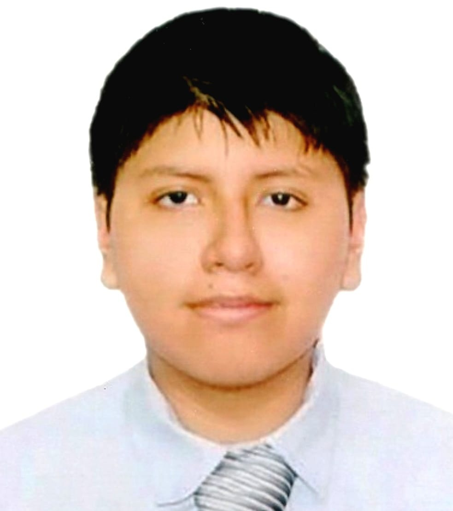
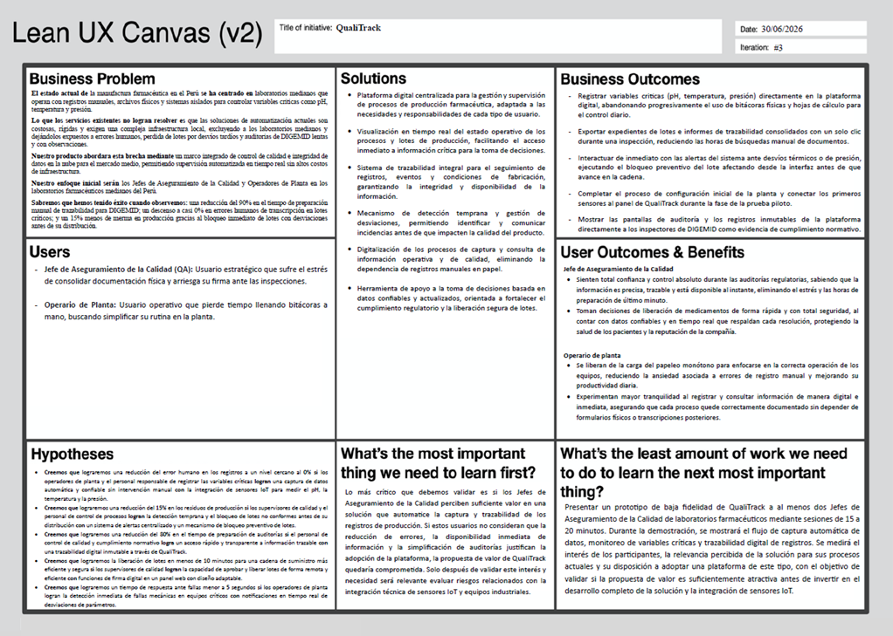

# Capítulo I: Introducción

La introducción desempeña un papel fundamental en la estructuración y comprensión del proyecto, ya que establece el marco conceptual y contextual sobre el cual se desarrollará el trabajo. En esta sección inicial, se presenta una visión general que permite al lector comprender los objetivos principales que se desean alcanzar, así como los antecedentes que han llevado a la formulación del proyecto. También se delimita el alcance del mismo, es decir, hasta dónde se pretende llegar con el desarrollo de la propuesta. Asimismo, la introducción cumple la función de contextualizar la relevancia del proyecto en un entorno específico, destacando las razones que justifican su realización, los desafíos que se pretenden abordar y los beneficios esperados a partir de su implementación. En suma, esta parte inicial no solo informa, sino que también orienta y motiva al lector a profundizar en el contenido que se presentará a lo largo del documento.

## 1.1. Startup Profile

El perfil de la startup es un elemento fundamental para comprender la identidad y el rumbo estratégico de una empresa emergente. A través de este perfil, se revela su visión de futuro, sus valores esenciales y la propuesta de valor que la diferencia en el mercado competitivo.

En esta sección se describen los aspectos clave que definen a la startup, incluyendo su origen, las motivaciones que impulsaron su creación, el problema específico que busca solucionar y el enfoque innovador que emplea para posicionarse frente a sus competidores.

Asimismo, se analizan los objetivos a mediano y largo plazo, junto con las estrategias diseñadas para su crecimiento y consolidación dentro del sector. Entender estos elementos resulta vital para evaluar el potencial de la startup y el impacto que puede generar en su entorno.

### 1.1.1. Descripción de la Startup

En una industria donde la precisión y el cumplimiento normativo son cuestiones de salud pública, QualiTrack nace con una visión clara: transformar y digitalizar la supervisión de los procesos de fabricación en laboratorios farmacéuticos. Nuestro propósito es brindar una plataforma que combine la solidez de una arquitectura de software empresarial con la innovación del Internet de las Cosas (IoT), garantizando que las instituciones de salud cumplan rigurosamente con las Buenas Prácticas de Manufactura (BPM) exigidas por entidades como DIGEMID.

Nos diferenciamos por ofrecer un sistema web (SaaS) robusto, inmutable y auditable, capaz de integrarse con sensores de equipos industriales —como autoclaves y medidores de pH— para capturar telemetría en tiempo real. De esta manera, eliminamos la dependencia de registros manuales propensos a errores humanos, asegurando la calidad, eficacia y seguridad de cada lote de productos farmacéuticos elaborados.

Nuestra propuesta está diseñada para adaptarse tanto a entidades públicas de alto rigor científico, como el Instituto Nacional de Salud (INS), como a laboratorios privados. Con ello, buscamos agilizar los procesos de auditoría, reducir la merma por lotes defectuosos y elevar los estándares de aseguramiento de la calidad en el país.

QualiTrack no es solo un software de gestión documental. Es una plataforma de cumplimiento regulatorio, un escudo contra fallas de producción y un compromiso hacia una nueva era de manufactura farmacéutica inteligente y transparente.

<h4 id="Mision">Misión</h4>

Desarrollar soluciones tecnológicas seguras, escalables y orientadas al cumplimiento regulatorio, que permitan a los laboratorios farmacéuticos automatizar y auditar sus procesos de control de calidad. En QualiTrack nos enfocamos en la eliminación del error humano mediante la integración IoT, protegiendo la integridad de los datos para garantizar la producción de medicamentos seguros y eficaces.

<h4 id="Vision">Visión</h4>

Convertirnos en la plataforma SaaS líder en Gestión de Calidad Farmacéutica (QMS) en Latinoamérica, estandarizando la digitalización de las Buenas Prácticas de Manufactura. Aspiramos a transformar las auditorías de calidad en procesos transparentes y automáticos, consolidando la industria 4.0 en el sector salud de la región.

### 1.1.2. Perfiles de integrantes del equipo

<table border="1" width="100%">
  <tr>
    <td width="140" valign="top" align="center">
      
    </td>
    <td valign="top">
      <strong>Billy Jake Ruiz Madrid - (U202116401)</strong> - Ingeniería de Software  
      Tengo 22 años, soy una persona tranquila, colaborativa y adaptable. Me gusta trabajar en equipo, aportando ideas y soluciones. Cuento con conocimientos en C++ y Python y siempre busco formas de hacer las cosas de manera eficiente.
    </td>
  </tr>
  <tr>
    <td width="140" valign="top" align="center">
      
    </td>
    <td valign="top">
      <strong>Edgard Daniel Diaz Caruzo - (U202323911)</strong> - Ingeniería de Software  
      Tengo 20 años, y me considero una persona flexible y con buena disposición para colaborar. Disfruto trabajar en equipo, ya que me permite aportar ideas y encontrar soluciones junto a otros. Tengo conocimientos en C++ y Python, y constantemente busco optimizar la forma en que realizo mis tareas para lograr mejores resultados.
    </td>
  </tr>
  <tr>
    <td width="140" valign="top" align="center">
      
    </td>
    <td valign="top">
      <strong>Marlon Packard Viza Quispe - (U202322849)</strong> - Ingeniería de Software  
      Estudiante de 20 años, responsable y proactivo, con una sólida base técnica en C++. Destaco por mi capacidad para aportar soluciones creativas y mi compromiso con el aprendizaje constante en entornos profesionales. Busco asumir retos que potencien mi desarrollo y contribuyan al éxito colectivo de mi equipo.
    </td>
  </tr>
  <tr>
    <td width="140" valign="top" align="center">
      
    </td>
    <td valign="top">
      <strong>Mauricio Sebastian Castillo Yataco - (U202113229)</strong> - Ingeniería de Software  
      Soy estudiante de Ingeniería de Software, apasionado por la creación de soluciones tecnológicas que mejoren la vida de las personas. Mi enfoque va más allá de la programación, ya que me interesa desarrollar experiencias digitales que sean tanto funcionales como agradables para el usuario.Conocimiento básico en el lenguaje de C++, Html y CSS, presento además las aptitudes de responsabilidad, cooperación, comunicación, flexibilidad y adaptabilidad
    </td>
  </tr>
  <tr>
    <td width="140" valign="top" align="center">
      
    </td>
    <td valign="top">
      <strong>Angulo Ramírez Marcelo Martín - (U202321425)</strong> - Ingeniería de Software  
      Con 21 años, estudio para ser un ingeniero de software muy activo y comunicativo en el desarrollo de proyectos. Considero que el trabajo en equipo una oportunidad que me permite afinar mi capacidad de encontrar respuestas a una problematica y corroborarlo. Tengo experiencia en C++, C# y Python, con el objetivo de extenderme a otros lenguajes de alto nivel y experimentar metodos para optimizar mi labor.
    </td>
  </tr>
</table>

## 1.2. Solution Profile

### 1.2.1. Antecedentes y problemática

**1. ANTECEDENTES**

La industria farmacéutica es uno de los sectores más regulados a nivel mundial, dada la implicación directa que tienen sus productos sobre la salud pública. En el Perú, la Dirección General de Medicamentos, Insumos y Drogas (DIGEMID) es la autoridad encargada de velar por el estricto cumplimiento de las Buenas Prácticas de Manufactura (BPM). Estas normativas exigen que los laboratorios —tanto privados como entidades públicas como el Instituto Nacional de Salud (INS)— garanticen que los productos se fabriquen de manera uniforme y controlada, de acuerdo con estándares de calidad adecuados al uso que se les pretende dar.

A pesar de la criticidad de estos procesos, la modernización digital en las áreas de aseguramiento de la calidad (Quality Assurance) es aún incipiente en muchos laboratorios nacionales. El control de equipos industriales clave, como las autoclaves (cuyo éxito en la esterilización depende de la medición exacta de temperatura y presión del vapor) o la medición del pH en el control de calidad, sigue dependiendo en gran medida de sistemas aislados, impresiones térmicas o, en el peor de los casos, registros manuales realizados por operarios. Esta falta de integración digital y automatización no solo ralentiza las operaciones, sino que compromete el principio de "Integridad de Datos" (Data Integrity), un pilar fundamental exigido por las agencias regulatorias internacionales.

**2. PROBLEMÁTICA**

**Riesgo de errores humanos en registros críticos:** La transcripción manual de variables como la temperatura, la presión o el potencial de hidrógeno (pH) desde los sensores físicos hacia las bitácoras de lote introduce un alto riesgo de error humano. Una simple equivocación en la anotación puede comprometer la liberación de un lote completo o, peor aún, permitir la salida de un producto inseguro.

**Trazabilidad fragmentada y vulnerable:** Al no contar con un sistema centralizado, la información de fabricación se dispersa en documentos físicos o archivos de Excel locales. Esto dificulta la trazabilidad inmutable del producto y hace que la detección del origen de una desviación de calidad sea un proceso tedioso y reactivo.

**Auditorías lentas y propensas a observaciones:** Cuando DIGEMID o entidades certificadoras realizan auditorías, los encargados de calidad deben invertir días recopilando documentos físicos para demostrar que los procesos se mantuvieron dentro de los parámetros establecidos. La falta de un historial digital auditable incrementa la probabilidad de recibir observaciones regulatorias o multas.

**Ausencia de alertas tempranas:** Al no existir una integración directa (IoT) entre los sensores de los equipos de producción y un sistema de gestión central (QMS), si una autoclave sufre una caída de presión, la alerta depende de la observación visual del operario. No hay un mecanismo de software que bloquee automáticamente el lote si los parámetros salen del rango permitido por la normativa.

**Análisis 5W+2H:**

**What (¿Qué?):** QualiTrack busca resolver la falta de trazabilidad digital y los riesgos de error humano en la supervisión de fabricación farmacéutica. La plataforma SaaS integrará la telemetría de equipos críticos (simulando sensores IoT de presión, temperatura y pH) con un sistema de gestión de calidad (QMS) que automatiza registros, genera alertas y bloquea lotes fuera de especificación.

**Why (¿Por qué?):** Es fundamental abordar este problema para garantizar la seguridad de los pacientes que consumen estos fármacos y productos biológicos. Además, digitalizar estos procesos permite a los laboratorios evitar costosas multas de DIGEMID, superar auditorías con facilidad y reducir las pérdidas económicas por lotes defectuosos.

**Who (¿Quién?):** Afecta directamente al personal de Aseguramiento de la Calidad, Químicos Farmacéuticos supervisores, y operarios de laboratorio. Beneficia a las directivas de las instituciones (como el INS o laboratorios privados) al asegurar el cumplimiento normativo.

**When (¿Cuándo?):** La problemática ocurre diariamente durante cada ciclo de producción, esterilización y control de calidad. El problema se vuelve crítico durante los periodos de inspección y auditoría de entidades regulatorias, donde la falta de trazabilidad puede paralizar las operaciones.

**Where (¿Dónde?):** Ocurre dentro de las plantas de producción y laboratorios de control de calidad de la industria farmacéutica y entidades de salud pública a nivel nacional e internacional.

**How (¿Cómo?):** Se resuelve mediante una plataforma web distribuida. El backend (Java/Spring Boot) procesará reglas de negocio estrictas basadas en BPM y recibirá datos simulados/reales de microcontroladores conectados a los equipos. El frontend (Angular) proveerá dashboards interactivos donde los supervisores podrán ver telemetría en tiempo real, firmar digitalmente la liberación de lotes y exportar historiales inmutables para auditorías.

**How much (¿Cuánto?):** El modelo de negocio es SaaS B2B. Se cobrará una suscripción (mensual/anual) a los laboratorios basada en el volumen de datos procesados (cantidad de equipos conectados o lotes gestionados). Esto evita que los laboratorios realicen fuertes inversiones iniciales en infraestructura de servidores locales.

### 1.2.2. Lean UX Process

El Lean UX es una perspectiva que facilita la validación de las soluciones sugeridas para problemas detectados. Este método se enfoca en los individuos que harán uso de nuestro producto. Después de detectar el problema que se debe solucionar, se utilizó este procedimiento para identificar áreas cruciales que ayudarán a dar forma al producto propuesto.

#### 1.2.2.1. Lean UX Problem Statements

Nuestro servicio brinda una plataforma de gestión de calidad y cumplimiento (QMS) para laboratorios farmacéuticos y entidades de salud pública. A través de una arquitectura SaaS e integración con dispositivos IoT, las instituciones buscan garantizar que cada lote de medicamentos cumpla con las Buenas Prácticas de Manufactura (BPM) exigidas por DIGEMID.

Hemos observado que el control de variables críticas (pH, temperatura, presión) aún depende de registros manuales y sistemas aislados, lo que genera riesgos de error humano, falta de integridad de datos y demoras críticas durante auditorías regulatorias.

¿Cómo podríamos lograr que el personal de aseguramiento de la calidad y los supervisores farmacéuticos tengan trazabilidad inmutable y alertas en tiempo real de sus procesos de fabricación, sin depender de bitácoras físicas o transcripciones manuales propensas a errores?

#### 1.2.2.2. Lean UX Assumptions

En esta sección los supuestos iniciales del equipo acerca del negocio, los usuarios, la problemática y la solución sugerida se exponen. Durante entrevistas, prototipado y pruebas de uso, estas suposiciones se establecen como creencias que necesitan ser confirmadas con evidencia.

**Assumptions Worksheet (síntesis aplicada a QualiTrack)**

| #  | Supuesto aplicado                                                                                                                               |
|----|-------------------------------------------------------------------------------------------------------------------------------------------------|
| 1  | Creemos que los laboratorios necesitan garantizar la integridad de datos para superar auditorías de DIGEMID sin observaciones.                  |
| 2  | Estas necesidades pueden resolverse con una solución SaaS integrada a sensores IoT que capturen telemetría (pH, presión, temp) automáticamente. |
| 3  | Nuestros clientes iniciales serán laboratorios farmacéuticos medianos y entidades públicas (como el INS) que manejan procesos de esterilización.|
| 4  | El valor #1 para los laboratorios es la reducción del riesgo de rechazo de lotes y la agilización de procesos de auditoría.                     |  
| 5  | Beneficios adicionales: eliminación del papel, alertas tempranas ante desviaciones y centralización de la firma digital de lotes.               |
| 6  | Adquiriremos clientes mediante venta directa B2B técnica, ferias del sector farmacéutico y consultorías de cumplimiento regulatorio.            |
| 7  | Generaremos ingresos con planes de suscripción basados en el volumen de lotes gestionados o cantidad de equipos IoT conectados.                 |
| 8  | La competencia principal son los registros manuales en papel, hojas de cálculo de Excel.                                                        |
| 9  | Nos diferenciaremos por la captura automática vía IoT, la inmutabilidad de los registros y el cumplimiento nativo de normativas locales.        |
| 10 | El mayor riesgo de producto es que el personal de planta se resista a dejar el registro físico por costumbre operativa.                         |
| 11 | Reduciremos ese riesgo con interfaces de usuario simplificadas para operarios y dashboards de fácil lectura para supervisores.                  |
| 12 | Si se demuestra que la integración de hardware es muy compleja para el cliente, pivotaremos hacia una solución de gestión documental robusta.   |

**Supuestos por dimensión**

**Business Assumptions**
* Asumimos que los laboratorios farmacéuticos y entidades como el INS enfrentan una presión regulatoria creciente que hace insostenible el registro manual.
* Asumimos que las instituciones están dispuestas a invertir en una solución SaaS para evitar multas de DIGEMID y reducir la merma de productos.
* Asumimos que el modelo de suscripción basado en volumen de datos o equipos es escalable y aceptado por la industria farmacéutica.
* Asumimos que nuestra principal ventaja competitiva es la garantía de "Integridad de Datos" (Data Integrity) mediante la automatización IoT.

**User Assumptions**
* Asumimos que los principales usuarios serán Directores Técnicos, Jefes de Aseguramiento de la Calidad (QA) y operarios de planta.
* Asumimos que los Jefes de QA necesitan dashboards de supervisión remota para liberar lotes sin estar físicamente en la línea de producción.
* Asumimos que los operarios de laboratorio adoptarán la plataforma si esta simplifica su flujo de trabajo y elimina la carga de llenar bitácoras físicas.
* Asumimos que los auditores regulatorios aceptarán los reportes digitales de QualiTrack como evidencia válida e inmutable.

**Problem Assumptions**
* Asumimos que los registros manuales actuales son la causa principal de las observaciones en auditorías y de la liberación de lotes defectuosos.
* Asumimos que la falta de centralización de la telemetría (pH, temperatura, presión) impide una respuesta rápida ante fallas mecánicas en equipos industriales.
* Asumimos que la trazabilidad física fragmentada hace que el análisis de causa raíz ante una desviación de calidad sea lento y costoso.
* Asumimos que existe un riesgo crítico de manipulación o pérdida de datos en los sistemas actuales basados en papel o Excel.

**Solution Assumptions**
* Asumimos que una plataforma digital centralizada y auditable (QMS) reducirá drásticamente el tiempo de preparación para inspecciones.
* Asumimos que la integración IoT eliminará el error de transcripción humana en las variables críticas de control.
* Asumimos que el sistema de alertas automáticas permitirá bloquear lotes no conformes antes de que avancen en la cadena de suministro.
* Asumimos que la arquitectura SaaS facilitará el cumplimiento normativo sin que el laboratorio deba gestionar servidores locales complejos.

**Assumptions Priority (riesgo x incertidumbre)**

| Prioridad | Supuesto a validar                                                                                                  | Riesgo | Incertidumbre |
|----------:|---------------------------------------------------------------------------------------------------------------------|:------:|:-------------:|
|         1 | Los sensores IoT pueden integrarse de forma estable con equipos industriales antiguos (autoclaves, pH-metros).      |  Alto  |     Alto      |
|         2 | La plataforma cumple con los estándares de seguridad de datos exigidos por DIGEMID para auditorías digitales.       |  Alto  |     Medio     |
|         3 | El personal de aseguramiento de calidad preferirá el dashboard digital sobre las bitácoras físicas actuales.        |  Alto  |     Alto      |
|         4 | Los laboratorios están dispuestos a pagar una suscripción recurrente en lugar de comprar un software de pago único. |  Medio |     Bajo      |

**Business Outcomes:**
* Lograr que al menos 2 laboratorios piloto implementen QualiTrack en sus líneas de producción en los primeros 8 meses.
* Reducir en un 80% el tiempo de preparación de documentos para auditorías regulatorias en las instituciones piloto.
* Disminuir en un 15% la pérdida de lotes por desviaciones de parámetros no detectadas a tiempo.

**User Outcomes:**
* Lograr que los supervisores de calidad firmen y liberen lotes de forma digital en menos de 10 minutos tras finalizar la producción.
* Reducir el error humano en el registro de variables críticas a un valor cercano al 0% mediante la automatización IoT.
* Lograr que los operarios visualicen alertas de desviación de parámetros en menos de 5 segundos a través de la plataforma móvil/web.

**Features:**
1. Módulo de registro de lotes e historial de fabricación inmutable.
2. Integración con sensores IoT (simulados/reales) para captura de pH, temperatura y presión.
3. Dashboard de monitoreo en tiempo real con indicadores de cumplimiento BPM.
4. Sistema de alertas automáticas y bloqueo preventivo de lotes fuera de rango.
5. Generación de reportes de trazabilidad listos para auditoría en formato PDF no editable.

#### 1.2.2.3. Lean UX Hypothesis Statements

* **Hipótesis 1:** Creemos que al integrar sensores IoT para la captura automática de variables críticas (pH, temperatura, presión), eliminaremos el riesgo de manipulación y error de transcripción. Lo sabremos cuando el error humano en los registros se reduzca a un valor cercano al 0%.
* **Hipótesis 2:** Creemos que al implementar un sistema centralizado de alertas y bloqueo preventivo de lotes no conformes, reduciremos el desperdicio de producción. Lo sabremos cuando la pérdida de lotes por desviaciones de parámetros disminuya en un 15%.
* **Hipótesis 3:** Creemos que al digitalizar la trazabilidad de forma inmutable mediante QualiTrack, agilizaremos las inspecciones regulatorias de DIGEMID. Lo sabremos cuando el tiempo de preparación de documentos para auditorías se reduzca en un 80% en las instituciones piloto.
* **Hipótesis 4:** Creemos que al habilitar la firma digital en un dashboard web responsivo, aceleraremos la cadena de suministro segura. Lo sabremos cuando los supervisores de calidad logren firmar y liberar lotes de forma remota en menos de 10 minutos tras finalizar la producción.
* **Hipótesis 5:** Creemos que al utilizar notificaciones en tiempo real, el personal de planta reaccionará instantáneamente ante fallas mecánicas en equipos como autoclaves. Lo sabremos cuando los operarios visualicen y atiendan alertas de desviación en menos de 5 segundos.

#### 1.2.2.4. Lean UX Canvas

## 1.3. Segmentos objetivo
