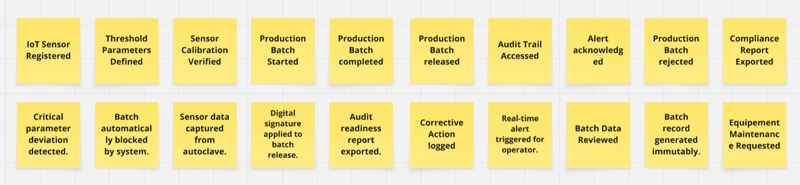
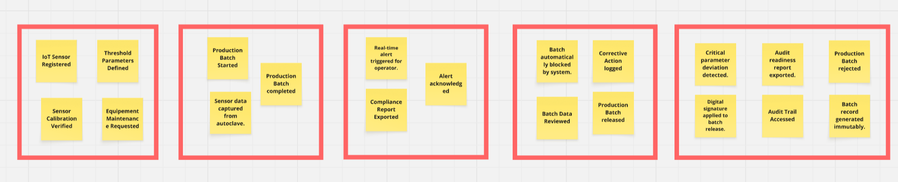

# Capítulo II: Requirements Elicitation & Analysis

## 2.1. Competidores

Para desarrollar una solución realmente útil, es fundamental comprender el entorno competitivo y las alternativas que actualmente utilizan los laboratorios farmacéuticos. Este análisis permite identificar cómo se gestionan hoy los procesos de calidad y qué limitaciones presentan las soluciones existentes.

En esta etapa, se analizan distintos tipos de competidores con el objetivo de entender sus fortalezas y debilidades, y así posicionar a QualiTrack como una propuesta que responda de manera más efectiva a las necesidades reales del sector.

### 2.1.1. Análisis competitivo

Para comprender el entorno en el que se desarrollará QualiTrack, se realizó un análisis competitivo que permite identificar las principales soluciones utilizadas en la gestión de calidad farmacéutica, así como sus enfoques y limitaciones.

A continuación, se presenta una comparación de los competidores considerando su propuesta de valor, mercado objetivo y funcionalidades, con el fin de definir el posicionamiento de QualiTrack frente a ellos.

<table border="1" cellpadding="10" cellspacing="0" style="margin-left: auto; margin-right: auto; font-family: sans-serif;">
<tr>
<th colspan="6">Panorama del análisis competitivo</th>
</tr>
<tr>
<td colspan="2" rowspan="2"><b>¿Por qué llevar a cabo este análisis?</b></td>
<td colspan="4">¿Cómo se posiciona QualiTrack frente a sus competidores en cuanto a fortalezas, debilidades, oportunidades y su propuesta de valor dentro del mercado de gestión de calidad farmacéutica?</td>
</tr>
<tr>
<td colspan="4">Es una propuesta que posiciona a QualiTrack como una plataforma SaaS orientada a la gestión de calidad farmacéutica, incorporando integración IoT para automatizar la captura de datos, mejorar la trazabilidad y asegurar el cumplimiento normativo frente a otras soluciones del mercado.</td>
</tr>
<tr>
<td colspan="2" style="text-align: center;"><b>Competidores</b></td>
<td style="text-align: center; vertical-align: middle;">
<b>QualiTrack</b>

</td>
<td style="text-align: center; vertical-align: middle;">
<b>SAP (ERP)</b>

</td>
<td style="text-align: center; vertical-align: middle;">
<b>LabWare (LIMS)</b>

</td>
<td style="text-align: center; vertical-align: middle;">
<b>Métodos tradicionales</b>

</td>
</tr>
<tr>
<td rowspan="2"><b>Perfil</b></td>
<td>Overview</td>
<td>Plataforma SaaS enfocada en la gestión de calidad farmacéutica con integración IoT y trazabilidad en tiempo real.</td>
<td>Sistema ERP global con módulos de calidad y manufactura.</td>
<td>Software especializado en gestión de laboratorio (LIMS).</td>
<td>Registros en papel y hojas de cálculo (Excel).</td>
</tr>
<tr>
<td>Ventaja competitiva</td>
<td>Integración IoT, enfoque en normativas locales, modelo SaaS accesible.</td>
<td>Alta robustez e integración empresarial.</td>
<td>Especialización en procesos de laboratorio.</td>
<td>Bajo costo y facilidad de uso.</td>
</tr>
<tr>
<td rowspan="2"><b>Perfil de Marketing</b></td>
<td>Mercado objetivo</td>
<td>Laboratorios medianos y entidades públicas en LATAM.</td>
<td>Grandes corporaciones.</td>
<td>Laboratorios grandes y multinacionales.</td>
<td>Todo tipo de laboratorio.</td>
</tr>
<tr>
<td>Estrategias de marketing</td>
<td>Venta B2B, enfoque en cumplimiento regulatorio y precios accesibles.</td>
<td>Ventas corporativas y consultoría empresarial.</td>
<td>Ventas especializadas en sector laboratorio.</td>
<td>Uso interno sin estrategia formal.</td>
</tr>
<tr>
<td rowspan="3"><b>Perfil de Producto</b></td>
<td>Productos & Servicios</td>
<td>Plataforma web con dashboards, monitoreo en tiempo real y alertas.</td>
<td>Software empresarial modular.</td>
<td>Sistema estructurado de gestión de laboratorio.</td>
<td>Registros manuales o digitales básicos.</td>
</tr>
<tr>
<td>Precios & Costos</td>
<td>Suscripción SaaS escalable.</td>
<td>Costos elevados de implementación.</td>
<td>Licencias costosas.</td>
<td>Bajo costo.</td>
</tr>
<tr>
<td>Canales de distribución</td>
<td>Web, nube e integración con dispositivos IoT.</td>
<td>Implementación empresarial.</td>
<td>Implementación técnica especializada.</td>
<td>Uso interno.</td>
</tr>
<tr>
<td rowspan="5"><b>Análisis SWOT</b></td>
</tr>
<tr>
<td>Fortalezas</td>
<td>Integración IoT, trazabilidad en tiempo real, accesibilidad SaaS.</td>
<td>Sistema robusto y escalable.</td>
<td>Alta especialización en laboratorio.</td>
<td>Bajo costo y facilidad de uso.</td>
</tr>
<tr>
<td>Debilidades</td>
<td>Producto nuevo, dependencia de hardware, adopción del usuario.</td>
<td>Alto costo y complejidad.</td>
<td>Costos elevados y baja accesibilidad.</td>
<td>Alto riesgo de error y falta de trazabilidad.</td>
</tr>
<tr>
<td>Oportunidades</td>
<td>Crecimiento de digitalización en salud y cumplimiento regulatorio.</td>
<td>Expansión en grandes corporaciones.</td>
<td>Modernización e integración tecnológica.</td>
<td>Migración hacia soluciones digitales.</td>
</tr>
<tr>
<td>Amenazas</td>
<td>Competidores globales y resistencia al cambio.</td>
<td>Nuevas soluciones más accesibles.</td>
<td>Competencia SaaS más económica.</td>
<td>Regulaciones que exigen digitalización.</td>
</tr>
</table>

### 2.1.2. Estrategias y tácticas frente a competidores

Una vez identificados los actores del mercado, el siguiente paso es definir cómo QualiTrack logrará posicionarse frente a ellos. No basta con conocer a la competencia; es necesario establecer un plan de acción que permita aprovechar las ventajas del producto y reducir sus posibles limitaciones.

Para ello, se utiliza la Matriz CAME, una herramienta que permite transformar el análisis FODA en estrategias concretas, orientadas a fortalecer la propuesta de valor y mejorar el posicionamiento en el mercado.

A través de este enfoque, se plantean acciones orientadas a potenciar la integración IoT, el cumplimiento normativo y la accesibilidad del modelo SaaS, así como a mitigar riesgos como la resistencia al cambio y la entrada a un mercado con competidores consolidados.

Matriz CAME para el desarrollo de estrategias basadas en el análisis FODA.

| **Análisis FODA cruzado** | **Oportunidades** | **Amenazas** |
|---------------------------|------------------|--------------|
| **Fortalezas (F)** 1. Integración IoT para captura automática de datos. 2. Trazabilidad en tiempo real e inmutable. 3. Enfoque en normativas locales (DIGEMID). 4. Modelo SaaS accesible y escalable. | **Estrategia (FO) — Estrategias Ofensivas** 1. Establecer alianzas con laboratorios e instituciones de salud para implementar pilotos que validen la integración IoT y generen evidencia de reducción de errores. 2. Posicionar a QualiTrack como una solución especializada en cumplimiento normativo en LATAM, destacando su adaptación a DIGEMID. 3. Aprovechar el modelo SaaS para captar laboratorios medianos mediante planes accesibles y escalables. 4. Promover la automatización de procesos como principal ventaja competitiva frente a métodos manuales y sistemas aislados. 5. Impulsar campañas de concientización sobre la importancia de la integridad de datos en la industria farmacéutica. | **Estrategia (FA) — Estrategias Defensivas** 1. Fortalecer la seguridad e integridad de los datos mediante protocolos alineados a estándares regulatorios. 2. Brindar soporte técnico local y capacitación continua para facilitar la adopción del sistema. 3. Comunicar claramente el valor del cumplimiento normativo frente a soluciones genéricas o no especializadas. 4. Diseñar interfaces intuitivas que reduzcan la resistencia al cambio del personal operativo. 5. Difundir resultados de pilotos para generar confianza frente a competidores consolidados. |
| **Debilidades (D)** 1. Producto nuevo en el mercado. 2. Dependencia de integración con hardware (IoT). 3. Resistencia al cambio por parte de usuarios. 4. Limitada presencia inicial en el sector. | **Estrategia (DO) — Reorientación** 1. Implementar programas piloto en laboratorios para validar la propuesta de valor y generar casos de éxito. 2. Ofrecer capacitaciones y acompañamiento para facilitar la transición de procesos manuales a digitales. 3. Desarrollar una arquitectura modular que permita integrar IoT de forma progresiva. 4. Aprovechar la tendencia de digitalización del sector salud para impulsar la adopción del sistema. 5. Generar contenido técnico (casos de estudio, reportes) que respalde la efectividad de la solución. | **Estrategia (DA) — Supervivencia** 1. Reducir barreras de entrada mediante planes de bajo costo inicial y escalabilidad progresiva. 2. Simplificar la implementación técnica para minimizar la complejidad en nuevos clientes. 3. Enfocarse en nichos específicos como laboratorios medianos y sector público donde la competencia es menor. 4. Diferenciarse mediante una experiencia de usuario simple e intuitiva que facilite la adopción. 5. Establecer estrategias de crecimiento progresivo para consolidar presencia en el mercado antes de escalar. |

## 2.2. Entrevistas

Las entrevistas son clave para la metodología de diseño centrado en el usuario al permitirnos recolectar información cualitativa directamente de los actores que enfrentan la problematica identificada. A través del dialogo estructurado, se busca comprender las necesidades, comportamientos, frustaciones y expectativas de los segmentos objetivos, validando o refutando las hipótesis plantadas previamente.

### 2.2.1. Diseño de entrevistas

Teniendo en cuenta la importancia en la información que nos puede proveer los entrevistados, se presentan las preguntas clave para cada segmento objetivo. Para eso se considera dos tipos de preguntas: las personales, orientadas a conocer el perfil del entrevistado y las especificas, las cuales estan enfocadas en los procesos actuales, herramientas utilizadas, desafios operativos y expectativas frente a una solución tecnológica como QualiTrack.

<h4 id="Segmento" >Segmento objetivo: Gerentes y jefes de Aseguramiento de Calidad</h4>

<h4 id="PreguntaPersonal" >Preguntas Personales </h4>

- ¿Cuál es su nombre?
- ¿Cuál es su edad?
- ¿Cuál es su cargo actual dentro del laboratorio?
- ¿Cuál es su formación académica?

<h4 id="PreguntEspe">Preguntas específicas:</h4>

- ¿Cómo registran las variables críticas en esterilización/control de calidad?
- ¿Cómo gestionan la trazabilidad de lotes?
- En las últimas auditorías de DIGEMID, ¿con qué frecuencia han tenido observaciones o multas por integridad de datos/registros incompletos?
- ¿Cuánto tiempo les toma preparar la documentación para una auditoría?
- ¿Qué tan dispuestos estarían a reemplazar los registros manuales por una plataforma digital que capture automáticamente datos de sensores?
- ¿Cuáles son las principales barreras que han enfrentado para digitalizar procesos de calidad?

<h4 id="Segmento" >Segmento objetivo: Directores y supervisores de Entidades de Salud Pública</h4>

<h4 id="PreguntaPersonal" >Preguntas Personales </h4>

- ¿Cuál es su nombre?
- ¿Cuál es su edad?
- ¿Cuál es su rol dentro de la entidad de salud pública?
- ¿Cuál es su nivel de estudios?

<h4 id="PreguntEspe">Preguntas específicas:</h4>

- ¿Qué procesos de calidad o manufactura aún dependen de registros en papel o sistemas no integrados?
- ¿Cómo gestionan hoy la trazabilidad de lotes de productos biológicos o medicamentos críticos?
- ¿Qué desafíos específicos han enfrentado en auditorías relacionados con la integridad de los datos de producción?
- ¿Cómo se enteran de una desviación de parámetros durante la producción? ¿Existe algún mecanismo de alerta temprana?
- ¿Cuánto tiempo y recursos destinan a preparar evidencias para auditorías regulatorias?
- ¿Qué requisitos de seguridad y cumplimiento serían indispensables para adoptar una plataforma SaaS en el sector público?
- ¿Qué tipo de capacitación o acompañamiento necesitaría su personal técnico para migrar de registro manual a digital con integración IoT?

### 2.2.2. Registro de entrevistas

En esta sección se presentan los resultados de las entrevistas aplicadas a cada segmento objetivo. Para cada sesión, se incluye: datos del entrevistado, un resumen de las respuestas clave, observaciones del equipo y las principales conclusiones. Este registro sirve como evidencia para orientar las decisiones de diseño y funcionalidades de QualiTrack.

**Segmento 1: Gerentes y jefes de Aseguramiento de Calidad**

<table>
    <colgroup></colgroup>
    <thead>
        <tr>
            <th colspan="2">Entrevista #1 </th>
        </tr>
    </thead>
    <tbody>
        <tr>
            <td>Nombre</td>
            <td>Delcy</td>
        </tr>
        <tr>
            <td>Apellidos</td>
            <td>Castro Condori</td>
        </tr>
        <tr>
            <td>Edad</td>
            <td>59 años</td>
        </tr>
        <tr>
            <td>Distrito</td>
            <td>San Juan de Lurigancho</td>
        </tr>
        <tr>
            <td>Evidencia</td>
            <td>

</td>
        </tr>
        <tr>
            <td>Link</td>
            <td>
<a target="_blank" href="https://shorturl.at/KhSHa" title="Title">https://shorturl.at/KhSHa</a>
</td>
        </tr>
        <tr>
            <td>Timing donde inicia la entrevista </td>
            <td>00:19 min</td>
        </tr>
        <tr>
            <td>Duración de la entrevista </td>
            <td>10:39 min</td>
        </tr>
        <tr>
            <td>Resumen</td>
            <td>
            La Sra. Delci Castro Codorin es química farmacéutica y subdirectora de la operación de la planta de radioisótopos y radiofármacos; egresada de la Universidad Nacional Mayor de San Marcos, actualmente cursa una maestría en Ingeniería Industrial enfocada en el emprendimiento, y ha llevado diplomados en regulación, preparación y control de radiofármacos, así como capacitaciones en protección radiológica y en sistemas de gestión de grado. 
               
            Dentro de la planta, se presenta el proceso de producción de los fármacos y se destaca que los registros se realizan de dos maneras: manual y digital. A partir de los registros manuales se identifican automáticamente los lotes, cada uno con su propia unidad documentaria, donde se registran la materia prima y los controles efectuados en cada uno de los dispositivos (los cuales han sido codificados previamente). Asimismo, la distribución también se registra por lotes.
               
            Ella menciona que no hubo casos de reportes relacionados con una auditoría insuficiente por parte de la Dirección General de Medicamentos, Insumos y Drogas (DIGEMID), ni registros incompletos o erróneos. Lo que sí se reportaron fueron recomendaciones sobre otros sistemas que podrían beneficiar a la organización en las auditorías y los registros, además de recordatorios sobre el formato de documentación.
            </td>
        </tr>
    </tbody>
</table>

<table>
    <colgroup></colgroup>
    <thead>
        <tr>
            <th colspan="2">Entrevista #2 </th>
        </tr>
    </thead>
    <tbody>
        <tr>
            <td>Nombre</td>
            <td>Fredd</td>
        </tr>
        <tr>
            <td>Apellidos</td>
            <td>Palomino</td>
        </tr>
        <tr>
            <td>Edad</td>
            <td>41 años</td>
        </tr>
        <tr>
            <td>Distrito</td>
            <td>San Juan de Lurigancho</td>
        </tr>
        <tr>
            <td>Evidencia</td>
            <td>

</td>
        </tr>
        <tr>
            <td>Link</td>
            <td>
<a target="_blank" href="https://shorturl.at/9FYYE" title="Title">https://shorturl.at/9FYYE</a>
</td>
        </tr>
        <tr>
            <td>Timing donde inicia la entrevista </td>
            <td>00:06 min</td>
        </tr>
        <tr>
            <td>Duración de la entrevista </td>
            <td>4:55 min</td>
        </tr>
        <tr>
            <td>Resumen</td>
            <td>
            El Sr. Fredd Palomino trabaja en el laboratorio del Instituto Nacional de la Salud, una institución de referencia en el país. Dentro de este laboratorio, su equipo se dedica a la fabricación de productos farmacéuticos estériles, lo que exige un riguroso control de las condiciones ambientales y de los procesos para garantizar la ausencia de microorganismos.
               
            Para registrar las variables críticas del proceso, emplean un sistema mixto: por un lado, utilizan papel emitido directamente por un equipo de medición; por otro lado, complementan con un registro manual donde anotan datos como temperatura, presión, unidades producidas, entre otros. De esta forma, se muestra tanto el resultado obtenido como los insumos y condiciones empleadas durante el proceso, con el fin de preservar la trazabilidad completa de cada lote fabricado.
               
            A pesar de la naturaleza manual del registro, no han recibido observaciones relacionadas con la integridad de los datos. Sin embargo, sí reciben constantemente recomendaciones y recordatorios sobre los parámetros establecidos por la DIGEMID, el ente regulador sanitario. Además, el Sr. Palomino afirma que el tiempo de preparación de un producto puede extenderse desde 6 meses hasta 1 año, debido a la minuciosa identificación de los materiales y los datos necesarios para asegurar un plan de acción eficiente antes de iniciar la producción.
               
            El Sr. Palomino comenta que la digitalización y automatización del traslado de los datos hacia un informe virtual, así como el apunte de los datos en tiempo real, serían de gran utilidad para agilizar el proceso de producción. No obstante, señala que esto solo sería viable siempre y cuando se garantice una buena tasa de seguridad, protegiendo la integridad y confidencialidad de la información generada durante la fabricación.
            </td>
        </tr>
    </tbody>
</table>

<table>
    <colgroup></colgroup>
    <thead>
        <tr>
            <th colspan="2">Entrevista #3 </th>
        </tr>
    </thead>
    <tbody>
        <tr>
            <td>Nombre</td>
            <td>Patricia</td>
        </tr>
        <tr>
            <td>Apellidos</td>
            <td>Navarro]/td>
        </tr>
        <tr>
            <td>Edad</td>
            <td>32 años</td>
        </tr>
        <tr>
            <td>Distrito</td>
            <td>Santa anita</td>
        </tr>
        <tr>
            <td>Evidencia</td>
            <td>

</td>
        </tr>
        <tr>
            <td>Link</td>
            <td>
<a target="_blank" href="https://acortar.link/Xdz3pq" title="Title">https://acortar.link/Xdz3pq</a>
</td>
        </tr>
        <tr>
            <td>Timing donde inicia la entrevista </td>
            <td>00:36 min</td>
        </tr>
        <tr>
            <td>Duración de la entrevista </td>
            <td>7:05 min</td>
        </tr>
        <tr>
            <td>Resumen</td>
            <td>
            La entrevistada es Química Farmacéutica titulada con una Maestría en Gestión de la Calidad y Excelencia Operacional. Actualmente se desempeña como Jefa de Aseguramiento de Calidad en los Laboratorios AC Farma, donde lidera un equipo de analistas y supervisores enfocados en el sistema preventivo, la liberación de lotes y la gestión de riesgos para mantener el laboratorio preparado ante inspecciones regulatorias.
               
            En cuanto a la trazabilidad y registro, señala que utilizan el sistema SAP para la logística, pero los controles de manufactura fina aún se realizan de forma manual. Las variables críticas de equipos como autoclaves se monitorean con data loggers que deben imprimirse y adjuntarse físicamente a los registros (Batch Records). Esto genera un proceso lento donde la búsqueda del historial de un lote puede tomar horas, además de representar un alto riesgo de pérdida de tickets o datos ilegibles que derivan en investigaciones por desviaciones.
               
            Respecto a las auditorías de DIGEMID, menciona que el enfoque actual es muy estricto con la integridad de datos. Recientemente recibieron observaciones preventivas sobre el control de accesos a equipos computarizados, ya que el sistema manual resulta insuficiente para demostrar la originalidad al 100%. Preparar esta documentación les exige semanas de trabajo administrativo de "limpieza" de expedientes, restando valor operativo.
               
            Finalmente, muestra una disposición total a digitalizar el proceso mediante una plataforma que capture datos de sensores en tiempo real y admita firmas confiables. Identifica como principales barreras el costo inicial de validación percibido por la alta dirección y la resistencia cultural de los operarios más antiguos, retos que asume con el objetivo de usar la tecnología para prevenir errores y asegurar el cumplimiento legal.
            </td>
        </tr>
    </tbody>
</table>

**Segmento 2: Directores y supervisores de Entidades de Salud Pública**

<table>
    <colgroup></colgroup>
    <thead>
        <tr>
            <th colspan="2">Entrevista #1 </th>
        </tr>
    </thead>
    <tbody>
        <tr>
            <td>Nombre</td>
            <td>Rosa</td>
        </tr>
        <tr>
            <td>Apellidos</td>
            <td>Amelia Mendonza</td>
        </tr>
        <tr>
            <td>Edad</td>
            <td>51 años</td>
        </tr>
        <tr>
            <td>Distrito</td>
            <td>San Isidro</td>
        </tr>
        <tr>
            <td>Evidencia</td>
            <td>

</td>
        </tr>
        <tr>
            <td>Link</td>
            <td>
<a target="_blank" href="https://shorturl.at/DMyrs" title="Title">https://shorturl.at/DMyrs</a>
</td>
        </tr>
        <tr>
            <td>Timing donde inicia la entrevista </td>
            <td>00:11 min</td>
        </tr>
        <tr>
            <td>Duración de la entrevista </td>
            <td>19:34 min</td>
        </tr>
        <tr>
            <td>Resumen</td>
            <td>
            La Sra. Rosa Amelia Mendoza es una profesional quimica farmaceutica con maestria en el area de Salud Publica por esudios dentro de la Universidad Nacional Mayor de San Marcos junto con un Diplomado de "Control de Calidad", trabajando en un laboratorio que esta enfocado en el control de la produccón de vacunas.
               
            En su rol se presenta la observación y control tanto del proceso de producción de vacunas como la documentación siguiendo las indicaciones y estandares de la organización Dirección General de Medicamentos, Insumos y Drogas (DIGEMID).
               
            Ella indica que aún se emplea un metodo de documentación y regulación manual en el proceso de producción y analisís de las vacunas dentro del laborotiro, ya que las herramientas digitales que poseen no presentan funcionalidades que documente como un historial datos clave como la temperatura y el nivel de esterilzación, forzando la documentación a mano.
               
            Entre las herramientas que considera dispensables mencionó la capacidad de almacenar constantemente los cambios y variaciones en el control de la calidad de los lotes, los cuales se refieren en su labor las vacunas. Un ejemplo clave es la temperatura, ya que se tiene un habito el documentar en la mañana, tarde y noche la temperatura mostrada por las herramientas digitales que presentan, lo cual muestra su dificultad en el ambito digital para simplificar el registro de calidad.
            </td>
        </tr>
    </tbody>
</table>

<table>
    <colgroup></colgroup>
    <thead>
        <tr>
            <th colspan="2">Entrevista #2 </th>
        </tr>
    </thead>
    <tbody>
        <tr>
            <td>Nombre</td>
            <td>Rocio</td>
        </tr>
        <tr>
            <td>Apellidos</td>
            <td>Santo Alegre</td>
        </tr>
        <tr>
            <td>Edad</td>
            <td>49 años</td>
        </tr>
        <tr>
            <td>Distrito</td>
            <td>Chorrillos</td>
        </tr>
        <tr>
            <td>Evidencia</td>
            <td>

</td>
        </tr>
        <tr>
            <td>Link</td>
            <td>
<a target="_blank" href="https://shorturl.at/mVFf9" title="Title">https://shorturl.at/mVFf9</a>
</td>
        </tr>
        <tr>
            <td>Timing donde inicia la entrevista </td>
            <td>00:14 min</td>
        </tr>
        <tr>
            <td>Duración de la entrevista </td>
            <td>4:59 min</td>
        </tr>
        <tr>
            <td>Resumen</td>
            <td>
            La Sra. Rocío Santo Alegre es química farmacéutica de producción, una profesión que combina la química con la tecnología farmacéutica aplicada a la elaboración de medicamentos. Actualmente, trabaja en un laboratorio especializado en la producción de radiactivos para diagnóstico, un área de alta precisión y regulación. Desde hace 8 meses, ocupa el puesto de responsable del área, lo que implica supervisar tanto los procesos técnicos como al personal a su cargo.
               
            Uno de los principales desafíos que enfrenta el laboratorio es que aún no se ha migrado a la digitalización. Esto significa que toda la información técnica relacionada con los procesos de producción se traslada en formatos impresos, utilizando exclusivamente la escritura manual. Esta falta de digitalización no solo ralentiza el flujo de trabajo, sino que también aumenta el riesgo de errores humanos y de pérdida de documentos.
               
            El proceso productivo comienza con una orden de producción que es impresa en papel. Para estructurar los datos de dichas órdenes, se emplean herramientas ofimáticas como Word, pero una vez impresas, todos los documentos pasan a formar parte del expediente de producción. Durante el resto del proceso, cada uno de estos papeles va siendo llenado manualmente por los operarios, desde los registros de materias primas hasta los controles de calidad intermedios.
               
            Rocío expresa, desde dos perspectivas complementarias, los desafíos que enfrentan durante las auditorías. Por un lado, desde el punto de vista del productor, ella valora positivamente poder mostrar la información disponible tal como está registrada en los documentos físicos. Por otro lado, desde la perspectiva del auditor, se evidencian claras limitaciones derivadas de la falta de información clara, ordenada y de rápida consulta en el momento de la inspección, lo que puede generar observaciones o retrasos.
               
            En cuanto a las desviaciones, estas son detectadas mientras el proceso de producción aún está en marcha, lo que permite tomar acciones correctivas de forma temprana. Para identificar dichas desviaciones, el equipo se basa en dos pilares fundamentales: el conocimiento profundo de los requisitos establecidos por las normativas y procedimientos internos, y el seguimiento continuo y meticuloso de los datos obtenidos durante cada etapa del proceso.
            </td>
        </tr>
    </tbody>
</table>

### 2.2.3. Análisis de entrevistas

En esta sección se presenta el análisis detallado de la información recolectada. Para cada segmento, se explican primero los hallazgos estadísticos objetivos y subjetivos, seguidos de la evidencia gráfica correspondiente.

#### Segmento 1: Gerentes y jefes de Aseguramiento de Calidad

**Análisis de Características Objetivas y Subjetivas:**
El análisis revela una alta dependencia de procesos análogos en el área de manufactura. Como se detalla en el gráfico a continuación, el **100%** de los jefes de calidad utiliza un **sistema mixto o netamente manual** (tickets físicos y llenado a mano) para el registro de variables críticas, y el **100%** ha recibido observaciones preventivas de DIGEMID respecto a la integridad de datos. Si bien un **33%** se apoya en sistemas logísticos robustos (como SAP), la falta de integración con la producción es crítica.
A nivel subjetivo, el **100%** valora positivamente la **digitalización y la captura IoT**. Sin embargo, existe una restricción clara: el **67%** manifiesta preocupación por los **retos de implementación**, ya sea por la resistencia cultural del personal antiguo o por la seguridad de los datos.

 

#### Segmento 2: Directores y supervisores de Entidades de Salud Pública

**Análisis de Características Objetivas y Subjetivas:**
Los datos confirman una brecha tecnológica severa en el control de calidad estatal. El **100%** reporta que el expediente de producción se elabora mediante **documentación manual** (Word y lapicero), y el **100%** indica que sus herramientas **no permiten un historial continuo**, forzándolos a registrar variables en turnos aislados.
Subjetivamente, el dolor principal es el riesgo regulatorio: el **100%** siente **frustración ante las auditorías** por la falta de información rápida. Reconociendo que el papel ralentiza el trabajo, el **100%** considera indispensable una solución que **almacene constantemente las variaciones** para mitigar el error humano.

 

#### Análisis Comparativo

**Contrastación de Segmentos:**
Al comparar ambos grupos, encontramos coincidencias vitales para el producto: ambos tienen un **100% de dependencia documentaria en papel** y una necesidad unánime de asegurar la trazabilidad. Sin embargo, existe una brecha notable en la percepción de los obstáculos: mientras los gerentes (Segmento 1) prevén retos de adopción y seguridad informática (**67%** de preocupación), los supervisores públicos (Segmento 2) priorizan la urgencia de resolver el desorden operativo ante el auditor. Esto define la propuesta de valor: inmutabilidad y seguridad para la gerencia, y automatización continua para aliviar la carga del supervisor.

 

### Conclusiones y Definición de Arquetipos

Basado en el análisis estadístico, se definen los siguientes perfiles para los User Personas:

1.  **User Persona Jefe de Calidad:**
    * **Rasgo clave:** Busca modernizar la planta pero teme la fricción cultural y las vulnerabilidades de datos.
    * **Sustento:** El 100% valora la captura IoT, pero el 67% se preocupa por la implementación. La solución debe garantizar firmas seguras y ser amigable para operarios sin experiencia digital.
2.  **User Persona Supervisor Público:**
    * **Rasgo clave:** Necesita orden absoluto y trazabilidad continua para proteger la salud pública y superar auditorías.
    * **Sustento:** El 100% se frustra al recopilar papeles para auditorías y sufre por los registros manuales aislados. La solución debe centrarse en historiales (Batch Records) autogenerados y alertas continuas.

## 2.3. Needfinding

### 2.3.1. User Personas

A partir del análisis de entrevistas y la recolección de información sobre las dinámicas en los laboratorios de producción y control de calidad, se identificaron los principales perfiles de usuarios que interactúan directamente con la solución QualiTrack. Estos perfiles representan los segmentos clave para el sistema, ya que concentran tanto la necesidad de asegurar la integridad de los datos operativos como la necesidad de optimizar la preparación ante auditorías regulatorias. La construcción de los *User Persona* permite al equipo de desarrollo comprender mejor sus motivaciones, frustraciones y hábitos, lo que resulta esencial para diseñar funcionalidades adecuadas y experiencias de usuario efectivas.

**1) Segmento 1: Gerentes y Jefes de Aseguramiento de Calidad**

Para este segmento se elaboró el User Persona **Valeria Castro**. Se consideraron factores como su experiencia en el sector industrial farmacéutico, su rol liderando la liberación de lotes y su responsabilidad directa frente a las inspecciones de la DIGEMID. Sus principales frustraciones giran en torno a la dependencia de registros en papel (batch records) y la pérdida de tiempo reconstruyendo el historial de producción de forma manual, lo que aumenta el riesgo de observaciones por integridad de datos. Asimismo, se tomó en cuenta su familiaridad con herramientas digitales y su necesidad de contar con una plataforma que automatice la captura de variables mediante sensores IoT, garantizando firmas confiables y manteniendo el laboratorio "siempre listo" para las auditorías.

 

**2) Segmento 2: Directores y Supervisores de Entidades de Salud Pública**

Para este segmento se elaboró el User Persona **Rosa Amelia Mendoza**. Se consideraron aspectos como su formación científica y su rol en la supervisión de la producción de biológicos o vacunas a nivel estatal. Sus motivaciones están orientadas a estandarizar los procesos de manufactura cumpliendo estrictamente con las normativas nacionales de salud. Entre sus frustraciones se encuentra la falta de sistemas integrados, lo que obliga a su personal a realizar mediciones manuales constantemente, generando brechas de seguridad en la información y lentitud operativa. Su perfil refleja una necesidad crítica de sistemas inmutables y de trazabilidad en tiempo real que garanticen la seguridad pública de manera amigable para el personal técnico.

### 2.3.2. User Task Matrix

El User Task Matrix presenta las tareas que realizan los User Persona para cumplir sus objetivos en su día a día, independientemente de si usan nuestro software o no. Se evalúa la frecuencia y la importancia de cada tarea para identificar dónde aportar valor.

<table border="1" cellpadding="8" cellspacing="0" style="border-collapse:collapse; width:100%; font-family:Arial, sans-serif; text-align:center;">
  <thead>
    <tr style="background-color:#eef3f7;">
      <th rowspan="2">Tarea (Task)</th>
      <th colspan="2">Jefa de Calidad (Valeria)</th>
      <th colspan="2">Dir. de Salud Pública (Rosa)</th>
    </tr>
    <tr style="background-color:#eef3f7;">
      <th>Frecuencia</th>
      <th>Importancia</th>
      <th>Frecuencia</th>
      <th>Importancia</th>
    </tr>
  </thead>
  <tbody>
    <tr>
      <td style="text-align:left;">Registrar variables críticas (temperatura, pH, esterilización)</td>
      <td>Often</td><td>High</td>
      <td>Often</td><td>High</td>
    </tr>
    <tr>
      <td style="text-align:left;">Rastrear y consolidar el historial de un lote de producción</td>
      <td>Often</td><td>High</td>
      <td>Often</td><td>Medium</td>
    </tr>
    <tr>
      <td style="text-align:left;">Preparar documentación para auditorías de DIGEMID</td>
      <td>Occasionally</td><td>High</td>
      <td>Occasionally</td><td>High</td>
    </tr>
    <tr>
      <td style="text-align:left;">Atender alertas de desviación de equipos (ej. autoclaves)</td>
      <td>Occasionally</td><td>High</td>
      <td>Occasionally</td><td>High</td>
    </tr>
    <tr>
      <td style="text-align:left;">Aprobar y firmar digitalmente la liberación de lotes</td>
      <td>Often</td><td>High</td>
      <td>Often</td><td>High</td>
    </tr>
    <tr>
      <td style="text-align:left;">Generar reportes estadísticos de calidad para gerencia</td>
      <td>Often</td><td>Medium</td>
      <td>Monthly</td><td>High</td>
    </tr>
    <tr>
      <td style="text-align:left;">Capacitar al personal técnico en buenas prácticas (BPM)</td>
      <td>Rarely</td><td>Medium</td>
      <td>Rarely</td><td>Medium</td>
    </tr>
  </tbody>
</table>

**Análisis del Task Matrix:**
Se observa que las tareas **"Registrar variables críticas"** y **"Aprobar y firmar digitalmente la liberación de lotes"** tienen una Importancia **High** y Frecuencia **Often** para ambos segmentos, ya que representan el núcleo operativo de la manufactura segura. Esto confirma que estas tareas son el "Core" del negocio y deben ser priorizadas mediante automatización IoT. Además, la tarea crítica de **"Preparar documentación para auditorías"**, aunque es *Occasionally*, tiene una importancia altísima (**High**) para ambos, validando la necesidad de un sistema inmutable y trazable para evitar penalidades de la DIGEMID.

### 2.3.3. User Journey Mapping
El User Journey Mapping es una herramienta visual que nos permite "caminar en los zapatos" del usuario.Aquí, trazamos un mapa del emocionalrecorrido y trayectoria operativaque realizan tanto los administradores como las personas cercanas en determinadas situaciones.que tanto los administradores como las personas conocidas adoptan en determinadas situaciones.

**1) Segmento objetivo: Gerentes y jefes de Aseguramiento de Calidad (Valeri Castrol)**

**2) Segmento objetivo: Directores y supervisores de Entidades de Salud Pública (Rosa Amelia Mendoza)**

### 2.3.4. Empathy Mapping
Para crear una solución que realmente se vincula con las personas, no es suficiente con saber qué hacen; Tenemos que comprender lo que sienten. El Empathy Mapping es una herramienta que nos posibilita ir más allá de la información demográfica y adentrarnos en el mundo interno de los usuarios.es un instrumento que nos posibilita ir más allá de la información demográfica y adentrarnos en el mundo interno.los usuarios. Al examine lo que el administrador y los familiares observan, escuchan, dicen y hacen, conseguimos reconocer sus temores y sus deseos. Este Ejercicio es esencial para que Veyra no sea únicamente una herramienta útil, sino también una plataforma que ofrezca tranquilidad y bienestar emocional a todos los que la usen.

**1) Segmento objetivo: Gerentes y jefes de Aseguramiento de Calidad**

**2) Segmento objetivo: Directores y supervisores de Entidades de Salud Pública**

## 2.4. Big Picture Event Storming

Es necesario comprender el negocio en su totalidad, sin tecnicismos involucrados, antes de crear un sistema sólido. El Big Picture Event Storming es un método colaborativo que facilita la visualización de todos los sucesosque tienen lugar en una casa de reposo. Al Estructurar estos eventos de forma lógica y cronológica, conseguimos detectar los flujos cruciales del negocio y los lugares en los que la información tiende a retrasarse o a perderse.

**Step 1 – Free Exploration**

En esta primera fase, el equipo llevó a cabo una lluvia de ideas con el fin de recopilar todos los eventos pertinentes al dominio, sin importar la secuencia o la jerarquía. El El propósito principal fue ilustrar los sucesos reales del negocio, sin depender de ninguna función técnica o vinculada a un sistema.

**Step 2 – Structured Organization**

Luego de enumerar los eventos, el equipo los agrupó en flujos de negocio lógicos que muestran las fases más relevantes en la operación de una casa de reposo. Esta La estructura facilitó la identificación de los procesos fundamentales y las áreas que necesitaban mejoras, las cuales se podrían abordar más tarde a través de soluciones digitales o de gestión.

## 2.5. Ubiquitous Language

Este glosario asegura que los desarrolladores, los químicos farmacéuticos y los auditores de DIGEMID compartan un marco conceptual idéntico, garantizando que el software sea una extensión fiel de las normativas de manufactura.

| Term               | Definition                                                                                                                                |
|--------------------|-------------------------------------------------------------------------------------------------------------------------------------------|
| Laboratory         | Institutional entity (private or public) that manages manufacturing processes, industrial equipment, and staff within the platform.       |
| QA-Manager         | Person responsible for quality assurance; supervises production, manages user roles, and authorizes the final release of batches.         |
| Operator           | Technical user in charge of the daily execution of production and recording variables through the plant interface.                        |
| Batch              | Specific quantity of a pharmaceutical product produced in a single manufacturing cycle, identified by a unique traceability code.         |
| Batch-Record       | Digital and immutable file that compiles all telemetry, digital signatures, and interventions associated with a specific production batch.|
| Telemetry          | Real-time data stream (pH, temperature, pressure) captured by IoT sensors and automatically persisted in the cloud.                       |
| Device             | Physical industrial equipment (autoclave, pH meter) linked to the platform through a unique identifier to transmit data.                  |
| BPM-Parameters     | Set of allowed minimum and maximum values configured to validate that a process complies with health and safety regulations.              |
| Deviation          | Event detected automatically when a critical variable falls outside the established range in the compliance parameters.                   |
| Compliance-Alert   | Automatic notification generated by the system when a quality risk is detected, allowing for an immediate reaction from staff.            |
| Blocking           | Restrictive state applied automatically to a batch when a critical deviation is detected, preventing its progress or release.             |
| Digital-Signature  | Secure authentication mechanism that replaces physical signatures to certify the conformity and release of a batch.                       |
| Audit-Log          | Chronological and unalterable record of all user interactions in the system, essential for regulatory inspections.                        |
| Data-Integrity     | Regulatory principle ensuring that all information is attributable, legible, contemporaneous, original, and accurate (ALCOA+).            |
| SaaS-Subscription  | Scalable access model to the platform based on the volume of processed data and the number of linked devices.                             |

**Expected benefits of the ubiquitous language:**

- Facilitates communication among developers, users, and system administrators by eliminating unnecessary technical jargon.
- Improves understanding of the system's main functionalities, aligning the source code with the pharmaceutical business language.
- Avoids ambiguities and interpretation errors in the architectural design and the implementation of compliance logic.
- Ensures consistency across all technical documentation, user interfaces, and reports generated for audits.
