# Capítulo II: Requirements Elicitation & Analysis

## 2.1. Competidores

Para desarrollar una solución realmente útil, es fundamental comprender el entorno competitivo y las alternativas que actualmente utilizan los laboratorios farmacéuticos. Este análisis permite identificar cómo se gestionan hoy los procesos de calidad y qué limitaciones presentan las soluciones existentes.

En esta etapa, se analizan distintos tipos de competidores con el objetivo de entender sus fortalezas y debilidades, y así posicionar a QualiTrack como una propuesta que responda de manera más efectiva a las necesidades reales del sector.

### 2.1.1. Análisis competitivo

Para comprender el entorno en el que se desarrollará QualiTrack, se realizó un análisis competitivo que permite identificar las principales soluciones utilizadas en la gestión de calidad farmacéutica, así como sus enfoques y limitaciones.

A continuación, se presenta una comparación de los competidores considerando su propuesta de valor, mercado objetivo y funcionalidades, con el fin de definir el posicionamiento de QualiTrack frente a ellos.

<table border="1" cellpadding="10" cellspacing="0" style="margin-left: auto; margin-right: auto; font-family: sans-serif;">
<tr>
<th colspan="6">Panorama del análisis competitivo</th>
</tr>
<tr>
<td colspan="2" rowspan="2"><b>¿Por qué llevar a cabo este análisis?</b></td>
<td colspan="4">¿Cómo se posiciona QualiTrack frente a sus competidores en cuanto a fortalezas, debilidades, oportunidades y su propuesta de valor dentro del mercado de gestión de calidad farmacéutica?</td>
</tr>
<tr>
<td colspan="4">Es una propuesta que posiciona a QualiTrack como una plataforma SaaS orientada a la gestión de calidad farmacéutica, incorporando integración IoT para automatizar la captura de datos, mejorar la trazabilidad y asegurar el cumplimiento normativo frente a otras soluciones del mercado.</td>
</tr>
<tr>
<td colspan="2" style="text-align: center;"><b>Competidores</b></td>
<td style="text-align: center; vertical-align: middle;">
<b>QualiTrack</b>

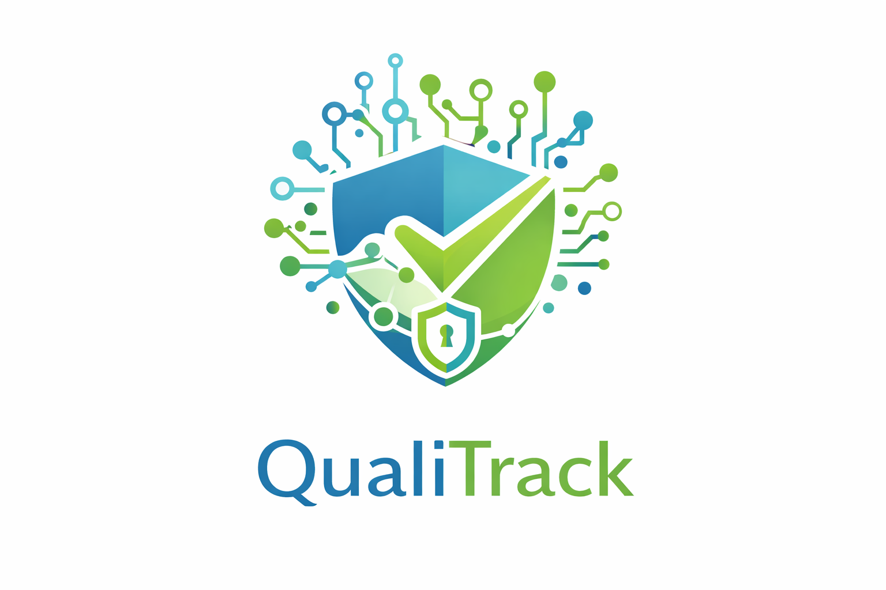
</td>
<td style="text-align: center; vertical-align: middle;">
<b>SAP (ERP)</b>

</td>
<td style="text-align: center; vertical-align: middle;">
<b>LabWare (LIMS)</b>

</td>
<td style="text-align: center; vertical-align: middle;">
<b>Métodos tradicionales</b>

</td>
</tr>
<tr>
<td rowspan="2"><b>Perfil</b></td>
<td>Overview</td>
<td>Plataforma SaaS enfocada en la gestión de calidad farmacéutica con integración IoT y trazabilidad en tiempo real.</td>
<td>Sistema ERP global con módulos de calidad y manufactura.</td>
<td>Software especializado en gestión de laboratorio (LIMS).</td>
<td>Registros en papel y hojas de cálculo (Excel).</td>
</tr>
<tr>
<td>Ventaja competitiva</td>
<td>Integración IoT, enfoque en normativas locales, modelo SaaS accesible.</td>
<td>Alta robustez e integración empresarial.</td>
<td>Especialización en procesos de laboratorio.</td>
<td>Bajo costo y facilidad de uso.</td>
</tr>
<tr>
<td rowspan="2"><b>Perfil de Marketing</b></td>
<td>Mercado objetivo</td>
<td>Laboratorios medianos y entidades públicas en LATAM.</td>
<td>Grandes corporaciones.</td>
<td>Laboratorios grandes y multinacionales.</td>
<td>Todo tipo de laboratorio.</td>
</tr>
<tr>
<td>Estrategias de marketing</td>
<td>Venta B2B, enfoque en cumplimiento regulatorio y precios accesibles.</td>
<td>Ventas corporativas y consultoría empresarial.</td>
<td>Ventas especializadas en sector laboratorio.</td>
<td>Uso interno sin estrategia formal.</td>
</tr>
<tr>
<td rowspan="3"><b>Perfil de Producto</b></td>
<td>Productos & Servicios</td>
<td>Plataforma web con dashboards, monitoreo en tiempo real y alertas.</td>
<td>Software empresarial modular.</td>
<td>Sistema estructurado de gestión de laboratorio.</td>
<td>Registros manuales o digitales básicos.</td>
</tr>
<tr>
<td>Precios & Costos</td>
<td>Suscripción SaaS escalable.</td>
<td>Costos elevados de implementación.</td>
<td>Licencias costosas.</td>
<td>Bajo costo.</td>
</tr>
<tr>
<td>Canales de distribución</td>
<td>Web, nube e integración con dispositivos IoT.</td>
<td>Implementación empresarial.</td>
<td>Implementación técnica especializada.</td>
<td>Uso interno.</td>
</tr>
<tr>
<td rowspan="5"><b>Análisis SWOT</b></td>
</tr>
<tr>
<td>Fortalezas</td>
<td>Integración IoT, trazabilidad en tiempo real, accesibilidad SaaS.</td>
<td>Sistema robusto y escalable.</td>
<td>Alta especialización en laboratorio.</td>
<td>Bajo costo y facilidad de uso.</td>
</tr>
<tr>
<td>Debilidades</td>
<td>Producto nuevo, dependencia de hardware, adopción del usuario.</td>
<td>Alto costo y complejidad.</td>
<td>Costos elevados y baja accesibilidad.</td>
<td>Alto riesgo de error y falta de trazabilidad.</td>
</tr>
<tr>
<td>Oportunidades</td>
<td>Crecimiento de digitalización en salud y cumplimiento regulatorio.</td>
<td>Expansión en grandes corporaciones.</td>
<td>Modernización e integración tecnológica.</td>
<td>Migración hacia soluciones digitales.</td>
</tr>
<tr>
<td>Amenazas</td>
<td>Competidores globales y resistencia al cambio.</td>
<td>Nuevas soluciones más accesibles.</td>
<td>Competencia SaaS más económica.</td>
<td>Regulaciones que exigen digitalización.</td>
</tr>
</table>

### 2.1.2. Estrategias y tácticas frente a competidores

Una vez identificados los actores del mercado, el siguiente paso es definir cómo QualiTrack logrará posicionarse frente a ellos. No basta con conocer a la competencia; es necesario establecer un plan de acción que permita aprovechar las ventajas del producto y reducir sus posibles limitaciones.

Para ello, se utiliza la Matriz CAME, una herramienta que permite transformar el análisis FODA en estrategias concretas, orientadas a fortalecer la propuesta de valor y mejorar el posicionamiento en el mercado.

A través de este enfoque, se plantean acciones orientadas a potenciar la integración IoT, el cumplimiento normativo y la accesibilidad del modelo SaaS, así como a mitigar riesgos como la resistencia al cambio y la entrada a un mercado con competidores consolidados.

Matriz CAME para el desarrollo de estrategias basadas en el análisis FODA.

| **Análisis FODA cruzado** | **Oportunidades** | **Amenazas** |
|---------------------------|------------------|--------------|
| **Fortalezas (F)** 1. Integración IoT para captura automática de datos. 2. Trazabilidad en tiempo real e inmutable. 3. Enfoque en normativas locales (DIGEMID). 4. Modelo SaaS accesible y escalable. | **Estrategia (FO) — Estrategias Ofensivas** 1. Establecer alianzas con laboratorios e instituciones de salud para implementar pilotos que validen la integración IoT y generen evidencia de reducción de errores. 2. Posicionar a QualiTrack como una solución especializada en cumplimiento normativo en LATAM, destacando su adaptación a DIGEMID. 3. Aprovechar el modelo SaaS para captar laboratorios medianos mediante planes accesibles y escalables. 4. Promover la automatización de procesos como principal ventaja competitiva frente a métodos manuales y sistemas aislados. 5. Impulsar campañas de concientización sobre la importancia de la integridad de datos en la industria farmacéutica. | **Estrategia (FA) — Estrategias Defensivas** 1. Fortalecer la seguridad e integridad de los datos mediante protocolos alineados a estándares regulatorios. 2. Brindar soporte técnico local y capacitación continua para facilitar la adopción del sistema. 3. Comunicar claramente el valor del cumplimiento normativo frente a soluciones genéricas o no especializadas. 4. Diseñar interfaces intuitivas que reduzcan la resistencia al cambio del personal operativo. 5. Difundir resultados de pilotos para generar confianza frente a competidores consolidados. |
| **Debilidades (D)** 1. Producto nuevo en el mercado. 2. Dependencia de integración con hardware (IoT). 3. Resistencia al cambio por parte de usuarios. 4. Limitada presencia inicial en el sector. | **Estrategia (DO) — Reorientación** 1. Implementar programas piloto en laboratorios para validar la propuesta de valor y generar casos de éxito. 2. Ofrecer capacitaciones y acompañamiento para facilitar la transición de procesos manuales a digitales. 3. Desarrollar una arquitectura modular que permita integrar IoT de forma progresiva. 4. Aprovechar la tendencia de digitalización del sector salud para impulsar la adopción del sistema. 5. Generar contenido técnico (casos de estudio, reportes) que respalde la efectividad de la solución. | **Estrategia (DA) — Supervivencia** 1. Reducir barreras de entrada mediante planes de bajo costo inicial y escalabilidad progresiva. 2. Simplificar la implementación técnica para minimizar la complejidad en nuevos clientes. 3. Enfocarse en nichos específicos como laboratorios medianos y sector público donde la competencia es menor. 4. Diferenciarse mediante una experiencia de usuario simple e intuitiva que facilite la adopción. 5. Establecer estrategias de crecimiento progresivo para consolidar presencia en el mercado antes de escalar. |

## 2.2. Entrevistas

Las entrevistas son clave para la metodología de diseño centrado en el usuario al permitirnos recolectar información cualitativa directamente de los actores que enfrentan la problematica identificada. A través del dialogo estructurado, se busca comprender las necesidades, comportamientos, frustaciones y expectativas de los segmentos objetivos, validando o refutando las hipótesis plantadas previamente.

### 2.2.1. Diseño de entrevistas

Teniendo en cuenta la importancia en la información que nos puede proveer los entrevistados, se presentan las preguntas clave para cada segmento objetivo. Para eso se considera dos tipos de preguntas: las personales, orientadas a conocer el perfil del entrevistado y las especificas, las cuales estan enfocadas en los procesos actuales, herramientas utilizadas, desafios operativos y expectativas frente a una solución tecnológica como QualiTrack.

<h4 id="Segmento" >Segmento objetivo: Gerentes y jefes de Aseguramiento de Calidad</h4>

<h4 id="PreguntaPersonal" >Preguntas Personales </h4>

- ¿Cuál es su nombre?
- ¿Cuál es su edad?
- ¿Cuál es su cargo actual dentro del laboratorio?
- ¿Cuál es su formación académica?

<h4 id="PreguntEspe">Preguntas específicas:</h4>

- ¿Cómo registran las variables críticas en esterilización/control de calidad?
- ¿Cómo gestionan la trazabilidad de lotes?
- En las últimas auditorías de DIGEMID, ¿con qué frecuencia han tenido observaciones o multas por integridad de datos/registros incompletos?
- ¿Cuánto tiempo les toma preparar la documentación para una auditoría?
- ¿Qué tan dispuestos estarían a reemplazar los registros manuales por una plataforma digital que capture automáticamente datos de sensores?
- ¿Cuáles son las principales barreras que han enfrentado para digitalizar procesos de calidad?

<h4 id="Segmento" >Segmento objetivo: Directores y supervisores de Entidades de Salud Pública</h4>

<h4 id="PreguntaPersonal" >Preguntas Personales </h4>

- ¿Cuál es su nombre?
- ¿Cuál es su edad?
- ¿Cuál es su rol dentro de la entidad de salud pública?
- ¿Cuál es su nivel de estudios?

<h4 id="PreguntEspe">Preguntas específicas:</h4>

- ¿Qué procesos de calidad o manufactura aún dependen de registros en papel o sistemas no integrados?
- ¿Cómo gestionan hoy la trazabilidad de lotes de productos biológicos o medicamentos críticos?
- ¿Qué desafíos específicos han enfrentado en auditorías relacionados con la integridad de los datos de producción?
- ¿Cómo se enteran de una desviación de parámetros durante la producción? ¿Existe algún mecanismo de alerta temprana?
- ¿Cuánto tiempo y recursos destinan a preparar evidencias para auditorías regulatorias?
- ¿Qué requisitos de seguridad y cumplimiento serían indispensables para adoptar una plataforma SaaS en el sector público?
- ¿Qué tipo de capacitación o acompañamiento necesitaría su personal técnico para migrar de registro manual a digital con integración IoT?

### 2.2.2. Registro de entrevistas

En esta sección se presentan los resultados de las entrevistas aplicadas a cada segmento objetivo. Para cada sesión, se incluye: datos del entrevistado, un resumen de las respuestas clave, observaciones del equipo y las principales conclusiones. Este registro sirve como evidencia para orientar las decisiones de diseño y funcionalidades de QualiTrack.

**Segmento 1: Gerentes y jefes de Aseguramiento de Calidad**

<table>
    <colgroup></colgroup>
    <thead>
        <tr>
            <th colspan="2">Entrevista #1 </th>
        </tr>
    </thead>
    <tbody>
        <tr>
            <td>Nombre</td>
            <td>Delcy</td>
        </tr>
        <tr>
            <td>Apellidos</td>
            <td>Castro Condori</td>
        </tr>
        <tr>
            <td>Edad</td>
            <td>59 años</td>
        </tr>
        <tr>
            <td>Distrito</td>
            <td>San Juan de Lurigancho</td>
        </tr>
        <tr>
            <td>Evidencia</td>
            <td>

</td>
        </tr>
        <tr>
            <td>Link</td>
            <td>
<a target="_blank" href="https://shorturl.at/CMWHx" title="Title">https://shorturl.at/CMWHx</a>
</td>
        </tr>
        <tr>
            <td>Timing donde inicia la entrevista </td>
            <td>00:00 min</td>
        </tr>
        <tr>
            <td>Duración de la entrevista </td>
            <td>04:55 min</td>
        </tr>
        <tr>
            <td>Resumen</td>
            <td>
            La Sra. Delci Castro Codorin es una experimentada profesional de 59 años, residente del distrito de San Juan de Lurigancho y Química Farmacéutica egresada de la Universidad Nacional Mayor de San Marcos. En su cargo actual como subdirectora de operaciones en una planta de radioisótopos y radiofármacos, lidera procesos de manufactura crítica donde la documentación técnica se gestiona bajo un esquema mixto; si bien cuentan con equipos modernos con salida digital e impresoras, la trazabilidad final depende de registros manuales consolidados en un dossier físico por cada lote.
               
            Comportamiento y Necesidades: Se percibe como una líder técnica meticulosa que valora el cumplimiento normativo estricto, pero reconoce la ineficiencia de los formatos tradicionales. Busca una solución que permita la captura de datos de manera simultánea para eliminar la variabilidad y el riesgo del llenado a mano exigido por DIGEMID. Su principal necesidad es optimizar las auditorías que se realizan cada cinco años mediante la reducción de la dependencia del papel.
               
            Tecnología, Marcas y Canales: Posee una alfabetización digital orientada a la gestión farmacéutica y sistemas de gestión de grado. Utiliza equipos de medición con capacidad de impresión digital y herramientas ofimáticas para la supervisión. Sus canales de referencia son las normativas de la DIGEMID y los sistemas de control de radiofármacos.
            </td>
        </tr>
    </tbody>
</table>

<table>
    <colgroup></colgroup>
    <thead>
        <tr>
            <th colspan="2">Entrevista #2 </th>
        </tr>
    </thead>
    <tbody>
        <tr>
            <td>Nombre</td>
            <td>Fredd</td>
        </tr>
        <tr>
            <td>Apellidos</td>
            <td>Palomino</td>
        </tr>
        <tr>
            <td>Edad</td>
            <td>41 años</td>
        </tr>
        <tr>
            <td>Distrito</td>
            <td>San Juan de Lurigancho</td>
        </tr>
        <tr>
            <td>Evidencia</td>
            <td>

</td>
        </tr>
        <tr>
            <td>Link</td>
            <td>
<a target="_blank" href="https://shorturl.at/CMWHx" title="Title">https://shorturl.at/CMWHx</a>
</td>
        </tr>
        <tr>
            <td>Timing donde inicia la entrevista </td>
            <td>04:56 min</td>
        </tr>
        <tr>
            <td>Duración de la entrevista </td>
            <td>4:57 min</td>
        </tr>
        <tr>
            <td>Resumen</td>
            <td>
            El Sr. Fredd Palomino de 41 años y residente de San Juan de Lurigancho, labora en el laboratorio del Instituto Nacional de la Salud, una institución de referencia en el país donde su equipo se dedica a la fabricación de productos farmacéuticos estériles. Esto exige un riguroso control de las condiciones ambientales y de los procesos para garantizar la ausencia de microorganismos. Para registrar las variables críticas del proceso, emplean un sistema mixto: papel emitido por equipos de medición y registros manuales de temperatura y presión.
               
            Comportamiento y Necesidades: Muestra una actitud favorable hacia la digitalización para agilizar la producción, la cual puede tomar hasta un año en etapa de preparación. Necesita automatizar el traslado de datos hacia informes virtuales en tiempo real para evitar la fatiga administrativa. Valora profundamente la confidencialidad y la integridad de la información generada durante la fabricación.
               
            Tecnología, Marcas y Canales: Usuario de hardware especializado en medición de variables críticas (presión, temperatura) y sistemas de documentación del INS. Utiliza formatos físicos para la trazabilidad completa del lote. Sus canales de comunicación y referencia técnica están alineados con los recordatorios y parámetros establecidos por la DIGEMID.
            </td>
        </tr>
    </tbody>
</table>

<table>
    <colgroup></colgroup>
    <thead>
        <tr>
            <th colspan="2">Entrevista #3 </th>
        </tr>
    </thead>
    <tbody>
        <tr>
            <td>Nombre</td>
            <td>Alberto</td>
        </tr>
        <tr>
            <td>Apellidos</td>
            <td>Valle Vega</td>
        </tr>
        <tr>
            <td>Edad</td>
            <td>68 años</td>
        </tr>
        <tr>
            <td>Distrito</td>
            <td>Arequipa</td>
        </tr>
        <tr>
            <td>Evidencia</td>
            <td>

</td>
        </tr>
        <tr>
            <td>Link</td>
            <td>
<a target="_blank" href="https://shorturl.at/CMWHx" title="Title">https://shorturl.at/CMWHx</a>
</td>
        </tr>
        <tr>
            <td>Timing donde inicia la entrevista </td>
            <td>09:53 min</td>
        </tr>
        <tr>
            <td>Duración de la entrevista </td>
            <td>4:57 min</td>
        </tr>
        <tr>
            <td>Resumen</td>
            <td>
            El Sr. Alberto Valle es un Químico Farmacéutico de 68 años con base en Arequipa, cuya trayectoria de cuatro décadas en la industria farmacéutica le otorga una visión profunda sobre los métodos de manufactura y control de calidad. Ha trabajado con diversos sistemas de producción, manteniendo siempre un enfoque estricto en el registro manual de variables según el producto.
               
            Comportamiento y Necesidades: Perfil disciplinado y habituado al rigor normativo que considera la industria como un entorno punitivo. Necesita un sistema de registro más sencillo y estandarizado que reduzca las cuatro semanas de preparación previa que demanda una auditoría. Busca mejorar la agilidad operativa sin comprometer los niveles de seguridad y cumplimiento del sector.
               
            Tecnología, Marcas y Canales: Experto en métodos tradicionales de anotación manual y formatos de registro de calidad y mantenimiento. Reconoce la alta disponibilidad y utilidad de los sistemas IoT actuales para las actualizaciones del sector. Su canal de referencia principal es la normativa vigente y los estándares de producción farmacéutica.
            </td>
        </tr>
    </tbody>
</table>

**Segmento 2: Directores y supervisores de Entidades de Salud Pública**

<table>
    <colgroup></colgroup>
    <thead>
        <tr>
            <th colspan="2">Entrevista #1 </th>
        </tr>
    </thead>
    <tbody>
        <tr>
            <td>Nombre</td>
            <td>Rosa</td>
        </tr>
        <tr>
            <td>Apellidos</td>
            <td>Amelia Mendonza</td>
        </tr>
        <tr>
            <td>Edad</td>
            <td>51 años</td>
        </tr>
        <tr>
            <td>Distrito</td>
            <td>San Isidro</td>
        </tr>
        <tr>
            <td>Evidencia</td>
            <td>

</td>
        </tr>
        <tr>
            <td>Link</td>
            <td>
<a target="_blank" href="https://shorturl.at/CMWHx" title="Title">https://shorturl.at/CMWHx</a>
</td>
        </tr>
        <tr>
            <td>Timing donde inicia la entrevista </td>
            <td>14:50 min</td>
        </tr>
        <tr>
            <td>Duración de la entrevista </td>
            <td>5:07 min</td>
        </tr>
        <tr>
            <td>Resumen</td>
            <td>
            La Sra. Rosa Amelia Mendoza de 51 años y residente de San Isidro, es Química Farmacéutica con maestría en Salud Pública y un diplomado en Control de Calidad. Actualmente supervisa la producción de vacunas en un laboratorio enfocado en el cumplimiento de los estándares de la DIGEMID. Su labor implica el control meticuloso tanto de la producción física como de la documentación histórica.
               
            Comportamiento y Necesidades: Se muestra proactiva y receptiva hacia herramientas que automaticen el almacenamiento de datos. Su principal dolor es la falta de funcionalidades digitales para generar historiales automáticos de temperatura y esterilización. Necesita una plataforma que elimine la documentación redundante a mano (realizada tres veces al día) para asegurar la integridad de los productos biológicos.
               
            Tecnología, Marcas y Canales: Utiliza herramientas digitales básicas que carecen de módulos de historial de variables críticas. Su entorno de trabajo incluye sensores de temperatura digitales que requieren transcripción manual a expedientes físicos. Se guía por los lineamientos de salud pública de la UNMSM y las directrices de control de calidad de la DIGEMID.
            </td>
        </tr>
    </tbody>
</table>

<table>
    <colgroup></colgroup>
    <thead>
        <tr>
            <th colspan="2">Entrevista #2 </th>
        </tr>
    </thead>
    <tbody>
        <tr>
            <td>Nombre</td>
            <td>Rocio</td>
        </tr>
        <tr>
            <td>Apellidos</td>
            <td>Santo Alegre</td>
        </tr>
        <tr>
            <td>Edad</td>
            <td>49 años</td>
        </tr>
        <tr>
            <td>Distrito</td>
            <td>Chorrillos</td>
        </tr>
        <tr>
            <td>Evidencia</td>
            <td>
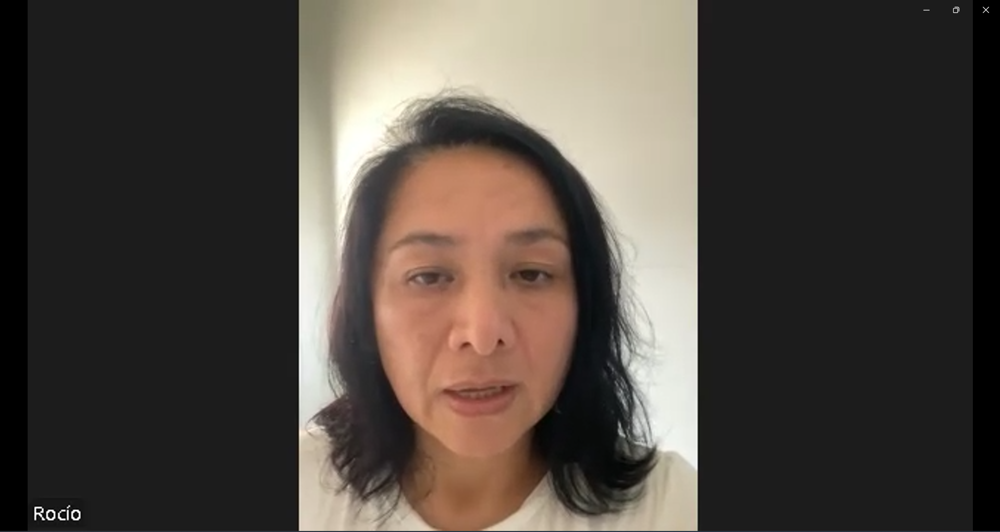
</td>
        </tr>
        <tr>
            <td>Link</td>
            <td>
<a target="_blank" href="https://shorturl.at/CMWHx" title="Title">https://shorturl.at/CMWHx</a>
</td>
        </tr>
        <tr>
            <td>Timing donde inicia la entrevista </td>
            <td>19:50 min</td>
        </tr>
        <tr>
            <td>Duración de la entrevista </td>
            <td>4:59 min</td>
        </tr>
        <tr>
            <td>Resumen</td>
            <td>
            La Sra. Rocío Santo Alegre , de 49 años y residente de Chorrillos, ejerce como Química Farmacéutica de producción en un laboratorio de radiactivos para diagnóstico. Ocupa el cargo de responsable del área desde hace ocho meses, supervisando procesos de alta precisión que aún no han sido migrados a la digitalización, lo que genera un flujo de trabajo basado en formatos impresos y escritura manual.
               
            Comportamiento y Necesidades: Valora la transparencia ante los auditores, pero sufre la lentitud y el desorden de los documentos físicos durante las inspecciones. Necesita un sistema de alerta temprana para detectar desviaciones de parámetros mientras el proceso está en marcha. Busca optimizar el tiempo de consulta de datos y reducir el riesgo de pérdida de documentos críticos del expediente de producción.
               
            Tecnología, Marcas y Canales: Su ecosistema tecnológico se limita al uso de Microsoft Word para estructurar órdenes de producción que luego se imprimen. Gestiona la información mediante expedientes de producción en papel llenados manualmente por operarios. Su canal de referencia es el conocimiento profundo de los procedimientos internos y normativas de radioisótopos.
            </td>
        </tr>
    </tbody>
</table>

<table>
    <colgroup></colgroup>
    <thead>
        <tr>
            <th colspan="2">Entrevista #3 </th>
        </tr>
    </thead>
    <tbody>
        <tr>
            <td>Nombre</td>
            <td>Risa</td>
        </tr>
        <tr>
            <td>Apellidos</td>
            <td>Sotelo</td>
        </tr>
        <tr>
            <td>Edad</td>
            <td>53 años</td>
        </tr>
        <tr>
            <td>Distrito</td>
            <td>San Isidro</td>
        </tr>
        <tr>
            <td>Evidencia</td>
            <td>
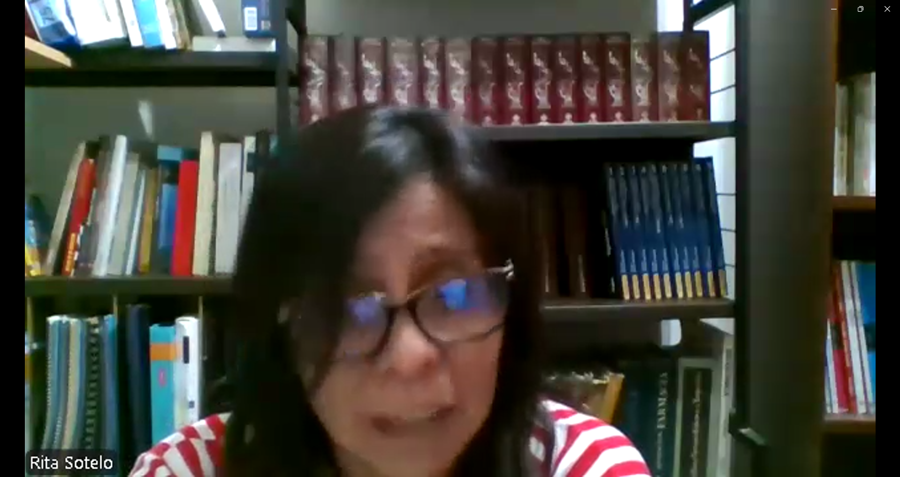
</td>
        </tr>
        <tr>
            <td>Link</td>
            <td>
<a target="_blank" href="https://shorturl.at/CMWHx" title="Title">https://shorturl.at/CMWHx</a>
</td>
        </tr>
        <tr>
            <td>Timing donde inicia la entrevista </td>
            <td>24:53 min</td>
        </tr>
        <tr>
            <td>Duración de la entrevista </td>
            <td>4:59 min</td>
        </tr>
        <tr>
            <td>Resumen</td>
            <td>
            Resumen: La Sra. Rita Sotelo es una profesional de 53 años residente de San Isidro con 30 años de experiencia en el sector farmacéutico, incluyendo laboratorios de renombre como MediFarma. Su rol actual se centra en la manufactura de productos biológicos, utilizando ya sistemas de registro digital para integrar protocolos de análisis y aseguramiento de la calidad.
               
            <b>Comportamiento y Necesidades:</b> Representa el perfil de usuario avanzado que ya experimenta los beneficios de la trazabilidad digital completa. Identifica la capacitación especializada como el requisito indispensable para la adopción exitosa de nuevas herramientas. Necesita que los sistemas garanticen la inalterabilidad del historial de cambios (Audit Trail) para cumplir con las exigencias internacionales de manufactura.
               
            Tecnología, Marcas y Canales: Usuaria de sistemas de manufactura digital y protocolos de análisis integrados en plataformas de software. Utiliza herramientas digitales para mapear la distribución de medicamentos hasta el punto de entrega. Sus influencias de marca y tecnología son las plataformas de manufactura digital validadas y los sistemas de gestión de bases de datos para el sector farmacéutico.
            </td>
        </tr>
    </tbody>
</table>

### 2.2.3. Análisis de entrevistas

En esta sección se presenta el análisis detallado de la información recolectada. Para cada segmento, se explican primero los hallazgos estadísticos objetivos y subjetivos, seguidos de la evidencia gráfica correspondiente.

#### Segmento 1: Gerentes y jefes de Aseguramiento de Calidad

**Análisis de Características Objetivas y Subjetivas:**
El análisis revela una alta dependencia de procesos análogos en el área de manufactura. Como se detalla en el gráfico a continuación, el **100%** de los jefes de calidad utiliza un **sistema mixto o netamente manual** (tickets físicos y llenado a mano) para el registro de variables críticas, y el **100%** ha recibido observaciones preventivas de DIGEMID respecto a la integridad de datos. Si bien un **33%** se apoya en sistemas logísticos robustos (como SAP), la falta de integración con la producción es crítica.
A nivel subjetivo, el **100%** valora positivamente la **digitalización y la captura IoT**. Sin embargo, existe una restricción clara: el **67%** manifiesta preocupación por los **retos de implementación**, ya sea por la resistencia cultural del personal antiguo o por la seguridad de los datos.

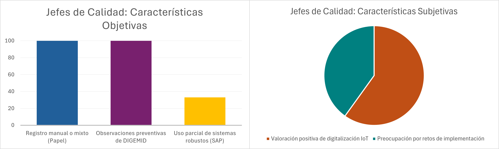

 

#### Segmento 2: Directores y supervisores de Entidades de Salud Pública

**Análisis de Características Objetivas y Subjetivas:**
Los datos confirman una brecha tecnológica severa en el control de calidad estatal. El **100%** reporta que el expediente de producción se elabora mediante **documentación manual** (Word y lapicero), y el **100%** indica que sus herramientas **no permiten un historial continuo**, forzándolos a registrar variables en turnos aislados.
Subjetivamente, el dolor principal es el riesgo regulatorio: el **100%** siente **frustración ante las auditorías** por la falta de información rápida. Reconociendo que el papel ralentiza el trabajo, el **100%** considera indispensable una solución que **almacene constantemente las variaciones** para mitigar el error humano.

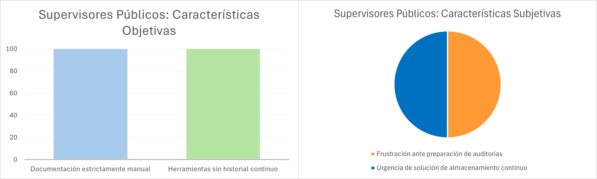

 

#### Análisis Comparativo

**Contrastación de Segmentos:**
Al comparar ambos grupos, encontramos coincidencias vitales para el producto: ambos tienen un **100% de dependencia documentaria en papel** y una necesidad unánime de asegurar la trazabilidad. Sin embargo, existe una brecha notable en la percepción de los obstáculos: mientras los gerentes (Segmento 1) prevén retos de adopción y seguridad informática (**67%** de preocupación), los supervisores públicos (Segmento 2) priorizan la urgencia de resolver el desorden operativo ante el auditor. Esto define la propuesta de valor: inmutabilidad y seguridad para la gerencia, y automatización continua para aliviar la carga del supervisor.

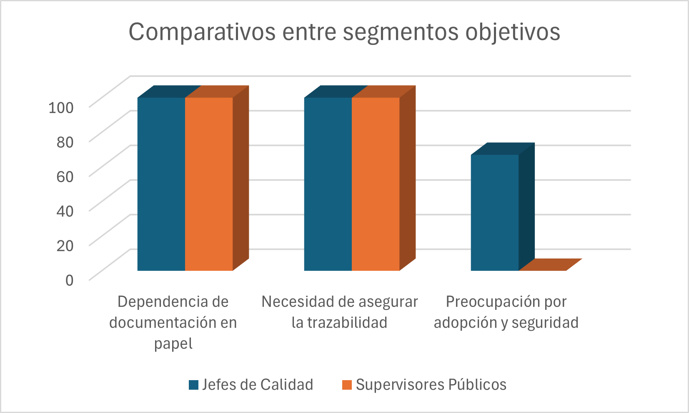

 

### Conclusiones y Definición de Arquetipos

Basado en el análisis estadístico, se definen los siguientes perfiles para los User Personas:

1.  **User Persona Jefe de Calidad:**
    * **Rasgo clave:** Busca modernizar la planta pero teme la fricción cultural y las vulnerabilidades de datos.
    * **Sustento:** El 100% valora la captura IoT, pero el 67% se preocupa por la implementación. La solución debe garantizar firmas seguras y ser amigable para operarios sin experiencia digital.
2.  **User Persona Supervisor Público:**
    * **Rasgo clave:** Necesita orden absoluto y trazabilidad continua para proteger la salud pública y superar auditorías.
    * **Sustento:** El 100% se frustra al recopilar papeles para auditorías y sufre por los registros manuales aislados. La solución debe centrarse en historiales (Batch Records) autogenerados y alertas continuas.

## 2.3. Needfinding

### 2.3.1. User Personas

A partir del análisis de entrevistas y la recolección de información sobre las dinámicas en los laboratorios de producción y control de calidad, se identificaron los principales perfiles de usuarios que interactúan directamente con la solución QualiTrack. Estos perfiles representan los segmentos clave para el sistema, ya que concentran tanto la necesidad de asegurar la integridad de los datos operativos como la necesidad de optimizar la preparación ante auditorías regulatorias. La construcción de los *User Persona* permite al equipo de desarrollo comprender mejor sus motivaciones, frustraciones y hábitos, lo que resulta esencial para diseñar funcionalidades adecuadas y experiencias de usuario efectivas.

**1) Segmento 1: Gerentes y Jefes de Aseguramiento de Calidad**

Para este segmento se elaboró el User Persona **Valeria Castro**. Se consideraron factores como su experiencia en el sector industrial farmacéutico, su rol liderando la liberación de lotes y su responsabilidad directa frente a las inspecciones de la DIGEMID. Sus principales frustraciones giran en torno a la dependencia de registros en papel (batch records) y la pérdida de tiempo reconstruyendo el historial de producción de forma manual, lo que aumenta el riesgo de observaciones por integridad de datos. Asimismo, se tomó en cuenta su familiaridad con herramientas digitales y su necesidad de contar con una plataforma que automatice la captura de variables mediante sensores IoT, garantizando firmas confiables y manteniendo el laboratorio "siempre listo" para las auditorías.

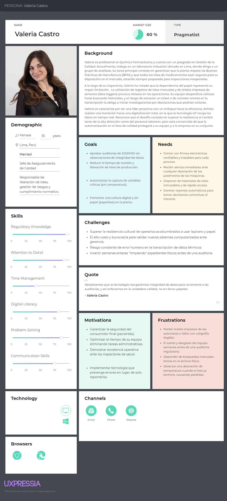

 

**2) Segmento 2: Directores y Supervisores de Entidades de Salud Pública**

Para este segmento se elaboró el User Persona **Rosa Amelia Mendoza**. Se consideraron aspectos como su formación científica y su rol en la supervisión de la producción de biológicos o vacunas a nivel estatal. Sus motivaciones están orientadas a estandarizar los procesos de manufactura cumpliendo estrictamente con las normativas nacionales de salud. Entre sus frustraciones se encuentra la falta de sistemas integrados, lo que obliga a su personal a realizar mediciones manuales constantemente, generando brechas de seguridad en la información y lentitud operativa. Su perfil refleja una necesidad crítica de sistemas inmutables y de trazabilidad en tiempo real que garanticen la seguridad pública de manera amigable para el personal técnico.

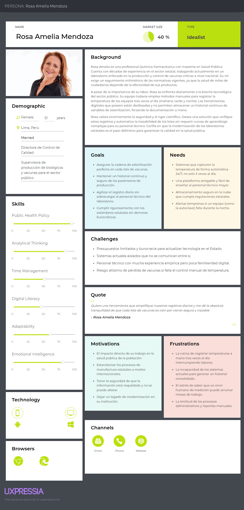

### 2.3.2. User Task Matrix

El User Task Matrix presenta las tareas que realizan los User Persona para cumplir sus objetivos en su día a día, independientemente de si usan nuestro software o no. Se evalúa la frecuencia y la importancia de cada tarea para identificar dónde aportar valor.

<table border="1" cellpadding="8" cellspacing="0" style="border-collapse:collapse; width:100%; font-family:Arial, sans-serif; text-align:center;">
  <thead>
    <tr style="background-color:#eef3f7;">
      <th rowspan="2">Tarea (Task)</th>
      <th colspan="2">Jefa de Calidad (Valeria)</th>
      <th colspan="2">Dir. de Salud Pública (Rosa)</th>
    </tr>
    <tr style="background-color:#eef3f7;">
      <th>Frecuencia</th>
      <th>Importancia</th>
      <th>Frecuencia</th>
      <th>Importancia</th>
    </tr>
  </thead>
  <tbody>
    <tr>
      <td style="text-align:left;">Registrar variables críticas (temperatura, pH, esterilización)</td>
      <td>Often</td><td>High</td>
      <td>Often</td><td>High</td>
    </tr>
    <tr>
      <td style="text-align:left;">Rastrear y consolidar el historial de un lote de producción</td>
      <td>Often</td><td>High</td>
      <td>Often</td><td>Medium</td>
    </tr>
    <tr>
      <td style="text-align:left;">Preparar documentación para auditorías de DIGEMID</td>
      <td>Occasionally</td><td>High</td>
      <td>Occasionally</td><td>High</td>
    </tr>
    <tr>
      <td style="text-align:left;">Atender alertas de desviación de equipos (ej. autoclaves)</td>
      <td>Occasionally</td><td>High</td>
      <td>Occasionally</td><td>High</td>
    </tr>
    <tr>
      <td style="text-align:left;">Aprobar y firmar digitalmente la liberación de lotes</td>
      <td>Often</td><td>High</td>
      <td>Often</td><td>High</td>
    </tr>
    <tr>
      <td style="text-align:left;">Generar reportes estadísticos de calidad para gerencia</td>
      <td>Often</td><td>Medium</td>
      <td>Monthly</td><td>High</td>
    </tr>
    <tr>
      <td style="text-align:left;">Capacitar al personal técnico en buenas prácticas (BPM)</td>
      <td>Rarely</td><td>Medium</td>
      <td>Rarely</td><td>Medium</td>
    </tr>
  </tbody>
</table>

**Análisis del Task Matrix:**
Se observa que las tareas **"Registrar variables críticas"** y **"Aprobar y firmar digitalmente la liberación de lotes"** tienen una Importancia **High** y Frecuencia **Often** para ambos segmentos, ya que representan el núcleo operativo de la manufactura segura. Esto confirma que estas tareas son el "Core" del negocio y deben ser priorizadas mediante automatización IoT. Además, la tarea crítica de **"Preparar documentación para auditorías"**, aunque es *Occasionally*, tiene una importancia altísima (**High**) para ambos, validando la necesidad de un sistema inmutable y trazable para evitar penalidades de la DIGEMID.

### 2.3.3. User Journey Mapping
El User Journey Mapping es una herramienta visual que nos permite "caminar en los zapatos" del usuario.Aquí, trazamos un mapa del emocionalrecorrido y trayectoria operativaque realizan tanto los administradores como las personas cercanas en determinadas situaciones.que tanto los administradores como las personas conocidas adoptan en determinadas situaciones.

**1) Segmento objetivo: Gerentes y jefes de Aseguramiento de Calidad (Valeri Castrol)**

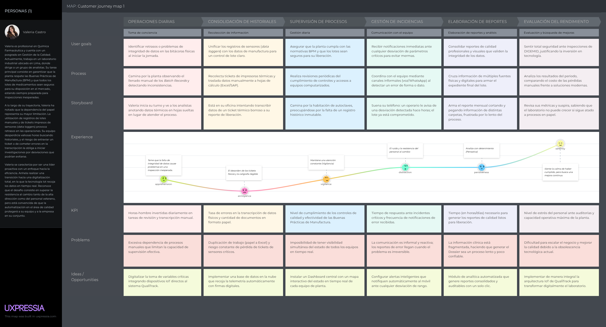

**2) Segmento objetivo: Directores y supervisores de Entidades de Salud Pública (Rosa Amelia Mendoza)**

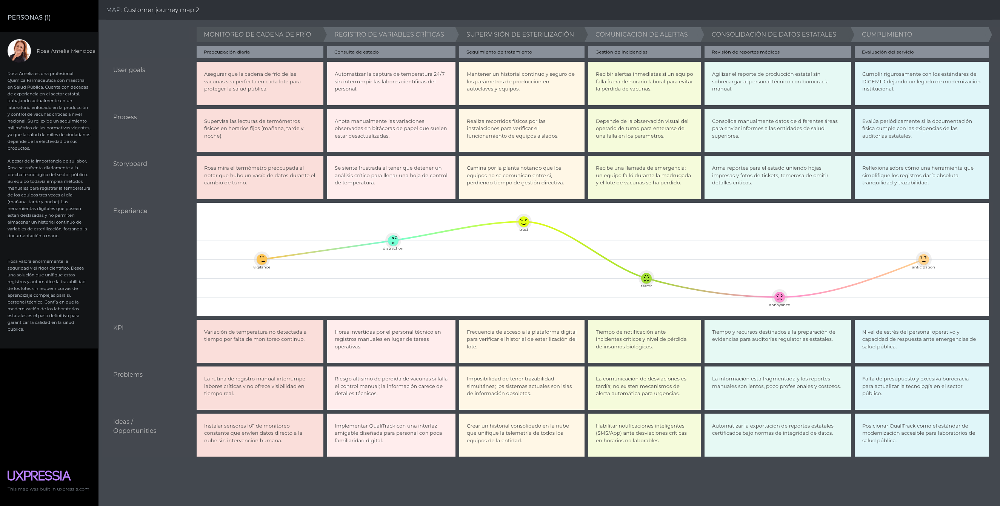

### 2.3.4. Empathy Mapping
Para crear una solución que realmente se vincula con las personas, no es suficiente con saber qué hacen; Tenemos que comprender lo que sienten. El Empathy Mapping es una herramienta que nos posibilita ir más allá de la información demográfica y adentrarnos en el mundo interno de los usuarios.es un instrumento que nos posibilita ir más allá de la información demográfica y adentrarnos en el mundo interno.los usuarios. Al examine lo que el administrador y los familiares observan, escuchan, dicen y hacen, conseguimos reconocer sus temores y sus deseos.

**1) Segmento objetivo: Gerentes y jefes de Aseguramiento de Calidad**

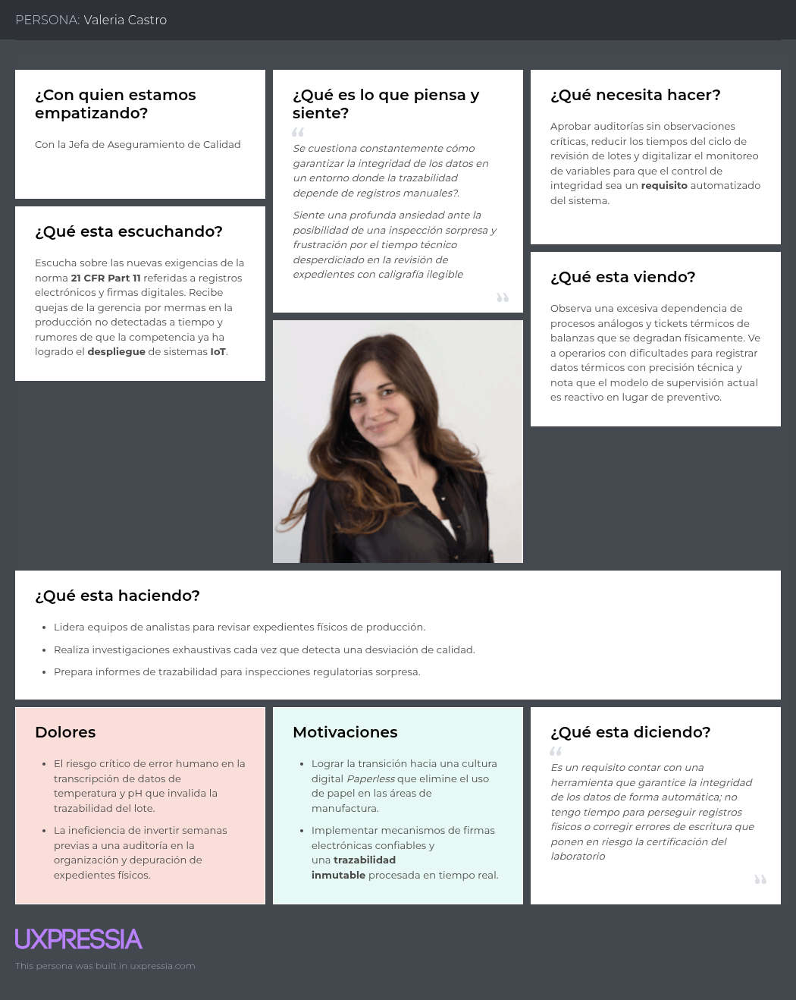

**2) Segmento objetivo: Directores y supervisores de Entidades de Salud Pública**

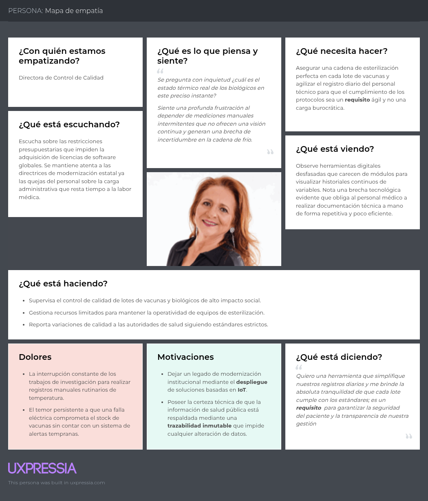

## 2.4. Big Picture Event Storming

Es necesario comprender el negocio en su totalidad, sin tecnicismos involucrados, antes de crear un sistema sólido. El Big Picture Event Storming es un método colaborativo que facilita la visualización de todos los sucesosque tienen lugar en una casa de reposo. Al Estructurar estos eventos de forma lógica y cronológica, conseguimos detectar los flujos cruciales del negocio y los lugares en los que la información tiende a retrasarse o a perderse.

En esta primera fase, el equipo llevó a cabo una lluvia de ideas con el fin de recopilar todos los eventos pertinentes al dominio, sin importar la secuencia o la jerarquía. El El propósito principal fue ilustrar los sucesos reales del negocio, sin depender de ninguna función técnica o vinculada a un sistema.

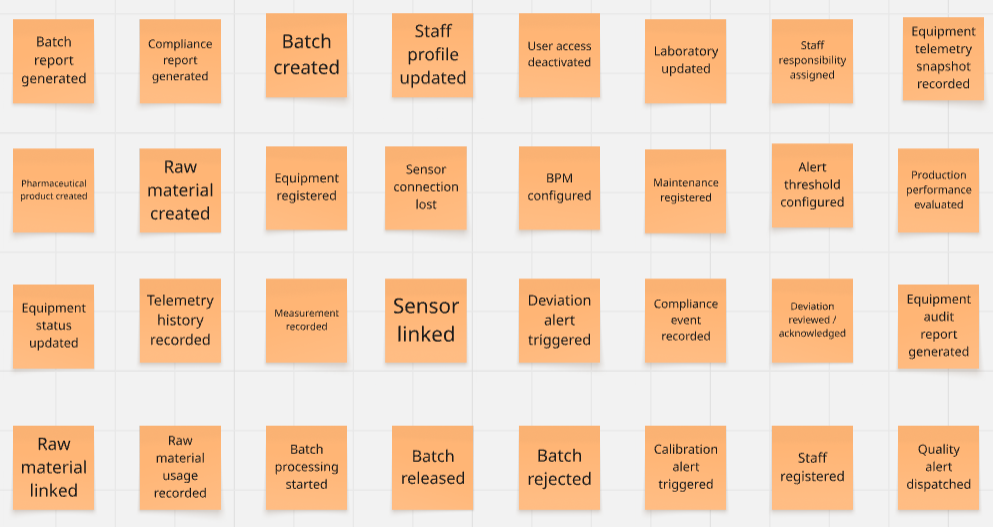

## 2.5. Ubiquitous Language

Este glosario asegura que los desarrolladores, los químicos farmacéuticos y los
auditores de DIGEMID compartan un marco conceptual idéntico, garantizando que el
software sea una extensión fiel de las normativas de manufactura farmacéutica.
Los términos definidos aquí se reflejan directamente en los nombres de clases,
interfaces, comandos, rutas y bounded contexts del código fuente de QualiTrack.

| Término | Definición |
|---|---|
| **Laboratory** | Entidad institucional (privada o pública) que gestiona procesos de manufactura, equipos industriales y personal dentro de la plataforma. Es la unidad raíz del sistema: todos los equipos, lotes y usuarios pertenecen a un laboratorio. Se mapea a la entidad `Laboratory` y al bounded context `laboratory-management`. |
| **QA Manager** | Usuario responsable del aseguramiento de la calidad. Supervisa la producción, gestiona roles del personal, configura los parámetros BPM de los equipos y autoriza la liberación final de lotes mediante firma digital. Se mapea a `UserRole.QA_MANAGER` en el bounded context `iam`. |
| **Lab Operator** | Usuario técnico encargado de la ejecución diaria de la producción. Monitorea el estado de los equipos en tiempo real, recibe alertas de desviación y registra observaciones del proceso. Se mapea a `UserRole.LAB_OPERATOR` en el bounded context `iam`. |
| **Equipment** | Equipo industrial del laboratorio (autoclave, medidor de pH, sensor de presión) vinculado a la plataforma mediante un identificador único de dispositivo (`deviceId`) para transmitir telemetría automáticamente. Se mapea a la entidad `Equipment` en el bounded context `equipment-management`. |
| **Device Binding** | Vínculo entre un sensor IoT y un equipo registrado en la plataforma. Sin binding activo, el sistema rechaza la telemetría entrante. Se mapea a `DeviceBinding` en el bounded context `tracking`. |
| **BPM Parameters** | Conjunto de valores mínimos y máximos permitidos configurados para cada variable crítica (temperatura, presión, pH) de un equipo. Definen el rango de cumplimiento normativo. Se mapea a `BpmParameterConfig` en `equipment-management`. |
| **Measurement** | Registro individual de telemetría capturado por un sensor IoT en un instante de tiempo. Contiene las variables críticas del proceso (temperatura, presión, pH) y se asocia al equipo y lote correspondiente. Se mapea a la entidad `Measurement` en `tracking`. |
| **Telemetry** | Flujo continuo y automático de mediciones enviadas por los sensores IoT hacia la plataforma. Elimina el registro manual de variables y constituye la fuente de verdad para el compliance BPM. Se mapea al bounded context `tracking`. |
| **Compliance Event** | Resultado de evaluar una medición contra los parámetros BPM configurados. Puede ser CONFORM, WARNING, DEVIATION o CRITICAL_DEVIATION. Se mapea a la entidad `ComplianceEvent` en `compliance-alerting`. |
| **Deviation** | Evento detectado automáticamente cuando una variable crítica supera o cae por debajo del rango BPM configurado. Desencadena una alerta inmediata y puede provocar el bloqueo automático del lote asociado. |
| **Deviation Alert** | Notificación automática generada por el motor de compliance cuando se detecta un riesgo de calidad. Incluye el equipo afectado, la variable desviada, el valor detectado y la severidad. Se mapea a `DeviationAlert` en `compliance-alerting`. |
| **Deviation Severity** | Clasificación de la gravedad de una desviación: WARNING (advertencia sin bloqueo), CRITICAL (bloqueo inmediato del lote) o CATASTROPHIC (bloqueo y escalamiento). |
| **Batch** | Cantidad específica de un producto farmacéutico producida en un único ciclo de manufactura, identificada por un código único de trazabilidad (`batchCode`). Se mapea a la entidad `Batch` en `batch-management`. |
| **Batch Status** | Estado del ciclo de vida de un lote: IN_PROCESS, BLOCKED, UNDER_INVESTIGATION, RELEASED, REJECTED o COMPLETED. Las transiciones de estado siguen reglas estrictas del dominio. |
| **Blocking** | Estado restrictivo aplicado automáticamente a un lote cuando se detecta una desviación crítica, impidiendo su avance en la cadena de suministro hasta ser investigado. Se mapea al estado `BatchStatus.BLOCKED`. |
| **Raw Material Usage** | Registro de trazabilidad de las materias primas utilizadas en la fabricación de un lote específico, incluyendo proveedor, número de lote del proveedor y cantidad empleada. Se mapea a `RawMaterialUsage` en `batch-management`. |
| **Digital Signature** | Mecanismo de autenticación segura que reemplaza las firmas físicas para certificar la conformidad y liberación de un lote. Registra el QA Manager responsable y el timestamp de la firma. Se mapea a `DigitalSignature` en `batch-management`. |
| **Batch Record** | Archivo digital e inmutable que recopila toda la telemetría, firmas digitales e intervenciones asociadas a un lote de producción. Es el documento central para las inspecciones de DIGEMID. |
| **Audit Log** | Registro cronológico e inalterable de todas las acciones realizadas por los usuarios en el sistema. Garantiza la trazabilidad de quién hizo qué y cuándo. Se mapea a `AuditLogEntry` en `reporting-audit`. |
| **Audit Report** | Documento PDF inmutable generado por la plataforma con el historial completo de un lote o periodo, listo para presentar en inspecciones regulatorias. Se mapea a `AuditReport` en `reporting-audit`. |
| **KPI Metric** | Indicador clave de calidad calculado a partir de los datos históricos del laboratorio (porcentaje de lotes conformes, número de desviaciones, tiempo promedio de liberación). Se mapea a `KpiMetric` en `reporting-audit`. |
| **Data Integrity** | Principio regulatorio que garantiza que toda la información es atribuible, legible, contemporánea, original y precisa (ALCOA+). Es el eje normativo de toda la arquitectura de QualiTrack. |
| **Notification Preference** | Configuración por usuario que define los canales habilitados para recibir alertas críticas (email, web push, SMS). Se mapea a `NotificationPreference` en `compliance-alerting`. |
| **SaaS Subscription** | Modelo de acceso escalable a la plataforma basado en el volumen de datos procesados y el número de dispositivos IoT vinculados. Define el plan Standard Lab o Enterprise del laboratorio. |

**Beneficios esperados del lenguaje ubicuo:**

- Elimina ambigüedades entre desarrolladores, usuarios farmacéuticos y auditores
  regulatorios al compartir un vocabulario común aplicado tanto en el código fuente
  como en la documentación y la interfaz de usuario.
- Garantiza que los nombres de bounded contexts, entidades, comandos y rutas del
  frontend Angular y el backend Spring Boot reflejen fielmente el lenguaje del
  dominio farmacéutico peruano regulado por DIGEMID.
- Reduce errores de implementación al alinear directamente los términos del negocio
  con las clases, interfaces y stores de la arquitectura DDD de QualiTrack.
- Asegura consistencia entre toda la documentación técnica, las interfaces de usuario
  y los reportes generados para auditorías regulatorias.
