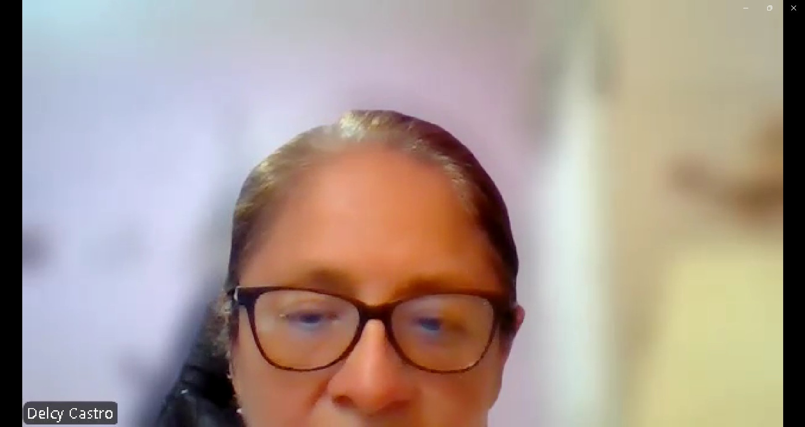
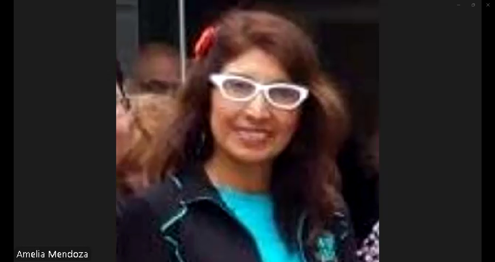

# Capítulo II: Requirements Elicitation & Analysis

## 2.1. Competidores

Para desarrollar una solución realmente útil, es fundamental comprender el entorno competitivo y las alternativas que actualmente utilizan los laboratorios farmacéuticos. Este análisis permite identificar cómo se gestionan hoy los procesos de calidad y qué limitaciones presentan las soluciones existentes.

En esta etapa, se analizan distintos tipos de competidores con el objetivo de entender sus fortalezas y debilidades, y así posicionar a QualiTrack como una propuesta que responda de manera más efectiva a las necesidades reales del sector.

### 2.1.1. Análisis competitivo

Para comprender el entorno en el que se desarrollará QualiTrack, se realizó un análisis competitivo que permite identificar las principales soluciones utilizadas en la gestión de calidad farmacéutica, así como sus enfoques y limitaciones.

A continuación, se presenta una comparación de los competidores considerando su propuesta de valor, mercado objetivo y funcionalidades, con el fin de definir el posicionamiento de QualiTrack frente a ellos.

<table border="1" cellpadding="10" cellspacing="0" style="margin-left: auto; margin-right: auto; font-family: sans-serif;">
<tr>
<th colspan="6">Panorama del análisis competitivo</th>
</tr>
<tr>
<td colspan="2" rowspan="2"><b>¿Por qué llevar a cabo este análisis?</b></td>
<td colspan="4">¿Cómo se posiciona Veyra frente a sus competidores en cuanto a propuesta de valor, marketing, producto y estrategia?</td>
</tr>
<tr>
<td colspan="4">Es un análisis comparativo que permite identificar fortalezas, debilidades, oportunidades y amenazas, así como entender mejor la posición del producto frente a otros actores relevantes del mercado.</td>
</tr>
<tr>
<td colspan="2" style="text-align: center;"><b>Competidores</b></td>
<td style="text-align: center; vertical-align: middle;">
<b>Veyra</b>

</td>
<td style="text-align: center; vertical-align: middle;">
<b>StoriiCare</b>

</td>
<td style="text-align: center; vertical-align: middle;">
<b>SeniorSoft</b>

</td>
<td style="text-align: center; vertical-align: middle;">
<b>CareCloud</b>

</td>
</tr>
<tr>
<td rowspan="2"><b>Perfil</b></td>
<td>Overview</td>
<td>Plataforma SaaS integral enfocada en la gestión de casas de reposo y conexión con familias en Perú y Latinoamérica.</td>
<td>Software SaaS global para residencias de adultos mayores. Fundado en Reino Unido, con presencia en varios países.</td>
<td>Software de escritorio dirigido a grandes clínicas y residencias geriátricas.</td>
<td>Plataforma cloud completa para la gestión de salud general (EE.UU.). Ofrece EHR, facturación y portal de pacientes.</td>
</tr>
<tr>
<td>Ventaja competitiva</td>
<td>Especialización regional (normativas LATAM), modelo escalable, acceso bidireccional para familias y preparación para IoT.</td>
<td>Portal familiar muy desarrollado, integración de historias de vida y fotos, cuidado centrado en la persona.</td>
<td>Gestión integral potente para operaciones internas (historial clínico, facturación, inventario, camas).</td>
<td>Suite completa de funcionalidades clínicas y administrativas con integración nativa de sistemas de pago.</td>
</tr>
<tr>
<td rowspan="2"><b>Perfil de Marketing</b></td>
<td>Mercado objetivo</td>
<td>Casas de reposo medianas/pequeñas y familias en LATAM.</td>
<td>Residencias en UK, US, Australia y Canadá.</td>
<td>Grandes clínicas geriátricas en mercados específicos.</td>
<td>Clínicas y centros de salud de todos los tamaños en EE.UU.</td>
</tr>
<tr>
<td>Estrategias de marketing</td>
<td>Marketing digital, alianzas con asociaciones geriátricas y precios flexibles.</td>
<td>Marketing de contenidos, redes sociales y testimonios de clientes.</td>
<td>Ventas directas enfocadas a grandes clientes institucionales.</td>
<td>Ventas directas y marketing especializado en el sector salud estadounidense.</td>
</tr>
<tr>
<td rowspan="3"><b>Perfil de Producto</b></td>
<td>Productos & Servicios</td>
<td>Plataforma web y aplicación móvil.</td>
<td>Plataforma web y app específica para familias.</td>
<td>Software de instalación local (Escritorio).</td>
<td>CareCloud Central, Pulse y Companion.</td>
</tr>
<tr>
<td>Precios & Costos</td>
<td>Modelo modular: Planes Gratuito, Estándar y Premium.</td>
<td>Precios en libras/euros, no transparentes en el sitio web.</td>
<td>Precios no públicos, probablemente elevados por licenciamiento.</td>
<td>Costos elevados para el mercado LATAM, cotización bajo pedido.</td>
</tr>
<tr>
<td>Canales de distribución</td>
<td>Web, móvil (iOS/Android) y API para integraciones.</td>
<td>Web y dispositivos móviles.</td>
<td>Instalación local, sin acceso móvil nativo.</td>
<td>Web y dispositivos móviles.</td>
</tr>
<tr>
<td rowspan="5"><b>Análisis SWOT</b></td>
</td>
</tr>
<tr>
<td>Fortalezas</td>
<td>Especialización local y modelo de negocio escalable.</td>
<td>Enfoque en experiencia familiar y facilidad de uso.</td>
<td>Funcionalidades de gestión operativa muy sólidas.</td>
<td>Producto robusto, muy completo y reconocido.</td>
</tr>
<tr>
<td>Debilidades</td>
<td>Marca nueva con poca trayectoria en el mercado.</td>
<td>Poca adaptación a normativas y precios de Latinoamérica.</td>
<td>Tecnología obsoleta (desktop), sin movilidad ni acceso familiar.</td>
<td>Precio prohibitivo para LATAM y complejidad de implementación.</td>
</tr>
<tr>
<td>Oportunidades</td>
<td>Crecimiento acelerado del sector geriátrico en LATAM.</td>
<td>Expansión a nuevos mercados internacionales.</td>
<td>Modernización de su plataforma hacia la nube.</td>
<td>Venta de servicios a grandes cadenas de salud.</td>
</tr>
<tr>
<td>Amenazas</td>
<td>Competidores globales con mayores recursos financieros.</td>
<td>Surgimiento de competidores locales en cada región.</td>
<td>Migración general de los clientes hacia soluciones cloud.</td>
<td>Aparición de soluciones más nicho y económicas.</td>
</tr>
</table>

(esta para editar esta tabla)

### 2.1.2. Estrategias y tácticas frente a competidores

Luego de haber realizado el análisis de nuestra solución con respecto a soluciones ya existentes, nuestro equipo procederá a plantear estrategias y tácticas que debemos poner en marcha para sobresalir de las otras soluciones.

## 2.2. Entrevistas

Las entrevistas son clave para la metodología de diseño centrado en el usuario al permitirnos recolectar información cualitativa directamente de los actores que enfrentan la problematica identificada. A través del dialogo estructurado, se busca comprender las necesidades, comportamientos, frustaciones y expectativas de los segmentos objetivos, validando o refutando las hipótesis plantadas previamente.

### 2.2.1. Diseño de entrevistas

Teniendo en cuenta la importancia en la información que nos puede proveer los entrevistados, se presentan las preguntas clave para cada segmento objetivo. Para eso se considera dos tipos de preguntas: las personales, orientadas a conocer el perfil del entrevistado y las especificas, las cuales estan enfocadas en los procesos actuales, herramientas utilizadas, desafios operativos y expectativas frente a una solución tecnológica como QualiTrack.

<h4 id="Segmento" >Segmento objetivo: Gerentes y jefes de Aseguramiento de Calidad</h4>

<h4 id="PreguntaPersonal" >Preguntas Personales </h4>

- ¿Cuál es su nombre?
- ¿Cuál es su edad?
- ¿Cuál es su cargo actual dentro del laboratorio?
- ¿Cuál es su formación académica?

<h4 id="PreguntEspe">Preguntas específicas:</h4>

- ¿Cómo registran actualmente las variables críticas de producción durante los procesos de esterilización o control de calidad?
- ¿Qué tipo de sistema o herramienta utiliza su laboratorio para gestionar la trazabilidad de los lotes?
- ¿Con qué frecuencia han recibido observaciones o multas por parte de DIGEMID en las últimas auditorías relacionadas con la integridad de datos o registros incompletos?
- ¿Cuánto tiempo suele tomar a su equipo preparar la documentación para una auditoría regulatoria?
- ¿Qué tan dispuesto estaría su equipo a reemplazar los registros manuales por una plataforma digital que capture automáticamente los datos de sensores?
- ¿Cuáles son las principales barreras que ha enfrentado para digitalizar los procesos de calidad?

<h4 id="Segmento" >Segmento objetivo: Directores y supervisores de Entidades de Salud Pública</h4>

<h4 id="PreguntaPersonal" >Preguntas Personales </h4>

- ¿Cuál es su nombre?
- ¿Cuál es su edad?
- ¿Cuál es su rol dentro de la entidad de salud pública?
- ¿Cuál es su nivel de estudios?

<h4 id="PreguntEspe">Preguntas específicas:</h4>

- ¿Qué procesos de control de calidad o manufactura se realizan actualmente en su institución que aún dependen de registros en papel o sistemas no integrados?
- ¿Cómo se gestiona actualmente la trazabilidad de los lotes de productos biológicos o medicamentos críticos producidos por su entidad?
- ¿Qué desafíos específicos ha enfrentado su institución durante auditorías internas o externas en relación con la integridad de los datos de producción?
- ¿Qué nivel de interoperabilidad requieren con otros sistemas estatales?
- ¿Cómo se enteran actualmente de una desviación de parámetros durante la producción? ¿Existe algún mecanismo de alerta temprana?
- ¿Cuánto tiempo y recursos se destinan actualmente a la preparación de informes y evidencias para las auditorías regulatorias?
- ¿Qué requisitos de seguridad y cumplimiento normativo serían indispensables para adoptar una plataforma SaaS en el sector público?
- ¿Qué tipo de capacitación o acompañamiento necesitaria su personal técnico y operativo para migrar de un regístro manual a uno digital con integración IoT?

### 2.2.2. Registro de entrevistas

En esta sección se presentan los resultados de las entrevistas aplicadas a cada segmento objetivo. Para cada sesión, se incluye: datos del entrevistado, un resumen de las respuestas clave, observaciones del equipo y las principales conclusiones. Este registro sirve como evidencia para orientar las decisiones de diseño y funcionalidades de QualiTrack.

**Segmento 1: Gerentes y jefes de Aseguramiento de Calidad**

<table>
    <colgroup></colgroup>
    <thead>
        <tr>
            <th colspan="2">Entrevista #1 </th>
        </tr>
    </thead>
    <tbody>
        <tr>
            <td>Nombre</td>
            <td>Delcy</td>
        </tr>
        <tr>
            <td>Apellidos</td>
            <td>Castro Condori</td>
        </tr>
        <tr>
            <td>Edad</td>
            <td>59 años</td>
        </tr>
        <tr>
            <td>Distrito</td>
            <td>San Juan de Lurigancho</td>
        </tr>
        <tr>
            <td>Evidencia</td>
            <td>

</td>
        </tr>
        <tr>
            <td>Link</td>
            <td>
<a target="_blank" href="https://shorturl.at/KhSHa" title="Title">https://shorturl.at/KhSHa</a>
</td>
        </tr>
        <tr>
            <td>Timing donde inicia la entrevista </td>
            <td>00:19 min</td>
        </tr>
        <tr>
            <td>Duración de la entrevista </td>
            <td>10:39 min</td>
        </tr>
        <tr>
            <td>Resumen</td>
            <td>
            La Sra. Delci Castro Codorin es química farmacéutica y subdirectora de la operación de la planta de radioisótopos y radiofármacos; egresada de la Universidad Nacional Mayor de San Marcos, actualmente cursa una maestría en Ingeniería Industrial enfocada en el emprendimiento, y ha llevado diplomados en regulación, preparación y control de radiofármacos, así como capacitaciones en protección radiológica y en sistemas de gestión de grado. 
               
            Dentro de la planta, se presenta el proceso de producción de los fármacos y se destaca que los registros se realizan de dos maneras: manual y digital. A partir de los registros manuales se identifican automáticamente los lotes, cada uno con su propia unidad documentaria, donde se registran la materia prima y los controles efectuados en cada uno de los dispositivos (los cuales han sido codificados previamente). Asimismo, la distribución también se registra por lotes.
               
            Ella menciona que no hubo casos de reportes relacionados con una auditoría insuficiente por parte de la Dirección General de Medicamentos, Insumos y Drogas (DIGEMID), ni registros incompletos o erróneos. Lo que sí se reportaron fueron recomendaciones sobre otros sistemas que podrían beneficiar a la organización en las auditorías y los registros, además de recordatorios sobre el formato de documentación.
            </td>
        </tr>
    </tbody>
</table>

**Segmento 2: Directores y supervisores de Entidades de Salud Pública**

<table>
    <colgroup></colgroup>
    <thead>
        <tr>
            <th colspan="2">Entrevista #1 </th>
        </tr>
    </thead>
    <tbody>
        <tr>
            <td>Nombre</td>
            <td>Rosa</td>
        </tr>
        <tr>
            <td>Apellidos</td>
            <td>Amelia Mendonza</td>
        </tr>
        <tr>
            <td>Edad</td>
            <td>51 años</td>
        </tr>
        <tr>
            <td>Distrito</td>
            <td>San Isidro</td>
        </tr>
        <tr>
            <td>Evidencia</td>
            <td>

</td>
        </tr>
        <tr>
            <td>Link</td>
            <td>
<a target="_blank" href="https://shorturl.at/DMyrs" title="Title">https://shorturl.at/DMyrs</a>
</td>
        </tr>
        <tr>
            <td>Timing donde inicia la entrevista </td>
            <td>00:11 min</td>
        </tr>
        <tr>
            <td>Duración de la entrevista </td>
            <td>19:34 min</td>
        </tr>
        <tr>
            <td>Resumen</td>
            <td>
            La Sra. Rosa Amelia Mendoza es una profesional quimica farmaceutica con maestria en el area de Salud Publica por esudios dentro de la Universidad Nacional Mayor de San Marcos junto con un Diplomado de "Control de Calidad", trabajando en un laboratorio que esta enfocado en el control de la produccón de vacunas.
               
            En su rol se presenta la observación y control tanto del proceso de producción de vacunas como la documentación siguiendo las indicaciones y estandares de la organización Dirección General de Medicamentos, Insumos y Drogas (DIGEMID).
               
            Ella indica que aún se emplea un metodo de documentación y regulación manual en el proceso de producción y analisís de las vacunas dentro del laborotiro, ya que las herramientas digitales que poseen no presentan funcionalidades que documente como un historial datos clave como la temperatura y el nivel de esterilzación, forzando la documentación a mano.
               
            Entre las herramientas que considera dispensables mencionó la capacidad de almacenar constantemente los cambios y variaciones en el control de la calidad de los lotes, los cuales se refieren en su labor las vacunas. Un ejemplo clave es la temperatura, ya que se tiene un habito el documentar en la mañana, tarde y noche la temperatura mostrada por las herramientas digitales que presentan, lo cual muestra su dificultad en el ambito digital para simplificar el registro de calidad.
            </td>
        </tr>
    </tbody>
</table>

### 2.2.3. Análisis de entrevistas

## 2.3. Needfinding

### 2.3.1. User Personas

### 2.3.2. User Task Matrix

### 2.3.3. User Journey Mapping

### 2.3.4. Empathy Mapping

## 2.4. Big Picture Event Storming

## 2.5. Ubiquitous Language
