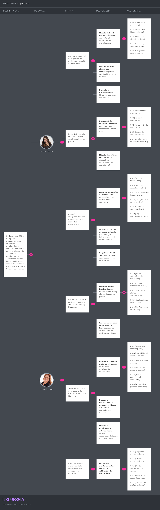

# Capítulo III: Requirements Specification

Este capítulo presenta la especificación de requisitos de QualiTrack a partir del análisis del problema, los segmentos objetivo y el alcance construido durante el desarrollo del producto. La especificación cubre tres productos de la solución: la landing page pública, la aplicación web frontend y los servicios backend RESTful implementados con una arquitectura basada en bounded contexts.

## 3.1. User Stories

<table>
  <thead>
    <tr>
      <th>Epic / Story ID</th>
      <th>Título</th>
      <th>Descripción</th>
      <th>Criterios de Aceptación</th>
      <th>Relacionado con (Epic ID)</th>
    </tr>
  </thead>
  <tbody>
    <tr>
      <td><strong>EP01</strong></td>
      <td><strong>Landing Page and Public Experience</strong></td>
      <td>Agrupa las capacidades del sitio público que permiten comunicar la propuesta de valor, generar confianza y conducir al visitante hacia la suscripción o contacto comercial.</td>
      <td>-</td>
      <td>-</td>
    </tr>
    <tr>
      <td>US01</td>
      <td>Landing page navigation</td>
      <td>Como visitante, quiero navegar por las secciones públicas de QualiTrack, para comprender rápidamente la propuesta de valor del producto.</td>
      <td><strong>Escenario 1: Navegación hacia una sección pública</strong> <strong>Dado que</strong> el visitante se encuentra en la landing page <strong>Cuando</strong> selecciona una sección disponible del sitio <strong>Entonces</strong> el sistema presenta la información correspondiente sin perder el contexto de navegación.  <strong>Escenario 2: Sección no disponible</strong> <strong>Dado que</strong> una sección pública no puede ser cargada <strong>Cuando</strong> el visitante intenta acceder a dicha sección <strong>Entonces</strong> el sistema mantiene la estabilidad de la página e informa que el contenido no está disponible temporalmente.</td>
      <td>EP01</td>
    </tr>
    <tr>
      <td>US02</td>
      <td>Value proposition and product benefits</td>
      <td>Como visitante, quiero conocer los beneficios de QualiTrack, para evaluar si la solución responde a los problemas de trazabilidad y cumplimiento BPM para mi laboratorio.</td>
      <td><strong>Escenario 1: Consulta de beneficios</strong> <strong>Dado que</strong> el visitante accede al contenido informativo del producto <strong>Cuando</strong> el sistema carga la propuesta de valor <strong>Entonces</strong> el visitante visualiza beneficios relacionados con trazabilidad, alertas, telemetría y reportes de auditoría.  <strong>Escenario 2: Contenido incompleto</strong> <strong>Dado que</strong> parte de la información comercial no está disponible <strong>Cuando</strong> el visitante consulta la sección correspondiente <strong>Entonces</strong> el sistema conserva el resto del contenido disponible y evita mostrar información inconsistente.</td>
      <td>EP01</td>
    </tr>
    <tr>
      <td>US03</td>
      <td>Subscription plans on landing page</td>
      <td>Como visitante, quiero comparar los planes de suscripción disponibles, para elegir la alternativa más adecuada para mi laboratorio.</td>
      <td><strong>Escenario 1: Planes disponibles</strong> <strong>Dado que</strong> existen planes comerciales configurados <strong>Cuando</strong> el visitante consulta la sección de planes <strong>Entonces</strong> el sistema muestra cada plan con precio, periodicidad y beneficios principales.  <strong>Escenario 2: Selección de plan</strong> <strong>Dado que</strong> el visitante identifica un plan de interés <strong>Cuando</strong> solicita iniciar el proceso de contratación <strong>Entonces</strong> el sistema conserva el plan seleccionado para continuar el flujo de registro o pago.</td>
      <td>EP01</td>
    </tr>
    <tr>
      <td>US04</td>
      <td>Contact request from landing page</td>
      <td>Como visitante, quiero enviar una consulta comercial, para solicitar información adicional sobre QualiTrack.</td>
      <td><strong>Escenario 1: Consulta válida</strong> <strong>Dado que</strong> el visitante completa los datos requeridos de contacto <strong>Cuando</strong> envía la solicitud <strong>Entonces</strong> el sistema registra la consulta y confirma su recepción.  <strong>Escenario 2: Datos incompletos</strong> <strong>Dado que</strong> el visitante omite información requerida <strong>Cuando</strong> intenta enviar la solicitud <strong>Entonces</strong> el sistema solicita completar los datos faltantes antes de registrar la consulta.</td>
      <td>EP01</td>
    </tr>
    <tr>
      <td>US05</td>
      <td>Public language selection</td>
      <td>Como visitante, quiero cambiar el idioma del sitio público entre español e inglés, para comprender el contenido en mi idioma preferido.</td>
      <td><strong>Escenario 1: Cambio de idioma</strong> <strong>Dado que</strong> el visitante selecciona un idioma disponible <strong>Cuando</strong> el sistema procesa la preferencia <strong>Entonces</strong> el contenido visible se presenta en el idioma seleccionado.  <strong>Escenario 2: Persistencia de preferencia</strong> <strong>Dado que</strong> el visitante ha elegido un idioma <strong>Cuando</strong> continúa navegando por el sitio <strong>Entonces</strong> el sistema mantiene la preferencia durante la sesión.</td>
      <td>EP01</td>
    </tr>
    <tr>
      <td>US06</td>
      <td>Terms and privacy access</td>
      <td>Como visitante, quiero consultar los términos, condiciones y políticas de privacidad, para conocer las condiciones antes de contratar el servicio.</td>
      <td><strong>Escenario 1: Consulta de documento legal</strong> <strong>Dado que</strong> el documento legal se encuentra disponible <strong>Cuando</strong> el visitante solicita consultarlo <strong>Entonces</strong> el sistema presenta el contenido legal correspondiente.  <strong>Escenario 2: Documento no disponible</strong> <strong>Dado que</strong> el documento legal no puede ser recuperado <strong>Cuando</strong> el visitante solicita consultarlo <strong>Entonces</strong> el sistema informa la indisponibilidad temporal sin interrumpir la navegación.</td>
      <td>EP01</td>
    </tr>
    <tr>
      <td>TS01</td>
      <td>Landing page responsive implementation</td>
      <td>Como Developer, quiero implementar la landing page responsive y bilingüe, para conectar la propuesta comercial con la experiencia web.</td>
      <td><strong>Escenario 1: Carga de sitio público</strong> <strong>Dado que</strong> el navegador solicita la landing page <strong>Cuando</strong> el recurso está disponible <strong>Entonces</strong> el sistema responde con el contenido público, assets y navegación principal.</td>
      <td>EP01</td>
    </tr>
    <tr>
      <td><strong>EP02</strong></td>
      <td><strong>Subscription and Payments</strong></td>
      <td>Agrupa el flujo comercial de selección de plan, redirección a Stripe Checkout, confirmación de pago y consulta de facturación.</td>
      <td>-</td>
      <td>-</td>
    </tr>
    <tr>
      <td>US07</td>
      <td>Plan selection before authentication</td>
      <td>Como visitante interesado, quiero seleccionar un plan antes de registrarme, para continuar el flujo de contratación sin perder mi elección.</td>
      <td><strong>Escenario 1: Usuario no autenticado selecciona un plan</strong> <strong>Dado que</strong> el visitante no tiene una sesión activa <strong>Cuando</strong> selecciona un plan de suscripción <strong>Entonces</strong> el sistema almacena temporalmente la selección y lo dirige al registro.  <strong>Escenario 2: Usuario autenticado selecciona un plan</strong> <strong>Dado que</strong> el usuario tiene una sesión activa <strong>Cuando</strong> selecciona un plan de suscripción <strong>Entonces</strong> el sistema lo dirige al flujo de checkout con el plan elegido.</td>
      <td>EP02</td>
    </tr>
    <tr>
      <td>US08</td>
      <td>Stripe checkout redirection</td>
      <td>Como QA Manager, quiero pagar mi suscripción mediante Stripe, para activar el acceso comercial de mi laboratorio de forma segura.</td>
      <td><strong>Escenario 1: Creación exitosa de sesión de pago</strong> <strong>Dado que</strong> el QA Manager selecciona un plan activo y tiene una sesión válida <strong>Cuando</strong> confirma el inicio del pago <strong>Entonces</strong> el sistema crea una sesión de Stripe Checkout y entrega la URL de pago.  <strong>Escenario 2: Plan inexistente o inactivo</strong> <strong>Dado que</strong> el QA Manager solicita pagar un plan no disponible <strong>Cuando</strong> el backend valida la solicitud <strong>Entonces</strong> el sistema rechaza la operación e informa que el plan no puede contratarse.</td>
      <td>EP02</td>
    </tr>
    <tr>
      <td>US09</td>
      <td>Payment success confirmation</td>
      <td>Como QA Manager, quiero visualizar la confirmación del pago realizado, para saber que la contratación fue completada.</td>
      <td><strong>Escenario 1: Retorno exitoso desde Stripe</strong> <strong>Dado que</strong> Stripe confirma el checkout y redirige al usuario a QualiTrack <strong>Cuando</strong> el usuario accede a la vista de confirmación <strong>Entonces</strong> el sistema muestra que el pago fue completado y ofrece continuar hacia el panel principal o facturación.  <strong>Escenario 2: Confirmación sin sesión procesada</strong> <strong>Dado que</strong> el usuario accede a la confirmación sin una sesión válida <strong>Cuando</strong> el sistema consulta el estado disponible <strong>Entonces</strong> el sistema evita activar datos duplicados y conserva la consistencia del flujo.</td>
      <td>EP02</td>
    </tr>
    <tr>
      <td>US10</td>
      <td>Billing summary</td>
      <td>Como QA Manager, quiero consultar mi suscripción activa y pagos registrados, para controlar la facturación de mi laboratorio.</td>
      <td><strong>Escenario 1: Suscripción activa disponible</strong> <strong>Dado que</strong> el laboratorio tiene una suscripción activa <strong>Cuando</strong> el QA Manager consulta el resumen de facturación <strong>Entonces</strong> el sistema muestra plan, estado, periodo vigente e historial de pagos.  <strong>Escenario 2: Sin suscripción activa</strong> <strong>Dado que</strong> el laboratorio no tiene una suscripción activa <strong>Cuando</strong> el QA Manager consulta el resumen de facturación <strong>Entonces</strong> el sistema informa que no existe una suscripción activa y permite revisar planes.</td>
      <td>EP02</td>
    </tr>
    <tr>
      <td>TS02</td>
      <td>Subscription plans API</td>
      <td>Como Developer, quiero exponer planes de suscripción activos mediante REST, para que el frontend y la landing puedan consultar ofertas comerciales.</td>
      <td><strong>Escenario 1: Consulta de planes</strong> <strong>Dado que</strong> existen planes activos en la base de datos <strong>Cuando</strong> el cliente ejecuta GET /api/v1/subscriptions/plans <strong>Entonces</strong> el sistema responde 200 con los planes, precios, ciclo de facturación y límites.  <strong>Escenario 2: Sin planes activos</strong> <strong>Dado que</strong> no existen planes activos <strong>Cuando</strong> el cliente ejecuta la consulta <strong>Entonces</strong> el sistema responde 200 con una lista vacía.</td>
      <td>EP02</td>
    </tr>
    <tr>
      <td>TS03</td>
      <td>Stripe checkout session API</td>
      <td>Como Developer, quiero crear sesiones de Stripe Checkout desde el backend, para aislar las credenciales y reglas de pago del cliente web.</td>
      <td><strong>Escenario 1: Sesión creada</strong> <strong>Dado que</strong> el request contiene usuario, laboratorio, plan, ciclo y URLs válidas <strong>Cuando</strong> el cliente ejecuta POST /api/v1/subscriptions/checkout-sessions <strong>Entonces</strong> el sistema responde 201 con la URL de checkout.  <strong>Escenario 2: Price ID inválido</strong> <strong>Dado que</strong> el plan contiene un identificador de Stripe inexistente <strong>Cuando</strong> el backend solicita la sesión a Stripe <strong>Entonces</strong> el sistema responde con error controlado sin registrar una suscripción activa.</td>
      <td>EP02</td>
    </tr>
    <tr>
      <td>TS04</td>
      <td>Stripe webhook processing</td>
      <td>Como Developer, quiero procesar webhooks de Stripe, para activar suscripciones y registrar pagos confirmados.</td>
      <td><strong>Escenario 1: Webhook válido</strong> <strong>Dado que</strong> Stripe envía un evento checkout.session.completed firmado correctamente <strong>Cuando</strong> el backend procesa el webhook <strong>Entonces</strong> el sistema activa la suscripción y registra el pago asociado.  <strong>Escenario 2: Firma inválida</strong> <strong>Dado que</strong> el webhook contiene una firma inválida <strong>Cuando</strong> el backend valida el encabezado de Stripe <strong>Entonces</strong> el sistema responde 400 y no modifica datos de suscripción.</td>
      <td>EP02</td>
    </tr>
    <tr>
      <td><strong>EP03</strong></td>
      <td><strong>Identity and Access Management</strong></td>
      <td>Agrupa el registro, inicio de sesión, roles, protección de rutas y manejo de sesión con JWT para los usuarios de QualiTrack.</td>
      <td>-</td>
      <td>-</td>
    </tr>
    <tr>
      <td>US11</td>
      <td>Role-based sign-up</td>
      <td>Como nuevo usuario, quiero registrarme como QA Manager o Lab Operator, para acceder a la plataforma con el rol adecuado.</td>
      <td><strong>Escenario 1: Registro con rol válido</strong> <strong>Dado que</strong> el usuario completa credenciales válidas y selecciona un rol permitido <strong>Cuando</strong> envía la solicitud de registro <strong>Entonces</strong> el sistema crea la cuenta y asigna el rol correspondiente.  <strong>Escenario 2: Usuario duplicado</strong> <strong>Dado que</strong> el nombre de usuario ya existe <strong>Cuando</strong> el usuario intenta registrarse <strong>Entonces</strong> el sistema rechaza la solicitud e informa que el usuario ya está registrado.</td>
      <td>EP03</td>
    </tr>
    <tr>
      <td>US12</td>
      <td>Secure sign-in</td>
      <td>Como usuario registrado, quiero iniciar sesión con mis credenciales, para acceder a las funcionalidades permitidas según mi rol.</td>
      <td><strong>Escenario 1: Credenciales válidas</strong> <strong>Dado que</strong> el usuario ingresa credenciales correctas <strong>Cuando</strong> solicita iniciar sesión <strong>Entonces</strong> el sistema autentica al usuario, emite un token JWT y carga su contexto de laboratorio.  <strong>Escenario 2: Credenciales inválidas</strong> <strong>Dado que</strong> el usuario ingresa credenciales incorrectas <strong>Cuando</strong> solicita iniciar sesión <strong>Entonces</strong> el sistema rechaza el acceso sin exponer información sensible.</td>
      <td>EP03</td>
    </tr>
    <tr>
      <td>US13</td>
      <td>Protected application access</td>
      <td>Como usuario autenticado, quiero que la aplicación proteja las funcionalidades internas, para evitar accesos no autorizados.</td>
      <td><strong>Escenario 1: Acceso con token válido</strong> <strong>Dado que</strong> el usuario posee un token vigente <strong>Cuando</strong> solicita una funcionalidad protegida <strong>Entonces</strong> el sistema permite la operación según el rol asignado.  <strong>Escenario 2: Acceso sin token</strong> <strong>Dado que</strong> la solicitud no incluye credenciales válidas <strong>Cuando</strong> el usuario intenta acceder a un recurso protegido <strong>Entonces</strong> el sistema responde con acceso no autorizado.</td>
      <td>EP03</td>
    </tr>
    <tr>
      <td>TS05</td>
      <td>JWT authentication API</td>
      <td>Como Developer, quiero implementar endpoints de autenticación con JWT, para proteger los recursos de la plataforma.</td>
      <td><strong>Escenario 1: Sign-in válido</strong> <strong>Dado que</strong> el request contiene credenciales válidas <strong>Cuando</strong> el cliente ejecuta POST /api/v1/authentication/sign-in <strong>Entonces</strong> el sistema responde 200 con usuario, roles, laboratoryId y token.  <strong>Escenario 2: Sign-in inválido</strong> <strong>Dado que</strong> el request contiene credenciales incorrectas <strong>Cuando</strong> el backend valida la autenticación <strong>Entonces</strong> el sistema responde con error de autenticación.</td>
      <td>EP03</td>
    </tr>
    <tr>
      <td>TS06</td>
      <td>Authorization interceptor</td>
      <td>Como Developer, quiero adjuntar el token JWT en las solicitudes del frontend, para consumir endpoints protegidos de forma consistente.</td>
      <td><strong>Escenario 1: Token disponible</strong> <strong>Dado que</strong> existe un token almacenado tras iniciar sesión <strong>Cuando</strong> el frontend realiza una solicitud HTTP protegida <strong>Entonces</strong> el interceptor agrega el encabezado Authorization Bearer.  <strong>Escenario 2: Token ausente</strong> <strong>Dado que</strong> no existe token de sesión <strong>Cuando</strong> el frontend realiza una solicitud pública <strong>Entonces</strong> el interceptor permite la solicitud sin credenciales.</td>
      <td>EP03</td>
    </tr>
    <tr>
      <td><strong>EP04</strong></td>
      <td><strong>Laboratory Management</strong></td>
      <td>Agrupa la gestión del perfil del laboratorio, personal, productos farmacéuticos y materias primas.</td>
      <td>-</td>
      <td>-</td>
    </tr>
    <tr>
      <td>US14</td>
      <td>Laboratory profile registration</td>
      <td>Como QA Manager, quiero registrar el perfil de mi laboratorio, para iniciar la gestión digital de calidad.</td>
      <td><strong>Escenario 1: Registro válido</strong> <strong>Dado que</strong> el QA Manager completa los datos institucionales requeridos <strong>Cuando</strong> envía el registro del laboratorio <strong>Entonces</strong> el sistema crea el laboratorio y lo deja disponible para los demás módulos.  <strong>Escenario 2: RUC duplicado</strong> <strong>Dado que</strong> ya existe un laboratorio con el mismo RUC <strong>Cuando</strong> el QA Manager intenta registrarlo <strong>Entonces</strong> el sistema rechaza el registro por duplicidad.</td>
      <td>EP04</td>
    </tr>
    <tr>
      <td>US15</td>
      <td>Laboratory profile update</td>
      <td>Como QA Manager, quiero actualizar los datos de mi laboratorio, para mantener la información institucional vigente.</td>
      <td><strong>Escenario 1: Actualización válida</strong> <strong>Dado que</strong> el laboratorio existe y el usuario tiene permisos <strong>Cuando</strong> el QA Manager modifica los datos permitidos <strong>Entonces</strong> el sistema actualiza el perfil y conserva la trazabilidad del cambio.  <strong>Escenario 2: Laboratorio inexistente</strong> <strong>Dado que</strong> el identificador de laboratorio no existe <strong>Cuando</strong> el QA Manager solicita actualizarlo <strong>Entonces</strong> el sistema responde que el laboratorio no fue encontrado.</td>
      <td>EP04</td>
    </tr>
    <tr>
      <td>US16</td>
      <td>Staff management</td>
      <td>Como QA Manager, quiero registrar y desactivar personal del laboratorio, para administrar quién participa en los procesos de calidad.</td>
      <td><strong>Escenario 1: Registro de personal</strong> <strong>Dado que</strong> el laboratorio existe y el correo no está registrado <strong>Cuando</strong> el QA Manager registra un miembro del equipo <strong>Entonces</strong> el sistema crea el registro de personal activo.  <strong>Escenario 2: Desactivación de personal</strong> <strong>Dado que</strong> el miembro del personal está activo <strong>Cuando</strong> el QA Manager solicita desactivarlo <strong>Entonces</strong> el sistema marca el registro como inactivo y conserva su historial.</td>
      <td>EP04</td>
    </tr>
    <tr>
      <td>US17</td>
      <td>Pharmaceutical product catalog</td>
      <td>Como QA Manager, quiero registrar y consultar productos farmacéuticos, para asociarlos a lotes de producción.</td>
      <td><strong>Escenario 1: Registro de producto</strong> <strong>Dado que</strong> el laboratorio existe y el código del producto es único <strong>Cuando</strong> el QA Manager registra el producto <strong>Entonces</strong> el sistema almacena sus datos y especificaciones.  <strong>Escenario 2: Consulta de catálogo</strong> <strong>Dado que</strong> existen productos registrados en el laboratorio <strong>Cuando</strong> el QA Manager consulta el catálogo <strong>Entonces</strong> el sistema retorna la lista de productos disponibles.</td>
      <td>EP04</td>
    </tr>
    <tr>
      <td>US18</td>
      <td>Raw material inventory</td>
      <td>Como QA Manager, quiero registrar y consultar materias primas, para garantizar su disponibilidad y trazabilidad.</td>
      <td><strong>Escenario 1: Registro de materia prima</strong> <strong>Dado que</strong> el laboratorio existe y el código de la materia prima es único <strong>Cuando</strong> el QA Manager registra la materia prima <strong>Entonces</strong> el sistema almacena stock, unidad, proveedor y lote del insumo.  <strong>Escenario 2: Stock bajo</strong> <strong>Dado que</strong> la materia prima queda por debajo del umbral mínimo <strong>Cuando</strong> el sistema procesa el registro o actualización <strong>Entonces</strong> el sistema genera un evento de bajo stock para cumplimiento.</td>
      <td>EP04</td>
    </tr>
    <tr>
      <td>TS07</td>
      <td>Laboratory REST API</td>
      <td>Como Developer, quiero exponer endpoints de laboratorio, productos, materias primas y personal, para soportar la administración del laboratorio.</td>
      <td><strong>Escenario 1: Creación de laboratorio</strong> <strong>Dado que</strong> el request contiene datos institucionales válidos <strong>Cuando</strong> el cliente ejecuta el endpoint de creación <strong>Entonces</strong> el sistema responde con el identificador del laboratorio creado.  <strong>Escenario 2: Consulta por laboratorio</strong> <strong>Dado que</strong> existen recursos asociados al laboratorio <strong>Cuando</strong> el cliente consulta productos, personal o materias primas <strong>Entonces</strong> el sistema responde 200 con los recursos correspondientes.</td>
      <td>EP04</td>
    </tr>
    <tr>
      <td><strong>EP05</strong></td>
      <td><strong>Equipment Management</strong></td>
      <td>Agrupa el registro de equipos, configuración de parámetros BPM y mantenimiento de equipos industriales.</td>
      <td>-</td>
      <td>-</td>
    </tr>
    <tr>
      <td>US19</td>
      <td>Equipment registration</td>
      <td>Como QA Manager, quiero registrar equipos industriales, para monitorear los activos utilizados en procesos de calidad.</td>
      <td><strong>Escenario 1: Registro válido</strong> <strong>Dado que</strong> el laboratorio existe y el número de serie no está registrado <strong>Cuando</strong> el QA Manager registra el equipo <strong>Entonces</strong> el sistema almacena el equipo y lo asocia al laboratorio.  <strong>Escenario 2: Número de serie duplicado</strong> <strong>Dado que</strong> el número de serie ya existe <strong>Cuando</strong> el QA Manager intenta registrar el equipo <strong>Entonces</strong> el sistema rechaza el registro por duplicidad.</td>
      <td>EP05</td>
    </tr>
    <tr>
      <td>US20</td>
      <td>BPM parameter configuration</td>
      <td>Como QA Manager, quiero configurar parámetros BPM por equipo, para detectar desviaciones automáticamente.</td>
      <td><strong>Escenario 1: Configuración válida</strong> <strong>Dado que</strong> el equipo existe y los límites son consistentes <strong>Cuando</strong> el QA Manager guarda la configuración <strong>Entonces</strong> el sistema almacena los rangos permitidos para evaluación posterior.  <strong>Escenario 2: Límites inválidos</strong> <strong>Dado que</strong> el valor mínimo supera el valor máximo <strong>Cuando</strong> el QA Manager intenta guardar la configuración <strong>Entonces</strong> el sistema rechaza la operación por regla de validación.</td>
      <td>EP05</td>
    </tr>
    <tr>
      <td>US21</td>
      <td>Equipment maintenance records</td>
      <td>Como QA Manager, quiero registrar mantenimientos de equipos, para conservar evidencia del estado operativo y de calibración.</td>
      <td><strong>Escenario 1: Registro de mantenimiento</strong> <strong>Dado que</strong> el equipo existe <strong>Cuando</strong> el QA Manager registra una actividad de mantenimiento <strong>Entonces</strong> el sistema guarda fecha, técnico, tipo y descripción del mantenimiento.  <strong>Escenario 2: Historial de mantenimiento</strong> <strong>Dado que</strong> el equipo tiene mantenimientos registrados <strong>Cuando</strong> el QA Manager consulta su historial <strong>Entonces</strong> el sistema retorna los registros ordenados para revisión.</td>
      <td>EP05</td>
    </tr>
    <tr>
      <td>TS08</td>
      <td>Equipment REST API</td>
      <td>Como Developer, quiero exponer endpoints de equipos, parámetros BPM y mantenimientos, para soportar el monitoreo industrial.</td>
      <td><strong>Escenario 1: Registro de equipo</strong> <strong>Dado que</strong> el request contiene laboratorio, nombre, tipo, modelo y número de serie <strong>Cuando</strong> el cliente ejecuta el endpoint de registro <strong>Entonces</strong> el sistema responde con el identificador del equipo.  <strong>Escenario 2: Registro de mantenimiento</strong> <strong>Dado que</strong> el equipo existe y el request de mantenimiento es válido <strong>Cuando</strong> el cliente ejecuta el endpoint correspondiente <strong>Entonces</strong> el sistema registra la actividad y responde exitosamente.</td>
      <td>EP05</td>
    </tr>
    <tr>
      <td><strong>EP06</strong></td>
      <td><strong>Tracking and Telemetry</strong></td>
      <td>Agrupa el monitoreo de estado de equipos, mediciones, historial de telemetría y detección de anomalías.</td>
      <td>-</td>
      <td>-</td>
    </tr>
    <tr>
      <td>US22</td>
      <td>Telemetry dashboard</td>
      <td>Como QA Manager, quiero consultar el estado de telemetría de los equipos, para supervisar la operación en tiempo real.</td>
      <td><strong>Escenario 1: Equipo en línea</strong> <strong>Dado que</strong> el equipo tiene estado de telemetría registrado <strong>Cuando</strong> el QA Manager consulta el dashboard <strong>Entonces</strong> el sistema muestra estado de conexión, último heartbeat y mediciones recientes.  <strong>Escenario 2: Sin estado registrado</strong> <strong>Dado que</strong> el equipo no tiene estado de telemetría <strong>Cuando</strong> el QA Manager consulta el dashboard <strong>Entonces</strong> el sistema informa que no existe estado registrado para el equipo.</td>
      <td>EP06</td>
    </tr>
    <tr>
      <td>US23</td>
      <td>Telemetry measurements</td>
      <td>Como Lab Operator, quiero registrar y visualizar mediciones de telemetría, para monitorear variables críticas del proceso.</td>
      <td><strong>Escenario 1: Medición válida</strong> <strong>Dado que</strong> el equipo existe y la medición contiene parámetro, valor, unidad y timestamp <strong>Cuando</strong> el sistema recibe la medición <strong>Entonces</strong> el sistema registra la medición y la deja disponible para consulta.  <strong>Escenario 2: Datos inválidos</strong> <strong>Dado que</strong> la medición no contiene datos obligatorios <strong>Cuando</strong> el sistema recibe la solicitud <strong>Entonces</strong> el sistema rechaza el registro por validación.</td>
      <td>EP06</td>
    </tr>
    <tr>
      <td>US24</td>
      <td>Telemetry history and anomalies</td>
      <td>Como QA Manager, quiero consultar historial de telemetría y anomalías, para analizar el comportamiento del equipo.</td>
      <td><strong>Escenario 1: Historial disponible</strong> <strong>Dado que</strong> existen puntos históricos para un equipo <strong>Cuando</strong> el QA Manager consulta el historial <strong>Entonces</strong> el sistema retorna los puntos registrados con su indicador de anomalía.  <strong>Escenario 2: Punto anómalo</strong> <strong>Dado que</strong> un punto de historial se marca como anomalía <strong>Cuando</strong> el sistema procesa el registro <strong>Entonces</strong> el sistema publica el evento correspondiente para compliance y auditoría.</td>
      <td>EP06</td>
    </tr>
    <tr>
      <td>TS09</td>
      <td>Telemetry REST API</td>
      <td>Como Developer, quiero exponer endpoints de telemetría, para registrar estado, mediciones e historial de equipos.</td>
      <td><strong>Escenario 1: Actualización de estado</strong> <strong>Dado que</strong> el request contiene equipmentId, estado de conexión y heartbeat <strong>Cuando</strong> el cliente ejecuta PUT /api/v1/telemetry/status <strong>Entonces</strong> el sistema registra o actualiza el estado del equipo.  <strong>Escenario 2: Registro de medición</strong> <strong>Dado que</strong> el request contiene parámetro, valor, unidad y timestamp <strong>Cuando</strong> el cliente ejecuta POST /api/v1/telemetry/measurements <strong>Entonces</strong> el sistema guarda la medición y la deja disponible para consulta.</td>
      <td>EP06</td>
    </tr>
    <tr>
      <td><strong>EP07</strong></td>
      <td><strong>Batch Management</strong></td>
      <td>Agrupa la creación, trazabilidad, consumo de materias primas, liberación y rechazo de lotes de producción.</td>
      <td>-</td>
      <td>-</td>
    </tr>
    <tr>
      <td>US25</td>
      <td>Batch creation</td>
      <td>Como QA Manager, quiero registrar lotes de producción, para iniciar su trazabilidad digital.</td>
      <td><strong>Escenario 1: Lote válido</strong> <strong>Dado que</strong> el laboratorio y producto existen <strong>Cuando</strong> el QA Manager registra el lote <strong>Entonces</strong> el sistema crea el lote con estado inicial pendiente.  <strong>Escenario 2: Número de lote duplicado</strong> <strong>Dado que</strong> ya existe un lote con el mismo número <strong>Cuando</strong> el QA Manager intenta registrarlo <strong>Entonces</strong> el sistema rechaza la operación por duplicidad.</td>
      <td>EP07</td>
    </tr>
    <tr>
      <td>US26</td>
      <td>Batch detail and history</td>
      <td>Como QA Manager, quiero consultar el detalle de un lote, para revisar su producto, estado, cantidad, fechas y observaciones.</td>
      <td><strong>Escenario 1: Consulta de lote existente</strong> <strong>Dado que</strong> el lote existe <strong>Cuando</strong> el QA Manager consulta su detalle <strong>Entonces</strong> el sistema retorna la información general y los registros asociados.  <strong>Escenario 2: Lote inexistente</strong> <strong>Dado que</strong> el lote solicitado no existe <strong>Cuando</strong> el QA Manager consulta su detalle <strong>Entonces</strong> el sistema informa que el lote no fue encontrado.</td>
      <td>EP07</td>
    </tr>
    <tr>
      <td>US27</td>
      <td>Raw material usage in batch</td>
      <td>Como QA Manager, quiero asociar materias primas utilizadas a un lote, para mantener trazabilidad completa de insumos.</td>
      <td><strong>Escenario 1: Asociación válida</strong> <strong>Dado que</strong> el lote y la materia prima existen <strong>Cuando</strong> el QA Manager registra la cantidad utilizada <strong>Entonces</strong> el sistema almacena el uso de materia prima y publica el evento de trazabilidad.  <strong>Escenario 2: Materia prima inexistente</strong> <strong>Dado que</strong> la materia prima solicitada no existe <strong>Cuando</strong> el QA Manager intenta asociarla al lote <strong>Entonces</strong> el sistema rechaza la operación.</td>
      <td>EP07</td>
    </tr>
    <tr>
      <td>US28</td>
      <td>Batch release</td>
      <td>Como QA Manager, quiero liberar un lote conforme, para dejar evidencia de aprobación de calidad.</td>
      <td><strong>Escenario 1: Liberación válida</strong> <strong>Dado que</strong> el lote está pendiente o en proceso y cumple las condiciones de calidad <strong>Cuando</strong> el QA Manager registra la liberación <strong>Entonces</strong> el sistema cambia el estado del lote a liberado y registra la firma digital.  <strong>Escenario 2: Lote no liberable</strong> <strong>Dado que</strong> el lote no se encuentra en un estado permitido <strong>Cuando</strong> el QA Manager intenta liberarlo <strong>Entonces</strong> el sistema rechaza la transición de estado.</td>
      <td>EP07</td>
    </tr>
    <tr>
      <td>US29</td>
      <td>Batch rejection</td>
      <td>Como QA Manager, quiero rechazar un lote no conforme, para documentar la desviación y evitar su liberación.</td>
      <td><strong>Escenario 1: Rechazo válido</strong> <strong>Dado que</strong> el lote existe y está en un estado rechazable <strong>Cuando</strong> el QA Manager registra motivo y fecha de rechazo <strong>Entonces</strong> el sistema cambia el estado del lote a rechazado y conserva el registro.  <strong>Escenario 2: Motivo insuficiente</strong> <strong>Dado que</strong> el motivo de rechazo no cumple la longitud mínima <strong>Cuando</strong> el QA Manager intenta confirmar el rechazo <strong>Entonces</strong> el sistema solicita un motivo más detallado.</td>
      <td>EP07</td>
    </tr>
    <tr>
      <td>TS10</td>
      <td>Batch REST API</td>
      <td>Como Developer, quiero exponer endpoints de lotes y uso de materias primas, para soportar la trazabilidad de producción.</td>
      <td><strong>Escenario 1: Creación de lote</strong> <strong>Dado que</strong> el request contiene laboratorio, producto, número de lote y cantidad válidos <strong>Cuando</strong> el cliente ejecuta el endpoint de creación <strong>Entonces</strong> el sistema crea el lote y responde con su identificador.  <strong>Escenario 2: Uso de materia prima</strong> <strong>Dado que</strong> el lote y la materia prima existen <strong>Cuando</strong> el cliente registra la cantidad utilizada <strong>Entonces</strong> el sistema guarda la relación y publica el evento de trazabilidad.</td>
      <td>EP07</td>
    </tr>
    <tr>
      <td><strong>EP08</strong></td>
      <td><strong>Compliance and Alerts</strong></td>
      <td>Agrupa la gestión de alertas de desviación, eventos de cumplimiento y preferencias de notificación.</td>
      <td>-</td>
      <td>-</td>
    </tr>
    <tr>
      <td>US30</td>
      <td>Deviation alerts</td>
      <td>Como QA Manager, quiero consultar alertas de desviación, para priorizar acciones correctivas ante incumplimientos BPM.</td>
      <td><strong>Escenario 1: Alertas disponibles</strong> <strong>Dado que</strong> existen alertas registradas <strong>Cuando</strong> el QA Manager consulta el módulo de alertas <strong>Entonces</strong> el sistema retorna las alertas con severidad, estado y datos del parámetro.  <strong>Escenario 2: Sin alertas</strong> <strong>Dado que</strong> no existen alertas para los filtros solicitados <strong>Cuando</strong> el QA Manager consulta el módulo <strong>Entonces</strong> el sistema informa que no hay alertas disponibles.</td>
      <td>EP08</td>
    </tr>
    <tr>
      <td>US31</td>
      <td>Alert acknowledgement and resolution</td>
      <td>Como QA Manager, quiero reconocer y resolver alertas, para documentar el tratamiento de desviaciones.</td>
      <td><strong>Escenario 1: Reconocimiento de alerta</strong> <strong>Dado que</strong> la alerta existe y está pendiente <strong>Cuando</strong> el QA Manager la reconoce <strong>Entonces</strong> el sistema actualiza el estado y registra el usuario responsable.  <strong>Escenario 2: Resolución de alerta</strong> <strong>Dado que</strong> la alerta existe y requiere cierre <strong>Cuando</strong> el QA Manager registra notas de resolución <strong>Entonces</strong> el sistema marca la alerta como resuelta y conserva la evidencia.</td>
      <td>EP08</td>
    </tr>
    <tr>
      <td>US32</td>
      <td>Notification preferences</td>
      <td>Como QA Manager, quiero configurar mis preferencias de notificación, para recibir alertas por canales y severidades relevantes.</td>
      <td><strong>Escenario 1: Preferencias válidas</strong> <strong>Dado que</strong> el usuario tiene una cuenta activa <strong>Cuando</strong> actualiza canales y severidad mínima <strong>Entonces</strong> el sistema guarda las preferencias de notificación.  <strong>Escenario 2: Preferencias inexistentes</strong> <strong>Dado que</strong> no existe una preferencia previa <strong>Cuando</strong> el usuario consulta la configuración <strong>Entonces</strong> el sistema permite crear o inicializar las preferencias.</td>
      <td>EP08</td>
    </tr>
    <tr>
      <td>US33</td>
      <td>Compliance event trail</td>
      <td>Como QA Manager, quiero consultar eventos de cumplimiento, para sustentar decisiones de calidad y auditoría.</td>
      <td><strong>Escenario 1: Consulta por entidad relacionada</strong> <strong>Dado que</strong> existen eventos asociados a una entidad del dominio <strong>Cuando</strong> el QA Manager solicita el historial <strong>Entonces</strong> el sistema retorna los eventos con tipo, descripción y fecha.  <strong>Escenario 2: Evento no encontrado</strong> <strong>Dado que</strong> el identificador solicitado no corresponde a eventos registrados <strong>Cuando</strong> el QA Manager realiza la consulta <strong>Entonces</strong> el sistema informa que no existen eventos para el criterio indicado.</td>
      <td>EP08</td>
    </tr>
    <tr>
      <td>TS11</td>
      <td>Compliance REST API</td>
      <td>Como Developer, quiero exponer endpoints de alertas, eventos y preferencias, para gestionar desviaciones y cumplimiento.</td>
      <td><strong>Escenario 1: Creación de alerta</strong> <strong>Dado que</strong> el request contiene equipo, parámetro, valor, umbral, unidad y severidad <strong>Cuando</strong> el cliente ejecuta el endpoint de creación <strong>Entonces</strong> el sistema registra la alerta en estado inicial.  <strong>Escenario 2: Actualización de preferencia</strong> <strong>Dado que</strong> el usuario existe y el request contiene canales y severidad mínima <strong>Cuando</strong> el cliente actualiza la preferencia <strong>Entonces</strong> el sistema guarda la configuración.</td>
      <td>EP08</td>
    </tr>
    <tr>
      <td><strong>EP09</strong></td>
      <td><strong>Reporting and Audit</strong></td>
      <td>Agrupa los KPIs, tendencias de desviaciones, reportes regulatorios y log de auditoría.</td>
      <td>-</td>
      <td>-</td>
    </tr>
    <tr>
      <td>US34</td>
      <td>KPI dashboard</td>
      <td>Como QA Manager, quiero visualizar un panel de KPIs de calidad, para evaluar el desempeño del laboratorio.</td>
      <td><strong>Escenario 1: Dashboard calculado</strong> <strong>Dado que</strong> existen datos de operación para el laboratorio <strong>Cuando</strong> el QA Manager solicita el dashboard <strong>Entonces</strong> el sistema calcula y presenta métricas, estado y salud general.  <strong>Escenario 2: Dashboard no existente</strong> <strong>Dado que</strong> no existe un dashboard calculado para el laboratorio <strong>Cuando</strong> el QA Manager realiza la consulta <strong>Entonces</strong> el sistema informa que no hay datos disponibles o permite iniciar el cálculo.</td>
      <td>EP09</td>
    </tr>
    <tr>
      <td>US35</td>
      <td>Deviation trends</td>
      <td>Como QA Manager, quiero analizar tendencias de desviación por equipo y parámetro, para anticipar fallas recurrentes.</td>
      <td><strong>Escenario 1: Tendencias disponibles</strong> <strong>Dado que</strong> existen puntos de tendencia para el equipo <strong>Cuando</strong> el QA Manager consulta el análisis <strong>Entonces</strong> el sistema retorna dirección de tendencia y puntos históricos.  <strong>Escenario 2: Sin tendencias</strong> <strong>Dado que</strong> el equipo no tiene datos suficientes <strong>Cuando</strong> el QA Manager consulta el análisis <strong>Entonces</strong> el sistema informa que no hay tendencias disponibles.</td>
      <td>EP09</td>
    </tr>
    <tr>
      <td>US36</td>
      <td>Regulatory report generation</td>
      <td>Como QA Manager, quiero generar reportes de lote y cumplimiento, para preparar documentación de auditoría.</td>
      <td><strong>Escenario 1: Reporte generado</strong> <strong>Dado que</strong> los parámetros de generación son válidos <strong>Cuando</strong> el QA Manager solicita el reporte <strong>Entonces</strong> el sistema genera el documento y registra su metadata de auditoría.  <strong>Escenario 2: Rango inválido</strong> <strong>Dado que</strong> la fecha inicial es posterior a la fecha final <strong>Cuando</strong> el QA Manager solicita el reporte <strong>Entonces</strong> el sistema rechaza la generación por rango inválido.</td>
      <td>EP09</td>
    </tr>
    <tr>
      <td>US37</td>
      <td>Audit log</td>
      <td>Como auditor, quiero consultar el log de acciones, para verificar la trazabilidad de operaciones críticas.</td>
      <td><strong>Escenario 1: Consulta sin filtros</strong> <strong>Dado que</strong> existen acciones registradas <strong>Cuando</strong> el auditor consulta el log <strong>Entonces</strong> el sistema retorna las entradas de auditoría ordenadas.  <strong>Escenario 2: Consulta con filtros</strong> <strong>Dado que</strong> el auditor define filtros por lote, equipo o fechas <strong>Cuando</strong> solicita la búsqueda <strong>Entonces</strong> el sistema retorna únicamente las entradas que cumplen los criterios.</td>
      <td>EP09</td>
    </tr>
    <tr>
      <td>TS12</td>
      <td>Reporting and audit REST API</td>
      <td>Como Developer, quiero exponer endpoints de KPIs, tendencias, reportes y auditoría, para generar evidencia regulatoria.</td>
      <td><strong>Escenario 1: Cálculo de KPI dashboard</strong> <strong>Dado que</strong> el request contiene un laboratorio válido <strong>Cuando</strong> el cliente solicita el cálculo del dashboard <strong>Entonces</strong> el sistema calcula métricas y responde con el dashboard generado.  <strong>Escenario 2: Consulta de audit log</strong> <strong>Dado que</strong> existen entradas de auditoría <strong>Cuando</strong> el cliente ejecuta GET /api/v1/audit-log <strong>Entonces</strong> el sistema responde 200 con las entradas filtradas o completas.</td>
      <td>EP09</td>
    </tr>
    <tr>
      <td><strong>EP10</strong></td>
      <td><strong>Cross-Application Experience</strong></td>
      <td>Agrupa la navegación global, localización, manejo consistente de errores y experiencia integrada entre la landing page, frontend y backend.</td>
      <td>-</td>
      <td>-</td>
    </tr>
    <tr>
      <td>US38</td>
      <td>Application shell navigation</td>
      <td>Como usuario autenticado, quiero acceder a los módulos desde una navegación integrada, para trabajar con los procesos del laboratorio de forma ordenada.</td>
      <td><strong>Escenario 1: Navegación por módulo</strong> <strong>Dado que</strong> el usuario tiene una sesión válida <strong>Cuando</strong> selecciona un módulo disponible <strong>Entonces</strong> el sistema carga la vista correspondiente dentro del layout de aplicación.  <strong>Escenario 2: Ruta inexistente</strong> <strong>Dado que</strong> el usuario solicita una ruta no definida <strong>Cuando</strong> el sistema procesa la navegación <strong>Entonces</strong> el sistema muestra una vista de recurso no encontrado.</td>
      <td>EP10</td>
    </tr>
    <tr>
      <td>US39</td>
      <td>Application localization</td>
      <td>Como usuario de la plataforma, quiero cambiar el idioma entre español e inglés, para operar QualiTrack en el idioma requerido por mi contexto.</td>
      <td><strong>Escenario 1: Cambio en aplicación</strong> <strong>Dado que</strong> el usuario selecciona un idioma soportado <strong>Cuando</strong> el sistema actualiza la preferencia <strong>Entonces</strong> los textos de navegación, formularios y mensajes se muestran en el idioma seleccionado.  <strong>Escenario 2: Clave de traducción faltante</strong> <strong>Dado que</strong> un texto no cuenta con traducción configurada <strong>Cuando</strong> el sistema intenta renderizar la vista <strong>Entonces</strong> el equipo puede identificar la clave faltante para su corrección sin bloquear la operación general.</td>
      <td>EP10</td>
    </tr>
    <tr>
      <td>US40</td>
      <td>Dashboard overview</td>
      <td>Como QA Manager, quiero visualizar un resumen operativo del laboratorio, para identificar rápidamente estados relevantes de suscripción, tracking, alertas y reportes.</td>
      <td><strong>Escenario 1: Resumen disponible</strong> <strong>Dado que</strong> existen datos operativos para el laboratorio <strong>Cuando</strong> el QA Manager accede al dashboard principal <strong>Entonces</strong> el sistema presenta indicadores consolidados y accesos rápidos a los módulos críticos.  <strong>Escenario 2: Datos incompletos</strong> <strong>Dado que</strong> algún módulo no posee datos registrados <strong>Cuando</strong> el QA Manager accede al dashboard principal <strong>Entonces</strong> el sistema muestra valores neutros sin interrumpir la experiencia.</td>
      <td>EP10</td>
    </tr>
    <tr>
      <td>TS13</td>
      <td>Integration events and ACL between bounded contexts</td>
      <td>Como Developer, quiero publicar eventos de integración y usar ACLs entre bounded contexts, para mantener bajo acoplamiento entre módulos.</td>
      <td><strong>Escenario 1: Evento de dominio procesado</strong> <strong>Dado que</strong> un bounded context completa una operación relevante <strong>Cuando</strong> el handler recibe el evento interno <strong>Entonces</strong> el sistema publica o procesa el evento de integración correspondiente.  <strong>Escenario 2: Consulta entre contextos</strong> <strong>Dado que</strong> un bounded context necesita validar información de otro contexto <strong>Cuando</strong> invoca una fachada ACL <strong>Entonces</strong> el sistema obtiene la información sin exponer entidades internas del contexto proveedor.</td>
      <td>EP10</td>
    </tr>
    <tr>
      <td>TS14</td>
      <td>Consistent API error handling</td>
      <td>Como Developer, quiero respuestas de error consistentes en la API, para que el frontend pueda mostrar mensajes controlados.</td>
      <td><strong>Escenario 1: Error de validación</strong> <strong>Dado que</strong> el request no cumple las reglas de negocio <strong>Cuando</strong> el backend procesa la solicitud <strong>Entonces</strong> el sistema responde con código, mensaje y detalles del error.  <strong>Escenario 2: Recurso no encontrado</strong> <strong>Dado que</strong> el identificador solicitado no existe <strong>Cuando</strong> el backend consulta el recurso <strong>Entonces</strong> el sistema responde con error de recurso no encontrado.</td>
      <td>EP10</td>
    </tr>
  </tbody>
</table>

## 3.2. Impact Mapping

El Impact Mapping de QualiTrack conecta los objetivos de negocio con actores, impactos esperados, entregables digitales y User Stories. La solución busca reducir el esfuerzo manual asociado a auditorías regulatorias y disminuir el riesgo de lotes no conformes mediante trazabilidad digital, monitoreo IoT, alertas de cumplimiento, reportes de auditoría y un modelo SaaS de suscripción.

## 3.3. Product Backlog

El Product Backlog prioriza primero los elementos que validan la propuesta de valor y el modelo de negocio digital: landing page, comunicación comercial, selección de planes y flujo de suscripción. Luego se priorizan los módulos core de operación regulada: laboratorio, equipos, lotes, tracking, alertas, reporting y auditoría. Las historias técnicas se ubican junto a los features que habilitan, debido a que representan trabajo necesario para entregar valor funcional mediante la aplicación web y el backend RESTful.

<table>
  <thead>
    <tr>
      <th># Orden</th>
      <th>User Story ID</th>
      <th>Título</th>
      <th>Descripción</th>
      <th>Story Points (1 / 2 / 3)</th>
    </tr>
  </thead>
  <tbody>
    <tr>
      <td>1</td>
      <td>US01</td>
      <td>Landing page navigation</td>
      <td>Como visitante, quiero navegar por las secciones públicas de QualiTrack, para comprender rápidamente la propuesta de valor del producto.</td>
      <td>1</td>
    </tr>
    <tr>
      <td>2</td>
      <td>US02</td>
      <td>Value proposition and product benefits</td>
      <td>Como visitante, quiero conocer los beneficios de QualiTrack, para evaluar si la solución responde a los problemas de trazabilidad y cumplimiento BPM para mi laboratorio.</td>
      <td>2</td>
    </tr>
    <tr>
      <td>3</td>
      <td>US03</td>
      <td>Subscription plans on landing page</td>
      <td>Como visitante, quiero comparar los planes de suscripción disponibles, para elegir la alternativa más adecuada para mi laboratorio.</td>
      <td>2</td>
    </tr>
    <tr>
      <td>4</td>
      <td>US04</td>
      <td>Contact request from landing page</td>
      <td>Como visitante, quiero enviar una consulta comercial, para solicitar información adicional sobre QualiTrack.</td>
      <td>2</td>
    </tr>
    <tr>
      <td>5</td>
      <td>US05</td>
      <td>Public language selection</td>
      <td>Como visitante, quiero cambiar el idioma del sitio público entre español e inglés, para comprender el contenido en mi idioma preferido.</td>
      <td>2</td>
    </tr>
    <tr>
      <td>6</td>
      <td>US06</td>
      <td>Terms and privacy access</td>
      <td>Como visitante, quiero consultar los términos, condiciones y políticas de privacidad, para conocer las condiciones antes de contratar el servicio.</td>
      <td>1</td>
    </tr>
    <tr>
      <td>7</td>
      <td>TS01</td>
      <td>Landing page responsive implementation</td>
      <td>Como Developer, quiero implementar la landing page responsive y bilingüe, para conectar la propuesta comercial con la experiencia web.</td>
      <td>3</td>
    </tr>
    <tr>
      <td>8</td>
      <td>US07</td>
      <td>Plan selection before authentication</td>
      <td>Como visitante interesado, quiero seleccionar un plan antes de registrarme, para continuar el flujo de contratación sin perder mi elección.</td>
      <td>3</td>
    </tr>
    <tr>
      <td>9</td>
      <td>US08</td>
      <td>Stripe checkout redirection</td>
      <td>Como QA Manager, quiero pagar mi suscripción mediante Stripe, para activar el acceso comercial de mi laboratorio de forma segura.</td>
      <td>3</td>
    </tr>
    <tr>
      <td>10</td>
      <td>US09</td>
      <td>Payment success confirmation</td>
      <td>Como QA Manager, quiero visualizar la confirmación del pago realizado, para saber que la contratación fue completada.</td>
      <td>3</td>
    </tr>
    <tr>
      <td>11</td>
      <td>US10</td>
      <td>Billing summary</td>
      <td>Como QA Manager, quiero consultar mi suscripción activa y pagos registrados, para controlar la facturación de mi laboratorio.</td>
      <td>3</td>
    </tr>
    <tr>
      <td>12</td>
      <td>TS02</td>
      <td>Subscription plans API</td>
      <td>Como Developer, quiero exponer planes de suscripción activos mediante REST, para que el frontend y la landing puedan consultar ofertas comerciales.</td>
      <td>3</td>
    </tr>
    <tr>
      <td>13</td>
      <td>TS03</td>
      <td>Stripe checkout session API</td>
      <td>Como Developer, quiero crear sesiones de Stripe Checkout desde el backend, para aislar las credenciales y reglas de pago del cliente web.</td>
      <td>3</td>
    </tr>
    <tr>
      <td>14</td>
      <td>TS04</td>
      <td>Stripe webhook processing</td>
      <td>Como Developer, quiero procesar webhooks de Stripe, para activar suscripciones y registrar pagos confirmados.</td>
      <td>3</td>
    </tr>
    <tr>
      <td>15</td>
      <td>US14</td>
      <td>Laboratory profile registration</td>
      <td>Como QA Manager, quiero registrar el perfil de mi laboratorio, para iniciar la gestión digital de calidad.</td>
      <td>3</td>
    </tr>
    <tr>
      <td>16</td>
      <td>US15</td>
      <td>Laboratory profile update</td>
      <td>Como QA Manager, quiero actualizar los datos de mi laboratorio, para mantener la información institucional vigente.</td>
      <td>3</td>
    </tr>
    <tr>
      <td>17</td>
      <td>US17</td>
      <td>Pharmaceutical product catalog</td>
      <td>Como QA Manager, quiero registrar y consultar productos farmacéuticos, para asociarlos a lotes de producción.</td>
      <td>3</td>
    </tr>
    <tr>
      <td>18</td>
      <td>US18</td>
      <td>Raw material inventory</td>
      <td>Como QA Manager, quiero registrar y consultar materias primas, para garantizar su disponibilidad y trazabilidad.</td>
      <td>3</td>
    </tr>
    <tr>
      <td>19</td>
      <td>US19</td>
      <td>Equipment registration</td>
      <td>Como QA Manager, quiero registrar equipos industriales, para monitorear los activos utilizados en procesos de calidad.</td>
      <td>3</td>
    </tr>
    <tr>
      <td>20</td>
      <td>US20</td>
      <td>BPM parameter configuration</td>
      <td>Como QA Manager, quiero configurar parámetros BPM por equipo, para detectar desviaciones automáticamente.</td>
      <td>3</td>
    </tr>
    <tr>
      <td>21</td>
      <td>TS07</td>
      <td>Laboratory REST API</td>
      <td>Como Developer, quiero exponer endpoints de laboratorio, productos, materias primas y personal, para soportar la administración del laboratorio.</td>
      <td>3</td>
    </tr>
    <tr>
      <td>22</td>
      <td>TS08</td>
      <td>Equipment REST API</td>
      <td>Como Developer, quiero exponer endpoints de equipos, parámetros BPM y mantenimientos, para soportar el monitoreo industrial.</td>
      <td>3</td>
    </tr>
    <tr>
      <td>23</td>
      <td>US25</td>
      <td>Batch creation</td>
      <td>Como QA Manager, quiero registrar lotes de producción, para iniciar su trazabilidad digital.</td>
      <td>3</td>
    </tr>
    <tr>
      <td>24</td>
      <td>US26</td>
      <td>Batch detail and history</td>
      <td>Como QA Manager, quiero consultar el detalle de un lote, para revisar su producto, estado, cantidad, fechas y observaciones.</td>
      <td>3</td>
    </tr>
    <tr>
      <td>25</td>
      <td>US27</td>
      <td>Raw material usage in batch</td>
      <td>Como QA Manager, quiero asociar materias primas utilizadas a un lote, para mantener trazabilidad completa de insumos.</td>
      <td>3</td>
    </tr>
    <tr>
      <td>26</td>
      <td>US28</td>
      <td>Batch release</td>
      <td>Como QA Manager, quiero liberar un lote conforme, para dejar evidencia de aprobación de calidad.</td>
      <td>3</td>
    </tr>
    <tr>
      <td>27</td>
      <td>US29</td>
      <td>Batch rejection</td>
      <td>Como QA Manager, quiero rechazar un lote no conforme, para documentar la desviación y evitar su liberación.</td>
      <td>3</td>
    </tr>
    <tr>
      <td>28</td>
      <td>TS10</td>
      <td>Batch REST API</td>
      <td>Como Developer, quiero exponer endpoints de lotes y uso de materias primas, para soportar la trazabilidad de producción.</td>
      <td>3</td>
    </tr>
    <tr>
      <td>29</td>
      <td>US22</td>
      <td>Telemetry dashboard</td>
      <td>Como QA Manager, quiero consultar el estado de telemetría de los equipos, para supervisar la operación en tiempo real.</td>
      <td>3</td>
    </tr>
    <tr>
      <td>30</td>
      <td>US23</td>
      <td>Telemetry measurements</td>
      <td>Como Lab Operator, quiero registrar y visualizar mediciones de telemetría, para monitorear variables críticas del proceso.</td>
      <td>3</td>
    </tr>
    <tr>
      <td>31</td>
      <td>US24</td>
      <td>Telemetry history and anomalies</td>
      <td>Como QA Manager, quiero consultar historial de telemetría y anomalías, para analizar el comportamiento del equipo.</td>
      <td>3</td>
    </tr>
    <tr>
      <td>32</td>
      <td>TS09</td>
      <td>Telemetry REST API</td>
      <td>Como Developer, quiero exponer endpoints de telemetría, para registrar estado, mediciones e historial de equipos.</td>
      <td>3</td>
    </tr>
    <tr>
      <td>33</td>
      <td>US30</td>
      <td>Deviation alerts</td>
      <td>Como QA Manager, quiero consultar alertas de desviación, para priorizar acciones correctivas ante incumplimientos BPM.</td>
      <td>3</td>
    </tr>
    <tr>
      <td>34</td>
      <td>US31</td>
      <td>Alert acknowledgement and resolution</td>
      <td>Como QA Manager, quiero reconocer y resolver alertas, para documentar el tratamiento de desviaciones.</td>
      <td>3</td>
    </tr>
    <tr>
      <td>35</td>
      <td>US32</td>
      <td>Notification preferences</td>
      <td>Como QA Manager, quiero configurar mis preferencias de notificación, para recibir alertas por canales y severidades relevantes.</td>
      <td>3</td>
    </tr>
    <tr>
      <td>36</td>
      <td>US33</td>
      <td>Compliance event trail</td>
      <td>Como QA Manager, quiero consultar eventos de cumplimiento, para sustentar decisiones de calidad y auditoría.</td>
      <td>3</td>
    </tr>
    <tr>
      <td>37</td>
      <td>TS11</td>
      <td>Compliance REST API</td>
      <td>Como Developer, quiero exponer endpoints de alertas, eventos y preferencias, para gestionar desviaciones y cumplimiento.</td>
      <td>3</td>
    </tr>
    <tr>
      <td>38</td>
      <td>US34</td>
      <td>KPI dashboard</td>
      <td>Como QA Manager, quiero visualizar un panel de KPIs de calidad, para evaluar el desempeño del laboratorio.</td>
      <td>3</td>
    </tr>
    <tr>
      <td>39</td>
      <td>US35</td>
      <td>Deviation trends</td>
      <td>Como QA Manager, quiero analizar tendencias de desviación por equipo y parámetro, para anticipar fallas recurrentes.</td>
      <td>3</td>
    </tr>
    <tr>
      <td>40</td>
      <td>US36</td>
      <td>Regulatory report generation</td>
      <td>Como QA Manager, quiero generar reportes de lote y cumplimiento, para preparar documentación de auditoría.</td>
      <td>3</td>
    </tr>
    <tr>
      <td>41</td>
      <td>US37</td>
      <td>Audit log</td>
      <td>Como auditor, quiero consultar el log de acciones, para verificar la trazabilidad de operaciones críticas.</td>
      <td>3</td>
    </tr>
    <tr>
      <td>42</td>
      <td>TS12</td>
      <td>Reporting and audit REST API</td>
      <td>Como Developer, quiero exponer endpoints de KPIs, tendencias, reportes y auditoría, para generar evidencia regulatoria.</td>
      <td>3</td>
    </tr>
    <tr>
      <td>43</td>
      <td>US11</td>
      <td>Role-based sign-up</td>
      <td>Como nuevo usuario, quiero registrarme como QA Manager o Lab Operator, para acceder a la plataforma con el rol adecuado.</td>
      <td>3</td>
    </tr>
    <tr>
      <td>44</td>
      <td>US12</td>
      <td>Secure sign-in</td>
      <td>Como usuario registrado, quiero iniciar sesión con mis credenciales, para acceder a las funcionalidades permitidas según mi rol.</td>
      <td>3</td>
    </tr>
    <tr>
      <td>45</td>
      <td>US13</td>
      <td>Protected application access</td>
      <td>Como usuario autenticado, quiero que la aplicación proteja las funcionalidades internas, para evitar accesos no autorizados.</td>
      <td>3</td>
    </tr>
    <tr>
      <td>46</td>
      <td>TS05</td>
      <td>JWT authentication API</td>
      <td>Como Developer, quiero implementar endpoints de autenticación con JWT, para proteger los recursos de la plataforma.</td>
      <td>3</td>
    </tr>
    <tr>
      <td>47</td>
      <td>TS06</td>
      <td>Authorization interceptor</td>
      <td>Como Developer, quiero adjuntar el token JWT en las solicitudes del frontend, para consumir endpoints protegidos de forma consistente.</td>
      <td>3</td>
    </tr>
    <tr>
      <td>48</td>
      <td>US16</td>
      <td>Staff management</td>
      <td>Como QA Manager, quiero registrar y desactivar personal del laboratorio, para administrar quién participa en los procesos de calidad.</td>
      <td>3</td>
    </tr>
    <tr>
      <td>49</td>
      <td>US21</td>
      <td>Equipment maintenance records</td>
      <td>Como QA Manager, quiero registrar mantenimientos de equipos, para conservar evidencia del estado operativo y de calibración.</td>
      <td>3</td>
    </tr>
    <tr>
      <td>50</td>
      <td>US38</td>
      <td>Application shell navigation</td>
      <td>Como usuario autenticado, quiero acceder a los módulos desde una navegación integrada, para trabajar con los procesos del laboratorio de forma ordenada.</td>
      <td>3</td>
    </tr>
    <tr>
      <td>51</td>
      <td>US39</td>
      <td>Application localization</td>
      <td>Como usuario de la plataforma, quiero cambiar el idioma entre español e inglés, para operar QualiTrack en el idioma requerido por mi contexto.</td>
      <td>2</td>
    </tr>
    <tr>
      <td>52</td>
      <td>US40</td>
      <td>Dashboard overview</td>
      <td>Como QA Manager, quiero visualizar un resumen operativo del laboratorio, para identificar rápidamente estados relevantes de suscripción, tracking, alertas y reportes.</td>
      <td>3</td>
    </tr>
    <tr>
      <td>53</td>
      <td>TS13</td>
      <td>Integration events and ACL between bounded contexts</td>
      <td>Como Developer, quiero publicar eventos de integración y usar ACLs entre bounded contexts, para mantener bajo acoplamiento entre módulos.</td>
      <td>3</td>
    </tr>
    <tr>
      <td>54</td>
      <td>TS14</td>
      <td>Consistent API error handling</td>
      <td>Como Developer, quiero respuestas de error consistentes en la API, para que el frontend pueda mostrar mensajes controlados.</td>
      <td>3</td>
    </tr>
  </tbody>
</table>

  
  
<em>Figura: Captura del Product Backlog en la herramienta de gestión del proyecto.</em>

