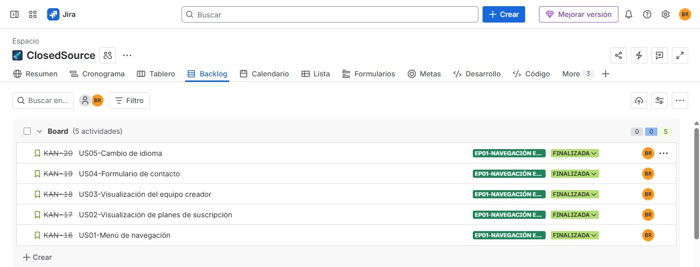

# Capítulo III: Requirements Specification

## 3.1. User Stories

Para la especificación de requisitos de los usuarios, se desarrollaron las historias de usuario que describen cada requisito y funcionalidad que debe estar implementado en el desarrollo del producto final para satisfacer las necesidades del público objetivo. A continuación se presentan las historias de usuario relacionadas con la plataforma QualiTrack. Esta sección reúne historias de usuario centradas en la experiencia de los distintos roles: el visitante de la landing page, el operario de planta y el supervisor o jefe de Aseguramiento de la Calidad. Aquí se definen las necesidades clave para cada uno, desde la navegación inicial, hasta la gestión de lotes, monitoreo IoT y generación de reportes de auditoría.

<table>
  <thead>
    <tr>
      <th>Story ID</th>
      <th>Título</th>
      <th>Descripción</th>
      <th>Criterios de Aceptación (Gherkin)</th>
    </tr>
  </thead>
  <tbody>
    <!-- EP01 -->
    <tr>
      <td>EP01</td>
      <td>Navegación en la Landing Page</td>
      <td>Como visitante quiero tener una experiencia fluida en el sitio web para conocer los servicios de QualiTrack y tomar decisiones informadas.</td>
      <td></td>
    </tr>
    <tr>
      <td>US01</td>
      <td>Menú de navegación</td>
      <td>Como visitante de la Landing Page, quiero poder acceder a un menú de navegación en la parte superior de la página, para explorar fácilmente las secciones como "Inicio", "Características", "Planes" y "Contacto".</td>
      <td>
        <strong>Escenario 1: Navegación exitosa a través del menú</strong> 
        <strong>Dado que</strong> el visitante está en la landing page 
        <strong>Cuando</strong> el menú de navegación está disponible 
        <strong>Entonces</strong> el usuario puede ver los enlaces principales y navegar a las secciones correspondientes.  
        <strong>Escenario 2: Menú no disponible</strong> 
        <strong>Dado que</strong> el visitante está en la landing page 
        <strong>Cuando</strong> el menú no se carga correctamente 
        <strong>Entonces</strong> el usuario recibe un mensaje de error y tiene opciones alternativas de navegación.
      </td>
    </tr>
    <tr>
      <td>US02</td>
      <td>Visualización de planes de suscripción</td>
      <td>Como visitante de la Landing Page, quiero ver los planes de suscripción disponibles junto a su precio y características, para poder elegir el que mejor se adapte a las necesidades de mi laboratorio.</td>
      <td>
        <strong>Escenario 1: Visualización de planes disponibles</strong> 
        <strong>Dado que</strong> el visitante navega a la sección de planes 
        <strong>Cuando</strong> los planes están disponibles en el sistema 
        <strong>Entonces</strong> el usuario puede ver la lista de planes con sus precios y características para compararlos.  
        <strong>Escenario 2: Planes no disponibles</strong> 
        <strong>Dado que</strong> el visitante navega a la sección de planes 
        <strong>Cuando</strong> ocurre un error de carga 
        <strong>Entonces</strong> el usuario recibe un mensaje informativo sobre la indisponibilidad temporal.
      </td>
    </tr>
    <tr>
      <td>US03</td>
      <td>Visualización del equipo creador</td>
      <td>Como visitante de la Landing Page, quiero ver información sobre el equipo detrás de QualiTrack para generar confianza en el servicio antes de contratar.</td>
      <td>
        <strong>Escenario 1: Acceso a información del equipo</strong> 
        <strong>Dado que</strong> el visitante navega a la sección "Equipo" 
        <strong>Cuando</strong> la información del equipo está disponible 
        <strong>Entonces</strong> el usuario puede ver los detalles de los creadores incluyendo nombres, roles y especialidades.  
        <strong>Escenario 2: Información del equipo no disponible</strong> 
        <strong>Dado que</strong> el visitante navega a la sección "Equipo" 
        <strong>Cuando</strong> la información no está disponible 
        <strong>Entonces</strong> el usuario recibe un mensaje informativo sobre la indisponibilidad temporal.
      </td>
    </tr>
    <tr>
      <td>US04</td>
      <td>Formulario de contacto</td>
      <td>Como visitante de la landing page quiero completar un formulario de contacto para enviar consultas específicas y recibir una respuesta personalizada del equipo de QualiTrack.</td>
      <td>
        <strong>Escenario 1: Envío exitoso de consulta</strong> 
        <strong>Dado que</strong> el visitante completa el formulario de contacto 
        <strong>Cuando</strong> todos los campos requeridos están completos y válidos 
        <strong>Entonces</strong> la consulta se envía exitosamente y el usuario recibe confirmación por correo.  
        <strong>Escenario 2: Datos de contacto inválidos</strong> 
        <strong>Dado que</strong> el visitante completa el formulario de contacto 
        <strong>Cuando</strong> existen campos inválidos o incompletos 
        <strong>Entonces</strong> el sistema muestra mensajes de validación específicos para los campos problemáticos.
      </td>
    </tr>
    <tr>
      <td>US05</td>
      <td>Cambio de idioma</td>
      <td>Como visitante de la Landing Page quiero un botón para cambiar de idioma entre español e inglés para comprender mejor la propuesta de valor de QualiTrack.</td>
      <td>
        <strong>Escenario 1: Cambio exitoso de idioma</strong> 
        <strong>Dado que</strong> el visitante selecciona un idioma disponible 
        <strong>Cuando</strong> confirma el cambio de idioma 
        <strong>Entonces</strong> la interfaz se actualiza al idioma seleccionado y mantiene la preferencia.  
        <strong>Escenario 2: Idioma no disponible</strong> 
        <strong>Dado que</strong> el visitante intenta cambiar a un idioma 
        <strong>Cuando</strong> el idioma seleccionado no está soportado 
        <strong>Entonces</strong> el sistema mantiene el idioma actual y muestra un mensaje informativo.
      </td>
    </tr>
    <!-- EP02 -->
    <tr>
      <td>EP02</td>
      <td>Autenticación y gestión de acceso</td>
      <td>Como usuario de QualiTrack quiero poder registrarme, iniciar sesión y gestionar mi cuenta de forma segura para acceder a las funcionalidades según mi rol.</td>
      <td></td>
    </tr>
    <tr>
      <td>US06</td>
      <td>Registro de laboratorio en la plataforma</td>
      <td>Como jefe de Aseguramiento de Calidad quiero registrar mi laboratorio en QualiTrack para comenzar a gestionar los procesos de control de calidad de forma digital.</td>
      <td>
        <strong>Escenario 1: Registro exitoso</strong> 
        <strong>Dado que</strong> el jefe de QA completa el formulario de registro con datos válidos del laboratorio 
        <strong>Cuando</strong> envía el formulario 
        <strong>Entonces</strong> el sistema crea la cuenta institucional, asigna un ID único al laboratorio y envía un correo de confirmación.  
        <strong>Escenario 2: Datos incompletos o inválidos</strong> 
        <strong>Dado que</strong> el usuario intenta registrarse con datos faltantes 
        <strong>Cuando</strong> envía el formulario 
        <strong>Entonces</strong> el sistema muestra mensajes de validación y no crea la cuenta.
      </td>
    </tr>
    <tr>
      <td>US07</td>
      <td>Inicio de sesión seguro</td>
      <td>Como usuario registrado (jefe de QA u operario) quiero iniciar sesión en la plataforma con mis credenciales para acceder a las funcionalidades habilitadas según mi rol.</td>
      <td>
        <strong>Escenario 1: Inicio de sesión exitoso</strong> 
        <strong>Dado que</strong> el usuario tiene credenciales válidas 
        <strong>Cuando</strong> ingresa su usuario y contraseña correctamente 
        <strong>Entonces</strong> el sistema autentica al usuario y lo redirige a su dashboard según el rol asignado.  
        <strong>Escenario 2: Credenciales incorrectas</strong> 
        <strong>Dado que</strong> el usuario ingresa credenciales inválidas 
        <strong>Cuando</strong> intenta iniciar sesión 
        <strong>Entonces</strong> el sistema muestra un mensaje de error y no permite el acceso.
      </td>
    </tr>
    <tr>
      <td>US08</td>
      <td>Recuperación de contraseña</td>
      <td>Como usuario registrado quiero poder recuperar mi contraseña en caso de olvidarla para no perder acceso a la plataforma y sus datos.</td>
      <td>
        <strong>Escenario 1: Recuperación exitosa</strong> 
        <strong>Dado que</strong> el usuario solicita recuperar su contraseña ingresando su correo registrado 
        <strong>Cuando</strong> el sistema encuentra la cuenta asociada 
        <strong>Entonces</strong> envía un enlace de restablecimiento al correo y el usuario puede crear una nueva contraseña.  
        <strong>Escenario 2: Correo no registrado</strong> 
        <strong>Dado que</strong> el usuario ingresa un correo que no existe en el sistema 
        <strong>Cuando</strong> solicita la recuperación 
        <strong>Entonces</strong> el sistema muestra un mensaje informativo sin revelar si el correo existe o no.
      </td>
    </tr>
    <tr>
      <td>US09</td>
      <td>Gestión de roles y permisos de usuarios</td>
      <td>Como jefe de Aseguramiento de Calidad quiero gestionar los roles de mi equipo (supervisor, operario, auditor) para garantizar que cada usuario acceda únicamente a la información y funciones que le corresponden.</td>
      <td>
        <strong>Escenario 1: Asignación de rol exitosa</strong> 
        <strong>Dado que</strong> el jefe de QA accede a la sección de gestión de usuarios 
        <strong>Cuando</strong> asigna un rol específico a un usuario 
        <strong>Entonces</strong> el sistema actualiza los permisos del usuario y este solo puede acceder a las funciones habilitadas para su rol.  
        <strong>Escenario 2: Intento de acceso no autorizado</strong> 
        <strong>Dado que</strong> un operario intenta acceder a una funcionalidad restringida 
        <strong>Cuando</strong> navega a una sección fuera de sus permisos 
        <strong>Entonces</strong> el sistema bloquea el acceso y muestra un mensaje de restricción.
      </td>
    </tr>
    <!-- EP03 -->
    <tr>
      <td>EP03</td>
      <td>Dashboard de Telemetría en Tiempo Real</td>
      <td>Como supervisor de calidad quiero visualizar en tiempo real las variables críticas de los equipos de producción para detectar desviaciones de forma inmediata sin depender de registros manuales.</td>
      <td></td>
    </tr>
    <tr>
      <td>US10</td>
      <td>Visualización del dashboard de telemetría</td>
      <td>Como jefe de Aseguramiento de Calidad quiero acceder a un dashboard que muestre en tiempo real las variables críticas (temperatura, presión, pH) de los equipos de producción para supervisar el cumplimiento BPM sin estar físicamente en la planta.</td>
      <td>
        <strong>Escenario 1: Dashboard con datos disponibles</strong> 
        <strong>Dado que</strong> el jefe de QA está autenticado y tiene equipos IoT vinculados 
        <strong>Cuando</strong> accede al dashboard de telemetría 
        <strong>Entonces</strong> el sistema muestra gráficos actualizados en tiempo real con los valores de temperatura, presión y pH de cada equipo registrado.  
        <strong>Escenario 2: Sin equipos vinculados</strong> 
        <strong>Dado que</strong> el jefe de QA accede al dashboard sin equipos configurados 
        <strong>Cuando</strong> carga la vista 
        <strong>Entonces</strong> el sistema muestra un mensaje indicando que debe vincular al menos un equipo para comenzar el monitoreo.
      </td>
    </tr>
    <tr>
      <td>US11</td>
      <td>Visualización de historial de telemetría por equipo</td>
      <td>Como jefe de Aseguramiento de Calidad quiero consultar el historial de variables registradas por un equipo específico para analizar el comportamiento del proceso en periodos anteriores.</td>
      <td>
        <strong>Escenario 1: Historial disponible</strong> 
        <strong>Dado que</strong> el usuario selecciona un equipo y un rango de fechas 
        <strong>Cuando</strong> solicita el historial de telemetría 
        <strong>Entonces</strong> el sistema muestra un gráfico con la evolución de las variables en el periodo seleccionado.  
        <strong>Escenario 2: Sin datos en el rango seleccionado</strong> 
        <strong>Dado que</strong> el usuario selecciona un rango de fechas sin registros 
        <strong>Cuando</strong> solicita el historial 
        <strong>Entonces</strong> el sistema muestra un mensaje indicando que no hay datos disponibles para el periodo indicado.
      </td>
    </tr>
    <tr>
      <td>US12</td>
      <td>Vinculación de equipos IoT a la plataforma</td>
      <td>Como jefe de Aseguramiento de Calidad quiero registrar y vincular los equipos industriales (autoclaves, medidores de pH) a QualiTrack para que la plataforma reciba automáticamente su telemetría.</td>
      <td>
        <strong>Escenario 1: Vinculación exitosa de equipo</strong> 
        <strong>Dado que</strong> el jefe de QA registra un nuevo equipo con su identificador único (device_id) 
        <strong>Cuando</strong> confirma la vinculación 
        <strong>Entonces</strong> el sistema asocia el equipo al laboratorio y comienza a recibir su telemetría en el dashboard.  
        <strong>Escenario 2: Equipo ya vinculado</strong> 
        <strong>Dado que</strong> el usuario intenta vincular un equipo con un device_id ya registrado 
        <strong>Cuando</strong> envía el formulario de vinculación 
        <strong>Entonces</strong> el sistema rechaza la operación e informa que el equipo ya está asociado.
      </td>
    </tr>
    <tr>
      <td>US13</td>
      <td>Consulta del estado de equipos en tiempo real</td>
      <td>Como operario de planta quiero consultar el estado de conexión y los valores actuales de cada equipo desde la plataforma para verificar que todos los sensores están transmitiendo correctamente antes de iniciar un proceso de producción.</td>
      <td>
        <strong>Escenario 1: Equipos conectados y transmitiendo</strong> 
        <strong>Dado que</strong> el operario accede a la vista de estado de equipos 
        <strong>Cuando</strong> todos los equipos registrados están transmitiendo datos 
        <strong>Entonces</strong> el sistema muestra cada equipo con indicador verde, su última medición y la marca de tiempo.  
        <strong>Escenario 2: Equipo desconectado</strong> 
        <strong>Dado que</strong> un equipo deja de transmitir datos 
        <strong>Cuando</strong> el sistema detecta ausencia de señal por más del tiempo configurado 
        <strong>Entonces</strong> el equipo aparece con indicador rojo y se genera una alerta de desconexión.
      </td>
    </tr>
    <!-- EP04 -->
    <tr>
      <td>EP04</td>
      <td>Gestión de Lotes (Batch Record)</td>
      <td>Como supervisor de calidad quiero gestionar el ciclo de vida completo de cada lote de producción de forma digital para garantizar la trazabilidad inmutable exigida por DIGEMID.</td>
      <td></td>
    </tr>
    <tr>
      <td>US14</td>
      <td>Registro de nuevo lote de producción</td>
      <td>Como jefe de Aseguramiento de Calidad quiero registrar un nuevo lote de producción en la plataforma para iniciar el seguimiento digital de su ciclo de fabricación.</td>
      <td>
        <strong>Escenario 1: Creación exitosa de lote</strong> 
        <strong>Dado que</strong> el jefe de QA proporciona los datos del lote (código, producto, fecha de inicio, equipos asignados) 
        <strong>Cuando</strong> envía el formulario de registro 
        <strong>Entonces</strong> el sistema crea el lote, genera un ID único y lo asocia a los equipos y variables de telemetría correspondientes.  
        <strong>Escenario 2: Datos requeridos faltantes</strong> 
        <strong>Dado que</strong> el usuario intenta crear un lote con campos obligatorios vacíos 
        <strong>Cuando</strong> envía el formulario 
        <strong>Entonces</strong> el sistema muestra mensajes específicos indicando los campos obligatorios sin crear el lote.
      </td>
    </tr>
    <tr>
      <td>US15</td>
      <td>Consulta del historial completo de un lote</td>
      <td>Como jefe de Aseguramiento de Calidad quiero consultar el historial completo de un lote para verificar que todas las variables del proceso se mantuvieron dentro de los parámetros BPM establecidos.</td>
      <td>
        <strong>Escenario 1: Historial completo disponible</strong> 
        <strong>Dado que</strong> el usuario selecciona un lote existente 
        <strong>Cuando</strong> accede a su historial 
        <strong>Entonces</strong> el sistema muestra el registro cronológico e inmutable de todas las variables capturadas durante el proceso de fabricación.  
        <strong>Escenario 2: Lote sin registros de telemetría</strong> 
        <strong>Dado que</strong> el usuario consulta un lote recién creado sin datos aún 
        <strong>Cuando</strong> accede a su historial 
        <strong>Entonces</strong> el sistema muestra un mensaje indicando que aún no se han registrado datos de telemetría para ese lote.
      </td>
    </tr>
    <tr>
      <td>US16</td>
      <td>Liberación digital de lote conforme</td>
      <td>Como jefe de Aseguramiento de Calidad quiero firmar digitalmente la liberación de un lote que haya cumplido todos los parámetros BPM para agilizar la cadena de suministro sin depender de firmas físicas.</td>
      <td>
        <strong>Escenario 1: Liberación exitosa de lote</strong> 
        <strong>Dado que</strong> el lote ha completado el proceso y todos sus parámetros están dentro del rango 
        <strong>Cuando</strong> el jefe de QA aplica su firma digital en la plataforma 
        <strong>Entonces</strong> el sistema registra la liberación con fecha, hora y firma del responsable, marcando el lote como "Liberado".  
        <strong>Escenario 2: Intento de liberar lote bloqueado</strong> 
        <strong>Dado que</strong> el lote tiene desviaciones detectadas y está en estado "Bloqueado" 
        <strong>Cuando</strong> el usuario intenta liberar el lote 
        <strong>Entonces</strong> el sistema rechaza la acción y muestra las desviaciones que impiden la liberación.
      </td>
    </tr>
    <tr>
      <td>US17</td>
      <td>Rechazo y documentación de lote no conforme</td>
      <td>Como jefe de Aseguramiento de Calidad quiero registrar el rechazo de un lote no conforme con su justificación para mantener un registro documental completo del evento de desviación.</td>
      <td>
        <strong>Escenario 1: Rechazo exitoso con justificación</strong> 
        <strong>Dado que</strong> el jefe de QA selecciona un lote bloqueado por desviación 
        <strong>Cuando</strong> documenta la causa raíz y confirma el rechazo 
        <strong>Entonces</strong> el sistema registra el rechazo de forma inmutable con fecha, responsable y justificación, marcando el lote como "Rechazado".  
        <strong>Escenario 2: Rechazo sin justificación</strong> 
        <strong>Dado que</strong> el usuario intenta rechazar un lote sin completar la causa raíz 
        <strong>Cuando</strong> confirma la acción 
        <strong>Entonces</strong> el sistema solicita obligatoriamente la justificación antes de proceder.
      </td>
    </tr>
    <tr>
      <td>US18</td>
      <td>Búsqueda y filtrado de lotes</td>
      <td>Como jefe de Aseguramiento de Calidad quiero buscar y filtrar lotes por estado, producto, fecha o código para localizar rápidamente la información de un lote específico.</td>
      <td>
        <strong>Escenario 1: Búsqueda con resultados</strong> 
        <strong>Dado que</strong> el usuario aplica filtros de búsqueda en la lista de lotes 
        <strong>Cuando</strong> los criterios coinciden con lotes existentes 
        <strong>Entonces</strong> el sistema retorna la lista filtrada con los lotes correspondientes y sus estados actuales.  
        <strong>Escenario 2: Búsqueda sin resultados</strong> 
        <strong>Dado que</strong> el usuario aplica filtros que no coinciden con ningún lote 
        <strong>Cuando</strong> ejecuta la búsqueda 
        <strong>Entonces</strong> el sistema muestra un mensaje indicando que no se encontraron lotes con esos criterios.
      </td>
    </tr>
    <!-- EP05 -->
    <tr>
      <td>EP05</td>
      <td>Motor de Alertas y Bloqueo (Compliance)</td>
      <td>Como operario de planta quiero recibir alertas automáticas cuando una variable crítica salga del rango permitido para actuar de forma inmediata y evitar la liberación de productos defectuosos.</td>
      <td></td>
    </tr>
    <tr>
      <td>US19</td>
      <td>Configuración de parámetros BPM por equipo</td>
      <td>Como jefe de Aseguramiento de Calidad quiero configurar los rangos permitidos de temperatura, presión y pH para cada equipo del laboratorio para que el sistema pueda detectar automáticamente las desviaciones normativas.</td>
      <td>
        <strong>Escenario 1: Configuración exitosa de parámetros</strong> 
        <strong>Dado que</strong> el jefe de QA accede a la configuración de un equipo registrado 
        <strong>Cuando</strong> establece los valores mínimos y máximos permitidos para cada variable 
        <strong>Entonces</strong> el sistema guarda los parámetros y los aplica como referencia para la evaluación de telemetría en tiempo real.  
        <strong>Escenario 2: Valores de rango inválidos</strong> 
        <strong>Dado que</strong> el usuario ingresa un valor mínimo mayor al máximo 
        <strong>Cuando</strong> intenta guardar la configuración 
        <strong>Entonces</strong> el sistema muestra un mensaje de error indicando el conflicto de valores.
      </td>
    </tr>
    <tr>
      <td>US20</td>
      <td>Alerta automática ante desviación de parámetros</td>
      <td>Como operario de planta quiero recibir una alerta visual inmediata en la plataforma cuando una variable crítica de un equipo supere o caiga por debajo del rango BPM configurado para poder actuar en menos de 5 segundos.</td>
      <td>
        <strong>Escenario 1: Alerta generada por desviación</strong> 
        <strong>Dado que</strong> un equipo transmite un valor fuera del rango BPM configurado 
        <strong>Cuando</strong> el motor de compliance evalúa la telemetría entrante 
        <strong>Entonces</strong> el sistema genera una alerta visual inmediata en el dashboard indicando el equipo, la variable afectada, el valor registrado y la hora del evento.  
        <strong>Escenario 2: Variable dentro del rango normal</strong> 
        <strong>Dado que</strong> el equipo transmite valores dentro del rango permitido 
        <strong>Cuando</strong> el motor evalúa la telemetría 
        <strong>Entonces</strong> el sistema no genera alertas y mantiene el indicador del equipo en estado "Normal".
      </td>
    </tr>
    <tr>
      <td>US21</td>
      <td>Bloqueo automático de lote por desviación</td>
      <td>Como jefe de Aseguramiento de Calidad quiero que el sistema bloquee automáticamente un lote cuando se detecte una desviación crítica en sus parámetros para impedir que avance en la cadena de suministro hasta ser investigado.</td>
      <td>
        <strong>Escenario 1: Bloqueo automático exitoso</strong> 
        <strong>Dado que</strong> el motor de compliance detecta una desviación crítica en un lote activo 
        <strong>Cuando</strong> la variable supera el umbral establecido 
        <strong>Entonces</strong> el sistema bloquea el lote automáticamente, lo marca como "En investigación" y notifica al jefe de QA con los detalles de la desviación.  
        <strong>Escenario 2: Desviación leve configurada como advertencia</strong> 
        <strong>Dado que</strong> el motor detecta una desviación menor configurada como "advertencia" 
        <strong>Cuando</strong> evalúa la telemetría 
        <strong>Entonces</strong> el sistema genera una advertencia sin bloquear el lote, registrando el evento para auditoría.
      </td>
    </tr>
    <tr>
      <td>US22</td>
      <td>Historial de alertas y eventos de compliance</td>
      <td>Como jefe de Aseguramiento de Calidad quiero consultar el historial completo de alertas y eventos de desviación registrados para analizar patrones de falla y documentar las acciones correctivas tomadas.</td>
      <td>
        <strong>Escenario 1: Historial de alertas disponible</strong> 
        <strong>Dado que</strong> el usuario accede a la sección de historial de eventos 
        <strong>Cuando</strong> aplica filtros por equipo, fecha o tipo de alerta 
        <strong>Entonces</strong> el sistema muestra la lista de eventos ordenados cronológicamente con detalles de cada desviación.  
        <strong>Escenario 2: Sin alertas en el periodo seleccionado</strong> 
        <strong>Dado que</strong> el usuario filtra por un periodo sin eventos 
        <strong>Cuando</strong> consulta el historial 
        <strong>Entonces</strong> el sistema muestra un mensaje indicando que no se registraron alertas en ese periodo.
      </td>
    </tr>
    <tr>
      <td>US23</td>
      <td>Notificación push de alerta crítica</td>
      <td>Como jefe de Aseguramiento de Calidad quiero recibir notificaciones push en mi dispositivo cuando se genere una alerta crítica de desviación para poder reaccionar aunque no esté revisando activamente la plataforma.</td>
      <td>
        <strong>Escenario 1: Notificación push enviada correctamente</strong> 
        <strong>Dado que</strong> el sistema detecta una desviación crítica y el usuario tiene notificaciones habilitadas 
        <strong>Cuando</strong> el motor de compliance genera la alerta 
        <strong>Entonces</strong> el usuario recibe una notificación push en su dispositivo con el nombre del equipo, la variable afectada y el lote bloqueado.  
        <strong>Escenario 2: Notificaciones deshabilitadas</strong> 
        <strong>Dado que</strong> el usuario tiene las notificaciones push desactivadas 
        <strong>Cuando</strong> ocurre una alerta crítica 
        <strong>Entonces</strong> la alerta se registra en el historial de la plataforma y se muestra en el dashboard al próximo acceso.
      </td>
    </tr>
    <tr>
      <td>US24</td>
      <td>Configuración de canales de notificación</td>
      <td>Como jefe de Aseguramiento de Calidad quiero configurar los canales por los que deseo recibir alertas (correo, notificación web, SMS) para adaptar las notificaciones a mis preferencias operativas.</td>
      <td>
        <strong>Escenario 1: Configuración guardada exitosamente</strong> 
        <strong>Dado que</strong> el usuario accede a la configuración de notificaciones 
        <strong>Cuando</strong> selecciona y guarda sus canales preferidos 
        <strong>Entonces</strong> el sistema almacena la preferencia y envía futuras alertas únicamente por los canales seleccionados.  
        <strong>Escenario 2: Sin canales seleccionados</strong> 
        <strong>Dado que</strong> el usuario intenta guardar la configuración sin seleccionar ningún canal 
        <strong>Cuando</strong> confirma los cambios 
        <strong>Entonces</strong> el sistema solicita que se seleccione al menos un canal de notificación.
      </td>
    </tr>
    <!-- EP06 -->
    <tr>
      <td>EP06</td>
      <td>Generación de Reportes de Auditoría</td>
      <td>Como jefe de Aseguramiento de Calidad quiero generar reportes digitales e inmutables de los procesos de fabricación para presentarlos como evidencia en inspecciones de DIGEMID sin recopilar documentos físicos.</td>
      <td></td>
    </tr>
    <tr>
      <td>US25</td>
      <td>Generación de reporte de trazabilidad de lote</td>
      <td>Como jefe de Aseguramiento de Calidad quiero generar un reporte PDF completo e inmutable del historial de fabricación de un lote específico para presentarlo como evidencia en auditorías regulatorias.</td>
      <td>
        <strong>Escenario 1: Generación exitosa de reporte</strong> 
        <strong>Dado que</strong> el usuario selecciona un lote con historial completo 
        <strong>Cuando</strong> solicita la generación del reporte de trazabilidad 
        <strong>Entonces</strong> el sistema genera un PDF no editable con el registro cronológico de variables, alertas, responsables y estado final del lote.  
        <strong>Escenario 2: Lote sin datos suficientes</strong> 
        <strong>Dado que</strong> el usuario intenta generar un reporte de un lote sin registros completos 
        <strong>Cuando</strong> solicita la generación 
        <strong>Entonces</strong> el sistema advierte que el lote no tiene datos suficientes para un reporte válido de auditoría.
      </td>
    </tr>
    <tr>
      <td>US26</td>
      <td>Generación de reporte consolidado de cumplimiento BPM</td>
      <td>Como jefe de Aseguramiento de Calidad quiero generar un reporte consolidado de cumplimiento BPM por un periodo de tiempo determinado para preparar la documentación antes de una auditoría.</td>
      <td>
        <strong>Escenario 1: Reporte generado exitosamente</strong> 
        <strong>Dado que</strong> el usuario selecciona un rango de fechas con datos disponibles 
        <strong>Cuando</strong> solicita el reporte de cumplimiento del periodo 
        <strong>Entonces</strong> el sistema genera un PDF con el resumen de lotes procesados, alertas registradas, desviaciones y porcentaje de cumplimiento BPM.  
        <strong>Escenario 2: Sin datos en el periodo seleccionado</strong> 
        <strong>Dado que</strong> el usuario selecciona un periodo sin actividad registrada 
        <strong>Cuando</strong> solicita el reporte 
        <strong>Entonces</strong> el sistema informa que no existen datos para generar el reporte en ese periodo.
      </td>
    </tr>
    <tr>
      <td>US27</td>
      <td>Exportación de log de eventos inmutable</td>
      <td>Como auditor regulatorio quiero exportar el log completo de eventos de un equipo en formato no editable para verificar la integridad de los datos durante una inspección de DIGEMID.</td>
      <td>
        <strong>Escenario 1: Exportación exitosa del log</strong> 
        <strong>Dado que</strong> el auditor selecciona un equipo o lote y un rango de fechas 
        <strong>Cuando</strong> solicita la exportación del log de eventos 
        <strong>Entonces</strong> el sistema descarga un archivo PDF con el registro inmutable de todos los eventos, marcas de tiempo y valores registrados.  
        <strong>Escenario 2: Exportación sin permisos</strong> 
        <strong>Dado que</strong> un operario intenta exportar un log de auditoría 
        <strong>Cuando</strong> solicita la exportación 
        <strong>Entonces</strong> el sistema deniega el acceso y muestra un mensaje de restricción de rol.
      </td>
    </tr>
    <!-- EP07 -->
    <tr>
      <td>EP07</td>
      <td>Gestión de personal del laboratorio</td>
      <td>Como jefe de Aseguramiento de Calidad quiero gestionar la información del personal técnico y operativo de mi laboratorio para mantener actualizado el directorio de responsables de cada proceso.</td>
      <td></td>
    </tr>
    <tr>
      <td>US28</td>
      <td>Registro de operario o supervisor</td>
      <td>Como jefe de Aseguramiento de Calidad quiero registrar a los miembros del equipo técnico y operativo del laboratorio para que puedan acceder a la plataforma con el rol y permisos correspondientes.</td>
      <td>
        <strong>Escenario 1: Registro exitoso de personal</strong> 
        <strong>Dado que</strong> el jefe de QA completa el formulario de registro del nuevo personal 
        <strong>Cuando</strong> proporciona nombre, cargo, correo y rol asignado 
        <strong>Entonces</strong> el sistema crea el perfil del usuario, genera credenciales y envía un correo de bienvenida con acceso a la plataforma.  
        <strong>Escenario 2: Correo ya registrado</strong> 
        <strong>Dado que</strong> el jefe de QA intenta registrar un correo ya existente en el sistema 
        <strong>Cuando</strong> envía el formulario 
        <strong>Entonces</strong> el sistema muestra un mensaje indicando que el correo ya está asociado a una cuenta.
      </td>
    </tr>
    <tr>
      <td>US29</td>
      <td>Baja de personal del laboratorio</td>
      <td>Como jefe de Aseguramiento de Calidad quiero desactivar el acceso de un miembro del personal que ya no forma parte del laboratorio para proteger la seguridad de los datos y el cumplimiento normativo.</td>
      <td>
        <strong>Escenario 1: Desactivación exitosa</strong> 
        <strong>Dado que</strong> el jefe de QA selecciona un usuario activo para desactivar 
        <strong>Cuando</strong> confirma la baja del sistema 
        <strong>Entonces</strong> el sistema revoca el acceso del usuario, cierra sus sesiones activas y registra la fecha y motivo de la baja.  
        <strong>Escenario 2: Usuario con tareas activas asignadas</strong> 
        <strong>Dado que</strong> el usuario a dar de baja tiene lotes en curso bajo su supervisión 
        <strong>Cuando</strong> el jefe de QA intenta desactivarlo 
        <strong>Entonces</strong> el sistema alerta sobre las responsabilidades activas y solicita reasignación antes de proceder.
      </td>
    </tr>
    <tr>
      <td>US30</td>
      <td>Consulta de actividad de personal por turno</td>
      <td>Como jefe de Aseguramiento de Calidad quiero consultar el registro de actividad de cada operario por turno para verificar quién supervisó cada etapa del proceso de fabricación de un lote.</td>
      <td>
        <strong>Escenario 1: Registro de actividad disponible</strong> 
        <strong>Dado que</strong> el jefe de QA selecciona un operario y un rango de fechas 
        <strong>Cuando</strong> consulta su registro de actividad 
        <strong>Entonces</strong> el sistema muestra las acciones realizadas (registros, alertas atendidas, lotes gestionados) con marca de tiempo.  
        <strong>Escenario 2: Sin actividad en el periodo</strong> 
        <strong>Dado que</strong> el operario no realizó acciones en el periodo seleccionado 
        <strong>Cuando</strong> el jefe de QA consulta su actividad 
        <strong>Entonces</strong> el sistema muestra un mensaje informando que no hay registros de actividad en ese rango.
      </td>
    </tr>
    <!-- EP08 -->
    <tr>
      <td>EP08</td>
      <td>Gestión de productos y especificaciones</td>
      <td>Como jefe de Aseguramiento de Calidad quiero gestionar el catálogo de productos farmacéuticos fabricados con sus especificaciones BPM para asegurar que cada lote se vincule al producto correcto y sus parámetros de control.</td>
      <td></td>
    </tr>
    <tr>
      <td>US31</td>
      <td>Registro de producto farmacéutico</td>
      <td>Como jefe de Aseguramiento de Calidad quiero registrar los productos farmacéuticos fabricados por el laboratorio junto a sus especificaciones técnicas para vincularlos correctamente a los lotes de producción.</td>
      <td>
        <strong>Escenario 1: Registro exitoso de producto</strong> 
        <strong>Dado que</strong> el jefe de QA completa el formulario de registro de producto con nombre, código, descripción y especificaciones 
        <strong>Cuando</strong> envía el formulario 
        <strong>Entonces</strong> el sistema crea el producto en el catálogo y lo deja disponible para asignar a futuros lotes.  
        <strong>Escenario 2: Código de producto duplicado</strong> 
        <strong>Dado que</strong> el usuario intenta registrar un producto con un código ya existente 
        <strong>Cuando</strong> envía el formulario 
        <strong>Entonces</strong> el sistema muestra un error indicando que el código ya está en uso.
      </td>
    </tr>
    <tr>
      <td>US32</td>
      <td>Consulta del catálogo de productos</td>
      <td>Como jefe de Aseguramiento de Calidad quiero consultar el catálogo de productos farmacéuticos registrados para revisar sus especificaciones y gestionar los parámetros de control asociados.</td>
      <td>
        <strong>Escenario 1: Catálogo con productos disponibles</strong> 
        <strong>Dado que</strong> el usuario accede a la sección de catálogo de productos 
        <strong>Cuando</strong> el laboratorio tiene productos registrados 
        <strong>Entonces</strong> el sistema muestra la lista de productos con nombre, código, estado y fecha de última actualización.  
        <strong>Escenario 2: Catálogo vacío</strong> 
        <strong>Dado que</strong> el laboratorio no tiene productos registrados aún 
        <strong>Cuando</strong> el usuario accede al catálogo 
        <strong>Entonces</strong> el sistema muestra un mensaje invitando a registrar el primer producto.
      </td>
    </tr>
    <!-- EP09 -->
    <tr>
      <td>EP09</td>
      <td>Gestión de materias primas</td>
      <td>Como jefe de Aseguramiento de Calidad quiero gestionar el inventario de materias primas utilizadas en la fabricación para garantizar su trazabilidad dentro de cada lote de producción.</td>
      <td></td>
    </tr>
    <tr>
      <td>US33</td>
      <td>Registro de materia prima</td>
      <td>Como jefe de Aseguramiento de Calidad quiero registrar las materias primas del laboratorio con sus datos de proveedor, lote y fecha de vencimiento para garantizar su trazabilidad en los procesos de fabricación.</td>
      <td>
        <strong>Escenario 1: Registro exitoso de materia prima</strong> 
        <strong>Dado que</strong> el jefe de QA completa el formulario con nombre, código, proveedor, lote, fecha de vencimiento y cantidad 
        <strong>Cuando</strong> envía el formulario 
        <strong>Entonces</strong> el sistema registra la materia prima en el inventario y la deja disponible para asignar a lotes.  
        <strong>Escenario 2: Materia prima vencida</strong> 
        <strong>Dado que</strong> el usuario intenta registrar una materia prima con fecha de vencimiento ya pasada 
        <strong>Cuando</strong> envía el formulario 
        <strong>Entonces</strong> el sistema muestra una advertencia indicando que la materia prima está vencida y no la agrega al inventario activo.
      </td>
    </tr>
    <tr>
      <td>US34</td>
      <td>Trazabilidad de materia prima en lote</td>
      <td>Como jefe de Aseguramiento de Calidad quiero consultar qué materias primas se utilizaron en un lote específico para garantizar la trazabilidad completa del proceso ante una auditoría regulatoria.</td>
      <td>
        <strong>Escenario 1: Trazabilidad completa disponible</strong> 
        <strong>Dado que</strong> el usuario selecciona un lote y consulta sus materias primas 
        <strong>Cuando</strong> el lote tiene materias primas asignadas 
        <strong>Entonces</strong> el sistema muestra la lista de materias primas utilizadas con nombre, código, proveedor, lote y cantidad empleada.  
        <strong>Escenario 2: Lote sin materias primas asignadas</strong> 
        <strong>Dado que</strong> el lote no tiene materias primas registradas 
        <strong>Cuando</strong> el usuario consulta la trazabilidad 
        <strong>Entonces</strong> el sistema muestra un mensaje indicando que no hay materias primas asociadas a ese lote.
      </td>
    </tr>
    <tr>
      <td>US35</td>
      <td>Alerta de stock mínimo de materia prima</td>
      <td>Como jefe de Aseguramiento de Calidad quiero recibir alertas cuando el stock de una materia prima llegue al nivel mínimo configurado para gestionar el reabastecimiento a tiempo y no interrumpir la producción.</td>
      <td>
        <strong>Escenario 1: Alerta de stock mínimo generada</strong> 
        <strong>Dado que</strong> el stock de una materia prima llega al nivel mínimo configurado 
        <strong>Cuando</strong> el sistema verifica el inventario 
        <strong>Entonces</strong> genera una alerta visible en el dashboard indicando el nombre de la materia prima, el stock actual y el nivel mínimo configurado.  
        <strong>Escenario 2: Stock por encima del mínimo</strong> 
        <strong>Dado que</strong> el stock de todas las materias primas supera el nivel mínimo 
        <strong>Cuando</strong> el sistema verifica el inventario 
        <strong>Entonces</strong> no genera alertas de stock y el indicador de inventario se muestra en estado normal.
      </td>
    </tr>
    <!-- EP10 -->
    <tr>
      <td>EP10</td>
      <td>Análisis y estadísticas de calidad</td>
      <td>Como jefe de Aseguramiento de Calidad quiero acceder a indicadores y estadísticas consolidadas del laboratorio para tomar decisiones basadas en datos y mejorar continuamente los procesos de fabricación.</td>
      <td></td>
    </tr>
    <tr>
      <td>US36</td>
      <td>Dashboard de indicadores de calidad (KPIs)</td>
      <td>Como jefe de Aseguramiento de Calidad quiero acceder a un panel de indicadores clave (porcentaje de lotes conformes, número de desviaciones por mes, tiempo promedio de liberación) para evaluar el desempeño del área de calidad.</td>
      <td>
        <strong>Escenario 1: KPIs disponibles con datos</strong> 
        <strong>Dado que</strong> el laboratorio tiene lotes procesados y alertas registradas 
        <strong>Cuando</strong> el jefe de QA accede al panel de KPIs 
        <strong>Entonces</strong> el sistema muestra los indicadores actualizados con gráficos visuales y comparativas respecto al periodo anterior.  
        <strong>Escenario 2: Sin datos suficientes para calcular KPIs</strong> 
        <strong>Dado que</strong> el laboratorio acaba de comenzar a usar la plataforma 
        <strong>Cuando</strong> el jefe de QA accede al panel de KPIs 
        <strong>Entonces</strong> el sistema informa que aún no hay suficientes datos para generar los indicadores.
      </td>
    </tr>
    <tr>
      <td>US37</td>
      <td>Reporte de tendencias de desviaciones</td>
      <td>Como jefe de Aseguramiento de Calidad quiero visualizar un reporte de tendencias de desviaciones por equipo, variable y periodo para identificar patrones recurrentes y priorizar acciones correctivas.</td>
      <td>
        <strong>Escenario 1: Tendencias calculadas exitosamente</strong> 
        <strong>Dado que</strong> el laboratorio tiene un historial de alertas registrado 
        <strong>Cuando</strong> el jefe de QA solicita el reporte de tendencias con el rango de fechas deseado 
        <strong>Entonces</strong> el sistema muestra gráficos con la frecuencia de desviaciones por equipo y variable a lo largo del tiempo.  
        <strong>Escenario 2: Historial insuficiente</strong> 
        <strong>Dado que</strong> el laboratorio tiene menos de un mes de datos registrados 
        <strong>Cuando</strong> solicita el reporte de tendencias 
        <strong>Entonces</strong> el sistema muestra los datos disponibles con un aviso indicando que el análisis de tendencias mejora con más tiempo de uso.
      </td>
    </tr>
    <!-- EP11 -->
    <tr>
      <td>EP11</td>
      <td>Gestión de información institucional</td>
      <td>Como jefe de Aseguramiento de Calidad quiero gestionar la información del laboratorio dentro de la plataforma para mantener los datos institucionales actualizados y configurar las normativas aplicables.</td>
      <td></td>
    </tr>
    <tr>
      <td>US38</td>
      <td>Gestión de información del laboratorio</td>
      <td>Como jefe de Aseguramiento de Calidad quiero actualizar los datos institucionales de mi laboratorio (nombre, RUC, dirección, contacto) para mantener la información vigente en la plataforma.</td>
      <td>
        <strong>Escenario 1: Actualización exitosa</strong> 
        <strong>Dado que</strong> el jefe de QA accede a la sección de configuración institucional 
        <strong>Cuando</strong> modifica y guarda los datos del laboratorio 
        <strong>Entonces</strong> el sistema actualiza la información y refleja los cambios en toda la plataforma.  
        <strong>Escenario 2: Datos inválidos</strong> 
        <strong>Dado que</strong> el usuario ingresa un RUC con formato incorrecto 
        <strong>Cuando</strong> intenta guardar los cambios 
        <strong>Entonces</strong> el sistema muestra un mensaje de validación específico para el campo incorrecto.
      </td>
    </tr>
    <tr>
      <td>US39</td>
      <td>Configuración de normativas aplicables</td>
      <td>Como jefe de Aseguramiento de Calidad quiero configurar las normativas regulatorias bajo las cuales opera mi laboratorio (BPM DIGEMID, ISO, etc.) para que la plataforma adapte los controles y reportes al marco normativo correspondiente.</td>
      <td>
        <strong>Escenario 1: Normativa configurada exitosamente</strong> 
        <strong>Dado que</strong> el jefe de QA accede a la configuración de normativas 
        <strong>Cuando</strong> selecciona y guarda las normativas aplicables 
        <strong>Entonces</strong> el sistema adapta las validaciones de parámetros y la estructura de reportes al marco normativo seleccionado.  
        <strong>Escenario 2: Sin normativa seleccionada</strong> 
        <strong>Dado que</strong> el usuario intenta guardar la configuración sin seleccionar ninguna normativa 
        <strong>Cuando</strong> confirma los cambios 
        <strong>Entonces</strong> el sistema solicita que se seleccione al menos una normativa regulatoria.
      </td>
    </tr>
    <tr>
      <td>US40</td>
      <td>Términos y condiciones de uso</td>
      <td>Como visitante o nuevo usuario quiero acceder a los términos y condiciones de QualiTrack para conocer las políticas legales y de privacidad antes de contratar el servicio.</td>
      <td>
        <strong>Escenario 1: Acceso a términos y condiciones</strong> 
        <strong>Dado que</strong> el visitante solicita ver los términos y condiciones 
        <strong>Cuando</strong> el documento está disponible 
        <strong>Entonces</strong> el usuario puede acceder al documento completo y actualizado.  
        <strong>Escenario 2: Términos actualizados requieren aceptación</strong> 
        <strong>Dado que</strong> existen términos y condiciones actualizados 
        <strong>Cuando</strong> un usuario existente accede al sistema 
        <strong>Entonces</strong> el sistema requiere la revisión y aceptación de los nuevos términos antes de continuar.
      </td>
    </tr>
    <!-- EP12 -->
    <tr>
      <td>EP12</td>
      <td>Seguridad y trazabilidad de datos</td>
      <td>Como jefe de Aseguramiento de Calidad quiero garantizar la seguridad, privacidad e integridad de los datos almacenados en la plataforma para cumplir con los requisitos de Data Integrity exigidos por DIGEMID.</td>
      <td></td>
    </tr>
    <tr>
      <td>US41</td>
      <td>Cifrado de datos sensibles</td>
      <td>Como jefe de Aseguramiento de Calidad quiero que toda la información sensible del laboratorio (datos de lotes, variables críticas, firmas digitales) esté cifrada en almacenamiento y tránsito para protegerla de accesos no autorizados.</td>
      <td>
        <strong>Escenario 1: Datos cifrados en tránsito y almacenamiento</strong> 
        <strong>Dado que</strong> el sistema almacena o transmite información sensible del laboratorio 
        <strong>Cuando</strong> los datos son procesados por la plataforma 
        <strong>Entonces</strong> toda la información se cifra automáticamente tanto en reposo como durante la transmisión, sin intervención del usuario.  
        <strong>Escenario 2: Intento de acceso directo a datos cifrados</strong> 
        <strong>Dado que</strong> un agente externo intenta acceder directamente a la base de datos 
        <strong>Cuando</strong> los datos están cifrados 
        <strong>Entonces</strong> la información permanece inaccesible y el sistema activa alertas de seguridad.
      </td>
    </tr>
    <tr>
      <td>US42</td>
      <td>Log de auditoría de accesos y acciones de usuarios</td>
      <td>Como jefe de Aseguramiento de Calidad quiero que la plataforma registre un log completo de todos los accesos e interacciones de los usuarios para garantizar la trazabilidad de quién realizó cada acción dentro del sistema.</td>
      <td>
        <strong>Escenario 1: Log de accesos disponible para revisión</strong> 
        <strong>Dado que</strong> el jefe de QA accede a la sección de log de auditoría 
        <strong>Cuando</strong> consulta el historial de accesos 
        <strong>Entonces</strong> el sistema muestra el registro de cada acción realizada por usuario, con fecha, hora, tipo de acción y entidad afectada.  
        <strong>Escenario 2: Filtrado del log por usuario o acción</strong> 
        <strong>Dado que</strong> el jefe de QA necesita revisar las acciones de un usuario específico 
        <strong>Cuando</strong> aplica filtros por usuario o tipo de acción en el log 
        <strong>Entonces</strong> el sistema retorna únicamente los registros que coinciden con los criterios de búsqueda.
      </td>
    </tr>
    <tr>
      <td>US43</td>
      <td>Registro de mantenimiento de equipo</td>
      <td>Como jefe de Aseguramiento de Calidad quiero registrar las actividades de mantenimiento realizadas a los equipos industriales para garantizar la trazabilidad del estado operativo de cada dispositivo y cumplir con los requisitos de calibración de DIGEMID.</td>
      <td>
        <strong>Escenario 1: Registro de mantenimiento exitoso</strong> 
        <strong>Dado que</strong> el jefe de QA accede al perfil de un equipo registrado 
        <strong>Cuando</strong> completa el formulario de mantenimiento con fecha, tipo (preventivo/correctivo), técnico responsable y observaciones 
        <strong>Entonces</strong> el sistema registra el mantenimiento en el historial del equipo y actualiza su fecha de próxima revisión.  
        <strong>Escenario 2: Mantenimiento registrado para equipo en producción activa</strong> 
        <strong>Dado que</strong> el equipo está actualmente vinculado a un lote en proceso 
        <strong>Cuando</strong> el usuario intenta registrar un mantenimiento 
        <strong>Entonces</strong> el sistema muestra una advertencia indicando que el equipo está en uso y solicita confirmación antes de continuar.
      </td>
    </tr>
    <tr>
      <td>US44</td>
      <td>Historial de mantenimiento de equipo</td>
      <td>Como jefe de Aseguramiento de Calidad quiero consultar el historial completo de mantenimientos de un equipo para verificar su estado de calibración y presentarlo como evidencia en inspecciones regulatorias.</td>
      <td>
        <strong>Escenario 1: Historial de mantenimiento disponible</strong> 
        <strong>Dado que</strong> el equipo tiene registros de mantenimiento en el sistema 
        <strong>Cuando</strong> el jefe de QA consulta el historial del equipo 
        <strong>Entonces</strong> el sistema muestra la lista cronológica de mantenimientos realizados con fecha, tipo, responsable y observaciones.  
        <strong>Escenario 2: Equipo sin historial de mantenimiento</strong> 
        <strong>Dado que</strong> el equipo es nuevo y no tiene mantenimientos registrados 
        <strong>Cuando</strong> el usuario consulta el historial 
        <strong>Entonces</strong> el sistema muestra un mensaje indicando que no hay registros de mantenimiento para ese equipo.
      </td>
    </tr>
    <tr>
      <td>US45</td>
      <td>Alerta de calibración próxima a vencer</td>
      <td>Como jefe de Aseguramiento de Calidad quiero recibir alertas cuando la calibración de un equipo esté próxima a vencer para programar el mantenimiento con anticipación y evitar que equipos descalibrados participen en procesos de producción.</td>
      <td>
        <strong>Escenario 1: Alerta de calibración generada</strong> 
        <strong>Dado que</strong> la fecha de próxima calibración de un equipo está a 30 días o menos 
        <strong>Cuando</strong> el sistema verifica el estado de calibración de los equipos 
        <strong>Entonces</strong> genera una alerta visible en el dashboard indicando el equipo, la fecha de vencimiento de calibración y los días restantes.  
        <strong>Escenario 2: Equipo con calibración vencida</strong> 
        <strong>Dado que</strong> la fecha de calibración de un equipo ya expiró 
        <strong>Cuando</strong> el sistema detecta el vencimiento 
        <strong>Entonces</strong> genera una alerta crítica y bloquea al equipo de ser asignado a nuevos lotes hasta que se registre la renovación de calibración.
      </td>
    </tr>
    <!-- Technical Stories -->
    <tr>
      <td>EP13</td>
      <td>Ingesta y evaluación de datos IoT (API)</td>
      <td>Como desarrollador backend quiero implementar los endpoints necesarios para recibir, validar y evaluar la telemetría enviada por los sensores industriales conectados a QualiTrack.</td>
      <td></td>
    </tr>
    <tr>
      <td>TS-IOT01</td>
      <td>Endpoint de ingesta de telemetría</td>
      <td>Como desarrollador backend quiero implementar un endpoint POST para recibir los datos de telemetría enviados por los sensores IoT y persistirlos como registros de medición asociados al equipo y lote correspondiente.</td>
      <td>
        <strong>Escenario 1: Recepción de datos válidos</strong> 
        - <strong>Dado</strong> que existe un sensor (device_id) vinculado a un equipo en el sistema 
        - <strong>Cuando</strong> el sensor envía un POST a <code>/api/v1/telemetry</code> con: deviceId, batchId, temperatura, presion, pH, timestamp 
        - <strong>Entonces</strong> la API responde con <code>202 Accepted</code> y persiste el registro con los campos correspondientes.  
        <strong>Escenario 2: Sensor no reconocido</strong> 
        - <strong>Dado</strong> que se recibe un POST con un deviceId no registrado 
        - <strong>Cuando</strong> la API valida el identificador 
        - <strong>Entonces</strong> responde con <code>404 Not Found</code> y registra el intento en los logs de seguridad.
      </td>
    </tr>
    <tr>
      <td>TS-IOT02</td>
      <td>Servicio de evaluación de compliance BPM</td>
      <td>Como desarrollador backend quiero implementar un servicio que evalúe cada medición recibida contra los parámetros BPM configurados para el equipo y clasifique su estado como "Conforme" o "Desviación".</td>
      <td>
        <strong>Escenario 1: Medición dentro de rango</strong> 
        - <strong>Dado</strong> que se recibe una medición con valores dentro de los parámetros configurados 
        - <strong>Cuando</strong> el servicio de compliance evalúa los datos 
        - <strong>Entonces</strong> clasifica la medición como "Conforme" y no genera alertas.  
        <strong>Escenario 2: Medición fuera de rango</strong> 
        - <strong>Dado</strong> que se recibe una medición con una variable fuera del rango BPM 
        - <strong>Cuando</strong> el servicio evalúa los datos 
        - <strong>Entonces</strong> clasifica la medición como "Desviación", bloquea el lote asociado y publica un evento de alerta.
      </td>
    </tr>
    <tr>
      <td>EP14</td>
      <td>Gestión de equipos y lotes (API)</td>
      <td>Como desarrollador backend quiero implementar los endpoints CRUD necesarios para la gestión de equipos industriales y el ciclo de vida de los lotes de producción.</td>
      <td></td>
    </tr>
    <tr>
      <td>TS-EQ001</td>
      <td>Registrar equipo industrial</td>
      <td>Como desarrollador backend quiero implementar un endpoint POST para registrar nuevos equipos industriales con sus datos y parámetros BPM configurables.</td>
      <td>
        <strong>Escenario 1: Creación exitosa</strong> 
        - <strong>Dado</strong> que se recibe POST a <code>/api/v1/labs/{labId}/equipment</code> con datos válidos 
        - <strong>Cuando</strong> la API valida permisos y persiste el equipo 
        - <strong>Entonces</strong> responde con <code>201 Created</code> y retorna el equipo con su ID único, labId, nombre, tipo, device_id y parámetros BPM.  
        <strong>Escenario 2: Error de validación</strong> 
        - <strong>Dado</strong> que se recibe una solicitud con datos inválidos 
        - <strong>Cuando</strong> la API detecta errores 
        - <strong>Entonces</strong> responde con <code>400 Bad Request</code> con detalles de los campos inválidos.
      </td>
    </tr>
    <tr>
      <td>TS-EQ002</td>
      <td>Listar equipos del laboratorio</td>
      <td>Como desarrollador backend quiero implementar un endpoint GET para listar todos los equipos registrados de un laboratorio con su estado de conexión actual.</td>
      <td>
        <strong>Escenario 1: Lista de equipos disponible</strong> 
        - <strong>Dado</strong> que se recibe GET a <code>/api/v1/labs/{labId}/equipment</code> 
        - <strong>Cuando</strong> la API busca los equipos del laboratorio 
        - <strong>Entonces</strong> responde con <code>200 OK</code> y retorna la lista de equipos con su estado y última telemetría recibida.  
        <strong>Escenario 2: Sin equipos registrados</strong> 
        - <strong>Dado</strong> que el laboratorio no tiene equipos 
        - <strong>Cuando</strong> la API busca 
        - <strong>Entonces</strong> responde con <code>200 OK</code> y retorna una lista vacía.
      </td>
    </tr>
    <tr>
      <td>TS-LOT001</td>
      <td>Crear lote de producción</td>
      <td>Como desarrollador backend quiero implementar un endpoint POST para crear nuevos lotes de producción con validaciones obligatorias.</td>
      <td>
        <strong>Escenario 1: Creación exitosa</strong> 
        - <strong>Dado</strong> que se recibe POST a <code>/api/v1/labs/{labId}/batches</code> con datos válidos 
        - <strong>Cuando</strong> la API valida permisos y persiste el lote 
        - <strong>Entonces</strong> responde con <code>201 Created</code> y retorna el lote con: id, labId, batchCode, productName, startDate, status, equipmentId, createdAt.  
        <strong>Escenario 2: Código de lote duplicado</strong> 
        - <strong>Dado</strong> que se intenta crear un lote con un batchCode ya existente 
        - <strong>Cuando</strong> la API valida unicidad 
        - <strong>Entonces</strong> responde con <code>409 Conflict</code>.
      </td>
    </tr>
    <tr>
      <td>TS-LOT002</td>
      <td>Obtener detalle de lote</td>
      <td>Como desarrollador backend quiero implementar un endpoint GET para obtener el detalle completo de un lote incluyendo historial de telemetría y alertas asociadas.</td>
      <td>
        <strong>Escenario 1: Lote encontrado</strong> 
        - <strong>Dado</strong> que se recibe GET a <code>/api/v1/labs/{labId}/batches/{batchId}</code> 
        - <strong>Cuando</strong> la API encuentra el lote 
        - <strong>Entonces</strong> responde con <code>200 OK</code> y retorna el detalle completo del lote.  
        <strong>Escenario 2: Lote no encontrado</strong> 
        - <strong>Dado</strong> que el batchId no existe 
        - <strong>Cuando</strong> la API busca el lote 
        - <strong>Entonces</strong> responde con <code>404 Not Found</code>.
      </td>
    </tr>
    <tr>
      <td>TS-LOT003</td>
      <td>Actualizar estado de lote</td>
      <td>Como desarrollador backend quiero implementar un endpoint PATCH para actualizar el estado de un lote (En proceso, Bloqueado, Liberado, Rechazado) con registro del responsable.</td>
      <td>
        <strong>Escenario 1: Actualización exitosa</strong> 
        - <strong>Dado</strong> que se recibe PATCH a <code>/api/v1/labs/{labId}/batches/{batchId}/status</code> con nuevo estado y responsable 
        - <strong>Cuando</strong> la API valida la transición y los permisos del usuario 
        - <strong>Entonces</strong> responde con <code>200 OK</code> con el lote actualizado y el registro del cambio.  
        <strong>Escenario 2: Transición de estado no permitida</strong> 
        - <strong>Dado</strong> que se intenta cambiar un lote "Liberado" a "En proceso" 
        - <strong>Cuando</strong> la API valida la transición 
        - <strong>Entonces</strong> responde con <code>400 Bad Request</code> indicando que la transición no está permitida.
      </td>
    </tr>
    <tr>
      <td>EP15</td>
      <td>Reportes y auditoría (API)</td>
      <td>Como desarrollador backend quiero implementar los endpoints para la generación de reportes de trazabilidad y exportación de logs inmutables para auditorías regulatorias.</td>
      <td></td>
    </tr>
    <tr>
      <td>TS-REP001</td>
      <td>Generar reporte PDF de lote</td>
      <td>Como desarrollador backend quiero implementar un endpoint GET que genere y devuelva un reporte PDF inmutable del historial completo de un lote para auditorías.</td>
      <td>
        <strong>Escenario 1: Generación exitosa</strong> 
        - <strong>Dado</strong> que se recibe GET a <code>/api/v1/labs/{labId}/batches/{batchId}/report</code> 
        - <strong>Cuando</strong> la API valida que el lote tiene datos completos 
        - <strong>Entonces</strong> responde con <code>200 OK</code> y retorna el archivo PDF con el historial inmutable del lote.  
        <strong>Escenario 2: Datos insuficientes</strong> 
        - <strong>Dado</strong> que el lote no tiene registros de telemetría 
        - <strong>Cuando</strong> la API intenta generar el reporte 
        - <strong>Entonces</strong> responde con <code>422 Unprocessable Entity</code>.
      </td>
    </tr>
    <tr>
      <td>TS-REP002</td>
      <td>Exportar log de eventos de equipo</td>
      <td>Como desarrollador backend quiero implementar un endpoint GET que exporte el log de eventos de un equipo en un rango de fechas en formato PDF no editable.</td>
      <td>
        <strong>Escenario 1: Exportación exitosa</strong> 
        - <strong>Dado</strong> que se recibe GET a <code>/api/v1/labs/{labId}/equipment/{equipmentId}/logs</code> con parámetros de fecha 
        - <strong>Cuando</strong> la API obtiene los registros del periodo 
        - <strong>Entonces</strong> responde con <code>200 OK</code> y retorna el PDF con el log cronológico e inmutable.  
        <strong>Escenario 2: Sin datos en el periodo</strong> 
        - <strong>Dado</strong> que no hay registros en el rango de fechas 
        - <strong>Cuando</strong> la API busca los datos 
        - <strong>Entonces</strong> responde con <code>404 Not Found</code> con mensaje descriptivo.
      </td>
    </tr>

  </tbody>
</table>

## 3.2. Impact Mapping

En el Impact Mapping de QualiTrack, el equipo elaboró el mapa partiendo de un Business Goal principal que cumple los criterios SMART: "Reducir en un 80% el tiempo de preparación para auditorías regulatorias de DIGEMID y disminuir en un 15% la pérdida de lotes por desviaciones no detectadas, logrando la suscripción de al menos 2 laboratorios piloto en los primeros 8 meses de operación".

A partir de esta meta se incorporaron como Actors/Personas a los User Personas previamente definidos: el Jefe de Aseguramiento de la Calidad (QA) y el Operario de planta. Para cada uno se identificaron los Impacts esperados: en el caso del Jefe de QA, la reducción del tiempo dedicado a preparar documentación para auditorías, la liberación de lotes de forma digital en menos de 10 minutos y la detección anticipada de desviaciones normativas; en el caso del Operario, la eliminación de las bitácoras físicas y la recepción de alertas de desviación en menos de 5 segundos.

A partir de estos impactos se definieron los Deliverables que QualiTrack debe ofrecer: el dashboard de telemetría en tiempo real con indicadores de cumplimiento BPM, el módulo de gestión de lotes con historial inmutable, el motor de alertas automáticas y bloqueo de lotes no conformes, la generación de reportes PDF de trazabilidad listos para inspección, y la integración IoT para la captura automática de variables críticas. Finalmente, en la columna de User Stories se detallaron historias que permiten trazar la ruta desde los objetivos de negocio hasta los features concretos del producto, asegurando la alineación entre Business Goals, Impacts, Deliverables y desarrollo de la solución.

## 3.3. Product Backlog

En esta sección se presenta el Product Backlog priorizado con las Historias de Usuario y Technical Stories estimadas en Story Points. El orden ha sido determinado por el valor que aportan al negocio, priorizando las funcionalidades core de compliance y trazabilidad que son el diferenciador clave de QualiTrack.

<table border="1" style="border-collapse: collapse; width: 100%;">
  <tr>
    <td><strong>Orden</strong></td>
    <td><strong>User Story Id</strong></td>
    <td><strong>Título</strong></td>
    <td><strong>Descripción</strong></td>
    <td><strong>Story Points (1/2/3)</strong></td>
  </tr>
  <tr><td>1</td><td>US01</td><td>Menú de navegación</td><td>Como visitante quiero acceder a un menú de navegación claro para explorar las secciones de QualiTrack.</td><td>1</td></tr>
  <tr><td>2</td><td>US02</td><td>Visualización de planes de suscripción</td><td>Como visitante quiero ver los planes disponibles con precio y características para elegir el adecuado para mi laboratorio.</td><td>2</td></tr>
  <tr><td>3</td><td>US03</td><td>Visualización del equipo creador</td><td>Como visitante quiero ver información del equipo detrás de QualiTrack para generar confianza antes de contratar.</td><td>1</td></tr>
  <tr><td>4</td><td>US04</td><td>Formulario de contacto</td><td>Como visitante quiero completar un formulario de contacto para enviar consultas al equipo de QualiTrack.</td><td>2</td></tr>
  <tr><td>5</td><td>US05</td><td>Cambio de idioma</td><td>Como visitante quiero cambiar el idioma entre español e inglés para entender mejor la propuesta de valor.</td><td>2</td></tr>
  <tr><td>6</td><td>US06</td><td>Registro de laboratorio en la plataforma</td><td>Como jefe de QA quiero registrar mi laboratorio en QualiTrack para comenzar a gestionar los procesos de calidad digitalmente.</td><td>3</td></tr>
  <tr><td>7</td><td>US07</td><td>Inicio de sesión seguro</td><td>Como usuario registrado quiero iniciar sesión con mis credenciales para acceder a las funcionalidades según mi rol.</td><td>2</td></tr>
  <tr><td>8</td><td>US08</td><td>Recuperación de contraseña</td><td>Como usuario registrado quiero recuperar mi contraseña olvidada para no perder acceso a la plataforma.</td><td>2</td></tr>
  <tr><td>9</td><td>US09</td><td>Gestión de roles y permisos</td><td>Como jefe de QA quiero gestionar los roles de mi equipo para garantizar accesos según responsabilidades.</td><td>3</td></tr>
  <tr><td>10</td><td>US12</td><td>Vinculación de equipos IoT</td><td>Como jefe de QA quiero registrar y vincular los equipos industriales para que la plataforma reciba su telemetría automáticamente.</td><td>3</td></tr>
  <tr><td>11</td><td>US19</td><td>Configuración de parámetros BPM por equipo</td><td>Como jefe de QA quiero configurar los rangos permitidos de variables para que el sistema detecte desviaciones automáticamente.</td><td>3</td></tr>
  <tr><td>12</td><td>US10</td><td>Visualización del dashboard de telemetría</td><td>Como jefe de QA quiero un dashboard en tiempo real de las variables críticas para supervisar el cumplimiento BPM.</td><td>3</td></tr>
  <tr><td>13</td><td>US11</td><td>Visualización del historial de telemetría</td><td>Como jefe de QA quiero consultar el historial de variables de un equipo para analizar el comportamiento del proceso.</td><td>3</td></tr>
  <tr><td>14</td><td>US13</td><td>Consulta del estado de equipos en tiempo real</td><td>Como operario quiero verificar el estado de conexión de los equipos antes de iniciar un proceso de producción.</td><td>2</td></tr>
  <tr><td>15</td><td>US20</td><td>Alerta automática ante desviación de parámetros</td><td>Como operario quiero recibir alertas visuales inmediatas cuando una variable salga del rango BPM.</td><td>3</td></tr>
  <tr><td>16</td><td>US21</td><td>Bloqueo automático de lote por desviación</td><td>Como jefe de QA quiero que el sistema bloquee automáticamente un lote ante una desviación crítica.</td><td>3</td></tr>
  <tr><td>17</td><td>US22</td><td>Historial de alertas y eventos de compliance</td><td>Como jefe de QA quiero consultar el historial completo de alertas para analizar patrones de falla.</td><td>3</td></tr>
  <tr><td>18</td><td>US23</td><td>Notificación push de alerta crítica</td><td>Como jefe de QA quiero recibir notificaciones push ante alertas críticas para reaccionar aunque no esté en la plataforma.</td><td>3</td></tr>
  <tr><td>19</td><td>US24</td><td>Configuración de canales de notificación</td><td>Como jefe de QA quiero configurar los canales por los que deseo recibir alertas para adaptar las notificaciones a mis preferencias.</td><td>2</td></tr>
  <tr><td>20</td><td>US14</td><td>Registro de nuevo lote de producción</td><td>Como jefe de QA quiero registrar un nuevo lote de producción para iniciar su seguimiento digital.</td><td>3</td></tr>
  <tr><td>21</td><td>US15</td><td>Consulta del historial completo de un lote</td><td>Como jefe de QA quiero consultar el historial de un lote para verificar el cumplimiento BPM del proceso.</td><td>3</td></tr>
  <tr><td>22</td><td>US18</td><td>Búsqueda y filtrado de lotes</td><td>Como jefe de QA quiero buscar y filtrar lotes por estado, producto o fecha para localizar rápidamente información específica.</td><td>2</td></tr>
  <tr><td>23</td><td>US16</td><td>Liberación digital de lote conforme</td><td>Como jefe de QA quiero firmar digitalmente la liberación de un lote conforme para agilizar la cadena de suministro.</td><td>3</td></tr>
  <tr><td>24</td><td>US17</td><td>Rechazo y documentación de lote no conforme</td><td>Como jefe de QA quiero registrar el rechazo de un lote no conforme con justificación para mantener el registro documental.</td><td>3</td></tr>
  <tr><td>25</td><td>US25</td><td>Generación de reporte de trazabilidad de lote</td><td>Como jefe de QA quiero generar un reporte PDF inmutable del historial de un lote para auditorías regulatorias.</td><td>3</td></tr>
  <tr><td>26</td><td>US26</td><td>Generación de reporte consolidado de cumplimiento BPM</td><td>Como jefe de QA quiero un reporte consolidado de cumplimiento BPM por periodo para preparar documentación de auditoría.</td><td>3</td></tr>
  <tr><td>27</td><td>US27</td><td>Exportación de log de eventos inmutable</td><td>Como auditor quiero exportar el log de eventos en formato no editable para verificar la integridad de datos.</td><td>3</td></tr>
  <tr><td>28</td><td>US28</td><td>Registro de operario o supervisor</td><td>Como jefe de QA quiero registrar a los miembros del equipo técnico para que puedan acceder a la plataforma.</td><td>3</td></tr>
  <tr><td>29</td><td>US29</td><td>Baja de personal del laboratorio</td><td>Como jefe de QA quiero desactivar el acceso de personal que ya no forma parte del laboratorio.</td><td>3</td></tr>
  <tr><td>30</td><td>US30</td><td>Consulta de actividad de personal por turno</td><td>Como jefe de QA quiero consultar el registro de actividad de cada operario por turno para verificar responsabilidades.</td><td>2</td></tr>
  <tr><td>31</td><td>US31</td><td>Registro de producto farmacéutico</td><td>Como jefe de QA quiero registrar los productos farmacéuticos con sus especificaciones para vincularlos a lotes de producción.</td><td>3</td></tr>
  <tr><td>32</td><td>US32</td><td>Consulta del catálogo de productos</td><td>Como jefe de QA quiero consultar el catálogo de productos registrados para revisar sus especificaciones.</td><td>2</td></tr>
  <tr><td>33</td><td>US33</td><td>Registro de materia prima</td><td>Como jefe de QA quiero registrar las materias primas con proveedor y fecha de vencimiento para garantizar su trazabilidad.</td><td>3</td></tr>
  <tr><td>34</td><td>US34</td><td>Trazabilidad de materia prima en lote</td><td>Como jefe de QA quiero consultar qué materias primas se utilizaron en un lote para garantizar la trazabilidad completa.</td><td>3</td></tr>
  <tr><td>35</td><td>US35</td><td>Alerta de stock mínimo de materia prima</td><td>Como jefe de QA quiero recibir alertas de stock mínimo para gestionar el reabastecimiento a tiempo.</td><td>3</td></tr>
  <tr><td>36</td><td>US36</td><td>Dashboard de indicadores de calidad (KPIs)</td><td>Como jefe de QA quiero un panel de KPIs para evaluar el desempeño del área de calidad basado en datos.</td><td>3</td></tr>
  <tr><td>37</td><td>US37</td><td>Reporte de tendencias de desviaciones</td><td>Como jefe de QA quiero visualizar tendencias de desviaciones por equipo y variable para priorizar acciones correctivas.</td><td>3</td></tr>
  <tr><td>38</td><td>US38</td><td>Gestión de información del laboratorio</td><td>Como jefe de QA quiero actualizar los datos institucionales de mi laboratorio para mantener la información vigente.</td><td>2</td></tr>
  <tr><td>39</td><td>US39</td><td>Configuración de normativas aplicables</td><td>Como jefe de QA quiero configurar las normativas regulatorias bajo las cuales opera mi laboratorio.</td><td>2</td></tr>
  <tr><td>40</td><td>US40</td><td>Términos y condiciones de uso</td><td>Como visitante quiero acceder a los términos y condiciones de QualiTrack para conocer las políticas antes de contratar.</td><td>1</td></tr>
  <tr><td>41</td><td>US41</td><td>Cifrado de datos sensibles</td><td>Como jefe de QA quiero que la información sensible esté cifrada en almacenamiento y tránsito para protegerla de accesos no autorizados.</td><td>3</td></tr>
  <tr><td>42</td><td>US42</td><td>Log de auditoría de accesos y acciones</td><td>Como jefe de QA quiero que la plataforma registre un log de todos los accesos e interacciones para garantizar la trazabilidad de acciones.</td><td>3</td></tr>
  <tr><td>43</td><td>US43</td><td>Registro de mantenimiento de equipo</td><td>Como jefe de QA quiero registrar las actividades de mantenimiento de los equipos para garantizar la trazabilidad de su estado operativo.</td><td>3</td></tr>
  <tr><td>44</td><td>US44</td><td>Historial de mantenimiento de equipo</td><td>Como jefe de QA quiero consultar el historial de mantenimientos de un equipo para verificar su estado de calibración.</td><td>2</td></tr>
  <tr><td>45</td><td>US45</td><td>Alerta de calibración próxima a vencer</td><td>Como jefe de QA quiero recibir alertas de calibración próxima a vencer para programar el mantenimiento con anticipación.</td><td>3</td></tr>
  <tr><td>46</td><td>TS-IOT01</td><td>Endpoint de ingesta de telemetría</td><td>Como desarrollador backend quiero implementar un endpoint POST para recibir y almacenar la telemetría de los sensores IoT.</td><td>3</td></tr>
  <tr><td>47</td><td>TS-IOT02</td><td>Servicio de evaluación de compliance BPM</td><td>Como desarrollador backend quiero implementar un servicio que evalúe cada medición contra los parámetros BPM configurados.</td><td>3</td></tr>
  <tr><td>48</td><td>TS-EQ001</td><td>Registrar equipo industrial</td><td>Como desarrollador backend quiero implementar un endpoint POST para registrar equipos industriales con sus parámetros BPM.</td><td>3</td></tr>
  <tr><td>49</td><td>TS-EQ002</td><td>Listar equipos del laboratorio</td><td>Como desarrollador backend quiero implementar un endpoint GET para listar los equipos con su estado de conexión.</td><td>2</td></tr>
  <tr><td>50</td><td>TS-LOT001</td><td>Crear lote de producción</td><td>Como desarrollador backend quiero implementar un endpoint POST para crear nuevos lotes de producción con validaciones obligatorias.</td><td>3</td></tr>
  <tr><td>51</td><td>TS-LOT002</td><td>Obtener detalle de lote</td><td>Como desarrollador backend quiero implementar un endpoint GET para obtener el detalle completo de un lote con su historial.</td><td>3</td></tr>
  <tr><td>52</td><td>TS-LOT003</td><td>Actualizar estado de lote</td><td>Como desarrollador backend quiero implementar un endpoint PATCH para actualizar el estado del lote con registro del responsable.</td><td>3</td></tr>
  <tr><td>53</td><td>TS-REP001</td><td>Generar reporte PDF de lote</td><td>Como desarrollador backend quiero implementar un endpoint GET que genere el reporte PDF inmutable del historial de un lote.</td><td>3</td></tr>
  <tr><td>54</td><td>TS-REP002</td><td>Exportar log de eventos de equipo</td><td>Como desarrollador backend quiero implementar un endpoint GET que exporte el log de eventos de un equipo en formato PDF.</td><td>3</td></tr>
</table>

  
  
<em>Figura: Captura del Product Backlog en la herramienta de gestión del proyecto.</em>

