# Capítulo IV: Product Design

En este capítulo se detallan las decisiones de diseño de producto para la plataforma QualiTrack y su respectiva Landing Page. Se establecen las guías de estilo visuales, la arquitectura de la información y los criterios que aseguran una experiencia de usuario (UX) intuitiva y profesional, alineada a las exigencias de la industria farmacéutica y entidades regulatorias como la DIGEMID.

## 4.1. Style Guidelines

### 4.1.1. General Style Guidelines

El diseño visual de la plataforma **QualiTrack** se rige por una estética limpia, tecnológica y de alta precisión, reflejando el compromiso de **ClosedSource** con la integridad de datos en la manufactura farmacéutica. El objetivo es proyectar un entorno de confianza y profesionalismo que minimice la carga cognitiva del usuario al monitorear variables críticas.

En este capítulo, detallaremos cada uno de los elementos visuales y de estilo que guían el desarrollo de la aplicación QualiTrack, siempre siguiendo los principios de Diseño de Experiencia de Usuario (UX) e Interfaz de Usuario (UI) para garantizar la máxima usabilidad y accesibilidad.

**Branding**

El logotipo principal de QualiTrack está compuesto por un isotipo que integra múltiples elementos semánticos de nuestro dominio técnico: El Escudo y la Cerradura representan la seguridad inquebrantable, la inmutabilidad de los registros y el cumplimiento regulatorio frente a DIGEMID. El check central Simboliza la aprobación de calidad (BPM) y la liberación de lotes de producción. Los Nodos de Circuitos evocan la automatización industrial y la conexión directa a los equipos mediante telemetría IoT. Y finalmente la tipografía del logo el nombre divide sus conceptos utilizando el azul tecnológico para la calidad y el verde de cumplimiento para la trazabilidad.

 

  

 

**Typography**

La tipografía empleada en QualiTrack será **Rubik**, con sus variantes Light, Regular, Medium, SemiBold, Bold y ExtraBold. La elección de Rubik se basa en su estética moderna y profesional, que se equilibra con una excelente legibilidad de datos numéricos en diversas resoluciones y dispositivos (móviles, tabletas, pantallas industriales). Además, su disponibilidad a través de Google Fonts asegura una carga eficiente y consistente.

La jerarquía tipográfica se establece de la siguiente manera para garantizar claridad y ritmo visual:

* **Títulos principales (H1/Sección heading):** 5rem (aprox. 50px) en escritorio, 4.5rem (aprox. 45px) en móvil.
* **Subtítulos (H2/Sub-headings):** 3rem (aprox. 30px) en escritorio.
* **Títulos de componentes (H3/H4):** 2rem (aprox. 20px) a 2.5rem (aprox. 25px).
* **Cuerpo del texto (p):** 1.6rem (aprox. 16px) con un interlineado de 1.6.
* **Botones y etiquetas (span):** 1.4rem (aprox. 14px) a 1.8rem (aprox. 18px).

  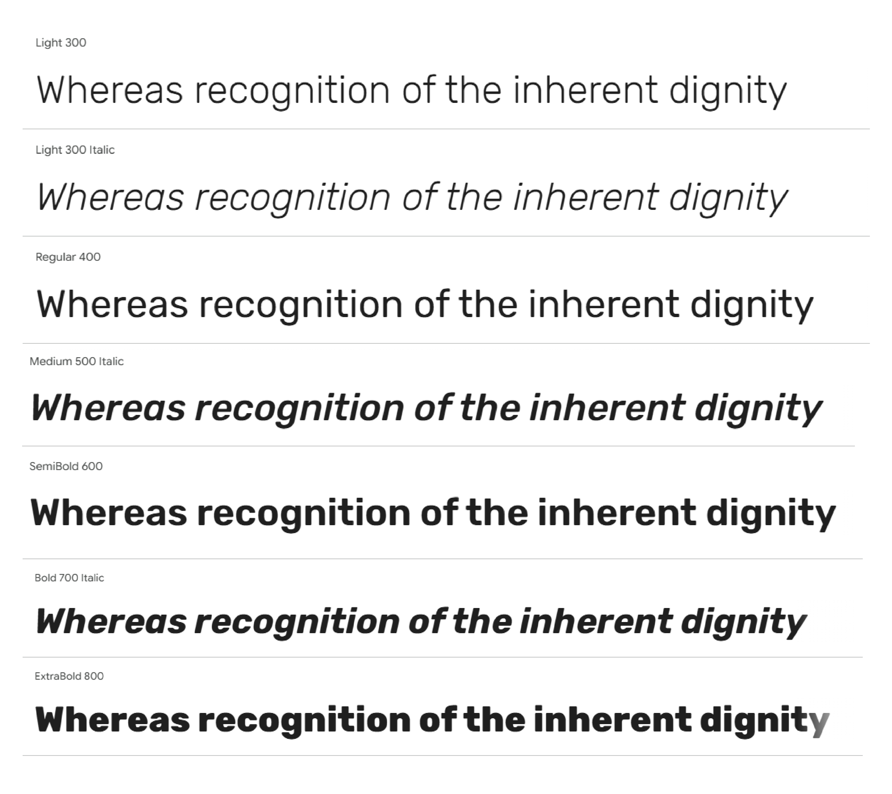

Esta distribución garantiza un contraste óptimo entre el texto y el fondo, superando un ratio mínimo de 4.5:1 según las WCAG 2.1 AA para una accesibilidad superior en entornos de laboratorio.

 

**Colors**

Nuestra paleta de colores ha sido cuidadosamente seleccionada para evocar sensaciones de pulcritud, profesionalismo tecnológico y control. Se ha distribuido en tres categorías principales:

**Paleta principal**: Colores que definen la identidad de QualiTrack y se usan en elementos clave.
* **Primario (Azul QualiTrack):** var(--primary-color) (referencia principal).
* **Secundario (Azul Profundo):** var(--secondary-color) (para texto principal y elementos interactivos).
* **Terciario (Gris Oscuro):** var(--tertiary-color) (para texto secundario y detalles).
* **Fondo Claro:** var(--bg-light) (fondos de secciones).
* **Fondo Blanco:** var(--white) (fondos de tarjetas y elementos principales).
  
**Paleta de Soporte**: Colores complementarios que añaden profundidad y contraste.
* **Gris Neutro:** Para bordes sutiles, líneas divisorias y fondos de alternancia.

**Colores Funcionales**: Reservados para comunicar estados específicos al usuario.
* **Éxito:** Verde (#4CAF50) para confirmaciones y acciones exitosas.
* **Error:** Rojo (#F44336) para alertas y mensajes de error.
* **Advertencia:** Amarillo (#FFC107) para notificaciones y avisos importantes.

  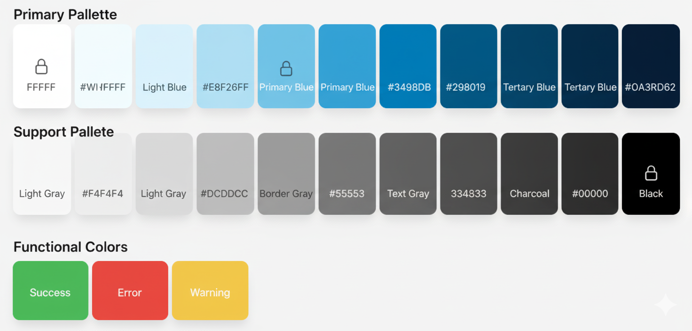

Esta combinación cromática refleja los valores de nuestra marca y busca transmitir al público (laboratorios e instituciones como DIGEMID) una imagen de rigor científico, seguridad y trazabilidad inmutable.

 

**Spacing**

El espaciado en QualiTrack sigue un sistema de espaciado modular y consistente para garantizar un ritmo visual armonioso y una jerarquía clara en toda la interfaz. La consistencia en el espaciado ayuda a reducir la carga cognitiva del usuario y mejora la legibilidad de los reportes técnicos.

* **Espaciado Básico:** Usamos un espaciado base en el sistema de grid. Este valor es la unidad mínima y se multiplica para crear espacios más grandes.
* **Margen Interno (Padding) Generoso:** Las secciones principales de la página utilizan un padding vertical de 5rem (50px) para crear pausas visuales claras. Los contenedores de tarjetas o elementos secundarios usan padding más pequeños, como 3rem a 4rem (30px - 40px), para agrupar el contenido de forma lógica.
* **Espacio entre Elementos:** El espaciado entre elementos relacionados, como las tarjetas de planes o el bloque de características (features), varía entre 3rem (30px) y 5rem (50px). Esto mantiene una densidad de información adecuada sin abrumar visualmente al usuario frente a las métricas.
* **Line Height del Texto:** El interlineado del texto (line-height) está configurado en 1.6, lo que facilita la lectura de párrafos largos y evita que las líneas de datos se sientan demasiado juntas.

 

**Tono de Comunicación**

La voz y el tono de QualiTrack están diseñados para ser tan confiables y precisos como nuestra telemetría IoT. Nuestro objetivo es conectar con Jefes de Calidad e Inspectores Públicos de manera altamente profesional y técnica.

* **Tono: Formal y corporativo,** con un enfoque en la precisión. Buscamos proyectar autoridad y dominio sobre normativas regulatorias (BPM, Data Integrity), manteniendo la seriedad que exigen los laboratorios farmacéuticos.
* **Actitud: Resolutiva y segura.** El 90% de nuestra comunicación es orientada a la eficiencia y reducción de errores ("Eliminación del error humano", "Trazabilidad Inmutable"), mientras que el 10% restante es persuasiva, especialmente en los llamados a la acción para solicitar demos.
* **Lenguaje: Técnico y directo.** No evitamos la jerga de la industria, ya que nuestro usuario final la utiliza a diario (ej. LIMS, DIGEMID, Autoclaves, Telemetría). Nos enfocamos en los beneficios operativos que QualiTrack aporta a las líneas de producción.
* **Voz: Experta y vanguardista.** Posicionamos a QualiTrack como el estándar de la industria 4.0 en manufactura farmacéutica, siendo el escudo digital frente a las inspecciones regulatorias.

Este enfoque comunicacional busca generar confianza corporativa, asegurando a los laboratorios que están automatizando sus procesos de forma segura, y a las entidades de salud pública, que la plataforma garantiza la transparencia absoluta de los datos.

### 4.1.2. Web Style Guidelines

Las directrices de estilo web de **QualiTrack** se centran en la precisión técnica, la inmutabilidad de los datos y la eficiencia operativa. Nuestro objetivo es crear una experiencia visual que refleje la misión de nuestra plataforma: digitalizar y automatizar el control de calidad farmacéutico con un diseño limpio, tecnológico y altamente funcional.

**1) Layout**

* **Sistema de Grid:** Utilizamos un diseño de cuadrícula flexible para garantizar que el contenido de QualiTrack se adapte perfectamente a cualquier resolución. Este enfoque permite que las tarjetas de telemetría y los planes de suscripción se ajusten dinámicamente, manteniendo el orden y la coherencia visual necesarios en un entorno industrial.
* **Headers y Footers:** El encabezado (header) es fijo en la parte superior, proporcionando acceso constante a la navegación principal y a los botones de acceso al sistema (*Sign In*, *Sign Up*). El pie de página (footer) es completo y funcional, centralizando los enlaces legales, información de contacto institucional y la suscripción a actualizaciones.
* **Cards:** Las tarjetas son el componente central de nuestra interfaz para estructurar información crítica. Se utilizan para destacar los pilares de nuestra oferta (IoT, *Compliance*, Auditorías) y los planes de precios. Cuentan con bordes redondeados y sombras suaves para darles una apariencia moderna y "elevada", facilitando la lectura de parámetros técnicos.

**2) Responsive Design**

* **Desktop:** La navegación principal es totalmente visible en la barra superior junto a las acciones de usuario. El contenido se presenta en múltiples columnas para un uso eficiente del espacio en monitores de estaciones de trabajo de laboratorio.
* **Tablet:** Los elementos de la cuadrícula se adaptan a un diseño de dos columnas. Los botones y campos táctiles mantienen un tamaño adecuado para facilitar la interacción con guantes o en movimiento.
* **Mobile:** La experiencia está optimizada para una sola columna. La navegación se desplaza a un menú desplegable, y todos los elementos interactivos son grandes y claros, ideales para supervisores que monitorean la planta desde dispositivos móviles.

**3) Interaction Design**

* **Botones:** Nuestros botones son llamativos y utilizan los colores de marca. Cuentan con efectos visuales lineales al pasar el cursor para confirmar la interactividad. El botón principal de llamado a la acción destaca claramente para incentivar la conversión.
* **Formularios:** El formulario de contacto en el pie de página es sencillo y directo, ofreciendo una guía visual rápida y coherente en toda la página.

**4) Images and Icons**

* **Imágenes:** Se utilizan fotografías de alta calidad que evocan el entorno farmacéutico moderno: científicos en laboratorios y plantas de manufactura digitalizadas. Las imágenes están optimizadas para carga rápida y refuerzan el mensaje de tecnología aplicada a la seguridad de la salud.
* **Íconos:** Empleamos un estilo lineal y minimalista. Estos íconos representan visualmente servicios críticos como la telemetría IoT (antena), gestión de lotes (matraz) y cumplimiento regulatorio (escudo), ofreciendo una guía visual rápida y coherente en toda la página.

**5) Repositorio Central**

* **Organización:** El proyecto sigue una estructura de archivos lógica y modular. Los activos visuales se encuentran en `public/assets/images`, los estilos en `public/assets/styles/style.css`, y la lógica interactiva en `public/assets/scripts/main.js`.
* **Versionado:** Usamos **Git** como sistema de control de versiones para gestionar los cambios en el código y asegurar que todo el equipo de ClosedSource trabaje sobre la versión más estable y actualizada del producto.

## 4.2. Information Architecture

La arquitectura de la información de **QualiTrack** está diseñada para una navegación intuitiva y técnica, permitiendo que los Jefes de Aseguramiento de Calidad y Directores de Salud Pública encuentren rápidamente la información sobre cumplimiento y telemetría.

### 4.2.1. Organization Systems

* **Jerarquía de Contenidos:** La información está estructurada de lo general a lo específico para facilitar la toma de decisiones. Comenzamos con una propuesta de valor en la sección **Hero**, seguida de los pilares de nuestra oferta, y profundizamos en beneficios técnicos y planes de suscripción en las secciones finales.
* **Secciones Principales:** La página de inicio está organizada en bloques clave:
    * **Hero:** El futuro de la gestión de QualityTrack.
    * **What We Offer:** Visión general de los servicios ofrecidos.
    * **Features:** Desglose técnico de funcionalidades clave del producto.
    * **Benefits:** Ventajas competitivas como la eliminación del error humano.
    * **About Us:** Propósito de QualiTrack y cumplimiento con DIGEMID.
    * **Our Team:** Perfiles del equipo de ClosedSource.
    * **Plans:** Opciones de precios Standard y Enterprise.
    * **Testimonials & CTA:** Reseñas de directores de QA y llamado a la acción final.
* **Agrupación de Contenidos:** El contenido se agrupa lógicamente mediante el uso de contenedores visuales. Por ejemplo, las funcionalidades de la plataforma se presentan en un acordeón interactivo para no saturar al usuario, permitiéndole expandir solo el área de su interés técnico.

### 4.2.2. Labeling Systems

* **Nomenclatura:** Se utiliza un lenguaje técnico alineado a la industria farmacéutica en los títulos de las secciones. Los botones tienen etiquetas accionables como *Request a Demo*, *Sign In* y *Sign Up*.
* **Consistencia:** Mantenemos una nomenclatura uniforme en toda la plataforma. La sección de costos se identifica como *Plans* tanto en la navegación principal como en el título de la sección de precios.
* **Lenguaje Adaptativo:** El contenido está diseñado para ser comprendido por profesionales del sector farmacéutico, integrando términos regulatorios clave como DIGEMID y BPM sin perder la claridad operativa.

### 4.2.3. Searching Systems

* **Barra de Búsqueda:** Aunque la *landing page* informativa no la requiere, una vez que el usuario accede a la aplicación SaaS de QualiTrack, esta funcionalidad será crítica. Estará ubicada en el panel de control para buscar rápidamente por **ID de Lote**, sensores específicos o reportes de auditoría.
* **Filtros y Facetas:** Dentro de la aplicación, los usuarios podrán filtrar datos por tipo de equipo (autoclaves, pH metros), rangos de fecha de producción o severidad de alertas de cumplimiento detectadas.
* **Historial de Búsqueda:** Se implementará un registro para que los auditores y administradores puedan acceder rápidamente a los lotes consultados con mayor frecuencia durante las inspecciones.
* **Resultados Relevantes:** Los resultados se priorizarán según la criticidad de la alerta o la fase actual del lote de producción.

### 4.2.4. Navigation Systems

* **Navegación Global:** La barra de navegación en el encabezado proporciona acceso principal a las secciones de la página de inicio (*Home, Features, Benefits, About Us, Plans*).
* **Navegación Contextual:** Enlaces internos y botones estratégicos (CTAs) guían al usuario hacia la siguiente etapa de su recorrido, como la solicitud de una demostración técnica.

## 4.3. Landing Page UI Design

El diseño de la interfaz de usuario (UI) de la página de inicio de QualiTrack es fundamental para captar la atención de los profesionales del sector farmacéutico y guiarlos hacia una acción clara: garantizar el cumplimiento normativo y la integridad de datos en sus procesos de manufactura. Nos hemos centrado en la creación de una experiencia intuitiva y fluida, asegurando que cada elemento de la página sea interactivo y fácil de usar, reflejando el compromiso de QualiTrack con la precisión, la transparencia y la automatización inteligente en la gestión de calidad farmacéutica.

### 4.3.1. Landing Page Wireframe

El wireframe de nuestra página de inicio sirve como un mapa visual que define la estructura y el flujo de la información, alineado con los principios de rigurosidad y claridad que exige el sector farmacéutico. Este esquema asegura una disposición lógica de los componentes, facilitando la navegación y destacando la propuesta de valor de **QualiTrack.** Las secciones del wireframe están diseñadas para contar una historia completa y persuasiva:

**Nav y Hero:**

Esta sección inicial incluye el logotipo de QualiTrack junto con una presentación breve que introduce al visitante en la propuesta de valor de la plataforma: 'The Future of Pharmaceutical Quality Management' (El futuro de la gestión de calidad farmacéutica). La barra de navegación permite un acceso rápido a secciones clave como Features, Benefits y About Us, mientras que el área principal ofrece una visión concisa del producto, acompañada de un claro llamado a la acción: 'Start now →' (Comenzar ahora →). Un elemento visual atractivo refuerza el mensaje de innovación tecnológica, precisión y cumplimiento regulatorio que distingue a QualiTrack.

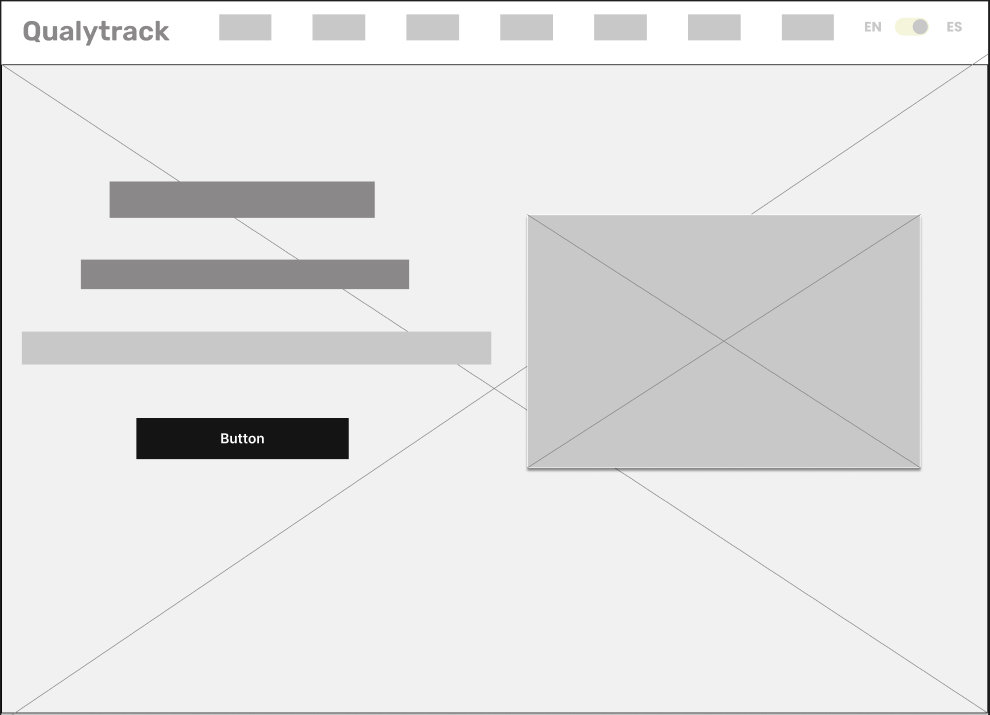

**Services (What We Offer):**

Aquí se detallan los servicios principales de QualiTrack: Real-Time IoT Monitoring, Automated BPM Compliance, Immutable Audit Trails y Digital Batch Management. Cada servicio se presenta con un icono representativo y una breve descripción, haciendo que nuestra oferta sea fácil de entender y visualmente accesible.

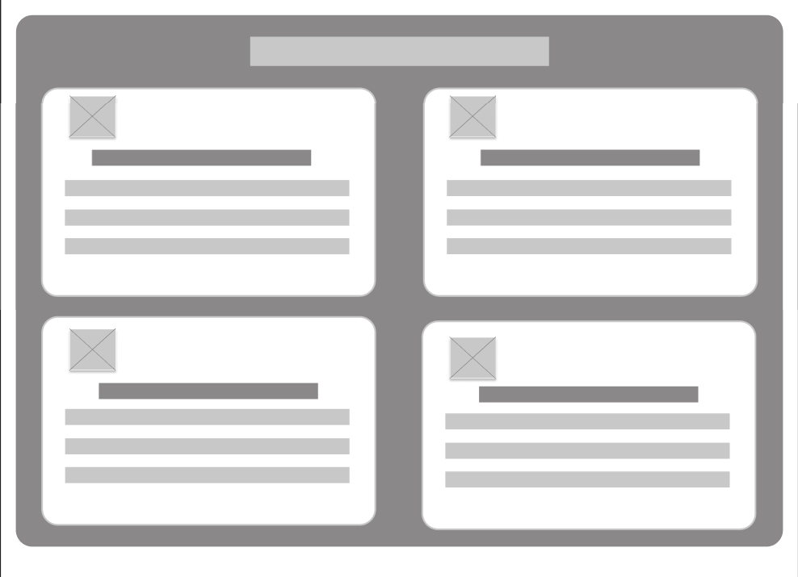

**Acerca de la aplicación (About the Platform):**

Esta sección presenta lo que hace única a QualiTrack: una plataforma para laboratorios farmacéuticos que automatiza el control de calidad mediante integración IoT, elimina errores manuales y garantiza la trazabilidad inmutable. Destacamos beneficios clave como captura automática de telemetría, alertas en tiempo real y cumplimiento nativo con normativas DIGEMID.

**Sobre el Equipo (Our Team):**

En esta sección, se humaniza la marca al presentar al equipo detrás de QualiTrack. Con fotos y descripciones de los miembros, mostramos a las personas dedicadas a este proyecto, construyendo confianza y una conexión personal con los visitantes.

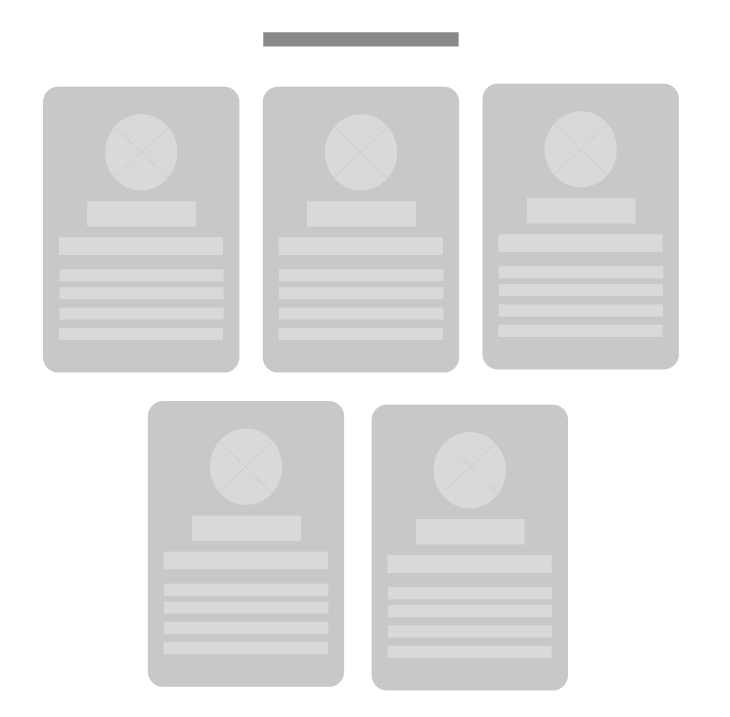

**Precios (Plans):**

La sección de Precios ofrece una visión clara de los planes disponibles. Presentamos el Standard Lab Plan y el Enterprise Plan, con una comparativa de características para ayudar a los usuarios a elegir la opción que mejor se adapte a sus necesidades, ya sea para un laboratorio mediano o para una institución de salud pública. Un selector entre tarifas mensuales y anuales, junto con la indicación del ahorro asociado, facilita una elección más informada.

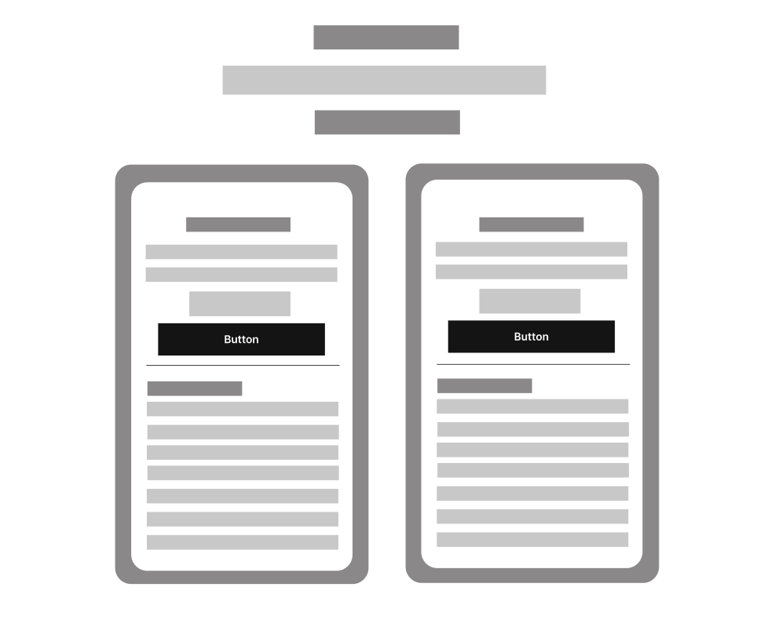

**Footer:**

El pie de página es un elemento crucial para la usabilidad. Contiene enlaces a información vital como "Terms of Service" y "Privacy Policy", además de detalles de contacto (correo electrónico, teléfono y ubicación). Esto proporciona un acceso rápido a la información sin saturar la interfaz, ofreciendo un cierre limpio y funcional a la página.

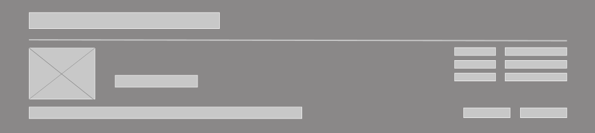

Este wireframe sienta las bases para un diseño visual que no solo se ve bien, sino que también guía al usuario de manera intuitiva a través de nuestra propuesta de valor, reforzando la confianza y la conexión que QualiTrack promete.

### 4.3.2. Landing Page Mock-up

**Hero de la aplicación**

El hero de nuestra plataforma QualiTrack presenta una imagen principal que evoca precisión tecnológica y cumplimiento normativo, con un título claro: 'The Future of Pharmaceutical Quality Management'. Una breve descripción capta nuestra esencia de automatización y trazabilidad inmutable, y un botón de llamado a la acción 'Start now →' invita a los usuarios a dar el primer paso hacia la digitalización de sus procesos de calidad. Una barra de navegación en la parte superior permite acceder de forma fluida a todas las secciones de la página, proporcionando una experiencia de usuario intuitiva.

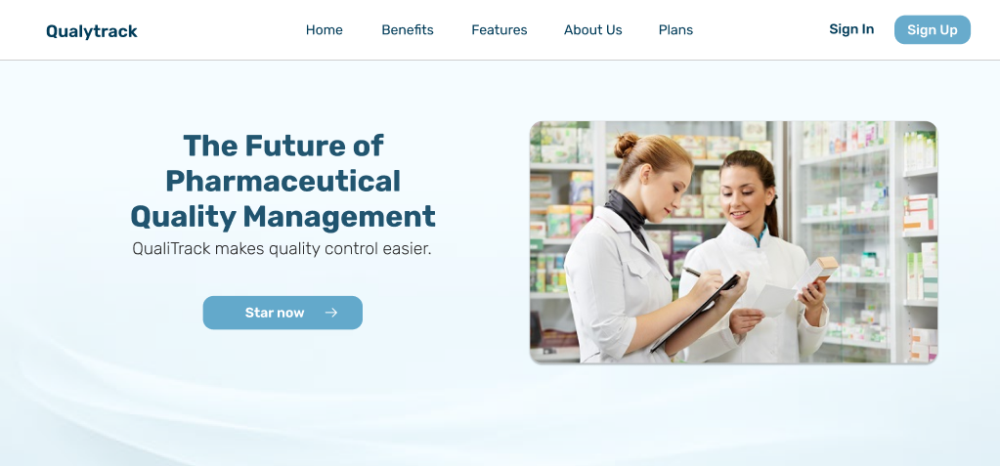

**What We Offer**

En la sección 'What We Offer', presentamos nuestras principales áreas de servicio a través de tarjetas con iconos representativos. Cada tarjeta cuenta con un título y una breve descripción, como 'IoT Integration', 'Immutable Traceability' o 'Regulatory Compliance', lo que permite a los usuarios entender rápidamente el alcance de nuestra plataforma y los tipos de soluciones que ofrecemos para la gestión de calidad farmacéutica.

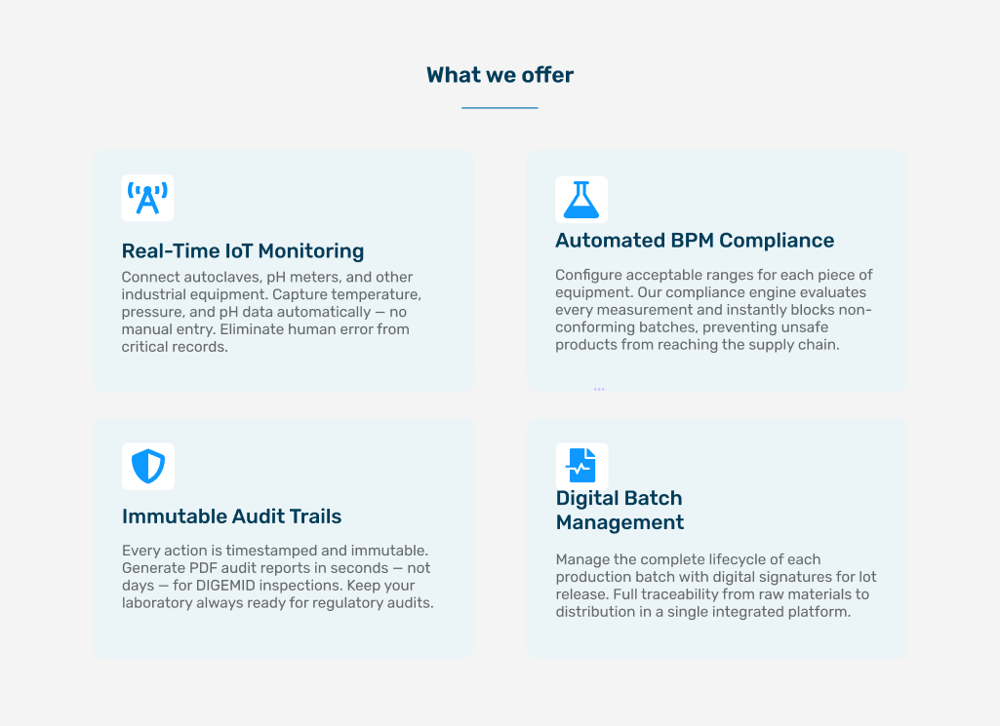

**Features**

La sección de "Features" muestra las funcionalidades clave de QualiTrack. El diseño tipo acordeón permite a los usuarios expandir cada característica para leer su descripción completa, mientras que un video de demostración de YouTube al lado les ofrece una vista visual de la plataforma en acción. Esto combina información detallada con un formato interactivo y dinámico.

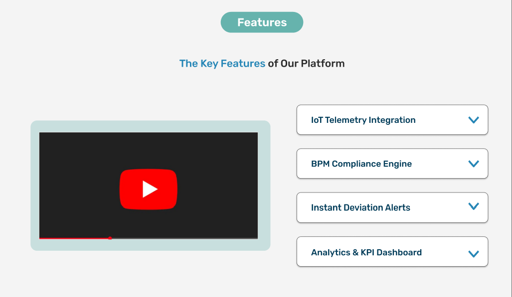

**Benefits**

En 'Benefits', destacamos las ventajas de utilizar QualiTrack. A través de un diseño de tarjetas con imágenes, títulos y descripciones, comunicamos cómo nuestra plataforma elimina el error humano en registros críticos, agiliza la preparación para auditorías regulatorias y aumenta la integridad y trazabilidad de los datos tanto para laboratorios farmacéuticos como para entidades de salud pública.

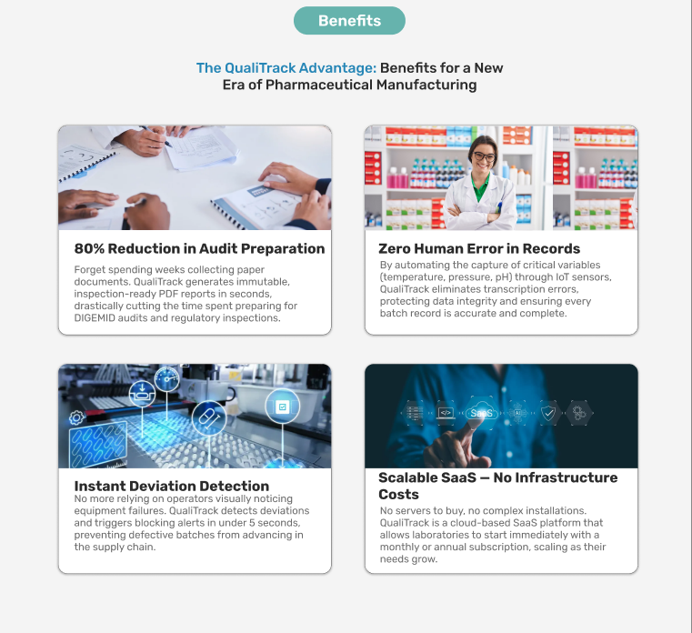

**About Us**

La sección 'About Us' presenta a ClosedSource, la empresa detrás de QualiTrack. Aquí, compartimos nuestra misión de transformar la supervisión de procesos farmacéuticos mediante la integración IoT y el cumplimiento normativo, así como los valores de innovación, transparencia e integridad de datos que nos impulsan. Un video o imagen animada acompaña el texto, reforzando nuestro mensaje de una manera visualmente atractiva y moderna.

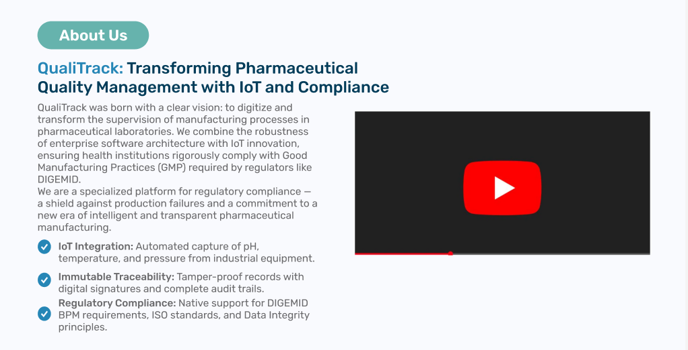

**Our Team**

La sección "Our Team" presenta a los ingenieros de software detrás de ClosedSource. Las tarjetas de perfil muestran una foto, el nombre, el cargo y una breve biografía de cada miembro. El diseño de 3 tarjetas arriba y 2 abajo, centradas, brinda un aspecto organizado y profesional, permitiendo a los usuarios conocer al equipo de desarrollo.

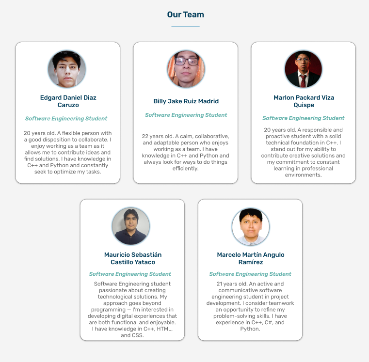

**Plans**

En la sección de "Plans", ofrecemos los detalles de nuestros planes de precios. Las tarjetas de "Standard Lab Plan" y "Enterprise Home Plan" incluyen descripciones, precios con opciones mensuales y anuales, y listas de características. El diseño permite un fácil cambio entre planes mensuales y anuales, facilitando la elección del plan adecuado.

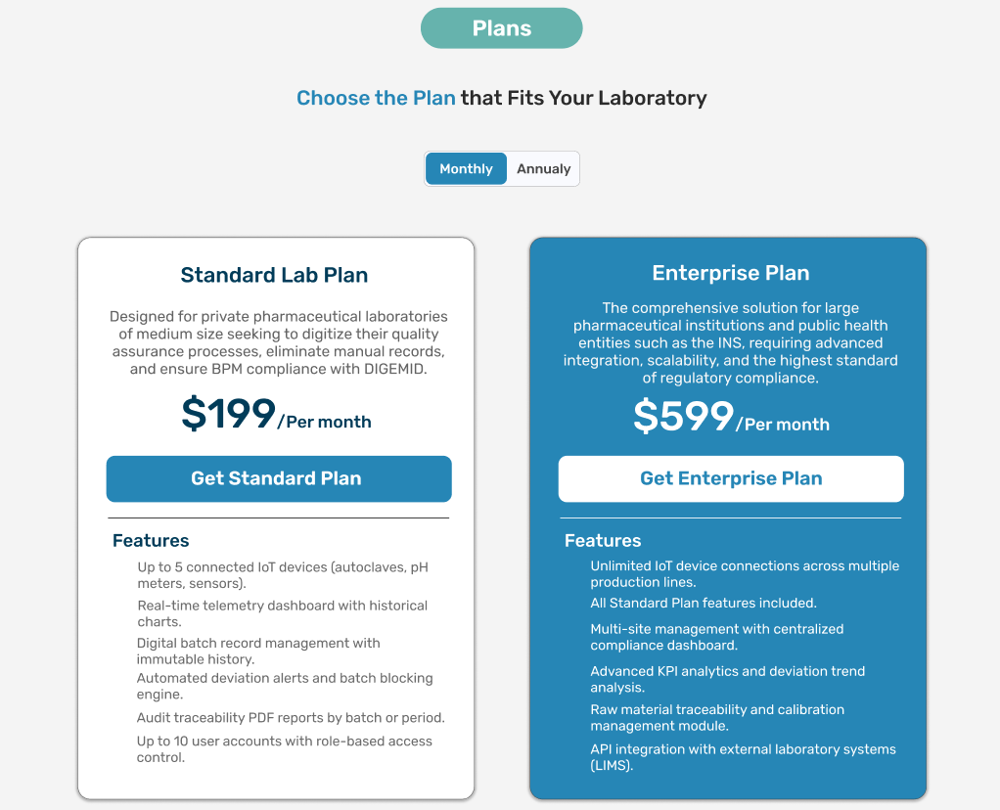

**Footer**

El "Footer" de nuestra landing page contiene enlaces útiles y recursos adicionales. Un formulario de suscripción invita a los usuarios a unirse a nuestra comunidad. El logo de QualiTrack, enlaces de contacto, información legal y de derechos de autor se encuentran aquí, asegurando que toda la información relevante esté fácilmente accesible para los usuarios.

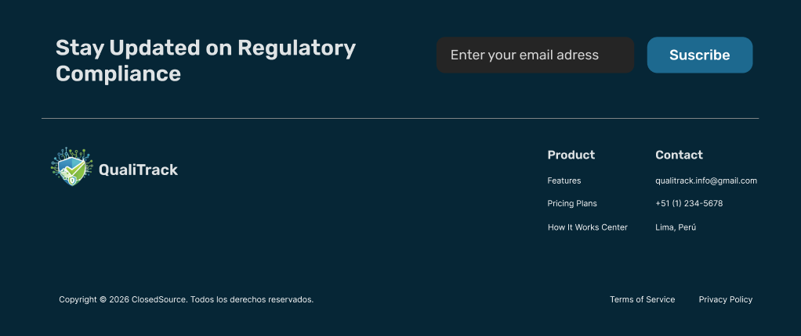

## 4.4. Web Applications UX/UI Design

### 4.4.1. Web Applications Wireframes

En esta sección se presentan los **wireframes diseñados para la aplicación web de ClosedSource(QualiTrack)**. Cada pantalla responde a las funcionalidades principales del sistema de gestión de calidad e integración IoT, atendiendo a los roles de usuario definidos: Jefe de Aseguramiento de la Calidad (QA), Operario de planta y Auditor.

**Portal de Inicio - ClosedSource** 

Pantalla principal de presentación donde se ofrecen las opciones de ingreso y registro de nuevas plantas industriales.

**Crear Cuenta - ClosedSource**  

Formulario para registrar laboratorios, solicitando datos del responsable y credenciales de acceso.

**Ingreso al Sistema - ClosedSource** 

Pantalla de autenticación para usuarios registrados con campos de correo y contraseña.

**Panel de Control - ClosedSource** 

Vista general de la planta que muestra el progreso del lote activo y el estado de las unidades de producción.

**Ejecución de Lote - ClosedSource** 

Interfaz para registrar materias primas y verificar procesos con monitoreo de telemetría en vivo.

**Estado de Equipos - ClosedSource** 

Pantalla de monitoreo técnico que detalla el funcionamiento de la maquinaria y sus sensores IoT.

**Centro de Alertas - ClosedSource** 

Módulo de respuesta ante emergencias que permite pausar procesos cuando se detectan desviaciones críticas.

**Resumen de Calidad - ClosedSource** 

Panel consolidado con gráficos e indicadores de cumplimiento (KPIs) globales del laboratorio.

**Módulo de Cumplimiento - ClosedSource** 

Sección dedicada a la validación de normativas y estándares de calidad para cada producto.

**Historial de Lotes - ClosedSource** 

Listado de trazabilidad que permite buscar y filtrar todos los lotes fabricados anteriormente.

**Análisis y Configuración de Equipos - ClosedSource**

Panel técnico para el monitoreo de telemetría de equipos activos y la configuración detallada de umbrales y parámetros BPM

 

**Logs de Auditoría - ClosedSource**

Interfaz para exportar registros de eventos inmutables para inspecciones de DIGEMID.

### 4.4.2. Web Applications Wireflow Diagrams

Los Wireflows se utilizan, sobre todo, en el diseño de la experiencia del usuario (UX) y son particularmente beneficiosos para aplicaciones que contienen interacciones complejas y flujos de trabajo.

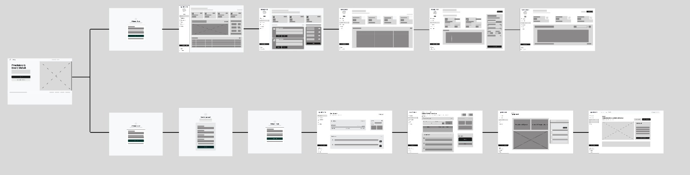

### 4.4.3. Web Applications Mock-ups

### 4.4.4. Web Applications User Flow Diagrams

## 4.5. Web Applications Prototyping

## 4.6. Domain-Driven Software Architecture

## 4.6.1. Design-Level Event Storming

Para identificar los eventos de dominio, es recomendable realizar una sesión de Event 
Storming. Esta técnica permite visualizar y comprender el flujo de eventos dentro del 
dominio, facilitando la identificación de los Bounded Contexts.

El desarrollo del proceso del Domain-Driven Design se realizó en la aplicación Miro: 
[https://shorturl.at/0eSVT]

---

### Bounded Context IAM

El bounded context IAM (Identity and Access Management) se encarga de la autenticación, 
autorización y gestión de credenciales dentro del ecosistema QualiTrack. Administra 
procesos como el registro de usuarios, inicio de sesión, recuperación de contraseñas y 
asignación de permisos según el rol (jefe de QA, operario, auditor). Su propósito es 
garantizar accesos seguros, confiables y alineados con las políticas de protección de la 
información regulatoria en toda la plataforma.

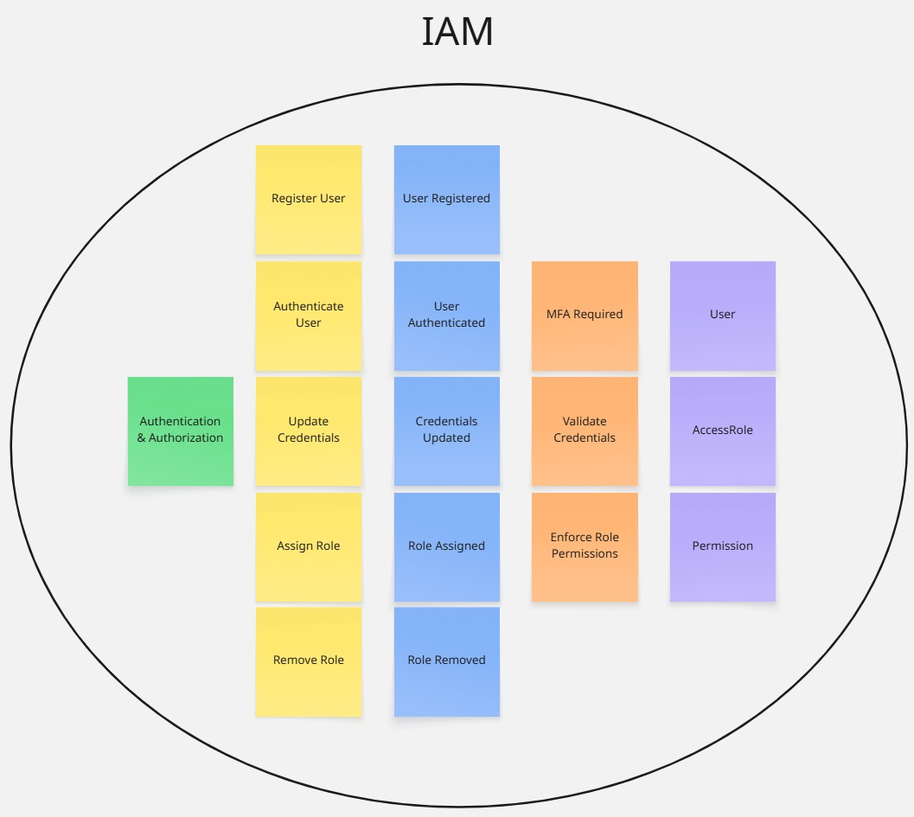

---

### Bounded Context Laboratory Management

El bounded context Laboratory Management gestiona toda la información institucional del 
laboratorio farmacéutico dentro de QualiTrack: datos del laboratorio, normativas 
regulatorias aplicables, catálogo de productos farmacéuticos, materias primas y personal 
técnico. Administra la creación, actualización y mantenimiento de los datos base del 
laboratorio. Su propósito es centralizar la ficha institucional y servir como base para 
otros contextos como Equipment Management, Batch Management y Reporting & Audit.

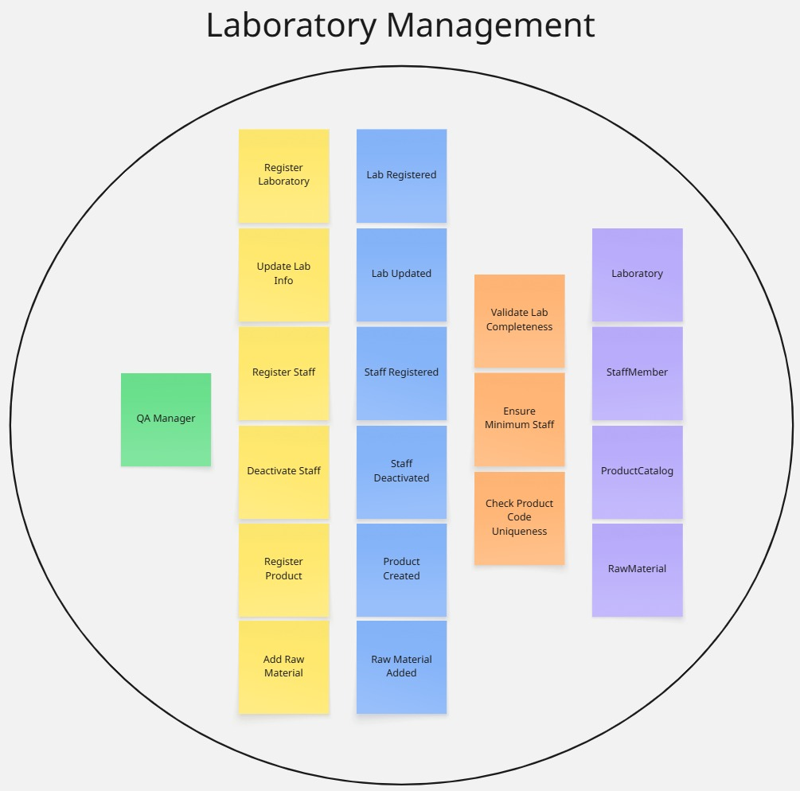

---

### Bounded Context Equipment Management

El bounded context Equipment Management gestiona el ciclo de vida completo de los equipos 
industriales del laboratorio: autoclaves, medidores de pH, termómetros y sensores de 
presión. Incluye el registro de equipos, la vinculación con sensores IoT, la configuración 
de parámetros BPM por variable, el registro de mantenimientos y el control de calibración. 
Se integra con Tracking para habilitar la recepción de telemetría y con Compliance & 
Alerting para aplicar los rangos configurados. Su propósito es asegurar que todos los 
equipos conectados estén correctamente identificados, calibrados y con parámetros de control 
actualizados.

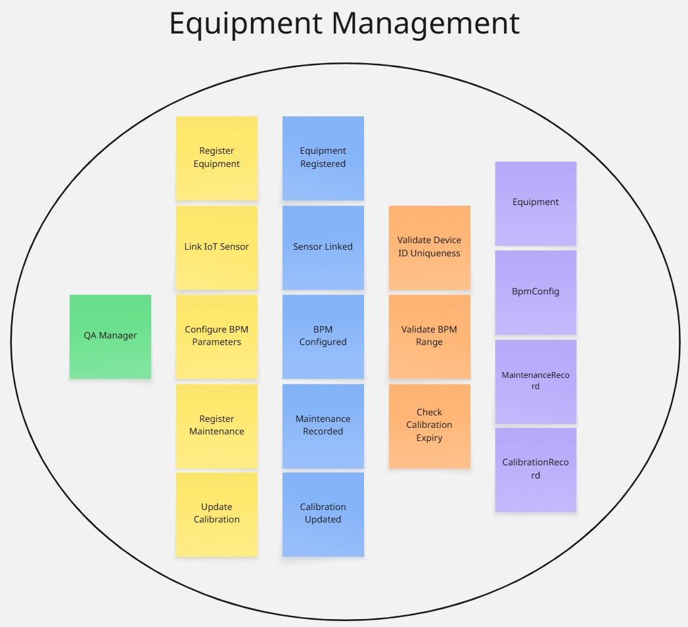

---

### Bounded Context Tracking (IoT)

El bounded context Tracking constituye uno de los núcleos del sistema QualiTrack. Captura, 
sincroniza y almacena la telemetría enviada por los sensores IoT vinculados a los equipos 
industriales. Registra variables críticas como temperatura, presión y pH en tiempo real, 
con marca de tiempo y asociación al equipo y lote correspondiente. Estos datos son enviados 
al contexto Compliance & Alerting para su evaluación normativa y a Reporting & Audit para 
análisis histórico. Su propósito es brindar monitoreo continuo y automático del estado 
operativo de los equipos de producción, eliminando la dependencia de registros manuales.

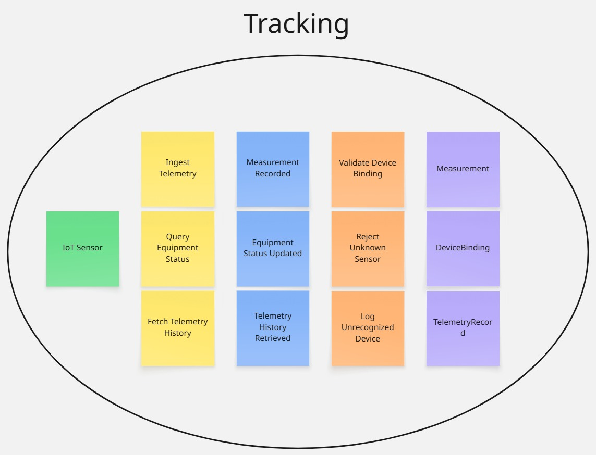

---

### Bounded Context Compliance & Alerting

El bounded context Compliance & Alerting es el otro núcleo estratégico de QualiTrack. 
Procesa, evalúa y clasifica cada medición recibida desde Tracking comparándola con los 
parámetros BPM configurados para el equipo correspondiente. Cuando detecta una desviación 
crítica, genera alertas inmediatas para el operario de turno, notifica al jefe de 
Aseguramiento de la Calidad y bloquea automáticamente el lote asociado, impidiendo su 
avance en la cadena de suministro. Administra también el historial de eventos de compliance 
y las preferencias de notificación de los usuarios. Su propósito es garantizar que ninguna 
desviación de los parámetros BPM pase desapercibida, protegiendo la integridad del producto 
y el cumplimiento normativo ante DIGEMID.

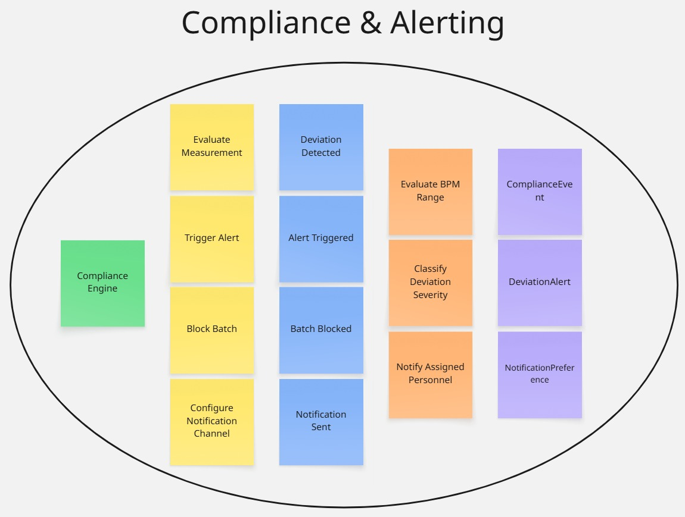

---

### Bounded Context Batch Management

El bounded context Batch Management representa el núcleo operativo de la gestión de 
producción en QualiTrack. Administra el ciclo de vida completo de cada lote farmacéutico: 
desde su creación y vinculación con materias primas y equipos, hasta su liberación digital 
mediante firma del jefe de QA o su rechazo documentado. Conecta flujos con Equipment 
Management para asociar equipos al lote, con Tracking para recibir telemetría vinculada, 
con Compliance & Alerting para gestionar bloqueos automáticos y con Reporting & Audit para 
la generación de registros inmutables. Su propósito es garantizar la trazabilidad completa 
de cada lote de producción, asegurando que toda decisión de liberación o rechazo quede 
registrada de forma inmutable y auditable.

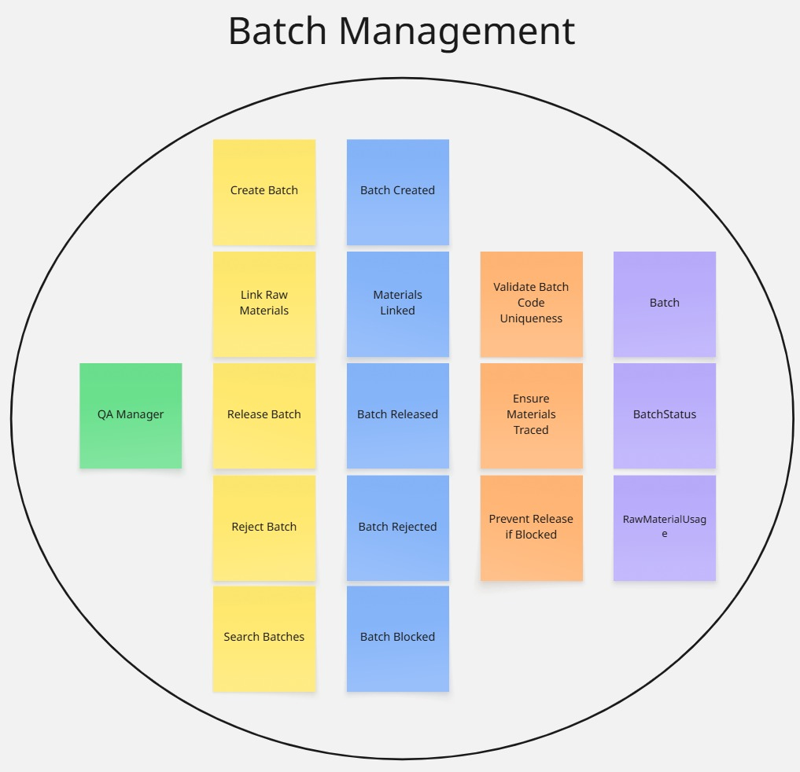

---

### Bounded Context Reporting & Audit

El bounded context Reporting & Audit recopila información de múltiples fuentes (Tracking, 
Compliance & Alerting, Batch Management, Equipment Management) para generar reportes de 
trazabilidad inmutables, logs de auditoría y visualizaciones de indicadores clave de 
calidad (KPIs). Permite la generación de reportes PDF no editables por lote o por periodo, 
la exportación de logs de eventos de equipos y el análisis de tendencias de desviaciones. 
Su propósito es ofrecer una capa de transparencia y evidencia documental que permita 
afrontar inspecciones de DIGEMID con toda la información consolidada, reduciendo el tiempo 
de preparación de auditorías en un 80%.

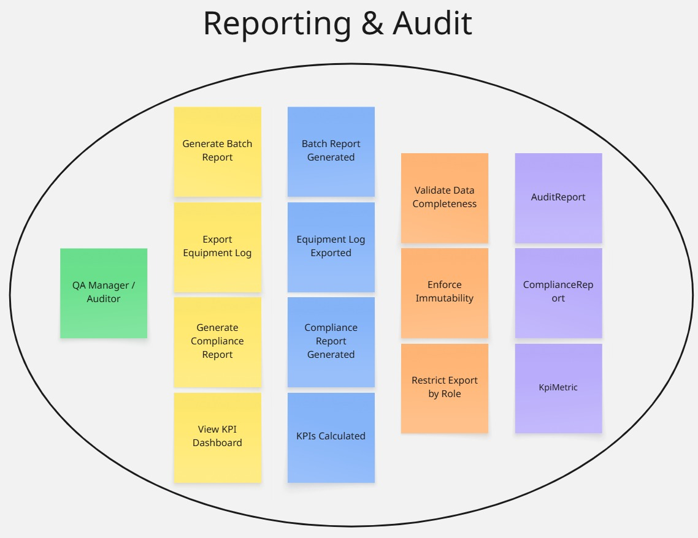

---

### Bounded Context Shared

El bounded context Shared contiene los elementos reutilizables y transversales utilizados 
por todos los demás contextos de QualiTrack, como configuraciones globales, value objects 
comunes (LabId, UserId, DateRange, Quantity), clases base auditables, plantillas de 
eventos de dominio y políticas compartidas. Gestiona además el registro de tenants y la 
propagación de configuraciones por defecto a los contextos dependientes. Su propósito es 
evitar la duplicidad de lógica entre contextos, asegurar la coherencia de los datos 
compartidos y proveer una base técnica sólida y reutilizable para toda la arquitectura de 
QualiTrack.

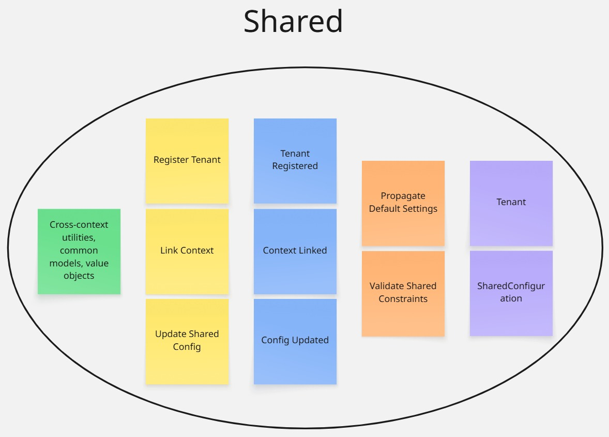

## 4.6.2. Software Architecture Context Diagram

En este nivel se presenta una vista de alto nivel de la arquitectura, donde el foco está
en el sistema de software QualiTrack como una "caja negra" y en las interacciones que
mantiene con sus usuarios y con otros sistemas externos.

El context diagram muestra al **QualiTrack Software System** como un recuadro en el
centro, rodeado por los principales actores y sistemas con los que se comunica:

- **QA Manager / Supervisor:** usuario interno responsable de gestionar el laboratorio,
registrar y liberar lotes de producción, configurar parámetros BPM de los equipos,
supervisar el dashboard de telemetría en tiempo real y generar reportes de auditoría
para DIGEMID.

- **Lab Operator:** usuario operativo que monitorea el estado de los equipos industriales
durante los turnos de producción, recibe alertas de desviación de parámetros BPM y
registra observaciones sobre el proceso de fabricación.

- **IoT Sensors / Industrial Equipment:** sistema externo compuesto por los sensores
conectados a los equipos industriales del laboratorio (autoclaves, medidores de pH,
termómetros, sensores de presión). No representan un actor humano, sino un sistema
automatizado que envía telemetría de variables críticas de forma continua hacia
QualiTrack mediante endpoints REST, sin intervención manual.

- **Email Notification Service:** servicio externo de correo electrónico utilizado para
enviar notificaciones transaccionales a los usuarios (alertas de desviación crítica,
confirmación de registro, alertas de calibración próxima a vencer, reportes de auditoría
generados).

- **PDF Generation Service:** servicio externo utilizado para generar los reportes de
trazabilidad inmutables en formato PDF no editable, garantizando la integridad documental
requerida para las inspecciones de DIGEMID.

En el diagrama se representan las relaciones entre estos elementos. El QA Manager y el
Lab Operator interactúan con QualiTrack a través de la interfaz web. Los sensores IoT
envían telemetría entrante hacia QualiTrack de forma automática. QualiTrack se encarga
de orquestar las integraciones salientes con los servicios externos (notificaciones por
correo y generación de reportes PDF). Esta vista permite entender el alcance del sistema,
los límites de responsabilidad y el ecosistema en el que se inserta QualiTrack antes de
entrar a detalles de implementación.

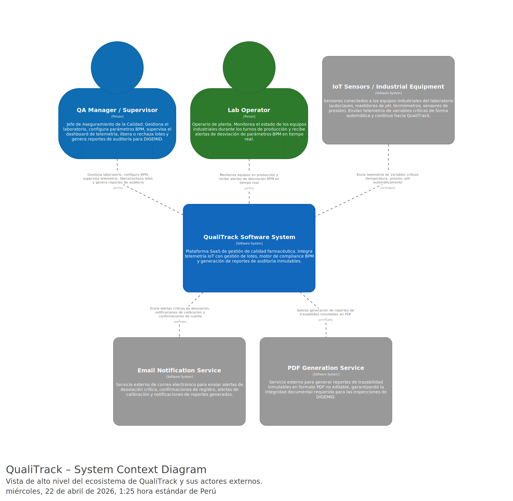

---

## 4.6.3. Software Architecture Container Diagrams

En el nivel de contenedores, la atención se desplaza desde "quién usa el sistema" hacia
"cómo se organiza internamente el sistema en aplicaciones y fuentes de datos". El
container diagram muestra los elementos de alto nivel de la arquitectura de QualiTrack,
sus responsabilidades principales y la forma en que se comunican entre sí y con los
sistemas externos.

La arquitectura lógica de QualiTrack se estructura en los siguientes contenedores:

- **Landing Page:** aplicación web estática que presenta la propuesta de valor de
QualiTrack, informa sobre las funcionalidades de la plataforma y los planes de
suscripción disponibles para laboratorios farmacéuticos. Está desarrollada con
tecnologías web estándar (HTML, CSS y JavaScript). Cuando el usuario desea acceder a
la aplicación, delega la entrega del bundle al servidor web.

- **Web Application:** servidor web implementado con **Nginx** que actúa como servidor
de archivos estáticos. Recibe la delegación de la Landing Page y entrega el bundle
compilado de la SPA Angular al navegador del usuario. Este contenedor separa la
responsabilidad de servir el contenido estático de la lógica de negocio del backend.

- **QualiTrack Web Client Application (SPA):** aplicación web principal implementada en
**Angular** que corre directamente en el navegador del usuario. Una vez entregado el
bundle por el Web Application, el QA Manager y el Lab Operator interactúan con esta
SPA para gestionar el laboratorio, monitorear la telemetría IoT, administrar lotes y
generar reportes de auditoría. Concentra la lógica de presentación para los contextos
de IAM, Laboratory Management, Equipment Management, Tracking, Compliance & Alerting,
Batch Management, Reporting & Audit y Shared.

- **API Application:** backend implementado con **Spring Boot**, que expone una API REST
y encapsula la lógica de negocio, reglas de validación de parámetros BPM y orquestación
de procesos de compliance farmacéutico. Este contenedor agrupa los módulos backend por
contexto (IAM Backend, Laboratory Management Backend, Equipment Management Backend,
Tracking Backend, Compliance & Alerting Backend, Batch Management Backend,
Reporting & Audit Backend y Shared Backend).

- **Database:** base de datos relacional **MySQL**, donde se persiste la información
estructurada del sistema: laboratorios, equipos, configuraciones BPM, mediciones de
telemetría, lotes de producción, eventos de compliance, alertas, materias primas,
reportes de auditoría y usuarios.

En el diagrama se observa que:

- Los usuarios acceden primero a la **Landing Page**, que delega la entrega del bundle
al **Web Application (Nginx)**, el cual sirve el bundle compilado al navegador del
usuario como la **SPA Angular**.
- La **SPA** se comunica exclusivamente con la **API Application** mediante peticiones
**HTTP/HTTPS** con mensajes **JSON**, siguiendo un estilo REST.
- La **API Application** persiste y consulta datos en la **Database** mediante JDBC y
mapeo objeto–relacional.
- Los **sensores IoT** envían telemetría entrante directamente a la **API Application**
mediante peticiones POST al endpoint de ingesta, sin intervención de la SPA.
- La **API Application** interactúa con los sistemas externos salientes: el **Email
Notification Service** para el envío de alertas críticas y notificaciones, y el **PDF
Generation Service** para la generación de reportes de trazabilidad inmutables.

Esta vista permite apreciar cómo se distribuyen las responsabilidades entre la capa de
presentación (Landing Page, Web Application y SPA), la capa de lógica de negocio
(API Application) y la capa de persistencia (Database), así como las principales
decisiones tecnológicas adoptadas para cada contenedor.

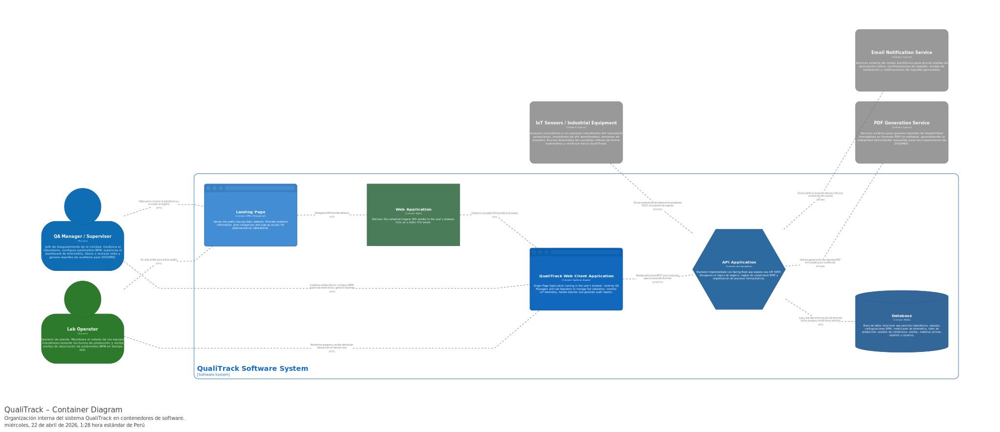

---

## 4.6.4. Software Architecture Components Diagrams

En el nivel de componentes se detalla la descomposición interna de los contenedores,
mostrando los bloques estructurales que conforman cada uno y las relaciones entre ellos.
Dado que la **SPA** y la **Database** ya fueron descritas en otros apartados mediante
diagramas de clases frontend y de base de datos, en esta sección se pone especial énfasis
en el contenedor **API Application**, donde reside la mayor parte de la lógica de negocio
y las reglas de compliance farmacéutico.

El component diagram de la **API Application** agrupa la arquitectura interna siguiendo
los bounded contexts definidos en el dominio de QualiTrack. Cada módulo backend representa
un componente principal dentro del contenedor:

- **IAM Backend:** se encarga de la autenticación, gestión de usuarios, roles, permisos
y validaciones de acceso a la plataforma. Garantiza que cada usuario acceda únicamente
a las funcionalidades habilitadas según su rol (QA Manager, Lab Operator, Auditor).
Se integra con el Email Notification Service para el envío de correos de activación de
cuenta y recuperación de contraseña.

- **Laboratory Management Backend:** gestiona la información institucional del laboratorio,
el catálogo de productos farmacéuticos, el inventario de materias primas y el personal
técnico. Sirve como base de datos maestra para los demás contextos del sistema.

- **Equipment Management Backend:** administra el ciclo de vida de los equipos
industriales, la vinculación con sensores IoT, la configuración de parámetros BPM por
variable y el historial de mantenimientos y calibraciones.

- **Tracking Backend:** implementa el endpoint de ingesta de telemetría que recibe los
datos enviados automáticamente por los sensores IoT (sistemas externos, no actores
humanos). Almacena las mediciones de temperatura, presión y pH asociadas al equipo y
lote correspondiente, y las pone a disposición del contexto de Compliance & Alerting
para su evaluación inmediata mediante eventos de dominio.

- **Compliance & Alerting Backend:** constituye el núcleo de inteligencia de QualiTrack.
Evalúa cada medición recibida desde Tracking comparándola con los parámetros BPM
configurados, clasifica las desviaciones por severidad, genera alertas inmediatas y
bloquea automáticamente los lotes no conformes. Se integra con el Email Notification
Service para el envío de alertas críticas al QA Manager y al operario asignado.

- **Batch Management Backend:** gestiona el ciclo de vida completo de los lotes de
producción, desde su creación hasta su liberación digital o rechazo documentado.
Registra la trazabilidad de materias primas utilizadas y mantiene el historial inmutable
de cada lote. Recibe eventos de bloqueo automático desde el Compliance & Alerting
Backend cuando se detecta una desviación crítica.

- **Reporting & Audit Backend:** genera reportes de trazabilidad en PDF para lotes
individuales y periodos de tiempo, exporta logs de eventos de equipos y calcula KPIs
de calidad. Se integra con el PDF Generation Service para producir documentos inmutables
listos para inspecciones de DIGEMID.

- **Shared Backend:** provee componentes compartidos, value objects comunes (LabId,
UserId, DateRange, Quantity), clases base auditables, eventos de dominio y mecanismos
de infraestructura transversales utilizados por todos los módulos backend.

En el diagrama se refleja cómo:

- La **SPA** consume los servicios expuestos por cada módulo backend a través de la
**API Application**, utilizando endpoints REST específicos por contexto.
- Los **sensores IoT** envían telemetría entrante directamente al **Tracking Backend**
mediante HTTP POST, sin pasar por la SPA.
- El **Tracking Backend** y el **Compliance & Alerting Backend** trabajan en conjunto
como el core domain del sistema: el primero ingesta las mediciones y publica el evento
`MeasurementRecorded`; el segundo lo evalúa y, si detecta una desviación crítica,
publica el evento `BatchBlocked` hacia el Batch Management Backend.
- El **Reporting & Audit Backend** se integra con el **PDF Generation Service** externo
para garantizar la inmutabilidad de los reportes de auditoría.
- El **IAM Backend** se integra con el **Email Notification Service** para el envío de
notificaciones de activación de cuenta y recuperación de contraseña.
- Todos los módulos backend reutilizan capacidades comunes provistas por el
**Shared Backend**, favoreciendo la consistencia, la reutilización y la reducción de
duplicación de código entre contextos.

De esta forma, los component diagrams complementan los diagramas de clases del frontend,
backend y base de datos, mostrando cómo los contenedores se descomponen en componentes
coherentes con los bounded contexts del dominio farmacéutico y cómo estos colaboran entre
sí para implementar la funcionalidad completa de QualiTrack.

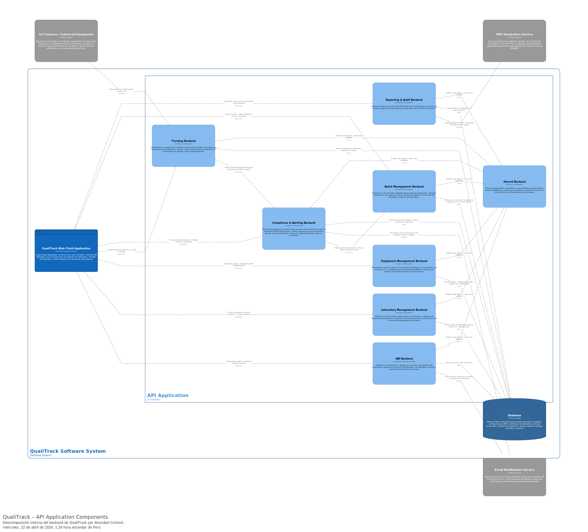

## 4.7. Software Object-Oriented Design

En esta sección se presenta el diseño orientado a objetos del sistema QualiTrack, el cual
desarrolla con mayor detalle la implementación interna de los componentes identificados
en los diagramas C4 del apartado 4.6. A partir de los contenedores y componentes definidos
en Structurizr (Frontend SPA, API Application y Database), se derivan diagramas de clases
específicos para cada bounded context del dominio, con el objetivo de mostrar:

- Cómo se modelan las entidades, agregados, servicios y recursos en el backend para cada
contexto de dominio farmacéutico.
- Cómo se estructuran los componentes de presentación, estado e infraestructura en el
frontend Angular.
- Cómo se reflejan estos modelos en el diseño de la base de datos relacional MySQL.

De esta forma, el diseño orientado a objetos enlaza el nivel arquitectónico (C4 Model)
con el nivel de implementación, permitiendo verificar coherencia entre bounded contexts,
responsabilidades de cada módulo y decisiones de diseño técnico.

## 4.7.1. Class Diagrams

En esta subsección se presentan los diagramas de clases que detallan la estructura interna
de los principales componentes para cada bounded context. Estos diagramas complementan al
Component Diagram de la **API Application** y a los contenedores definidos en Structurizr,
proporcionando una vista centrada en clases, atributos, métodos y relaciones.

A nivel de **frontend**, se modelan las clases en función de los módulos y vistas que
consumen los servicios expuestos por la API:

- **Frontend completo**: muestra la organización general de la capa de presentación,
incluyendo componentes de rutas, componentes de página y servicios de estado que
interactúan con los contenedores backend definidos en el container diagram.
- **IAM Frontend**: incluye los formularios y componentes relacionados con autenticación,
registro, manejo de sesión y autorización, que consumen los endpoints del *IAM Backend*.
- **Laboratory Management Frontend**: detalla las clases que gestionan las vistas de
información institucional del laboratorio, catálogo de productos, inventario de materias
primas y gestión de personal técnico.
- **Equipment Management Frontend**: modela los componentes responsables del registro de
equipos industriales, configuración de parámetros BPM, historial de mantenimientos y
alertas de calibración.
- **Tracking Frontend**: presenta los componentes de interfaz que construyen el dashboard
de telemetría en tiempo real, gráficos de historial de variables y el panel de estado
de equipos conectados.
- **Compliance & Alerting Frontend**: modela las vistas de historial de alertas, detalle
de desviaciones, configuración de canales de notificación e indicadores de compliance BPM.
- **Batch Management Frontend**: detalla los componentes para la gestión de lotes de
producción, trazabilidad de materias primas, flujos de liberación y rechazo documentado.
- **Reporting & Audit Frontend**: presenta los componentes del KPI dashboard, generación
de reportes PDF de trazabilidad y exportación de logs de eventos inmutables.
- **Shared Frontend**: agrupa componentes reutilizables (layouts, formularios base,
guards de autenticación, interceptores HTTP, servicios compartidos y pipes) que sirven
como infraestructura de presentación común para el resto de módulos frontend.

A nivel de **backend**, los diagramas de clases reflejan la implementación detallada de
los módulos definidos como componentes en la **API Application**:

- **Backend completo**: ilustra la estructura general de la capa de dominio y aplicación
(aggregates, entities, value objects, command handlers, domain services, repositories,
event handlers), mostrando cómo se distribuyen estas clases entre los distintos bounded
contexts modelados como componentes (*IAM Backend, Laboratory Management Backend,
Equipment Management Backend, Tracking Backend, Compliance & Alerting Backend,
Batch Management Backend, Reporting & Audit Backend y Shared Backend*).
- **IAM Backend**: muestra clases como `User`, `Role`, `Permission` y `UserRoleAssignment`,
junto con servicios de autenticación/autorización, JWT token management y repositorios
para credenciales y roles.
- **Laboratory Management Backend**: incluye agregados como `Laboratory`, `StaffMember`,
`ProductCatalog` y `RawMaterial`, junto con sus servicios de dominio y repositorios,
encargados de la gestión institucional del laboratorio farmacéutico.
- **Equipment Management Backend**: detalla las clases `Equipment`, `BpmParameterConfig`,
`MaintenanceRecord` y `CalibrationRecord`, así como servicios de configuración de
parámetros BPM y gestión del ciclo de vida de los equipos industriales.
- **Tracking Backend**: define entidades como `Measurement`, `DeviceBinding` y
`TelemetryRecord` que permiten la ingesta, almacenamiento y consulta de telemetría
proveniente de sensores IoT vinculados a los equipos de producción.
- **Compliance & Alerting Backend**: modela el núcleo del sistema con clases como
`ComplianceEvent`, `DeviationAlert` y `BpmEvaluationService`, responsables de evaluar
cada medición, clasificar desviaciones por severidad y generar los eventos de bloqueo
automático de lotes no conformes.
- **Batch Management Backend**: contiene los agregados `Batch`, `BatchStatus` y
`RawMaterialUsage`, junto con value objects de estado, servicios de liberación y rechazo,
y repositorios que mantienen el historial inmutable de cada lote de producción.
- **Reporting & Audit Backend**: modela las clases `AuditReport`, `ComplianceReport` y
`KpiMetric`, junto con los servicios de generación de reportes PDF y cálculo de
indicadores de calidad a partir de datos consolidados de múltiples contextos.
- **Shared Backend**: concentra clases base auditables (`AuditableEntity`), value objects
comunes (`LabId`, `UserId`, `DateRange`, `Quantity`), eventos de dominio base y
configuraciones compartidas por todos los módulos, soportando la consistencia del diseño
y la reutilización de código entre contextos.

---

### Diagrama de clases del frontend

#### Diagrama del frontend completo:

<h3><strong>Diagrama del frontend dividido por contextos:</strong></h3>

<h4>iam frontend:</h4>

<strong>Responsabilidad:</strong> Maneja las vistas de autenticación, registro de usuarios, recuperación de contraseña, roles y permisos de acceso.

<h4>laboratory management frontend:</h4>

<strong>Responsabilidad:</strong> Maneja las vistas de información institucional del laboratorio, catálogo de productos farmacéuticos, inventario de materias primas y gestión de personal técnico.

<h4>equipment management frontend:</h4>

<strong>Responsabilidad:</strong> Maneja las vistas de registro de equipos industriales, vinculación IoT, configuración de parámetros BPM, historial de mantenimientos y alertas de calibración.

<h4>tracking frontend:</h4>

<strong>Responsabilidad:</strong> Maneja las vistas del dashboard de telemetría en tiempo real, historial de variables críticas (temperatura, presión, pH) y panel de estado de equipos IoT conectados.

<h4>compliance & alerting frontend:</h4>

<strong>Responsabilidad:</strong> Maneja las vistas de historial de alertas BPM, detalle de desviaciones detectadas, configuración de canales de notificación y panel de compliance regulatorio.

<h4>batch management frontend:</h4>

<strong>Responsabilidad:</strong> Maneja las vistas de gestión de lotes de producción, trazabilidad de materias primas, flujos de liberación digital y rechazo documentado de lotes no conformes.

<h4>reporting & audit frontend:</h4>

<strong>Responsabilidad:</strong> Maneja las vistas del KPI dashboard, generación y descarga de reportes PDF de trazabilidad inmutables y exportación de logs de eventos de equipos para auditorías DIGEMID.

<h4>shared frontend:</h4>

<strong>Responsabilidad:</strong> Maneja los componentes comunes, utilidades, clases base, guards de autenticación, interceptores HTTP, servicios compartidos y patrones reutilizables entre módulos.

---

### Diagrama de clases del backend 

#### Diagrama del backend completo:

<h3><strong>Diagrama del backend dividido por contextos:</strong></h3>

<h4>iam backend:</h4>

<strong>Responsabilidad:</strong> Usuarios, autenticación, roles, permisos y gestión de credenciales de acceso.

<h4>laboratory management backend:</h4>

<strong>Responsabilidad:</strong> Gestión institucional del laboratorio, catálogo de productos farmacéuticos, inventario de materias primas y personal técnico.

<h4>equipment management backend:</h4>

<strong>Responsabilidad:</strong> Ciclo de vida de equipos industriales, vinculación IoT, configuración de parámetros BPM y registros de mantenimiento y calibración.

<h4>tracking backend:</h4>

<strong>Responsabilidad:</strong> Ingesta, almacenamiento y consulta de telemetría IoT (temperatura, presión, pH) proveniente de sensores vinculados a equipos industriales.

<h4>compliance & alerting backend:</h4>

<strong>Responsabilidad:</strong> Evaluación de mediciones contra parámetros BPM, clasificación de desviaciones por severidad, generación de alertas inmediatas y bloqueo automático de lotes no conformes.

<h4>batch management backend:</h4>

<strong>Responsabilidad:</strong> Gestión del ciclo de vida de lotes de producción, trazabilidad de materias primas, liberación digital con firma del QA Manager y rechazo documentado de lotes no conformes.

<h4>reporting & audit backend:</h4>

<strong>Responsabilidad:</strong> Generación de reportes de trazabilidad PDF inmutables por lote o periodo, exportación de logs de eventos de equipos y cálculo de KPIs de calidad farmacéutica.

<h4>shared backend:</h4>

<strong>Responsabilidad:</strong> Componentes comunes, clases base auditables, value objects (LabId, UserId, DateRange, Quantity), eventos de dominio base y patrones compartidos entre todos los módulos backend.

## 4.8. Database Design

### 4.8.1. Database Diagrams

En esta sección se presenta el diseño de la base de datos relacional de QualiTrack,
organizado por bounded context. Cada contexto gestiona su propio conjunto de tablas,
garantizando la separación de responsabilidades y la alineación con la arquitectura
DDD definida en los apartados anteriores. La base de datos está implementada en
**MySQL** y todas las tablas principales heredan los campos de auditoría
(`created_at`, `updated_at`, `created_by`) para garantizar la trazabilidad de cada
operación, cumpliendo con los requisitos de Data Integrity exigidos por DIGEMID.

#### Diagrama de base de datos completo:

<h3><strong>Diagrama de base de datos dividido por contextos:</strong></h3>

<h4>iam base de datos:</h4>

<strong>Responsabilidad:</strong> Gestión de usuarios, roles, permisos y asignaciones de acceso por laboratorio.

<h4>laboratory management base de datos:</h4>

<strong>Responsabilidad:</strong> Información institucional del laboratorio, personal técnico, catálogo de productos farmacéuticos y materias primas.

<h4>equipment management base de datos:</h4>

<strong>Responsabilidad:</strong> Ciclo de vida de equipos industriales, configuración de parámetros BPM, historial de mantenimientos y registros de calibración.

<h4>tracking base de datos:</h4>

<strong>Responsabilidad:</strong> Ingesta y almacenamiento de telemetría IoT, vinculación de sensores a equipos y trazabilidad de mediciones por lote.

<h4>compliance & alerting base de datos:</h4>

<strong>Responsabilidad:</strong> Eventos de compliance BPM, alertas de desviación, historial de resoluciones y preferencias de notificación por usuario.

<h4>batch management base de datos:</h4>

<strong>Responsabilidad:</strong> Ciclo de vida de lotes de producción, trazabilidad de materias primas, firmas digitales de liberación y registros de rechazo.

<h4>reporting & audit base de datos:</h4>

<strong>Responsabilidad:</strong> Reportes de trazabilidad generados, métricas KPI y log de auditoría de acciones de usuarios.

