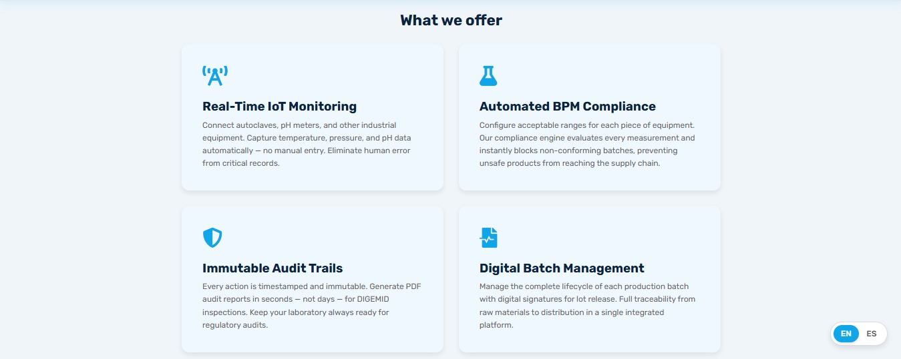
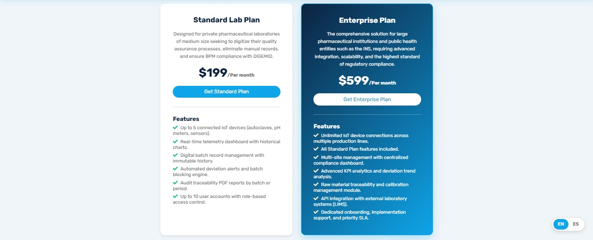
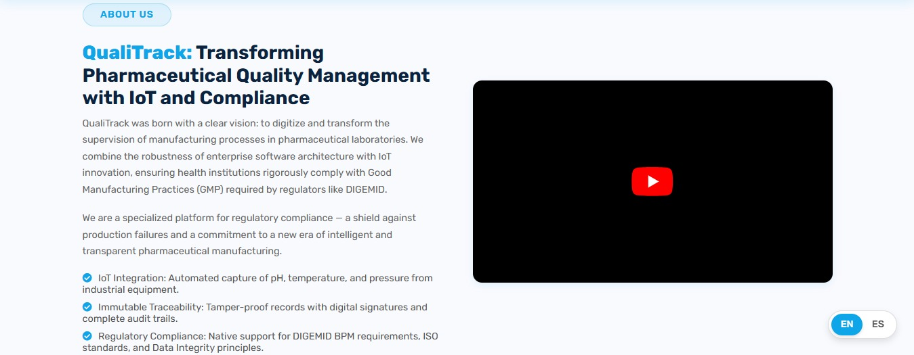
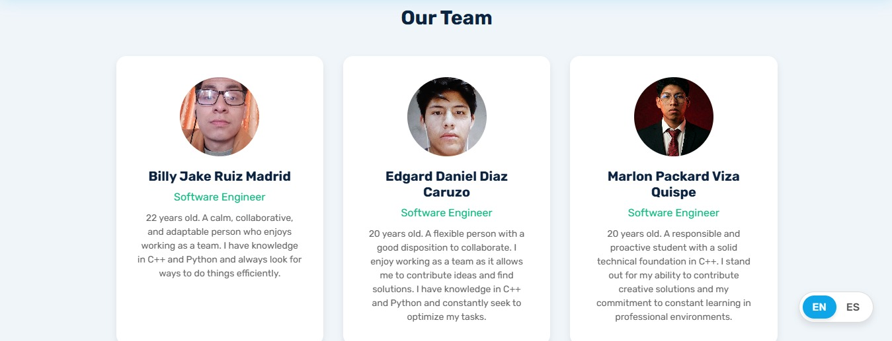
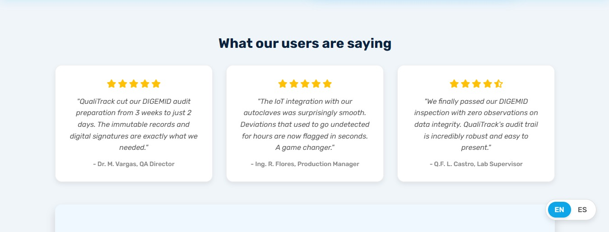
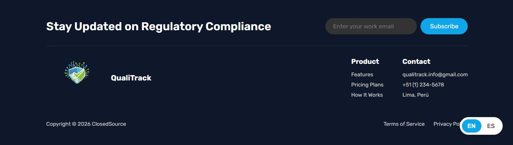
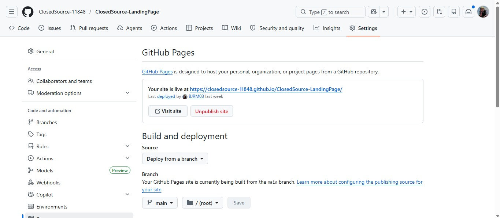

<html lang="es">
<body>
  
# Capítulo V: Product Implementation, Validation & Deployment

## 5.1. Software Configuration Management

En esta sección se describen las decisiones, convenciones y principios adoptados por el
equipo de ClosedSource para garantizar la coherencia, trazabilidad y control de versiones
durante el ciclo de vida del desarrollo de la solución QualiTrack. Se establecen los
lineamientos para la configuración del entorno de desarrollo, gestión del código fuente,
convenciones de estilo y configuración de despliegue.

### 5.1.1. Software Development Environment Configuration

En esta sección se especifican los productos de software utilizados durante el ciclo de
vida del proyecto, incluyendo el nombre de cada herramienta, su propósito técnico
específico dentro del proyecto QualiTrack, y la ruta de referencia (para software SaaS)
o ruta de descarga (para productos de instalación local). Las herramientas se organizan
según las siguientes disciplinas:

<ol>
  <li>Project Management</li>
  <li>Requirements Management</li>
  <li>Product UX/UI Design</li>
  <li>Software Development</li>
  <li>Software Testing</li>
  <li>Software Documentation</li>
</ol>

<h4>Project Management</h4>

Esta disciplina se centra en la planificación, seguimiento y control de las actividades
del proyecto, asegurando el cumplimiento de los objetivos dentro del tiempo y recursos
establecidos.

<ul>
  <li>
    <strong>Jira:</strong> Plataforma de gestión de proyectos ágiles utilizada para la
    administración del Product Backlog, planificación de Sprints, asignación de User
    Stories y Technical Stories a los miembros del equipo, y seguimiento del progreso
    mediante tableros Scrum con estados To-Do, In-Process, To-Review y Done. 
    <strong>Ruta de referencia:</strong>
    <a href="https://www.atlassian.com/software/jira">https://www.atlassian.com/software/jira</a>
  </li>
</ul>

<h4>Requirements Management</h4>

Este proceso se enfoca en la documentación, verificación y seguimiento de los requisitos
del proyecto, asegurando que las necesidades de los laboratorios farmacéuticos y las
normativas BPM sean satisfechas.

<ul>
  <li>
    <strong>Trello:</strong> Plataforma de gestión visual basada en tableros, listas y
    tarjetas, utilizada para la organización rápida del Sprint Backlog, gestión de User
    Stories por estado y colaboración del equipo en la priorización de requisitos del
    proyecto QualiTrack. 
    <strong>Ruta de referencia:</strong>
    <a href="https://trello.com">https://trello.com</a>
  </li>
</ul>

<h4>Product UX/UI Design</h4>

El diseño de la experiencia de usuario y la interfaz para QualiTrack contempla paneles
de control de telemetría de alta densidad de datos y flujos de gestión de lotes
farmacéuticos. Se utilizan las siguientes herramientas:

<ol>
  <li>
    <strong>UXPressia:</strong> Plataforma para la elaboración de User Personas (Jefe de
    QA y Supervisor de Salud Pública), Empathy Maps y Customer Journey Maps. 
    <strong>Ruta de referencia:</strong>
    <a href="https://uxpressia.com/">https://uxpressia.com/</a>
  </li>
  <li>
    <strong>Miro:</strong> Pizarra digital colaborativa utilizada para sesiones de Big
    Picture Event Storming y Design-Level Event Storming, facilitando la identificación
    de Bounded Contexts del dominio farmacéutico de QualiTrack. 
    <strong>Ruta de referencia:</strong>
    <a href="https://miro.com/es/">https://miro.com/es/</a>
  </li>
  <li>
    <strong>Figma:</strong> Herramienta de diseño colaborativo para la creación de
    Wireframes, Mock-ups y Prototipos interactivos del Landing Page y la Web Application
    SaaS de QualiTrack. 
    <strong>Ruta de referencia:</strong>
    <a href="https://www.figma.com/es-es/">https://www.figma.com/es-es/</a>
  </li>
  <li>
    <strong>LucidChart:</strong> Aplicación de diagramación colaborativa para la creación
    de diagramas C4, Class Diagrams y Database Diagrams de la arquitectura de QualiTrack. 
    <strong>Ruta de referencia:</strong>
    <a href="https://www.lucidchart.com/pages/es">https://www.lucidchart.com/pages/es</a>
  </li>
</ol>

<h4>Software Development</h4>

El desarrollo abarca la implementación del Landing Page, la Frontend Web Application (SPA
Angular) y los Backend Web Services integrados con telemetría IoT.

<ol>
  <li>
    <strong>GitHub:</strong> Sistema de control de versiones distribuido y plataforma de
    hosting para repositorios de código fuente. Gestión de la organización
    ClosedSource-11848, implementación de GitFlow Workflow y Conventional Commits. 
    <strong>Ruta de referencia:</strong>
    <a href="https://github.com">https://github.com</a> 
    <strong>Organización del proyecto:</strong>
    <a href="https://github.com/ClosedSource-11848">https://github.com/ClosedSource-11848</a>
  </li>
  <li>
    <strong>WebStorm:</strong> Entorno de desarrollo integrado (IDE) de JetBrains para la
    implementación del Frontend utilizando Angular Framework, HTML5, CSS3, JavaScript y
    TypeScript. Incluye integración con GitHub para control de versiones. 
    <strong>Ruta de descarga:</strong>
    <a href="https://www.jetbrains.com/webstorm/">https://www.jetbrains.com/webstorm/</a>
  </li>
  <li>
    <strong>IntelliJ IDEA:</strong> Entorno de desarrollo integrado (IDE) de JetBrains
    para la implementación del Backend con Spring Boot Framework y Java 17. Incluye
    integración con plataformas cloud para despliegue de Web Services. 
    <strong>Ruta de descarga:</strong>
    <a href="https://www.jetbrains.com/idea/">https://www.jetbrains.com/idea/</a>
  </li>
  <li>
    <strong>Angular Framework:</strong> Framework principal para la SPA de QualiTrack.
    Construcción de componentes reutilizables, gestión de estado mediante Services y RxJS,
    enrutamiento entre vistas y consumo de APIs REST para los dashboards de telemetría en
    tiempo real. 
    <strong>Ruta de referencia:</strong>
    <a href="https://angular.io/">https://angular.io/</a>
  </li>
  <li>
    <strong>Spring Boot (Java 17):</strong> Framework para el desarrollo de los Web
    Services RESTful del Backend de QualiTrack. Implementación de la lógica de compliance
    BPM, ingesta de telemetría IoT y persistencia de datos con JPA/Hibernate. 
    <strong>Ruta de referencia:</strong>
    <a href="https://spring.io/projects/spring-boot">https://spring.io/projects/spring-boot</a>
  </li>
  <li>
    <strong>HTML5, CSS3, JavaScript:</strong> Tecnologías fundamentales para la
    implementación del Landing Page y estructura base de la Web Application. 
    <strong>Referencias:</strong>
    <ul>
      <li>HTML5: <a href="https://html.spec.whatwg.org/">https://html.spec.whatwg.org/</a></li>
      <li>CSS3: <a href="https://www.w3.org/Style/CSS/">https://www.w3.org/Style/CSS/</a></li>
      <li>JavaScript: <a href="https://developer.mozilla.org/es/docs/Web/JavaScript">https://developer.mozilla.org/es/docs/Web/JavaScript</a></li>
    </ul>
  </li>
  <li>
    <strong>TypeScript:</strong> Lenguaje de programación tipado para el desarrollo del
    Frontend con Angular. Proporciona tipado estático, detección temprana de errores y
    mejor soporte de IDE. 
    <strong>Ruta de referencia:</strong>
    <a href="https://www.typescriptlang.org/">https://www.typescriptlang.org/</a>
  </li>
</ol>

<h4>Software Testing</h4>

Las pruebas de software permiten verificar que los módulos de compliance BPM, bloqueo
automático de lotes y generación de reportes inmutables funcionen correctamente según los
criterios de aceptación definidos.

<ul>
  <li>
    <strong>Lenguaje Gherkin:</strong> Lenguaje de dominio específico (DSL) para la
    redacción de Acceptance Criteria de User Stories en formato Given-When-Then, utilizado
    para definir escenarios de prueba legibles por stakeholders y ejecutables por
    herramientas de automatización. 
    <strong>Ruta de referencia:</strong>
    <a href="https://cucumber.io/docs/gherkin/">https://cucumber.io/docs/gherkin/</a>
  </li>
</ul>

<h4>Software Documentation</h4>

La documentación de software permite explicar el funcionamiento, uso y arquitectura de los
productos desarrollados, facilitando su mantenimiento y evolución.

<ul>
  <li>
    <strong>OpenAPI Specification / Swagger:</strong> Estándar para la documentación
    interactiva de los Web Services RESTful del Backend de QualiTrack. Especificación de
    endpoints de telemetría, gestión de lotes, compliance y reportes de auditoría. 
    <strong>Ruta de referencia:</strong>
    <a href="https://swagger.io/">https://swagger.io/</a>
  </li>
  <li>
    <strong>Markdown:</strong> Lenguaje de marcado ligero para la elaboración del Project
    Report en el repositorio GitHub, permitiendo estructurar la documentación con formato
    consistente y compatible con control de versiones. 
    <strong>Ruta de referencia:</strong>
    <a href="https://www.markdownguide.org/">https://www.markdownguide.org/</a>
  </li>
</ul>

### 5.1.2. Source Code Management

En esta sección se establecen los medios y esquemas de organización aplicados para el
seguimiento de modificaciones del código fuente. Se utiliza GitHub como plataforma y
sistema de control de versiones distribuido.

<h4>Repositorios del Proyecto</h4>

<table>
  <thead>
    <tr>
      <th>Producto</th>
      <th>URL del Repositorio</th>
    </tr>
  </thead>
  <tbody>
    <tr>
      <td>Organización ClosedSource-11848</td>
      <td><a href="https://github.com/ClosedSource-11848">https://github.com/ClosedSource-11848</a></td>
    </tr>
    <tr>
      <td>Project Report</td>
      <td><a href="https://github.com/ClosedSource-11848/ClosedSource-Project-Report">https://github.com/ClosedSource-11848/ClosedSource-Project-Report</a></td>
    </tr>
    <tr>
      <td>Landing Page</td>
      <td><a href="https://github.com/ClosedSource-11848/ClosedSource-LandingPage">https://github.com/ClosedSource-11848/ClosedSource-LandingPage</a></td>
    </tr>
    <tr>
      <td>Frontend Web Application</td>
      <td><a href="https://github.com/ClosedSource-11848/ClosedSource-Frontend">https://github.com/ClosedSource-11848/ClosedSource-Frontend</a></td>
    </tr>
    <tr>
      <td>Backend Web Services</td>
      <td><a href="https://github.com/ClosedSource-11848/ClosedSource-Backend">https://github.com/ClosedSource-11848/ClosedSource-Backend</a></td>
    </tr>
  </tbody>
</table>

<h4>GitFlow Workflow</h4>

Se implementa GitFlow como modelo de flujo de trabajo para el control de versiones,
estableciendo una estructura de ramas que facilita el desarrollo paralelo de los Bounded
Contexts y la gestión de releases.

<strong>Ramas Principales:</strong>

<ul>
  <li>
    <strong>main:</strong> Rama principal que contiene el historial oficial de versiones
    estables listas para producción. Solo recibe merges de release branches y hotfix
    branches.
  </li>
  <li>
    <strong>develop:</strong> Rama de integración donde se consolidan los features
    completados y probados. Sirve como base para la creación de release branches.
  </li>
</ul>

<strong>Ramas de Soporte:</strong>

<ul>
  <li>
    <strong>feature/&lt;bounded-context&gt;-&lt;funcionalidad&gt;:</strong> Ramas creadas
    a partir de develop para implementar nuevas funcionalidades. Se fusionan de vuelta a
    develop una vez completadas y revisadas. Ejemplo:
    <code>feature/batch-release-digital-signature</code>,
    <code>feature/tracking-iot-telemetry-ingestion</code>.
  </li>
  <li>
    <strong>release/&lt;version&gt;:</strong> Ramas creadas a partir de develop para
    preparar una nueva versión de producción. Ejemplo: <code>release/1.0.0</code>.
  </li>
  <li>
    <strong>hotfix/&lt;issue&gt;:</strong> Ramas creadas a partir de main para
    correcciones urgentes en producción. Se fusionan tanto a main como a develop.
    Ejemplo: <code>hotfix/fix-bpm-evaluation-threshold</code>.
  </li>
</ul>

<h4>Conventional Commits</h4>

Se aplica la especificación Conventional Commits para los mensajes de commit, siguiendo
la estructura: <code>&lt;type&gt;[optional scope]: &lt;description&gt;</code>

<table>
  <thead>
    <tr>
      <th>Tipo</th>
      <th>Descripción</th>
    </tr>
  </thead>
  <tbody>
    <tr><td><code>feat</code></td><td>Nueva funcionalidad para el usuario</td></tr>
    <tr><td><code>fix</code></td><td>Corrección de un bug</td></tr>
    <tr><td><code>docs</code></td><td>Cambios en documentación</td></tr>
    <tr><td><code>style</code></td><td>Cambios de formato sin afectar lógica</td></tr>
    <tr><td><code>refactor</code></td><td>Refactorización sin cambiar funcionalidad</td></tr>
    <tr><td><code>test</code></td><td>Adición o corrección de pruebas</td></tr>
    <tr><td><code>build</code></td><td>Cambios en sistema de build o dependencias</td></tr>
    <tr><td><code>chore</code></td><td>Tareas de mantenimiento sin afectar producción</td></tr>
  </tbody>
</table>

<strong>Ejemplos de commits adaptados al dominio QualiTrack:</strong>

<pre><code>feat(tracking): implement IoT telemetry ingestion endpoint
fix(compliance): resolve blocking mechanism for minor deviations
docs(readme): update deployment instructions for GitHub Pages
build(deps): upgrade Spring Boot to 3.1.2
chore: initial commit.
feat: add main structure and content to index
docs: add terms of service.
docs: add privacy policy compliant with peruvian law.
</code></pre>

<h4>Semantic Versioning</h4>

Se aplica Semantic Versioning 2.0.0 para el versionado de releases, siguiendo el formato
<code>MAJOR.MINOR.PATCH</code>:

<ul>
  <li><strong>MAJOR:</strong> Cambios incompatibles con versiones anteriores</li>
  <li><strong>MINOR:</strong> Nuevas funcionalidades compatibles con versiones anteriores</li>
  <li><strong>PATCH:</strong> Correcciones de bugs compatibles con versiones anteriores</li>
</ul>

### 5.1.3. Source Code Style Guide & Conventions

En esta sección se establecen las convenciones de estilo y nomenclatura adoptadas para
los lenguajes utilizados en el proyecto QualiTrack: HTML, CSS, JavaScript, TypeScript,
Java y Gherkin. Se aplica nomenclatura en inglés para todos los elementos del código,
siguiendo el Ubiquitous Language definido para el dominio de gestión de calidad
farmacéutica.

<h4>Referencias de Guías de Estilo Adoptadas</h4>

<table>
  <thead>
    <tr>
      <th>Lenguaje/Tecnología</th>
      <th>Guía de Estilo</th>
    </tr>
  </thead>
  <tbody>
    <tr>
      <td>HTML/CSS</td>
      <td><a href="https://google.github.io/styleguide/htmlcssguide.html">Google HTML/CSS Style Guide</a></td>
    </tr>
    <tr>
      <td>JavaScript</td>
      <td><a href="https://google.github.io/styleguide/jsguide.html">Google JavaScript Style Guide</a></td>
    </tr>
    <tr>
      <td>TypeScript</td>
      <td><a href="https://google.github.io/styleguide/tsguide.html">Google TypeScript Style Guide</a></td>
    </tr>
    <tr>
      <td>Angular</td>
      <td><a href="https://angular.io/guide/styleguide">Angular Coding Style Guide</a></td>
    </tr>
    <tr>
      <td>Java</td>
      <td><a href="https://google.github.io/styleguide/javaguide.html">Google Java Style Guide</a></td>
    </tr>
    <tr>
      <td>Spring Boot</td>
      <td><a href="https://docs.spring.io/spring-boot/docs/current/reference/html/features.html">Spring Boot Reference Documentation</a></td>
    </tr>
    <tr>
      <td>Gherkin</td>
      <td><a href="https://cucumber.io/docs/gherkin/reference/">Gherkin Reference</a></td>
    </tr>
  </tbody>
</table>

<h4>Nomenclatura General</h4>

<table>
  <thead>
    <tr>
      <th>Elemento</th>
      <th>Convención</th>
      <th>Ejemplo</th>
    </tr>
  </thead>
  <tbody>
    <tr>
      <td>Clases (Java/TypeScript)</td>
      <td>PascalCase</td>
      <td><code>BatchService</code>, <code>EquipmentController</code></td>
    </tr>
    <tr>
      <td>Interfaces (TypeScript)</td>
      <td>PascalCase</td>
      <td><code>IBatchRecord</code>, <code>Equipment</code></td>
    </tr>
    <tr>
      <td>Métodos/Funciones</td>
      <td>camelCase</td>
      <td><code>getBatchById()</code>, <code>registerEquipment()</code></td>
    </tr>
    <tr>
      <td>Variables</td>
      <td>camelCase</td>
      <td><code>batchCode</code>, <code>equipmentList</code></td>
    </tr>
    <tr>
      <td>Constantes</td>
      <td>SCREAMING_SNAKE_CASE</td>
      <td><code>MAX_DEVIATION</code>, <code>API_BASE_URL</code></td>
    </tr>
    <tr>
      <td>Archivos de componentes Angular</td>
      <td>kebab-case</td>
      <td><code>batch-list.component.ts</code></td>
    </tr>
    <tr>
      <td>Clases CSS</td>
      <td>kebab-case</td>
      <td><code>.batch-card</code>, <code>.telemetry-form</code></td>
    </tr>
    <tr>
      <td>Endpoints REST</td>
      <td>kebab-case (plural)</td>
      <td><code>/api/v1/batches</code>, <code>/api/v1/equipment</code></td>
    </tr>
  </tbody>
</table>

<h4>Sangría</h4>

Se aplica un espaciado de dos espacios para la indentación en todos los archivos HTML,
CSS, JavaScript y TypeScript.

<strong>Ejemplo HTML:</strong>

<pre><code>&lt;!DOCTYPE html&gt;
&lt;html&gt;
  &lt;head&gt;
    &lt;title&gt;QualiTrack - Pharmaceutical Quality Management&lt;/title&gt;
  &lt;/head&gt;
  &lt;body&gt;
    &lt;header&gt;
      &lt;h1&gt;Welcome to QualiTrack&lt;/h1&gt;
    &lt;/header&gt;
    &lt;main&gt;
      &lt;p&gt;Real-time IoT Monitoring and BPM Compliance.&lt;/p&gt;
    &lt;/main&gt;
  &lt;/body&gt;
&lt;/html&gt;
</code></pre>

<h4>Convenciones por Lenguaje</h4>

<h5>HTML</h5>
<ul>
  <li>Declarar <code>&lt;!DOCTYPE html&gt;</code> en la primera línea.</li>
  <li>Utilizar minúsculas para nombres de elementos y atributos.</li>
  <li>Utilizar comillas dobles para valores de atributos: <code>&lt;div class="container"&gt;</code></li>
  <li>Incluir atributos <code>alt</code> en todas las imágenes para accesibilidad.</li>
  <li>No omitir elementos <code>&lt;title&gt;</code> y meta tags.</li>
  <li>Usar líneas en blanco para separar bloques de código extensos.</li>
</ul>

<h5>CSS</h5>
<ul>
  <li>Utilizar shorthand properties cuando sea posible: <code>margin: 10px 20px;</code></li>
  <li>Terminar todas las declaraciones con punto y coma.</li>
  <li>Un espacio después de los dos puntos en propiedades: <code>color: #333;</code></li>
  <li>Usar comillas simples para font-family: <code>font-family: 'Rubik', sans-serif;</code></li>
  <li>Organizar propiedades alfabéticamente dentro de cada selector.</li>
</ul>

<h5>JavaScript / TypeScript</h5>
<ul>
  <li>Usar <code>const</code> y <code>let</code> en lugar de <code>var</code>.</li>
  <li>Espacios alrededor de operadores: <code>const isCompliant = temp &lt; maxTemp;</code></li>
  <li>Punto y coma al final de instrucciones.</li>
  <li>Llaves de apertura en la misma línea de la declaración.</li>
  <li>Usar arrow functions para callbacks: <code>batches.map(batch =&gt; batch.id)</code></li>
</ul>

<strong>Ejemplo TypeScript:</strong>

<pre><code>export class BatchService {
  private batches: Batch[] = [];

  getBatchById(id: string): Batch | undefined {
    return this.batches.find(batch =&gt; batch.id === id);
  }

  createBatch(batch: Batch): void {
    this.batches.push(batch);
  }
}
</code></pre>

<h5>Java</h5>
<ul>
  <li>Seguir convenciones de nomenclatura de Spring Boot.</li>
  <li>Documentar clases y métodos públicos con Javadoc.</li>
  <li>Organizar imports alfabéticamente, separando imports de java.*, javax.*, org.*, com.*</li>
  <li>Máximo 120 caracteres por línea.</li>
  <li>Usar anotaciones de Spring en líneas separadas.</li>
</ul>

<strong>Ejemplo Java:</strong>

<pre><code>@RestController
@RequestMapping("/api/v1/batches")
public class BatchController {

    private final BatchService batchService;

    public BatchController(BatchService batchService) {
        this.batchService = batchService;
    }

    @GetMapping("/{id}")
    public ResponseEntity&lt;Batch&gt; getBatchById(@PathVariable String id) {
        return batchService.findById(id)
            .map(ResponseEntity::ok)
            .orElse(ResponseEntity.notFound().build());
    }
}
</code></pre>

<h5>Gherkin</h5>
<ul>
  <li>Escribir escenarios en inglés.</li>
  <li>Un escenario por comportamiento específico.</li>
  <li>Mantener pasos atómicos y reutilizables.</li>
  <li>Usar indentación de dos espacios para los pasos.</li>
</ul>

<strong>Ejemplo Gherkin:</strong>

<pre><code>Feature: Equipment Management

  Scenario: Successfully link an IoT equipment
    Given the QA Manager is authenticated
    And the QA Manager is on the equipment registration form
    When the QA Manager enters a valid device ID and BPM parameters
    And clicks the "Link Equipment" button
    Then the system should display a success message
    And the new equipment should appear active in the telemetry dashboard

  Scenario: Attempt to link equipment with missing BPM parameters
    Given the QA Manager is authenticated
    And the QA Manager is on the equipment registration form
    When the QA Manager submits the form with empty max temperature limits
    Then the system should display validation error messages
    And the equipment should not be registered
</code></pre>

### 5.1.4. Software Deployment Configuration

En esta sección se especifica la configuración de despliegue para cada uno de los
productos digitales de la solución QualiTrack: Landing Page, Frontend Web Application
y Backend Web Services.

<h4>Landing Page – GitHub Pages</h4>

El Landing Page se despliega mediante GitHub Pages directamente desde el repositorio,
aprovechando el hosting gratuito para sitios estáticos.

<strong>Pasos de configuración:</strong>

<ol>
  <li>Acceder al repositorio <code>ClosedSource-LandingPage</code> en GitHub.</li>
  <li>Navegar a <strong>Settings &gt; Pages</strong> en el menú lateral.</li>
  <li>En la sección "Source", seleccionar la rama <code>main</code> y carpeta
  <code>/ (root)</code>.</li>
  <li>Hacer clic en <strong>Save</strong> y esperar la generación del sitio (1-2 minutos).</li>
  <li>Verificar el despliegue accediendo a la URL generada.</li>
</ol>

  <strong>URL de despliegue:</strong>
  <a href="https://closedsource-11848.github.io/ClosedSource-LandingPage/">https://closedsource-11848.github.io/ClosedSource-LandingPage/</a>

<h4>Frontend Web Application – Vercel</h4>

El Frontend desarrollado con Angular se desplegará en Vercel, plataforma que ofrece
hosting optimizado para aplicaciones frontend con CDN global y despliegue automático.

<strong>Pasos de configuración:</strong>

<ol>
  <li>Crear cuenta en <a href="https://vercel.com">Vercel</a> y vincular con GitHub.</li>
  <li>Importar el repositorio <code>ClosedSource-Frontend</code> desde GitHub.</li>
  <li>Configurar el proyecto:
    <ul>
      <li><strong>Framework Preset:</strong> Angular</li>
      <li><strong>Build Command:</strong> <code>ng build --configuration production</code></li>
      <li><strong>Output Directory:</strong> <code>dist/qualitrack-frontend</code></li>
    </ul>
  </li>
  <li>Configurar variables de entorno: <code>API_BASE_URL</code> con la URL del Backend.</li>
  <li>Habilitar despliegue automático en cada push a la rama <code>main</code>.</li>
</ol>

<h4>Backend Web Services – Azure App Service</h4>

El Backend desarrollado con Spring Boot se desplegará en Azure App Service, servicio PaaS
que facilita el hosting de aplicaciones web Java.

<strong>Configuración principal:</strong>

<table>
  <thead>
    <tr>
      <th>Variable de Entorno</th>
      <th>Descripción</th>
    </tr>
  </thead>
  <tbody>
    <tr>
      <td><code>SPRING_DATASOURCE_URL</code></td>
      <td>Cadena de conexión JDBC a MySQL</td>
    </tr>
    <tr>
      <td><code>SPRING_DATASOURCE_USERNAME</code></td>
      <td>Usuario de la base de datos</td>
    </tr>
    <tr>
      <td><code>SPRING_DATASOURCE_PASSWORD</code></td>
      <td>Contraseña de la base de datos</td>
    </tr>
    <tr>
      <td><code>SPRING_PROFILES_ACTIVE</code></td>
      <td><code>prod</code></td>
    </tr>
    <tr>
      <td><code>JWT_SECRET_KEY</code></td>
      <td>Clave secreta para generación de tokens JWT</td>
    </tr>
  </tbody>
</table>

---

## 5.2. Landing Page, Services & Applications Implementation

### 5.2.1. Sprint 1

Durante el Sprint 1, el equipo de ClosedSource se enfocó en el desarrollo e
implementación del Landing Page público de QualiTrack, abarcando las secciones de
presentación del negocio, la propuesta de valor basada en IoT, la sección de planes de
suscripción, el equipo de desarrollo, los términos de servicio, la política de privacidad
y el despliegue en GitHub Pages.

  <strong>Repositorio:</strong>
  <a href="https://github.com/ClosedSource-11848/ClosedSource-LandingPage">https://github.com/ClosedSource-11848/ClosedSource-LandingPage</a>

  <strong>Landing Page Desplegada:</strong>
  <a href="https://closedsource-11848.github.io/ClosedSource-LandingPage/">https://closedsource-11848.github.io/ClosedSource-LandingPage/</a>

#### 5.2.1.1. Sprint Planning 1

<table border="1" cellpadding="4" cellspacing="0">
  <thead>
    <tr>
      <th colspan="2" style="text-align: center;">Sprint Planning Sprint 1</th>
    </tr>
  </thead>
  <tbody>
    <tr>
      <td colspan="2" style="text-align: center;"><strong>Sprint Planning Background</strong></td>
    </tr>
    <tr>
      <td>Date</td>
      <td>05/04/2026</td>
    </tr>
    <tr>
      <td>Time</td>
      <td>10:00 p.m.</td>
    </tr>
    <tr>
      <td>Location</td>
      <td>Discord</td>
    </tr>
    <tr>
      <td>Prepared By</td>
      <td>Ruiz Madrid, Billy Jake</td>
    </tr>
    <tr>
      <td>Attendees (to planning meeting)</td>
      <td>
        Ruiz Madrid, Billy Jake 
        Diaz Caruzo, Edgard Daniel 
        Viza Quispe, Marlon Packard 
        Castillo Yataco, Mauricio Sebastian 
        Angulo Ramírez, Marcelo Martín
      </td>
    </tr>
    <tr>
      <td colspan="2" style="text-align: center;"><strong>Sprint 0 Review Summary</strong></td>
    </tr>
    <tr>
      <td colspan="2">N/A (Este es el primer sprint del proyecto)</td>
    </tr>
    <tr>
      <td colspan="2" style="text-align: center;"><strong>Sprint 0 Retrospective Summary</strong></td>
    </tr>
    <tr>
      <td colspan="2">N/A (Este es el primer sprint del proyecto)</td>
    </tr>
    <tr>
      <td colspan="2" style="text-align: center;"><strong>Sprint Goal & User Stories</strong></td>
    </tr>
    <tr>
      <td colspan="2">
        <strong>Sprint 1 Goal (Outcome–Impact–Customer–Confirmation):</strong>  
        <em>Our focus is on delivering the first marketing Landing Page of QualiTrack that
        clearly communicates the value proposition regarding IoT automation and BPM
        compliance for pharmaceutical laboratories.</em>  
        <em>We believe it delivers a clear, professional first impression for QA Managers
        and Public Health Directors, helping them understand our SaaS offering and the
        regulatory compliance benefits.</em>  
        <em>This will be confirmed when users can navigate through all core sections
        (Hero, Features, Benefits, Plans, About Us, Team, Contact) and can access the
        Terms of Service and Privacy Policy pages without issues.</em>
      </td>
    </tr>
    <tr>
      <td>Sprint 1 Velocity</td>
      <td>14 Story Points</td>
    </tr>
    <tr>
      <td>Sum of Story Points</td>
      <td>14 SP</td>
    </tr>
  </tbody>
</table>

#### 5.2.1.2. Aspect Leaders and Collaborators

En esta sección se presenta la matriz <strong>Leadership-and-Collaboration (LACX)</strong>
correspondiente al Sprint 1. Su propósito es identificar claramente los aspectos
principales del sprint y asignar responsabilidades de liderazgo (<strong>L</strong>) y
colaboración (<strong>C</strong>) para fortalecer la coordinación y trazabilidad del
trabajo dentro del equipo ClosedSource.

Los aspectos se derivan directamente de los objetivos del Sprint 1 Goal:

<ul>
  <li><strong>UI/UX & Styling:</strong> Diseño, estructura visual y estilos CSS de todas
  las secciones del Landing Page.</li>
  <li><strong>HTML Structuring & Content:</strong> Maquetación HTML, contenido de
  secciones y documentos legales (ToS, Privacy Policy).</li>
  <li><strong>Deployment & QA:</strong> Configuración de GitHub Pages, correcciones de
  estructura y verificación del despliegue.</li>
</ul>

<table border="1" cellpadding="4" cellspacing="0" align="center">
  <thead>
    <tr>
      <th>Team Member (Last Name, First Name)</th>
      <th>Aspect: UI/UX & Styling</th>
      <th>Aspect: HTML Structuring & Content</th>
      <th>Aspect: Deployment & QA</th>
    </tr>
  </thead>
  <tbody>
    <tr>
      <td>Ruiz Madrid, Billy Jake</td>
      <td>C</td><td>L</td><td>L</td>
    </tr>
    <tr>
      <td>Diaz Caruzo, Edgard Daniel</td>
      <td>C</td><td>C</td><td>C</td>
    </tr>
    <tr>
      <td>Viza Quispe, Marlon Packard</td>
      <td>C</td><td>C</td><td>C</td>
    </tr>
    <tr>
      <td>Castillo Yataco, Mauricio Sebastian</td>
      <td>L</td><td>C</td><td>C</td>
    </tr>
    <tr>
      <td>Angulo Ramírez, Marcelo Martín</td>
      <td>C</td><td>C</td><td>C</td>
    </tr>
  </tbody>
</table>

<ul>
  <li><strong>L</strong> = Líder del aspecto</li>
  <li><strong>C</strong> = Colaborador en el aspecto</li>
</ul>

#### 5.2.1.3. Sprint Backlog 1

El Sprint Backlog 1 reúne las historias de usuario y tareas necesarias para implementar
la primera versión del Landing Page de QualiTrack, incluyendo el menú de navegación,
visualización de planes, equipo creador, formulario de contacto, cambio de idioma y
documentos legales. Todas las tareas son monitoreadas mediante <strong>Jira Software</strong>.

  
  
<em>Figura: Tablero del Sprint 1 en Jira Software (Proyecto QualiTrack)</em>

<table border="1" cellpadding="4" cellspacing="0">
  <thead>
    <tr>
      <th colspan="8" style="text-align:center;">Sprint # 1</th>
    </tr>
    <tr>
      <th colspan="2">User Story</th>
      <th colspan="6">Work-Item / Task</th>
    </tr>
    <tr>
      <th>Id</th>
      <th>Title</th>
      <th>Id</th>
      <th>Title</th>
      <th>Description</th>
      <th>Estimation (Hours)</th>
      <th>Assigned To</th>
      <th>Status</th>
    </tr>
  </thead>
  <tbody>
    <tr>
      <td rowspan="2">US01</td>
      <td rowspan="2">Menú de navegación</td>
      <td>T001</td>
      <td>Implementar navbar responsivo</td>
      <td>Estructurar el menú de navegación con los enlaces a Home, Features, Benefits, Plans y Contact.</td>
      <td>2h</td>
      <td>Ruiz Madrid, Billy</td>
      <td>Done</td>
    </tr>
    <tr>
      <td>T002</td>
      <td>Estilos y hamburger menu</td>
      <td>Aplicar estilos CSS al menú y añadir comportamiento responsive con menú hamburguesa para móvil.</td>
      <td>2h</td>
      <td>Castillo, Mauricio</td>
      <td>Done</td>
    </tr>
    <tr>
      <td rowspan="2">US02</td>
      <td rowspan="2">Visualización de planes de suscripción</td>
      <td>T003</td>
      <td>Diseñar tarjetas de planes</td>
      <td>Crear las tarjetas de los planes Standard Lab ($199/mes) y Enterprise ($599/mes) con sus características.</td>
      <td>3h</td>
      <td>Ruiz Madrid, Billy</td>
      <td>Done</td>
    </tr>
    <tr>
      <td>T004</td>
      <td>Toggle mensual/anual</td>
      <td>Implementar el toggle de cambio entre precios mensuales y anuales con descuento del 15%.</td>
      <td>2h</td>
      <td>Angulo, Marcelo</td>
      <td>Done</td>
    </tr>
    <tr>
      <td rowspan="2">US03</td>
      <td rowspan="2">Visualización del equipo creador</td>
      <td>T005</td>
      <td>Maquetar sección Our Team</td>
      <td>Implementar las tarjetas de los 5 integrantes del equipo ClosedSource con foto, nombre y descripción.</td>
      <td>2h</td>
      <td>Diaz, Daniel</td>
      <td>Done</td>
    </tr>
    <tr>
      <td>T006</td>
      <td>Correcciones sección Our Team</td>
      <td>Corregir la estructura y contenido de la sección del equipo tras revisión de pares.</td>
      <td>1h</td>
      <td>Viza, Marlon</td>
      <td>Done</td>
    </tr>
    <tr>
      <td rowspan="2">US04</td>
      <td rowspan="2">Formulario de contacto</td>
      <td>T007</td>
      <td>Implementar footer y formulario</td>
      <td>Desarrollar el footer con el formulario de suscripción por email, datos de contacto y links legales.</td>
      <td>3h</td>
      <td>Ruiz Madrid, Billy</td>
      <td>Done</td>
    </tr>
    <tr>
      <td>T008</td>
      <td>Correcciones de estructura index</td>
      <td>Corregir la estructura general del index.html para asegurar consistencia semántica y accesibilidad.</td>
      <td>2h</td>
      <td>Angulo, Marcelo</td>
      <td>Done</td>
    </tr>
    <tr>
      <td>US05</td>
      <td>Cambio de idioma</td>
      <td>T009</td>
      <td>Lógica i18n y toggle de idioma</td>
      <td>Implementar el switcher de idioma ES/EN con archivos de traducción y lógica JavaScript de i18n.</td>
      <td>3h</td>
      <td>Ruiz Madrid, Billy</td>
      <td>Done</td>
    </tr>
    <tr>
      <td rowspan="2">—</td>
      <td rowspan="2">Documentos legales</td>
      <td>T010</td>
      <td>Agregar Terms of Service</td>
      <td>Redactar e implementar la página de Términos de Servicio de QualiTrack.</td>
      <td>2h</td>
      <td>Ruiz Madrid, Billy</td>
      <td>Done</td>
    </tr>
    <tr>
      <td>T011</td>
      <td>Agregar Privacy Policy</td>
      <td>Redactar e implementar la Política de Privacidad conforme a la legislación peruana.</td>
      <td>2h</td>
      <td>Ruiz Madrid, Billy</td>
      <td>Done</td>
    </tr>
  </tbody>
</table>

#### 5.2.1.4. Development Evidence for Sprint Review

En esta sección se explican y presentan los avances en la implementación logrados durante
el Sprint 1 en relación con el Landing Page de QualiTrack. A lo largo de este sprint se
construyó la primera versión navegable del sitio, incluyendo las secciones Hero, Features,
Benefits, Plans, About Us, Team, Contact, junto con los documentos legales (Terms of
Service y Privacy Policy), correcciones de estructura y despliegue en GitHub Pages.

La tabla siguiente resume los commits realizados en el repositorio de la Landing Page,
indicando la rama, el identificador del commit, el mensaje asociado, una breve descripción
del cambio introducido y la fecha de commit.

<table border="1" cellpadding="4" cellspacing="0">
  <thead>
    <tr>
      <th>Repository</th>
      <th>Branch</th>
      <th>Commit Id</th>
      <th>Commit Message</th>
      <th>Commit Message Body</th>
      <th>Committed on (Date)</th>
    </tr>
  </thead>
  <tbody>
    <tr>
      <td rowspan="8">
        <a href="https://github.com/ClosedSource-11848/ClosedSource-LandingPage">
          ClosedSource-LandingPage
        </a>
      </td>
      <td>main</td>
      <td>09d8dfc52a792ecd6930665ffdca67510806887e</td>
      <td>chore: initial commit.</td>
      <td>Commit inicial del repositorio, creando la estructura base del proyecto del Landing Page de QualiTrack.</td>
      <td>15-04-2026</td>
    </tr>
    <tr>
      <td>main</td>
      <td>edfa9efe945509d09ed9867bb058db8745fc2409</td>
      <td>feat: add main structure and content to index</td>
      <td>Implementa la estructura HTML principal del index con todas las secciones de la Landing Page: Hero, Features, Benefits, Plans, About Us, Team y Contact.</td>
      <td>15-04-2026</td>
    </tr>
    <tr>
      <td>main</td>
      <td>9763e7c1e300b863be7440b48c73ef1472086211</td>
      <td>docs: add privacy policy compliant with peruvian law.</td>
      <td>Agrega la página de Política de Privacidad redactada conforme a la normativa peruana de protección de datos personales (Ley N.° 29733).</td>
      <td>15-04-2026</td>
    </tr>
    <tr>
      <td>main</td>
      <td>268ccfb7c24e22a36de24f1ff41d70d77840a3f8</td>
      <td>docs: add terms of service.</td>
      <td>Agrega la página de Términos de Servicio de QualiTrack, detallando las condiciones de uso de la plataforma SaaS.</td>
      <td>15-04-2026</td>
    </tr>
    <tr>
      <td>main</td>
      <td>3617ff5f54fef982480d241b20da49466731db95</td>
      <td>fix: fixed structural content of the index</td>
      <td>Corrige errores de estructura semántica del index.html, mejorando la jerarquía de etiquetas y la accesibilidad general del Landing Page.</td>
      <td>15-04-2026</td>
    </tr>
    <tr>
      <td>main</td>
      <td>2ca94f8e67de32e54dd239d0055e4fc6690bd75d</td>
      <td>fix: fixed our team section</td>
      <td>Corrige la sección Our Team ajustando el diseño y contenido de las tarjetas de los integrantes del equipo ClosedSource.</td>
      <td>15-04-2026</td>
    </tr>
    <tr>
      <td>main</td>
      <td>285f9877f14b495e17a4b779ca42571432e52424</td>
      <td>fix: fixed our team section</td>
      <td>Aplica correcciones adicionales a la sección Our Team tras revisión de pares, ajustando imágenes y descripciones de los integrantes.</td>
      <td>15-04-2026</td>
    </tr>
    <tr>
      <td>main</td>
      <td>93c3c1707f03b96d3b96544264e9c5757be4071c</td>
      <td>fix: fixed our team section</td>
      <td>Realiza la corrección final de la sección Our Team consolidando los cambios de los commits anteriores y verificando la coherencia visual con el resto del Landing Page.</td>
      <td>15-04-2026</td>
    </tr>
  </tbody>
</table>

#### 5.2.1.5. Execution Evidence for Sprint Review

Durante el Sprint 1, se completó exitosamente la implementación del Landing Page de
QualiTrack con todas sus secciones, soporte bilingüe (ES/EN) y despliegue en GitHub
Pages. A continuación se presentan evidencias de ejecución mediante capturas de pantalla
de las principales vistas del Landing Page.

<strong>Encabezado y menú de navegación:</strong>

<strong>Sección Hero:</strong>

<strong>Sección What We Offer:</strong>

<strong>Sección Plans:</strong>

<strong>Sección About Us:</strong>

<strong>Sección Our Team:</strong>

<strong>Sección Testimonials:</strong>

<strong>Footer:</strong>

#### 5.2.1.6. Services Documentation Evidence for Sprint Review

En el Sprint 1, el equipo diseñó, implementó y desplegó el Landing Page de QualiTrack.
Esta es una página web completamente estática desarrollada con HTML, CSS y JavaScript,
por lo que no se implementaron Web Services ni endpoints REST en este sprint. La
implementación y documentación de los Web Services de telemetría IoT, gestión de lotes y
compliance BPM se abordará en los sprints posteriores orientados al Backend.

<table border="1" cellpadding="4" cellspacing="0">
  <thead>
    <tr>
      <th>End Point</th>
      <th>Funciones</th>
    </tr>
  </thead>
  <tbody>
    <tr>
      <td>N/A</td>
      <td>No hay Web Services implementados en el Sprint 1 (Landing Page estático)</td>
    </tr>
  </tbody>
</table>

#### 5.2.1.7. Software Deployment Evidence for Sprint Review

El Landing Page de QualiTrack fue desplegado exitosamente en <strong>GitHub Pages</strong>
directamente desde la rama <code>main</code> del repositorio
<code>ClosedSource-LandingPage</code>. El proceso de despliegue se realizó configurando
GitHub Pages en la sección Settings del repositorio, seleccionando la rama main y la
carpeta raíz como fuente.

  <strong>URL de Producción:</strong>
  <a href="https://closedsource-11848.github.io/ClosedSource-LandingPage/">https://closedsource-11848.github.io/ClosedSource-LandingPage/</a>

  
  
<em>Figura: Configuración de GitHub Pages para el despliegue del Landing Page de QualiTrack.</em>

#### 5.2.1.8. Team Collaboration Insights during Sprint

Durante el Sprint 1, el esfuerzo principal del equipo de ClosedSource se centró en dos
frentes paralelos: la estructuración y codificación del Landing Page, y la elaboración
de los Capítulos I al IV del Project Report. Las evidencias de colaboración de GitHub
reflejan ambas líneas de trabajo.

El <strong>Historial de Commits</strong> del repositorio
<code>ClosedSource-LandingPage</code> demuestra que el trabajo fue distribuido entre los
5 integrantes del equipo. Se observa la participación de los usuarios
<strong>BJRM03</strong> (Ruiz Madrid, Billy), <strong>Dan-trax</strong> (Diaz, Daniel),
<strong>M4uricioCastillo</strong> (Castillo, Mauricio), <strong>V8Z5</strong>
(Viza, Marlon) y <strong>Zock2005</strong> (Angulo, Marcelo), realizando commits
orientados a la implementación de contenido principal, correcciones de la sección Our
Team, estructura del index y documentos legales.

  
  
<em>Figura: Historial de commits del repositorio ClosedSource-LandingPage demostrando
  la participación activa de los miembros del equipo.</em>

El gráfico de <strong>Contributors</strong> de GitHub Insights confirma que los aportes
no fueron centralizados en un solo integrante, sino distribuidos a lo largo del sprint.
Cada miembro realizó contribuciones directas al código del Landing Page, ya sea mediante
la creación de nuevas secciones, ajustes de contenido, correcciones de estructura o
implementación de documentos legales, asegurando un desarrollo colaborativo alineado con
las prácticas ágiles del equipo.

  
  
<em>Figura: Gráfico de Contributors mostrando la distribución de aportes entre los
  integrantes del equipo ClosedSource durante el Sprint 1.</em>

El <strong>Network Graph</strong> de GitHub refleja que las contribuciones se realizaron
directamente sobre la rama <code>main</code>, siguiendo un flujo de integración continua
apropiado para el alcance del Sprint 1 (Landing Page estático). Esta estructura permitió
que todos los integrantes pudieran ver y revisar los cambios de sus compañeros en tiempo
real, facilitando la detección temprana de conflictos y la corrección coordinada de la
sección Our Team, que recibió tres commits de corrección consecutivos por parte de
diferentes miembros.

  
  
<em>Figura: Network Graph del repositorio ClosedSource-LandingPage mostrando el
  flujo de commits durante el Sprint 1.</em>

<!-- 

### 5.2.2. Sprint 2

#### 5.2.2.1. Sprint Planning 2

#### 5.2.2.2. Aspect Leaders and Collaborators

#### 5.2.2.3. Sprint Backlog 2

#### 5.2.2.4. Development Evidence for Sprint Review

#### 5.2.2.5. Execution Evidence for Sprint Review

#### 5.2.2.6. Services Documentation Evidence for Sprint Review

#### 5.2.2.7. Software Deployment Evidence for Sprint Review

#### 5.2.2.8. Team Collaboration Insights during Sprint

### 5.2.3. Sprint 3

#### 5.2.3.1. Sprint Planning 3

#### 5.2.3.2. Aspect Leaders and Collaborators

#### 5.2.3.3. Sprint Backlog 3

#### 5.2.3.4. Development Evidence for Sprint Review

#### 5.2.3.5. Execution Evidence for Sprint Review

#### 5.2.3.6. Services Documentation Evidence for Sprint Review

#### 5.2.3.7. Software Deployment Evidence for Sprint Review

#### 5.2.3.8. Team Collaboration Insights during Sprint

### 5.2.4. Sprint 4

#### 5.2.4.1. Sprint Planning 4

#### 5.2.4.2. Aspect Leaders and Collaborators

#### 5.2.4.3. Sprint Backlog 4

#### 5.2.4.4. Development Evidence for Sprint Review

#### 5.2.4.5. Execution Evidence for Sprint Review

#### 5.2.4.6. Services Documentation Evidence for Sprint Review

#### 5.2.4.7. Software Deployment Evidence for Sprint Review

#### 5.2.4.8. Team Collaboration Insights during Sprint

## 5.3. Validation Interviews

### 5.3.1. Diseño de Entrevistas

### 5.3.2. Registro de Entrevistas

### 5.3.3. Evaluaciones según heurísticas

## 5.4. Video About-the-Product

comentario -->

# Conclusiones

## Conclusiones y recomendaciones

 Al finalizar el ciclo de desarrollo, implementación y validación de la solución <strong>QualiTrack</strong>, el equipo ha llegado a una serie de conclusiones clave, contrastando los resultados obtenidos con los planteamientos iniciales definidos bajo el enfoque Lean UX y el desarrollo ágil basado en Sprints. 
 
<strong>1. Validación de Problem Statements y Supuestos (Assumptions):</strong>
 
 Inicialmente, se planteó como <em>Problem Statement</em> que los laboratorios farmacéuticos enfrentan dificultades para garantizar el cumplimiento de las Buenas Prácticas de Manufactura (BPM) debido a procesos manuales, falta de trazabilidad en tiempo real y limitada integración de datos de telemetría. A partir de la implementación del Landing Page y la validación con usuarios, se confirmó que existe una necesidad real de soluciones digitales que automaticen el monitoreo y control de procesos críticos. 
 
 Asimismo, se validó el supuesto de que los responsables de calidad (QA Managers) valoran altamente la centralización de información y la automatización de alertas. Sin embargo, se identificó que el nivel de exigencia en términos de precisión, auditoría y cumplimiento normativo es incluso mayor al esperado, lo que implica que la solución debe priorizar la confiabilidad, integridad de datos y cumplimiento regulatorio desde sus etapas iniciales. 
 
<strong>2. Contrastación de Hipótesis (Hypothesis Statements):</strong>
 <ul> <li> <strong>Hipótesis de Valor para QA Managers:</strong> Se planteó que "Si proporcionamos dashboards con monitoreo en tiempo real y alertas automáticas, los responsables de calidad podrán detectar desviaciones de forma más eficiente". Los resultados obtenidos en el Sprint 1 (a nivel de propuesta de valor y percepción del usuario) validan esta hipótesis, ya que las funcionalidades relacionadas con monitoreo IoT y control automatizado fueron percibidas como altamente relevantes. </li> <li> <strong>Hipótesis de Valor para Entidades Reguladoras:</strong> Se asumió que "La generación de reportes auditables facilitará los procesos de supervisión y cumplimiento". Esta hipótesis se mantiene validada a nivel conceptual, aunque se identificó que los usuarios requieren no solo reportes estáticos, sino también historiales inmutables, trazabilidad completa y facilidad de exportación para auditorías externas. </li> </ul> 
<strong>3. Cumplimiento de Criterios de Éxito:</strong>
 
 Durante el Sprint 1, se logró implementar y desplegar exitosamente el Landing Page de QualiTrack mediante GitHub Pages, cumpliendo con los criterios de aceptación definidos: navegación completa, presentación clara de la propuesta de valor, soporte bilingüe y acceso a documentos legales. 
 
 No obstante, al tratarse de un primer incremento enfocado en la capa de presentación, aún no se han validado métricas críticas relacionadas con el uso del sistema, tales como eficiencia operativa, reducción de errores o tiempos de respuesta, las cuales serán evaluadas en los siguientes sprints con la implementación del Backend y los servicios de telemetría. 
 
<strong>Recomendaciones (Roadmap):</strong>
 
 En base a los hallazgos obtenidos y las limitaciones actuales del alcance del Sprint 1, se proponen las siguientes líneas de acción para las siguientes etapas del proyecto: 
 <ul> <li> <strong>Implementación del Backend y Servicios IoT:</strong> Priorizar el desarrollo de los Web Services con Spring Boot para la ingesta de datos de telemetría en tiempo real, ya que representan el núcleo funcional de la propuesta de valor de QualiTrack. </li> <li> <strong>Desarrollo del Dashboard Interactivo:</strong> Construir la aplicación frontend completa en Angular que permita visualizar datos en tiempo real, gestionar lotes y monitorear cumplimiento BPM mediante dashboards dinámicos. </li> <li> <strong>Integración de Módulo de Auditoría:</strong> Incorporar funcionalidades de generación de reportes inmutables, historiales de cambios y trazabilidad completa, alineadas con los requerimientos de auditoría del sector farmacéutico. </li> <li> <strong>Validación con Usuarios Reales:</strong> Realizar pruebas de usabilidad y validación con QA Managers y entidades regulatorias para medir el impacto real de la solución y ajustar funcionalidades según feedback directo. </li> <li> <strong>Escalabilidad y Despliegue en Producción:</strong> Preparar la arquitectura para soportar despliegues en la nube (Azure), asegurando alta disponibilidad, seguridad de datos y cumplimiento de estándares industriales. </li> </ul>

<!-- 

## Video About-the-Team

comentario -->

# Bibliografía
<ul>
  <li>Brown, S. (2020). <em>The C4 model for visualising software architecture</em>. C4 Model. Recuperado de <a href="https://c4model.com/">https://c4model.com/</a></li>
  
  <li>Cohn, M. (2004). <em>User Stories Applied: For Agile Software Development</em>. Addison-Wesley Professional.</li>
  
  <li>Dirección General de Medicamentos, Insumos y Drogas [DIGEMID]. (2018). <em>Manual de Buenas Prácticas de Manufactura de Productos Farmacéuticos</em>. Ministerio de Salud del Perú.</li>
  
  <li>Evans, E. (2003). <em>Domain-Driven Design: Tackling Complexity in the Heart of Software</em>. Addison-Wesley Professional.</li>
  
  <li>Gothelf, J., & Seiden, J. (2021). <em>Lean UX: Designing Great Products with Agile Teams</em> (3rd ed.). O'Reilly Media.</li>
  
  <li>Heath, F. (2020). <em>Managing Software Requirements the Agile Way</em>. Packt Publishing.</li>
  
  <li>Lee, C. (2023). <em>The Art of Crafting User Stories</em>. O'Reilly Media.</li>
  
  <li>Robertson, J., Robertson, S., & Reed, A. (2023). <em>Mastering the Requirements Process: Getting Requirements Right</em> (4th ed.). Addison-Wesley Professional.</li>
  
  <li>Wiegers, K., & Hokanson, C. (2023). <em>Software Requirements Essentials: Core Practices for Successful Business Analysis</em>. Addison-Wesley Professional.</li>
</ul>

# Anexos
<h2>Anexo A: Evidencias de Entrevistas (Needfinding)</h2>

  Se adjuntan los registros y enlaces a las sesiones de validación con los segmentos objetivo para el análisis de requerimientos de QualiTrack.

<ul>
  <li><strong>Segmento 1 (Gerentes de Calidad):</strong>
    <ul>
      <li>Entrevista 1 (Delcy Castro): <a href="https://shorturl.at/CMWHx">https://shorturl.at/CMWHx</a></li>
      <li>Entrevista 4 (Patricia Navarro): <a href="https://acortar.link/Xdz3pq">https://acortar.link/Xdz3pq</a></li>
    </ul>
  </li>
  <li><strong>Segmento 2 (Supervisores Públicos):</strong>
    <ul>
      <li>Compendio de entrevistas (Rosa, Rocio, Risa): <a href="https://shorturl.at/CMWHx">https://shorturl.at/CMWHx</a></li>
    </ul>
  </li>
</ul>

<h2>Anexo B: Pizarra de Diseño de Arquitectura (DDD)</h2>

  Enlace a la herramienta Miro donde se desarrollaron los artefactos de diseño de software y lógica de negocio.

<ul>
  <li><strong>Miro Board (Event Storming & Bounded Contexts):</strong> <a href="https://shorturl.at/0eSVT">https://shorturl.at/0eSVT</a></li>
</ul>

<h2>Anexo C: Control de Versiones y Repositorios</h2>

  Acceso a la organización de GitHub de ClosedSource donde se gestionan los repositorios de la solución.

<ul>
  <li><strong>GitHub Organization:</strong> <a href="https://github.com/ClosedSource-11848">https://github.com/ClosedSource-11848</a></li>
  <li><strong>Frontend Repository:</strong> <a href="https://github.com/ClosedSource-11848/ClosedSource-Frontend">QualiTrack Frontend</a></li>
  <li><strong>Backend Repository:</strong> <a href="https://github.com/ClosedSource-11848/ClosedSource-BackEnd">QualiTrack Backend</a></li>
</ul>
