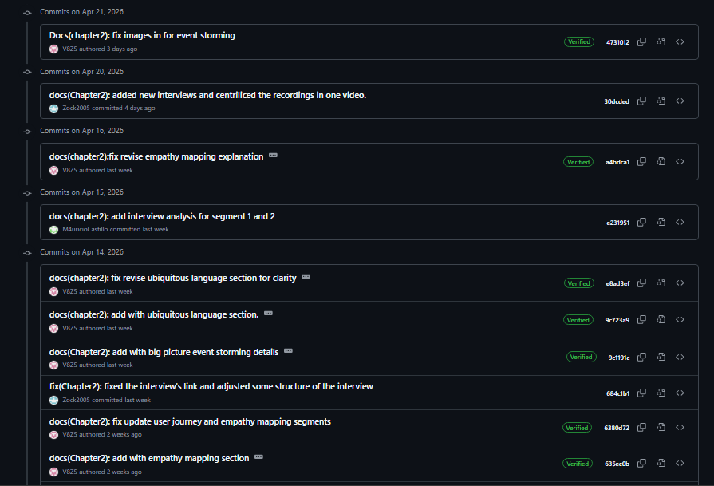
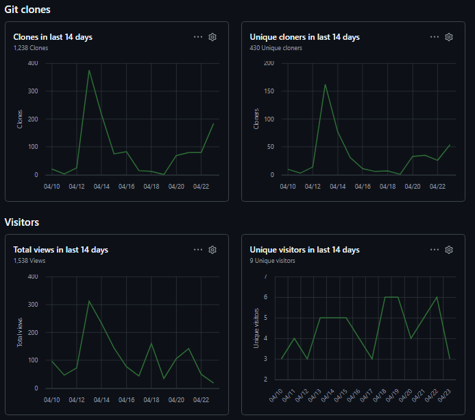

<html lang="es">
<body>
  
# Capítulo V: Product Implementation, Validation & Deployment
  
## 5.1. Software Configuration Management

    En esta sección se describen las decisiones, convenciones y principios adoptados por el equipo de ClosedSource para garantizar la coherencia, trazabilidad y control de versiones durante el ciclo de vida del desarrollo de la solución QualiTrack. Se establecen los lineamientos para la configuración del entorno de desarrollo, gestión del código fuente, convenciones de estilo y configuración de despliegue.

  
### 5.1.1. Software Development Environment Configuration

    En esta sección se especifican los productos de software utilizados durante el ciclo de vida del proyecto, incluyendo el nombre de cada herramienta, su propósito técnico específico dentro del proyecto QualiTrack, y la ruta de referencia o descarga. Las herramientas se organizan según las siguientes disciplinas:

  
<ol>
    <li>Project Management</li>
    <li>Requirements Management</li>
    <li>Product UX/UI Design</li>
    <li>Software Development</li>
    <li>Software Testing</li>
    <li>Software Documentation</li>
</ol>

<h4>Project Management</h4>

    Esta disciplina se centra en la planificación, seguimiento y control de las actividades del proyecto, asegurando el cumplimiento de los objetivos dentro del tiempo y recurso establecidos.

<ul>
  <li>
    <strong>Jira:</strong> Plataforma de gestión de proyectos ágiles utilizada para la administración del Product Backlog, planificación de Sprints, asignación de User Stories y Technical Stories a los miembros del equipo, y seguimiento del progreso mediante tableros Scrum.  
    <strong>Ruta de referencia:</strong> <a href="https://www.atlassian.com/software/jira">https://www.atlassian.com/software/jira</a>
  </li>
</ul>

<h4>Requirements Management</h4>

    Este proceso se enfoca en la documentación, verificación y seguimiento de los requisitos del proyecto, asegurando que las necesidades de los laboratorios y normativas BPM sean satisfechas.

<ul>
  <li>
    <strong>Trello:</strong> Plataforma de gestión visual basada en tableros, listas y tarjetas, utilizada para la organización rápida del Sprint Backlog y colaboración del equipo.  
    <strong>Ruta de referencia:</strong> <a href="https://trello.com">https://trello.com</a>
  </li>
</ul>

<h4>Product UX/UI Design</h4>

    El diseño de la experiencia de usuario y la interfaz para QualiTrack contempla paneles de control de telemetría de alta densidad de datos. Se utilizan las siguientes herramientas:

<ol>
  <li>
    <strong>UXPressia:</strong> Plataforma para la elaboración de User Personas (Jefe de QA y Supervisor Público), Empathy Maps y Customer Journey Maps.  
    <strong>Ruta de referencia:</strong> <a href="https://uxpressia.com/">https://uxpressia.com/</a>
  </li>
  <li>
    <strong>Miro:</strong> Pizarra digital colaborativa utilizada para sesiones de Event Storming, facilitando la identificación de Bounded Contexts del dominio farmacéutico.  
    <strong>Ruta de referencia:</strong> <a href="https://miro.com/es/">https://miro.com/es/</a>
  </li>
  <li>
    <strong>Figma:</strong> Herramienta de diseño para la creación de Wireframes, Mock-ups y Prototipos interactivos del Landing Page y la Web Application SaaS de QualiTrack.  
    <strong>Ruta de referencia:</strong> <a href="https://www.figma.com/es-es/">https://www.figma.com/es-es/</a>
  </li>
  <li>
    <strong>LucidChart:</strong> Aplicación para la creación de diagramas de arquitectura C4, Class Diagrams y Database Diagrams.  
    <strong>Ruta de referencia:</strong> <a href="https://www.lucidchart.com/pages/es">https://www.lucidchart.com/pages/es</a>
  </li>
</ol>

<h4>Software Development</h4>

    El desarrollo abarca la implementación de la Landing Page, la Frontend Web Application (SPA) y los Backend Web Services integrados con IoT.

<ol>
  <li>
    <strong>GitHub:</strong> Sistema de control de versiones y plataforma de hosting. Gestión de la organización ClosedSource-11848, implementación de GitFlow y Conventional Commits.  
    <strong>Ruta de referencia:</strong> <a href="https://github.com">https://github.com</a>
  </li>
  <li>
    <strong>WebStorm:</strong> Entorno de desarrollo integrado (IDE) de JetBrains optimizado para la implementación del Frontend utilizando Angular, TypeScript, HTML5 y CSS3.  
    <strong>Ruta de descarga:</strong> <a href="https://www.jetbrains.com/webstorm/">https://www.jetbrains.com/webstorm/</a>
  </li>
  <li>
    <strong>IntelliJ IDEA:</strong> IDE de JetBrains para la implementación del Backend con Spring Boot, procesamiento de reglas de negocio y despliegue en la nube mediante los plugins de Azure.  
    <strong>Ruta de descarga:</strong> <a href="https://www.jetbrains.com/idea/">https://www.jetbrains.com/idea/</a>
  </li>
  <li>
    <strong>Angular Framework:</strong> Framework principal para la SPA, gestión de estado y consumo de APIs REST para los dashboards en tiempo real.  
    <strong>Ruta de referencia:</strong> <a href="https://angular.io/">https://angular.io/</a>
  </li>
  <li>
    <strong>Spring Boot (Java 17):</strong> Framework para el desarrollo de la API RESTful. Implementación de compliance BPM y persistencia de telemetría IoT.  
    <strong>Ruta de referencia:</strong> <a href="https://spring.io/projects/spring-boot">https://spring.io/projects/spring-boot</a>
  </li>
</ol>

<h4>Software Testing</h4>

    Las pruebas verifican que los datos no puedan ser manipulados y que las alertas IoT funcionen en tiempo real.

<ul>
  <li>
    <strong>Lenguaje Gherkin:</strong> Lenguaje (DSL) para la redacción de Acceptance Criteria en formato Given-When-Then, vital para validar historias de usuario de liberación de lotes y bloqueos de parámetros.  
    <strong>Ruta de referencia:</strong> <a href="https://cucumber.io/docs/gherkin/">https://cucumber.io/docs/gherkin/</a>
  </li>
</ul>

<h4>Software Documentation</h4>
<ul>
  <li>
    <strong>OpenAPI Specification / Swagger:</strong> Estándar para la documentación interactiva de los Web Services de QualiTrack.  
    <strong>Ruta de referencia:</strong> <a href="https://swagger.io/">https://swagger.io/</a>
  </li>
</ul>

### 5.1.2. Source Code Management

    En esta sección se establecen los medios y esquemas de organización aplicados para el seguimiento de modificaciones del código fuente utilizando GitHub.

<h4>Repositorios del Proyecto</h4>

<table>
  <thead>
    <tr>
      <th>Producto</th>
      <th>URL del Repositorio</th>
    </tr>
  </thead>
  <tbody>
    <tr>
      <td>Organización ClosedSource-11848</td>
      <td><a href="https://github.com/ClosedSource-11848">https://github.com/ClosedSource-11848</a></td>
    </tr>
    <tr>
      <td>Landing Page</td>
      <td><a href="https://github.com/ClosedSource-11848/QualiTrack-LandingPage">https://github.com/ClosedSource-11848/QualiTrack-LandingPage</a></td>
    </tr>
    <tr>
      <td>Frontend Web Application</td>
      <td><a href="https://github.com/ClosedSource-11848/ClosedSource-Frontend">https://github.com/ClosedSource-11848/ClosedSource-Frontend</a></td>
    </tr>
    <tr>
      <td>Backend Web Services</td>
      <td><a href="https://github.com/ClosedSource-11848/ClosedSource-Backend">https://github.com/ClosedSource-11848/ClosedSource-Backend</a></td>
    </tr>
  </tbody>
</table>

<h4>GitFlow Workflow</h4>

    Se implementa GitFlow para facilitar el desarrollo paralelo de los Bounded Contexts.

<ul>
  <li><strong>main:</strong> Versiones estables listas para producción.</li>
  <li><strong>develop:</strong> Rama de integración de features.</li>
  <li><strong>feature/&lt;contexto&gt;-&lt;funcionalidad&gt;:</strong> Ej. <code>feature/batch-release-digital-signature</code>.</li>
  <li><strong>hotfix/&lt;issue&gt;:</strong> Correcciones críticas.</li>
</ul>

<h4>Conventional Commits</h4>

Ejemplos adaptados a QualiTrack:

<pre><code>feat(tracking): implement IoT telemetry ingestion endpoint
fix(compliance): resolve blocking mechanism for minor deviations
docs(readme): update docs bibliography
build(deps): update Spring Boot to 3.1.2
</code></pre>

### 5.1.3. Source Code Style Guide & Conventions

  

      En esta sección se establecen las convenciones de estilo y nomenclatura adoptadas para los lenguajes utilizados en el proyecto QualiTrack: HTML, CSS, JavaScript, TypeScript, Java y Gherkin. Se aplica nomenclatura en inglés para todos los elementos del código, siguiendo el Ubiquitous Language definido para el dominio de gestión de calidad farmacéutica.
  

<h4>Referencias de Guías de Estilo Adoptadas</h4>

<table>
  <thead>
    <tr>
      <th>Lenguaje/Tecnología</th>
      <th>Guía de Estilo</th>
    </tr>
  </thead>
  <tbody>
    <tr>
      <td>HTML/CSS</td>
      <td><a href="https://google.github.io/styleguide/htmlcssguide.html">Google HTML/CSS Style Guide</a></td>
    </tr>
    <tr>
      <td>JavaScript</td>
      <td><a href="https://google.github.io/styleguide/jsguide.html">Google JavaScript Style Guide</a></td>
    </tr>
    <tr>
      <td>TypeScript</td>
      <td><a href="https://google.github.io/styleguide/tsguide.html">Google TypeScript Style Guide</a></td>
    </tr>
    <tr>
      <td>Angular</td>
      <td><a href="https://angular.io/guide/styleguide">Angular Coding Style Guide</a></td>
    </tr>
    <tr>
      <td>Java</td>
      <td><a href="https://google.github.io/styleguide/javaguide.html">Google Java Style Guide</a></td>
    </tr>
    <tr>
      <td>Gherkin</td>
      <td><a href="https://cucumber.io/docs/gherkin/reference/">Gherkin Reference</a></td>
    </tr>
  </tbody>
</table>

<h4>Nomenclatura General</h4>

  Se utiliza nomenclatura en inglés para todos los elementos del código, relacionada con la entidad que representan dentro del dominio del negocio (ej. Batch, Equipment, Telemetry).

<table>
  <thead>
    <tr>
      <th>Elemento</th>
      <th>Convención</th>
      <th>Ejemplo</th>
    </tr>
  </thead>
  <tbody>
    <tr>
      <td>Clases (Java/TypeScript)</td>
      <td>PascalCase</td>
      <td><code>BatchService</code>, <code>EquipmentController</code></td>
    </tr>
    <tr>
      <td>Interfaces (TypeScript)</td>
      <td>PascalCase</td>
      <td><code>IBatchRecord</code>, <code>Equipment</code></td>
    </tr>
    <tr>
      <td>Métodos/Funciones</td>
      <td>camelCase</td>
      <td><code>getBatchById()</code>, <code>registerEquipment()</code></td>
    </tr>
    <tr>
      <td>Variables</td>
      <td>camelCase</td>
      <td><code>batchCode</code>, <code>equipmentList</code></td>
    </tr>
    <tr>
      <td>Constantes</td>
      <td>SCREAMING_SNAKE_CASE</td>
      <td><code>MAX_DEVIATION</code>, <code>API_BASE_URL</code></td>
    </tr>
    <tr>
      <td>Archivos de componentes Angular</td>
      <td>kebab-case</td>
      <td><code>batch-list.component.ts</code></td>
    </tr>
    <tr>
      <td>Clases CSS</td>
      <td>kebab-case</td>
      <td><code>.batch-card</code>, <code>.telemetry-form</code></td>
    </tr>
    <tr>
      <td>Endpoints REST</td>
      <td>kebab-case (plural)</td>
      <td><code>/api/v1/batches</code>, <code>/api/v1/equipments</code></td>
    </tr>
  </tbody>
</table>

<h4>Sangría</h4>

Se aplica un espaciado de dos espacios para la indentación en todos los archivos HTML, CSS, JavaScript y TypeScript.

<strong>Ejemplo HTML:</strong>

<pre><code>&lt;!DOCTYPE html&gt;
&lt;html&gt;
  &lt;head&gt;
    &lt;title&gt;QualiTrack - Pharmaceutical Quality Management&lt;/title&gt;
  &lt;/head&gt;
  &lt;body&gt;
    &lt;header&gt;
      &lt;h1&gt;Welcome to QualiTrack&lt;/h1&gt;
    &lt;/header&gt;
    &lt;main&gt;
      &lt;p&gt;Real-time IoT Monitoring and BPM Compliance.&lt;/p&gt;
    &lt;/main&gt;
  &lt;/body&gt;
&lt;/html&gt;
</code></pre>

<h4>Convenciones por Lenguaje</h4>

<h5>HTML</h5>

<ul>
  <li>Declarar <code>&lt;!DOCTYPE html&gt;</code> en la primera línea.</li>
  <li>Utilizar minúsculas para nombres de elementos y atributos.</li>
  <li>Utilizar comillas dobles para valores de atributos: <code>&lt;div class="container"&gt;</code></li>
  <li>Incluir atributos <code>alt</code> en todas las imágenes para accesibilidad.</li>
  <li>No omitir elementos <code>&lt;title&gt;</code> y meta tags.</li>
  <li>Usar líneas en blanco para separar bloques de código extensos.</li>
</ul>

<h5>CSS</h5>

<ul>
  <li>Utilizar shorthand properties cuando sea posible: <code>margin: 10px 20px;</code></li>
  <li>Terminar todas las declaraciones con punto y coma.</li>
  <li>Un espacio después de los dos puntos en propiedades: <code>color: #333;</code></li>
  <li>Usar comillas simples para valores de font-family: <code>font-family: 'Rubik', sans-serif;</code></li>
  <li>Organizar propiedades alfabéticamente dentro de cada selector.</li>
</ul>

<h5>JavaScript / TypeScript</h5>

<ul>
  <li>Usar <code>const</code> y <code>let</code> en lugar de <code>var</code>.</li>
  <li>Espacios alrededor de operadores: <code>const isCompliant = temp &lt; maxTemp;</code></li>
  <li>Punto y coma al final de instrucciones.</li>
  <li>Llaves de apertura en la misma línea de la declaración.</li>
  <li>Usar arrow functions para callbacks: <code>batches.map(batch =&gt; batch.id)</code></li>
</ul>

<strong>Ejemplo TypeScript:</strong>

<pre><code>export class BatchService {
  private batches: Batch[] = [];

  getBatchById(id: string): Batch | undefined {
    return this.batches.find(batch =&gt; batch.id === id);
  }

  createBatch(batch: Batch): void {
    this.batches.push(batch);
  }
}
</code></pre>

<h5>Java</h5>

<ul>
  <li>Seguir convenciones de nomenclatura de Spring Boot.</li>
  <li>Documentar clases y métodos públicos con Javadoc.</li>
  <li>Organizar imports alfabéticamente, separando imports de java.*, javax.*, org.*, com.*</li>
  <li>Máximo 120 caracteres por línea.</li>
  <li>Usar anotaciones de Spring en líneas separadas.</li>
</ul>

<strong>Ejemplo Java:</strong>

<pre><code>@RestController
@RequestMapping("/api/v1/batches")
public class BatchController {

    private final BatchService batchService;

    public BatchController(BatchService batchService) {
        this.batchService = batchService;
    }

    @GetMapping("/{id}")
    public ResponseEntity&lt;Batch&gt; getBatchById(@PathVariable Long id) {
        return batchService.findById(id)
            .map(ResponseEntity::ok)
            .orElse(ResponseEntity.notFound().build());
    }
}
</code></pre>

<h5>Gherkin</h5>

<ul>
  <li>Escribir escenarios en inglés.</li>
  <li>Un escenario por comportamiento específico.</li>
  <li>Mantener pasos atómicos y reutilizables.</li>
  <li>Usar indentación de dos espacios para los pasos.</li>
</ul>

<strong>Ejemplo Gherkin:</strong>

<pre><code>Feature: Equipment Management

  Scenario: Successfully link an IoT equipment
    Given the QA Manager is authenticated
    And the QA Manager is on the equipment registration form
    When the QA Manager enters a valid device ID and BPM parameters
    And clicks the "Link Equipment" button
    Then the system should display a success message
    And the new equipment should appear active in the telemetry dashboard

  Scenario: Attempt to link equipment with missing BPM parameters
    Given the QA Manager is authenticated
    And the QA Manager is on the equipment registration form
    When the QA Manager submits the form with empty max temperature limits
    Then the system should display validation error messages
    And the equipment should not be registered
</code></pre>

### 5.1.4. Software Deployment Configuration

    En esta sección se especifica la configuración de despliegue para los entornos de QualiTrack, apoyados en plataformas en la nube de alta disponibilidad.

<h4>Landing Page - GitHub Pages</h4>

    Despliegue directo del contenido estático de marketing desde el repositorio principal a través de GitHub Actions.

<strong>URL de despliegue:</strong> <a href="https://closedsource-11848.github.io/QualiTrack-LandingPage/">XXXXXXXXXX</a>

## 5.2. Landing Page, Services & Applications Implementation

### 5.2.1. Sprint 1

  Durante el Sprint 1, el equipo de ClosedSource se enfocó en el desarrollo e implementación de la Landing Page pública de QualiTrack, abarcando las secciones de presentación del negocio, la propuesta de valor basada en IoT y despliegue en la nube.

  <strong>Repositorio:</strong> <a href="https://github.com/ClosedSource-11848/QualiTrack-LandingPage">XXXXXXXXXXXXXXXXXX</a>

#### 5.2.1.1. Sprint Planning
<table border="1" cellpadding="4" cellspacing="0">
  <thead>
    <tr>
      <th colspan="2" style="text-align: center;">Sprint Planning Sprint 1</th>
    </tr>
  </thead>
  <tbody>
    <tr>
      <td colspan="2" style="text-align: center;"><strong>Sprint Planning Background</strong></td>
    </tr>
    <tr>
      <td>Date</td>
      <td>05/04/2026</td>
    </tr>
    <tr>
      <td>Time</td>
      <td>10:00 p.m.</td>
    </tr>
    <tr>
      <td>Location</td>
      <td>Discord / Teams</td>
    </tr>
    <tr>
      <td>Prepared By</td>
      <td>Ruiz Madrid, Billy Jake</td>
    </tr>
    <tr>
      <td>Attendees</td>
      <td>
        Ruiz Madrid, Billy Jake 
        Diaz Caruzo, Edgard Daniel 
        Viza Quispe, Marlon Packard 
        Castillo Yataco, Mauricio Sebastian 
        Angulo Ramírez, Marcelo Martín
      </td>
    </tr>
    <tr>
      <td colspan="2" style="text-align: center;"><strong>Sprint Goal & User Stories</strong></td>
    </tr>
    <tr>
      <td colspan="2"><strong>Sprint 1 Goal (Outcome–Impact–Customer–Confirmation):</strong>  
<em>Our focus is on delivering the first marketing Landing Page of QualiTrack that clearly communicates the value proposition regarding IoT automation and BPM compliance.</em>  
<em>We believe it delivers a clear, professional first impression for QA Managers and Public Health Directors, helping them understand our SaaS offering.</em>  
<em>This will be confirmed when users can navigate through all core sections (Hero, Features, Benefits, Plans, About Us) and can seamlessly switch languages and contact the sales team.</em>
      </td>
    </tr>
    <tr>
      <td>Sprint 1 Velocity</td>
      <td>14 Story Points</td>
    </tr>
  </tbody>
</table>

#### 5.2.1.2. Aspect Leaders and Collaborators

Esta matriz <strong>LACX</strong> identifica los aspectos principales del sprint y asigna responsabilidades (Líder/Colaborador) para organizar al equipo de ClosedSource.

<table border="1" cellpadding="4" cellspacing="0" align="center">
  <thead>
    <tr>
      <th>Team Member</th>
      <th>Aspect: UI/UX & Styling</th>
      <th>Aspect: HTML Structuring & Deployment</th>
    </tr>
  </thead>
  <tbody>
    <tr><td>Ruiz Madrid, Billy Jake</td><td>C</td><td>C</td></tr>
    <tr><td>Diaz Caruzo, Edgard Daniel</td><td>C</td><td>C</td></tr>
    <tr><td>Viza Quispe, Marlon Packard</td><td>C</td><td>C</td></tr>
    <tr><td>Castillo Yataco, Mauricio Sebastian</td><td>C</td><td>C</td></tr>
    <tr><td>Angulo Ramírez, Marcelo Martín</td><td>C</td><td>C</td></tr>
  </tbody>
</table>

### 5.2.1.3. Sprint Backlog 1  

El Sprint Backlog agrupa las historias EP01 (US01 a US05) definidas en el Capítulo III.

| Sprint # | Sprint 1 |   |   |   |   |   |   |
|---------|----------|---|---|---|---|---|---|
| **User Story Id** | **Title** | **Task Id** | **Title** | **Description** | **Estimation (Hours)** | **Assigned To** | **Status** |
| US01 | Menú de navegación | T001 | Definir estructura del menú | Implementar el navbar responsivo. | 3h | | Done |
| US02 | Visualización de planes | T002 | Diseñar UI de pricing | Crear tarjetas de suscripción Standard y Enterprise. | 4h | | Done |
| US03 | Visualización del equipo | T003 | Maquetar sección Team | Mostrar las tarjetas de los ingenieros de ClosedSource. | 3h |  | Done |
| US04 | Formulario de contacto | T004 | Implementar Footer y form | Formulario de validación básica. | 4h | | Done |
| US05 | Cambio de idioma | T005 | Lógica de i18n básica | Toggle de cambio de idioma. | 3h || Done |

#### 5.2.1.4. Development Evidence for Sprint Review

  Resumen de los commits más relevantes en el repositorio de la Landing Page de QualiTrack.

<table border="1" cellpadding="4" cellspacing="0">
  <thead>
    <tr>
      <th>Branch</th>
      <th>Commit Id</th>
      <th>Commit Message</th>
      <th>Committed on</th>
    </tr>
  </thead>
  <tbody>
    <tr>
      <td>main</td>
      <td></td>
      <td>Initial commit: basic project structure</td>
      <td>-04-2026</td>
    </tr>
    <tr>
      <td>feature/hero</td>
      <td></td>
      <td>feat(ui): add hero section for Quality Management</td>
      <td>-04-2026</td>
    </tr>
    <tr>
      <td>feature/plans</td>
      <td></td>
      <td>feat(pricing): add standard and enterprise cards</td>
      <td>-04-2026</td>
    </tr>
    <tr>
      <td>main</td>
      <td></td>
      <td>fix: update assets paths for GitHub Pages deploy</td>
      <td>-04-2026</td>
    </tr>
  </tbody>
</table>

#### 5.2.1.5. Execution Evidence for Sprint Review

  Se completó la implementación y el diseño de la Landing Page. 

#### 5.2.1.6. Services Documentation Evidence

  Dado que el Sprint 1 abarca únicamente contenido estático (Landing Page), la implementación y consumo de la API de telemetría IoT y gestión de lotes se abordará en los sprints posteriores orientados al Backend Web Services.

#### 5.2.1.7. Software Deployment Evidence

  <strong>URL de Producción:</strong> <a href="https://closedsource-11848.github.io/QualiTrack-LandingPage/">XXXXXXXXXXXXXXX</a>

#### 5.2.1.8. Team Collaboration Insights during Sprint

  Durante este primer sprint, el esfuerzo principal del equipo de ClosedSource se centró en la estructuración del proyecto, el diseño de UX/UI, la arquitectura de software y la elaboración de los requerimientos técnicos (Capítulos I al IV). Por lo tanto, las evidencias de colaboración de GitHub presentadas a continuación corresponden al repositorio del <strong>Project Report</strong>, sentando las bases documentales y de diseño para la posterior codificación de la plataforma QualiTrack.

  En primer lugar, el <strong>Historial de Commits</strong> del repositorio demuestra que el trabajo no fue centralizado, sino altamente colaborativo. A lo largo del sprint, se observa un flujo constante de aportes realizados en diferentes días por distintos miembros del equipo (reflejados a través de sus usuarios de GitHub). Cada integrante se encargó de actualizar y mejorar secciones específicas, como el análisis de entrevistas, el Event Storming o los diagramas de arquitectura, evidenciando un desarrollo incremental y distribuido.

  
  
<em>Figura: Historial de commits demostrando la participación activa de los miembros del equipo.</em>

  En segundo lugar, el gráfico de <strong>Visitors (Traffic)</strong> proporcionado por los Insights de GitHub demuestra que el repositorio documental mantuvo una actividad de consulta constante. El flujo de "Views" y "Unique visitors" a lo largo de las semanas del sprint confirma que los integrantes del equipo ingresaban recurrentemente al repositorio no solo para subir su parte, sino para revisar el trabajo de sus compañeros, unificar criterios sobre el Ubiquitous Language y validar la coherencia de los diagramas C4 antes del cierre del documento.

  
  
<em>Figura: Gráfica de visitantes mostrando la revisión constante del repositorio por parte del equipo.</em>

### 5.2.2. Sprint 2

#### 5.2.2.1. Sprint Planning 2

#### 5.2.2.2. Aspect Leaders and Collaborators

#### 5.2.2.3. Sprint Backlog 2

#### 5.2.2.4. Development Evidence for Sprint Review

#### 5.2.2.5. Execution Evidence for Sprint Review

#### 5.2.2.6. Services Documentation Evidence for Sprint Review

#### 5.2.2.7. Software Deployment Evidence for Sprint Review

#### 5.2.2.8. Team Collaboration Insights during Sprint

### 5.2.3. Sprint 3

#### 5.2.3.1. Sprint Planning 3

#### 5.2.3.2. Aspect Leaders and Collaborators

#### 5.2.3.3. Sprint Backlog 3

#### 5.2.3.4. Development Evidence for Sprint Review

#### 5.2.3.5. Execution Evidence for Sprint Review

#### 5.2.3.6. Services Documentation Evidence for Sprint Review

#### 5.2.3.7. Software Deployment Evidence for Sprint Review

#### 5.2.3.8. Team Collaboration Insights during Sprint

### 5.2.4. Sprint 4

#### 5.2.4.1. Sprint Planning 4

#### 5.2.4.2. Aspect Leaders and Collaborators

#### 5.2.4.3. Sprint Backlog 4

#### 5.2.4.4. Development Evidence for Sprint Review

#### 5.2.4.5. Execution Evidence for Sprint Review

#### 5.2.4.6. Services Documentation Evidence for Sprint Review

#### 5.2.4.7. Software Deployment Evidence for Sprint Review

#### 5.2.4.8. Team Collaboration Insights during Sprint

## 5.3. Validation Interviews

### 5.3.1. Diseño de Entrevistas

### 5.3.2. Registro de Entrevistas

### 5.3.3. Evaluaciones según heurísticas

## 5.4. Video About-the-Product

# Conclusiones

## Conclusiones y recomendaciones

## Video About-the-Team

# Bibliografía
<ul>
  <li>Brown, S. (2020). <em>The C4 model for visualising software architecture</em>. C4 Model. Recuperado de <a href="https://c4model.com/">https://c4model.com/</a></li>
  
  <li>Cohn, M. (2004). <em>User Stories Applied: For Agile Software Development</em>. Addison-Wesley Professional.</li>
  
  <li>Dirección General de Medicamentos, Insumos y Drogas [DIGEMID]. (2018). <em>Manual de Buenas Prácticas de Manufactura de Productos Farmacéuticos</em>. Ministerio de Salud del Perú.</li>
  
  <li>Evans, E. (2003). <em>Domain-Driven Design: Tackling Complexity in the Heart of Software</em>. Addison-Wesley Professional.</li>
  
  <li>Gothelf, J., & Seiden, J. (2021). <em>Lean UX: Designing Great Products with Agile Teams</em> (3rd ed.). O'Reilly Media.</li>
  
  <li>Heath, F. (2020). <em>Managing Software Requirements the Agile Way</em>. Packt Publishing.</li>
  
  <li>Lee, C. (2023). <em>The Art of Crafting User Stories</em>. O'Reilly Media.</li>
  
  <li>Robertson, J., Robertson, S., & Reed, A. (2023). <em>Mastering the Requirements Process: Getting Requirements Right</em> (4th ed.). Addison-Wesley Professional.</li>
  
  <li>Wiegers, K., & Hokanson, C. (2023). <em>Software Requirements Essentials: Core Practices for Successful Business Analysis</em>. Addison-Wesley Professional.</li>
</ul>

# Anexos
<h2>Anexo A: Evidencias de Entrevistas (Needfinding)</h2>

  Se adjuntan los registros y enlaces a las sesiones de validación con los segmentos objetivo para el análisis de requerimientos de QualiTrack.

<ul>
  <li><strong>Segmento 1 (Gerentes de Calidad):</strong>
    <ul>
      <li>Entrevista 1 (Delcy Castro): <a href="https://shorturl.at/CMWHx">https://shorturl.at/CMWHx</a></li>
      <li>Entrevista 4 (Patricia Navarro): <a href="https://acortar.link/Xdz3pq">https://acortar.link/Xdz3pq</a></li>
    </ul>
  </li>
  <li><strong>Segmento 2 (Supervisores Públicos):</strong>
    <ul>
      <li>Compendio de entrevistas (Rosa, Rocio, Risa): <a href="https://shorturl.at/CMWHx">https://shorturl.at/CMWHx</a></li>
    </ul>
  </li>
</ul>

<h2>Anexo B: Pizarra de Diseño de Arquitectura (DDD)</h2>

  Enlace a la herramienta Miro donde se desarrollaron los artefactos de diseño de software y lógica de negocio.

<ul>
  <li><strong>Miro Board (Event Storming & Bounded Contexts):</strong> <a href="https://shorturl.at/0eSVT">https://shorturl.at/0eSVT</a></li>
</ul>

<h2>Anexo C: Control de Versiones y Repositorios</h2>

  Acceso a la organización de GitHub de ClosedSource donde se gestionan los repositorios de la solución.

<ul>
  <li><strong>GitHub Organization:</strong> <a href="https://github.com/ClosedSource-11848">https://github.com/ClosedSource-11848</a></li>
  <li><strong>Frontend Repository:</strong> <a href="https://github.com/ClosedSource-11848/ClosedSource-Frontend">QualiTrack Frontend</a></li>
  <li><strong>Backend Repository:</strong> <a href="https://github.com/ClosedSource-11848/ClosedSource-BackEnd">QualiTrack Backend</a></li>
</ul>
