<html lang="es">
<body>
  
# Capítulo V: Product Implementation, Validation & Deployment

## 5.1. Software Configuration Management

En esta sección se describen las decisiones, convenciones y principios adoptados por el
equipo de ClosedSource para garantizar la coherencia, trazabilidad y control de versiones
durante el ciclo de vida del desarrollo de la solución QualiTrack. Se establecen los
lineamientos para la configuración del entorno de desarrollo, gestión del código fuente,
convenciones de estilo y configuración de despliegue.

### 5.1.1. Software Development Environment Configuration

En esta sección se especifican los productos de software utilizados durante el ciclo de
vida del proyecto, incluyendo el nombre de cada herramienta, su propósito técnico
específico dentro del proyecto QualiTrack, y la ruta de referencia (para software SaaS)
o ruta de descarga (para productos de instalación local). Las herramientas se organizan
según las siguientes disciplinas:

<ol>
  <li>Project Management</li>
  <li>Requirements Management</li>
  <li>Product UX/UI Design</li>
  <li>Software Development</li>
  <li>Software Testing</li>
  <li>Software Documentation</li>
</ol>

<h4>Project Management</h4>

Esta disciplina se centra en la planificación, seguimiento y control de las actividades
del proyecto, asegurando el cumplimiento de los objetivos dentro del tiempo y recursos
establecidos.

<ul>
  <li>
    <strong>Jira:</strong> Plataforma de gestión de proyectos ágiles utilizada para la
    administración del Product Backlog, planificación de Sprints, asignación de User
    Stories y Technical Stories a los miembros del equipo, y seguimiento del progreso
    mediante tableros Scrum con estados To-Do, In-Process, To-Review y Done. 
    <strong>Ruta de referencia:</strong>
    <a href="https://www.atlassian.com/software/jira">https://www.atlassian.com/software/jira</a>
  </li>
</ul>

<h4>Requirements Management</h4>

Este proceso se enfoca en la documentación, verificación y seguimiento de los requisitos
del proyecto, asegurando que las necesidades de los laboratorios farmacéuticos y las
normativas BPM sean satisfechas.

<ul>
  <li>
    <strong>Trello:</strong> Plataforma de gestión visual basada en tableros, listas y
    tarjetas, utilizada para la organización rápida del Sprint Backlog, gestión de User
    Stories por estado y colaboración del equipo en la priorización de requisitos del
    proyecto QualiTrack. 
    <strong>Ruta de referencia:</strong>
    <a href="https://trello.com">https://trello.com</a>
  </li>
</ul>

<h4>Product UX/UI Design</h4>

El diseño de la experiencia de usuario y la interfaz para QualiTrack contempla paneles
de control de telemetría de alta densidad de datos y flujos de gestión de lotes
farmacéuticos. Se utilizan las siguientes herramientas:

<ol>
  <li>
    <strong>UXPressia:</strong> Plataforma para la elaboración de User Personas (Jefe de
    QA y Supervisor de Salud Pública), Empathy Maps y Customer Journey Maps. 
    <strong>Ruta de referencia:</strong>
    <a href="https://uxpressia.com/">https://uxpressia.com/</a>
  </li>
  <li>
    <strong>Miro:</strong> Pizarra digital colaborativa utilizada para sesiones de Big
    Picture Event Storming y Design-Level Event Storming, facilitando la identificación
    de Bounded Contexts del dominio farmacéutico de QualiTrack. 
    <strong>Ruta de referencia:</strong>
    <a href="https://miro.com/es/">https://miro.com/es/</a>
  </li>
  <li>
    <strong>Figma:</strong> Herramienta de diseño colaborativo para la creación de
    Wireframes, Mock-ups y Prototipos interactivos del Landing Page y la Web Application
    SaaS de QualiTrack. 
    <strong>Ruta de referencia:</strong>
    <a href="https://www.figma.com/es-es/">https://www.figma.com/es-es/</a>
  </li>
  <li>
    <strong>LucidChart:</strong> Aplicación de diagramación colaborativa para la creación
    de diagramas C4, Class Diagrams y Database Diagrams de la arquitectura de QualiTrack. 
    <strong>Ruta de referencia:</strong>
    <a href="https://www.lucidchart.com/pages/es">https://www.lucidchart.com/pages/es</a>
  </li>
</ol>

<h4>Software Development</h4>

El desarrollo abarca la implementación del Landing Page, la Frontend Web Application (SPA
Angular) y los Backend Web Services integrados con telemetría IoT.

<ol>
  <li>
    <strong>GitHub:</strong> Sistema de control de versiones distribuido y plataforma de
    hosting para repositorios de código fuente. Gestión de la organización
    ClosedSource-11848, implementación de GitFlow Workflow y Conventional Commits. 
    <strong>Ruta de referencia:</strong>
    <a href="https://github.com">https://github.com</a> 
    <strong>Organización del proyecto:</strong>
    <a href="https://github.com/ClosedSource-11848">https://github.com/ClosedSource-11848</a>
  </li>
  <li>
    <strong>WebStorm:</strong> Entorno de desarrollo integrado (IDE) de JetBrains para la
    implementación del Frontend utilizando Angular Framework, HTML5, CSS3, JavaScript y
    TypeScript. Incluye integración con GitHub para control de versiones. 
    <strong>Ruta de descarga:</strong>
    <a href="https://www.jetbrains.com/webstorm/">https://www.jetbrains.com/webstorm/</a>
  </li>
  <li>
    <strong>IntelliJ IDEA:</strong> Entorno de desarrollo integrado (IDE) de JetBrains
    para la implementación del Backend con Spring Boot Framework y Java 17. Incluye
    integración con plataformas cloud para despliegue de Web Services. 
    <strong>Ruta de descarga:</strong>
    <a href="https://www.jetbrains.com/idea/">https://www.jetbrains.com/idea/</a>
  </li>
  <li>
    <strong>Angular Framework:</strong> Framework principal para la SPA de QualiTrack.
    Construcción de componentes reutilizables, gestión de estado mediante Services y RxJS,
    enrutamiento entre vistas y consumo de APIs REST para los dashboards de telemetría en
    tiempo real. 
    <strong>Ruta de referencia:</strong>
    <a href="https://angular.io/">https://angular.io/</a>
  </li>
  <li>
    <strong>Spring Boot (Java 17):</strong> Framework para el desarrollo de los Web
    Services RESTful del Backend de QualiTrack. Implementación de la lógica de compliance
    BPM, ingesta de telemetría IoT y persistencia de datos con JPA/Hibernate. 
    <strong>Ruta de referencia:</strong>
    <a href="https://spring.io/projects/spring-boot">https://spring.io/projects/spring-boot</a>
  </li>
  <li>
    <strong>HTML5, CSS3, JavaScript:</strong> Tecnologías fundamentales para la
    implementación del Landing Page y estructura base de la Web Application. 
    <strong>Referencias:</strong>
    <ul>
      <li>HTML5: <a href="https://html.spec.whatwg.org/">https://html.spec.whatwg.org/</a></li>
      <li>CSS3: <a href="https://www.w3.org/Style/CSS/">https://www.w3.org/Style/CSS/</a></li>
      <li>JavaScript: <a href="https://developer.mozilla.org/es/docs/Web/JavaScript">https://developer.mozilla.org/es/docs/Web/JavaScript</a></li>
    </ul>
  </li>
  <li>
    <strong>TypeScript:</strong> Lenguaje de programación tipado para el desarrollo del
    Frontend con Angular. Proporciona tipado estático, detección temprana de errores y
    mejor soporte de IDE. 
    <strong>Ruta de referencia:</strong>
    <a href="https://www.typescriptlang.org/">https://www.typescriptlang.org/</a>
  </li>
</ol>

<h4>Software Testing</h4>

Las pruebas de software permiten verificar que los módulos de compliance BPM, bloqueo
automático de lotes y generación de reportes inmutables funcionen correctamente según los
criterios de aceptación definidos.

<ul>
  <li>
    <strong>Lenguaje Gherkin:</strong> Lenguaje de dominio específico (DSL) para la
    redacción de Acceptance Criteria de User Stories en formato Given-When-Then, utilizado
    para definir escenarios de prueba legibles por stakeholders y ejecutables por
    herramientas de automatización. 
    <strong>Ruta de referencia:</strong>
    <a href="https://cucumber.io/docs/gherkin/">https://cucumber.io/docs/gherkin/</a>
  </li>
</ul>

<h4>Software Documentation</h4>

La documentación de software permite explicar el funcionamiento, uso y arquitectura de los
productos desarrollados, facilitando su mantenimiento y evolución.

<ul>
  <li>
    <strong>OpenAPI Specification / Swagger:</strong> Estándar para la documentación
    interactiva de los Web Services RESTful del Backend de QualiTrack. Especificación de
    endpoints de telemetría, gestión de lotes, compliance y reportes de auditoría. 
    <strong>Ruta de referencia:</strong>
    <a href="https://swagger.io/">https://swagger.io/</a>
  </li>
  <li>
    <strong>Markdown:</strong> Lenguaje de marcado ligero para la elaboración del Project
    Report en el repositorio GitHub, permitiendo estructurar la documentación con formato
    consistente y compatible con control de versiones. 
    <strong>Ruta de referencia:</strong>
    <a href="https://www.markdownguide.org/">https://www.markdownguide.org/</a>
  </li>
</ul>

### 5.1.2. Source Code Management

En esta sección se establecen los medios y esquemas de organización aplicados para el
seguimiento de modificaciones del código fuente. Se utiliza GitHub como plataforma y
sistema de control de versiones distribuido.

<h4>Repositorios del Proyecto</h4>

<table>
  <thead>
    <tr>
      <th>Producto</th>
      <th>URL del Repositorio</th>
    </tr>
  </thead>
  <tbody>
    <tr>
      <td>Organización ClosedSource-11848</td>
      <td><a href="https://github.com/ClosedSource-11848">https://github.com/ClosedSource-11848</a></td>
    </tr>
    <tr>
      <td>Project Report</td>
      <td><a href="https://github.com/ClosedSource-11848/ClosedSource-Project-Report">https://github.com/ClosedSource-11848/ClosedSource-Project-Report</a></td>
    </tr>
    <tr>
      <td>Landing Page</td>
      <td><a href="https://github.com/ClosedSource-11848/ClosedSource-LandingPage">https://github.com/ClosedSource-11848/ClosedSource-LandingPage</a></td>
    </tr>
    <tr>
      <td>Frontend Web Application</td>
      <td><a href="https://github.com/ClosedSource-11848/ClosedSource-Frontend">https://github.com/ClosedSource-11848/ClosedSource-Frontend</a></td>
    </tr>
    <tr>
      <td>Backend Web Services</td>
      <td><a href="https://github.com/ClosedSource-11848/ClosedSource-Backend">https://github.com/ClosedSource-11848/ClosedSource-Backend</a></td>
    </tr>
  </tbody>
</table>

<h4>GitFlow Workflow</h4>

Se implementa GitFlow como modelo de flujo de trabajo para el control de versiones,
estableciendo una estructura de ramas que facilita el desarrollo paralelo de los Bounded
Contexts y la gestión de releases.

<strong>Ramas Principales:</strong>

<ul>
  <li>
    <strong>main:</strong> Rama principal que contiene el historial oficial de versiones
    estables listas para producción. Solo recibe merges de release branches y hotfix
    branches.
  </li>
  <li>
    <strong>develop:</strong> Rama de integración donde se consolidan los features
    completados y probados. Sirve como base para la creación de release branches.
  </li>
</ul>

<strong>Ramas de Soporte:</strong>

<ul>
  <li>
    <strong>feature/&lt;bounded-context&gt;-&lt;funcionalidad&gt;:</strong> Ramas creadas
    a partir de develop para implementar nuevas funcionalidades. Se fusionan de vuelta a
    develop una vez completadas y revisadas. Ejemplo:
    <code>feature/batch-release-digital-signature</code>,
    <code>feature/tracking-iot-telemetry-ingestion</code>.
  </li>
  <li>
    <strong>release/&lt;version&gt;:</strong> Ramas creadas a partir de develop para
    preparar una nueva versión de producción. Ejemplo: <code>release/1.0.0</code>.
  </li>
  <li>
    <strong>hotfix/&lt;issue&gt;:</strong> Ramas creadas a partir de main para
    correcciones urgentes en producción. Se fusionan tanto a main como a develop.
    Ejemplo: <code>hotfix/fix-bpm-evaluation-threshold</code>.
  </li>
</ul>

<h4>Conventional Commits</h4>

Se aplica la especificación Conventional Commits para los mensajes de commit, siguiendo
la estructura: <code>&lt;type&gt;[optional scope]: &lt;description&gt;</code>

<table>
  <thead>
    <tr>
      <th>Tipo</th>
      <th>Descripción</th>
    </tr>
  </thead>
  <tbody>
    <tr><td><code>feat</code></td><td>Nueva funcionalidad para el usuario</td></tr>
    <tr><td><code>fix</code></td><td>Corrección de un bug</td></tr>
    <tr><td><code>docs</code></td><td>Cambios en documentación</td></tr>
    <tr><td><code>style</code></td><td>Cambios de formato sin afectar lógica</td></tr>
    <tr><td><code>refactor</code></td><td>Refactorización sin cambiar funcionalidad</td></tr>
    <tr><td><code>test</code></td><td>Adición o corrección de pruebas</td></tr>
    <tr><td><code>build</code></td><td>Cambios en sistema de build o dependencias</td></tr>
    <tr><td><code>chore</code></td><td>Tareas de mantenimiento sin afectar producción</td></tr>
  </tbody>
</table>

<strong>Ejemplos de commits adaptados al dominio QualiTrack:</strong>

<pre><code>feat(tracking): implement IoT telemetry ingestion endpoint
fix(compliance): resolve blocking mechanism for minor deviations
docs(readme): update deployment instructions for GitHub Pages
build(deps): upgrade Spring Boot to 3.1.2
chore: initial commit.
feat: add main structure and content to index
docs: add terms of service.
docs: add privacy policy compliant with peruvian law.
</code></pre>

<h4>Semantic Versioning</h4>

Se aplica Semantic Versioning 2.0.0 para el versionado de releases, siguiendo el formato
<code>MAJOR.MINOR.PATCH</code>:

<ul>
  <li><strong>MAJOR:</strong> Cambios incompatibles con versiones anteriores</li>
  <li><strong>MINOR:</strong> Nuevas funcionalidades compatibles con versiones anteriores</li>
  <li><strong>PATCH:</strong> Correcciones de bugs compatibles con versiones anteriores</li>
</ul>

### 5.1.3. Source Code Style Guide & Conventions

En esta sección se establecen las convenciones de estilo y nomenclatura adoptadas para
los lenguajes utilizados en el proyecto QualiTrack: HTML, CSS, JavaScript, TypeScript,
Java y Gherkin. Se aplica nomenclatura en inglés para todos los elementos del código,
siguiendo el Ubiquitous Language definido para el dominio de gestión de calidad
farmacéutica.

<h4>Referencias de Guías de Estilo Adoptadas</h4>

<table>
  <thead>
    <tr>
      <th>Lenguaje/Tecnología</th>
      <th>Guía de Estilo</th>
    </tr>
  </thead>
  <tbody>
    <tr>
      <td>HTML/CSS</td>
      <td><a href="https://google.github.io/styleguide/htmlcssguide.html">Google HTML/CSS Style Guide</a></td>
    </tr>
    <tr>
      <td>JavaScript</td>
      <td><a href="https://google.github.io/styleguide/jsguide.html">Google JavaScript Style Guide</a></td>
    </tr>
    <tr>
      <td>TypeScript</td>
      <td><a href="https://google.github.io/styleguide/tsguide.html">Google TypeScript Style Guide</a></td>
    </tr>
    <tr>
      <td>Angular</td>
      <td><a href="https://angular.io/guide/styleguide">Angular Coding Style Guide</a></td>
    </tr>
    <tr>
      <td>Java</td>
      <td><a href="https://google.github.io/styleguide/javaguide.html">Google Java Style Guide</a></td>
    </tr>
    <tr>
      <td>Spring Boot</td>
      <td><a href="https://docs.spring.io/spring-boot/docs/current/reference/html/features.html">Spring Boot Reference Documentation</a></td>
    </tr>
    <tr>
      <td>Gherkin</td>
      <td><a href="https://cucumber.io/docs/gherkin/reference/">Gherkin Reference</a></td>
    </tr>
  </tbody>
</table>

<h4>Nomenclatura General</h4>

<table>
  <thead>
    <tr>
      <th>Elemento</th>
      <th>Convención</th>
      <th>Ejemplo</th>
    </tr>
  </thead>
  <tbody>
    <tr>
      <td>Clases (Java/TypeScript)</td>
      <td>PascalCase</td>
      <td><code>BatchService</code>, <code>EquipmentController</code></td>
    </tr>
    <tr>
      <td>Interfaces (TypeScript)</td>
      <td>PascalCase</td>
      <td><code>IBatchRecord</code>, <code>Equipment</code></td>
    </tr>
    <tr>
      <td>Métodos/Funciones</td>
      <td>camelCase</td>
      <td><code>getBatchById()</code>, <code>registerEquipment()</code></td>
    </tr>
    <tr>
      <td>Variables</td>
      <td>camelCase</td>
      <td><code>batchCode</code>, <code>equipmentList</code></td>
    </tr>
    <tr>
      <td>Constantes</td>
      <td>SCREAMING_SNAKE_CASE</td>
      <td><code>MAX_DEVIATION</code>, <code>API_BASE_URL</code></td>
    </tr>
    <tr>
      <td>Archivos de componentes Angular</td>
      <td>kebab-case</td>
      <td><code>batch-list.component.ts</code></td>
    </tr>
    <tr>
      <td>Clases CSS</td>
      <td>kebab-case</td>
      <td><code>.batch-card</code>, <code>.telemetry-form</code></td>
    </tr>
    <tr>
      <td>Endpoints REST</td>
      <td>kebab-case (plural)</td>
      <td><code>/api/v1/batches</code>, <code>/api/v1/equipment</code></td>
    </tr>
  </tbody>
</table>

<h4>Sangría</h4>

Se aplica un espaciado de dos espacios para la indentación en todos los archivos HTML,
CSS, JavaScript y TypeScript.

<strong>Ejemplo HTML:</strong>

<pre><code>&lt;!DOCTYPE html&gt;
&lt;html&gt;
  &lt;head&gt;
    &lt;title&gt;QualiTrack - Pharmaceutical Quality Management&lt;/title&gt;
  &lt;/head&gt;
  &lt;body&gt;
    &lt;header&gt;
      &lt;h1&gt;Welcome to QualiTrack&lt;/h1&gt;
    &lt;/header&gt;
    &lt;main&gt;
      &lt;p&gt;Real-time IoT Monitoring and BPM Compliance.&lt;/p&gt;
    &lt;/main&gt;
  &lt;/body&gt;
&lt;/html&gt;
</code></pre>

<h4>Convenciones por Lenguaje</h4>

<h5>HTML</h5>
<ul>
  <li>Declarar <code>&lt;!DOCTYPE html&gt;</code> en la primera línea.</li>
  <li>Utilizar minúsculas para nombres de elementos y atributos.</li>
  <li>Utilizar comillas dobles para valores de atributos: <code>&lt;div class="container"&gt;</code></li>
  <li>Incluir atributos <code>alt</code> en todas las imágenes para accesibilidad.</li>
  <li>No omitir elementos <code>&lt;title&gt;</code> y meta tags.</li>
  <li>Usar líneas en blanco para separar bloques de código extensos.</li>
</ul>

<h5>CSS</h5>
<ul>
  <li>Utilizar shorthand properties cuando sea posible: <code>margin: 10px 20px;</code></li>
  <li>Terminar todas las declaraciones con punto y coma.</li>
  <li>Un espacio después de los dos puntos en propiedades: <code>color: #333;</code></li>
  <li>Usar comillas simples para font-family: <code>font-family: 'Rubik', sans-serif;</code></li>
  <li>Organizar propiedades alfabéticamente dentro de cada selector.</li>
</ul>

<h5>JavaScript / TypeScript</h5>
<ul>
  <li>Usar <code>const</code> y <code>let</code> en lugar de <code>var</code>.</li>
  <li>Espacios alrededor de operadores: <code>const isCompliant = temp &lt; maxTemp;</code></li>
  <li>Punto y coma al final de instrucciones.</li>
  <li>Llaves de apertura en la misma línea de la declaración.</li>
  <li>Usar arrow functions para callbacks: <code>batches.map(batch =&gt; batch.id)</code></li>
</ul>

<strong>Ejemplo TypeScript:</strong>

<pre><code>export class BatchService {
  private batches: Batch[] = [];

  getBatchById(id: string): Batch | undefined {
    return this.batches.find(batch =&gt; batch.id === id);
  }

  createBatch(batch: Batch): void {
    this.batches.push(batch);
  }
}
</code></pre>

<h5>Java</h5>
<ul>
  <li>Seguir convenciones de nomenclatura de Spring Boot.</li>
  <li>Documentar clases y métodos públicos con Javadoc.</li>
  <li>Organizar imports alfabéticamente, separando imports de java.*, javax.*, org.*, com.*</li>
  <li>Máximo 120 caracteres por línea.</li>
  <li>Usar anotaciones de Spring en líneas separadas.</li>
</ul>

<strong>Ejemplo Java:</strong>

<pre><code>@RestController
@RequestMapping("/api/v1/batches")
public class BatchController {

    private final BatchService batchService;

    public BatchController(BatchService batchService) {
        this.batchService = batchService;
    }

    @GetMapping("/{id}")
    public ResponseEntity&lt;Batch&gt; getBatchById(@PathVariable String id) {
        return batchService.findById(id)
            .map(ResponseEntity::ok)
            .orElse(ResponseEntity.notFound().build());
    }
}
</code></pre>

<h5>Gherkin</h5>
<ul>
  <li>Escribir escenarios en inglés.</li>
  <li>Un escenario por comportamiento específico.</li>
  <li>Mantener pasos atómicos y reutilizables.</li>
  <li>Usar indentación de dos espacios para los pasos.</li>
</ul>

<strong>Ejemplo Gherkin:</strong>

<pre><code>Feature: Equipment Management

  Scenario: Successfully link an IoT equipment
    Given the QA Manager is authenticated
    And the QA Manager is on the equipment registration form
    When the QA Manager enters a valid device ID and BPM parameters
    And clicks the "Link Equipment" button
    Then the system should display a success message
    And the new equipment should appear active in the telemetry dashboard

  Scenario: Attempt to link equipment with missing BPM parameters
    Given the QA Manager is authenticated
    And the QA Manager is on the equipment registration form
    When the QA Manager submits the form with empty max temperature limits
    Then the system should display validation error messages
    And the equipment should not be registered
</code></pre>

### 5.1.4. Software Deployment Configuration

En esta sección se especifica la configuración de despliegue para cada uno de los
productos digitales de la solución QualiTrack: Landing Page, Frontend Web Application
y Backend Web Services.

<h4>Landing Page – GitHub Pages</h4>

El Landing Page se despliega mediante GitHub Pages directamente desde el repositorio,
aprovechando el hosting gratuito para sitios estáticos.

<strong>Pasos de configuración:</strong>

<ol>
  <li>Acceder al repositorio <code>ClosedSource-LandingPage</code> en GitHub.</li>
  <li>Navegar a <strong>Settings &gt; Pages</strong> en el menú lateral.</li>
  <li>En la sección "Source", seleccionar la rama <code>main</code> y carpeta
  <code>/ (root)</code>.</li>
  <li>Hacer clic en <strong>Save</strong> y esperar la generación del sitio (1-2 minutos).</li>
  <li>Verificar el despliegue accediendo a la URL generada.</li>
</ol>

  <strong>URL de despliegue:</strong>
  <a href="https://closedsource-11848.github.io/ClosedSource-LandingPage/">https://closedsource-11848.github.io/ClosedSource-LandingPage/</a>

<h4>Frontend Web Application – Vercel</h4>

El Frontend desarrollado con Angular se desplegará en Vercel, plataforma que ofrece
hosting optimizado para aplicaciones frontend con CDN global y despliegue automático.

<strong>Pasos de configuración:</strong>

<ol>
  <li>Crear cuenta en <a href="https://vercel.com">Vercel</a> y vincular con GitHub.</li>
  <li>Importar el repositorio <code>ClosedSource-Frontend</code> desde GitHub.</li>
  <li>Configurar el proyecto:
    <ul>
      <li><strong>Framework Preset:</strong> Angular</li>
      <li><strong>Build Command:</strong> <code>ng build --configuration production</code></li>
      <li><strong>Output Directory:</strong> <code>dist/qualitrack-frontend</code></li>
    </ul>
  </li>
  <li>Configurar variables de entorno: <code>API_BASE_URL</code> con la URL del Backend.</li>
  <li>Habilitar despliegue automático en cada push a la rama <code>main</code>.</li>
</ol>

<h4>Backend Web Services – Azure App Service</h4>

El Backend desarrollado con Spring Boot se desplegará en Azure App Service, servicio PaaS
que facilita el hosting de aplicaciones web Java.

<strong>Configuración principal:</strong>

<table>
  <thead>
    <tr>
      <th>Variable de Entorno</th>
      <th>Descripción</th>
    </tr>
  </thead>
  <tbody>
    <tr>
      <td><code>SPRING_DATASOURCE_URL</code></td>
      <td>Cadena de conexión JDBC a MySQL</td>
    </tr>
    <tr>
      <td><code>SPRING_DATASOURCE_USERNAME</code></td>
      <td>Usuario de la base de datos</td>
    </tr>
    <tr>
      <td><code>SPRING_DATASOURCE_PASSWORD</code></td>
      <td>Contraseña de la base de datos</td>
    </tr>
    <tr>
      <td><code>SPRING_PROFILES_ACTIVE</code></td>
      <td><code>prod</code></td>
    </tr>
    <tr>
      <td><code>JWT_SECRET_KEY</code></td>
      <td>Clave secreta para generación de tokens JWT</td>
    </tr>
  </tbody>
</table>

---

## 5.2. Landing Page, Services & Applications Implementation

### 5.2.1. Sprint 1

Durante el Sprint 1, el equipo de ClosedSource se enfocó en el desarrollo e
implementación del Landing Page público de QualiTrack, abarcando las secciones de
presentación del negocio, la propuesta de valor basada en IoT, la sección de planes de
suscripción, el equipo de desarrollo, los términos de servicio, la política de privacidad
y el despliegue en GitHub Pages.

  <strong>Repositorio:</strong>
  <a href="https://github.com/ClosedSource-11848/ClosedSource-LandingPage">https://github.com/ClosedSource-11848/ClosedSource-LandingPage</a>

  <strong>Landing Page Desplegada:</strong>
  <a href="https://closedsource-11848.github.io/ClosedSource-LandingPage/">https://closedsource-11848.github.io/ClosedSource-LandingPage/</a>

#### 5.2.1.1. Sprint Planning 1

<table border="1" cellpadding="4" cellspacing="0">
  <thead>
    <tr>
      <th colspan="2" style="text-align: center;">Sprint Planning Sprint 1</th>
    </tr>
  </thead>
  <tbody>
    <tr>
      <td colspan="2" style="text-align: center;"><strong>Sprint Planning Background</strong></td>
    </tr>
    <tr>
      <td>Date</td>
      <td>05/04/2026</td>
    </tr>
    <tr>
      <td>Time</td>
      <td>10:00 p.m.</td>
    </tr>
    <tr>
      <td>Location</td>
      <td>Discord</td>
    </tr>
    <tr>
      <td>Prepared By</td>
      <td>Ruiz Madrid, Billy Jake</td>
    </tr>
    <tr>
      <td>Attendees (to planning meeting)</td>
      <td>
        Ruiz Madrid, Billy Jake 
        Diaz Caruzo, Edgard Daniel 
        Viza Quispe, Marlon Packard 
        Castillo Yataco, Mauricio Sebastian 
        Angulo Ramírez, Marcelo Martín
      </td>
    </tr>
    <tr>
      <td colspan="2" style="text-align: center;"><strong>Sprint 0 Review Summary</strong></td>
    </tr>
    <tr>
      <td colspan="2">N/A (Este es el primer sprint del proyecto)</td>
    </tr>
    <tr>
      <td colspan="2" style="text-align: center;"><strong>Sprint 0 Retrospective Summary</strong></td>
    </tr>
    <tr>
      <td colspan="2">N/A (Este es el primer sprint del proyecto)</td>
    </tr>
    <tr>
      <td colspan="2" style="text-align: center;"><strong>Sprint Goal & User Stories</strong></td>
    </tr>
    <tr>
      <td colspan="2">
        <strong>Sprint 1 Goal (Outcome–Impact–Customer–Confirmation):</strong>  
        <em>Our focus is on delivering the first marketing Landing Page of QualiTrack that
        clearly communicates the value proposition regarding IoT automation and BPM
        compliance for pharmaceutical laboratories.</em>  
        <em>We believe it delivers a clear, professional first impression for QA Managers
        and Public Health Directors, helping them understand our SaaS offering and the
        regulatory compliance benefits.</em>  
        <em>This will be confirmed when users can navigate through all core sections
        (Hero, Features, Benefits, Plans, About Us, Team, Contact) and can access the
        Terms of Service and Privacy Policy pages without issues.</em>
      </td>
    </tr>
    <tr>
      <td>Sprint 1 Velocity</td>
      <td>14 Story Points</td>
    </tr>
    <tr>
      <td>Sum of Story Points</td>
      <td>14 SP</td>
    </tr>
  </tbody>
</table>

#### 5.2.1.2. Aspect Leaders and Collaborators

En esta sección se presenta la matriz <strong>Leadership-and-Collaboration (LACX)</strong>
correspondiente al Sprint 1. Su propósito es identificar claramente los aspectos
principales del sprint y asignar responsabilidades de liderazgo (<strong>L</strong>) y
colaboración (<strong>C</strong>) para fortalecer la coordinación y trazabilidad del
trabajo dentro del equipo ClosedSource.

Los aspectos se derivan directamente de los objetivos del Sprint 1 Goal:

<ul>
  <li><strong>UI/UX & Styling:</strong> Diseño, estructura visual y estilos CSS de todas
  las secciones del Landing Page.</li>
  <li><strong>HTML Structuring & Content:</strong> Maquetación HTML, contenido de
  secciones y documentos legales (ToS, Privacy Policy).</li>
  <li><strong>Deployment & QA:</strong> Configuración de GitHub Pages, correcciones de
  estructura y verificación del despliegue.</li>
</ul>

<table border="1" cellpadding="4" cellspacing="0" align="center">
  <thead>
    <tr>
      <th>Team Member (Last Name, First Name)</th>
      <th>Aspect: UI/UX & Styling</th>
      <th>Aspect: HTML Structuring & Content</th>
      <th>Aspect: Deployment & QA</th>
    </tr>
  </thead>
  <tbody>
    <tr>
      <td>Ruiz Madrid, Billy Jake</td>
      <td>C</td><td>L</td><td>L</td>
    </tr>
    <tr>
      <td>Diaz Caruzo, Edgard Daniel</td>
      <td>C</td><td>C</td><td>C</td>
    </tr>
    <tr>
      <td>Viza Quispe, Marlon Packard</td>
      <td>C</td><td>C</td><td>C</td>
    </tr>
    <tr>
      <td>Castillo Yataco, Mauricio Sebastian</td>
      <td>L</td><td>C</td><td>C</td>
    </tr>
    <tr>
      <td>Angulo Ramírez, Marcelo Martín</td>
      <td>C</td><td>C</td><td>C</td>
    </tr>
  </tbody>
</table>

<ul>
  <li><strong>L</strong> = Líder del aspecto</li>
  <li><strong>C</strong> = Colaborador en el aspecto</li>
</ul>

#### 5.2.1.3. Sprint Backlog 1

El Sprint Backlog 1 reúne las historias de usuario y tareas necesarias para implementar
la primera versión del Landing Page de QualiTrack, incluyendo el menú de navegación,
visualización de planes, equipo creador, formulario de contacto, cambio de idioma y
documentos legales. Todas las tareas son monitoreadas mediante <strong>Jira Software</strong>.

  
  
<em>Figura: Tablero del Sprint 1 en Jira Software (Proyecto QualiTrack)</em>

<table border="1" cellpadding="4" cellspacing="0">
  <thead>
    <tr>
      <th colspan="8" style="text-align:center;">Sprint # 1</th>
    </tr>
    <tr>
      <th colspan="2">User Story</th>
      <th colspan="6">Work-Item / Task</th>
    </tr>
    <tr>
      <th>Id</th>
      <th>Title</th>
      <th>Id</th>
      <th>Title</th>
      <th>Description</th>
      <th>Estimation (Hours)</th>
      <th>Assigned To</th>
      <th>Status</th>
    </tr>
  </thead>
  <tbody>
    <tr>
      <td rowspan="2">US01</td>
      <td rowspan="2">Menú de navegación</td>
      <td>T001</td>
      <td>Implementar navbar responsivo</td>
      <td>Estructurar el menú de navegación con los enlaces a Home, Features, Benefits, Plans y Contact.</td>
      <td>2h</td>
      <td>Ruiz Madrid, Billy</td>
      <td>Done</td>
    </tr>
    <tr>
      <td>T002</td>
      <td>Estilos y hamburger menu</td>
      <td>Aplicar estilos CSS al menú y añadir comportamiento responsive con menú hamburguesa para móvil.</td>
      <td>2h</td>
      <td>Castillo, Mauricio</td>
      <td>Done</td>
    </tr>
    <tr>
      <td rowspan="2">US02</td>
      <td rowspan="2">Visualización de planes de suscripción</td>
      <td>T003</td>
      <td>Diseñar tarjetas de planes</td>
      <td>Crear las tarjetas de los planes Standard Lab ($199/mes) y Enterprise ($599/mes) con sus características.</td>
      <td>3h</td>
      <td>Ruiz Madrid, Billy</td>
      <td>Done</td>
    </tr>
    <tr>
      <td>T004</td>
      <td>Toggle mensual/anual</td>
      <td>Implementar el toggle de cambio entre precios mensuales y anuales con descuento del 15%.</td>
      <td>2h</td>
      <td>Angulo, Marcelo</td>
      <td>Done</td>
    </tr>
    <tr>
      <td rowspan="2">US03</td>
      <td rowspan="2">Visualización del equipo creador</td>
      <td>T005</td>
      <td>Maquetar sección Our Team</td>
      <td>Implementar las tarjetas de los 5 integrantes del equipo ClosedSource con foto, nombre y descripción.</td>
      <td>2h</td>
      <td>Diaz, Daniel</td>
      <td>Done</td>
    </tr>
    <tr>
      <td>T006</td>
      <td>Correcciones sección Our Team</td>
      <td>Corregir la estructura y contenido de la sección del equipo tras revisión de pares.</td>
      <td>1h</td>
      <td>Viza, Marlon</td>
      <td>Done</td>
    </tr>
    <tr>
      <td rowspan="2">US04</td>
      <td rowspan="2">Formulario de contacto</td>
      <td>T007</td>
      <td>Implementar footer y formulario</td>
      <td>Desarrollar el footer con el formulario de suscripción por email, datos de contacto y links legales.</td>
      <td>3h</td>
      <td>Ruiz Madrid, Billy</td>
      <td>Done</td>
    </tr>
    <tr>
      <td>T008</td>
      <td>Correcciones de estructura index</td>
      <td>Corregir la estructura general del index.html para asegurar consistencia semántica y accesibilidad.</td>
      <td>2h</td>
      <td>Angulo, Marcelo</td>
      <td>Done</td>
    </tr>
    <tr>
      <td>US05</td>
      <td>Cambio de idioma</td>
      <td>T009</td>
      <td>Lógica i18n y toggle de idioma</td>
      <td>Implementar el switcher de idioma ES/EN con archivos de traducción y lógica JavaScript de i18n.</td>
      <td>3h</td>
      <td>Ruiz Madrid, Billy</td>
      <td>Done</td>
    </tr>
    <tr>
      <td rowspan="2">—</td>
      <td rowspan="2">Documentos legales</td>
      <td>T010</td>
      <td>Agregar Terms of Service</td>
      <td>Redactar e implementar la página de Términos de Servicio de QualiTrack.</td>
      <td>2h</td>
      <td>Ruiz Madrid, Billy</td>
      <td>Done</td>
    </tr>
    <tr>
      <td>T011</td>
      <td>Agregar Privacy Policy</td>
      <td>Redactar e implementar la Política de Privacidad conforme a la legislación peruana.</td>
      <td>2h</td>
      <td>Ruiz Madrid, Billy</td>
      <td>Done</td>
    </tr>
  </tbody>
</table>

#### 5.2.1.4. Development Evidence for Sprint Review

En esta sección se explican y presentan los avances en la implementación logrados durante
el Sprint 1 en relación con el Landing Page de QualiTrack. A lo largo de este sprint se
construyó la primera versión navegable del sitio, incluyendo las secciones Hero, Features,
Benefits, Plans, About Us, Team, Contact, junto con los documentos legales (Terms of
Service y Privacy Policy), correcciones de estructura y despliegue en GitHub Pages.

La tabla siguiente resume los commits realizados en el repositorio de la Landing Page,
indicando la rama, el identificador del commit, el mensaje asociado, una breve descripción
del cambio introducido y la fecha de commit.

<table border="1" cellpadding="4" cellspacing="0">
  <thead>
    <tr>
      <th>Repository</th>
      <th>Branch</th>
      <th>Commit Id</th>
      <th>Commit Message</th>
      <th>Commit Message Body</th>
      <th>Committed on (Date)</th>
    </tr>
  </thead>
  <tbody>
    <tr>
      <td rowspan="8">
        <a href="https://github.com/ClosedSource-11848/ClosedSource-LandingPage">
          ClosedSource-LandingPage
        </a>
      </td>
      <td>main</td>
      <td>09d8dfc52a792ecd6930665ffdca67510806887e</td>
      <td>chore: initial commit.</td>
      <td>Commit inicial del repositorio, creando la estructura base del proyecto del Landing Page de QualiTrack.</td>
      <td>15-04-2026</td>
    </tr>
    <tr>
      <td>main</td>
      <td>edfa9efe945509d09ed9867bb058db8745fc2409</td>
      <td>feat: add main structure and content to index</td>
      <td>Implementa la estructura HTML principal del index con todas las secciones de la Landing Page: Hero, Features, Benefits, Plans, About Us, Team y Contact.</td>
      <td>15-04-2026</td>
    </tr>
    <tr>
      <td>main</td>
      <td>9763e7c1e300b863be7440b48c73ef1472086211</td>
      <td>docs: add privacy policy compliant with peruvian law.</td>
      <td>Agrega la página de Política de Privacidad redactada conforme a la normativa peruana de protección de datos personales (Ley N.° 29733).</td>
      <td>15-04-2026</td>
    </tr>
    <tr>
      <td>main</td>
      <td>268ccfb7c24e22a36de24f1ff41d70d77840a3f8</td>
      <td>docs: add terms of service.</td>
      <td>Agrega la página de Términos de Servicio de QualiTrack, detallando las condiciones de uso de la plataforma SaaS.</td>
      <td>15-04-2026</td>
    </tr>
    <tr>
      <td>main</td>
      <td>3617ff5f54fef982480d241b20da49466731db95</td>
      <td>fix: fixed structural content of the index</td>
      <td>Corrige errores de estructura semántica del index.html, mejorando la jerarquía de etiquetas y la accesibilidad general del Landing Page.</td>
      <td>15-04-2026</td>
    </tr>
    <tr>
      <td>main</td>
      <td>2ca94f8e67de32e54dd239d0055e4fc6690bd75d</td>
      <td>fix: fixed our team section</td>
      <td>Corrige la sección Our Team ajustando el diseño y contenido de las tarjetas de los integrantes del equipo ClosedSource.</td>
      <td>15-04-2026</td>
    </tr>
    <tr>
      <td>main</td>
      <td>285f9877f14b495e17a4b779ca42571432e52424</td>
      <td>fix: fixed our team section</td>
      <td>Aplica correcciones adicionales a la sección Our Team tras revisión de pares, ajustando imágenes y descripciones de los integrantes.</td>
      <td>15-04-2026</td>
    </tr>
    <tr>
      <td>main</td>
      <td>93c3c1707f03b96d3b96544264e9c5757be4071c</td>
      <td>fix: fixed our team section</td>
      <td>Realiza la corrección final de la sección Our Team consolidando los cambios de los commits anteriores y verificando la coherencia visual con el resto del Landing Page.</td>
      <td>15-04-2026</td>
    </tr>
  </tbody>
</table>

#### 5.2.1.5. Execution Evidence for Sprint Review

Durante el Sprint 1, se completó exitosamente la implementación del Landing Page de
QualiTrack con todas sus secciones, soporte bilingüe (ES/EN) y despliegue en GitHub
Pages. A continuación se presentan evidencias de ejecución mediante capturas de pantalla
de las principales vistas del Landing Page.

<strong>Encabezado y menú de navegación:</strong>

<strong>Sección Hero:</strong>

<strong>Sección What We Offer:</strong>

<strong>Sección Plans:</strong>

<strong>Sección About Us:</strong>

<strong>Sección Our Team:</strong>

<strong>Sección Testimonials:</strong>

<strong>Footer:</strong>

#### 5.2.1.6. Services Documentation Evidence for Sprint Review

En el Sprint 1, el equipo diseñó, implementó y desplegó el Landing Page de QualiTrack.
Esta es una página web completamente estática desarrollada con HTML, CSS y JavaScript,
por lo que no se implementaron Web Services ni endpoints REST en este sprint. La
implementación y documentación de los Web Services de telemetría IoT, gestión de lotes y
compliance BPM se abordará en los sprints posteriores orientados al Backend.

<table border="1" cellpadding="4" cellspacing="0">
  <thead>
    <tr>
      <th>End Point</th>
      <th>Funciones</th>
    </tr>
  </thead>
  <tbody>
    <tr>
      <td>N/A</td>
      <td>No hay Web Services implementados en el Sprint 1 (Landing Page estático)</td>
    </tr>
  </tbody>
</table>

#### 5.2.1.7. Software Deployment Evidence for Sprint Review

El Landing Page de QualiTrack fue desplegado exitosamente en <strong>GitHub Pages</strong>
directamente desde la rama <code>main</code> del repositorio
<code>ClosedSource-LandingPage</code>. El proceso de despliegue se realizó configurando
GitHub Pages en la sección Settings del repositorio, seleccionando la rama main y la
carpeta raíz como fuente.

  <strong>URL de Producción:</strong>
  <a href="https://closedsource-11848.github.io/ClosedSource-LandingPage/">https://closedsource-11848.github.io/ClosedSource-LandingPage/</a>

  
  
<em>Figura: Configuración de GitHub Pages para el despliegue del Landing Page de QualiTrack.</em>

#### 5.2.1.8. Team Collaboration Insights during Sprint

Durante el Sprint 1, el esfuerzo principal del equipo de ClosedSource se centró en dos
frentes paralelos: la estructuración y codificación del Landing Page, y la elaboración
de los Capítulos I al IV del Project Report. Las evidencias de colaboración de GitHub
reflejan ambas líneas de trabajo.

El <strong>Historial de Commits</strong> del repositorio
<code>ClosedSource-LandingPage</code> demuestra que el trabajo fue distribuido entre los
5 integrantes del equipo. Se observa la participación de los usuarios
<strong>BJRM03</strong> (Ruiz Madrid, Billy), <strong>Dan-trax</strong> (Diaz, Daniel),
<strong>M4uricioCastillo</strong> (Castillo, Mauricio), <strong>V8Z5</strong>
(Viza, Marlon) y <strong>Zock2005</strong> (Angulo, Marcelo), realizando commits
orientados a la implementación de contenido principal, correcciones de la sección Our
Team, estructura del index y documentos legales.

  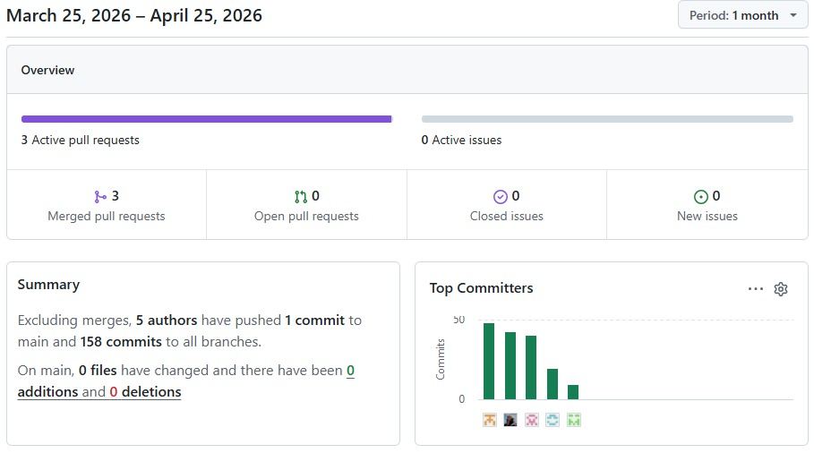
  
<em>Figura: Historial de commits del repositorio ClosedSource-LandingPage demostrando
  la participación activa de los miembros del equipo.</em>

El <strong>Network Graph</strong> de GitHub refleja que las contribuciones se realizaron
directamente sobre la rama <code>main</code>, siguiendo un flujo de integración continua
apropiado para el alcance del Sprint 1 (Landing Page estático). Esta estructura permitió
que todos los integrantes pudieran ver y revisar los cambios de sus compañeros en tiempo
real, facilitando la detección temprana de conflictos y la corrección coordinada de la
sección Our Team, que recibió tres commits de corrección consecutivos por parte de
diferentes miembros.

  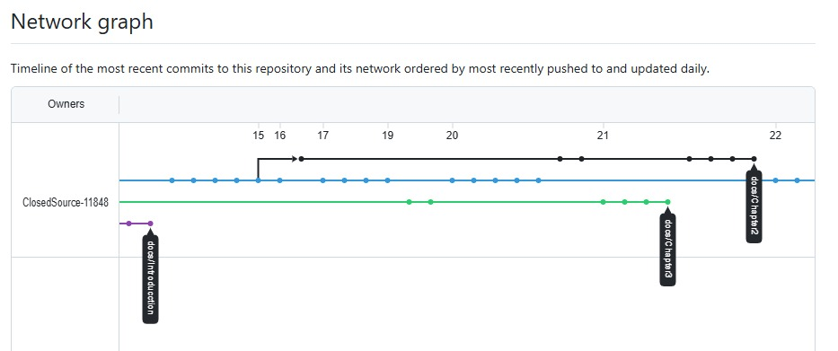
  
<em>Figura: Network Graph del repositorio ClosedSource-LandingPage mostrando el
  flujo de commits durante el Sprint 1.</em>

### 5.2.2. Sprint 2

Durante el Sprint 2, el equipo de ClosedSource se enfocó en el desarrollo e implementación
de la primera versión de la Frontend Web Application (SPA Angular) de QualiTrack. Este
sprint abarcó la construcción de los módulos correspondientes a los Bounded Contexts del
dominio farmacéutico: IAM, Laboratory Management, Equipment Management, Batch Management,
Compliance & Alerting, Tracking (IoT), Reporting & Audit y Shared. Se implementó la
arquitectura DDD con capas de dominio, infraestructura y presentación, soporte bilingüe
(ES/EN), consumo de APIs REST mediante JSON Server como fake API, y despliegue en Firebase
Hosting.

  <strong>Repositorio:</strong>
  <a href="https://github.com/ClosedSource-11848/ClosedSource-Frontend">https://github.com/ClosedSource-11848/ClosedSource-Frontend</a>

  <strong>Frontend Web Application Desplegada:</strong>
  <a href="https://closedsource-qualitrack.web.app">https://closedsource-qualitrack.web.app</a>

#### 5.2.2.1. Sprint Planning 2

<table border="1" cellpadding="4" cellspacing="0">
  <thead>
    <tr>
      <th colspan="2" style="text-align: center;">Sprint Planning Sprint 2</th>
    </tr>
  </thead>
  <tbody>
    <tr>
      <td colspan="2" style="text-align: center;"><strong>Sprint Planning Background</strong></td>
    </tr>
    <tr>
      <td>Date</td>
      <td>28/04/2026</td>
    </tr>
    <tr>
      <td>Time</td>
      <td>10:00 p.m.</td>
    </tr>
    <tr>
      <td>Location</td>
      <td>Discord</td>
    </tr>
    <tr>
      <td>Prepared By</td>
      <td>Ruiz Madrid, Billy Jake</td>
    </tr>
    <tr>
      <td>Attendees (to planning meeting)</td>
      <td>
        Ruiz Madrid, Billy Jake 
        Diaz Caruzo, Edgard Daniel 
        Viza Quispe, Marlon Packard 
        Castillo Yataco, Mauricio Sebastian 
        Angulo Ramírez, Marcelo Martín
      </td>
    </tr>
    <tr>
      <td colspan="2" style="text-align: center;"><strong>Sprint 1 Review Summary</strong></td>
    </tr>
    <tr>
      <td colspan="2">
        Se completó exitosamente el desarrollo y despliegue del Landing Page de QualiTrack
        en GitHub Pages, incluyendo todas las secciones planificadas (Hero, Features,
        Benefits, Plans, About Us, Team, Contact), soporte bilingüe (ES/EN), documentos
        legales (Terms of Service y Privacy Policy) y correcciones de estructura tras
        revisión de pares. Se identificó la necesidad de mejorar la coordinación en la
        asignación de tareas para evitar commits redundantes sobre la misma sección.
      </td>
    </tr>
    <tr>
      <td colspan="2" style="text-align: center;"><strong>Sprint 1 Retrospective Summary</strong></td>
    </tr>
    <tr>
      <td colspan="2">
        El equipo reconoció que la concentración de commits de corrección sobre la sección
        Our Team evidenció la necesidad de aplicar GitFlow con feature branches desde el
        inicio. Se acordó implementar ramas feature/ por Bounded Context para el Sprint 2
        y realizar revisiones de código antes de cada merge a develop.
      </td>
    </tr>
    <tr>
      <td colspan="2" style="text-align: center;"><strong>Sprint Goal & User Stories</strong></td>
    </tr>
    <tr>
      <td colspan="2">
        <strong>Sprint 2 Goal (Outcome–Impact–Customer–Confirmation):</strong>  
        <em>Our focus is on delivering the first functional version of the QualiTrack
        Frontend Web Application, implementing the core Bounded Contexts (IAM, Laboratory
        Management, Equipment Management, Batch Management, Compliance & Alerting,
        Tracking and Reporting & Audit) with Angular, consuming a fake API via JSON Server
        and deploying to Firebase Hosting.</em>  
        <em>We believe it delivers a tangible, navigable first impression of the
        pharmaceutical quality management platform to QA Managers and Lab Operators,
        allowing them to explore the dashboard, manage laboratory data, monitor equipment
        and review compliance alerts from a unified interface.</em>  
        <em>This will be confirmed when users can authenticate (sign-in/sign-up), navigate
        through all Bounded Context modules via the sidebar, perform CRUD operations on
        laboratory entities (products, raw materials, staff), view equipment details with
        BPM parameters, consult batch records, review compliance alerts and access KPI
        dashboards, all connected to the fake API and deployed on Firebase.</em>
      </td>
    </tr>
    <tr>
      <td>Sprint 2 Velocity</td>
      <td>32 Story Points</td>
    </tr>
    <tr>
      <td>Sum of Story Points</td>
      <td>32 SP</td>
    </tr>
  </tbody>
</table>

#### 5.2.2.2. Aspect Leaders and Collaborators

En esta sección se presenta la matriz <strong>Leadership-and-Collaboration (LACX)</strong>
correspondiente al Sprint 2. Su propósito es identificar claramente los aspectos
principales del sprint y asignar responsabilidades de liderazgo (<strong>L</strong>) y
colaboración (<strong>C</strong>) para fortalecer la coordinación y trazabilidad del
trabajo dentro del equipo ClosedSource.

Los aspectos se derivan directamente de los objetivos del Sprint 2 Goal:

<ul>
  <li><strong>Shared & IAM:</strong> Componentes base reutilizables (layout, toolbar,
  footer, language switcher, API gateway), módulo de autenticación (sign-in, sign-up)
  e internacionalización (i18n).</li>
  <li><strong>Domain Modules (Laboratory, Equipment, Batch):</strong> Implementación de
  las capas de dominio, infraestructura y presentación para los Bounded Contexts de
  gestión de laboratorio, equipos y lotes.</li>
  <li><strong>Domain Modules (CA, Tracking, RA) & Deployment:</strong> Implementación de
  los módulos de Compliance & Alerting, Tracking IoT y Reporting & Audit, configuración
  de JSON Server como fake API y despliegue en Firebase Hosting.</li>
</ul>

<table border="1" cellpadding="4" cellspacing="0" align="center">
  <thead>
    <tr>
      <th>Team Member (Last Name, First Name)</th>
      <th>Aspect: Shared & IAM</th>
      <th>Aspect: Laboratory, Equipment & Batch</th>
      <th>Aspect: CA, Tracking, RA & Deployment</th>
    </tr>
  </thead>
  <tbody>
    <tr>
      <td>Ruiz Madrid, Billy Jake</td>
      <td>L</td><td>L</td><td>L</td>
    </tr>
    <tr>
      <td>Diaz Caruzo, Edgard Daniel</td>
      <td>C</td><td>L</td><td>C</td>
    </tr>
    <tr>
      <td>Viza Quispe, Marlon Packard</td>
      <td>C</td><td>C</td><td>C</td>
    </tr>
    <tr>
      <td>Castillo Yataco, Mauricio Sebastian</td>
      <td>C</td><td>C</td><td>C</td>
    </tr>
    <tr>
      <td>Angulo Ramírez, Marcelo Martín</td>
      <td>C</td><td>C</td><td>L</td>
    </tr>
  </tbody>
</table>

<ul>
  <li><strong>L</strong> = Líder del aspecto</li>
  <li><strong>C</strong> = Colaborador en el aspecto</li>
</ul>

#### 5.2.2.3. Sprint Backlog 2

El Sprint Backlog 2 reúne las historias de usuario y tareas necesarias para implementar
la primera versión de la Frontend Web Application de QualiTrack, organizada por Bounded
Contexts. Todas las tareas son monitoreadas mediante <strong>Jira Software</strong>.

  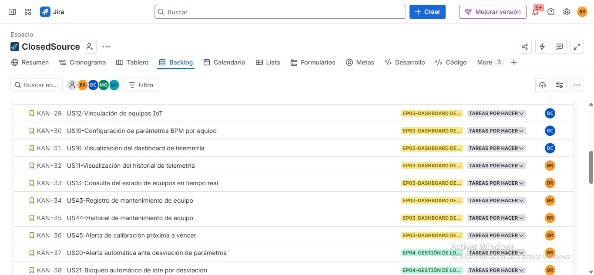
  
<em>Figura: Tablero del Sprint 2 en Jira Software (Proyecto QualiTrack)</em>

<table border="1" cellpadding="4" cellspacing="0">
  <thead>
    <tr>
      <th colspan="8" style="text-align:center;">Sprint # 2</th>
    </tr>
    <tr>
      <th colspan="2">User Story</th>
      <th colspan="6">Work-Item / Task</th>
    </tr>
    <tr>
      <th>Id</th>
      <th>Title</th>
      <th>Id</th>
      <th>Title</th>
      <th>Description</th>
      <th>Estimation (Hours)</th>
      <th>Assigned To</th>
      <th>Status</th>
    </tr>
  </thead>
  <tbody>
    <!-- Shared -->
    <tr>
      <td rowspan="3">US06</td>
      <td rowspan="3">Componentes base y layout principal</td>
      <td>T012</td>
      <td>Implementar layout, toolbar y footer</td>
      <td>Desarrollar el componente de layout principal con navigation toolbar, sidebar colapsable y footer con créditos de tecnología.</td>
      <td>4h</td>
      <td>Ruiz Madrid, Billy</td>
      <td>Done</td>
    </tr>
    <tr>
      <td>T013</td>
      <td>Implementar language switcher e i18n</td>
      <td>Desarrollar el componente de cambio de idioma (ES/EN) y configurar archivos de localización para todas las vistas.</td>
      <td>3h</td>
      <td>Ruiz Madrid, Billy</td>
      <td>Done</td>
    </tr>
    <tr>
      <td>T014</td>
      <td>Implementar clases base de API gateway</td>
      <td>Crear las clases abstractas BaseService y BaseEndpoint con manejo de errores para consumo de la fake API.</td>
      <td>2h</td>
      <td>Ruiz Madrid, Billy</td>
      <td>Done</td>
    </tr>
    <!-- IAM -->
    <tr>
      <td rowspan="2">US07</td>
      <td rowspan="2">Autenticación de usuario</td>
      <td>T015</td>
      <td>Implementar vistas sign-in y sign-up</td>
      <td>Desarrollar los formularios de inicio de sesión y registro con validación, entidad User y comandos de autenticación.</td>
      <td>4h</td>
      <td>Ruiz Madrid, Billy</td>
      <td>Done</td>
    </tr>
    <tr>
      <td>T016</td>
      <td>Implementar IAM store y API services</td>
      <td>Desarrollar el store de autenticación, endpoints, assemblers y gestión de estado para el módulo IAM.</td>
      <td>3h</td>
      <td>Ruiz Madrid, Billy</td>
      <td>Done</td>
    </tr>
    <!-- Laboratory -->
    <tr>
      <td rowspan="3">US08</td>
      <td rowspan="3">Gestión del perfil del laboratorio</td>
      <td>T017</td>
      <td>Implementar entidades y comandos de Laboratory</td>
      <td>Crear entidades de dominio (Laboratory, Product, RawMaterial, Staff) y comandos para el bounded context Laboratory Management.</td>
      <td>3h</td>
      <td>Ruiz Madrid, Billy</td>
      <td>Done</td>
    </tr>
    <tr>
      <td>T018</td>
      <td>Implementar API services y store de Laboratory</td>
      <td>Desarrollar endpoints, assemblers, request/response contracts y store con gestión de estado para laboratorio, productos, materias primas y personal.</td>
      <td>4h</td>
      <td>Viza, Marlon</td>
      <td>Done</td>
    </tr>
    <tr>
      <td>T019</td>
      <td>Implementar vistas de Laboratory</td>
      <td>Desarrollar las vistas de perfil de laboratorio, catálogo de productos, formularios de productos, lista de materias primas y gestión de personal.</td>
      <td>5h</td>
      <td>Ruiz Madrid, Billy</td>
      <td>Done</td>
    </tr>
    <!-- Equipment -->
    <tr>
      <td rowspan="3">US09</td>
      <td rowspan="3">Gestión de equipos IoT</td>
      <td>T020</td>
      <td>Implementar entidades y comandos de Equipment</td>
      <td>Crear entidades de dominio para equipos, registros de mantenimiento y configuración de parámetros BPM.</td>
      <td>3h</td>
      <td>Diaz, Daniel</td>
      <td>Done</td>
    </tr>
    <tr>
      <td>T021</td>
      <td>Implementar API services y store de Equipment</td>
      <td>Desarrollar servicios API, data transformers para configuración BPM, ciclo de vida de mantenimiento, endpoints y assemblers.</td>
      <td>4h</td>
      <td>Diaz, Daniel</td>
      <td>Done</td>
    </tr>
    <tr>
      <td>T022</td>
      <td>Implementar vistas de Equipment</td>
      <td>Desarrollar las vistas de lista de equipos, vista detallada, formularios de registro, alertas de calibración e historial de mantenimiento.</td>
      <td>5h</td>
      <td>Ruiz Madrid, Billy</td>
      <td>Done</td>
    </tr>
    <!-- Batch -->
    <tr>
      <td rowspan="3">US10</td>
      <td rowspan="3">Gestión de lotes farmacéuticos</td>
      <td>T023</td>
      <td>Implementar entidades y comandos de Batch</td>
      <td>Crear entidades de dominio para lotes farmacéuticos, ciclo de vida del lote y uso de materias primas.</td>
      <td>3h</td>
      <td>Castillo, Mauricio</td>
      <td>Done</td>
    </tr>
    <tr>
      <td>T024</td>
      <td>Implementar API services y store de Batch</td>
      <td>Desarrollar servicios API, endpoints, assemblers, request/response contracts y store con estado basado en signals.</td>
      <td>4h</td>
      <td>Castillo, Mauricio</td>
      <td>Done</td>
    </tr>
    <tr>
      <td>T025</td>
      <td>Implementar vistas de Batch</td>
      <td>Desarrollar la tabla de lista de lotes y vista detallada de gestión de lotes con navegación y lazy loading.</td>
      <td>4h</td>
      <td>Ruiz Madrid, Billy</td>
      <td>Done</td>
    </tr>
    <!-- Compliance & Alerting -->
    <tr>
      <td rowspan="3">US11</td>
      <td rowspan="3">Dashboard de alertas y compliance</td>
      <td>T026</td>
      <td>Implementar entidades de CA</td>
      <td>Crear entidades para eventos de compliance, alertas de desviación y preferencias de notificación.</td>
      <td>3h</td>
      <td>Angulo, Marcelo</td>
      <td>Done</td>
    </tr>
    <tr>
      <td>T027</td>
      <td>Implementar API services y store de CA</td>
      <td>Desarrollar servicios API, endpoints, assemblers, response contracts y store con métodos para alertas y eventos de compliance.</td>
      <td>4h</td>
      <td>Angulo, Marcelo</td>
      <td>Done</td>
    </tr>
    <tr>
      <td>T028</td>
      <td>Implementar vistas de CA</td>
      <td>Desarrollar el dashboard de alertas y la vista de historial de compliance con routing y navegación.</td>
      <td>4h</td>
      <td>Ruiz Madrid, Billy</td>
      <td>Done</td>
    </tr>
    <!-- Tracking -->
    <tr>
      <td rowspan="2">US12</td>
      <td rowspan="2">Dashboard de telemetría IoT</td>
      <td>T029</td>
      <td>Implementar entidades, API y store de Tracking</td>
      <td>Crear entidades para telemetría, mediciones y estado de equipos, junto con servicios API, endpoints, assemblers y store.</td>
      <td>4h</td>
      <td>Ruiz Madrid, Billy</td>
      <td>Done</td>
    </tr>
    <tr>
      <td>T030</td>
      <td>Implementar dashboard de telemetría</td>
      <td>Desarrollar el dashboard de telemetría en tiempo real con tarjetas de estado de equipos y rutas del módulo tracking.</td>
      <td>4h</td>
      <td>Ruiz Madrid, Billy</td>
      <td>Done</td>
    </tr>
    <!-- Reporting & Audit -->
    <tr>
      <td rowspan="2">US13</td>
      <td rowspan="2">Reportes y auditoría</td>
      <td>T031</td>
      <td>Implementar entidades, API y store de RA</td>
      <td>Crear entidades para audit logs, KPIs y generación de reportes, junto con servicios API, endpoints, assemblers y store.</td>
      <td>4h</td>
      <td>Ruiz Madrid, Billy</td>
      <td>Done</td>
    </tr>
    <tr>
      <td>T032</td>
      <td>Implementar vistas de RA</td>
      <td>Desarrollar el dashboard de KPIs, gráfico de tendencias de desviación y generador de reportes con rutas del módulo.</td>
      <td>4h</td>
      <td>Ruiz Madrid, Billy</td>
      <td>Done</td>
    </tr>
    <!-- Configuración y Despliegue -->
    <tr>
      <td rowspan="2">—</td>
      <td rowspan="2">Configuración y despliegue</td>
      <td>T033</td>
      <td>Configurar JSON Server (fake API)</td>
      <td>Configurar JSON Server como mock backend con datos de prueba para todos los bounded contexts y scripts de inicio.</td>
      <td>3h</td>
      <td>Ruiz Madrid, Billy</td>
      <td>Done</td>
    </tr>
    <tr>
      <td>T034</td>
      <td>Configurar y desplegar en Firebase Hosting</td>
      <td>Configurar Firebase Hosting, build de producción Angular y despliegue de la Frontend Web Application.</td>
      <td>2h</td>
      <td>Ruiz Madrid, Billy</td>
      <td>Done</td>
    </tr>
  </tbody>
</table>

#### 5.2.2.4. Development Evidence for Sprint Review

En esta sección se explican y presentan los avances en la implementación logrados durante
el Sprint 2 en relación con la Frontend Web Application de QualiTrack. A lo largo de este
sprint se construyó la primera versión funcional de la SPA Angular, implementando todos los
Bounded Contexts del dominio farmacéutico con arquitectura DDD (entidades, comandos,
servicios API, stores y vistas), soporte bilingüe, consumo de fake API mediante JSON Server
y despliegue en Firebase Hosting.

La tabla siguiente resume los commits más relevantes realizados en el repositorio del
Frontend, indicando la rama, el identificador del commit, el mensaje asociado, una breve
descripción del cambio introducido y la fecha de commit.

<table border="1" cellpadding="4" cellspacing="0">
  <thead>
    <tr>
      <th>Repository</th>
      <th>Branch</th>
      <th>Commit Id</th>
      <th>Commit Message</th>
      <th>Commit Message Body</th>
      <th>Committed on (Date)</th>
    </tr>
  </thead>
  <tbody>
    <tr>
      <td rowspan="20">
        <a href="https://github.com/ClosedSource-11848/ClosedSource-Frontend">
          ClosedSource-Frontend
        </a>
      </td>
      <td>feature/shared</td>
      <td>7f3a91b</td>
      <td>feat(shared): add layout, home view, footer and toolbar components.</td>
      <td>Implementa el componente de layout principal con navigation toolbar, sidebar, home view y footer con créditos de tecnología.</td>
      <td>30-04-2026</td>
    </tr>
    <tr>
      <td>feature/shared</td>
      <td>a5c92ef</td>
      <td>feat(api): add abstract base classes for api gateway and endpoints with error handling.</td>
      <td>Crea las clases abstractas BaseService y BaseEndpoint para el consumo estandarizado de la fake API con manejo de errores centralizado.</td>
      <td>30-04-2026</td>
    </tr>
    <tr>
      <td>feature/laboratory</td>
      <td>61ef8cb</td>
      <td>feat(laboratory): add entities and commands for laboratory, products, raw materials and staff.</td>
      <td>Crea las entidades de dominio y comandos para el bounded context Laboratory Management.</td>
      <td>02-05-2026</td>
    </tr>
    <tr>
      <td>feature/laboratory</td>
      <td>98d2c1e</td>
      <td>feat(laboratory): add views for lab profile, product catalog, raw materials and staff management.</td>
      <td>Implementa las vistas de perfil de laboratorio, catálogo de productos, gestión de materias primas y personal.</td>
      <td>02-05-2026</td>
    </tr>
    <tr>
      <td>feature/equipment</td>
      <td>e91bc8f</td>
      <td>feat(equipment): add entities and commands for equipment, maintenance and bpm configuration.</td>
      <td>Crea las entidades de dominio para equipos IoT, registros de mantenimiento y configuración de parámetros BPM.</td>
      <td>03-05-2026</td>
    </tr>
    <tr>
      <td>feature/equipment</td>
      <td>91de5c7</td>
      <td>feat(equipment): add equipment list, form and detail views.</td>
      <td>Desarrolla las vistas de listado de equipos, formulario de registro y vista detallada con información de BPM.</td>
      <td>03-05-2026</td>
    </tr>
    <tr>
      <td>feature/batch</td>
      <td>7abf22d</td>
      <td>feat(batch): add entities and commands for batch lifecycle and raw material usage.</td>
      <td>Crea entidades de dominio para el ciclo de vida de lotes farmacéuticos y uso de materias primas.</td>
      <td>04-05-2026</td>
    </tr>
    <tr>
      <td>feature/batch</td>
      <td>c82ab67</td>
      <td>feat(batch): add batch list, detail and form views.</td>
      <td>Implementa las vistas de lista de lotes, vista detallada y formulario de gestión de lotes.</td>
      <td>04-05-2026</td>
    </tr>
    <tr>
      <td>feature/ca</td>
      <td>52df1ab</td>
      <td>feat(ca): add entities and commands for compliance events, alerts and notification preferences.</td>
      <td>Crea entidades para eventos de compliance, alertas de desviación y preferencias de notificación del módulo CA.</td>
      <td>04-05-2026</td>
    </tr>
    <tr>
      <td>feature/ca</td>
      <td>84ce2fa</td>
      <td>feat(ca): add alert dashboard and history views.</td>
      <td>Desarrolla el dashboard de alertas de desviación y la vista de historial de compliance.</td>
      <td>04-05-2026</td>
    </tr>
    <tr>
      <td>feature/ra</td>
      <td>fa28bc7</td>
      <td>feat(ra): add entities and commands for audit logs, KPIs and report generation.</td>
      <td>Crea entidades de dominio para logs de auditoría, indicadores clave de rendimiento y generación de reportes.</td>
      <td>05-05-2026</td>
    </tr>
    <tr>
      <td>feature/ra</td>
      <td>1cd82fa</td>
      <td>feat(ra): add deviation trend chart view.</td>
      <td>Implementa la vista de gráfico de tendencias de desviación para el módulo de Reporting & Audit.</td>
      <td>05-05-2026</td>
    </tr>
    <tr>
      <td>feature/tracking</td>
      <td>4fd91ac</td>
      <td>feat(tracking): add entities for telemetry, measurements and equipment status.</td>
      <td>Crea entidades de dominio para telemetría IoT, mediciones en tiempo real y estado de equipos.</td>
      <td>08-05-2026</td>
    </tr>
    <tr>
      <td>feature/tracking</td>
      <td>58fd3a2</td>
      <td>feat(tracking): add telemetry dashboard and equipment status card.</td>
      <td>Desarrolla el dashboard de telemetría en tiempo real con tarjetas de estado de equipos IoT.</td>
      <td>08-05-2026</td>
    </tr>
    <tr>
      <td>develop</td>
      <td>d82bc17</td>
      <td>chore(mockapi): add mock api configuration and startup scripts.</td>
      <td>Configura JSON Server como fake API con datos de prueba para todos los bounded contexts y scripts de inicio.</td>
      <td>11-05-2026</td>
    </tr>
    <tr>
      <td>feature/equipment</td>
      <td>7ce11af</td>
      <td>feat(equipment): add equipment list, detailed view and registration forms.</td>
      <td>Actualiza las vistas de equipos con mejoras en la lista, vista detallada y formularios de registro (aporte de Dan-trax).</td>
      <td>12-05-2026</td>
    </tr>
    <tr>
      <td>feature/batch</td>
      <td>2ab77fd</td>
      <td>feat(batch): add batch list table and detailed management view.</td>
      <td>Actualiza la tabla de lista de lotes y la vista de gestión detallada de lotes (aporte de M4uricioCastillo).</td>
      <td>12-05-2026</td>
    </tr>
    <tr>
      <td>feature/laboratory</td>
      <td>91fa2bc</td>
      <td>feat(laboratory): add laboratory store management.</td>
      <td>Implementa la gestión de estado del store de laboratorio con señales reactivas (aporte de BJRM03).</td>
      <td>13-05-2026</td>
    </tr>
    <tr>
      <td>feature/iam</td>
      <td>4bc28e1</td>
      <td>feat(iam): add sign-in and sign-up views.</td>
      <td>Implementa los formularios de autenticación (sign-in y sign-up) con validación de campos y navegación entre vistas.</td>
      <td>13-05-2026</td>
    </tr>
    <tr>
      <td>feature/iam</td>
      <td>b2d91fa</td>
      <td>feat(iam): add api services, endpoints and mappers for iam.</td>
      <td>Desarrolla los servicios API, endpoints REST y mappers de datos para el módulo de Identity and Access Management.</td>
      <td>13-05-2026</td>
    </tr>
  </tbody>
</table>

#### 5.2.2.5. Execution Evidence for Sprint Review

Durante el Sprint 2, se completó exitosamente la implementación de la primera versión de
la Frontend Web Application de QualiTrack con todos los Bounded Contexts del dominio
farmacéutico, soporte bilingüe (ES/EN), consumo de fake API y despliegue en Firebase
Hosting. A continuación se presentan evidencias de ejecución mediante capturas de pantalla
de las principales vistas de la aplicación web.

<strong>Home:</strong>

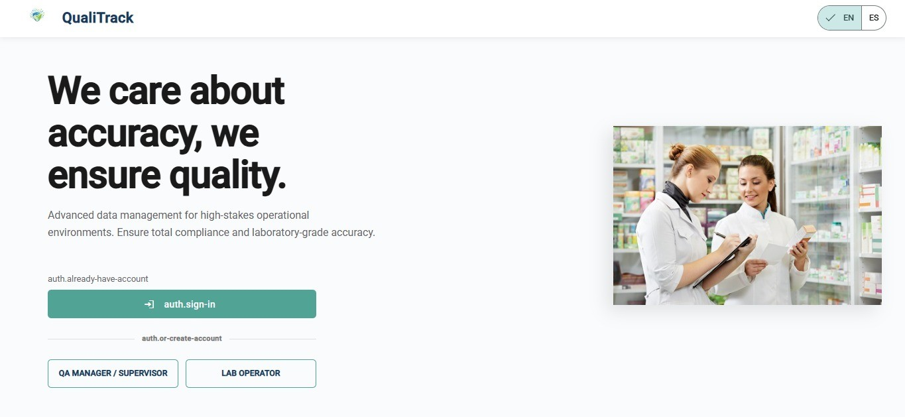

<strong>Pantalla de Sign-In:</strong>

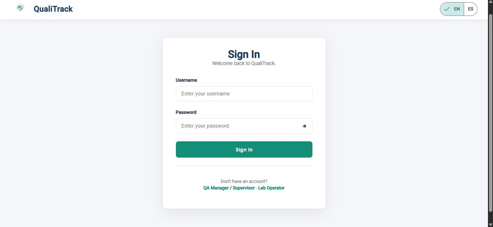

<strong>Pantalla de Sign-Up:</strong>

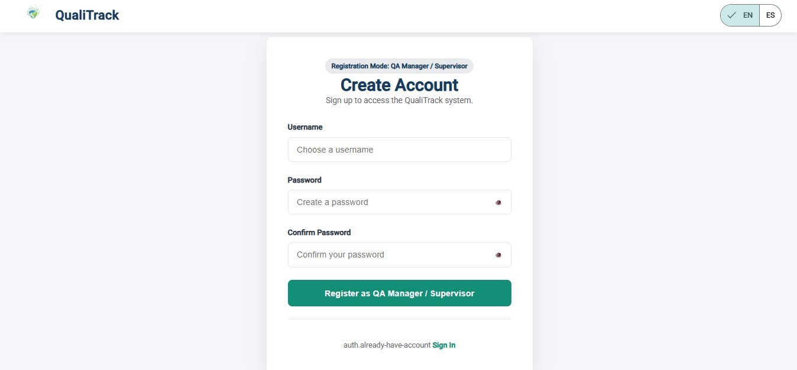

<strong>Módulo Laboratory - Perfil del laboratorio:</strong>

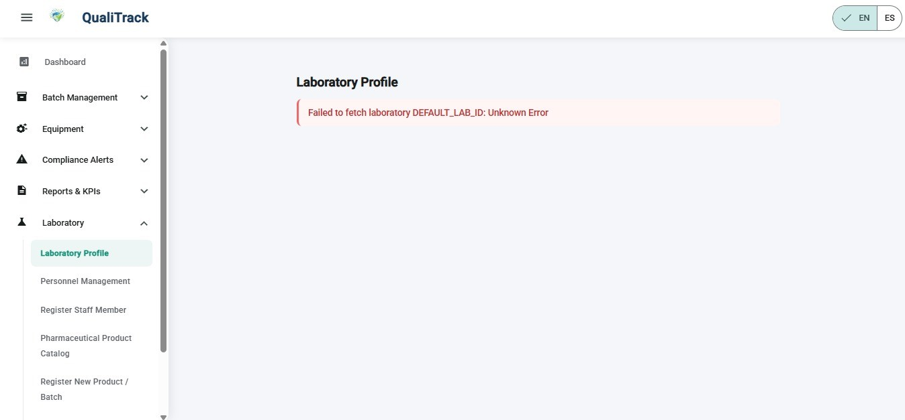

<strong>Módulo Laboratory - Catálogo de productos:</strong>

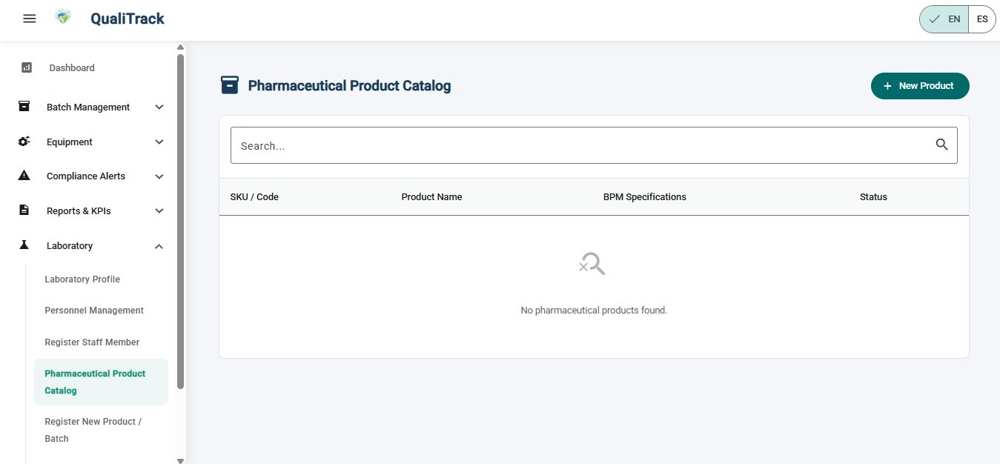

<strong>Módulo Equipment - Lista de equipos:</strong>

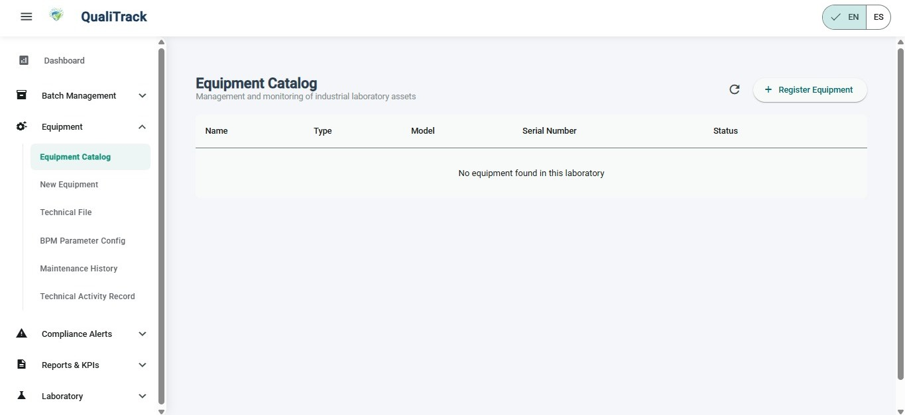

<strong>Módulo Equipment - Detalle de equipo:</strong>

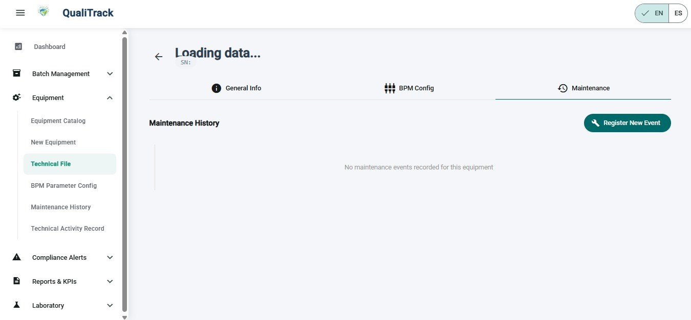

<strong>Módulo Batch - Lista de lotes:</strong>

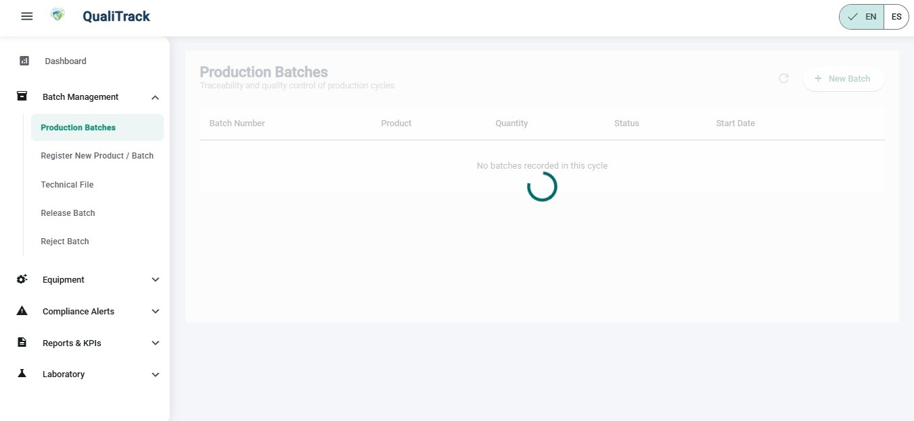

<strong>Módulo Compliance & Alerting - Dashboard de alertas:</strong>

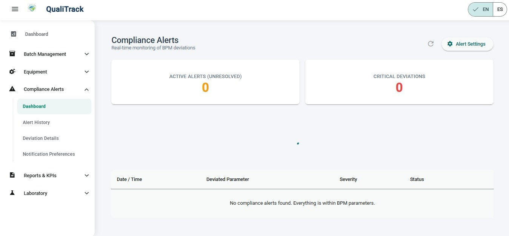

<strong>Módulo Tracking - Dashboard de telemetría:</strong>

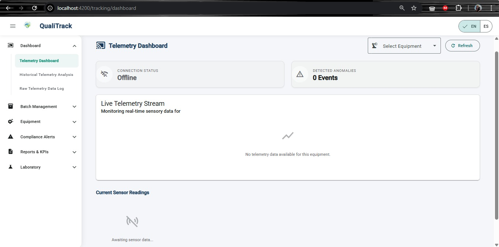

<strong>Módulo Reporting & Audit - KPI Dashboard:</strong>

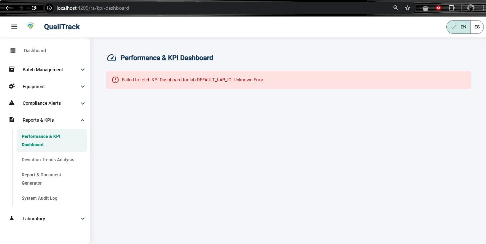

#### 5.2.2.6. Services Documentation Evidence for Sprint Review

En el Sprint 2, el equipo implementó la Frontend Web Application de QualiTrack conectada a
una fake API alojada en la nube mediante <strong>Beeceptor</strong>. Se configuraron diversas reglas de simulación (mock rules) que
replican la estructura de los Web Services RESTful planificados para el Backend, permitiendo probar la reactividad del Dashboard en tiempo real. La
implementación y documentación de los Web Services reales con Spring Boot y Swagger se
abordará en los sprints posteriores orientados al Backend.

<table border="1" cellpadding="4" cellspacing="0">
  <thead>
    <tr>
      <th>End Point Base (Beeceptor)</th>
      <th>Método HTTP</th>
      <th>Acción Implementada (Funciones)</th>
      <th>Sintaxis de Llamada (Ejemplo)</th>
      <th>Explicación del Response</th>
    </tr>
  </thead>
  <tbody>
    <tr>
      <td rowspan="3"><strong>/laboratories</strong></td>
      <td><strong>GET</strong></td>
      <td>Obtener listado de laboratorios.</td>
      <td><code>GET /laboratories</code></td>
      <td><code>200 OK</code>: Array JSON de objetos Laboratory.</td>
    </tr>
    <tr>
      <td><strong>GET</strong></td>
      <td>Obtener laboratorio por ID.</td>
      <td><code>GET /laboratories/{id}</code></td>
      <td><code>200 OK</code>: Objeto Laboratory. <code>404</code> si no existe.</td>
    </tr>
    <tr>
      <td><strong>POST</strong></td>
      <td>Crear un nuevo laboratorio.</td>
      <td><code>POST /laboratories</code></td>
      <td><code>201 Created</code>: Objeto Laboratory creado con ID asignado.</td>
    </tr>
    <tr>
      <td rowspan="2"><strong>/products</strong></td>
      <td><strong>GET</strong></td>
      <td>Obtener catálogo de productos farmacéuticos.</td>
      <td><code>GET /products</code></td>
      <td><code>200 OK</code>: Array JSON de objetos Product.</td>
    </tr>
    <tr>
      <td><strong>POST</strong></td>
      <td>Registrar un nuevo producto.</td>
      <td><code>POST /products</code></td>
      <td><code>201 Created</code>: Objeto Product creado.</td>
    </tr>
    <tr>
      <td rowspan="2"><strong>/equipment</strong></td>
      <td><strong>GET</strong></td>
      <td>Obtener listado de equipos IoT.</td>
      <td><code>GET /equipment</code></td>
      <td><code>200 OK</code>: Array JSON de objetos Equipment.</td>
    </tr>
    <tr>
      <td><strong>POST</strong></td>
      <td>Registrar nuevo equipo con parámetros BPM.</td>
      <td><code>POST /equipment</code></td>
      <td><code>201 Created</code>: Objeto Equipment creado.</td>
    </tr>
    <tr>
      <td rowspan="2"><strong>/batches</strong></td>
      <td><strong>GET</strong></td>
      <td>Obtener listado de lotes farmacéuticos.</td>
      <td><code>GET /batches</code></td>
      <td><code>200 OK</code>: Array JSON de objetos Batch.</td>
    </tr>
    <tr>
      <td><strong>POST</strong></td>
      <td>Crear un nuevo lote farmacéutico.</td>
      <td><code>POST /batches</code></td>
      <td><code>201 Created</code>: Objeto Batch creado.</td>
    </tr>
    <tr>
      <td><strong>/alerts</strong></td>
      <td><strong>GET</strong></td>
      <td>Obtener alertas de desviación BPM.</td>
      <td><code>GET /alerts</code></td>
      <td><code>200 OK</code>: Array JSON de objetos DeviationAlert.</td>
    </tr>
    <tr>
      <td rowspan="3"><strong>/telemetry</strong> <em>(Endpoints de Monitoreo)</em></td>
      <td><strong>GET</strong></td>
      <td>Obtener lecturas actuales de los sensores (Mediciones).</td>
      <td><code>GET /measurements</code></td>
      <td><code>200 OK</code>: JSON envuelto en la propiedad <code>measurements</code> con array de objetos MeasurementResource.</td>
    </tr>
    <tr>
      <td><strong>GET</strong></td>
      <td>Obtener historial de telemetría y detección de anomalías.</td>
      <td><code>GET /history?equipmentId=EQ-001</code></td>
      <td><code>200 OK</code>: JSON envuelto en <code>historyPoints</code> con array de puntos para el gráfico.</td>
    </tr>
    <tr>
      <td><strong>GET</strong></td>
      <td>Obtener estado actual de conexión del equipo (Online/Offline).</td>
      <td><code>GET /status/{equipmentId}</code></td>
      <td><code>200 OK</code>: Objeto JSON único con el estado operativo y último heartbeat del equipo.</td>
    </tr>
    <tr>
      <td><strong>/kpi-dashboards</strong></td>
      <td><strong>GET</strong></td>
      <td>Obtener indicadores clave de rendimiento.</td>
      <td><code>GET /kpi-dashboards</code></td>
      <td><code>200 OK</code>: Array JSON de objetos KpiDashboard.</td>
    </tr>
  </tbody>
</table>

#### 5.2.2.7. Software Deployment Evidence for Sprint Review

La Frontend Web Application de QualiTrack fue desplegada exitosamente en
<strong>Firebase Hosting</strong> desde la rama <code>develop</code> del repositorio
<code>ClosedSource-Frontend</code>. El proceso de despliegue se realizó siguiendo los
siguientes pasos:

<strong>Pasos de configuración:</strong>

<ol>
  <li>Instalar Firebase CLI globalmente: <code>npm install -g firebase-tools</code>.</li>
  <li>Autenticarse con Firebase: <code>firebase login</code>.</li>
  <li>Inicializar el proyecto: <code>firebase init hosting</code>, seleccionando el
  directorio de output <code>dist/qualitrack-frontend</code>.</li>
  <li>Compilar el proyecto Angular para producción:
  <code>ng build --configuration production</code>.</li>
  <li>Desplegar: <code>firebase deploy --only hosting</code>.</li>
  <li>Verificar el despliegue accediendo a la URL generada.</li>
</ol>

  <strong>URL de Producción:</strong>
  <a href="https://closedsource-qualitrack.web.app">https://closedsource-qualitrack.web.app</a>

  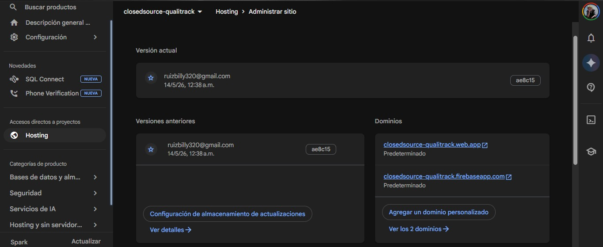
  
<em>Figura: Configuración de Firebase Hosting para el despliegue de la Frontend Web
  Application de QualiTrack.</em>

#### 5.2.2.8. Team Collaboration Insights during Sprint

Durante el Sprint 2, el esfuerzo principal del equipo de ClosedSource se centró en la
implementación de la Frontend Web Application, trabajando en paralelo sobre los diferentes
Bounded Contexts del dominio farmacéutico. A diferencia del Sprint 1, se aplicó
correctamente GitFlow con feature branches por módulo
(<code>feature/shared</code>, <code>feature/iam</code>, <code>feature/laboratory</code>,
<code>feature/equipment</code>, <code>feature/batch</code>, <code>feature/ca</code>,
<code>feature/tracking</code>, <code>feature/ra</code>), lo que permitió desarrollo
paralelo y merges controlados.

El <strong>Historial de Commits</strong> del repositorio
<code>ClosedSource-Frontend</code> demuestra que el trabajo fue distribuido entre los
5 integrantes del equipo. Se observa la participación de los usuarios
<strong>BJRM03</strong> (Ruiz Madrid, Billy), <strong>Dan-trax</strong> (Diaz, Daniel),
<strong>M4uricioCastillo</strong> (Castillo, Mauricio), <strong>V8Z5</strong>
(Viza, Marlon) y <strong>Zock2005</strong> (Angulo, Marcelo), realizando commits
orientados a la implementación de entidades de dominio, servicios API, stores de
gestión de estado y componentes de presentación para cada Bounded Context.

  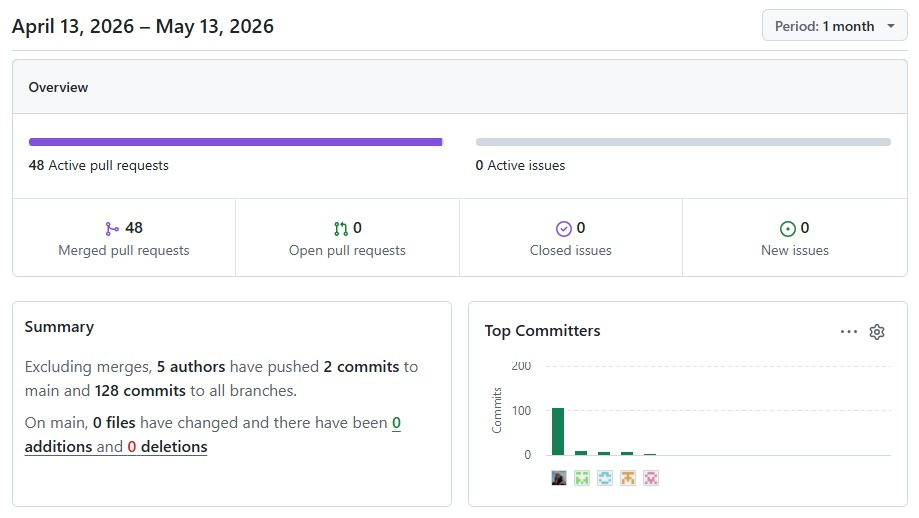
  
<em>Figura: Historial de commits del repositorio ClosedSource-Frontend demostrando
  la participación activa de los miembros del equipo durante el Sprint 2.</em>

El <strong>Network Graph</strong> de GitHub refleja el uso efectivo de GitFlow con
múltiples feature branches creadas a partir de develop para cada Bounded Context. Se
observan ciclos de creación de ramas, desarrollo de funcionalidades (entidades, servicios
API, stores y vistas) y merges controlados tras revisiones de código, confirmando que las
contribuciones individuales se alinearon con el marco de trabajo acordado en la
retrospectiva del Sprint 1. Esta estructura de ramas permitió que los módulos de Equipment
(Dan-trax), Batch (M4uricioCastillo), Compliance & Alerting (Zock2005) y Laboratory (V8Z5)
se desarrollaran en paralelo sin conflictos, mientras BJRM03 coordinaba la integración
general, el layout compartido y las correcciones transversales.

  
  
<em>Figura: Network Graph del repositorio ClosedSource-Frontend mostrando el
  flujo de feature branches y merges durante el Sprint 2.</em>

### 5.2.3. Sprint 3

Durante el Sprint 3, el equipo de ClosedSource se enfocó en consolidar la versión integrada de QualiTrack. A diferencia del Sprint 2, donde se desarrolló principalmente la Frontend Web Application con consumo de datos simulados, este sprint priorizó la implementación del Backend con Spring Boot, la conexión real entre Frontend y Backend, la autenticación con JWT, la persistencia en base de datos, la integración de pagos con Stripe y el despliegue de los servicios principales en la nube.

El trabajo realizado permitió que QualiTrack cuente con una arquitectura funcional distribuida en Bounded Contexts, incluyendo IAM, Laboratory Management, Equipment Management, Batch Management, Compliance & Alerting, Tracking & Telemetry, Reporting & Audit y Subscription & Billing. Asimismo, se habilitó la documentación de servicios mediante Swagger/OpenAPI, permitiendo validar los endpoints REST implementados durante el Sprint Review.

  <strong>Repositorio Backend:</strong>
  <a href="https://github.com/ClosedSource-11848/qualitrack-platform">
    https://github.com/ClosedSource-11848/qualitrack-platform
  </a>

  <strong>Frontend Web Application Desplegada:</strong>
  <a href="https://closedsource-qualitrack.web.app/home">
    https://closedsource-qualitrack.web.app/home
  </a>

  <strong>Backend API Desplegada:</strong>
  <a href="https://qualitrack-platform.onrender.com/swagger-ui/index.html">
    https://qualitrack-platform.onrender.com/swagger-ui/index.html
  </a>

  <strong>Base de Datos Desplegada:</strong> Railway

#### 5.2.3.1. Sprint Planning 3

<table border="1" cellpadding="4" cellspacing="0">
  <thead>
    <tr>
      <th colspan="2" style="text-align: center;">Sprint Planning Sprint 3</th>
    </tr>
  </thead>
  <tbody>
    <tr>
      <td colspan="2" style="text-align: center;"><strong>Sprint Planning Background</strong></td>
    </tr>
    <tr>
      <td>Date</td>
      <td>09/06/2026</td>
    </tr>
    <tr>
      <td>Time</td>
      <td>10:00 p.m.</td>
    </tr>
    <tr>
      <td>Location</td>
      <td>Discord</td>
    </tr>
    <tr>
      <td>Prepared By</td>
      <td>Ruiz Madrid, Billy Jake</td>
    </tr>
    <tr>
      <td>Attendees (to planning meeting)</td>
      <td>
        Ruiz Madrid, Billy Jake 
        Becerra Ttito, Felix Orlando 
        Diaz Caruzo, Edgard Daniel 
        Viza Quispe, Marlon Packard 
        Castillo Yataco, Mauricio Sebastian 
        Angulo Ramírez, Marcelo Martín
      </td>
    </tr>
    <tr>
      <td colspan="2" style="text-align: center;"><strong>Sprint 2 Review Summary</strong></td>
    </tr>
    <tr>
      <td colspan="2">
        Se completó la primera versión funcional de la Frontend Web Application en Angular,
        incluyendo los Bounded Contexts principales, la estructura DDD en el frontend,
        componentes visuales, stores reactivos, vistas de gestión y despliegue en Firebase
        Hosting. Sin embargo, varios flujos todavía dependían de datos simulados o endpoints
        no implementados en el backend, por lo que se definió como prioridad completar la
        integración real con servicios REST.
      </td>
    </tr>
    <tr>
      <td colspan="2" style="text-align: center;"><strong>Sprint 2 Retrospective Summary</strong></td>
    </tr>
    <tr>
      <td colspan="2">
        El equipo identificó que el frontend había avanzado más rápido que el backend, lo que
        generaba errores de integración, respuestas incompletas y flujos que aún no persistían
        información real. Como acción de mejora, se acordó enfocar el Sprint 3 en implementar
        los Bounded Contexts faltantes del backend, proteger endpoints con IAM/JWT, documentar
        los servicios con Swagger y desplegar la solución en entornos cloud.
      </td>
    </tr>
    <tr>
      <td colspan="2" style="text-align: center;"><strong>Sprint Goal & User Stories</strong></td>
    </tr>
    <tr>
      <td colspan="2">
        <strong>Sprint 3 Goal (Outcome–Impact–Customer–Confirmation):</strong>  
        <em>Our focus is on delivering an integrated and deployed version of QualiTrack where authenticated laboratory users can manage core quality assurance operations through an Angular frontend connected to a Spring Boot backend.</em>  
        <em>We believe it delivers a more realistic and reliable experience to QA Managers, Laboratory Operators and regulated pharmaceutical laboratories, allowing them to manage laboratories, equipment, production batches, compliance alerts, telemetry, audit reports and subscriptions using persistent data and secure access.</em>  
        <em>This will be confirmed when the Firebase frontend consumes the Render backend, the backend persists information in Railway, Swagger exposes the implemented REST endpoints, Stripe checkout can be tested, and the main business flows can be demonstrated during the Sprint Review.</em>
      </td>
    </tr>
    <tr>
      <td>Sprint 3 Velocity</td>
      <td>45 Story Points</td>
    </tr>
    <tr>
      <td>Sum of Story Points</td>
      <td>45 SP</td>
    </tr>
  </tbody>
</table>

#### 5.2.3.2. Aspect Leaders and Collaborators

En esta sección se presenta la matriz <strong>Leadership-and-Collaboration (LACX)</strong>
correspondiente al Sprint 3. Su propósito es identificar los principales aspectos técnicos
abordados durante el sprint y asignar responsabilidades de liderazgo (<strong>L</strong>) y
colaboración (<strong>C</strong>) según la evidencia de trabajo registrada en el repositorio
Backend.

Los aspectos se derivan directamente de los objetivos del Sprint 3 Goal:

<ul>
  <li><strong>Backend Bounded Contexts:</strong> Implementación de los módulos backend para CA, RA, Tracking, Subscription e IAM, junto con correcciones de Laboratory, Equipment y Batch.</li>
  <li><strong>Frontend Integration & Authentication:</strong> Ajuste del frontend para consumir endpoints reales, envío de JWT mediante interceptor y alineación de IAM con el backend.</li>
  <li><strong>Deployment, Payments & Documentation:</strong> Despliegue del backend en Render, frontend en Firebase, base de datos en Railway, configuración de Stripe y actualización de Swagger/diagramas.</li>
</ul>

<table border="1" cellpadding="4" cellspacing="0" align="center">
  <thead>
    <tr>
      <th>GitHub User / Author</th>
      <th>Backend Bounded Contexts</th>
      <th>Frontend Integration & Authentication</th>
      <th>Deployment, Payments & Documentation</th>
    </tr>
  </thead>
  <tbody>
    <tr>
      <td>BJRM03</td>
      <td>L</td>
      <td>L</td>
      <td>L</td>
    </tr>
    <tr>
      <td>Felixb14</td>
      <td>L</td>
      <td>C</td>
      <td>L</td>
    </tr>
    <tr>
      <td>Dan-trax</td>
      <td>C</td><td>C</td><td>C</td>
    </tr>
    <tr>
      <td>V8Z5</td>
      <td>C</td><td>C</td><td>C</td>
    </tr>
    <tr>
      <td>M4uricioCastillo</td>
      <td>C</td><td>C</td><td>C</td>
    </tr>
    <tr>
      <td>Zock2005</td>
      <td>C</td><td>C</td><td>L</td>
    </tr>
  </tbody>
</table>

<ul>
  <li><strong>L</strong> = Líder del aspecto</li>
  <li><strong>C</strong> = Colaborador en el aspecto</li>
</ul>

#### 5.2.3.3. Sprint Backlog 3

El Sprint Backlog 3 reúne las historias técnicas y tareas necesarias para completar el
backend de QualiTrack, integrar la aplicación frontend con servicios reales, habilitar
autenticación segura, configurar suscripciones con Stripe y desplegar los componentes en
la nube. Todas las tareas fueron organizadas según los Bounded Contexts del sistema.

  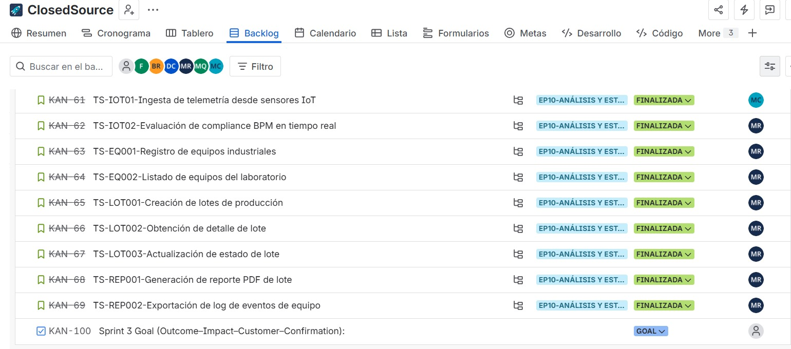
  
<em>Figura: Tablero del Sprint 3 en Jira Software (Proyecto QualiTrack)</em>

<table border="1" cellpadding="4" cellspacing="0">
  <thead>
    <tr>
      <th colspan="8" style="text-align:center;">Sprint # 3</th>
    </tr>
    <tr>
      <th colspan="2">User Story</th>
      <th colspan="6">Work-Item / Task</th>
    </tr>
    <tr>
      <th>Id</th>
      <th>Title</th>
      <th>Id</th>
      <th>Title</th>
      <th>Description</th>
      <th>Estimation (Hours)</th>
      <th>Assigned To</th>
      <th>Status</th>
    </tr>
  </thead>
  <tbody>
    <tr>
      <td>TS05</td>
      <td>Compliance & Alerts Backend</td>
      <td>T041</td>
      <td>Implementar bounded context CA</td>
      <td>Crear commands, queries, aggregates, persistence, services, REST resources y controllers para alertas, eventos de cumplimiento y preferencias de notificación.</td>
      <td>6h</td>
      <td>Zock2005</td>
      <td>Done</td>
    </tr>
    <tr>
      <td>TS06</td>
      <td>Laboratory Backend Integration</td>
      <td>T042</td>
      <td>Corregir integración de Laboratory</td>
      <td>Ajustar endpoints de laboratorio, productos, materias primas, staff y eventos de bajo stock.</td>
      <td>5h</td>
      <td>BJRM03</td>
      <td>Done</td>
    </tr>
    <tr>
      <td>TS07</td>
      <td>Equipment Backend Integration</td>
      <td>T043</td>
      <td>Corregir gestión de equipos</td>
      <td>Ajustar controllers de equipos, configuración BPM, mantenimiento y publicación de eventos.</td>
      <td>5h</td>
      <td>BJRM03</td>
      <td>Done</td>
    </tr>
    <tr>
      <td>TS08</td>
      <td>Batch Backend Integration</td>
      <td>T044</td>
      <td>Corregir gestión de lotes</td>
      <td>Corregir batch controller, consultas por laboratorio, uso de materias primas, liberación y rechazo de lotes.</td>
      <td>5h</td>
      <td>M4uricioCastillo</td>
      <td>Done</td>
    </tr>
    <tr>
      <td>TS09</td>
      <td>Reporting & Audit Backend</td>
      <td>T045</td>
      <td>Implementar bounded context RA</td>
      <td>Crear comandos, queries, aggregates, entidades, servicios, persistencia JPA, audit log, reports, KPIs y deviation trends.</td>
      <td>8h</td>
      <td>BJRM03</td>
      <td>Done</td>
    </tr>
    <tr>
      <td>TS10</td>
      <td>Tracking & Telemetry Backend</td>
      <td>T046</td>
      <td>Implementar bounded context Tracking</td>
      <td>Crear telemetría, mediciones, historial, anomalías, status de equipos, controllers y eventos de integración.</td>
      <td>8h</td>
      <td>Felixb14</td>
      <td>Done</td>
    </tr>
    <tr>
      <td>TS11</td>
      <td>Subscription & Billing Backend</td>
      <td>T047</td>
      <td>Implementar suscripciones y pagos</td>
      <td>Crear planes, suscripciones, pagos, Stripe Checkout, webhooks, repositories, services y controllers.</td>
      <td>8h</td>
      <td>BJRM03</td>
      <td>Done</td>
    </tr>
    <tr>
      <td>TS12</td>
      <td>IAM Backend</td>
      <td>T048</td>
      <td>Implementar autenticación y autorización</td>
      <td>Crear sign-up, sign-in, roles, usuarios, JWT, hashing BCrypt, filtros de seguridad y configuración Spring Security.</td>
      <td>8h</td>
      <td>BJRM03</td>
      <td>Done</td>
    </tr>
    <tr>
      <td>TS13</td>
      <td>Cloud Deployment</td>
      <td>T049</td>
      <td>Desplegar solución integrada</td>
      <td>Desplegar frontend en Firebase, backend en Render y base de datos en Railway, configurando variables de entorno.</td>
      <td>6h</td>
      <td>BJRM03</td>
      <td>Done</td>
    </tr>
    <tr>
      <td>TS14</td>
      <td>Technical Documentation</td>
      <td>T050</td>
      <td>Actualizar Swagger y diagramas</td>
      <td>Publicar documentación OpenAPI y actualizar diagramas de frontend, backend y base de datos por bounded context.</td>
      <td>6h</td>
      <td>BJRM03</td>
      <td>Done</td>
    </tr>
  </tbody>
</table>

#### 5.2.3.4. Development Evidence for Sprint Review

En esta sección se explican y presentan los avances en la implementación logrados durante
el Sprint 3 en relación con el Backend de QualiTrack y la integración completa de la
plataforma. A lo largo de este sprint se implementaron nuevos Bounded Contexts, se corrigió
la integración de módulos previamente creados, se configuró seguridad con JWT, se añadió
Stripe para suscripciones y se preparó la solución para despliegue.

La tabla siguiente resume commits relevantes del repositorio Backend, indicando la rama,
el identificador del commit, el autor registrado en GitHub, el mensaje asociado y la fecha.

<table border="1" cellpadding="4" cellspacing="0">
  <thead>
    <tr>
      <th>Repository</th>
      <th>Branch</th>
      <th>Commit Id</th>
      <th>Author</th>
      <th>Commit Message</th>
      <th>Committed on (Date)</th>
    </tr>
  </thead>
  <tbody>
    <tr>
      <td rowspan="18">https://github.com/ClosedSource-11848/qualitrack-platform</td>
      <td>main</td>
      <td>47571e6</td>
      <td>Zock2005</td>
      <td>feat(ca): add ca commands</td>
      <td>09/06/2026</td>
    </tr>
    <tr>
      <td>main</td>
      <td>d98f6c4</td>
      <td>Zock2005</td>
      <td>feat(ca): add rest controllers.</td>
      <td>09/06/2026</td>
    </tr>
    <tr>
      <td>main</td>
      <td>d699014</td>
      <td>BJRM03</td>
      <td>Merge branch 'feature/laboratory' into develop. Related to TS-L001.</td>
      <td>09/06/2026</td>
    </tr>
    <tr>
      <td>main</td>
      <td>7bc3d64</td>
      <td>BJRM03</td>
      <td>Feature/equipment</td>
      <td>09/06/2026</td>
    </tr>
    <tr>
      <td>main</td>
      <td>1a69ca8</td>
      <td>M4uricioCastillo</td>
      <td>fix(batch): fix batch queries and laboratory integration</td>
      <td>10/06/2026</td>
    </tr>
    <tr>
      <td>main</td>
      <td>006d639</td>
      <td>BJRM03</td>
      <td>feat(ra): add ra commands.</td>
      <td>12/06/2026</td>
    </tr>
    <tr>
      <td>main</td>
      <td>5c13718</td>
      <td>BJRM03</td>
      <td>feat(ra): add rest controller.</td>
      <td>12/06/2026</td>
    </tr>
    <tr>
      <td>main</td>
      <td>68edb73</td>
      <td>Felixb14</td>
      <td>feat(tracking): add tracking commands.</td>
      <td>13/06/2026</td>
    </tr>
    <tr>
      <td>main</td>
      <td>f728110</td>
      <td>Felixb14</td>
      <td>feat(tracking): add rest controller.</td>
      <td>13/06/2026</td>
    </tr>
    <tr>
      <td>main</td>
      <td>5739cc4</td>
      <td>BJRM03</td>
      <td>feat(eventhandler): add integration events for inter-context communication.</td>
      <td>13/06/2026</td>
    </tr>
    <tr>
      <td>main</td>
      <td>8b892e7</td>
      <td>BJRM03</td>
      <td>feat(subscription): add subscription value objects.</td>
      <td>13/06/2026</td>
    </tr>
    <tr>
      <td>main</td>
      <td>2b31052</td>
      <td>BJRM03</td>
      <td>feat(subscription): add rest controller.</td>
      <td>13/06/2026</td>
    </tr>
    <tr>
      <td>main</td>
      <td>4ae5843</td>
      <td>BJRM03</td>
      <td>feat(iam): add identity and access management backend module.</td>
      <td>13/06/2026</td>
    </tr>
    <tr>
      <td>main</td>
      <td>0893560</td>
      <td>BJRM03</td>
      <td>feat(ra): add kpi dashboard and deviation trend calculation workflows.</td>
      <td>14/06/2026</td>
    </tr>
    <tr>
      <td>main</td>
      <td>4e32071</td>
      <td>M4uricioCastillo</td>
      <td>fix(batch): fix batch controller and raw material usage processing.</td>
      <td>14/06/2026</td>
    </tr>
    <tr>
      <td>main</td>
      <td>543a8ba</td>
      <td>BJRM03</td>
      <td>fix(tracking): fix telemetry controller and anomaly compliance handling.</td>
      <td>14/06/2026</td>
    </tr>
    <tr>
      <td>main</td>
      <td>d735a48</td>
      <td>BJRM03</td>
      <td>chore: add dockerfile configuration.</td>
      <td>16/06/2026</td>
    </tr>
    <tr>
      <td>main</td>
      <td>f5a8a4c</td>
      <td>BJRM03</td>
      <td>docs(docs): fix backend and data base diagrams.</td>
      <td>19/06/2026</td>
    </tr>
  </tbody>
</table>

#### 5.2.3.5. Execution Evidence for Sprint Review

Durante el Sprint 3, QualiTrack pasó de una aplicación frontend funcional con datos
simulados a una solución integrada con backend real, autenticación, persistencia y servicios
desplegados. La ejecución del sprint permitió validar flujos principales como registro e
inicio de sesión, creación y edición de laboratorio, registro de equipos, configuración BPM,
mantenimiento, gestión de lotes, uso de materias primas, alertas de cumplimiento, telemetría,
reportes, KPIs, tendencias de desviación y suscripciones.

Las evidencias de ejecución corresponden a la aplicación desplegada en Firebase, la API
desplegada en Render, la base de datos en Railway y el flujo de pagos de prueba configurado
en Stripe.

  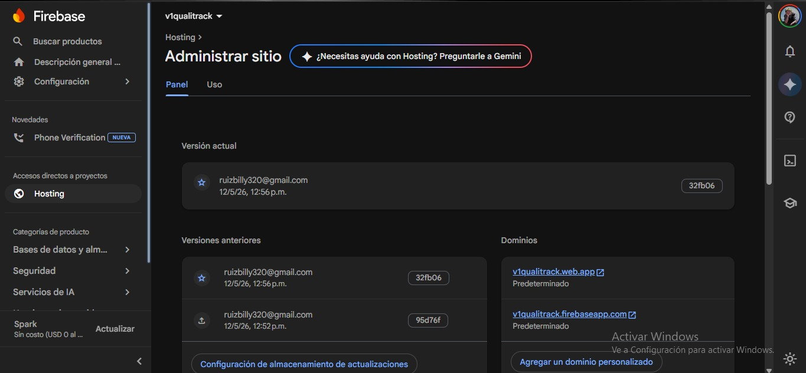
  
<em>Figura: Frontend Web Application de QualiTrack desplegada en Firebase Hosting.</em>

  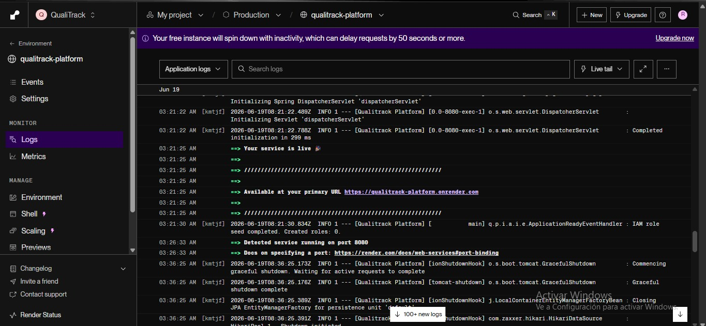
  
<em>Figura: Backend API de QualiTrack desplegada en Render.</em>

  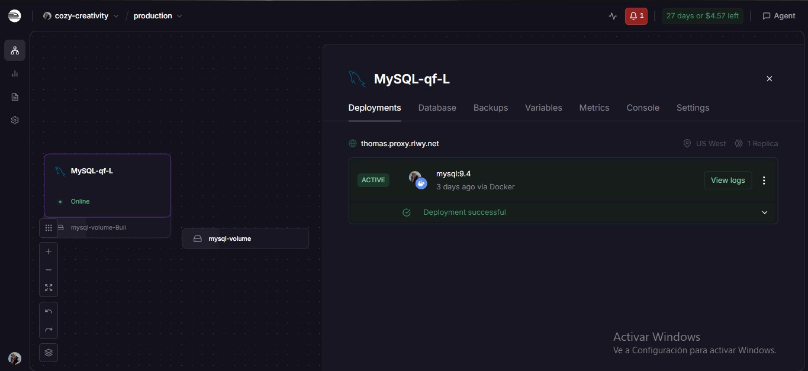
  
<em>Figura: Base de datos de QualiTrack desplegada en Railway.</em>

  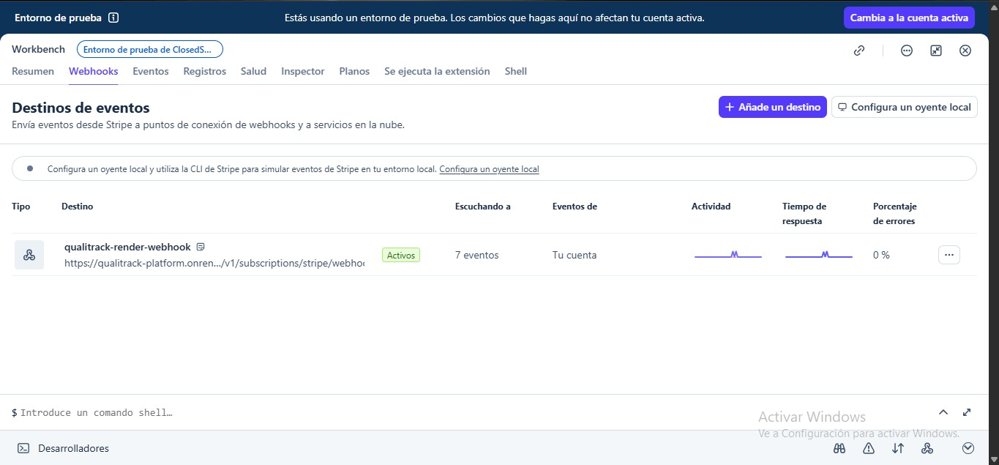
  
<em>Figura: Flujo de pago de suscripción mediante Stripe Checkout.</em>

#### 5.2.3.6. Services Documentation Evidence for Sprint Review

Durante el Sprint 3, se habilitó la documentación de servicios REST mediante Swagger/OpenAPI
en el backend desplegado en Render. Esta documentación permite visualizar los endpoints
implementados por Bounded Context, probar solicitudes HTTP, revisar modelos de request/response
y validar la integración con autenticación JWT.

  <strong>Swagger UI:</strong>
  <a href="https://qualitrack-platform.onrender.com/swagger-ui/index.html">
    https://qualitrack-platform.onrender.com/swagger-ui/index.html
  </a>

<table border="1" cellpadding="4" cellspacing="0">
  <thead>
    <tr>
      <th>Bounded Context / API Group</th>
      <th>Implemented Endpoints</th>
      <th>Main Purpose</th>
    </tr>
  </thead>
  <tbody>
    <tr>
      <td>Authentication</td>
      <td><code>POST /api/v1/authentication/sign-up</code> <code>POST /api/v1/authentication/sign-in</code></td>
      <td>Registro, inicio de sesión y generación de token JWT.</td>
    </tr>
    <tr>
      <td>Users & Roles</td>
      <td><code>GET /api/v1/users</code> <code>GET /api/v1/users/{userId}</code> <code>PATCH /api/v1/users/{userId}/roles/{roleName}</code> <code>PATCH /api/v1/users/{userId}/deactivate</code> <code>GET /api/v1/roles</code></td>
      <td>Administración de usuarios, roles y ciclo de vida de cuentas.</td>
    </tr>
    <tr>
      <td>Laboratories</td>
      <td><code>GET /api/v1/laboratories/{laboratoryId}</code> <code>PUT /api/v1/laboratories/{laboratoryId}</code> <code>POST /api/v1/laboratories</code> <code>GET/POST /api/v1/laboratories/{laboratoryId}/staff</code> <code>GET/POST /api/v1/laboratories/{laboratoryId}/products</code> <code>GET/POST /api/v1/laboratories/{laboratoryId}/raw-materials</code></td>
      <td>Gestión de laboratorio, personal, productos y materias primas.</td>
    </tr>
    <tr>
      <td>Equipment</td>
      <td><code>GET/POST /api/v1/equipments</code> <code>GET /api/v1/equipments/{equipmentId}</code> <code>GET/POST /api/v1/equipments/{equipmentId}/maintenance-records</code> <code>GET/POST /api/v1/equipments/{equipmentId}/bpm-configs</code></td>
      <td>Gestión de equipos, mantenimiento y configuración BPM.</td>
    </tr>
    <tr>
      <td>Batches</td>
      <td><code>GET/POST /api/v1/batches</code> <code>GET /api/v1/batches/{batchId}</code> <code>GET/POST /api/v1/batches/{batchId}/raw-materials</code> <code>PATCH /api/v1/batches/{batchId}/release</code> <code>PATCH /api/v1/batches/{batchId}/reject</code></td>
      <td>Trazabilidad de lotes, materias primas, liberación y rechazo.</td>
    </tr>
    <tr>
      <td>Compliance & Alerts</td>
      <td><code>GET/POST /api/v1/alerts</code> <code>GET /api/v1/alerts/{alertId}</code> <code>PATCH /api/v1/alerts/{alertId}/acknowledge</code> <code>PATCH /api/v1/alerts/{alertId}/resolve</code> <code>GET/PUT /api/v1/notification-preferences/{userId}</code> <code>GET /api/v1/compliance-events</code></td>
      <td>Gestión de alertas de desviación, eventos de cumplimiento y preferencias.</td>
    </tr>
    <tr>
      <td>Reporting & Audit</td>
      <td><code>GET/POST /api/v1/audit-log</code> <code>GET/POST /api/v1/reports</code> <code>POST /api/v1/reports/batches</code> <code>POST /api/v1/reports/compliance</code> <code>POST /api/v1/reports/equipment-logs</code> <code>GET/POST /api/v1/kpis</code> <code>GET/POST /api/v1/deviation-trends</code></td>
      <td>Auditoría, reportes, KPIs y análisis de tendencias de desviación.</td>
    </tr>
    <tr>
      <td>Tracking</td>
      <td><code>PUT /api/v1/telemetry/status</code> <code>GET /api/v1/telemetry/status/{equipmentId}</code> <code>GET/POST /api/v1/telemetry/measurements</code> <code>GET/POST /api/v1/telemetry/history</code></td>
      <td>Monitoreo de telemetría, mediciones, historial y anomalías.</td>
    </tr>
    <tr>
      <td>Subscriptions</td>
      <td><code>GET /api/v1/subscriptions/plans</code> <code>POST /api/v1/subscriptions/checkout-sessions</code> <code>GET /api/v1/subscriptions/laboratories/{laboratoryId}/active</code> <code>GET /api/v1/subscriptions/laboratories/{laboratoryId}/billing-summary</code> <code>GET /api/v1/subscriptions/{subscriptionId}/payments</code> <code>PATCH /api/v1/subscriptions/{subscriptionId}/cancel</code></td>
      <td>Planes, suscripciones, historial de pagos, checkout y cancelación.</td>
    </tr>
    <tr>
      <td>Stripe Webhooks</td>
      <td><code>POST /api/v1/subscriptions/stripe/webhook</code></td>
      <td>Sincronización de eventos de Stripe con suscripciones y pagos.</td>
    </tr>
  </tbody>
</table>

#### 5.2.3.7. Software Deployment Evidence for Sprint Review

Durante el Sprint 3 se consolidó el despliegue de los componentes principales de QualiTrack.
La Frontend Web Application fue desplegada en Firebase Hosting, el Backend API fue desplegado
en Render, la base de datos MySQL fue configurada en Railway y Stripe fue utilizado en modo
de prueba para validar el flujo de suscripciones y pagos.

<table border="1" cellpadding="4" cellspacing="0">
  <thead>
    <tr>
      <th>Component</th>
      <th>Cloud Service</th>
      <th>Production URL / Environment</th>
      <th>Status</th>
    </tr>
  </thead>
  <tbody>
    <tr>
      <td>Frontend Web Application</td>
      <td>Firebase Hosting</td>
      <td><a href="https://closedsource-qualitrack.web.app/home">https://closedsource-qualitrack.web.app/home</a></td>
      <td>Deployed</td>
    </tr>
    <tr>
      <td>Backend REST API</td>
      <td>Render</td>
      <td><a href="https://qualitrack-platform.onrender.com/swagger-ui/index.html">https://qualitrack-platform.onrender.com/swagger-ui/index.html</a></td>
      <td>Deployed</td>
    </tr>
    <tr>
      <td>Database</td>
      <td>Railway</td>
      <td>Railway MySQL production database</td>
      <td>Deployed</td>
    </tr>
    <tr>
      <td>Payment Provider</td>
      <td>Stripe Test Environment</td>
      <td>Stripe Checkout and Webhooks</td>
      <td>Configured</td>
    </tr>
  </tbody>
</table>

#### 5.2.3.8. Team Collaboration Insights during Sprint

Durante el Sprint 3, el esfuerzo principal se concentró en cerrar la brecha entre la Frontend
Web Application desarrollada en el Sprint 2 y el Backend necesario para soportar flujos reales
de negocio. El historial de commits del repositorio <code>qualitrack-platform</code> evidencia
la participación de los usuarios <strong>BJRM03</strong>, <strong>Felixb14</strong>, <strong>M4uricioCastillo</strong> y
<strong>Marcelo</strong>, quienes trabajaron sobre distintos Bounded Contexts y tareas de
integración.

El usuario <strong>Marcelo</strong> participó en la implementación del Bounded Context de
Compliance & Alerts, agregando comandos, queries, servicios, persistencia, recursos REST y
controladores. El usuario <strong>Felixb14</strong> participó principalmente en el Bounded
Context de Tracking, implementando value objects, comandos, queries, aggregates,
eventos, excepciones, persistencia JPA, servicios de aplicación, recursos REST, controladores
e integración externa. El usuario <strong>M4uricioCastillo</strong> participó principalmente en el Bounded
Context de Batch, implementando value objects, comandos, queries, aggregates,
eventos, excepciones, persistencia JPA, servicios de aplicación, recursos REST, controladores
e integración externa. Por su parte, <strong>BJRM03</strong>
concentró trabajo en Laboratory, Equipment, RA, Subscription & Billing, IAM, event handlers, seguridad,
configuración de despliegue, Dockerfile y actualización de diagramas.

La colaboración se organizó mediante ramas de tipo <code>feature/</code> y merges hacia la
línea principal de desarrollo. Esto permitió avanzar por módulos, corregir errores de integración
a medida que aparecían en el frontend y estabilizar progresivamente la API. El resultado final
del sprint fue una versión desplegada e integrada de QualiTrack, con frontend en Firebase,
backend en Render, base de datos en Railway, autenticación JWT, documentación Swagger,
telemetría, reportes, auditoría, alertas de cumplimiento y suscripciones con Stripe.

  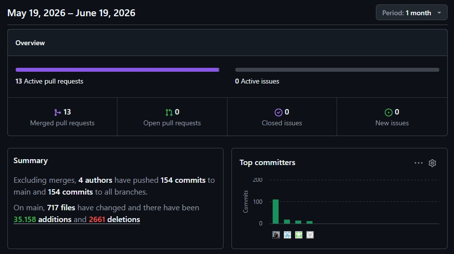
  
<em>Figura: Historial de commits del repositorio Backend durante el Sprint 3.</em>

  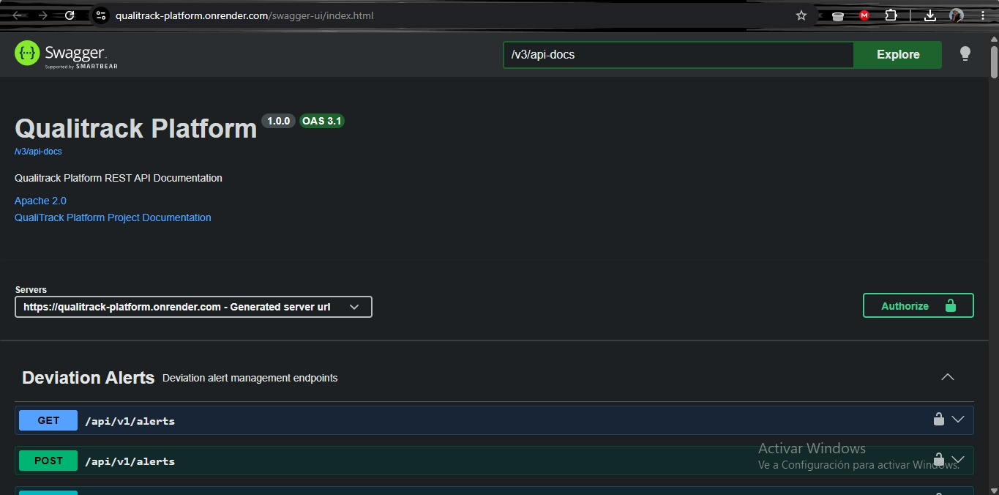
  
<em>Figura: Documentación Swagger/OpenAPI del Backend desplegado en Render.</em>

<!-- 

### 5.2.4. Sprint 4

#### 5.2.4.1. Sprint Planning 4

#### 5.2.4.2. Aspect Leaders and Collaborators

#### 5.2.4.3. Sprint Backlog 4

#### 5.2.4.4. Development Evidence for Sprint Review

#### 5.2.4.5. Execution Evidence for Sprint Review

#### 5.2.4.6. Services Documentation Evidence for Sprint Review

#### 5.2.4.7. Software Deployment Evidence for Sprint Review

#### 5.2.4.8. Team Collaboration Insights during Sprint

comentario -->

## 5.3. Validation Interviews

### 5.3.1. Diseño de Entrevistas

Las entrevistas de validación con usuarios finales constituyen un instrumento clave para la recolección de retroalimentación sobre la solución propuesta. Estas fueron diseñadas con el objetivo de evaluar el grado de adecuación de la plataforma a los requerimientos de los usuarios, así como identificar posibles limitaciones en términos de usabilidad y oportunidades de mejora.

Se realizaron entrevistas con representantes de los dos segmentos objetivo del proyecto: gerentes y jefes de aseguramiento de calidad, y directores y supervisores de entidades de salud pública, permitiendo obtener una perspectiva integral desde los ámbitos de gestión interna y supervisión del cumplimiento normativo.

<h4>Preguntas para el Segmento de Gerentes y Jefes de Aseguramiento de Calidad</h4>

<ol>
<li>¿Qué limitaciones le generan los sistemas actuales al gestionar la calidad?</li>
<li>¿Qué tipo de información necesita consultar con mayor frecuencia y rapidez?</li>
<li>¿Qué dificultades tiene al acceder a información histórica?</li>
<li>¿Qué tareas le demandan más tiempo y considera que podrían optimizarse?</li>
<li>¿Qué tipo de alertas o notificaciones serían más útiles para su trabajo?</li>
<li>¿Qué funciones considera indispensables en una solución digital de aseguramiento de calidad?</li>
<li>¿Qué beneficios concretos esperaría obtener al implementar una herramienta como esta?</li>
<li>¿Qué aspectos le generarían desconfianza al usar una plataforma digital?</li>
<li>¿Qué condiciones deberían cumplirse para considerar su implementación en su organización?</li>
<li>¿Qué mejoras sugeriría para que la solución se adapte mejor a sus necesidades?</li>
</ol>

<h4>Preguntas para el Segmento de Directores y Supervisores de Entidades de Salud Pública</h4>
<ol>
<li>¿Qué dificultades encuentra al consolidar información de diferentes entidades de salud?</li>
<li>¿Qué limitaciones tiene el acceso a datos para el monitoreo continuo?</li>
<li>¿Qué indicadores o información necesita visualizar para tomar decisiones oportunas?</li>
<li>¿Qué problemas existen en la trazabilidad de las supervisiones o inspecciones?</li>
<li>¿Qué procesos considera que deberían integrarse en una sola plataforma?</li>
<li>¿Qué tipo de alertas o reportes le ayudarían en su labor de supervisión?</li>
<li>¿Qué funcionalidades considera esenciales en una herramienta digital de fiscalización?</li>
<li>¿Qué beneficios esperaría obtener en términos de eficiencia y control?</li>
<li>¿Qué factores le generarían desconfianza al usar esta solución?</li>
<li>¿Qué condiciones o mejoras serían necesarias para adoptar esta herramienta?</li>
</ol>

### 5.3.2. Registro de Entrevistas

### 5.3.3. Evaluaciones según heurísticas

<!--

## 5.4. Video About-the-Product

comentario -->

# Conclusiones

## Conclusiones y recomendaciones

 Al finalizar el ciclo de desarrollo, implementación y validación de la solución <strong>QualiTrack</strong>, el equipo ha llegado a una serie de conclusiones clave, contrastando los resultados obtenidos con los planteamientos iniciales definidos bajo el enfoque Lean UX y el desarrollo ágil basado en Sprints. 
 
<strong>1. Validación de Problem Statements y Supuestos (Assumptions):</strong>
 
 Inicialmente, se planteó como <em>Problem Statement</em> que los laboratorios farmacéuticos enfrentan dificultades para garantizar el cumplimiento de las Buenas Prácticas de Manufactura (BPM) debido a procesos manuales, falta de trazabilidad en tiempo real y limitada integración de datos de telemetría. A partir de la implementación del Landing Page y la validación con usuarios, se confirmó que existe una necesidad real de soluciones digitales que automaticen el monitoreo y control de procesos críticos. 
 
 Asimismo, se validó el supuesto de que los responsables de calidad (QA Managers) valoran altamente la centralización de información y la automatización de alertas. Sin embargo, se identificó que el nivel de exigencia en términos de precisión, auditoría y cumplimiento normativo es incluso mayor al esperado, lo que implica que la solución debe priorizar la confiabilidad, integridad de datos y cumplimiento regulatorio desde sus etapas iniciales. 
 
<strong>2. Contrastación de Hipótesis (Hypothesis Statements):</strong>
 <ul> <li> <strong>Hipótesis de Valor para QA Managers:</strong> Se planteó que "Si proporcionamos dashboards con monitoreo en tiempo real y alertas automáticas, los responsables de calidad podrán detectar desviaciones de forma más eficiente". Los resultados obtenidos en el Sprint 1 (a nivel de propuesta de valor y percepción del usuario) validan esta hipótesis, ya que las funcionalidades relacionadas con monitoreo IoT y control automatizado fueron percibidas como altamente relevantes. </li> <li> <strong>Hipótesis de Valor para Entidades Reguladoras:</strong> Se asumió que "La generación de reportes auditables facilitará los procesos de supervisión y cumplimiento". Esta hipótesis se mantiene validada a nivel conceptual, aunque se identificó que los usuarios requieren no solo reportes estáticos, sino también historiales inmutables, trazabilidad completa y facilidad de exportación para auditorías externas. </li> </ul> 
<strong>3. Cumplimiento de Criterios de Éxito:</strong>
 
 Durante el Sprint 1, se logró implementar y desplegar exitosamente el Landing Page de QualiTrack mediante GitHub Pages, cumpliendo con los criterios de aceptación definidos: navegación completa, presentación clara de la propuesta de valor, soporte bilingüe y acceso a documentos legales. 
 
 No obstante, al tratarse de un primer incremento enfocado en la capa de presentación, aún no se han validado métricas críticas relacionadas con el uso del sistema, tales como eficiencia operativa, reducción de errores o tiempos de respuesta, las cuales serán evaluadas en los siguientes sprints con la implementación del Backend y los servicios de telemetría. 
 
<strong>Recomendaciones (Roadmap):</strong>
 
 En base a los hallazgos obtenidos y las limitaciones actuales del alcance del Sprint 1, se proponen las siguientes líneas de acción para las siguientes etapas del proyecto: 
 <ul> <li> <strong>Implementación del Backend y Servicios IoT:</strong> Priorizar el desarrollo de los Web Services con Spring Boot para la ingesta de datos de telemetría en tiempo real, ya que representan el núcleo funcional de la propuesta de valor de QualiTrack. </li> <li> <strong>Desarrollo del Dashboard Interactivo:</strong> Construir la aplicación frontend completa en Angular que permita visualizar datos en tiempo real, gestionar lotes y monitorear cumplimiento BPM mediante dashboards dinámicos. </li> <li> <strong>Integración de Módulo de Auditoría:</strong> Incorporar funcionalidades de generación de reportes inmutables, historiales de cambios y trazabilidad completa, alineadas con los requerimientos de auditoría del sector farmacéutico. </li> <li> <strong>Validación con Usuarios Reales:</strong> Realizar pruebas de usabilidad y validación con QA Managers y entidades regulatorias para medir el impacto real de la solución y ajustar funcionalidades según feedback directo. </li> <li> <strong>Escalabilidad y Despliegue en Producción:</strong> Preparar la arquitectura para soportar despliegues en la nube (Azure), asegurando alta disponibilidad, seguridad de datos y cumplimiento de estándares industriales. </li> </ul>

<!-- 

## Video About-the-Team

comentario -->

# Bibliografía

<ul>
  <li>
    Brown, S. (2020). <em>The C4 model for visualising software architecture</em>. C4 Model. Recuperado de <a href="https://c4model.com/">https://c4model.com/</a>
  </li>
  <li>
    Cohn, M. (2004). <em>User Stories Applied: For Agile Software Development</em>. Addison-Wesley Professional.
  </li>
  <li>
    Evans, E. (2003). <em>Domain-Driven Design: Tackling Complexity in the Heart of Software</em>. Addison-Wesley Professional.
  </li>
  <li>
    Gothelf, J., & Seiden, J. (2021). <em>Lean UX: Designing Great Products with Agile Teams</em> (3rd ed.). O'Reilly Media.
  </li>
  <li>
    Robertson, J., Robertson, S., & Reed, A. (2023). <em>Mastering the Requirements Process: Getting Requirements Right</em> (4th ed.). Addison-Wesley Professional.
  </li>
  <li>
    Wiegers, K., & Hokanson, C. (2023). <em>Software Requirements Essentials: Core Practices for Successful Business Analysis</em>. Addison-Wesley Professional.
  </li>
  <li>
    Heath, F. (2020). <em>Managing Software Requirements the Agile Way</em>. Packt Publishing.
  </li>
  <li>
    Lee, C. (2023). <em>The Art of Crafting User Stories</em>. O'Reilly Media.
  </li>
  <li>
    Dirección General de Medicamentos, Insumos y Drogas [DIGEMID]. (2018). <em>Manual de Buenas Prácticas de Manufactura de Productos Farmacéuticos</em>. Ministerio de Salud del Perú.
  </li>

  <li>
    Mendel, J. (s.f.). <em>Seriously, what’s your startup’s problem?</em>. Recuperado de <a href="https://medium.com/@jakemendel/seriously-whats-your-startup-s-problemb3a884c54ab4">https://medium.com/@jakemendel/seriously-whats-your-startup-s-problemb3a884c54ab4</a>
  </li>
  <li>
    <em>Lean UX – Chapter 3 (Sampler)</em>. Recuperado de <a href="https://www.scribd.com/document/655516553/Leanux-Sampler">https://www.scribd.com/document/655516553/Leanux-Sampler</a>
  </li>
  <li>
    Dittrich, J. (s.f.). <em>A Beginner’s Guide to Finding User Needs</em>. Recuperado de <a href="https://jdittrich.github.io/userNeedResearchBook/">https://jdittrich.github.io/userNeedResearchBook/</a>
  </li>
  <li>
    Mountain Goat Software. (s.f.). <em>User Stories Articles</em>. Recuperado de <a href="https://www.mountaingoatsoftware.com/blog/tag/user-stories">https://www.mountaingoatsoftware.com/blog/tag/user-stories</a>
  </li>
  <li>
    Sameera, S. (s.f.). <em>How to Write a User Story for an API Product</em>. Recuperado de <a href="https://sameera17w.medium.com/how-to-write-a-user-story-for-an-api-product7af6abd4ad2e">https://sameera17w.medium.com/how-to-write-a-user-story-for-an-api-product7af6abd4ad2e</a>
  </li>

  <li>
    UXPressia. (s.f.). <em>User vs. Buyer Persona: Differences and free template</em>. Recuperado de <a href="https://uxpressia.com/blog/user-persona-vs-buyer-persona-difference">https://uxpressia.com/blog/user-persona-vs-buyer-persona-difference</a>
  </li>
  <li>
    UXPressia. (s.f.). <em>How to create an Impact Map in 4 easy steps?</em>. Recuperado de <a href="https://uxpressia.com/blog/build-impact-map-4-easy-steps">https://uxpressia.com/blog/build-impact-map-4-easy-steps</a>
  </li>
  <li>
    IBM. (s.f.). <em>As-is Scenario Map</em>. Recuperado de <a href="https://www.ibm.com/design/thinking/page/toolkit/activity/as-is-scenario-map">https://www.ibm.com/design/thinking/page/toolkit/activity/as-is-scenario-map</a>
  </li>
  <li>
    IBM. (s.f.). <em>To-be Scenario Map</em>. Recuperado de <a href="https://www.ibm.com/design/thinking/page/toolkit/activity/to-be-scenario-map">https://www.ibm.com/design/thinking/page/toolkit/activity/to-be-scenario-map</a>
  </li>
  <li>
    IBM. (s.f.). <em>Empathy Map</em>. Recuperado de <a href="https://www.ibm.com/design/thinking/page/toolkit/activity/empathy-map">https://www.ibm.com/design/thinking/page/toolkit/activity/empathy-map</a>
  </li>
  <li>
    Nielsen Norman Group. (s.f.). <em>Empathy Mapping</em>. Recuperado de <a href="https://www.nngroup.com/articles/empathy-mapping/">https://www.nngroup.com/articles/empathy-mapping/</a>
  </li>
  <li>
    Nielsen Norman Group. (s.f.). <em>Design Systems 101</em>. Recuperado de <a href="https://www.nngroup.com/articles/design-systems-101/">https://www.nngroup.com/articles/design-systems-101/</a>
  </li>
  <li>
    Nielsen Norman Group. (s.f.). <em>Front-End Style Guides</em>. Recuperado de <a href="https://www.nngroup.com/articles/front-end-style-guides/">https://www.nngroup.com/articles/front-end-style-guides/</a>
  </li>
  <li>
    Nielsen Norman Group. (s.f.). <em>The Four Dimensions of Tone of Voice</em>. Recuperado de <a href="https://www.nngroup.com/articles/tone-of-voice-dimensions/">https://www.nngroup.com/articles/tone-of-voice-dimensions/</a>
  </li>
  <li>
    CareerFoundry. (s.f.). <em>What are User Flows in UX Design?</em>. Recuperado de <a href="https://careerfoundry.com/en/blog/ux-design/what-are-user-flows/">https://careerfoundry.com/en/blog/ux-design/what-are-user-flows/</a>
  </li>

  <li>
    Progressa Lean. (s.f.). <em>5W2H – Técnica de análisis de problemas</em>. Recuperado de <a href="https://www.progressalean.com/5w2h-tecnica-de-analisis-de-problemas/">https://www.progressalean.com/5w2h-tecnica-de-analisis-de-problemas/</a>
  </li>
  <li>
    DZone. (s.f.). <em>Acceptance Criteria in Scrum</em>. Recuperado de <a href="https://dzone.com/articles/acceptance-criteria-in-software-explanation-exampl">https://dzone.com/articles/acceptance-criteria-in-software-explanation-exampl</a>
  </li>
  <li>
    Modern Requirements. (s.f.). <em>Requirements Traceability Matrix</em>. Recuperado de <a href="https://www.modernrequirements.com/blogs/using-a-requirements-traceabilitymatrix-to-improve-project-quality/">https://www.modernrequirements.com/blogs/using-a-requirements-traceabilitymatrix-to-improve-project-quality/</a>
  </li>

  <li>
    Fowler, M. (s.f.). <em>Ubiquitous Language</em>. Recuperado de <a href="https://martinfowler.com/bliki/UbiquitousLanguage.html">https://martinfowler.com/bliki/UbiquitousLanguage.html</a>
  </li>
  <li>
    Open Practice Library. (s.f.). <em>Ubiquitous Language</em>. Recuperado de <a href="https://openpracticelibrary.com/practice/ubiquitous-language/">https://openpracticelibrary.com/practice/ubiquitous-language/</a>
  </li>
  <li>
    Nick Tune. (s.f.). <em>Domain-Driven Architecture Diagrams</em>. Recuperado de <a href="https://medium.com/nick-tune-tech-strategy-blog/domain-driven-architecturediagrams-139a75acb578">https://medium.com/nick-tune-tech-strategy-blog/domain-driven-architecturediagrams-139a75acb578</a>
  </li>
  <li>
    Domain Storytelling. (s.f.). <em>Domain Storytelling and Requirements</em>. Recuperado de <a href="https://domainstorytelling.org/#dst-requirements">https://domainstorytelling.org/#dst-requirements</a>
  </li>
  <li>
    DDD Crew. (s.f.). <em>Big Picture EventStorming</em>. Recuperado de <a href="https://github.com/ddd-by-examples/library/blob/master/docs/big-picture.md">https://github.com/ddd-by-examples/library/blob/master/docs/big-picture.md</a>
  </li>
  <li>
    DDD Crew. (s.f.). <em>Design Level EventStorming</em>. Recuperado de <a href="https://github.com/ddd-by-examples/library/blob/master/docs/design-level.md">https://github.com/ddd-by-examples/library/blob/master/docs/design-level.md</a>
  </li>

  <li>
    <em>The Markdown Guide</em>. Recuperado de <a href="https://www.markdownguide.org/">https://www.markdownguide.org/</a>
  </li>
  <li>
    Noam Tamim. (s.f.). <em>How to use PlantUML with Markdown</em>. Recuperado de <a href="https://gist.github.com/noamtamim/f11982b28602bd7e604c233fbe9d910f">https://gist.github.com/noamtamim/f11982b28602bd7e604c233fbe9d910f</a>
  </li>
  <li>
    Structurizr. (s.f.). <em>Embedding diagrams</em>. Recuperado de <a href="https://docs.structurizr.com/cloud/embed">https://docs.structurizr.com/cloud/embed</a>
  </li>
  <li>
    Connect2Group. (s.f.). <em>Using PlantUML for diagrams</em>. Recuperado de <a href="https://connect2grp.medium.com/using-plantuml-for-creating-clear-and-concisediagrams-2fc621529560">https://connect2grp.medium.com/using-plantuml-for-creating-clear-and-concisediagrams-2fc621529560</a>
  </li>

  <li>
    Driessen, V. (2010). <em>A successful Git branching model</em>. Recuperado de <a href="https://nvie.com/posts/a-successful-git-branching-model/">https://nvie.com/posts/a-successful-git-branching-model/</a>
  </li>
  <li>
    <em>Semantic Versioning 2.0.0</em>. Recuperado de <a href="https://semver.org/">https://semver.org/</a>
  </li>
  <li>
    <em>Conventional Commits</em>. Recuperado de <a href="https://www.conventionalcommits.org/">https://www.conventionalcommits.org/</a>
  </li>
  <li>
    W3Schools. (s.f.). <em>HTML Style Guide</em>. Recuperado de <a href="https://www.w3schools.com/html/html5_syntax.asp">https://www.w3schools.com/html/html5_syntax.asp</a>
  </li>
  <li>
    Google. (s.f.). <em>HTML/CSS Style Guide</em>. Recuperado de <a href="https://google.github.io/styleguide/htmlcssguide.html">https://google.github.io/styleguide/htmlcssguide.html</a>
  </li>
  <li>
    Google. (s.f.). <em>JavaScript Style Guide</em>. Recuperado de <a href="https://google.github.io/styleguide/jsguide.html">https://google.github.io/styleguide/jsguide.html</a>
  </li>
  <li>
    Google. (s.f.). <em>TypeScript Style Guide</em>. Recuperado de <a href="https://google.github.io/styleguide/tsguide.html">https://google.github.io/styleguide/tsguide.html</a>
  </li>
  <li>
    Google. (s.f.). <em>Java Style Guide</em>. Recuperado de <a href="https://google.github.io/styleguide/javaguide.html">https://google.github.io/styleguide/javaguide.html</a>
  </li>
  <li>
    Angular. (s.f.). <em>Angular Coding Style Guide</em>. Recuperado de <a href="https://angular.io/guide/styleguide">https://angular.io/guide/styleguide</a>
  </li>
  <li>
    Spring. (s.f.). <em>Spring Boot Features</em>. Recuperado de <a href="https://docs.spring.io/spring-boot/docs/current/reference/html/features.html">https://docs.spring.io/spring-boot/docs/current/reference/html/features.html</a>
  </li>
  <li>
    SpecFlow. (s.f.). <em>Gherkin Conventions</em>. Recuperado de <a href="https://specflow.org/gherkin/gherkin-conventions-for-readable-specifications/">https://specflow.org/gherkin/gherkin-conventions-for-readable-specifications/</a>
  </li>
  <li>
    HubSpot. (s.f.). <em>Meta Tags and SEO</em>. Recuperado de <a href="https://blog.hubspot.com/marketing/meta-tags">https://blog.hubspot.com/marketing/meta-tags</a>
  </li>
</ul>

# Anexos

<h4>Anexo A: Enlaces de Despliegue y Repositorios</h4>

  A continuación se listan los enlaces correspondientes a los recursos disponibles del proyecto QualiTrack, incluyendo los despliegues de la Landing Page, la aplicación frontend, la API backend y los repositorios del proyecto.

<table border="1" cellpadding="4" cellspacing="0">
  <thead>
    <tr>
      <th>Recurso</th>
      <th>URL</th>
    </tr>
  </thead>
  <tbody>
    <tr>
      <td><strong>Landing Page (GitHub Pages)</strong></td>
      <td>
        <a href="https://closedsource-11848.github.io/ClosedSource-LandingPage/">
          https://closedsource-11848.github.io/ClosedSource-LandingPage/
        </a>
      </td>
    </tr>
    <tr>
      <td><strong>Frontend Web App (Firebase)</strong></td>
      <td>
        <a href="https://closedsource-qualitrack.web.app">
          https://closedsource-qualitrack.web.app
        </a>
      </td>
    </tr>
    <tr>
      <td><strong>Backend API Documentation (Render / Swagger UI)</strong></td>
      <td>
        <a href="https://qualitrack-platform.onrender.com/swagger-ui/index.html">
          https://qualitrack-platform.onrender.com/swagger-ui/index.html
        </a>
      </td>
    </tr>
    <tr>
      <td><strong>Repositorio Landing Page</strong></td>
      <td>
        <a href="https://github.com/ClosedSource-11848/ClosedSource-LandingPage">
          https://github.com/ClosedSource-11848/ClosedSource-LandingPage
        </a>
      </td>
    </tr>
    <tr>
      <td><strong>Repositorio Project Report</strong></td>
      <td>
        <a href="https://github.com/ClosedSource-11848/ClosedSource-Project-Report">
          https://github.com/ClosedSource-11848/ClosedSource-Project-Report
        </a>
      </td>
    </tr>
    <tr>
      <td><strong>Repositorio Frontend</strong></td>
      <td>
        <a href="https://github.com/ClosedSource-11848/ClosedSource-Frontend">
          https://github.com/ClosedSource-11848/ClosedSource-Frontend
        </a>
      </td>
    </tr>
    <tr>
      <td><strong>Repositorio Backend</strong></td>
      <td>
        <a href="https://github.com/ClosedSource-11848/qualitrack-platform">
          https://github.com/ClosedSource-11848/qualitrack-platform
        </a>
      </td>
    </tr>
  </tbody>
</table>

<h4>Anexo B: Videos de Exposiciones</h4>

  Registro de las exposiciones realizadas hasta el hito AV1 correspondiente al Sprint 1.

<table border="1" cellpadding="4" cellspacing="0">
  <thead>
    <tr>
      <th>Entrega / Hito</th>
      <th>Plataforma</th>
      <th>URL</th>
    </tr>
  </thead>
  <tbody>
    <tr>
      <td rowspan="2"><strong>Video de Exposición AV1 (Sprint 1)</strong></td>
      <td>YouTube</td>
      <td><a href="https://shorturl.at/6tJNG">[https://shorturl.at/6tJNG]</a></td>
    </tr>
    <tr>
      <td>Microsoft Stream</td>
      <td><a href="https://shorturl.at/VP26T">[https://shorturl.at/VP26T]</a></td>
    </tr>
    <tr>
      <td rowspan="2"><strong>Video de Exposición TB1 (Sprint 2)</strong></td>
      <td>YouTube</td>
      <td>
        <a href="https://shorturl.at/C0LQI">
          [https://shorturl.at/C0LQI]
        </a>
      </td>
    </tr>
    <tr>
      <td>Microsoft Stream</td>
      <td>
        <a href="https://shorturl.at/Vj4Vm">
          [https://shorturl.at/Vj4Vm]
        </a>
      </td>
    </tr>
  </tbody>
</table>

<h4>Anexo C: Videos del Proyecto</h4>

  Material audiovisual del proyecto QualiTrack relacionado a la presentación del producto y del equipo.

<table border="1" cellpadding="4" cellspacing="0">
  <thead>
    <tr>
      <th>Tipo de Video</th>
      <th>Plataforma</th>
      <th>URL</th>
    </tr>
  </thead>
  <tbody>
    <tr>
      <td rowspan="2"><strong>Video "About the Product"</strong></td>
      <td>YouTube</td>
      <td>
        <a href="https://youtu.be/LpOAo21-778">
          https://youtu.be/LpOAo21-778
        </a>
      </td>
    </tr>
    <tr>
      <td>Microsoft Stream</td>
      <td>
        <a href="https://shorturl.at/FCgv3">
          https://shorturl.at/FCgv3
        </a>
      </td>
    </tr>
    <tr>
      <td rowspan="2"><strong>Video "About the Team"</strong></td>
      <td>YouTube</td>
      <td>
        <a href="https://youtu.be/bGTHeGe3x6U">
          https://youtu.be/bGTHeGe3x6U
        </a>
      </td>
    </tr>
    <tr>
      <td>Microsoft Stream</td>
      <td>
        <a href="https://shorturl.at/Yl5A8">
          https://shorturl.at/Yl5A8
        </a>
      </td>
    </tr>
  </tbody>
</table>
