<html lang="es">
<body>
  
# Capítulo V: Product Implementation, Validation & Deployment

## 5.1. Software Configuration Management

En esta sección se describen las decisiones, convenciones y herramientas utilizadas por el
equipo ClosedSource para gestionar la implementación, validación y despliegue de QualiTrack.
El proyecto fue desarrollado como una solución compuesta por tres productos principales:
Landing Page, Frontend Web Application y Backend Web Services.

Durante el desarrollo se aplicaron prácticas de control de versiones, organización por
repositorios, convenciones de código, documentación técnica y configuración de despliegue
en servicios cloud. Estas decisiones permitieron mantener trazabilidad sobre los cambios
realizados en cada sprint y facilitar la integración progresiva entre la presentación pública
del producto, la aplicación web interna y los servicios backend.

### 5.1.1. Software Development Environment Configuration

En esta sección se presentan las herramientas utilizadas durante el ciclo de vida del
proyecto QualiTrack. Estas herramientas se organizan según las disciplinas de gestión,
diseño, desarrollo, pruebas, documentación y despliegue.

<ol>
  <li>Project Management</li>
  <li>Requirements Management</li>
  <li>Product UX/UI Design</li>
  <li>Software Development</li>
  <li>Software Testing</li>
  <li>Software Documentation</li>
  <li>Software Deployment</li>
</ol>

<h4>Project Management</h4>

Esta disciplina se centró en la planificación, seguimiento y control del trabajo realizado
por el equipo durante los sprints.

<ul>
  <li>
    <strong>Jira:</strong> Herramienta utilizada para organizar el Product Backlog, registrar
    User Stories y Technical Stories, planificar Sprints y realizar seguimiento del estado
    de los work-items del equipo. 
    <strong>Ruta de referencia:</strong>
    <a href="https://www.atlassian.com/software/jira" target="_blank">
      https://www.atlassian.com/software/jira
    </a>
  </li>
  <li>
    <strong>Trello:</strong> Herramienta visual utilizada como board de apoyo para mostrar
    el avance de tareas durante los sprints y evidenciar el estado del trabajo realizado
    por el equipo. 
    <strong>Ruta de referencia:</strong>
    <a href="https://trello.com" target="_blank">https://trello.com</a>
  </li>
</ul>

<h4>Requirements Management</h4>

La gestión de requisitos permitió documentar las necesidades de los segmentos objetivo,
definir User Stories, Technical Stories y criterios de aceptación alineados con los procesos
de gestión de calidad farmacéutica.

<ul>
  <li>
    <strong>Markdown:</strong> Lenguaje utilizado para redactar el Product Backlog, Sprint
    Backlog, evidencias de implementación y documentación del proyecto dentro del Project
    Report. 
    <strong>Ruta de referencia:</strong>
    <a href="https://www.markdownguide.org/" target="_blank">
      https://www.markdownguide.org/
    </a>
  </li>
  <li>
    <strong>Gherkin:</strong> Lenguaje utilizado para redactar criterios de aceptación en
    formato Given-When-Then, facilitando la validación de comportamiento esperado en las
    User Stories. 
    <strong>Ruta de referencia:</strong>
    <a href="https://cucumber.io/docs/gherkin/" target="_blank">
      https://cucumber.io/docs/gherkin/
    </a>
  </li>
</ul>

<h4>Product UX/UI Design</h4>

El diseño de experiencia de usuario y de interfaz permitió definir la propuesta visual de
QualiTrack, desde la Landing Page hasta las vistas principales de la Web Application.

<ol>
  <li>
    <strong>Figma:</strong> Herramienta utilizada para la elaboración de wireframes,
    mock-ups y prototipos de la Landing Page y de la Frontend Web Application. 
    <strong>Ruta de referencia:</strong>
    <a href="https://www.figma.com/" target="_blank">https://www.figma.com/</a>
  </li>
  <li>
    <strong>Miro:</strong> Herramienta colaborativa utilizada para actividades de análisis,
    identificación de bounded contexts y organización visual de ideas del dominio. 
    <strong>Ruta de referencia:</strong>
    <a href="https://miro.com/" target="_blank">https://miro.com/</a>
  </li>
  <li>
    <strong>UXPressia:</strong> Herramienta utilizada para trabajar artefactos de
    entendimiento del usuario, como User Personas, Empathy Maps y Customer Journey Maps. 
    <strong>Ruta de referencia:</strong>
    <a href="https://uxpressia.com/" target="_blank">https://uxpressia.com/</a>
  </li>
  <li>
    <strong>Lucidchart:</strong> Herramienta utilizada para elaborar diagramas de apoyo
    arquitectónico y de modelado, incluyendo diagramas de clases y diagramas de base de
    datos. 
    <strong>Ruta de referencia:</strong>
    <a href="https://www.lucidchart.com/" target="_blank">https://www.lucidchart.com/</a>
  </li>
</ol>

<h4>Software Development</h4>

El desarrollo de QualiTrack abarcó la implementación de la Landing Page, la Frontend Web
Application en Angular y los Backend Web Services en Spring Boot. La solución fue organizada
por bounded contexts y con una estructura orientada a capas.

<ol>
  <li>
    <strong>GitHub:</strong> Plataforma utilizada para alojar los repositorios del proyecto,
    administrar el control de versiones y mantener trazabilidad de commits por producto. 
    <strong>Ruta de referencia:</strong>
    <a href="https://github.com" target="_blank">https://github.com</a> 
    <strong>Organización del proyecto:</strong>
    <a href="https://github.com/ClosedSource-11848" target="_blank">
      https://github.com/ClosedSource-11848
    </a>
  </li>
  <li>
    <strong>WebStorm:</strong> IDE utilizado para el desarrollo de la Frontend Web
    Application con Angular, TypeScript, HTML y CSS. 
    <strong>Ruta de descarga:</strong>
    <a href="https://www.jetbrains.com/webstorm/" target="_blank">
      https://www.jetbrains.com/webstorm/
    </a>
  </li>
  <li>
    <strong>IntelliJ IDEA:</strong> IDE utilizado para el desarrollo del Backend Web Service
    con Java, Spring Boot, Spring Security, JPA/Hibernate y MySQL. 
    <strong>Ruta de descarga:</strong>
    <a href="https://www.jetbrains.com/idea/" target="_blank">
      https://www.jetbrains.com/idea/
    </a>
  </li>
  <li>
    <strong>Angular:</strong> Framework utilizado para implementar la SPA de QualiTrack,
    incluyendo componentes standalone, rutas, stores, servicios HTTP, soporte bilingüe y
    consumo de APIs REST. 
    <strong>Ruta de referencia:</strong>
    <a href="https://angular.dev/" target="_blank">https://angular.dev/</a>
  </li>
  <li>
    <strong>Spring Boot:</strong> Framework utilizado para implementar los servicios REST
    del backend, organizados por bounded contexts como IAM, Laboratory, Equipment, Batch,
    Tracking, Compliance & Alerts, Reporting & Audit y Subscription. 
    <strong>Ruta de referencia:</strong>
    <a href="https://spring.io/projects/spring-boot" target="_blank">
      https://spring.io/projects/spring-boot
    </a>
  </li>
  <li>
    <strong>Spring Security:</strong> Framework utilizado para proteger los endpoints del
    backend mediante autenticación JWT y autorización de requests autenticados. 
    <strong>Ruta de referencia:</strong>
    <a href="https://spring.io/projects/spring-security" target="_blank">
      https://spring.io/projects/spring-security
    </a>
  </li>
  <li>
    <strong>MySQL:</strong> Sistema gestor de base de datos relacional utilizado para la
    persistencia de usuarios, laboratorios, equipos, lotes, telemetría, alertas, reportes,
    auditoría, suscripciones y pagos. 
    <strong>Ruta de referencia:</strong>
    <a href="https://www.mysql.com/" target="_blank">https://www.mysql.com/</a>
  </li>
  <li>
    <strong>Stripe:</strong> Plataforma utilizada para implementar el flujo de suscripción
    y pago mediante Stripe Checkout en modo de prueba. 
    <strong>Ruta de referencia:</strong>
    <a href="https://stripe.com/" target="_blank">https://stripe.com/</a>
  </li>
</ol>

<h4>Software Testing</h4>

Las pruebas y validaciones se realizaron mediante navegación manual, ejecución de flujos
principales, revisión de respuestas HTTP, Swagger UI, DevTools del navegador y validación
directa de datos persistidos.

<ul>
  <li>
    <strong>Swagger UI:</strong> Herramienta utilizada para probar endpoints REST del backend,
    revisar contratos de request/response y validar recursos documentados mediante OpenAPI. 
    <strong>Ruta de referencia:</strong>
    <a href="https://swagger.io/tools/swagger-ui/" target="_blank">
      https://swagger.io/tools/swagger-ui/
    </a>
  </li>
  <li>
    <strong>Chrome DevTools:</strong> Herramienta utilizada para inspeccionar requests,
    responses, errores de CORS, tokens JWT, carga de recursos y comportamiento visual de la
    aplicación frontend. 
    <strong>Ruta de referencia:</strong>
    <a href="https://developer.chrome.com/docs/devtools/" target="_blank">
      https://developer.chrome.com/docs/devtools/
    </a>
  </li>
  <li>
    <strong>MySQL Workbench:</strong> Herramienta utilizada para consultar y validar los datos
    persistidos por la aplicación durante las pruebas funcionales. 
    <strong>Ruta de referencia:</strong>
    <a href="https://www.mysql.com/products/workbench/" target="_blank">
      https://www.mysql.com/products/workbench/
    </a>
  </li>
</ul>

<h4>Software Documentation</h4>

La documentación permitió describir la arquitectura, endpoints, diagramas, decisiones de
diseño y evidencias de desarrollo del proyecto.

<ul>
  <li>
    <strong>OpenAPI Specification / Swagger:</strong> Estándar utilizado para documentar los
    servicios REST del Backend Web Service de QualiTrack. 
    <strong>Ruta de referencia:</strong>
    <a href="https://swagger.io/specification/" target="_blank">
      https://swagger.io/specification/
    </a>
  </li>
  <li>
    <strong>PlantUML:</strong> Herramienta utilizada para representar diagramas de clases,
    diagramas de base de datos y diagramas generales de la solución. 
    <strong>Ruta de referencia:</strong>
    <a href="https://plantuml.com/" target="_blank">https://plantuml.com/</a>
  </li>
  <li>
    <strong>Markdown:</strong> Lenguaje utilizado para redactar el Project Report y mantener
    la documentación versionada en GitHub. 
    <strong>Ruta de referencia:</strong>
    <a href="https://www.markdownguide.org/" target="_blank">
      https://www.markdownguide.org/
    </a>
  </li>
</ul>

<h4>Software Deployment</h4>

El despliegue de QualiTrack se realizó utilizando servicios cloud diferenciados para cada
producto de la solución.

<ul>
  <li>
    <strong>GitHub Pages:</strong> Servicio utilizado para desplegar la Landing Page pública
    de QualiTrack. 
    <strong>Ruta de referencia:</strong>
    <a href="https://pages.github.com/" target="_blank">https://pages.github.com/</a>
  </li>
  <li>
    <strong>Firebase Hosting:</strong> Servicio utilizado para desplegar la Frontend Web
    Application desarrollada en Angular. 
    <strong>Ruta de referencia:</strong>
    <a href="https://firebase.google.com/products/hosting" target="_blank">
      https://firebase.google.com/products/hosting
    </a>
  </li>
  <li>
    <strong>Render:</strong> Plataforma utilizada para desplegar el Backend Web Service de
    QualiTrack. 
    <strong>Ruta de referencia:</strong>
    <a href="https://render.com/" target="_blank">https://render.com/</a>
  </li>
  <li>
    <strong>Railway:</strong> Plataforma utilizada para desplegar la base de datos MySQL de
    QualiTrack. 
    <strong>Ruta de referencia:</strong>
    <a href="https://railway.com/" target="_blank">https://railway.com/</a>
  </li>
</ul>

### 5.1.2. Source Code Management

El código fuente del proyecto QualiTrack fue organizado en repositorios independientes para
facilitar la gestión, revisión y despliegue de cada producto. Se utilizó GitHub como sistema
de control de versiones distribuido y como plataforma de colaboración del equipo.

<h4>Repositorios del Proyecto</h4>

<table>
  <thead>
    <tr>
      <th>Producto</th>
      <th>URL del Repositorio</th>
    </tr>
  </thead>
  <tbody>
    <tr>
      <td>Organización ClosedSource-11848</td>
      <td>
        <a href="https://github.com/ClosedSource-11848" target="_blank">
          https://github.com/ClosedSource-11848
        </a>
      </td>
    </tr>
    <tr>
      <td>Project Report</td>
      <td>
        <a href="https://github.com/ClosedSource-11848/ClosedSource-Project-Report" target="_blank">
          https://github.com/ClosedSource-11848/ClosedSource-Project-Report
        </a>
      </td>
    </tr>
    <tr>
      <td>Landing Page</td>
      <td>
        <a href="https://github.com/ClosedSource-11848/ClosedSource-LandingPage" target="_blank">
          https://github.com/ClosedSource-11848/ClosedSource-LandingPage
        </a>
      </td>
    </tr>
    <tr>
      <td>Frontend Web Application</td>
      <td>
        <a href="https://github.com/ClosedSource-11848/ClosedSource-Frontend" target="_blank">
          https://github.com/ClosedSource-11848/ClosedSource-Frontend
        </a>
      </td>
    </tr>
    <tr>
      <td>Backend Web Services</td>
      <td>
        <a href="https://github.com/ClosedSource-11848/qualitrack-platform" target="_blank">
          https://github.com/ClosedSource-11848/qualitrack-platform
        </a>
      </td>
    </tr>
  </tbody>
</table>

<h4>GitFlow Workflow</h4>

Se adoptó GitFlow como flujo de trabajo para organizar el desarrollo por funcionalidades.
Este enfoque permitió separar el código estable, el trabajo en integración y las ramas de
desarrollo específicas por módulo o bounded context.

<strong>Ramas principales:</strong>

<ul>
  <li>
    <strong>main:</strong> Rama principal utilizada para versiones estables y desplegables
    del producto.
  </li>
  <li>
    <strong>develop:</strong> Rama de integración utilizada para consolidar funcionalidades
    antes de su paso a una versión estable.
  </li>
</ul>

<strong>Ramas de soporte:</strong>

<ul>
  <li>
    <strong>feature/&lt;scope&gt;-&lt;functionality&gt;:</strong> Ramas utilizadas para
    implementar nuevas funcionalidades o módulos específicos. Ejemplos:
    <code>feature/laboratory-management</code>, <code>feature/subscription-billing</code>.
  </li>
  <li>
    <strong>fix/&lt;scope&gt;-&lt;issue&gt;:</strong> Ramas utilizadas para correcciones de
    comportamiento o errores detectados durante pruebas.
  </li>
  <li>
    <strong>docs/&lt;section&gt;:</strong> Ramas utilizadas para cambios relacionados con
    documentación del proyecto.
  </li>
</ul>

<h4>Conventional Commits</h4>

El equipo utilizó la especificación Conventional Commits para mantener mensajes de commit
claros y trazables. La estructura general aplicada fue:
<code>&lt;type&gt;[optional scope]: &lt;description&gt;</code>.

<table>
  <thead>
    <tr>
      <th>Tipo</th>
      <th>Descripción</th>
    </tr>
  </thead>
  <tbody>
    <tr><td><code>feat</code></td><td>Nueva funcionalidad para el usuario</td></tr>
    <tr><td><code>fix</code></td><td>Corrección de errores</td></tr>
    <tr><td><code>docs</code></td><td>Cambios en documentación</td></tr>
    <tr><td><code>style</code></td><td>Cambios de formato sin afectar funcionalidad</td></tr>
    <tr><td><code>refactor</code></td><td>Mejoras internas sin cambiar comportamiento externo</td></tr>
    <tr><td><code>test</code></td><td>Adición o corrección de pruebas</td></tr>
    <tr><td><code>build</code></td><td>Cambios en build, dependencias o configuración</td></tr>
    <tr><td><code>chore</code></td><td>Tareas de mantenimiento</td></tr>
  </tbody>
</table>

<strong>Ejemplos de commits adaptados al proyecto:</strong>

<pre><code>feat(landing): add product benefits section
feat(iam): implement sign-in and sign-up views
feat(laboratory): add product and raw material management
feat(equipment): implement equipment registration and maintenance views
feat(batch): add batch management and raw material usage
feat(subscription): integrate Stripe checkout flow
feat(api): expose REST endpoints for QualiTrack bounded contexts
fix(reporting): correct audit log resource paths
docs(report): update sprint execution evidence
</code></pre>

<h4>Semantic Versioning</h4>

Se considera Semantic Versioning 2.0.0 como referencia para identificar releases del
producto, siguiendo el formato <code>MAJOR.MINOR.PATCH</code>.

<ul>
  <li><strong>MAJOR:</strong> Cambios incompatibles con versiones anteriores.</li>
  <li><strong>MINOR:</strong> Nuevas funcionalidades compatibles con versiones anteriores.</li>
  <li><strong>PATCH:</strong> Correcciones compatibles con versiones anteriores.</li>
</ul>

### 5.1.3. Source Code Style Guide & Conventions

En esta sección se describen las convenciones de estilo y nomenclatura adoptadas para los
lenguajes y frameworks utilizados en QualiTrack. Se priorizó el uso de nombres en inglés,
alineados con el Ubiquitous Language del dominio, y una estructura consistente entre
Landing Page, Frontend Web Application y Backend Web Services.

<h4>Referencias de guías de estilo adoptadas</h4>

<table>
  <thead>
    <tr>
      <th>Lenguaje/Tecnología</th>
      <th>Guía de estilo</th>
    </tr>
  </thead>
  <tbody>
    <tr>
      <td>HTML/CSS</td>
      <td><a href="https://google.github.io/styleguide/htmlcssguide.html" target="_blank">Google HTML/CSS Style Guide</a></td>
    </tr>
    <tr>
      <td>JavaScript</td>
      <td><a href="https://google.github.io/styleguide/jsguide.html" target="_blank">Google JavaScript Style Guide</a></td>
    </tr>
    <tr>
      <td>TypeScript</td>
      <td><a href="https://google.github.io/styleguide/tsguide.html" target="_blank">Google TypeScript Style Guide</a></td>
    </tr>
    <tr>
      <td>Angular</td>
      <td><a href="https://angular.dev/style-guide" target="_blank">Angular Style Guide</a></td>
    </tr>
    <tr>
      <td>Java</td>
      <td><a href="https://google.github.io/styleguide/javaguide.html" target="_blank">Google Java Style Guide</a></td>
    </tr>
    <tr>
      <td>Spring Boot</td>
      <td><a href="https://docs.spring.io/spring-boot/index.html" target="_blank">Spring Boot Documentation</a></td>
    </tr>
    <tr>
      <td>Gherkin</td>
      <td><a href="https://cucumber.io/docs/gherkin/reference/" target="_blank">Gherkin Reference</a></td>
    </tr>
  </tbody>
</table>

<h4>Nomenclatura general</h4>

<table>
  <thead>
    <tr>
      <th>Elemento</th>
      <th>Convención</th>
      <th>Ejemplo</th>
    </tr>
  </thead>
  <tbody>
    <tr>
      <td>Clases Java/TypeScript</td>
      <td>PascalCase</td>
      <td><code>BatchCommandServiceImpl</code>, <code>EquipmentApiEndpoint</code></td>
    </tr>
    <tr>
      <td>Interfaces TypeScript</td>
      <td>PascalCase</td>
      <td><code>SignInRequest</code>, <code>CreateBatchCommand</code></td>
    </tr>
    <tr>
      <td>Métodos y funciones</td>
      <td>camelCase</td>
      <td><code>getBatchById()</code>, <code>registerEquipment()</code></td>
    </tr>
    <tr>
      <td>Variables</td>
      <td>camelCase</td>
      <td><code>laboratoryId</code>, <code>selectedPlanCode</code></td>
    </tr>
    <tr>
      <td>Constantes</td>
      <td>SCREAMING_SNAKE_CASE</td>
      <td><code>API_BASE_URL</code>, <code>DEFAULT_LANGUAGE</code></td>
    </tr>
    <tr>
      <td>Archivos Angular</td>
      <td>kebab-case</td>
      <td><code>billing-summary.ts</code>, <code>equipment-detail.html</code></td>
    </tr>
    <tr>
      <td>Clases CSS</td>
      <td>kebab-case</td>
      <td><code>.summary-card</code>, <code>.toolbar-actions</code></td>
    </tr>
    <tr>
      <td>Endpoints REST</td>
      <td>kebab-case plural</td>
      <td><code>/api/v1/batches</code>, <code>/api/v1/equipments</code></td>
    </tr>
  </tbody>
</table>

<h4>Convenciones frontend</h4>

<ul>
  <li>Uso de Angular standalone components.</li>
  <li>Separación por bounded context dentro de <code>src/app</code>.</li>
  <li>Organización por capas: domain, application, infrastructure y presentation.</li>
  <li>Uso de stores y signals para gestión de estado.</li>
  <li>Uso de services/endpoints para encapsular comunicación HTTP.</li>
  <li>Uso de archivos de traducción para soporte bilingüe ES/EN.</li>
  <li>Uso de nombres en inglés para componentes, entidades, comandos y recursos.</li>
</ul>

<h4>Convenciones backend</h4>

<ul>
  <li>Organización por bounded context dentro del paquete <code>platform</code>.</li>
  <li>Uso de capas domain, application, infrastructure e interfaces.</li>
  <li>Uso de REST controllers dentro de <code>interfaces.rest</code>.</li>
  <li>Uso de resources y assemblers para transformar datos de entrada y salida.</li>
  <li>Uso de command services y query services para separar casos de uso.</li>
  <li>Uso de repositories como puertos de persistencia del dominio.</li>
  <li>Uso de entidades JPA, assemblers y adapters dentro de infrastructure.</li>
  <li>Uso de endpoints REST con recursos en plural y parámetros de recurso en path.</li>
  <li>Uso de Javadoc para clases públicas relevantes.</li>
</ul>

<h4>Ejemplo TypeScript</h4>

<pre><code>export class SubscriptionPlan {
  constructor(params: {
    id: number;
    code: string;
    name: string;
    priceAmount: number;
    currency: string;
  }) {
    this.id = params.id;
    this.code = params.code;
    this.name = params.name;
    this.priceAmount = params.priceAmount;
    this.currency = params.currency;
  }
}
</code></pre>

<h4>Ejemplo Java</h4>

<pre><code>@RestController
@RequestMapping(value = "/api/v1/batches", produces = APPLICATION_JSON_VALUE)
public class BatchController {

    private final BatchCommandService batchCommandService;
    private final BatchQueryService batchQueryService;

    public BatchController(
            BatchCommandService batchCommandService,
            BatchQueryService batchQueryService
    ) {
        this.batchCommandService = batchCommandService;
        this.batchQueryService = batchQueryService;
    }

    @GetMapping("/{batchId}")
    public ResponseEntity&lt;BatchResource&gt; getBatchById(@PathVariable Long batchId) {
        var batch = batchQueryService.handle(new GetBatchByIdQuery(batchId));
        return batch.map(value -&gt; ResponseEntity.ok(
                BatchResourceFromEntityAssembler.toResourceFromEntity(value)
        )).orElseGet(() -&gt; ResponseEntity.notFound().build());
    }
}
</code></pre>

<h4>Ejemplo Gherkin</h4>

<pre><code>Feature: Batch traceability

  Scenario: Link raw material to a production batch
    Given the QA Manager is authenticated
    And a production batch exists
    And a raw material exists in the laboratory inventory
    When the QA Manager links the raw material to the batch
    Then the system should register the raw material usage
    And the batch traceability history should include the linked material
</code></pre>

### 5.1.4. Software Deployment Configuration

En esta sección se especifica la configuración de despliegue aplicada a los productos
digitales de QualiTrack: Landing Page, Frontend Web Application, Backend Web Services y
base de datos.

<h4>Landing Page - GitHub Pages</h4>

La Landing Page se desplegó mediante GitHub Pages desde el repositorio
<code>ClosedSource-LandingPage</code>. Este servicio permitió publicar la página estática
desarrollada con HTML, CSS y JavaScript.

<strong>Pasos de configuración:</strong>

<ol>
  <li>Acceder al repositorio <code>ClosedSource-LandingPage</code> en GitHub.</li>
  <li>Navegar a <strong>Settings &gt; Pages</strong>.</li>
  <li>Seleccionar la rama <code>main</code> y la carpeta <code>/ (root)</code>.</li>
  <li>Guardar la configuración y esperar la publicación del sitio.</li>
  <li>Validar la carga de la Landing Page desde la URL generada.</li>
</ol>

  <strong>URL de despliegue:</strong>
  <a href="https://closedsource-11848.github.io/ClosedSource-LandingPage/" target="_blank">
    https://closedsource-11848.github.io/ClosedSource-LandingPage/
  </a>

<h4>Frontend Web Application - Firebase Hosting</h4>

La Frontend Web Application desarrollada en Angular se desplegó en Firebase Hosting. Este
servicio permitió publicar la aplicación SPA y conectarla posteriormente con la API REST
desplegada.

<strong>Pasos de configuración:</strong>

<ol>
  <li>Instalar Firebase CLI con <code>npm install -g firebase-tools</code>.</li>
  <li>Autenticarse mediante <code>firebase login</code>.</li>
  <li>Inicializar Firebase Hosting con <code>firebase init hosting</code>.</li>
  <li>Configurar el directorio de salida generado por Angular.</li>
  <li>Compilar el proyecto con <code>ng build --configuration production</code>.</li>
  <li>Desplegar con <code>firebase deploy --only hosting</code>.</li>
</ol>

  <strong>URL de despliegue:</strong>
  <a href="https://closedsource-qualitrack.web.app/home" target="_blank">
    https://closedsource-qualitrack.web.app/home
  </a>

<h4>Backend Web Services - Render</h4>

El Backend Web Service desarrollado con Spring Boot se desplegó en Render. Este despliegue
permitió exponer públicamente los endpoints REST de QualiTrack y la documentación Swagger
para pruebas e integración con el frontend.

<strong>Variables de entorno principales:</strong>

<table>
  <thead>
    <tr>
      <th>Variable de entorno</th>
      <th>Descripción</th>
    </tr>
  </thead>
  <tbody>
    <tr>
      <td><code>SPRING_PROFILES_ACTIVE</code></td>
      <td>Perfil activo de ejecución del backend.</td>
    </tr>
    <tr>
      <td><code>DATABASE_URL</code></td>
      <td>Cadena de conexión JDBC hacia la base de datos MySQL.</td>
    </tr>
    <tr>
      <td><code>DATABASE_USERNAME</code></td>
      <td>Usuario de conexión a la base de datos.</td>
    </tr>
    <tr>
      <td><code>DATABASE_PASSWORD</code></td>
      <td>Contraseña de conexión a la base de datos.</td>
    </tr>
    <tr>
      <td><code>JWT_SECRET</code></td>
      <td>Clave secreta utilizada para firmar tokens JWT.</td>
    </tr>
    <tr>
      <td><code>STRIPE_SECRET_KEY</code></td>
      <td>Clave secreta de Stripe utilizada para crear sesiones de checkout.</td>
    </tr>
    <tr>
      <td><code>STRIPE_WEBHOOK_SECRET</code></td>
      <td>Clave utilizada para validar eventos recibidos desde Stripe Webhooks.</td>
    </tr>
  </tbody>
</table>

  <strong>Swagger desplegado:</strong>
  <a href="https://qualitrack-platform.onrender.com/swagger-ui/index.html" target="_blank">
    https://qualitrack-platform.onrender.com/swagger-ui/index.html
  </a>

<h4>Database - Railway</h4>

La base de datos MySQL de QualiTrack se desplegó en Railway. Esta instancia permitió
persistir la información operativa y comercial utilizada por la plataforma.

<strong>Datos persistidos principales:</strong>

<ul>
  <li>Usuarios, roles y autenticación.</li>
  <li>Laboratorios, personal, productos y materias primas.</li>
  <li>Equipos, configuración BPM y mantenimientos.</li>
  <li>Lotes de producción y uso de materias primas.</li>
  <li>Telemetría, mediciones, historial y anomalías.</li>
  <li>Alertas de cumplimiento y preferencias de notificación.</li>
  <li>Reportes, KPIs, tendencias y auditoría.</li>
  <li>Planes, suscripciones y pagos.</li>
</ul>

---

## 5.2. Landing Page, Services & Applications Implementation

### 5.2.1. Sprint 1

Durante el Sprint 1, el equipo de ClosedSource se enfocó en el desarrollo e
implementación del Landing Page público de QualiTrack, abarcando las secciones de
presentación del negocio, la propuesta de valor basada en IoT, la sección de planes de
suscripción, el equipo de desarrollo, los términos de servicio, la política de privacidad
y el despliegue en GitHub Pages.

  <strong>Repositorio:</strong>
  <a href="https://github.com/ClosedSource-11848/ClosedSource-LandingPage">https://github.com/ClosedSource-11848/ClosedSource-LandingPage</a>

  <strong>Landing Page Desplegada:</strong>
  <a href="https://closedsource-11848.github.io/ClosedSource-LandingPage/">https://closedsource-11848.github.io/ClosedSource-LandingPage/</a>

#### 5.2.1.1. Sprint Planning 1

<table border="1" cellpadding="4" cellspacing="0">
  <thead>
    <tr>
      <th colspan="2" style="text-align: center;">Sprint Planning Sprint 1</th>
    </tr>
  </thead>
  <tbody>
    <tr>
      <td colspan="2" style="text-align: center;"><strong>Sprint Planning Background</strong></td>
    </tr>
    <tr>
      <td>Date</td>
      <td>05/04/2026</td>
    </tr>
    <tr>
      <td>Time</td>
      <td>10:00 p.m.</td>
    </tr>
    <tr>
      <td>Location</td>
      <td>Discord</td>
    </tr>
    <tr>
      <td>Prepared By</td>
      <td>Ruiz Madrid, Billy Jake</td>
    </tr>
    <tr>
      <td>Attendees (to planning meeting)</td>
      <td>
        Ruiz Madrid, Billy Jake 
        Diaz Caruzo, Edgard Daniel 
        Viza Quispe, Marlon Packard 
        Castillo Yataco, Mauricio Sebastian 
        Angulo Ramírez, Marcelo Martín
      </td>
    </tr>
    <tr>
      <td colspan="2" style="text-align: center;"><strong>Sprint 0 Review Summary</strong></td>
    </tr>
    <tr>
      <td colspan="2">N/A (Este es el primer sprint del proyecto)</td>
    </tr>
    <tr>
      <td colspan="2" style="text-align: center;"><strong>Sprint 0 Retrospective Summary</strong></td>
    </tr>
    <tr>
      <td colspan="2">N/A (Este es el primer sprint del proyecto)</td>
    </tr>
    <tr>
      <td colspan="2" style="text-align: center;"><strong>Sprint Goal & User Stories</strong></td>
    </tr>
    <tr>
      <td colspan="2">
        <strong>Sprint 1 Goal (Outcome–Impact–Customer–Confirmation):</strong>  
        <em>
          Our focus is on allowing first-time visitors to understand what QualiTrack offers
          to pharmaceutical laboratories through a public Landing Page.
        </em>  
        <em>
          We believe it delivers faster product understanding to QA Managers and Public Health
          Directors by showing the platform value proposition, BPM compliance benefits, IoT-based
          quality monitoring features, subscription plans, team information and contact options
          before they decide to request more information.
        </em>  
        <em>
          This will be confirmed when a visitor can navigate the Landing Page on desktop and
          mobile, identify the product purpose from the Hero section, review the Features,
          Benefits, Plans, About Us, Team and Contact sections, and access the Terms of Service
          and Privacy Policy pages without broken navigation.
        </em>
      </td>
    </tr>
    <tr>
      <td>Sprint 1 Velocity</td>
      <td>14 Story Points</td>
    </tr>
    <tr>
      <td>Sum of Story Points</td>
      <td>14 SP</td>
    </tr>
  </tbody>
</table>

#### 5.2.1.2. Aspect Leaders and Collaborators

En esta sección se presenta la matriz <strong>Leadership-and-Collaboration (LACX)</strong>
correspondiente al Sprint 1. Su propósito es identificar claramente los aspectos
principales del sprint y asignar responsabilidades de liderazgo (<strong>L</strong>) y
colaboración (<strong>C</strong>) para fortalecer la coordinación y trazabilidad del
trabajo dentro del equipo ClosedSource.

Los aspectos se derivan directamente de los objetivos del Sprint 1 Goal:

<ul>
  <li><strong>UI/UX & Styling:</strong> Diseño, estructura visual y estilos CSS de todas
  las secciones del Landing Page.</li>
  <li><strong>HTML Structuring & Content:</strong> Maquetación HTML, contenido de
  secciones y documentos legales (ToS, Privacy Policy).</li>
  <li><strong>Deployment & QA:</strong> Configuración de GitHub Pages, correcciones de
  estructura y verificación del despliegue.</li>
</ul>

<table border="1" cellpadding="4" cellspacing="0" align="center">
  <thead>
    <tr>
      <th>Team Member (Last Name, First Name)</th>
      <th>Aspect: UI/UX & Styling</th>
      <th>Aspect: HTML Structuring & Content</th>
      <th>Aspect: Deployment & QA</th>
    </tr>
  </thead>
  <tbody>
    <tr>
      <td>Ruiz Madrid, Billy Jake</td>
      <td>C</td><td>L</td><td>L</td>
    </tr>
    <tr>
      <td>Diaz Caruzo, Edgard Daniel</td>
      <td>C</td><td>C</td><td>C</td>
    </tr>
    <tr>
      <td>Viza Quispe, Marlon Packard</td>
      <td>C</td><td>C</td><td>C</td>
    </tr>
    <tr>
      <td>Castillo Yataco, Mauricio Sebastian</td>
      <td>L</td><td>C</td><td>C</td>
    </tr>
    <tr>
      <td>Angulo Ramírez, Marcelo Martín</td>
      <td>C</td><td>C</td><td>C</td>
    </tr>
  </tbody>
</table>

<ul>
  <li><strong>L</strong> = Líder del aspecto</li>
  <li><strong>C</strong> = Colaborador en el aspecto</li>
</ul>

#### 5.2.1.3. Sprint Backlog 1

El Sprint Backlog 1 reúne las historias de usuario y tareas necesarias para implementar
la primera versión del Landing Page de QualiTrack, incluyendo el menú de navegación,
visualización de planes, equipo creador, formulario de contacto, cambio de idioma y
documentos legales. Todas las tareas son monitoreadas mediante <strong>Jira Software</strong>.

  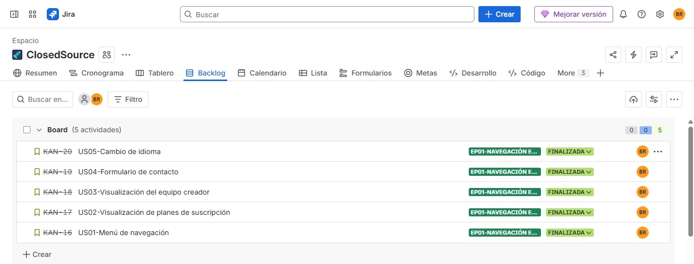
  
<em>Figura: Tablero del Sprint 1 en Jira Software (Proyecto QualiTrack)</em>

<table border="1" cellpadding="4" cellspacing="0">
  <thead>
    <tr>
      <th colspan="8" style="text-align:center;">Sprint # 1</th>
    </tr>
    <tr>
      <th colspan="2">User Story</th>
      <th colspan="6">Work-Item / Task</th>
    </tr>
    <tr>
      <th>Id</th>
      <th>Title</th>
      <th>Id</th>
      <th>Title</th>
      <th>Description</th>
      <th>Estimation (Hours)</th>
      <th>Assigned To</th>
      <th>Status</th>
    </tr>
  </thead>
  <tbody>
    <tr>
      <td rowspan="2">US01</td>
      <td rowspan="2">Menú de navegación</td>
      <td>T001</td>
      <td>Implementar navbar responsivo</td>
      <td>Estructurar el menú de navegación con los enlaces a Home, Features, Benefits, Plans y Contact.</td>
      <td>2h</td>
      <td>Ruiz Madrid, Billy</td>
      <td>Done</td>
    </tr>
    <tr>
      <td>T002</td>
      <td>Estilos y hamburger menu</td>
      <td>Aplicar estilos CSS al menú y añadir comportamiento responsive con menú hamburguesa para móvil.</td>
      <td>2h</td>
      <td>Castillo, Mauricio</td>
      <td>Done</td>
    </tr>
    <tr>
      <td rowspan="2">US02</td>
      <td rowspan="2">Visualización de planes de suscripción</td>
      <td>T003</td>
      <td>Diseñar tarjetas de planes</td>
      <td>Crear las tarjetas de los planes Standard Lab ($199/mes) y Enterprise ($599/mes) con sus características.</td>
      <td>3h</td>
      <td>Ruiz Madrid, Billy</td>
      <td>Done</td>
    </tr>
    <tr>
      <td>T004</td>
      <td>Toggle mensual/anual</td>
      <td>Implementar el toggle de cambio entre precios mensuales y anuales con descuento del 15%.</td>
      <td>2h</td>
      <td>Angulo, Marcelo</td>
      <td>Done</td>
    </tr>
    <tr>
      <td rowspan="2">US03</td>
      <td rowspan="2">Visualización del equipo creador</td>
      <td>T005</td>
      <td>Maquetar sección Our Team</td>
      <td>Implementar las tarjetas de los 5 integrantes del equipo ClosedSource con foto, nombre y descripción.</td>
      <td>2h</td>
      <td>Diaz, Daniel</td>
      <td>Done</td>
    </tr>
    <tr>
      <td>T006</td>
      <td>Correcciones sección Our Team</td>
      <td>Corregir la estructura y contenido de la sección del equipo tras revisión de pares.</td>
      <td>1h</td>
      <td>Viza, Marlon</td>
      <td>Done</td>
    </tr>
    <tr>
      <td rowspan="2">US04</td>
      <td rowspan="2">Formulario de contacto</td>
      <td>T007</td>
      <td>Implementar footer y formulario</td>
      <td>Desarrollar el footer con el formulario de suscripción por email, datos de contacto y links legales.</td>
      <td>3h</td>
      <td>Ruiz Madrid, Billy</td>
      <td>Done</td>
    </tr>
    <tr>
      <td>T008</td>
      <td>Correcciones de estructura index</td>
      <td>Corregir la estructura general del index.html para asegurar consistencia semántica y accesibilidad.</td>
      <td>2h</td>
      <td>Angulo, Marcelo</td>
      <td>Done</td>
    </tr>
    <tr>
      <td>US05</td>
      <td>Cambio de idioma</td>
      <td>T009</td>
      <td>Lógica i18n y toggle de idioma</td>
      <td>Implementar el switcher de idioma ES/EN con archivos de traducción y lógica JavaScript de i18n.</td>
      <td>3h</td>
      <td>Ruiz Madrid, Billy</td>
      <td>Done</td>
    </tr>
    <tr>
      <td rowspan="2">—</td>
      <td rowspan="2">Documentos legales</td>
      <td>T010</td>
      <td>Agregar Terms of Service</td>
      <td>Redactar e implementar la página de Términos de Servicio de QualiTrack.</td>
      <td>2h</td>
      <td>Ruiz Madrid, Billy</td>
      <td>Done</td>
    </tr>
    <tr>
      <td>T011</td>
      <td>Agregar Privacy Policy</td>
      <td>Redactar e implementar la Política de Privacidad conforme a la legislación peruana.</td>
      <td>2h</td>
      <td>Ruiz Madrid, Billy</td>
      <td>Done</td>
    </tr>
  </tbody>
</table>

#### 5.2.1.4. Development Evidence for Sprint Review

En esta sección se explican y presentan los avances en la implementación logrados durante
el Sprint 1 en relación con el Landing Page de QualiTrack. A lo largo de este sprint se
construyó la primera versión navegable del sitio, incluyendo las secciones Hero, Features,
Benefits, Plans, About Us, Team, Contact, junto con los documentos legales (Terms of
Service y Privacy Policy), correcciones de estructura y despliegue en GitHub Pages.

La tabla siguiente resume los commits realizados en el repositorio de la Landing Page,
indicando la rama, el identificador del commit, el mensaje asociado, una breve descripción
del cambio introducido y la fecha de commit.

<table border="1" cellpadding="4" cellspacing="0">
  <thead>
    <tr>
      <th>Repository</th>
      <th>Branch</th>
      <th>Commit Id</th>
      <th>Commit Message</th>
      <th>Commit Message Body</th>
      <th>Committed on (Date)</th>
    </tr>
  </thead>
  <tbody>
    <tr>
      <td rowspan="8">
        <a href="https://github.com/ClosedSource-11848/ClosedSource-LandingPage">
          ClosedSource-LandingPage
        </a>
      </td>
      <td>main</td>
      <td>09d8dfc52a792ecd6930665ffdca67510806887e</td>
      <td>chore: initial commit.</td>
      <td>Commit inicial del repositorio, creando la estructura base del proyecto del Landing Page de QualiTrack.</td>
      <td>15-04-2026</td>
    </tr>
    <tr>
      <td>main</td>
      <td>edfa9efe945509d09ed9867bb058db8745fc2409</td>
      <td>feat: add main structure and content to index</td>
      <td>Implementa la estructura HTML principal del index con todas las secciones de la Landing Page: Hero, Features, Benefits, Plans, About Us, Team y Contact.</td>
      <td>15-04-2026</td>
    </tr>
    <tr>
      <td>main</td>
      <td>9763e7c1e300b863be7440b48c73ef1472086211</td>
      <td>docs: add privacy policy compliant with peruvian law.</td>
      <td>Agrega la página de Política de Privacidad redactada conforme a la normativa peruana de protección de datos personales (Ley N.° 29733).</td>
      <td>15-04-2026</td>
    </tr>
    <tr>
      <td>main</td>
      <td>268ccfb7c24e22a36de24f1ff41d70d77840a3f8</td>
      <td>docs: add terms of service.</td>
      <td>Agrega la página de Términos de Servicio de QualiTrack, detallando las condiciones de uso de la plataforma SaaS.</td>
      <td>15-04-2026</td>
    </tr>
    <tr>
      <td>main</td>
      <td>3617ff5f54fef982480d241b20da49466731db95</td>
      <td>fix: fixed structural content of the index</td>
      <td>Corrige errores de estructura semántica del index.html, mejorando la jerarquía de etiquetas y la accesibilidad general del Landing Page.</td>
      <td>15-04-2026</td>
    </tr>
    <tr>
      <td>main</td>
      <td>2ca94f8e67de32e54dd239d0055e4fc6690bd75d</td>
      <td>fix: fixed our team section</td>
      <td>Corrige la sección Our Team ajustando el diseño y contenido de las tarjetas de los integrantes del equipo ClosedSource.</td>
      <td>15-04-2026</td>
    </tr>
    <tr>
      <td>main</td>
      <td>285f9877f14b495e17a4b779ca42571432e52424</td>
      <td>fix: fixed our team section</td>
      <td>Aplica correcciones adicionales a la sección Our Team tras revisión de pares, ajustando imágenes y descripciones de los integrantes.</td>
      <td>15-04-2026</td>
    </tr>
    <tr>
      <td>main</td>
      <td>93c3c1707f03b96d3b96544264e9c5757be4071c</td>
      <td>fix: fixed our team section</td>
      <td>Realiza la corrección final de la sección Our Team consolidando los cambios de los commits anteriores y verificando la coherencia visual con el resto del Landing Page.</td>
      <td>15-04-2026</td>
    </tr>
  </tbody>
</table>

#### 5.2.1.5. Execution Evidence for Sprint Review

Durante el Sprint 1 se implementó y validó la primera versión pública de la Landing Page
de QualiTrack. Esta entrega permitió presentar la propuesta de valor del producto a
visitantes externos, mostrando cómo la solución ayuda a laboratorios farmacéuticos a
digitalizar procesos de calidad, fortalecer la trazabilidad y apoyar el cumplimiento BPM.

La ejecución del Sprint Review se centró en verificar que un visitante pudiera navegar por
las secciones principales de la página, comprender rápidamente qué ofrece QualiTrack,
identificar los beneficios de la plataforma, revisar los planes disponibles, conocer al equipo
desarrollador y acceder a información de contacto. Además, se validó el soporte bilingüe
ES/EN y la correcta visualización de la Landing Page en el despliegue realizado mediante
GitHub Pages.

  <strong>Landing Page:</strong>
  <a href="https://closedsource-11848.github.io/ClosedSource-LandingPage/" target="_blank">
    https://closedsource-11848.github.io/ClosedSource-LandingPage/
  </a>

  <strong>Sprint 1 Demo Video:</strong>
  <a href="COLOCAR_URL_DEL_VIDEO_DEMO_SPRINT_1" target="_blank">
    COLOCAR_URL_DEL_VIDEO_DEMO_SPRINT_1
  </a>

  
  
<em>Figura: Encabezado y menú de navegación de la Landing Page. Esta vista evidencia la estructura principal de navegación pública, permitiendo que el visitante acceda a las secciones informativas del producto de forma ordenada y directa.</em>

  
  
<em>Figura: Sección Hero de QualiTrack. Esta pantalla valida la comunicación inicial de la propuesta de valor, presentando a QualiTrack como una plataforma orientada a automatizar el control de calidad, trazabilidad y cumplimiento BPM en laboratorios farmacéuticos.</em>

  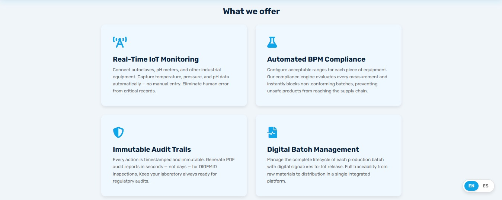
  
<em>Figura: Sección What We Offer. Esta evidencia muestra las principales funcionalidades ofrecidas por la solución, como monitoreo IoT, control de lotes, trazabilidad, alertas y soporte para procesos de calidad regulados.</em>

  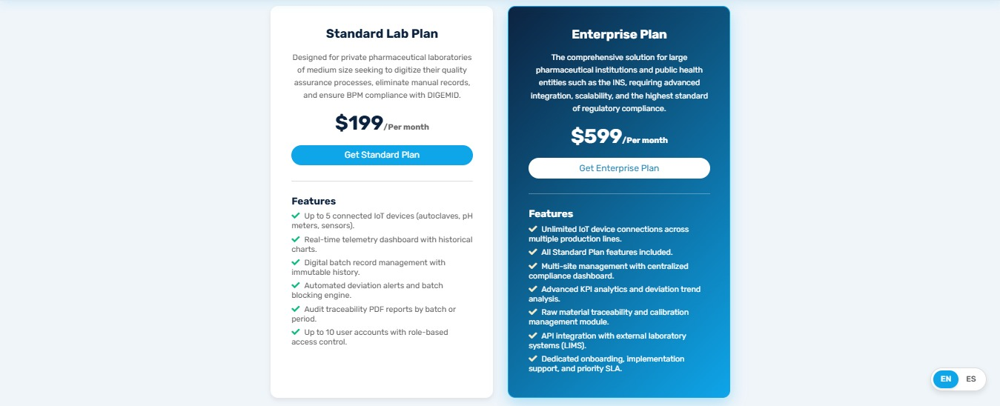
  
<em>Figura: Sección Plans. Esta vista permite que el visitante compare las alternativas comerciales disponibles, relacionando las necesidades del laboratorio con un modelo de suscripción SaaS.</em>

  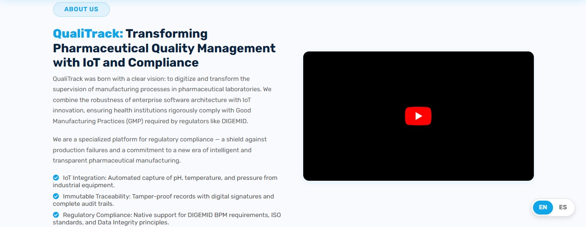
  
<em>Figura: Sección About Us. Esta evidencia presenta el propósito del producto y el problema que busca resolver, reforzando la necesidad de digitalizar procesos manuales de calidad y cumplimiento regulatorio.</em>

  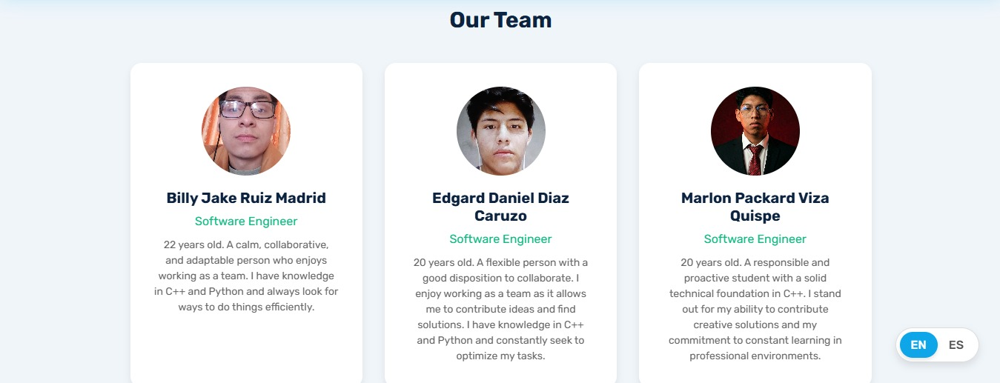
  
<em>Figura: Primera vista de la sección Our Team. Esta pantalla permite que el visitante conozca a los integrantes responsables del desarrollo de QualiTrack, aportando transparencia y confianza sobre el equipo detrás de la solución.</em>

  
  
<em>Figura: Segunda vista de la sección Our Team. Esta evidencia complementa la presentación del equipo, mostrando una Landing Page más completa y orientada a generar credibilidad frente a potenciales clientes.</em>

  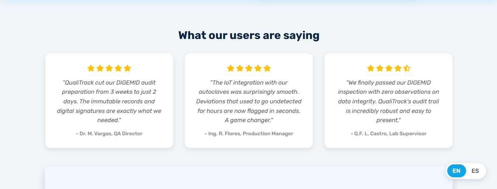
  
<em>Figura: Sección Testimonials. Esta vista evidencia el uso de testimonios como recurso de validación social, ayudando a reforzar la percepción de utilidad y confianza del producto frente a visitantes interesados.</em>

  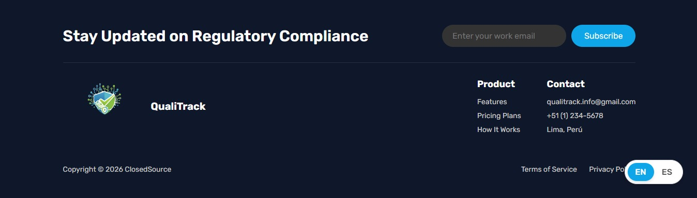
  
<em>Figura: Footer de la Landing Page. Esta evidencia muestra el cierre de la navegación pública, incluyendo accesos finales, información complementaria y enlaces a documentos legales como Terms of Service y Privacy Policy.</em>

En conjunto, estas evidencias muestran que el Sprint 1 permitió entregar una Landing Page
funcional, navegable y desplegada, alineada con el objetivo de comunicar la propuesta de
valor de QualiTrack a visitantes externos antes de implementar la aplicación interna y los
servicios backend en los siguientes sprints.

#### 5.2.1.6. Services Documentation Evidence for Sprint Review

Durante el Sprint 1 no se implementaron Web Services ni endpoints REST, debido a que el
alcance de la iteración estuvo enfocado en la primera versión pública de la Landing Page de
QualiTrack. Esta entrega correspondió a una aplicación web estática desarrollada con HTML,
CSS y JavaScript, orientada a comunicar el valor del producto, sus beneficios, planes,
equipo y canales de contacto.

<table border="1" cellpadding="4" cellspacing="0">
  <thead>
    <tr>
      <th>End Point</th>
      <th>Funciones</th>
    </tr>
  </thead>
  <tbody>
    <tr>
      <td>N/A</td>
      <td>No hay Web Services implementados en el Sprint 1 (Landing Page estático)</td>
    </tr>
  </tbody>
</table>

Por esta razón, no se generó documentación Swagger/OpenAPI ni evidencia de consumo de
servicios backend en este sprint. La implementación de Web Services para autenticación,
gestión de laboratorios, equipos, lotes, telemetría, cumplimiento, reportes y suscripciones
fue planificada para sprints posteriores, cuando el equipo inició el desarrollo de la
Frontend Web Application y la Backend REST API.

#### 5.2.1.7. Software Deployment Evidence for Sprint Review

Durante el Sprint 1 se realizó el despliegue de la primera versión pública de la Landing Page
de QualiTrack. Debido a que el alcance de este sprint estuvo enfocado en una página web
estática desarrollada con HTML, CSS y JavaScript, el equipo utilizó GitHub Pages como servicio
de hosting para publicar el sitio y permitir su acceso mediante una URL pública.

El proceso de deployment consistió en crear el repositorio <code>ClosedSource-LandingPage</code>,
subir los archivos fuente de la Landing Page, configurar la rama <code>main</code> como fuente de
publicación y seleccionar la carpeta raíz del proyecto como directorio de despliegue. Esta
configuración permitió que cada actualización enviada a la rama principal pudiera reflejarse
en la versión publicada del sitio.

Como parte de la validación del deployment, el equipo verificó que la Landing Page cargara
correctamente desde la URL pública, que las secciones principales fueran navegables, que los
estilos e imágenes se visualizaran correctamente y que los enlaces hacia documentos como
Terms of Service y Privacy Policy estuvieran disponibles para los visitantes.

  <strong>URL de Producción:</strong>
  <a href="https://closedsource-11848.github.io/ClosedSource-LandingPage/" target="_blank">
    https://closedsource-11848.github.io/ClosedSource-LandingPage/
  </a>

  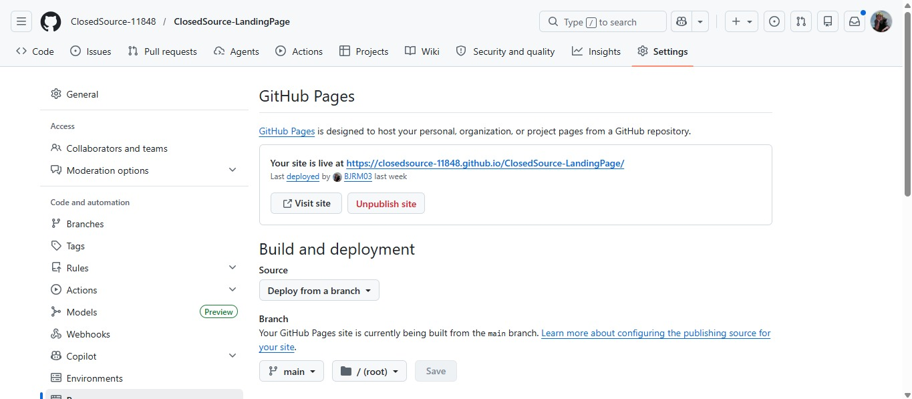
  
<em>Figura: Configuración de GitHub Pages para el despliegue de la Landing Page de QualiTrack desde la rama main del repositorio ClosedSource-LandingPage.</em>

Esta evidencia confirma que, al cierre del Sprint 1, QualiTrack contaba con una primera
presencia pública desplegada en la nube. Este despliegue permitió demostrar la propuesta de
valor del producto durante el Sprint Review y sirvió como base para conectar posteriormente
la Landing Page con la Frontend Web Application y los servicios backend desarrollados en
sprints posteriores.

#### 5.2.1.8. Team Collaboration Insights during Sprint

Durante el Sprint 1, el esfuerzo principal del equipo de ClosedSource se centró en dos
frentes paralelos: la estructuración y codificación del Landing Page, y la elaboración
de los Capítulos I al IV del Project Report. Las evidencias de colaboración de GitHub
reflejan ambas líneas de trabajo.

El <strong>Historial de Commits</strong> del repositorio
<code>ClosedSource-LandingPage</code> demuestra que el trabajo fue distribuido entre los
5 integrantes del equipo. Se observa la participación de los usuarios
<strong>BJRM03</strong> (Ruiz Madrid, Billy), <strong>Dan-trax</strong> (Diaz, Daniel),
<strong>M4uricioCastillo</strong> (Castillo, Mauricio), <strong>V8Z5</strong>
(Viza, Marlon) y <strong>Zock2005</strong> (Angulo, Marcelo), realizando commits
orientados a la implementación de contenido principal, correcciones de la sección Our
Team, estructura del index y documentos legales.

  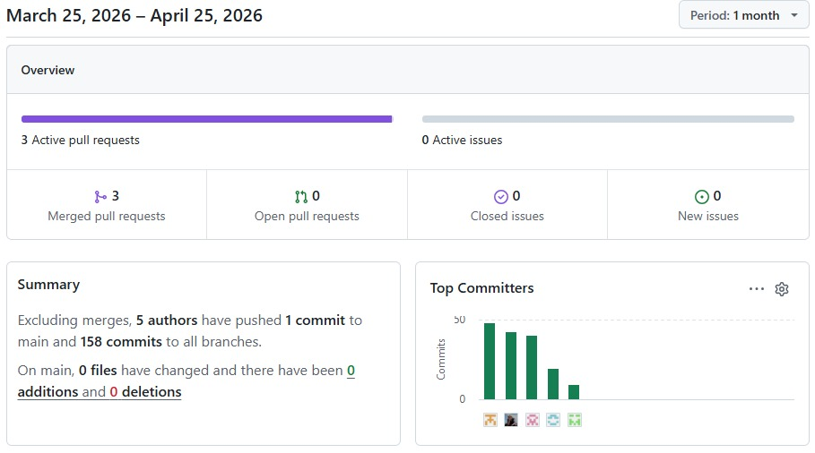
  
<em>Figura: Historial de commits del repositorio ClosedSource-LandingPage demostrando
  la participación activa de los miembros del equipo.</em>

El <strong>Network Graph</strong> de GitHub refleja que las contribuciones se realizaron
directamente sobre la rama <code>main</code>, siguiendo un flujo de integración continua
apropiado para el alcance del Sprint 1 (Landing Page estático). Esta estructura permitió
que todos los integrantes pudieran ver y revisar los cambios de sus compañeros en tiempo
real, facilitando la detección temprana de conflictos y la corrección coordinada de la
sección Our Team, que recibió tres commits de corrección consecutivos por parte de
diferentes miembros.

  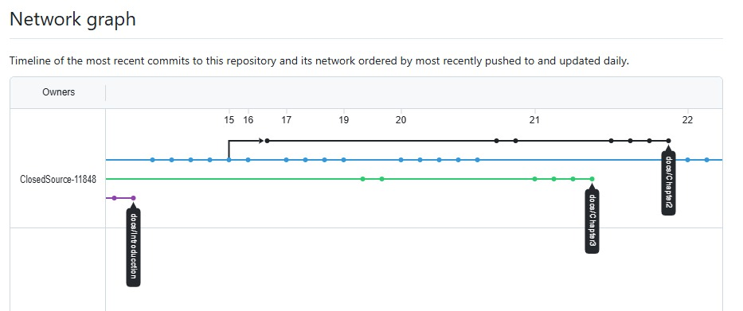
  
<em>Figura: Network Graph del repositorio ClosedSource-LandingPage mostrando el
  flujo de commits durante el Sprint 1.</em>

### 5.2.2. Sprint 2

Durante el Sprint 2, el equipo de ClosedSource se enfocó en el desarrollo e implementación
de la primera versión de la Frontend Web Application de QualiTrack, construida como una
SPA en Angular. Este sprint permitió transformar la propuesta presentada en la Landing Page
en una experiencia interna navegable para usuarios de laboratorio.

El desarrollo incluyó los módulos principales asociados a los bounded contexts del dominio:
IAM, Laboratory Management, Equipment Management, Batch Management, Compliance & Alerting,
Tracking, Reporting & Audit y Shared. La aplicación fue organizada siguiendo una estructura
inspirada en DDD, con separación entre dominio, infraestructura, aplicación y presentación.
También se implementó soporte bilingüe ES/EN, navegación mediante layout y sidebar,
componentes reutilizables, consumo de datos mediante JSON Server como fake API y despliegue
en Firebase Hosting.

  <strong>Repositorio:</strong>
  <a href="https://github.com/ClosedSource-11848/ClosedSource-Frontend" target="_blank">
    https://github.com/ClosedSource-11848/ClosedSource-Frontend
  </a>

  <strong>Frontend Web Application Desplegada:</strong>
  <a href="https://closedsource-qualitrack.web.app" target="_blank">
    https://closedsource-qualitrack.web.app
  </a>

#### 5.2.2.1. Sprint Planning 2

<table border="1" cellpadding="4" cellspacing="0">
  <thead>
    <tr>
      <th colspan="2" style="text-align: center;">Sprint Planning Sprint 2</th>
    </tr>
  </thead>
  <tbody>
    <tr>
      <td colspan="2" style="text-align: center;"><strong>Sprint Planning Background</strong></td>
    </tr>
    <tr>
      <td>Date</td>
      <td>28/04/2026</td>
    </tr>
    <tr>
      <td>Time</td>
      <td>10:00 p.m.</td>
    </tr>
    <tr>
      <td>Location</td>
      <td>Discord</td>
    </tr>
    <tr>
      <td>Prepared By</td>
      <td>Ruiz Madrid, Billy Jake</td>
    </tr>
    <tr>
      <td>Attendees (to planning meeting)</td>
      <td>
        Ruiz Madrid, Billy Jake 
        Diaz Caruzo, Edgard Daniel 
        Viza Quispe, Marlon Packard 
        Castillo Yataco, Mauricio Sebastian 
        Angulo Ramírez, Marcelo Martín
      </td>
    </tr>
    <tr>
      <td colspan="2" style="text-align: center;"><strong>Sprint 1 Review Summary</strong></td>
    </tr>
    <tr>
      <td colspan="2">
        Se completó el desarrollo y despliegue de la Landing Page de QualiTrack en GitHub
        Pages, incluyendo las secciones Hero, Features, Benefits, Plans, About Us, Team y
        Contact, además del soporte bilingüe ES/EN y los documentos legales Terms of Service
        y Privacy Policy. Durante la revisión se confirmó que la página permitía comunicar
        la propuesta de valor del producto a visitantes externos.
      </td>
    </tr>
    <tr>
      <td colspan="2" style="text-align: center;"><strong>Sprint 1 Retrospective Summary</strong></td>
    </tr>
    <tr>
      <td colspan="2">
        El equipo identificó que algunos cambios se concentraron en las mismas secciones
        de la Landing Page, especialmente en componentes visuales y contenido del equipo.
        Como acción de mejora para el Sprint 2, se acordó organizar el trabajo por módulos
        de la aplicación, usar ramas feature por bounded context y realizar revisiones antes
        de integrar cambios principales.
      </td>
    </tr>
    <tr>
      <td colspan="2" style="text-align: center;"><strong>Sprint Goal & User Stories</strong></td>
    </tr>
    <tr>
      <td colspan="2">
        <strong>Sprint 2 Goal (Outcome–Impact–Customer–Confirmation):</strong>  
        <em>
          Our focus is on allowing laboratory users to explore the main QualiTrack
          operational workflows through the first navigable Angular web application.
        </em>  
        <em>
          We believe it delivers a clearer understanding of how QA Managers and Lab
          Operators would use QualiTrack in their daily work by letting them simulate
          authentication, laboratory management, equipment control, batch traceability,
          compliance alerts, telemetry monitoring and KPI/reporting views from a unified
          interface.
        </em>  
        <em>
          This will be confirmed when a user can sign in or sign up, navigate through the
          sidebar modules, view and manage laboratory information, products, raw materials
          and staff, inspect equipment and BPM parameters, consult batches, review alerts,
          access telemetry and KPI dashboards, switch between English and Spanish, and use
          the deployed Firebase version connected to JSON Server test data.
        </em>
      </td>
    </tr>
    <tr>
      <td>Sprint 2 Velocity</td>
      <td>32 Story Points</td>
    </tr>
    <tr>
      <td>Sum of Story Points</td>
      <td>32 SP</td>
    </tr>
  </tbody>
</table>

#### 5.2.2.2. Aspect Leaders and Collaborators

En esta sección se presenta la matriz <strong>Leadership-and-Collaboration (LACX)</strong>
correspondiente al Sprint 2. Su propósito es identificar claramente los aspectos
principales del sprint y asignar responsabilidades de liderazgo (<strong>L</strong>) y
colaboración (<strong>C</strong>) para fortalecer la coordinación y trazabilidad del
trabajo dentro del equipo ClosedSource.

Los aspectos se derivan directamente de los objetivos del Sprint 2 Goal:

<ul>
  <li><strong>Shared & IAM:</strong> Componentes base reutilizables (layout, toolbar,
  footer, language switcher, API gateway), módulo de autenticación (sign-in, sign-up)
  e internacionalización (i18n).</li>
  <li><strong>Domain Modules (Laboratory, Equipment, Batch):</strong> Implementación de
  las capas de dominio, infraestructura y presentación para los Bounded Contexts de
  gestión de laboratorio, equipos y lotes.</li>
  <li><strong>Domain Modules (CA, Tracking, RA) & Deployment:</strong> Implementación de
  los módulos de Compliance & Alerting, Tracking IoT y Reporting & Audit, configuración
  de JSON Server como fake API y despliegue en Firebase Hosting.</li>
</ul>

<table border="1" cellpadding="4" cellspacing="0" align="center">
  <thead>
    <tr>
      <th>Team Member (Last Name, First Name)</th>
      <th>Aspect: Shared & IAM</th>
      <th>Aspect: Laboratory, Equipment & Batch</th>
      <th>Aspect: CA, Tracking, RA & Deployment</th>
    </tr>
  </thead>
  <tbody>
    <tr>
      <td>Ruiz Madrid, Billy Jake</td>
      <td>L</td><td>L</td><td>L</td>
    </tr>
    <tr>
      <td>Diaz Caruzo, Edgard Daniel</td>
      <td>C</td><td>L</td><td>C</td>
    </tr>
    <tr>
      <td>Viza Quispe, Marlon Packard</td>
      <td>C</td><td>C</td><td>C</td>
    </tr>
    <tr>
      <td>Castillo Yataco, Mauricio Sebastian</td>
      <td>C</td><td>C</td><td>C</td>
    </tr>
    <tr>
      <td>Angulo Ramírez, Marcelo Martín</td>
      <td>C</td><td>C</td><td>L</td>
    </tr>
  </tbody>
</table>

<ul>
  <li><strong>L</strong> = Líder del aspecto</li>
  <li><strong>C</strong> = Colaborador en el aspecto</li>
</ul>

#### 5.2.2.3. Sprint Backlog 2

El Sprint Backlog 2 reúne las historias de usuario y tareas necesarias para implementar
la primera versión de la Frontend Web Application de QualiTrack, organizada por Bounded
Contexts. Todas las tareas son monitoreadas mediante <strong>Jira Software</strong>.

  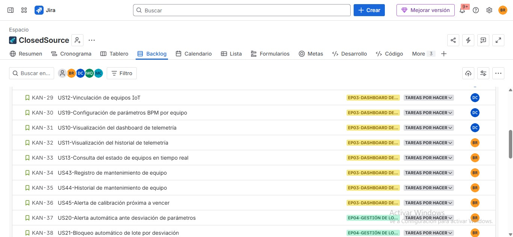
  
<em>Figura: Tablero del Sprint 2 en Jira Software (Proyecto QualiTrack)</em>

<table border="1" cellpadding="4" cellspacing="0">
  <thead>
    <tr>
      <th colspan="8" style="text-align:center;">Sprint # 2</th>
    </tr>
    <tr>
      <th colspan="2">User Story</th>
      <th colspan="6">Work-Item / Task</th>
    </tr>
    <tr>
      <th>Id</th>
      <th>Title</th>
      <th>Id</th>
      <th>Title</th>
      <th>Description</th>
      <th>Estimation (Hours)</th>
      <th>Assigned To</th>
      <th>Status</th>
    </tr>
  </thead>
  <tbody>
    <!-- Shared -->
    <tr>
      <td rowspan="3">US06</td>
      <td rowspan="3">Componentes base y layout principal</td>
      <td>T012</td>
      <td>Implementar layout, toolbar y footer</td>
      <td>Desarrollar el componente de layout principal con navigation toolbar, sidebar colapsable y footer con créditos de tecnología.</td>
      <td>4h</td>
      <td>Ruiz Madrid, Billy</td>
      <td>Done</td>
    </tr>
    <tr>
      <td>T013</td>
      <td>Implementar language switcher e i18n</td>
      <td>Desarrollar el componente de cambio de idioma (ES/EN) y configurar archivos de localización para todas las vistas.</td>
      <td>3h</td>
      <td>Ruiz Madrid, Billy</td>
      <td>Done</td>
    </tr>
    <tr>
      <td>T014</td>
      <td>Implementar clases base de API gateway</td>
      <td>Crear las clases abstractas BaseService y BaseEndpoint con manejo de errores para consumo de la fake API.</td>
      <td>2h</td>
      <td>Ruiz Madrid, Billy</td>
      <td>Done</td>
    </tr>
    <!-- IAM -->
    <tr>
      <td rowspan="2">US07</td>
      <td rowspan="2">Autenticación de usuario</td>
      <td>T015</td>
      <td>Implementar vistas sign-in y sign-up</td>
      <td>Desarrollar los formularios de inicio de sesión y registro con validación, entidad User y comandos de autenticación.</td>
      <td>4h</td>
      <td>Ruiz Madrid, Billy</td>
      <td>Done</td>
    </tr>
    <tr>
      <td>T016</td>
      <td>Implementar IAM store y API services</td>
      <td>Desarrollar el store de autenticación, endpoints, assemblers y gestión de estado para el módulo IAM.</td>
      <td>3h</td>
      <td>Ruiz Madrid, Billy</td>
      <td>Done</td>
    </tr>
    <!-- Laboratory -->
    <tr>
      <td rowspan="3">US08</td>
      <td rowspan="3">Gestión del perfil del laboratorio</td>
      <td>T017</td>
      <td>Implementar entidades y comandos de Laboratory</td>
      <td>Crear entidades de dominio (Laboratory, Product, RawMaterial, Staff) y comandos para el bounded context Laboratory Management.</td>
      <td>3h</td>
      <td>Ruiz Madrid, Billy</td>
      <td>Done</td>
    </tr>
    <tr>
      <td>T018</td>
      <td>Implementar API services y store de Laboratory</td>
      <td>Desarrollar endpoints, assemblers, request/response contracts y store con gestión de estado para laboratorio, productos, materias primas y personal.</td>
      <td>4h</td>
      <td>Viza, Marlon</td>
      <td>Done</td>
    </tr>
    <tr>
      <td>T019</td>
      <td>Implementar vistas de Laboratory</td>
      <td>Desarrollar las vistas de perfil de laboratorio, catálogo de productos, formularios de productos, lista de materias primas y gestión de personal.</td>
      <td>5h</td>
      <td>Ruiz Madrid, Billy</td>
      <td>Done</td>
    </tr>
    <!-- Equipment -->
    <tr>
      <td rowspan="3">US09</td>
      <td rowspan="3">Gestión de equipos IoT</td>
      <td>T020</td>
      <td>Implementar entidades y comandos de Equipment</td>
      <td>Crear entidades de dominio para equipos, registros de mantenimiento y configuración de parámetros BPM.</td>
      <td>3h</td>
      <td>Diaz, Daniel</td>
      <td>Done</td>
    </tr>
    <tr>
      <td>T021</td>
      <td>Implementar API services y store de Equipment</td>
      <td>Desarrollar servicios API, data transformers para configuración BPM, ciclo de vida de mantenimiento, endpoints y assemblers.</td>
      <td>4h</td>
      <td>Diaz, Daniel</td>
      <td>Done</td>
    </tr>
    <tr>
      <td>T022</td>
      <td>Implementar vistas de Equipment</td>
      <td>Desarrollar las vistas de lista de equipos, vista detallada, formularios de registro, alertas de calibración e historial de mantenimiento.</td>
      <td>5h</td>
      <td>Ruiz Madrid, Billy</td>
      <td>Done</td>
    </tr>
    <!-- Batch -->
    <tr>
      <td rowspan="3">US10</td>
      <td rowspan="3">Gestión de lotes farmacéuticos</td>
      <td>T023</td>
      <td>Implementar entidades y comandos de Batch</td>
      <td>Crear entidades de dominio para lotes farmacéuticos, ciclo de vida del lote y uso de materias primas.</td>
      <td>3h</td>
      <td>Castillo, Mauricio</td>
      <td>Done</td>
    </tr>
    <tr>
      <td>T024</td>
      <td>Implementar API services y store de Batch</td>
      <td>Desarrollar servicios API, endpoints, assemblers, request/response contracts y store con estado basado en signals.</td>
      <td>4h</td>
      <td>Castillo, Mauricio</td>
      <td>Done</td>
    </tr>
    <tr>
      <td>T025</td>
      <td>Implementar vistas de Batch</td>
      <td>Desarrollar la tabla de lista de lotes y vista detallada de gestión de lotes con navegación y lazy loading.</td>
      <td>4h</td>
      <td>Ruiz Madrid, Billy</td>
      <td>Done</td>
    </tr>
    <!-- Compliance & Alerting -->
    <tr>
      <td rowspan="3">US11</td>
      <td rowspan="3">Dashboard de alertas y compliance</td>
      <td>T026</td>
      <td>Implementar entidades de CA</td>
      <td>Crear entidades para eventos de compliance, alertas de desviación y preferencias de notificación.</td>
      <td>3h</td>
      <td>Angulo, Marcelo</td>
      <td>Done</td>
    </tr>
    <tr>
      <td>T027</td>
      <td>Implementar API services y store de CA</td>
      <td>Desarrollar servicios API, endpoints, assemblers, response contracts y store con métodos para alertas y eventos de compliance.</td>
      <td>4h</td>
      <td>Angulo, Marcelo</td>
      <td>Done</td>
    </tr>
    <tr>
      <td>T028</td>
      <td>Implementar vistas de CA</td>
      <td>Desarrollar el dashboard de alertas y la vista de historial de compliance con routing y navegación.</td>
      <td>4h</td>
      <td>Ruiz Madrid, Billy</td>
      <td>Done</td>
    </tr>
    <!-- Tracking -->
    <tr>
      <td rowspan="2">US12</td>
      <td rowspan="2">Dashboard de telemetría IoT</td>
      <td>T029</td>
      <td>Implementar entidades, API y store de Tracking</td>
      <td>Crear entidades para telemetría, mediciones y estado de equipos, junto con servicios API, endpoints, assemblers y store.</td>
      <td>4h</td>
      <td>Ruiz Madrid, Billy</td>
      <td>Done</td>
    </tr>
    <tr>
      <td>T030</td>
      <td>Implementar dashboard de telemetría</td>
      <td>Desarrollar el dashboard de telemetría en tiempo real con tarjetas de estado de equipos y rutas del módulo tracking.</td>
      <td>4h</td>
      <td>Ruiz Madrid, Billy</td>
      <td>Done</td>
    </tr>
    <!-- Reporting & Audit -->
    <tr>
      <td rowspan="2">US13</td>
      <td rowspan="2">Reportes y auditoría</td>
      <td>T031</td>
      <td>Implementar entidades, API y store de RA</td>
      <td>Crear entidades para audit logs, KPIs y generación de reportes, junto con servicios API, endpoints, assemblers y store.</td>
      <td>4h</td>
      <td>Ruiz Madrid, Billy</td>
      <td>Done</td>
    </tr>
    <tr>
      <td>T032</td>
      <td>Implementar vistas de RA</td>
      <td>Desarrollar el dashboard de KPIs, gráfico de tendencias de desviación y generador de reportes con rutas del módulo.</td>
      <td>4h</td>
      <td>Ruiz Madrid, Billy</td>
      <td>Done</td>
    </tr>
    <!-- Configuración y Despliegue -->
    <tr>
      <td rowspan="2">—</td>
      <td rowspan="2">Configuración y despliegue</td>
      <td>T033</td>
      <td>Configurar JSON Server (fake API)</td>
      <td>Configurar JSON Server como mock backend con datos de prueba para todos los bounded contexts y scripts de inicio.</td>
      <td>3h</td>
      <td>Ruiz Madrid, Billy</td>
      <td>Done</td>
    </tr>
    <tr>
      <td>T034</td>
      <td>Configurar y desplegar en Firebase Hosting</td>
      <td>Configurar Firebase Hosting, build de producción Angular y despliegue de la Frontend Web Application.</td>
      <td>2h</td>
      <td>Ruiz Madrid, Billy</td>
      <td>Done</td>
    </tr>
  </tbody>
</table>

#### 5.2.2.4. Development Evidence for Sprint Review

En esta sección se explican y presentan los avances en la implementación logrados durante
el Sprint 2 en relación con la Frontend Web Application de QualiTrack. A lo largo de este
sprint se construyó la primera versión funcional de la SPA Angular, implementando todos los
Bounded Contexts del dominio farmacéutico con arquitectura DDD (entidades, comandos,
servicios API, stores y vistas), soporte bilingüe, consumo de fake API mediante JSON Server
y despliegue en Firebase Hosting.

La tabla siguiente resume los commits más relevantes realizados en el repositorio del
Frontend, indicando la rama, el identificador del commit, el mensaje asociado, una breve
descripción del cambio introducido y la fecha de commit.

<table border="1" cellpadding="4" cellspacing="0">
  <thead>
    <tr>
      <th>Repository</th>
      <th>Branch</th>
      <th>Commit Id</th>
      <th>Commit Message</th>
      <th>Commit Message Body</th>
      <th>Committed on (Date)</th>
    </tr>
  </thead>
  <tbody>
    <tr>
      <td rowspan="20">
        <a href="https://github.com/ClosedSource-11848/ClosedSource-Frontend">
          ClosedSource-Frontend
        </a>
      </td>
      <td>feature/shared</td>
      <td>7f3a91b</td>
      <td>feat(shared): add layout, home view, footer and toolbar components.</td>
      <td>Implementa el componente de layout principal con navigation toolbar, sidebar, home view y footer con créditos de tecnología.</td>
      <td>30-04-2026</td>
    </tr>
    <tr>
      <td>feature/shared</td>
      <td>a5c92ef</td>
      <td>feat(api): add abstract base classes for api gateway and endpoints with error handling.</td>
      <td>Crea las clases abstractas BaseService y BaseEndpoint para el consumo estandarizado de la fake API con manejo de errores centralizado.</td>
      <td>30-04-2026</td>
    </tr>
    <tr>
      <td>feature/laboratory</td>
      <td>61ef8cb</td>
      <td>feat(laboratory): add entities and commands for laboratory, products, raw materials and staff.</td>
      <td>Crea las entidades de dominio y comandos para el bounded context Laboratory Management.</td>
      <td>02-05-2026</td>
    </tr>
    <tr>
      <td>feature/laboratory</td>
      <td>98d2c1e</td>
      <td>feat(laboratory): add views for lab profile, product catalog, raw materials and staff management.</td>
      <td>Implementa las vistas de perfil de laboratorio, catálogo de productos, gestión de materias primas y personal.</td>
      <td>02-05-2026</td>
    </tr>
    <tr>
      <td>feature/equipment</td>
      <td>e91bc8f</td>
      <td>feat(equipment): add entities and commands for equipment, maintenance and bpm configuration.</td>
      <td>Crea las entidades de dominio para equipos IoT, registros de mantenimiento y configuración de parámetros BPM.</td>
      <td>03-05-2026</td>
    </tr>
    <tr>
      <td>feature/equipment</td>
      <td>91de5c7</td>
      <td>feat(equipment): add equipment list, form and detail views.</td>
      <td>Desarrolla las vistas de listado de equipos, formulario de registro y vista detallada con información de BPM.</td>
      <td>03-05-2026</td>
    </tr>
    <tr>
      <td>feature/batch</td>
      <td>7abf22d</td>
      <td>feat(batch): add entities and commands for batch lifecycle and raw material usage.</td>
      <td>Crea entidades de dominio para el ciclo de vida de lotes farmacéuticos y uso de materias primas.</td>
      <td>04-05-2026</td>
    </tr>
    <tr>
      <td>feature/batch</td>
      <td>c82ab67</td>
      <td>feat(batch): add batch list, detail and form views.</td>
      <td>Implementa las vistas de lista de lotes, vista detallada y formulario de gestión de lotes.</td>
      <td>04-05-2026</td>
    </tr>
    <tr>
      <td>feature/ca</td>
      <td>52df1ab</td>
      <td>feat(ca): add entities and commands for compliance events, alerts and notification preferences.</td>
      <td>Crea entidades para eventos de compliance, alertas de desviación y preferencias de notificación del módulo CA.</td>
      <td>04-05-2026</td>
    </tr>
    <tr>
      <td>feature/ca</td>
      <td>84ce2fa</td>
      <td>feat(ca): add alert dashboard and history views.</td>
      <td>Desarrolla el dashboard de alertas de desviación y la vista de historial de compliance.</td>
      <td>04-05-2026</td>
    </tr>
    <tr>
      <td>feature/ra</td>
      <td>fa28bc7</td>
      <td>feat(ra): add entities and commands for audit logs, KPIs and report generation.</td>
      <td>Crea entidades de dominio para logs de auditoría, indicadores clave de rendimiento y generación de reportes.</td>
      <td>05-05-2026</td>
    </tr>
    <tr>
      <td>feature/ra</td>
      <td>1cd82fa</td>
      <td>feat(ra): add deviation trend chart view.</td>
      <td>Implementa la vista de gráfico de tendencias de desviación para el módulo de Reporting & Audit.</td>
      <td>05-05-2026</td>
    </tr>
    <tr>
      <td>feature/tracking</td>
      <td>4fd91ac</td>
      <td>feat(tracking): add entities for telemetry, measurements and equipment status.</td>
      <td>Crea entidades de dominio para telemetría IoT, mediciones en tiempo real y estado de equipos.</td>
      <td>08-05-2026</td>
    </tr>
    <tr>
      <td>feature/tracking</td>
      <td>58fd3a2</td>
      <td>feat(tracking): add telemetry dashboard and equipment status card.</td>
      <td>Desarrolla el dashboard de telemetría en tiempo real con tarjetas de estado de equipos IoT.</td>
      <td>08-05-2026</td>
    </tr>
    <tr>
      <td>develop</td>
      <td>d82bc17</td>
      <td>chore(mockapi): add mock api configuration and startup scripts.</td>
      <td>Configura JSON Server como fake API con datos de prueba para todos los bounded contexts y scripts de inicio.</td>
      <td>11-05-2026</td>
    </tr>
    <tr>
      <td>feature/equipment</td>
      <td>7ce11af</td>
      <td>feat(equipment): add equipment list, detailed view and registration forms.</td>
      <td>Actualiza las vistas de equipos con mejoras en la lista, vista detallada y formularios de registro (aporte de Dan-trax).</td>
      <td>12-05-2026</td>
    </tr>
    <tr>
      <td>feature/batch</td>
      <td>2ab77fd</td>
      <td>feat(batch): add batch list table and detailed management view.</td>
      <td>Actualiza la tabla de lista de lotes y la vista de gestión detallada de lotes (aporte de M4uricioCastillo).</td>
      <td>12-05-2026</td>
    </tr>
    <tr>
      <td>feature/laboratory</td>
      <td>91fa2bc</td>
      <td>feat(laboratory): add laboratory store management.</td>
      <td>Implementa la gestión de estado del store de laboratorio con señales reactivas (aporte de BJRM03).</td>
      <td>13-05-2026</td>
    </tr>
    <tr>
      <td>feature/iam</td>
      <td>4bc28e1</td>
      <td>feat(iam): add sign-in and sign-up views.</td>
      <td>Implementa los formularios de autenticación (sign-in y sign-up) con validación de campos y navegación entre vistas.</td>
      <td>13-05-2026</td>
    </tr>
    <tr>
      <td>feature/iam</td>
      <td>b2d91fa</td>
      <td>feat(iam): add api services, endpoints and mappers for iam.</td>
      <td>Desarrolla los servicios API, endpoints REST y mappers de datos para el módulo de Identity and Access Management.</td>
      <td>13-05-2026</td>
    </tr>
  </tbody>
</table>

#### 5.2.2.5. Execution Evidence for Sprint Review

Durante el Sprint 2 se completó la primera versión funcional de la Frontend Web Application
de QualiTrack. Esta entrega permitió demostrar una SPA desarrollada en Angular con navegación
interna, módulos organizados por bounded context, soporte bilingüe ES/EN y consumo de datos
mediante JSON Server como fake API.

La ejecución del Sprint Review se enfocó en validar que un usuario pudiera ingresar a la
aplicación, navegar por los módulos principales desde el layout interno, consultar información
de laboratorio, equipos, lotes, alertas, telemetría y reportes, y comprender cómo sería la
experiencia operativa de QualiTrack antes de la integración con el backend real.

  <strong>Frontend Web Application:</strong>
  <a href="https://closedsource-qualitrack.web.app" target="_blank">
    https://closedsource-qualitrack.web.app
  </a>

  <strong>Sprint 2 Demo Video:</strong>
  <a href="COLOCAR_URL_DEL_VIDEO_DEMO_SPRINT_2" target="_blank">
    COLOCAR_URL_DEL_VIDEO_DEMO_SPRINT_2
  </a>

  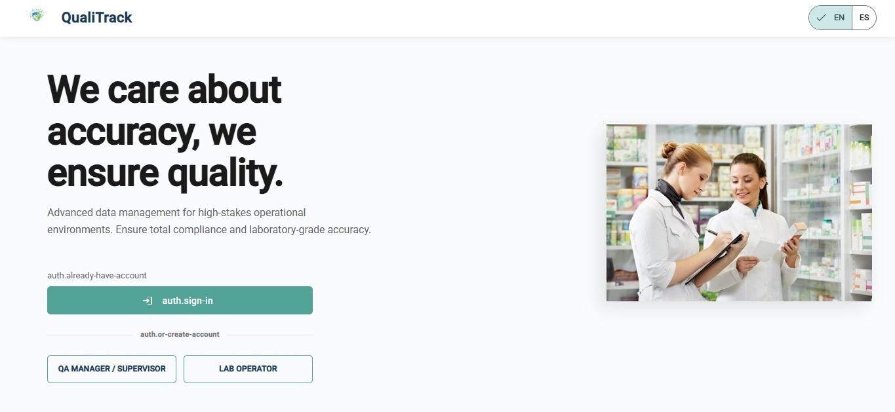
  
<em>Figura: Vista Home de la aplicación web. Esta pantalla evidencia el punto de entrada de la Frontend Web Application y permite validar la navegación inicial hacia las funcionalidades internas de QualiTrack.</em>

  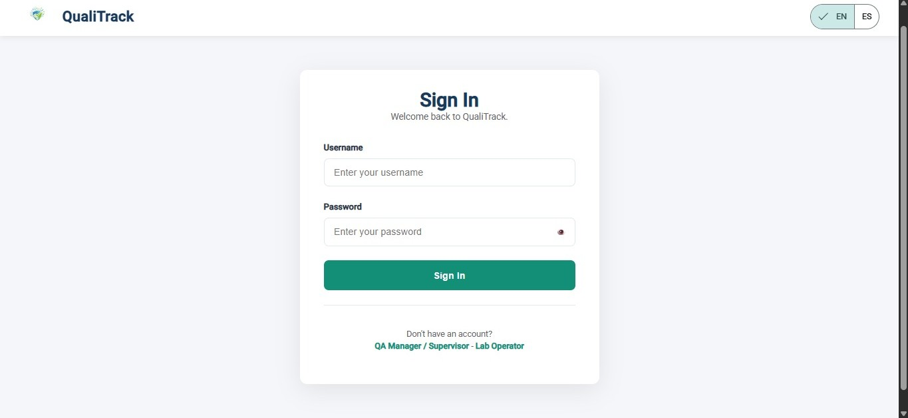
  
<em>Figura: Pantalla de Sign-In. Esta evidencia muestra el primer flujo de autenticación simulado, permitiendo representar cómo un usuario accedería a la plataforma antes de integrar el bounded context IAM con el backend real.</em>

  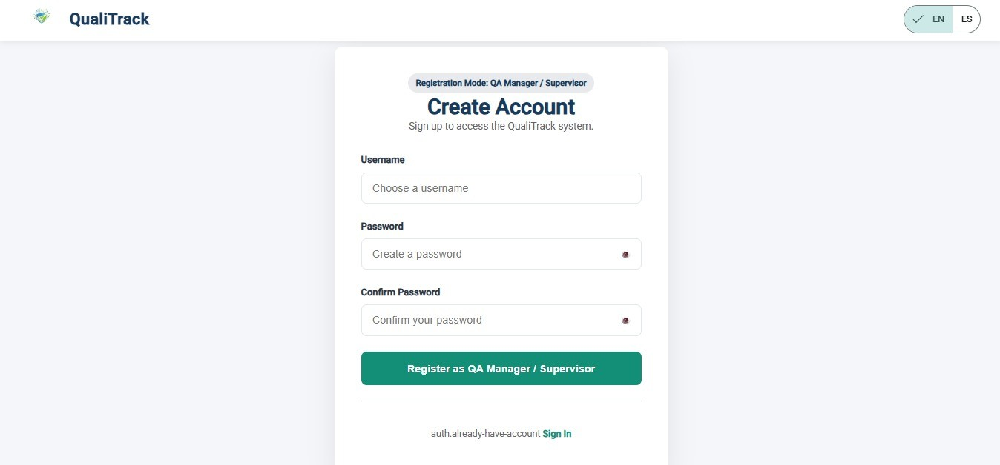
  
<em>Figura: Pantalla de Sign-Up. Esta vista valida el registro de usuarios en la primera versión frontend, incluyendo la estructura visual del formulario y el flujo previo a la autenticación real.</em>

  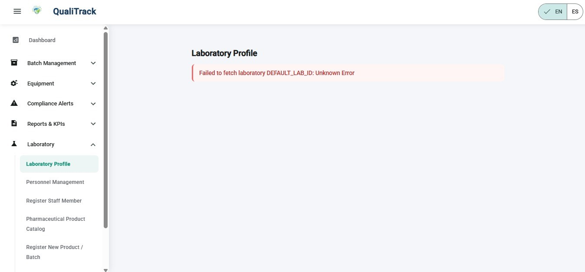
  
<em>Figura: Módulo Laboratory - Perfil del laboratorio. Esta evidencia muestra la visualización de datos institucionales del laboratorio, permitiendo representar cómo un QA Manager revisaría información básica como nombre, RUC, dirección, contacto y regulaciones aplicables.</em>

  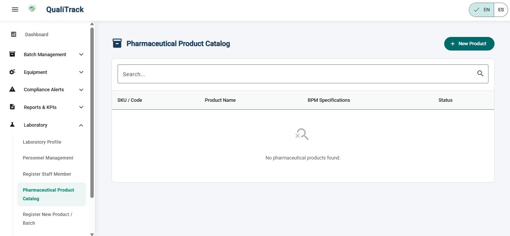
  
<em>Figura: Módulo Laboratory - Catálogo de productos. Esta pantalla evidencia la gestión visual de productos farmacéuticos registrados, información necesaria para relacionar productos con lotes de producción en los flujos posteriores.</em>

  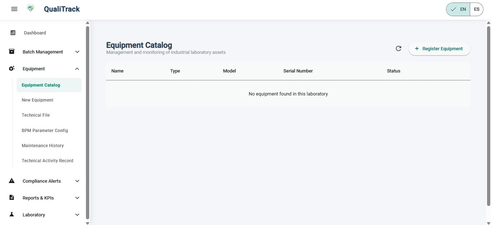
  
<em>Figura: Módulo Equipment - Lista de equipos. Esta vista valida la presentación del catálogo de equipos industriales del laboratorio, mostrando información resumida como nombre, tipo, modelo, número de serie y estado operativo.</em>

  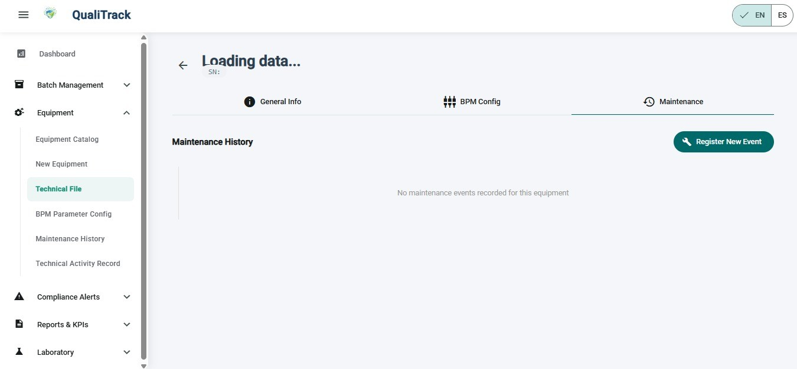
  
<em>Figura: Módulo Equipment - Detalle de equipo. Esta evidencia muestra la navegación hacia una vista específica de equipo, donde se organizan datos generales, configuración BPM y mantenimiento, anticipando los flujos operativos integrados en sprints posteriores.</em>

  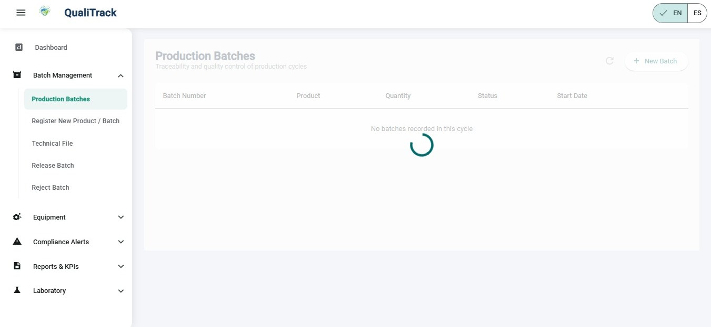
  
<em>Figura: Módulo Batch - Lista de lotes. Esta pantalla evidencia la consulta de lotes de producción, permitiendo validar la estructura visual para trazabilidad del ciclo productivo y revisión de estados de lote.</em>

  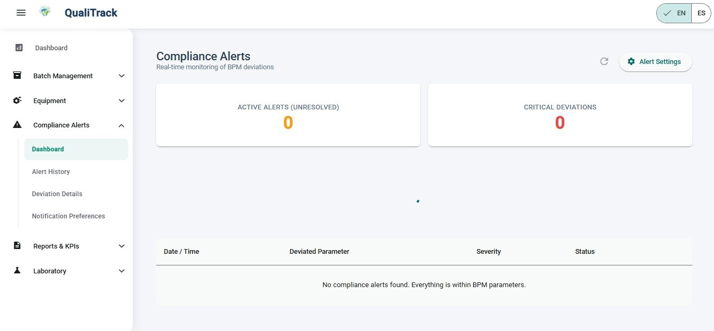
  
<em>Figura: Módulo Compliance & Alerting - Dashboard de alertas. Esta evidencia muestra la vista destinada a monitorear alertas de cumplimiento y desviaciones, permitiendo al usuario identificar eventos relevantes dentro del proceso de calidad.</em>

  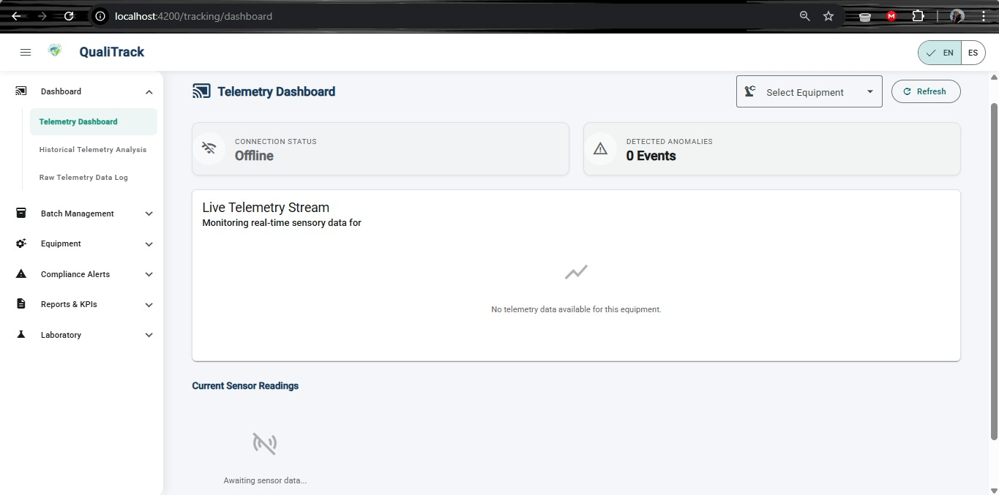
  
<em>Figura: Módulo Tracking - Dashboard de telemetría. Esta vista evidencia la representación frontend del monitoreo IoT, mostrando cómo se visualizarían estados, mediciones y eventos de equipos conectados.</em>

  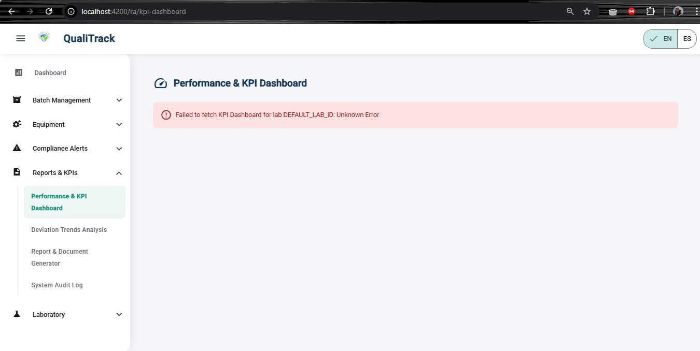
  
<em>Figura: Módulo Reporting & Audit - KPI Dashboard. Esta evidencia muestra la visualización de indicadores de calidad, permitiendo representar cómo los usuarios podrían revisar métricas clave del laboratorio desde una interfaz centralizada.</em>

En conjunto, estas evidencias muestran que el Sprint 2 permitió entregar una primera
experiencia interna navegable de QualiTrack. Aunque los datos aún provenían de una fake API,
la aplicación permitió validar la estructura visual, la organización por módulos, la navegación
principal, el soporte bilingüe y los flujos operativos que luego serían conectados al backend
real en el Sprint 3.

#### 5.2.2.6. Services Documentation Evidence for Sprint Review

En el Sprint 2, el equipo implementó la Frontend Web Application de QualiTrack conectada a
una fake API alojada en la nube mediante <strong>Beeceptor</strong>. Se configuraron diversas reglas de simulación (mock rules) que
replican la estructura de los Web Services RESTful planificados para el Backend, permitiendo probar la reactividad del Dashboard en tiempo real. La
implementación y documentación de los Web Services reales con Spring Boot y Swagger se
abordará en los sprints posteriores orientados al Backend.

<table border="1" cellpadding="4" cellspacing="0">
  <thead>
    <tr>
      <th>End Point Base (Beeceptor)</th>
      <th>Método HTTP</th>
      <th>Acción Implementada (Funciones)</th>
      <th>Sintaxis de Llamada (Ejemplo)</th>
      <th>Explicación del Response</th>
    </tr>
  </thead>
  <tbody>
    <tr>
      <td rowspan="3"><strong>/laboratories</strong></td>
      <td><strong>GET</strong></td>
      <td>Obtener listado de laboratorios.</td>
      <td><code>GET /laboratories</code></td>
      <td><code>200 OK</code>: Array JSON de objetos Laboratory.</td>
    </tr>
    <tr>
      <td><strong>GET</strong></td>
      <td>Obtener laboratorio por ID.</td>
      <td><code>GET /laboratories/{id}</code></td>
      <td><code>200 OK</code>: Objeto Laboratory. <code>404</code> si no existe.</td>
    </tr>
    <tr>
      <td><strong>POST</strong></td>
      <td>Crear un nuevo laboratorio.</td>
      <td><code>POST /laboratories</code></td>
      <td><code>201 Created</code>: Objeto Laboratory creado con ID asignado.</td>
    </tr>
    <tr>
      <td rowspan="2"><strong>/products</strong></td>
      <td><strong>GET</strong></td>
      <td>Obtener catálogo de productos farmacéuticos.</td>
      <td><code>GET /products</code></td>
      <td><code>200 OK</code>: Array JSON de objetos Product.</td>
    </tr>
    <tr>
      <td><strong>POST</strong></td>
      <td>Registrar un nuevo producto.</td>
      <td><code>POST /products</code></td>
      <td><code>201 Created</code>: Objeto Product creado.</td>
    </tr>
    <tr>
      <td rowspan="2"><strong>/equipment</strong></td>
      <td><strong>GET</strong></td>
      <td>Obtener listado de equipos IoT.</td>
      <td><code>GET /equipment</code></td>
      <td><code>200 OK</code>: Array JSON de objetos Equipment.</td>
    </tr>
    <tr>
      <td><strong>POST</strong></td>
      <td>Registrar nuevo equipo con parámetros BPM.</td>
      <td><code>POST /equipment</code></td>
      <td><code>201 Created</code>: Objeto Equipment creado.</td>
    </tr>
    <tr>
      <td rowspan="2"><strong>/batches</strong></td>
      <td><strong>GET</strong></td>
      <td>Obtener listado de lotes farmacéuticos.</td>
      <td><code>GET /batches</code></td>
      <td><code>200 OK</code>: Array JSON de objetos Batch.</td>
    </tr>
    <tr>
      <td><strong>POST</strong></td>
      <td>Crear un nuevo lote farmacéutico.</td>
      <td><code>POST /batches</code></td>
      <td><code>201 Created</code>: Objeto Batch creado.</td>
    </tr>
    <tr>
      <td><strong>/alerts</strong></td>
      <td><strong>GET</strong></td>
      <td>Obtener alertas de desviación BPM.</td>
      <td><code>GET /alerts</code></td>
      <td><code>200 OK</code>: Array JSON de objetos DeviationAlert.</td>
    </tr>
    <tr>
      <td rowspan="3"><strong>/telemetry</strong> <em>(Endpoints de Monitoreo)</em></td>
      <td><strong>GET</strong></td>
      <td>Obtener lecturas actuales de los sensores (Mediciones).</td>
      <td><code>GET /measurements</code></td>
      <td><code>200 OK</code>: JSON envuelto en la propiedad <code>measurements</code> con array de objetos MeasurementResource.</td>
    </tr>
    <tr>
      <td><strong>GET</strong></td>
      <td>Obtener historial de telemetría y detección de anomalías.</td>
      <td><code>GET /history?equipmentId=EQ-001</code></td>
      <td><code>200 OK</code>: JSON envuelto en <code>historyPoints</code> con array de puntos para el gráfico.</td>
    </tr>
    <tr>
      <td><strong>GET</strong></td>
      <td>Obtener estado actual de conexión del equipo (Online/Offline).</td>
      <td><code>GET /status/{equipmentId}</code></td>
      <td><code>200 OK</code>: Objeto JSON único con el estado operativo y último heartbeat del equipo.</td>
    </tr>
    <tr>
      <td><strong>/kpi-dashboards</strong></td>
      <td><strong>GET</strong></td>
      <td>Obtener indicadores clave de rendimiento.</td>
      <td><code>GET /kpi-dashboards</code></td>
      <td><code>200 OK</code>: Array JSON de objetos KpiDashboard.</td>
    </tr>
  </tbody>
</table>

#### 5.2.2.7. Software Deployment Evidence for Sprint Review

Durante el Sprint 2 se realizó el despliegue de la primera versión de la Frontend Web
Application de QualiTrack en Firebase Hosting. Este despliegue permitió que la aplicación
Angular estuviera disponible mediante una URL pública y pudiera ser utilizada durante el
Sprint Review para demostrar la navegación interna, los módulos principales y el consumo
de datos desde una fake API.

Para llevar a cabo el deployment, el equipo configuró Firebase Hosting en el proyecto
<code>ClosedSource-Frontend</code>, preparó el build de producción de Angular y publicó los
archivos generados desde el directorio de distribución. Además, se verificó que las rutas
principales de la SPA funcionaran correctamente, que el layout cargara sin errores, que el
soporte bilingüe ES/EN estuviera disponible y que las vistas de los bounded contexts pudieran
ser navegadas desde el entorno desplegado.

<strong>Pasos de configuración realizados:</strong>

<ol>
  <li>Se instaló Firebase CLI mediante <code>npm install -g firebase-tools</code>.</li>
  <li>Se autenticó la cuenta del equipo con <code>firebase login</code>.</li>
  <li>Se inicializó Firebase Hosting en el proyecto frontend mediante <code>firebase init hosting</code>.</li>
  <li>Se configuró el directorio de salida del build de Angular como fuente de despliegue.</li>
  <li>Se generó el build de producción con <code>ng build --configuration production</code>.</li>
  <li>Se publicó la aplicación con <code>firebase deploy --only hosting</code>.</li>
  <li>Se validó el acceso a la aplicación desde la URL pública generada por Firebase.</li>
</ol>

  <strong>URL de Producción:</strong>
  <a href="https://closedsource-qualitrack.web.app" target="_blank">
    https://closedsource-qualitrack.web.app
  </a>

  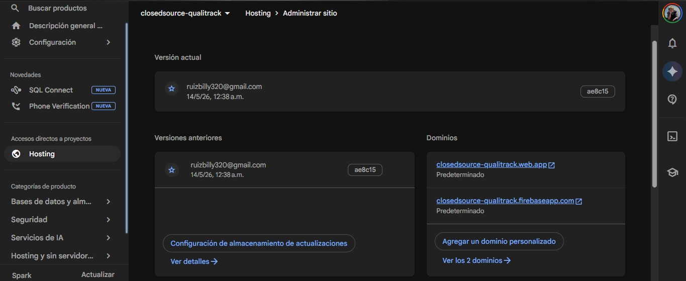
  
<em>Figura: Configuración de Firebase Hosting para el despliegue de la Frontend Web Application de QualiTrack. Esta evidencia muestra que la primera SPA de QualiTrack quedó publicada en un entorno cloud y disponible para su revisión fuera del entorno local.</em>

Este despliegue permitió validar que la Frontend Web Application podía ser ejecutada desde
un servicio cloud, manteniendo la navegación entre módulos, la estructura visual de la
aplicación y la simulación de datos mediante fake API. Con ello, el Sprint 2 cerró con una
versión demostrable de la experiencia interna de QualiTrack, preparada para ser integrada
con el backend real en el siguiente sprint.

#### 5.2.2.8. Team Collaboration Insights during Sprint

Durante el Sprint 2, el esfuerzo principal del equipo de ClosedSource se centró en la
implementación de la Frontend Web Application, trabajando en paralelo sobre los diferentes
Bounded Contexts del dominio farmacéutico. A diferencia del Sprint 1, se aplicó
correctamente GitFlow con feature branches por módulo
(<code>feature/shared</code>, <code>feature/iam</code>, <code>feature/laboratory</code>,
<code>feature/equipment</code>, <code>feature/batch</code>, <code>feature/ca</code>,
<code>feature/tracking</code>, <code>feature/ra</code>), lo que permitió desarrollo
paralelo y merges controlados.

El <strong>Historial de Commits</strong> del repositorio
<code>ClosedSource-Frontend</code> demuestra que el trabajo fue distribuido entre los
5 integrantes del equipo. Se observa la participación de los usuarios
<strong>BJRM03</strong> (Ruiz Madrid, Billy), <strong>Dan-trax</strong> (Diaz, Daniel),
<strong>M4uricioCastillo</strong> (Castillo, Mauricio), <strong>V8Z5</strong>
(Viza, Marlon) y <strong>Zock2005</strong> (Angulo, Marcelo), realizando commits
orientados a la implementación de entidades de dominio, servicios API, stores de
gestión de estado y componentes de presentación para cada Bounded Context.

  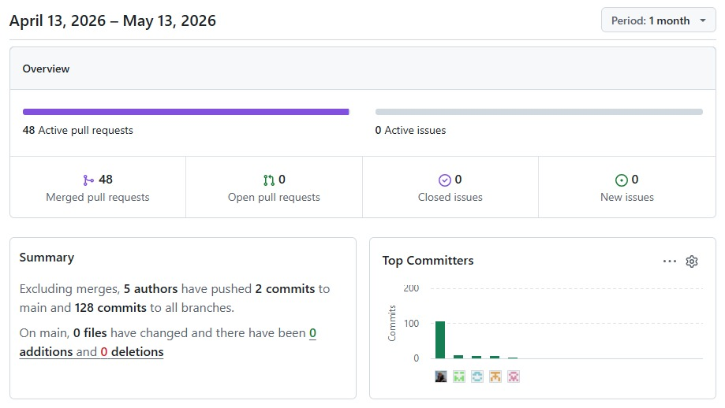
  
<em>Figura: Historial de commits del repositorio ClosedSource-Frontend demostrando
  la participación activa de los miembros del equipo durante el Sprint 2.</em>

El <strong>Network Graph</strong> de GitHub refleja el uso efectivo de GitFlow con
múltiples feature branches creadas a partir de develop para cada Bounded Context. Se
observan ciclos de creación de ramas, desarrollo de funcionalidades (entidades, servicios
API, stores y vistas) y merges controlados tras revisiones de código, confirmando que las
contribuciones individuales se alinearon con el marco de trabajo acordado en la
retrospectiva del Sprint 1. Esta estructura de ramas permitió que los módulos de Equipment
(Dan-trax), Batch (M4uricioCastillo), Compliance & Alerting (Zock2005) y Laboratory (V8Z5)
se desarrollaran en paralelo sin conflictos, mientras BJRM03 coordinaba la integración
general, el layout compartido y las correcciones transversales.

  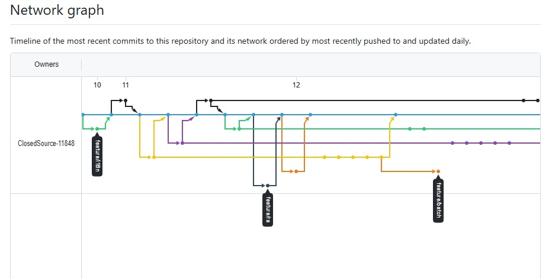
  
<em>Figura: Network Graph del repositorio ClosedSource-Frontend mostrando el
  flujo de feature branches y merges durante el Sprint 2.</em>

### 5.2.3. Sprint 3

Durante el Sprint 3, el equipo de ClosedSource se enfocó en consolidar la versión integrada de QualiTrack. A diferencia del Sprint 2, donde se desarrolló principalmente la Frontend Web Application con consumo de datos simulados, este sprint priorizó la implementación del Backend con Spring Boot, la conexión real entre Frontend y Backend, la autenticación con JWT, la persistencia en base de datos, la integración de pagos con Stripe y el despliegue de los servicios principales en la nube.

El trabajo realizado permitió que QualiTrack cuente con una arquitectura funcional distribuida en Bounded Contexts, incluyendo IAM, Laboratory Management, Equipment Management, Batch Management, Compliance & Alerting, Tracking & Telemetry, Reporting & Audit y Subscription & Billing. Asimismo, se habilitó la documentación de servicios mediante Swagger/OpenAPI, permitiendo validar los endpoints REST implementados durante el Sprint Review.

  <strong>Repositorio Backend:</strong>
  <a href="https://github.com/ClosedSource-11848/qualitrack-platform">
    https://github.com/ClosedSource-11848/qualitrack-platform
  </a>

  <strong>Frontend Web Application Desplegada:</strong>
  <a href="https://closedsource-qualitrack.web.app/home">
    https://closedsource-qualitrack.web.app/home
  </a>

  <strong>Backend API Desplegada:</strong>
  <a href="https://qualitrack-platform.onrender.com/swagger-ui/index.html">
    https://qualitrack-platform.onrender.com/swagger-ui/index.html
  </a>

  <strong>Base de Datos Desplegada:</strong> Railway

#### 5.2.3.1. Sprint Planning 3

<table border="1" cellpadding="4" cellspacing="0">
  <thead>
    <tr>
      <th colspan="2" style="text-align: center;">Sprint Planning Sprint 3</th>
    </tr>
  </thead>
  <tbody>
    <tr>
      <td colspan="2" style="text-align: center;"><strong>Sprint Planning Background</strong></td>
    </tr>
    <tr>
      <td>Date</td>
      <td>09/06/2026</td>
    </tr>
    <tr>
      <td>Time</td>
      <td>10:00 p.m.</td>
    </tr>
    <tr>
      <td>Location</td>
      <td>Discord</td>
    </tr>
    <tr>
      <td>Prepared By</td>
      <td>Ruiz Madrid, Billy Jake</td>
    </tr>
    <tr>
      <td>Attendees (to planning meeting)</td>
      <td>
        Ruiz Madrid, Billy Jake 
        Becerra Ttito, Felix Orlando 
        Diaz Caruzo, Edgard Daniel 
        Viza Quispe, Marlon Packard 
        Castillo Yataco, Mauricio Sebastian 
        Angulo Ramírez, Marcelo Martín
      </td>
    </tr>
    <tr>
      <td colspan="2" style="text-align: center;"><strong>Sprint 2 Review Summary</strong></td>
    </tr>
    <tr>
      <td colspan="2">
        During Sprint 2, the team completed the first functional version of the Angular
        Frontend Web Application, including the main bounded contexts, presentation views,
        reactive stores, application routing and deployment through Firebase Hosting.
        However, several user flows still depended on simulated data or incomplete backend
        services. For this reason, Sprint 3 was planned as an integration-oriented sprint
        focused on connecting the Landing Page, Frontend Web Application and Backend Web
        Services into a more complete product experience.
      </td>
    </tr>
    <tr>
      <td colspan="2" style="text-align: center;"><strong>Sprint 2 Retrospective Summary</strong></td>
    </tr>
    <tr>
      <td colspan="2">
        The team identified that the frontend had advanced faster than the backend, which
        caused integration gaps, incomplete persistence flows and inconsistencies between
        the user interface and the available REST services. As an improvement action, the
        team agreed to coordinate Sprint 3 around end-to-end product increments: improving
        the Landing Page, completing frontend integration, implementing missing backend
        bounded contexts, documenting REST APIs with Swagger and deploying the solution in
        cloud environments.
      </td>
    </tr>
   <tr>
  <td colspan="2" style="text-align: center;"><strong>Sprint Goal & User Stories</strong></td>
</tr>
<tr>
  <td colspan="2">
    <strong>Sprint 3 Goal (Outcome–Impact–Customer–Confirmation):</strong>  
    <em>
      Our focus is on offering a subscription-ready QualiTrack experience where visitors
      can learn about the product and team, compare plans and start checkout, while
      authenticated users can manage laboratory quality operations with real data.
    </em>  
    <em>
      We believe it delivers clearer purchase criteria to laboratory decision-makers,
      because they can watch the About the Product and About the Team videos before
      subscribing; and it delivers operational value to QA Managers, Laboratory Operators
      and auditors, because they can use connected workflows for laboratories, staff,
      products, raw materials, equipment, BPM configuration, maintenance, batches,
      telemetry, compliance alerts, KPI dashboards, reports, audit logs, subscriptions
      and billing.
    </em>  
    <em>
      This will be confirmed when a visitor can watch both landing page videos, review
      subscription plans and start a Stripe checkout flow; and when an authenticated user
      can sign in and complete the main laboratory, equipment, batch, tracking,
      compliance, reporting, audit and billing workflows using data persisted by the
      deployed backend.
    </em>
  </td>
</tr>
    <tr>
      <td>Sprint 3 Velocity</td>
      <td>45 Story Points</td>
    </tr>
    <tr>
      <td>Sum of Story Points</td>
      <td>45 SP</td>
    </tr>
  </tbody>
</table>

#### 5.2.3.2. Aspect Leaders and Collaborators

En esta sección se presenta la matriz <strong>Leadership-and-Collaboration (LACX)</strong>
correspondiente al Sprint 3. Su propósito es identificar los principales aspectos técnicos
abordados durante el sprint y asignar responsabilidades de liderazgo (<strong>L</strong>) y
colaboración (<strong>C</strong>) según la evidencia de trabajo registrada en el repositorio
Backend.

Los aspectos se derivan directamente de los objetivos del Sprint 3 Goal:

<ul>
  <li><strong>Backend Bounded Contexts:</strong> Implementación de los módulos backend para CA, RA, Tracking, Subscription e IAM, junto con correcciones de Laboratory, Equipment y Batch.</li>
  <li><strong>Frontend Integration & Authentication:</strong> Ajuste del frontend para consumir endpoints reales, envío de JWT mediante interceptor y alineación de IAM con el backend.</li>
  <li><strong>Deployment, Payments & Documentation:</strong> Despliegue del backend en Render, frontend en Firebase, base de datos en Railway, configuración de Stripe y actualización de Swagger/diagramas.</li>
</ul>

<table border="1" cellpadding="4" cellspacing="0" align="center">
  <thead>
    <tr>
      <th>GitHub User / Author</th>
      <th>Backend Bounded Contexts</th>
      <th>Frontend Integration & Authentication</th>
      <th>Deployment, Payments & Documentation</th>
    </tr>
  </thead>
  <tbody>
    <tr>
      <td>BJRM03</td>
      <td>L</td>
      <td>L</td>
      <td>L</td>
    </tr>
    <tr>
      <td>Felixb14</td>
      <td>L</td>
      <td>C</td>
      <td>L</td>
    </tr>
    <tr>
      <td>Dan-trax</td>
      <td>C</td><td>C</td><td>C</td>
    </tr>
    <tr>
      <td>V8Z5</td>
      <td>C</td><td>C</td><td>C</td>
    </tr>
    <tr>
      <td>M4uricioCastillo</td>
      <td>C</td><td>C</td><td>C</td>
    </tr>
    <tr>
      <td>Zock2005</td>
      <td>C</td><td>C</td><td>L</td>
    </tr>
  </tbody>
</table>

<ul>
  <li><strong>L</strong> = Líder del aspecto</li>
  <li><strong>C</strong> = Colaborador en el aspecto</li>
</ul>

#### 5.2.3.3. Sprint Backlog 3

El Sprint Backlog 3 fue definido a partir del Sprint Goal orientado a consolidar una
experiencia completa y demostrable de QualiTrack, integrando la Landing Page, la aplicación
Frontend Web y los servicios Backend desplegados. Durante este sprint se trabajaron historias
relacionadas con la presentación comercial del producto, autenticación, suscripciones con
Stripe, gestión operativa del laboratorio, tracking, alertas, reportes, auditoría, navegación
global, localización y despliegue cloud.

Las historias seleccionadas provienen del Product Backlog definido en el Capítulo 3. A partir
de ellas se descompusieron tareas funcionales y técnicas necesarias para entregar valor de
extremo a extremo, desde la interfaz pública hasta los servicios REST, persistencia,
integración entre bounded contexts y despliegue.

  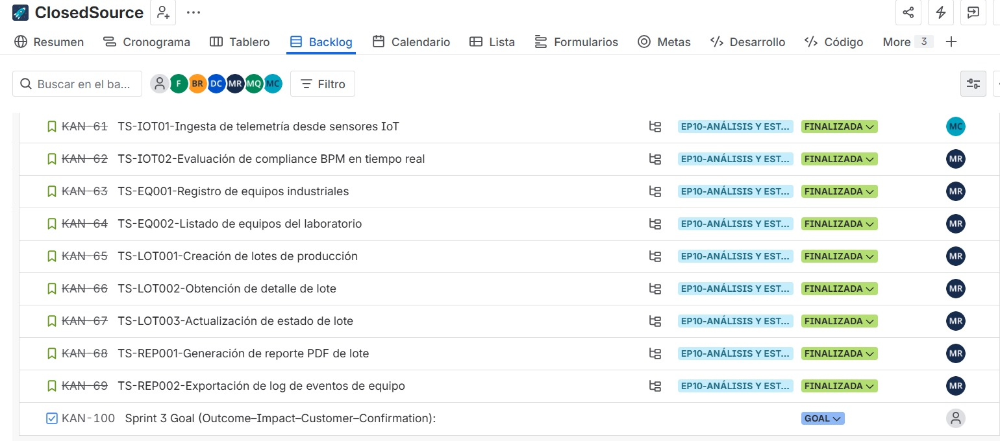
  
<em>Figura: Tablero del Sprint 3 en Jira Software (Proyecto QualiTrack)</em>

<strong>Board URL:</strong>
<a href="https://closedsource-11848.atlassian.net/jira/software/projects/KAN/boards/1/backlog" target="_blank">https://closedsource-11848.atlassian.net/jira/software/projects/KAN/boards/1/backlog</a>

<table border="1" cellpadding="4" cellspacing="0">
  <thead>
    <tr>
      <th colspan="8" style="text-align:center;">Sprint # 3</th>
    </tr>
    <tr>
      <th colspan="2">User Story</th>
      <th colspan="6">Work-Item / Task</th>
    </tr>
    <tr>
      <th>Id</th>
      <th>Title</th>
      <th>Id</th>
      <th>Title</th>
      <th>Description</th>
      <th>Estimation (Hours)</th>
      <th>Assigned To</th>
      <th>Status</th>
    </tr>
  </thead>
  <tbody>
    <tr>
      <td>US01 / US02 / US03 / US04 / US05 / US06</td>
      <td>Landing page navigation, value proposition, subscription plans, contact request, language selection, terms and privacy access</td>
      <td>T041</td>
      <td>Implement Landing Page public experience</td>
      <td>Implementar la landing page responsive y bilingüe con navegación pública, propuesta de valor, beneficios, planes, contacto y acceso a términos y privacidad.</td>
      <td>8h</td>
      <td>BJRM03</td>
      <td>Done</td>
    </tr>
    <tr>
      <td>TS01</td>
      <td>Landing page responsive implementation</td>
      <td>T042</td>
      <td>Validate Landing Page deployment</td>
      <td>Ajustar diseño responsive, validar navegación pública y desplegar la landing page en Firebase Hosting.</td>
      <td>5h</td>
      <td>BJRM03</td>
      <td>Done</td>
    </tr>
    <tr>
      <td>US07 / US08 / US09 / US10</td>
      <td>Plan selection before authentication, Stripe checkout redirection, payment success confirmation, billing summary</td>
      <td>T043</td>
      <td>Implement subscription frontend flow</td>
      <td>Crear vistas de planes, checkout, confirmación de pago y resumen de facturación conectadas al backend de suscripciones.</td>
      <td>8h</td>
      <td>BJRM03</td>
      <td>Done</td>
    </tr>
    <tr>
      <td>TS02 / TS03 / TS04</td>
      <td>Subscription plans API, Stripe checkout session API, Stripe webhook processing</td>
      <td>T044</td>
      <td>Implement Subscription and Payments backend</td>
      <td>Crear planes, suscripciones, pagos, sesiones de Stripe Checkout, procesamiento de webhooks y endpoints REST para facturación.</td>
      <td>10h</td>
      <td>BJRM03</td>
      <td>Done</td>
    </tr>
    <tr>
      <td>US11 / US12 / US13</td>
      <td>Role-based sign-up, secure sign-in, protected application access</td>
      <td>T045</td>
      <td>Implement IAM frontend and protected access</td>
      <td>Alinear las vistas de sign-up y sign-in con el backend, manejar roles, sesión JWT, token storage e interceptor de autorización.</td>
      <td>8h</td>
      <td>BJRM03</td>
      <td>Done</td>
    </tr>
    <tr>
      <td>TS05 / TS06</td>
      <td>JWT authentication API, Authorization interceptor</td>
      <td>T046</td>
      <td>Implement IAM backend security</td>
      <td>Crear usuarios, roles, autenticación JWT, hashing BCrypt, filtros Bearer, configuración Spring Security y endpoints de autenticación.</td>
      <td>10h</td>
      <td>BJRM03</td>
      <td>Done</td>
    </tr>
    <tr>
      <td>US14 / US15 / US16 / US17 / US18</td>
      <td>Laboratory profile registration, laboratory profile update, staff management, pharmaceutical product catalog, raw material inventory</td>
      <td>T047</td>
      <td>Complete Laboratory bounded context integration</td>
      <td>Integrar vistas y servicios para laboratorio, personal, productos farmacéuticos y materias primas con validaciones y persistencia backend.</td>
      <td>9h</td>
      <td>BJRM03</td>
      <td>Done</td>
    </tr>
    <tr>
      <td>TS07</td>
      <td>Laboratory REST API</td>
      <td>T048</td>
      <td>Implement Laboratory REST services</td>
      <td>Exponer endpoints REST para laboratorio, staff, productos y materias primas, incluyendo eventos de bajo stock e integración con otros bounded contexts.</td>
      <td>8h</td>
      <td>BJRM03</td>
      <td>Done</td>
    </tr>
    <tr>
      <td>US19 / US20 / US21</td>
      <td>Equipment registration, BPM parameter configuration, equipment maintenance records</td>
      <td>T049</td>
      <td>Complete Equipment frontend and backend integration</td>
      <td>Implementar registro de equipos, configuración BPM, mantenimiento y consumo de endpoints protegidos desde la aplicación web.</td>
      <td>8h</td>
      <td>BJRM03</td>
      <td>Done</td>
    </tr>
    <tr>
      <td>TS08</td>
      <td>Equipment REST API</td>
      <td>T050</td>
      <td>Implement Equipment REST services</td>
      <td>Exponer endpoints REST para equipos, parámetros BPM, mantenimiento y eventos relacionados con calibración y sensores.</td>
      <td>8h</td>
      <td>BJRM03</td>
      <td>Done</td>
    </tr>
    <tr>
      <td>US25 / US26 / US27 / US28 / US29</td>
      <td>Batch creation, batch detail and history, raw material usage in batch, batch release, batch rejection</td>
      <td>T051</td>
      <td>Complete Batch management workflow</td>
      <td>Integrar creación de lotes, detalle, historial, asociación de materias primas, liberación y rechazo con endpoints REST actualizados.</td>
      <td>9h</td>
      <td>M4uricioCastillo</td>
      <td>Done</td>
    </tr>
    <tr>
      <td>TS10</td>
      <td>Batch REST API</td>
      <td>T052</td>
      <td>Implement Batch REST services</td>
      <td>Exponer endpoints REST para lotes y uso de materias primas, aplicando rutas RESTful y eventos de integración para auditoría y cumplimiento.</td>
      <td>8h</td>
      <td>M4uricioCastillo</td>
      <td>Done</td>
    </tr>
    <tr>
      <td>US22 / US23 / US24</td>
      <td>Telemetry dashboard, telemetry measurements, telemetry history and anomalies</td>
      <td>T053</td>
      <td>Implement Tracking and Telemetry workflow</td>
      <td>Conectar dashboard de telemetría, mediciones, historial y anomalías con selección de equipos y datos reales del backend.</td>
      <td>8h</td>
      <td>Felixb14</td>
      <td>Done</td>
    </tr>
    <tr>
      <td>TS09</td>
      <td>Telemetry REST API</td>
      <td>T054</td>
      <td>Implement Tracking REST services</td>
      <td>Crear endpoints REST para estado de telemetría, mediciones, historial, anomalías y eventos de integración para reporting y alertas.</td>
      <td>8h</td>
      <td>Felixb14</td>
      <td>Done</td>
    </tr>
    <tr>
      <td>US30 / US31 / US32 / US33</td>
      <td>Deviation alerts, alert acknowledgement and resolution, notification preferences, compliance event trail</td>
      <td>T055</td>
      <td>Complete Compliance and Alerts workflow</td>
      <td>Implementar alertas de desviación, resolución, preferencias de notificación y eventos de cumplimiento en frontend y backend.</td>
      <td>8h</td>
      <td>Zock2005</td>
      <td>Done</td>
    </tr>
    <tr>
      <td>TS11</td>
      <td>Compliance REST API</td>
      <td>T056</td>
      <td>Implement Compliance REST services</td>
      <td>Exponer endpoints REST para alertas, eventos de cumplimiento y preferencias de notificación, alineando rutas por recurso.</td>
      <td>8h</td>
      <td>Zock2005</td>
      <td>Done</td>
    </tr>
    <tr>
      <td>US34 / US35 / US36 / US37</td>
      <td>KPI dashboard, deviation trends, regulatory report generation, audit log</td>
      <td>T057</td>
      <td>Complete Reporting and Audit workflow</td>
      <td>Implementar panel KPI, tendencias de desviación, generación de reportes y auditoría desde frontend conectado al backend.</td>
      <td>10h</td>
      <td>BJRM03</td>
      <td>Done</td>
    </tr>
    <tr>
      <td>TS12</td>
      <td>Reporting and audit REST API</td>
      <td>T058</td>
      <td>Implement Reporting and Audit REST services</td>
      <td>Crear endpoints REST para KPIs, deviation trends, reportes, audit logs y generación de documentos descargables.</td>
      <td>10h</td>
      <td>BJRM03</td>
      <td>Done</td>
    </tr>
    <tr>
      <td>US38 / US39 / US40</td>
      <td>Application shell navigation, application localization, dashboard overview</td>
      <td>T059</td>
      <td>Complete application shell and dashboard</td>
      <td>Actualizar layout, menú lateral, navegación por bounded context, cambio de idioma y dashboard general con información operativa.</td>
      <td>7h</td>
      <td>BJRM03</td>
      <td>Done</td>
    </tr>
    <tr>
      <td>TS13</td>
      <td>Integration events and ACL between bounded contexts</td>
      <td>T060</td>
      <td>Implement integration events and ACLs</td>
      <td>Publicar eventos de integración y aplicar ACLs entre bounded contexts para mantener bajo acoplamiento entre módulos.</td>
      <td>8h</td>
      <td>BJRM03</td>
      <td>Done</td>
    </tr>
    <tr>
      <td>TS14</td>
      <td>Consistent API error handling</td>
      <td>T061</td>
      <td>Standardize API error handling and REST paths</td>
      <td>Unificar respuestas de error, adaptar consumo frontend y corregir rutas RESTful en Swagger para recursos principales.</td>
      <td>7h</td>
      <td>BJRM03</td>
      <td>Done</td>
    </tr>
    <tr>
      <td>Task</td>
      <td>Cloud deployment and environment configuration</td>
      <td>T062</td>
      <td>Deploy integrated solution</td>
      <td>Configurar y validar despliegue de base de datos en Railway, backend en Render y frontend en Firebase Hosting con variables de entorno.</td>
      <td>6h</td>
      <td>BJRM03</td>
      <td>Done</td>
    </tr>
    <tr>
      <td>Task</td>
      <td>Technical documentation update</td>
      <td>T063</td>
      <td>Update diagrams and API documentation</td>
      <td>Actualizar diagramas de frontend, backend y base de datos por bounded context, además de validar documentación OpenAPI en Swagger.</td>
      <td>6h</td>
      <td>BJRM03</td>
      <td>Done</td>
    </tr>
  </tbody>
</table>

#### 5.2.3.4. Development Evidence for Sprint Review

En esta sección se presentan las evidencias de desarrollo correspondientes al Sprint 3.
A diferencia de los sprints anteriores, este incremento no se concentró únicamente en un
módulo aislado, sino en consolidar una solución integrada de QualiTrack compuesta por la
Landing Page, la Frontend Web Application y la Backend REST API. El trabajo realizado
permitió conectar la propuesta comercial del producto con los flujos internos de operación,
autenticación, suscripciones, gestión de laboratorio, equipos, lotes, tracking, alertas,
reportes y auditoría.

Las evidencias se organizan por repositorio, considerando los commits más representativos
del Sprint 3. Estos commits muestran el avance sobre la experiencia pública, la integración
frontend con servicios reales, la implementación de bounded contexts en backend, la seguridad
JWT, la integración con Stripe, la corrección de endpoints RESTful y la preparación de la
plataforma para despliegue.

<table border="1" cellpadding="4" cellspacing="0">
  <thead>
    <tr>
      <th>Repository</th>
      <th>Branch</th>
      <th>Commit Id</th>
      <th>Author</th>
      <th>Commit Message</th>
      <th>Committed on (Date)</th>
      <th>Sprint Scope</th>
    </tr>
  </thead>
  <tbody>
    <tr>
      <td><a href="https://github.com/ClosedSource-11848/ClosedSource-LandingPage">ClosedSource-LandingPage</a></td>
      <td>main</td>
      <td>9331e3d</td>
      <td>BJRM03</td>
      <td>fix(toolbar): fix toolbar landing page.</td>
      <td>14/05/2026</td>
      <td>Landing Page public experience and navigation.</td>
    </tr>
    <tr>
      <td><a href="https://github.com/ClosedSource-11848/ClosedSource-Frontend">ClosedSource-Frontend</a></td>
      <td>main</td>
      <td>33db3e9</td>
      <td>BJRM03</td>
      <td>fix(shared): integrate subscription module into application navigation.</td>
      <td>12/06/2026</td>
      <td>Application shell navigation and subscription menu integration.</td>
    </tr>
    <tr>
      <td><a href="https://github.com/ClosedSource-11848/ClosedSource-Frontend">ClosedSource-Frontend</a></td>
      <td>main</td>
      <td>29f069f</td>
      <td>BJRM03</td>
      <td>fix(batch): fix batch forms and management views.</td>
      <td>14/06/2026</td>
      <td>Batch creation, detail and production traceability views.</td>
    </tr>
    <tr>
      <td><a href="https://github.com/ClosedSource-11848/ClosedSource-Frontend">ClosedSource-Frontend</a></td>
      <td>main</td>
      <td>141d631</td>
      <td>BJRM03</td>
      <td>fix(subscription): fix checkout and billing workflows.</td>
      <td>14/06/2026</td>
      <td>Stripe checkout, payment confirmation and billing summary integration.</td>
    </tr>
    <tr>
      <td><a href="https://github.com/ClosedSource-11848/ClosedSource-Frontend">ClosedSource-Frontend</a></td>
      <td>main</td>
      <td>7793758</td>
      <td>BJRM03</td>
      <td>fix(ra): fix dashboard, KPI and reporting integration.</td>
      <td>14/06/2026</td>
      <td>KPI dashboard, reports and audit-related frontend integration.</td>
    </tr>
    <tr>
      <td><a href="https://github.com/ClosedSource-11848/ClosedSource-Frontend">ClosedSource-Frontend</a></td>
      <td>main</td>
      <td>2e85fe8</td>
      <td>BJRM03</td>
      <td>fix(equipment): fix equipment and telemetry integration.</td>
      <td>14/06/2026</td>
      <td>Equipment management, telemetry status and measurement visualization.</td>
    </tr>
    <tr>
      <td><a href="https://github.com/ClosedSource-11848/ClosedSource-Frontend">ClosedSource-Frontend</a></td>
      <td>main</td>
      <td>8f38a3f</td>
      <td>BJRM03</td>
      <td>fix(laboratory): fix laboratory management workflows.</td>
      <td>14/06/2026</td>
      <td>Laboratory profile, products, raw materials and staff workflows.</td>
    </tr>
    <tr>
      <td><a href="https://github.com/ClosedSource-11848/ClosedSource-Frontend">ClosedSource-Frontend</a></td>
      <td>main</td>
      <td>36023e4</td>
      <td>BJRM03</td>
      <td>fix(iam): fix authentication and user registration flow.</td>
      <td>14/06/2026</td>
      <td>Sign-in, sign-up, role-based registration and protected frontend access.</td>
    </tr>
    <tr>
      <td><a href="https://github.com/ClosedSource-11848/ClosedSource-Frontend">ClosedSource-Frontend</a></td>
      <td>main</td>
      <td>43e0f32</td>
      <td>BJRM03</td>
      <td>fix(ca): fix alerts, compliance events and notification integrations.</td>
      <td>21/06/2026</td>
      <td>Compliance alerts, notification preferences and compliance event views.</td>
    </tr>
    <tr>
      <td><a href="https://github.com/ClosedSource-11848/ClosedSource-Frontend">ClosedSource-Frontend</a></td>
      <td>main</td>
      <td>6a3be07</td>
      <td>BJRM03</td>
      <td>fix(ra): fix audit logs, reports, kpis and deviation trends integrations.</td>
      <td>21/06/2026</td>
      <td>Audit log, report generator, KPI dashboard and deviation trend integration.</td>
    </tr>
    <tr>
      <td><a href="https://github.com/ClosedSource-11848/ClosedSource-Frontend">ClosedSource-Frontend</a></td>
      <td>main</td>
      <td>5907a64</td>
      <td>BJRM03</td>
      <td>fix(tracking): fix equipment status, measurements and telemetry integrations.</td>
      <td>21/06/2026</td>
      <td>Tracking dashboard, telemetry measurements and anomaly history integration.</td>
    </tr>
    <tr>
      <td><a href="https://github.com/ClosedSource-11848/ClosedSource-Frontend">ClosedSource-Frontend</a></td>
      <td>main</td>
      <td>3718400</td>
      <td>BJRM03</td>
      <td>chore: update frontend environment configuration.</td>
      <td>21/06/2026</td>
      <td>Frontend deployment configuration and backend API connection.</td>
    </tr>
    <tr>
      <td><a href="https://github.com/ClosedSource-11848/qualitrack-platform">qualitrack-platform</a></td>
      <td>main</td>
      <td>d98f6c4</td>
      <td>Zock2005</td>
      <td>feat(ca): add rest controllers.</td>
      <td>09/06/2026</td>
      <td>Compliance and Alerts backend endpoints.</td>
    </tr>
    <tr>
      <td><a href="https://github.com/ClosedSource-11848/qualitrack-platform">qualitrack-platform</a></td>
      <td>main</td>
      <td>1a69ca8</td>
      <td>M4uricioCastillo</td>
      <td>fix(batch): fix batch queries and laboratory integration.</td>
      <td>10/06/2026</td>
      <td>Batch management backend integration with laboratory context.</td>
    </tr>
    <tr>
      <td><a href="https://github.com/ClosedSource-11848/qualitrack-platform">qualitrack-platform</a></td>
      <td>main</td>
      <td>006d639</td>
      <td>BJRM03</td>
      <td>feat(ra): add ra commands.</td>
      <td>12/06/2026</td>
      <td>Reporting and Audit command layer.</td>
    </tr>
    <tr>
      <td><a href="https://github.com/ClosedSource-11848/qualitrack-platform">qualitrack-platform</a></td>
      <td>main</td>
      <td>f728110</td>
      <td>Felixb14</td>
      <td>feat(tracking): add rest controller.</td>
      <td>13/06/2026</td>
      <td>Tracking and telemetry REST endpoints.</td>
    </tr>
    <tr>
      <td><a href="https://github.com/ClosedSource-11848/qualitrack-platform">qualitrack-platform</a></td>
      <td>main</td>
      <td>5739cc4</td>
      <td>BJRM03</td>
      <td>feat(eventhandler): add integration events for inter-context communication.</td>
      <td>13/06/2026</td>
      <td>Integration events and ACL communication between bounded contexts.</td>
    </tr>
    <tr>
      <td><a href="https://github.com/ClosedSource-11848/qualitrack-platform">qualitrack-platform</a></td>
      <td>main</td>
      <td>2b31052</td>
      <td>BJRM03</td>
      <td>feat(subscription): add rest controller.</td>
      <td>13/06/2026</td>
      <td>Subscription and billing backend endpoints.</td>
    </tr>
    <tr>
      <td><a href="https://github.com/ClosedSource-11848/qualitrack-platform">qualitrack-platform</a></td>
      <td>main</td>
      <td>4ae5843</td>
      <td>BJRM03</td>
      <td>feat(iam): add identity and access management backend module.</td>
      <td>13/06/2026</td>
      <td>IAM backend module with authentication and authorization support.</td>
    </tr>
    <tr>
      <td><a href="https://github.com/ClosedSource-11848/qualitrack-platform">qualitrack-platform</a></td>
      <td>main</td>
      <td>0893560</td>
      <td>BJRM03</td>
      <td>feat(ra): add kpi dashboard and deviation trend calculation workflows.</td>
      <td>14/06/2026</td>
      <td>KPI dashboard and deviation trend backend workflows.</td>
    </tr>
    <tr>
      <td><a href="https://github.com/ClosedSource-11848/qualitrack-platform">qualitrack-platform</a></td>
      <td>main</td>
      <td>4e32071</td>
      <td>M4uricioCastillo</td>
      <td>fix(batch): fix batch controller and raw material usage processing.</td>
      <td>14/06/2026</td>
      <td>Batch REST controller and raw material usage workflow correction.</td>
    </tr>
    <tr>
      <td><a href="https://github.com/ClosedSource-11848/qualitrack-platform">qualitrack-platform</a></td>
      <td>main</td>
      <td>543a8ba</td>
      <td>BJRM03</td>
      <td>fix(tracking): fix telemetry controller and anomaly compliance handling.</td>
      <td>14/06/2026</td>
      <td>Telemetry anomaly processing and compliance event integration.</td>
    </tr>
    <tr>
      <td><a href="https://github.com/ClosedSource-11848/qualitrack-platform">qualitrack-platform</a></td>
      <td>main</td>
      <td>d735a48</td>
      <td>BJRM03</td>
      <td>chore: add dockerfile configuration.</td>
      <td>16/06/2026</td>
      <td>Backend deployment preparation for Render.</td>
    </tr>
    <tr>
      <td><a href="https://github.com/ClosedSource-11848/qualitrack-platform">qualitrack-platform</a></td>
      <td>main</td>
      <td>0358520</td>
      <td>BJRM03</td>
      <td>fix(ra): fix report, audit log and analytics rest controllers.</td>
      <td>20/06/2026</td>
      <td>RESTful correction of reporting, audit log and analytics endpoints.</td>
    </tr>
    <tr>
      <td><a href="https://github.com/ClosedSource-11848/qualitrack-platform">qualitrack-platform</a></td>
      <td>main</td>
      <td>26a6410</td>
      <td>BJRM03</td>
      <td>fix(ca): fix compliance monitoring and alert management rest endpoints.</td>
      <td>20/06/2026</td>
      <td>RESTful correction of compliance monitoring and alert endpoints.</td>
    </tr>
    <tr>
      <td><a href="https://github.com/ClosedSource-11848/qualitrack-platform">qualitrack-platform</a></td>
      <td>main</td>
      <td>c5d7aae</td>
      <td>BJRM03</td>
      <td>fix(subscription): fix subscription and stripe integration endpoints.</td>
      <td>20/06/2026</td>
      <td>Stripe, subscription and payment endpoint corrections.</td>
    </tr>
    <tr>
      <td><a href="https://github.com/ClosedSource-11848/qualitrack-platform">qualitrack-platform</a></td>
      <td>main</td>
      <td>f5a8a4c</td>
      <td>BJRM03</td>
      <td>docs(docs): fix backend and data base diagrams.</td>
      <td>19/06/2026</td>
      <td>Backend and database diagram updates by bounded context.</td>
    </tr>
  </tbody>
</table>

Como resultado de estas actividades, el Sprint 3 entregó evidencia de desarrollo en los
tres frentes principales del producto: una Landing Page pública para comunicar la propuesta
de valor, una Frontend Web Application integrada con servicios reales y una Backend REST API
desplegable con persistencia, seguridad, documentación OpenAPI y soporte para flujos de
suscripción mediante Stripe.

#### 5.2.3.5. Execution Evidence for Sprint Review

Durante el Sprint 3 se logró integrar y validar una versión funcional de QualiTrack compuesta
por tres frentes principales: la Landing Page, la Frontend Web Application y la Backend REST
API. El incremento permitió demostrar el recorrido completo del producto, desde la presentación
pública de la solución y sus planes de suscripción, hasta el acceso autenticado a los módulos
operativos de laboratorio, equipos, lotes, tracking, alertas, reportes, auditoría y facturación.

A nivel de ejecución, se validó la navegación pública de la Landing Page, la visualización
de beneficios y planes comerciales, el acceso hacia el flujo de autenticación, la navegación
entre módulos internos, el consumo de servicios REST protegidos con JWT, la persistencia de
datos en la base de datos desplegada, la integración con Stripe Checkout para suscripciones
y la visualización de documentación Swagger/OpenAPI. Las siguientes evidencias muestran
las principales vistas implementadas y probadas durante el Sprint 3.

  <strong>Landing Page:</strong>
  <a href="https://closedsource-11848.github.io/ClosedSource-LandingPage/" target="_blank">
    https://closedsource-11848.github.io/ClosedSource-LandingPage/
  </a>

  <strong>Frontend Web Application:</strong>
  <a href="https://closedsource-qualitrack.web.app/home" target="_blank">
    https://closedsource-qualitrack.web.app/home
  </a>

  <strong>Backend API Documentation:</strong>
  <a href="https://qualitrack-platform.onrender.com/swagger-ui/index.html" target="_blank">
    https://qualitrack-platform.onrender.com/swagger-ui/index.html
  </a>

  <strong>Sprint 3 Demo Video:</strong>
  <a href="COLOCAR_URL_DEL_VIDEO_DEMO_SPRINT_3" target="_blank">
    COLOCAR_URL_DEL_VIDEO_DEMO_SPRINT_3
  </a>

  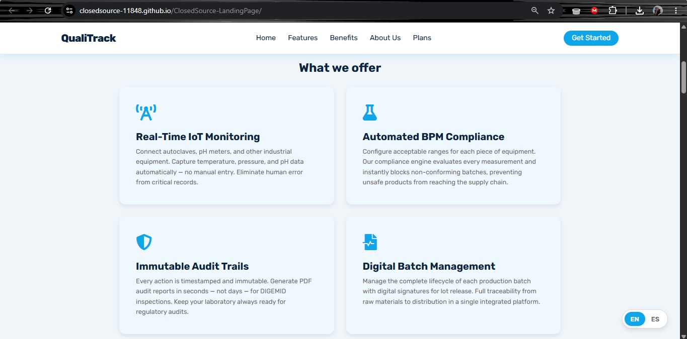
  
<em>Figura: Vista principal de la Landing Page de QualiTrack. Esta pantalla evidencia la presentación pública del producto, comunicando la propuesta de valor principal para laboratorios farmacéuticos que buscan digitalizar trazabilidad, control de calidad y cumplimiento BPM.</em>

  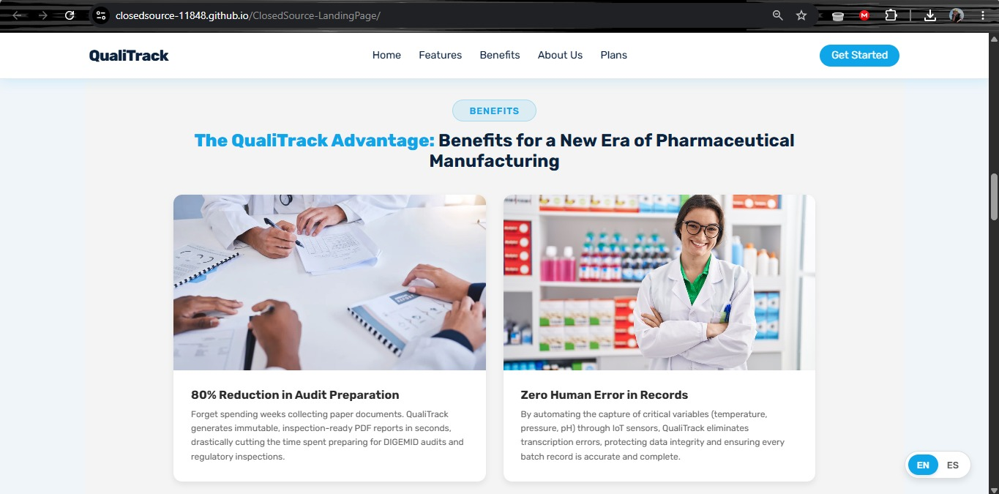
  
<em>Figura: Sección de beneficios de la Landing Page. Esta evidencia muestra cómo el Sprint 3 reforzó la comunicación comercial del producto, resaltando beneficios como trazabilidad, reducción de registros manuales, monitoreo de procesos y soporte para auditorías regulatorias.</em>

  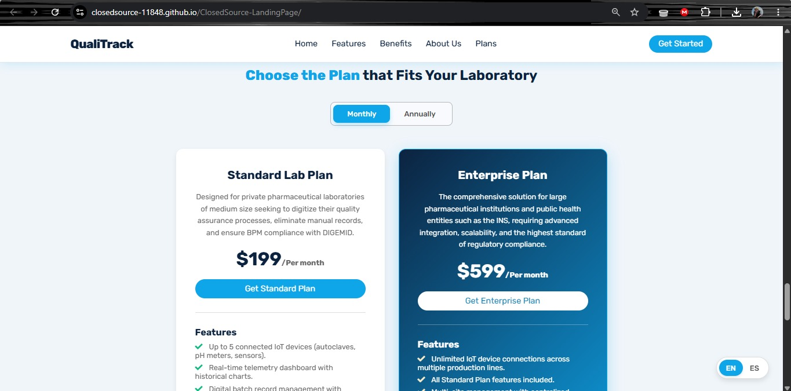
  
<em>Figura: Sección de planes de suscripción. Esta vista permite que un visitante compare opciones comerciales antes de ingresar al sistema, validando el enfoque SaaS de QualiTrack y conectando la Landing Page con el flujo de suscripción implementado en el Sprint 3.</em>

  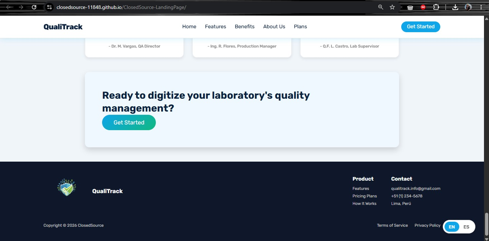
  
<em>Figura: Sección de contacto de la Landing Page. Esta evidencia muestra el canal disponible para que potenciales clientes soliciten información comercial, lo cual complementa el proceso de adquisición junto con los planes y videos informativos agregados durante el sprint.</em>

  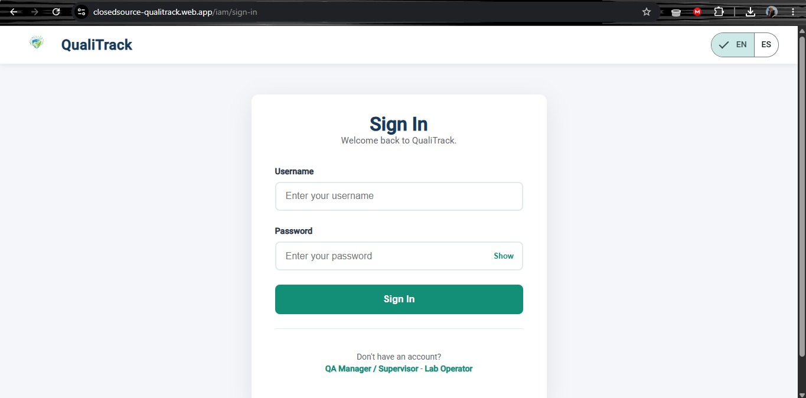
  
<em>Figura: Vista de inicio de sesión. Esta pantalla evidencia la integración del frontend con el bounded context de IAM del backend, permitiendo autenticar usuarios y generar una sesión protegida mediante JWT para consumir los módulos internos de la plataforma.</em>

  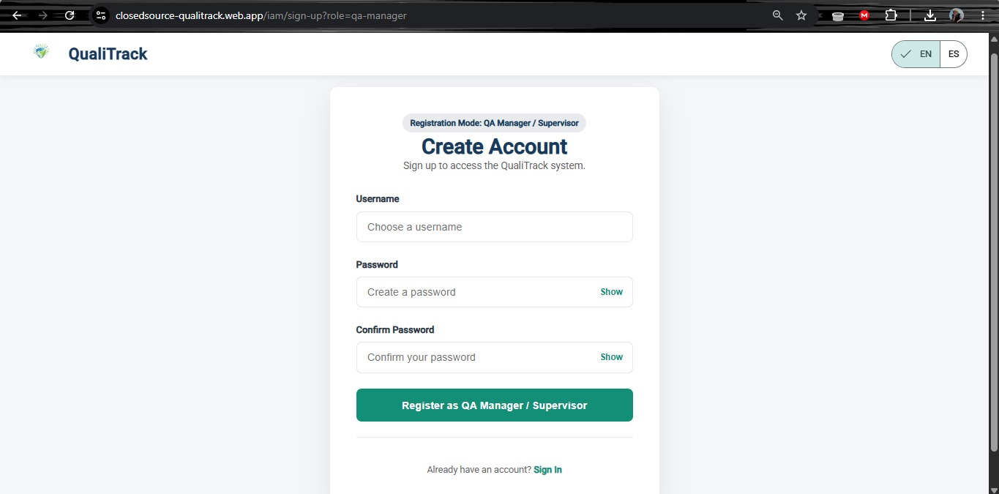
  
<em>Figura: Vista de registro de usuario. Esta evidencia muestra la creación de cuentas con selección de rol, permitiendo diferenciar accesos para usuarios como QA Manager, Supervisor o Lab Operator, alineando la autenticación con los perfiles operativos del producto.</em>

  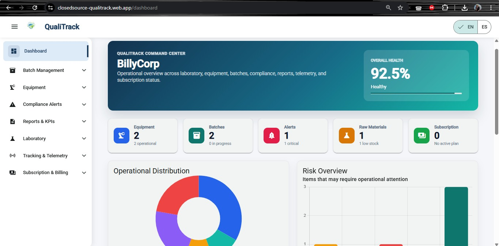
  
<em>Figura: Dashboard principal de la aplicación. Esta vista demuestra la navegación interna posterior al inicio de sesión, centralizando accesos a los módulos de laboratorio, equipos, lotes, tracking, cumplimiento, reportes y suscripciones.</em>

  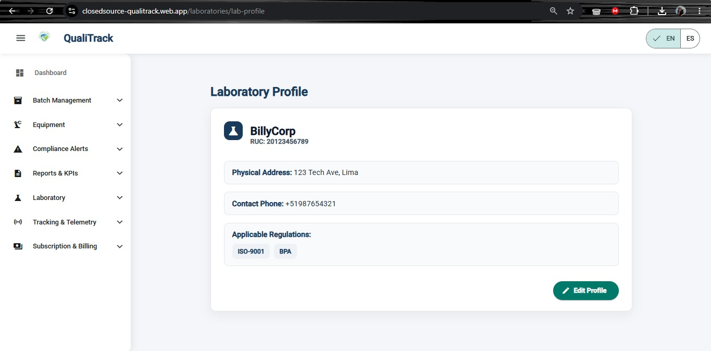
  
<em>Figura: Perfil de laboratorio. Esta evidencia valida que la aplicación permite consultar y actualizar información institucional del laboratorio usando datos persistidos en el backend, dejando atrás el uso de información simulada.</em>

  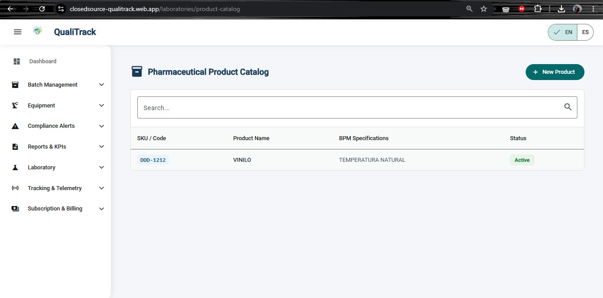
  
<em>Figura: Catálogo de productos farmacéuticos. Esta pantalla evidencia la gestión de productos asociados al laboratorio, información necesaria para crear lotes de producción y mantener trazabilidad entre producto, lote y controles de calidad.</em>

  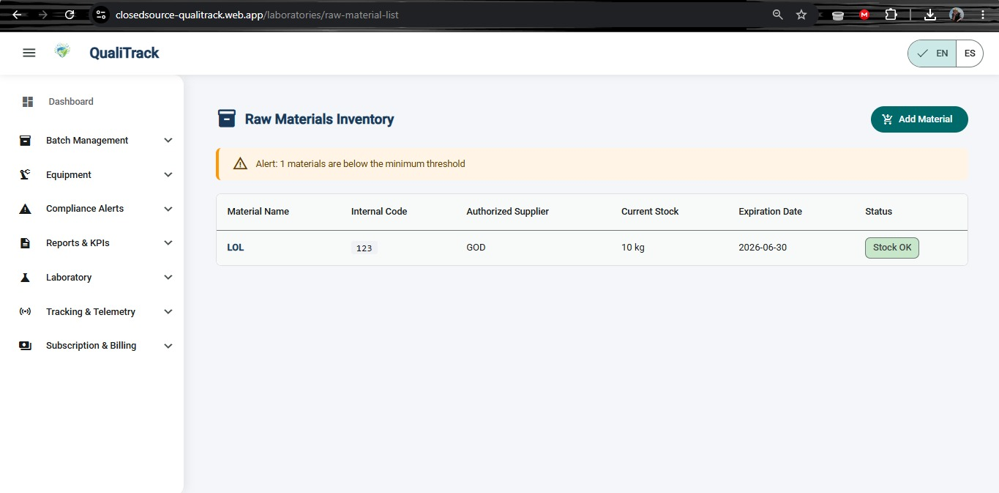
  
<em>Figura: Inventario de materias primas. Esta evidencia muestra el registro y consulta de insumos del laboratorio, incluyendo stock y umbrales mínimos, lo cual permite activar eventos de cumplimiento cuando una materia prima se encuentra por debajo del nivel permitido.</em>

  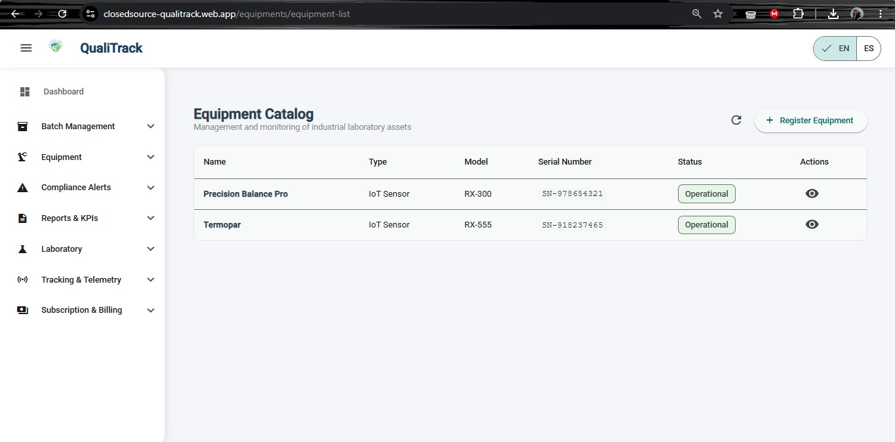
  
<em>Figura: Catálogo de equipos. Esta vista valida el registro y consulta de equipos industriales del laboratorio, permitiendo que posteriormente se les asocie configuración BPM, mantenimiento, telemetría y análisis de desviaciones.</em>

  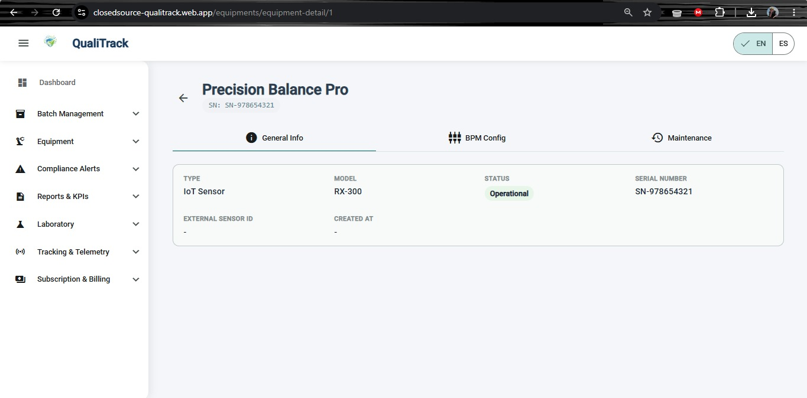
  
<em>Figura: Detalle de equipo. Esta evidencia muestra la información operativa de un equipo seleccionado, incluyendo datos generales, configuración de parámetros críticos y mantenimiento, integrando el bounded context de Equipment con los flujos de calidad.</em>

  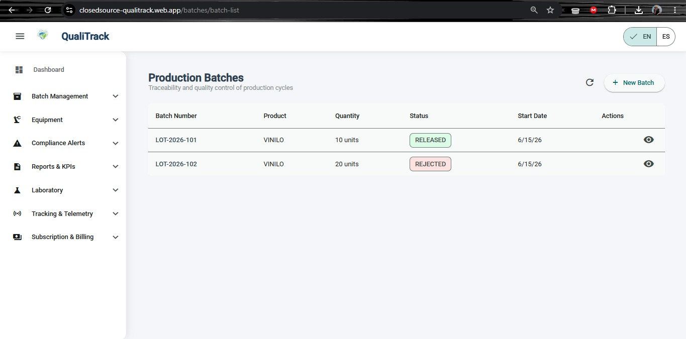
  
<em>Figura: Gestión de lotes de producción. Esta pantalla evidencia que los usuarios pueden consultar lotes registrados, revisar su estado y acceder a acciones relacionadas con trazabilidad, liberación o rechazo del lote.</em>

  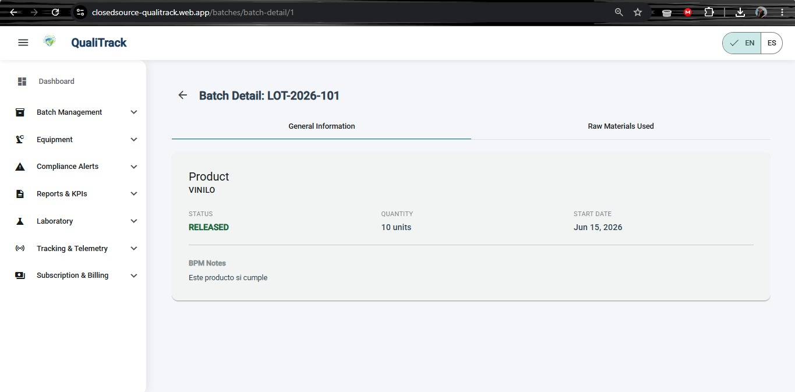
  
<em>Figura: Detalle de lote. Esta evidencia valida la trazabilidad del ciclo productivo, mostrando información general del lote y materias primas utilizadas, además de acciones relevantes como liberación y rechazo según reglas del proceso.</em>

  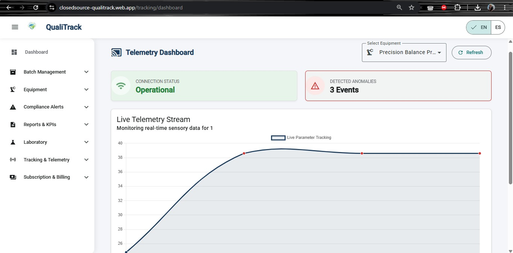
  
<em>Figura: Dashboard de tracking y telemetría. Esta vista demuestra el monitoreo de equipos mediante estados, mediciones y anomalías, permitiendo observar datos sensoriales vinculados a los equipos registrados en la plataforma.</em>

  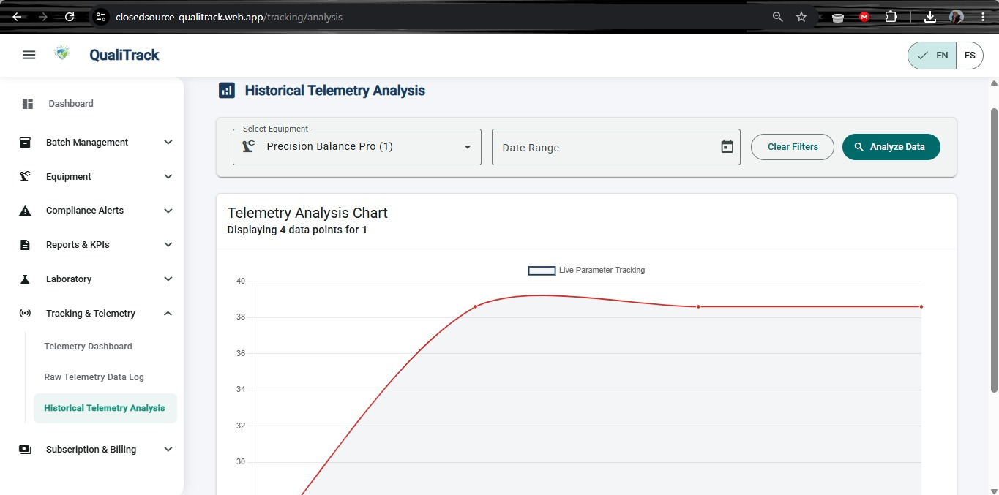
  
<em>Figura: Historial de telemetría. Esta evidencia muestra el registro histórico de mediciones por equipo y parámetro, incluyendo puntos normales y anómalos que sirven como base para análisis de desviaciones y alertas de cumplimiento.</em>

  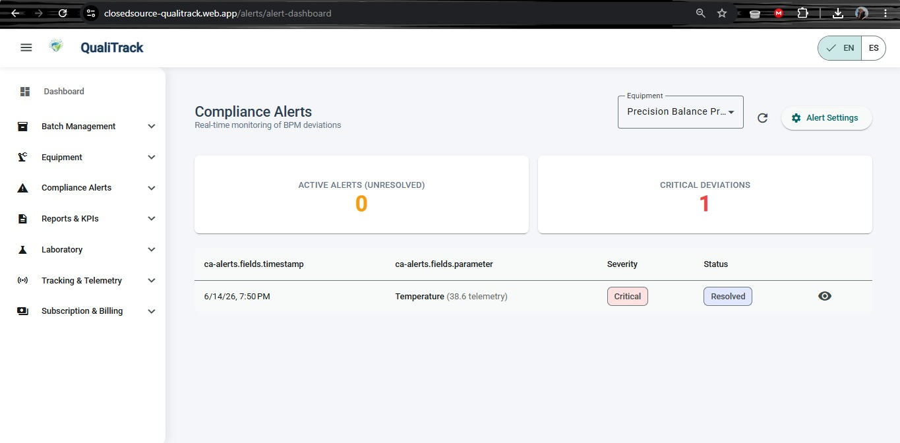
  
<em>Figura: Gestión de alertas de cumplimiento. Esta pantalla valida que el sistema permite visualizar desviaciones operativas y eventos relevantes para cumplimiento, facilitando el seguimiento de incidencias por parte de responsables de calidad.</em>

  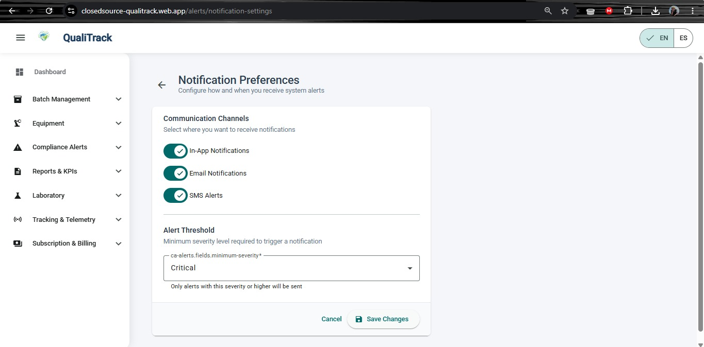
  
<em>Figura: Preferencias de notificación. Esta evidencia muestra la configuración de canales y severidad mínima para recibir alertas, permitiendo personalizar cómo los usuarios son informados sobre eventos críticos de la plataforma.</em>

  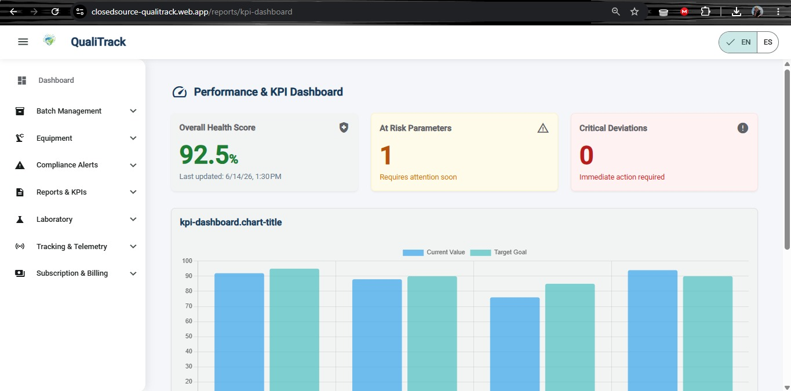
  
<em>Figura: Panel de KPIs de calidad. Esta vista evidencia el cálculo y visualización de indicadores clave del laboratorio, como desempeño general, parámetros en riesgo y desviaciones críticas, apoyando la toma de decisiones de QA Managers.</em>

  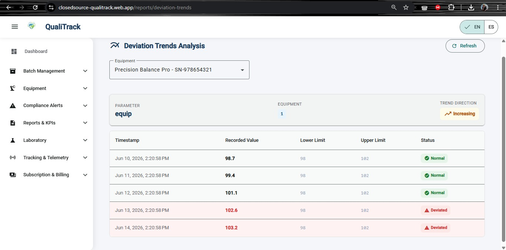
  
<em>Figura: Análisis de tendencias de desviación. Esta evidencia muestra la evaluación de tendencias por equipo y parámetro, permitiendo identificar comportamientos crecientes, decrecientes o estables en variables críticas del proceso.</em>

  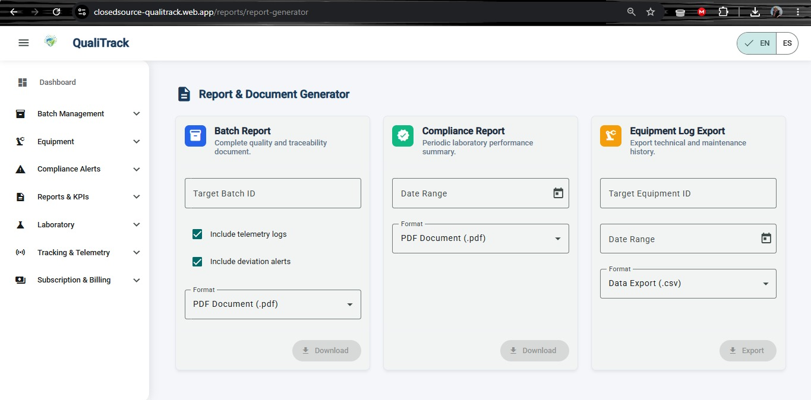
  
<em>Figura: Generador de reportes. Esta pantalla evidencia la generación de documentos relacionados con lotes, cumplimiento y equipos, permitiendo descargar reportes que apoyan auditorías y revisión de trazabilidad.</em>

  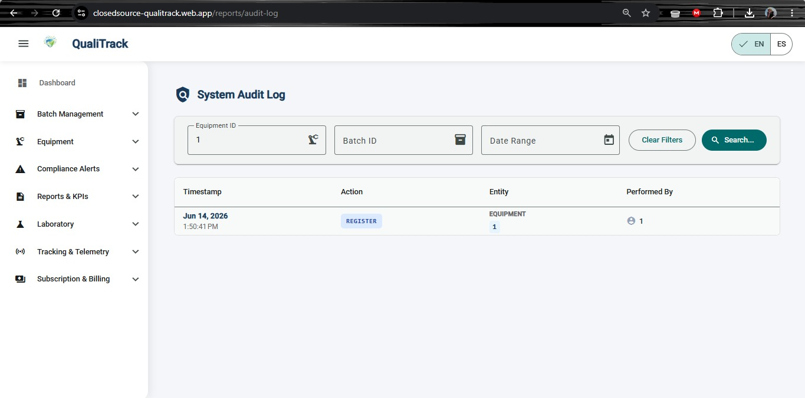
  
<em>Figura: Registro de auditoría del sistema. Esta evidencia muestra acciones críticas registradas por la plataforma, incluyendo entidad afectada, usuario responsable y fecha de ocurrencia, fortaleciendo la trazabilidad de operaciones internas.</em>

  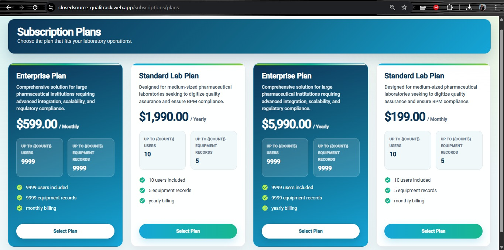
  
<em>Figura: Vista interna de planes de suscripción. Esta pantalla permite consultar los planes disponibles desde la aplicación web, validando que el módulo de suscripciones está integrado al frontend y conectado con datos del backend.</em>

  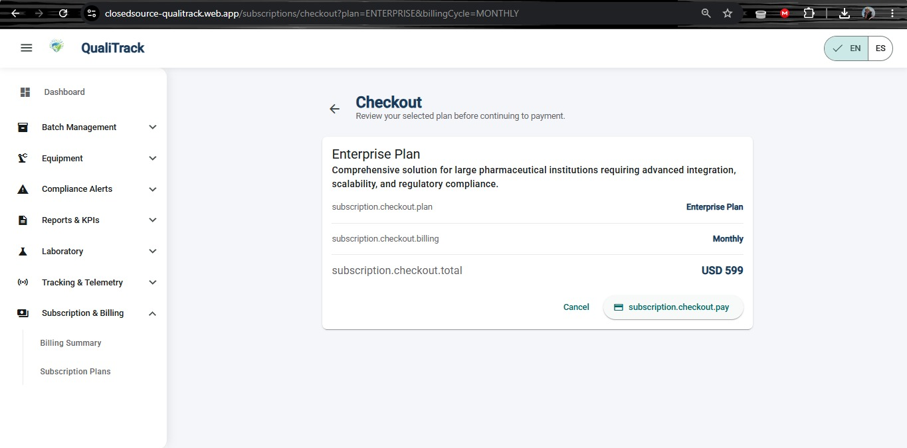
  
<em>Figura: Vista previa de checkout. Esta evidencia muestra el paso previo a la redirección hacia Stripe, donde el usuario confirma el plan seleccionado y se prepara la sesión de pago desde el backend.</em>

  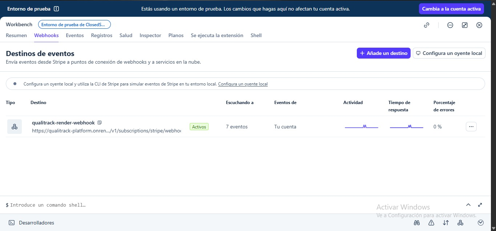
  
<em>Figura: Flujo de pago mediante Stripe Checkout. Esta pantalla evidencia la integración con un proveedor externo de pagos en entorno de prueba, permitiendo validar el inicio de una suscripción realista desde QualiTrack.</em>

  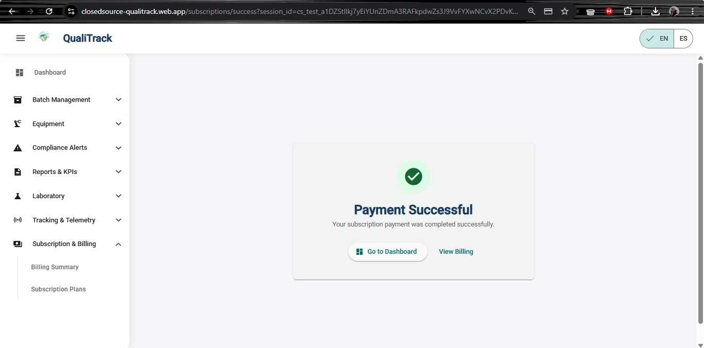
  
<em>Figura: Confirmación de pago exitoso. Esta evidencia muestra el retorno del usuario a la aplicación luego de completar el flujo de Stripe, validando la experiencia posterior al pago dentro del módulo de suscripción y facturación.</em>

  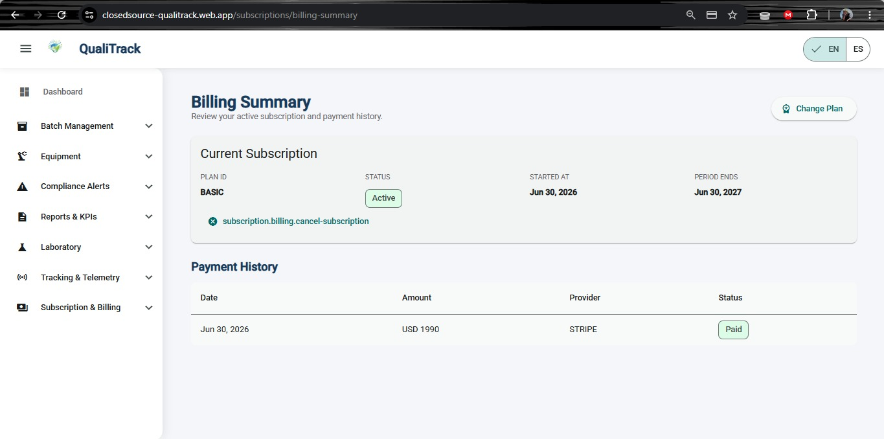
  
<em>Figura: Resumen de facturación. Esta vista evidencia la consulta de la suscripción activa y el historial de pagos, permitiendo que el usuario revise su estado comercial dentro de la plataforma.</em>

  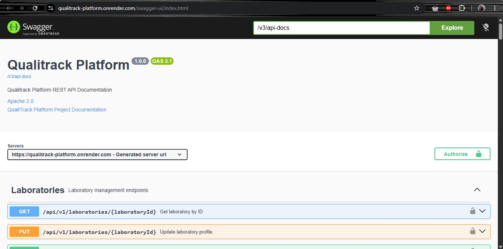
  
<em>Figura: Documentación Swagger/OpenAPI. Esta evidencia demuestra que el backend expone endpoints documentados y organizados por recursos, facilitando la validación de servicios REST y la integración con el frontend.</em>

  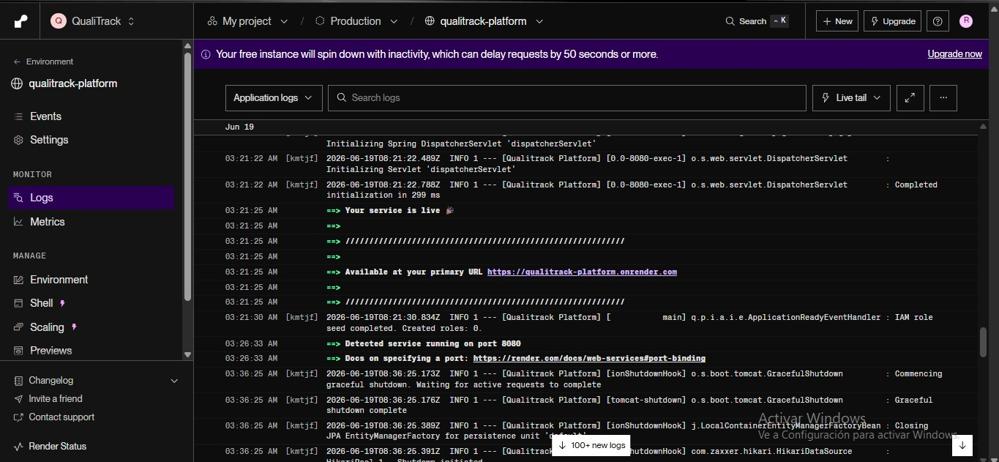
  
<em>Figura: Backend API desplegada en Render. Esta evidencia confirma que los servicios REST implementados durante el sprint están disponibles en un entorno cloud, permitiendo que la aplicación frontend consuma datos fuera del entorno local.</em>

  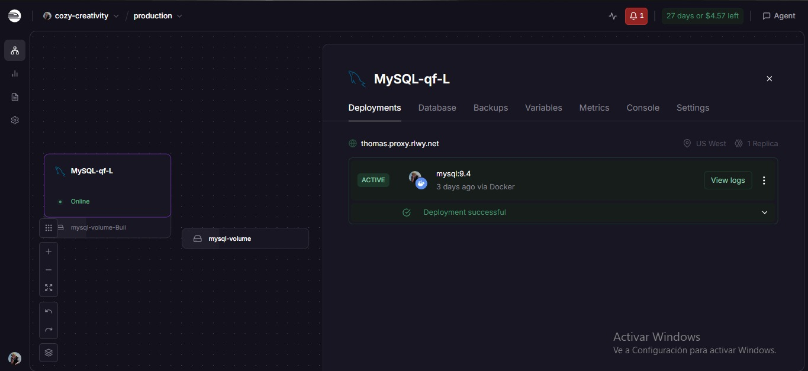
  
<em>Figura: Base de datos desplegada en Railway. Esta evidencia muestra la persistencia cloud utilizada por el backend para almacenar usuarios, laboratorios, equipos, lotes, telemetría, alertas, reportes, auditoría, suscripciones y pagos.</em>

En conjunto, estas evidencias muestran que el Sprint 3 permitió validar una navegación
integrada entre módulos, el consumo de datos reales desde la API, la protección de rutas
mediante autenticación, la operación de los principales bounded contexts y la conexión con
servicios externos como Stripe, Firebase, Render y Railway.

#### 5.2.3.6. Services Documentation Evidence for Sprint Review

Durante el Sprint 3, se habilitó la documentación de servicios REST mediante Swagger/OpenAPI
en el backend desplegado en Render. Esta documentación permite visualizar los endpoints
implementados por Bounded Context, probar solicitudes HTTP, revisar modelos de request/response
y validar la integración con autenticación JWT, suscripciones y eventos de Stripe.

  <strong>Swagger UI:</strong>
  <a href="https://qualitrack-platform.onrender.com/swagger-ui/index.html">
    https://qualitrack-platform.onrender.com/swagger-ui/index.html
  </a>

  <strong>OpenAPI JSON:</strong>
  <a href="https://qualitrack-platform.onrender.com/v3/api-docs">
    https://qualitrack-platform.onrender.com/v3/api-docs
  </a>

<table border="1" cellpadding="4" cellspacing="0">
  <thead>
    <tr>
      <th>Bounded Context / API Group</th>
      <th>Implemented Endpoints</th>
      <th>Main Purpose</th>
    </tr>
  </thead>
  <tbody>
    <tr>
      <td>Authentication</td>
      <td>
        <code>POST /api/v1/authentication/sign-up</code> 
        <code>POST /api/v1/authentication/sign-in</code>
      </td>
      <td>Registro de usuarios, inicio de sesión y generación de token JWT.</td>
    </tr>
<tr>
  <td>Users</td>
  <td>
    <code>GET /api/v1/users</code> 
    <code>GET /api/v1/users/{userId}</code> 
    <code>PATCH /api/v1/users/{userId}</code> 
    <code>PUT /api/v1/users/{userId}/roles/{roleName}</code> 
    <code>GET /api/v1/users/{userId}/notification-preferences</code> 
    <code>PUT /api/v1/users/{userId}/notification-preferences</code>
  </td>
  <td>Administración de usuarios, asignación de roles, estado de cuentas y preferencias de notificación.</td>
</tr>

<tr>
  <td>Roles</td>
  <td>
    <code>GET /api/v1/roles</code>
  </td>
  <td>Consulta de roles disponibles para la gestión de acceso dentro de la plataforma.</td>
</tr>

<tr>
  <td>Laboratories</td>
  <td>
    <code>POST /api/v1/laboratories</code> 
    <code>GET /api/v1/laboratories/{laboratoryId}</code> 
    <code>PUT /api/v1/laboratories/{laboratoryId}</code> 
    <code>GET /api/v1/laboratories/{laboratoryId}/staff</code> 
    <code>POST /api/v1/laboratories/{laboratoryId}/staff</code> 
    <code>GET /api/v1/laboratories/{laboratoryId}/products</code> 
    <code>POST /api/v1/laboratories/{laboratoryId}/products</code> 
    <code>GET /api/v1/laboratories/{laboratoryId}/raw-materials</code> 
    <code>POST /api/v1/laboratories/{laboratoryId}/raw-materials</code> 
    <code>GET /api/v1/laboratories/{laboratoryId}/batches</code> 
    <code>GET /api/v1/laboratories/{laboratoryId}/reports</code> 
    <code>GET /api/v1/laboratories/{laboratoryId}/subscriptions</code> 
    <code>GET /api/v1/laboratories/{laboratoryId}/billing-summary</code>
  </td>
  <td>Gestión del perfil de laboratorio, personal, productos, materias primas, lotes, reportes, suscripciones y resumen de facturación.</td>
</tr>

<tr>
  <td>Equipment</td>
  <td>
    <code>GET /api/v1/equipments</code> 
    <code>POST /api/v1/equipments</code> 
    <code>GET /api/v1/equipments/{equipmentId}</code> 
    <code>GET /api/v1/equipments/{equipmentId}/telemetry-status</code> 
    <code>PUT /api/v1/equipments/{equipmentId}/telemetry-status</code> 
    <code>GET /api/v1/equipments/{equipmentId}/telemetry-measurements</code> 
    <code>POST /api/v1/equipments/{equipmentId}/telemetry-measurements</code> 
    <code>GET /api/v1/equipments/{equipmentId}/telemetry-history</code> 
    <code>POST /api/v1/equipments/{equipmentId}/telemetry-history</code> 
    <code>GET /api/v1/equipments/{equipmentId}/maintenance-records</code> 
    <code>POST /api/v1/equipments/{equipmentId}/maintenance-records</code> 
    <code>GET /api/v1/equipments/{equipmentId}/bpm-configs</code> 
    <code>POST /api/v1/equipments/{equipmentId}/bpm-configs</code>
  </td>
  <td>Gestión de equipos, telemetría, mediciones, historial, mantenimiento y configuración BPM.</td>
</tr>

<tr>
  <td>Equipment Compliance, Audit & Reports</td>
  <td>
    <code>GET /api/v1/equipments/{equipmentId}/audit-logs</code> 
    <code>POST /api/v1/equipments/{equipmentId}/audit-logs</code> 
    <code>GET /api/v1/equipments/{equipmentId}/reports</code> 
    <code>POST /api/v1/equipments/{equipmentId}/log-reports</code> 
    <code>GET /api/v1/equipments/{equipmentId}/compliance-events</code> 
    <code>GET /api/v1/equipments/{equipmentId}/deviation-trends</code> 
    <code>POST /api/v1/equipments/{equipmentId}/deviation-trends</code> 
    <code>GET /api/v1/equipments/{equipmentId}/deviation-alerts</code> 
    <code>POST /api/v1/equipments/{equipmentId}/deviation-alerts</code>
  </td>
  <td>Auditoría de equipos, reportes, eventos de cumplimiento, tendencias de desviación y alertas operativas.</td>
</tr>

<tr>
  <td>Staff</td>
  <td>
    <code>PATCH /api/v1/staff/{staffId}</code>
  </td>
  <td>Actualización del estado de miembros del personal del laboratorio.</td>
</tr>

<tr>
  <td>Raw Materials</td>
  <td>
    <code>GET /api/v1/raw-materials/{rawMaterialId}/compliance-events</code>
  </td>
  <td>Consulta de eventos de cumplimiento asociados a materias primas.</td>
</tr>

<tr>
  <td>Batches</td>
  <td>
    <code>GET /api/v1/batches</code> 
    <code>POST /api/v1/batches</code> 
    <code>GET /api/v1/batches/{batchId}</code> 
    <code>PATCH /api/v1/batches/{batchId}</code> 
    <code>GET /api/v1/batches/{batchId}/raw-materials</code> 
    <code>POST /api/v1/batches/{batchId}/raw-materials</code> 
    <code>GET /api/v1/batches/{batchId}/audit-logs</code> 
    <code>POST /api/v1/batches/{batchId}/audit-logs</code> 
    <code>GET /api/v1/batches/{batchId}/reports</code> 
    <code>POST /api/v1/batches/{batchId}/reports</code> 
    <code>GET /api/v1/batches/{batchId}/deviation-alerts</code> 
    <code>GET /api/v1/batches/{batchId}/compliance-events</code>
  </td>
  <td>Trazabilidad de lotes, actualización de estado, materias primas utilizadas, auditoría, reportes, alertas y eventos de cumplimiento.</td>
</tr>

<tr>
  <td>Reports & KPIs</td>
  <td>
    <code>GET /api/v1/reports/{reportId}</code> 
    <code>GET /api/v1/laboratories/{laboratoryId}/kpi-dashboards</code> 
    <code>POST /api/v1/laboratories/{laboratoryId}/kpi-dashboards</code> 
    <code>POST /api/v1/laboratories/{laboratoryId}/compliance-reports</code>
  </td>
  <td>Consulta de reportes de auditoría, generación de reportes de cumplimiento y snapshots de KPIs del laboratorio.</td>
</tr>

<tr>
  <td>Deviation Alerts</td>
  <td>
    <code>GET /api/v1/deviation-alerts/{alertId}</code> 
    <code>PATCH /api/v1/deviation-alerts/{alertId}</code>
  </td>
  <td>Consulta y actualización del estado de alertas de desviación.</td>
</tr>

<tr>
  <td>Subscription Plans</td>
  <td>
    <code>GET /api/v1/subscription-plans</code>
  </td>
  <td>Consulta de planes de suscripción disponibles para los laboratorios.</td>
</tr>

<tr>
  <td>Subscriptions</td>
  <td>
    <code>GET /api/v1/laboratories/{laboratoryId}/subscriptions</code> 
    <code>GET /api/v1/laboratories/{laboratoryId}/billing-summary</code> 
    <code>PATCH /api/v1/subscriptions/{subscriptionId}</code> 
    <code>GET /api/v1/subscriptions/{subscriptionId}/payments</code>
  </td>
  <td>Consulta de suscripciones por laboratorio, resumen de facturación, actualización de estado y consulta de historial de pagos.</td>
</tr>

<tr>
  <td>Subscription Checkout Sessions</td>
  <td>
    <code>POST /api/v1/subscription-checkout-sessions</code>
  </td>
  <td>Creación de sesiones de Stripe Checkout para iniciar el proceso de pago de una suscripción.</td>
</tr>

<tr>
  <td>Stripe Webhooks</td>
  <td>
    <code>POST /api/v1/stripe/webhooks</code>
  </td>
  <td>Recepción y procesamiento de eventos enviados por Stripe para sincronizar pagos y suscripciones.</td>
</tr>
  </tbody>
</table>

#### 5.2.3.7. Software Deployment Evidence for Sprint Review

Durante el Sprint 3, el equipo realizó el despliegue de los principales productos de QualiTrack para poder presentar una versión integrada y funcional durante el Sprint Review. El proceso de deployment incluyó la publicación de la Landing Page y la Frontend Web Application en Firebase Hosting, el despliegue del Backend Web Service en Render, la configuración de la base de datos MySQL en Railway y la integración del flujo de suscripción mediante Stripe Checkout.

Para lograrlo, se configuraron los entornos cloud necesarios, se ajustaron variables de entorno para conectar frontend, backend, base de datos y servicios externos, y se validó que los módulos implementados pudieran ejecutarse fuera del entorno local. Esto permitió que visitantes, usuarios autenticados y evaluadores pudieran acceder a QualiTrack mediante URLs públicas y probar los principales flujos desarrollados durante el sprint.

En el caso del frontend, se configuró el proyecto Angular para consumir el backend desplegado en Render, se generó el build de producción y se publicó la aplicación mediante Firebase Hosting. Esta versión incluye la navegación principal, autenticación, gestión de laboratorio, equipos, lotes, telemetría, alertas, reportes, auditoría y suscripciones.

  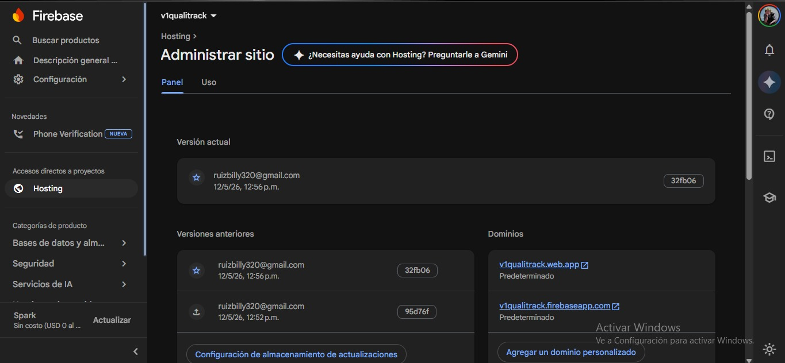
  
<em>Figura: Frontend Web Application de QualiTrack desplegada en Firebase Hosting.</em>

Para el backend, se configuró un servicio web en Render conectado al repositorio del Backend Web Service. Además, se definieron variables de entorno para la conexión con la base de datos, autenticación JWT, configuración de Stripe y perfiles de ejecución. Como resultado, la API REST quedó disponible públicamente y documentada mediante Swagger UI.

  
  
<em>Figura: Backend API de QualiTrack desplegada en Render.</em>

La persistencia de datos fue desplegada en Railway mediante una instancia MySQL. Esta base de datos permitió almacenar usuarios, laboratorios, productos, materiales, equipos, lotes, mediciones de telemetría, alertas, reportes, auditoría, planes de suscripción, pagos y suscripciones activas. El backend desplegado en Render fue configurado para conectarse a esta base de datos mediante variables de entorno.

  
  
<em>Figura: Base de datos de QualiTrack desplegada en Railway.</em>

Finalmente, se configuró Stripe en modo de prueba para validar el flujo de suscripción. Se crearon productos y precios para los planes de QualiTrack, se integró Stripe Checkout desde el backend y se validó que el usuario pudiera iniciar una sesión de pago desde la aplicación web. Esta integración permitió demostrar el flujo comercial de selección de plan y suscripción durante el Sprint Review.

  
  
<em>Figura: Flujo de pago de suscripción mediante Stripe Checkout.</em>

Como resultado del deployment, QualiTrack quedó disponible para demostración mediante servicios públicos desplegados en la nube. La aplicación frontend puede ser usada desde Firebase Hosting, el backend puede ser validado desde Swagger en Render, la información se persiste en Railway y el flujo de suscripción se procesa mediante Stripe Checkout en modo de prueba.

#### 5.2.3.8. Team Collaboration Insights during Sprint

Durante el Sprint 3, el esfuerzo principal se concentró en cerrar la brecha entre la Frontend
Web Application desarrollada en el Sprint 2 y el Backend necesario para soportar flujos reales
de negocio. El historial de commits del repositorio <code>qualitrack-platform</code> evidencia
la participación de los usuarios <strong>BJRM03</strong>, <strong>Felixb14</strong>, <strong>M4uricioCastillo</strong> y
<strong>Marcelo</strong>, quienes trabajaron sobre distintos Bounded Contexts y tareas de
integración.

El usuario <strong>Marcelo</strong> participó en la implementación del Bounded Context de
Compliance & Alerts, agregando comandos, queries, servicios, persistencia, recursos REST y
controladores. El usuario <strong>Felixb14</strong> participó principalmente en el Bounded
Context de Tracking, implementando value objects, comandos, queries, aggregates,
eventos, excepciones, persistencia JPA, servicios de aplicación, recursos REST, controladores
e integración externa. El usuario <strong>M4uricioCastillo</strong> participó principalmente en el Bounded
Context de Batch, implementando value objects, comandos, queries, aggregates,
eventos, excepciones, persistencia JPA, servicios de aplicación, recursos REST, controladores
e integración externa. Por su parte, <strong>BJRM03</strong>
concentró trabajo en Laboratory, Equipment, RA, Subscription & Billing, IAM, event handlers, seguridad,
configuración de despliegue, Dockerfile y actualización de diagramas.

La colaboración se organizó mediante ramas de tipo <code>feature/</code> y merges hacia la
línea principal de desarrollo. Esto permitió avanzar por módulos, corregir errores de integración
a medida que aparecían en el frontend y estabilizar progresivamente la API. El resultado final
del sprint fue una versión desplegada e integrada de QualiTrack, con frontend en Firebase,
backend en Render, base de datos en Railway, autenticación JWT, documentación Swagger,
telemetría, reportes, auditoría, alertas de cumplimiento y suscripciones con Stripe.

  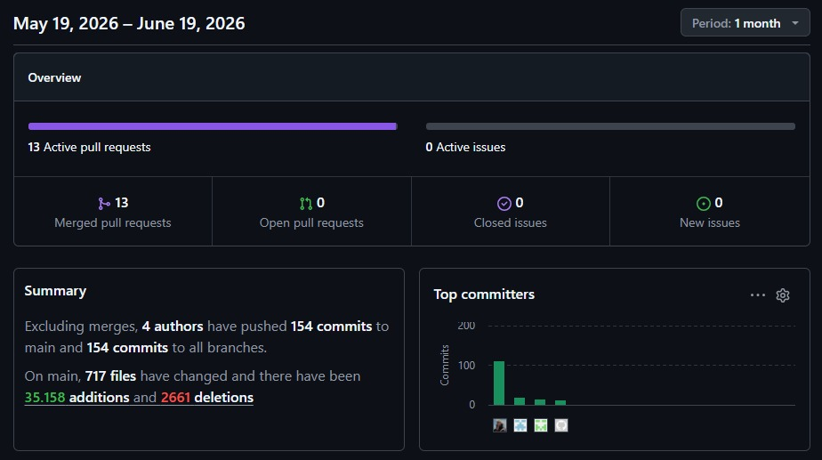
  
<em>Figura: Historial de commits del repositorio Backend durante el Sprint 3.</em>

  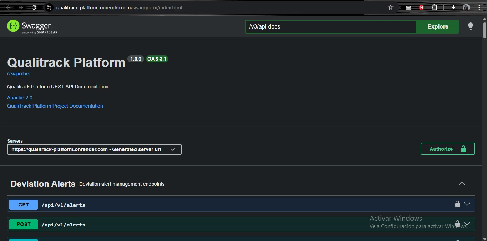
  
<em>Figura: Documentación Swagger/OpenAPI del Backend desplegado en Render.</em>

<!-- 

### 5.2.4. Sprint 4

#### 5.2.4.1. Sprint Planning 4

#### 5.2.4.2. Aspect Leaders and Collaborators

#### 5.2.4.3. Sprint Backlog 4

#### 5.2.4.4. Development Evidence for Sprint Review

#### 5.2.4.5. Execution Evidence for Sprint Review

#### 5.2.4.6. Services Documentation Evidence for Sprint Review

#### 5.2.4.7. Software Deployment Evidence for Sprint Review

#### 5.2.4.8. Team Collaboration Insights during Sprint

comentario -->

## 5.3. Validation Interviews

### 5.3.1. Diseño de Entrevistas

Las entrevistas de validación con usuarios finales constituyen un instrumento clave para la recolección de retroalimentación sobre la solución propuesta. Estas fueron diseñadas con el objetivo de evaluar el grado de adecuación de la plataforma a los requerimientos de los usuarios, así como identificar posibles limitaciones en términos de usabilidad y oportunidades de mejora.

Se realizaron entrevistas con representantes de los dos segmentos objetivo del proyecto: gerentes y jefes de aseguramiento de calidad, y directores y supervisores de entidades de salud pública, permitiendo obtener una perspectiva integral desde los ámbitos de gestión interna y supervisión del cumplimiento normativo.

<h4>Preguntas para el Segmento de Gerentes y Jefes de Aseguramiento de Calidad</h4>

<ol>
<li>¿Qué limitaciones le generan los sistemas actuales al gestionar la calidad?</li>
<li>¿Qué tipo de información necesita consultar con mayor frecuencia y rapidez?</li>
<li>¿Qué dificultades tiene al acceder a información histórica?</li>
<li>¿Qué tareas le demandan más tiempo y considera que podrían optimizarse?</li>
<li>¿Qué tipo de alertas o notificaciones serían más útiles para su trabajo?</li>
<li>¿Qué funciones considera indispensables en una solución digital de aseguramiento de calidad?</li>
<li>¿Qué beneficios concretos esperaría obtener al implementar una herramienta como esta?</li>
<li>¿Qué aspectos le generarían desconfianza al usar una plataforma digital?</li>
<li>¿Qué condiciones deberían cumplirse para considerar su implementación en su organización?</li>
<li>¿Qué mejoras sugeriría para que la solución se adapte mejor a sus necesidades?</li>
</ol>

<h4>Preguntas para el Segmento de Directores y Supervisores de Entidades de Salud Pública</h4>
<ol>
<li>¿Qué dificultades encuentra al consolidar información de diferentes entidades de salud?</li>
<li>¿Qué limitaciones tiene el acceso a datos para el monitoreo continuo?</li>
<li>¿Qué indicadores o información necesita visualizar para tomar decisiones oportunas?</li>
<li>¿Qué problemas existen en la trazabilidad de las supervisiones o inspecciones?</li>
<li>¿Qué procesos considera que deberían integrarse en una sola plataforma?</li>
<li>¿Qué tipo de alertas o reportes le ayudarían en su labor de supervisión?</li>
<li>¿Qué funcionalidades considera esenciales en una herramienta digital de fiscalización?</li>
<li>¿Qué beneficios esperaría obtener en términos de eficiencia y control?</li>
<li>¿Qué factores le generarían desconfianza al usar esta solución?</li>
<li>¿Qué condiciones o mejoras serían necesarias para adoptar esta herramienta?</li>
</ol>

### 5.3.2. Registro de Entrevistas

Las entrevistas de validación se llevaron a cabo con usuarios de ambos segmentos objetivo. A continuación se presenta el registro detallado de las entrevistas realizadas, incluyendo información del entrevistado, capturas de video y análisis de respuestas.

<h4>Entrevista 1 - QA Manageres y/o Jefes de Aseguramiento de Calidad (Segmento 1)</h4>

<table border="1" cellpadding="4" cellspacing="0">
  <tbody>
    <tr>
      <td><strong>Nombre Completo</strong></td>
      <td>Alberto Valle</td>
    </tr>
    <tr>
      <td><strong>Edad</strong></td>
      <td>68 años</td>
    </tr>
    <tr>
      <td><strong>Distrito</strong></td>
      <td>Arequipa</td>
    </tr>
    <tr>
      <td><strong>Ocupación</strong></td>
      <td>Gerente de Aseguramiento de Calidad</td>
    </tr>
    <tr>
      <td><strong>Fecha de Entrevista</strong></td>
      <td>18/06/2026</td>
    </tr>
    <tr>
      <td><strong>Duración</strong></td>
      <td>5:07 minutos</td>
    </tr>
    <tr>
      <td><strong>URL Microsoft Stream</strong></td>
      <td>https://shorturl.at/QxbzJ</td>
    </tr>
    <tr>
      <td><strong>Timing</strong></td>
      <td>00:00 - 5:07</td>
    </tr>
  </tbody>
</table>

<strong>Screenshot del video:</strong>

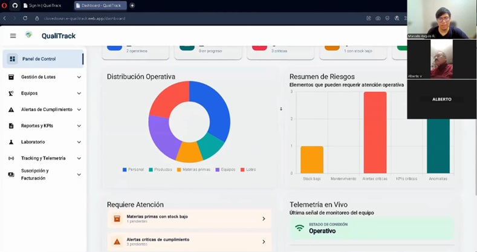

<strong>Resumen de Respuestas:</strong>

  El señor Alberto Valle comento que la presentación de información no era la más efectiva y considera que algunos elementos localizdos de la pagina no estan siendo aplicados correctamente.

  El presenta experiencia previa en el area laboral de la fabricación y control de farmacos, por lo que el señalo varios aspectos vitales que da la oportunidad de mejorar el diseño tomandolo de referencia.

  Calificó la aplicación como "en pcoreso" e indicó una urgencia en el sistmea de generación de lotes y la innecesidad de la extracción de datos relacionados a la materia prima empleada en el desarrollo del contro.

<h4>Entrevista 2 - Operador de Laboratorio (Segmento 2)</h4>

<table border="1" cellpadding="4" cellspacing="0">
  <tbody>
    <tr>
      <td><strong>Nombre Completo</strong></td>
      <td>Rocio Santo Alegre</td>
    </tr>
    <tr>
      <td><strong>Edad</strong></td>
      <td>49 años</td>
    </tr>
    <tr>
      <td><strong>Distrito</strong></td>
      <td>Chorrillos, Lima</td>
    </tr>
    <tr>
      <td><strong>Ocupación</strong></td>
      <td>Operadora de Laboratorio - Casa de Reposo</td>
    </tr>
    <tr>
      <td><strong>Fecha de Entrevista</strong></td>
      <td>18/06/2026</td>
    </tr>
    <tr>
      <td><strong>Duración</strong></td>
      <td>5:27 minutos</td>
    </tr>
    <tr>
      <td><strong>URL Microsoft Stream</strong></td>
      <td>https://shorturl.at/QxbzJ</td>
    </tr>
    <tr>
      <td><strong>Timing</strong></td>
      <td>5:08 - 10:35</td>
    </tr>
  </tbody>
</table>

<strong>Screenshot del video:</strong>

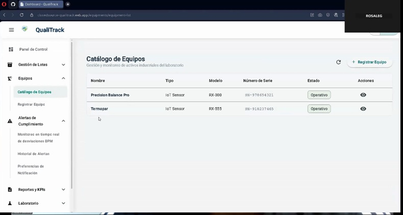

<strong>Resumen de Respuestas:</strong>

  Rocio indica que las dificultades más frecuentes es el tiempo en que uno tarda en procesar la información en varios documentos y pasando los datos clave al equipo de trabajo. Además, ella comenta de que el uso de maquinas que permitan registrar información de forma automatica presenta problemas de raíz en dependencia a la metodologia de trabajo del laboratorio.

  La interfaz de CualiTrack le pareció clara y bien organizada. Sin embargo, señaló la necesidad de mejorar  el sistema de la automatización de los reportes y la falta de indicativos notorios que explican que hace cada oppción de la propuesta

 Eya no señala un problema alguno importante,considerando que las observación son deenseñanza a los nuevos usuarios dentro de un laboratiro nuevo.

<h4>Entrevista 3 - QA Manageres y/o Jefes de Aseguramiento de Calidad (Segmento 1)</h4>

<table border="1" cellpadding="4" cellspacing="0">
  <tbody>
    <tr>
      <td><strong>Nombre Completo</strong></td>
      <td>Fred Palomino</td>
    </tr>
    <tr>
      <td><strong>Edad</strong></td>
      <td>41 años</td>
    </tr>
    <tr>
      <td><strong>Distrito</strong></td>
      <td>Sam Juan de Lurigancho</td>
    </tr>
    <tr>
      <td><strong>Ocupación</strong></td>
      <td>QA Manager</td>
    </tr>
    <tr>
      <td><strong>Fecha de Entrevista</strong></td>
      <td>18/06/2026</td>
    </tr>
    <tr>
      <td><strong>Duración</strong></td>
      <td>5:10 minutos</td>
    </tr>
    <tr>
      <td><strong>URL Microsoft Stream</strong></td>
      <td>https://shorturl.at/QxbzJ</td>
    </tr>
    <tr>
      <td><strong>Timing</strong></td>
      <td>10:36 - 15:46</td>
    </tr>
  </tbody>
</table>

<strong>Screenshot del video:</strong>

<strong>Resumen de Respuestas:</strong>

  Fred Palomino menciona que el trabajo en equipo muchas veces es el factor que más influye en la dificultad en el aarea laboral deobido a que el apunto de los datos que regulan en la fabricación de farmacos es por periodos.

  Con experiencia en la fabriación de farmacos, el menciona que seria bueno el asignar una clave exclusiva por usuario con el fin de protejer por completo el flujo de trabajo en caso de que en el equipo no se presente integrantes con base.

  El menciona que, dejando de lado el tema de la seguridad, esta propuesta le interesa debido a que confirma sus capacidades de optimizar el tiempo de desarrollo.

<h4>Entrevista 4 - Operador de Laboratorio (Segmento 2))</h4>

<table border="1" cellpadding="4" cellspacing="0">
  <tbody>
    <tr>
      <td><strong>Nombre Completo</strong></td>
      <td>Risa Sotelo</td>
    </tr>
    <tr>
      <td><strong>Edad</strong></td>
      <td>53 años</td>
    </tr>
    <tr>
      <td><strong>Distrito</strong></td>
      <td>San Isidro</td>
    </tr>
    <tr>
      <td><strong>Ocupación</strong></td>
      <td>Operador de Laboratorio</td>
    </tr>
    <tr>
      <td><strong>Fecha de Entrevista</strong></td>
      <td>17/06/2026</td>
    </tr>
    <tr>
      <td><strong>Duración</strong></td>
      <td>5:13 minutos</td>
    </tr>
    <tr>
      <td><strong>URL Microsoft Stream</strong></td>
      <td>https://shorturl.at/QxbzJ</td>
    </tr>
    <tr>
      <td><strong>Timing</strong></td>
      <td>15:47 - 20:60</td>
    </tr>
  </tbody>
</table>

<strong>Screenshot del video:</strong>

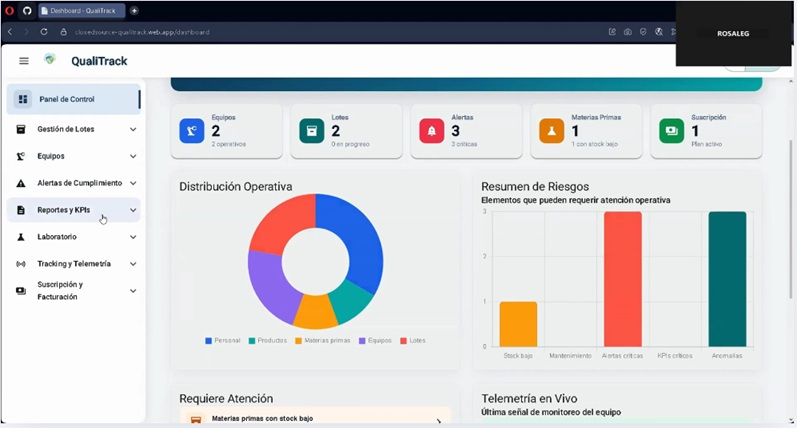

<strong>Resumen de Respuestas:</strong>

  Sotelo es la que más defectos pudo detectar en el desarrollo de la startup QualiTrack debido a metodos de trabajos empleados por ella. Expresó que su preocupación principal es el temá de los lotes al ver que el proceso es más simplista y no de una perespectiva positiva.

  La interfaz de QualiTrack, sibien menciona que el eorden lo bre agradable al mostrarle nuestra propuesta, el temá esta en el sistema de guardado para elementos que no presentan una prioridad en caso de detectar dificultades del control de calidad.

    Indico que la probabilidad de usar Qualitrack  no es la gran cosa considerando sus impresiones iniciales se relacionen con el servicio de automatización, indicando que la forma automatizada de Qualitrack no siempre ofrece un un buen serviciio acomodado al usuario.

  Indicó alta probabilidad de usar VEYRA y recomendó mejorar la documentación técnica y agregar opciones 
  de exportación de datos en múltiples formatos.

<h4>Entrevista 5 - QA Manageres y/o Jefes de Aseguramiento de Calidad (Segmento 1)- </h4>

<table border="1" cellpadding="4" cellspacing="0">
  <tbody>
    <tr>
      <td><strong>Nombre Completo</strong></td>
      <td>Delci Castro</td>
    </tr>
    <tr>
      <td><strong>Edad</strong></td>
      <td>59 años</td>
    </tr>
    <tr>
      <td><strong>Distrito</strong></td>
      <td>San Juan de Lurigancho</td>
    </tr>
    <tr>
      <td><strong>Ocupación</strong></td>
      <td>QA Manager</td>
    </tr>
    <tr>
      <td><strong>Fecha de Entrevista</strong></td>
      <td>19/06/2026</td>
    </tr>
    <tr>
      <td><strong>Duración</strong></td>
      <td>5:33 minutos</td>
    </tr>
    <tr>
      <td><strong>URL Microsoft Stream</strong></td>
      <td>https://shorturl.at/QxbzJ</td>
    </tr>
    <tr>
      <td><strong>Timing</strong></td>
      <td>15:47 - 20:60</td>
    </tr>
  </tbody>
</table>

<strong>Screenshot del video:</strong>

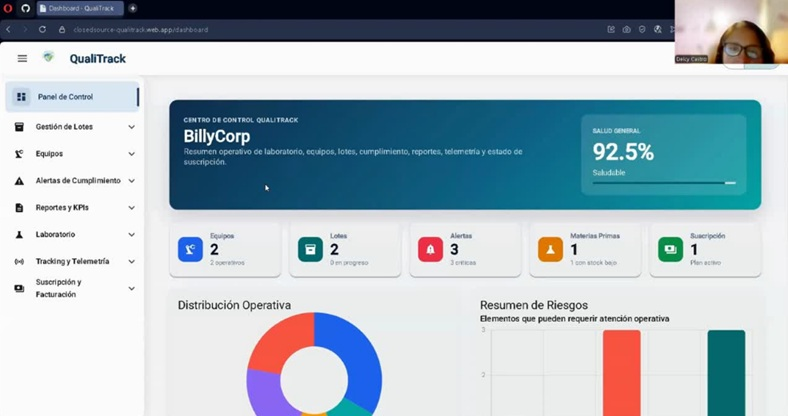

<strong>Resumen de Respuestas:</strong>

  La experiencia de Delcy Castro es notoria considerando que inclusve comentó que estaba de descanso temporalmente despues de haber cumplido con la labor del control. Ella menciona que el uso de herramientas que permitan recolectar los datos obtenidos de los sensores 

  La interfaz de QualiTrack, si  menciona que el el orden lo agradable al mostrarle nuestra propuesta, el temá esta en el sistema de guardado para elementos que no presentan una prioridad en caso de detectar dificultades del control de calidad.

   

  Indicó alta probabilidad de usar CualiTrack y recomendó optimizar los recuross empleados en la formación de lotes. Además indica que la generación de reportes no parece tán completo para ser considerando como una buena opción

### 5.3.3. Evaluaciones según heurísticas

  <h2>UX Heuristics & Principles Evaluation</h2>
  <h3>Usability – Inclusive Design – Information Architecture</h3>

<strong>CARRERA:</strong> Ingeniería de Software

<strong>CURSO:</strong> Desarrollo de Aplicaciones Open Source

<strong>PROFESOR:</strong> Ángel Augusto Velasquez Nuñez

<strong>AUDITOR:</strong> Equipo ClosedSource

<strong>PRODUCTO EVALUADO:</strong> QualiTrack Web Application

<strong>CLIENTE(S):</strong> QA Managers, Supervisores de Calidad, Lab Operators y responsables de cumplimiento BPM en laboratorios farmacéuticos.

 

<strong>TAREAS A EVALUAR:</strong>

El alcance de esta evaluación heurística incluye la revisión de los principales flujos
implementados en QualiTrack Web Application, considerando criterios de usabilidad,
diseño inclusivo, arquitectura de información, consistencia visual, prevención de errores
y claridad de los mensajes del sistema.

<ul>
  <li>Validar el flujo de inicio de sesión y acceso a la plataforma.</li>
  <li>Evaluar la navegación lateral por módulos y Bounded Contexts.</li>
  <li>Revisar la claridad del Dashboard operativo del laboratorio.</li>
  <li>Evaluar la gestión del perfil del laboratorio.</li>
  <li>Validar los formularios de equipos, lotes, personal, productos y materias primas.</li>
  <li>Revisar la visualización de telemetría, alertas de cumplimiento y reportes.</li>
  <li>Evaluar el flujo de planes de suscripción, checkout con Stripe y resumen de facturación.</li>
  <li>Revisar mensajes de error, estados vacíos, estados de carga y confirmaciones del sistema.</li>
  <li>Verificar la consistencia del idioma entre inglés y español.</li>
  <li>Evaluar la claridad de botones de acción, etiquetas, tablas y componentes visuales.</li>
</ul>

 

<strong>ESCALA DE SEVERIDAD:</strong>

Los problemas identificados fueron puntuados tomando en cuenta la siguiente escala de
severidad:

<table border="1" cellpadding="4" cellspacing="0">
  <thead>
    <tr>
      <th>Nivel</th>
      <th>Descripción</th>
    </tr>
  </thead>
  <tbody>
    <tr>
      <td align="center">1</td>
      <td>Problema superficial: puede ser superado fácilmente por el usuario o ocurre con poca frecuencia. No requiere corrección inmediata, salvo que exista disponibilidad de tiempo.</td>
    </tr>
    <tr>
      <td align="center">2</td>
      <td>Problema menor: genera cierta fricción en la experiencia, pero no impide completar la tarea. Debe priorizarse para una siguiente iteración.</td>
    </tr>
    <tr>
      <td align="center">3</td>
      <td>Problema mayor: dificulta completar una tarea importante o puede causar errores frecuentes. Debe corregirse con prioridad alta.</td>
    </tr>
    <tr>
      <td align="center">4</td>
      <td>Problema crítico: impide completar una tarea clave del sistema o afecta gravemente la confianza del usuario. Debe corregirse antes de un release estable.</td>
    </tr>
  </tbody>
</table>

 

<strong>TABLA RESUMEN:</strong>

<table border="1" cellpadding="4" cellspacing="0">
  <thead>
    <tr>
      <th>#</th>
      <th>Problema</th>
      <th>Escala de severidad</th>
      <th>Heurística/Principio violada(o)</th>
    </tr>
  </thead>
  <tbody>
    <tr>
      <td>1</td>
      <td>Algunas acciones muestran claves de traducción en lugar de texto legible para el usuario, por ejemplo en el botón de cancelación de suscripción.</td>
      <td align="center">3</td>
      <td>Consistency and standards / Match between system and the real world</td>
    </tr>
    <tr>
      <td>2</td>
      <td>Algunos mensajes de error son técnicos o poco orientadores, como errores inesperados al cargar una suscripción.</td>
      <td align="center">3</td>
      <td>Help users recognize, diagnose, and recover from errors</td>
    </tr>
    <tr>
      <td>3</td>
      <td>El Dashboard concentra varias métricas, gráficos y tarjetas en una sola vista, lo que puede generar carga cognitiva para usuarios nuevos.</td>
      <td align="center">2</td>
      <td>Aesthetic and minimalist design / Information Architecture</td>
    </tr>
    <tr>
      <td>4</td>
      <td>El primer acceso al backend desplegado puede tardar por la reactivación del servicio en Render, sin explicar claramente al usuario que el sistema está cargando.</td>
      <td align="center">2</td>
      <td>Visibility of system status</td>
    </tr>
    <tr>
      <td>5</td>
      <td>Algunas acciones críticas, como cancelar suscripciones o actualizar estados, requieren mayor confirmación antes de ejecutarse.</td>
      <td align="center">3</td>
      <td>Error prevention / User control and freedom</td>
    </tr>
    <tr>
      <td>6</td>
      <td>La navegación lateral contiene varios módulos y submódulos, lo que puede dificultar encontrar rápidamente una funcionalidad específica.</td>
      <td align="center">2</td>
      <td>Recognition rather than recall / Information Architecture</td>
    </tr>
    <tr>
      <td>7</td>
      <td>Algunos campos técnicos de formularios, como parámetros BPM, telemetría o umbrales, no cuentan con ayuda contextual suficiente.</td>
      <td align="center">3</td>
      <td>Help and documentation</td>
    </tr>
    <tr>
      <td>8</td>
      <td>Existe mezcla ocasional de inglés y español en etiquetas, estados o mensajes, afectando la consistencia de la experiencia bilingüe.</td>
      <td align="center">2</td>
      <td>Consistency and standards</td>
    </tr>
    <tr>
      <td>9</td>
      <td>El flujo de Stripe Checkout redirige fuera de la plataforma, pero requiere una explicación previa más clara para que el usuario entienda el cambio de contexto.</td>
      <td align="center">2</td>
      <td>Visibility of system status / User control and freedom</td>
    </tr>
    <tr>
      <td>10</td>
      <td>Las tablas de pagos, reportes, auditoría o historial podrían beneficiarse de filtros, búsqueda o paginación más visibles.</td>
      <td align="center">2</td>
      <td>Flexibility and efficiency of use</td>
    </tr>
  </tbody>
</table>

 

<h4>Descripción Detallada de Problemas Críticos</h4>

<strong>Problema 1: Etiquetas de traducción visibles en acciones de suscripción.</strong>

<strong>Severidad:</strong> 3

  <strong>Heurística/Principio violada(o):</strong> Consistency and standards y Match between system and the real world.

  <strong>Problema:</strong> En la vista de <em>Billing Summary</em> se identificó que una acción relacionada con la suscripción podía mostrarse como una clave de traducción, por ejemplo
  <code>subscription.billing.cancel-subscription</code>, en lugar de un texto comprensible para el usuario. Este problema afecta la claridad de la interfaz, reduce la confianza en el sistema y transmite la percepción de que la aplicación no está completamente terminada.

  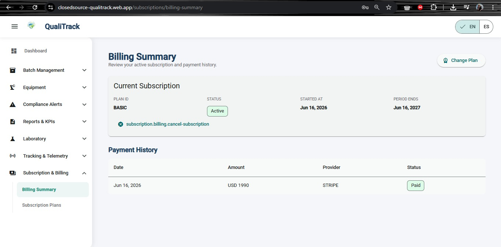
  
<em>Figura: Evidencia de etiqueta de traducción visible en el módulo Subscription & Billing.</em>

  <strong>Recomendación:</strong> Completar las claves faltantes en los archivos de internacionalización para inglés y español. El texto debe mostrarse como <strong>Cancel subscription</strong> en inglés y <strong>Cancelar suscripción</strong> en español. Además, se recomienda revisar todas las vistas principales con ambos idiomas activos antes del despliegue.

<strong>Problema 2: Mensajes de error técnicos al cargar información de suscripción.</strong>

<strong>Severidad:</strong> 3

  <strong>Heurística/Principio violada(o):</strong> Help users recognize, diagnose, and recover from errors.

  <strong>Problema:</strong> Durante la validación del módulo <em>Subscription & Billing</em>, la interfaz mostró mensajes como <em>Failed to fetch subscription for laboratory 1: Unexpected server error</em>. Aunque el mensaje permite identificar el origen técnico del problema, no está orientado al usuario final ni indica una acción clara de recuperación.

  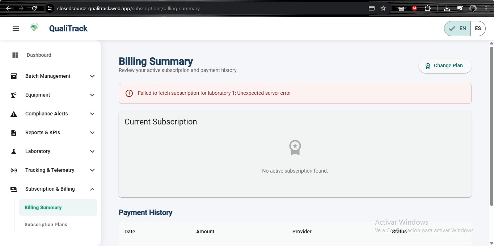
  
<em>Figura: Mensaje técnico mostrado al usuario durante la carga de suscripción.</em>

  <strong>Recomendación:</strong> Reemplazar los mensajes técnicos por mensajes amigables y accionables, como: <em>No se pudo cargar la información de la suscripción. Por favor, recargue la página o intente nuevamente en unos segundos.</em> El detalle técnico debe mantenerse en consola o logs internos, evitando exponerlo directamente al usuario.

<strong>Problema 3: Alta densidad de información en el Dashboard operativo.</strong>

<strong>Severidad:</strong> 2

  <strong>Heurística/Principio violada(o):</strong> Aesthetic and minimalist design e Information Architecture.

  <strong>Problema:</strong> El Dashboard de QualiTrack muestra múltiples elementos en una sola vista: resumen general, salud operacional, tarjetas de equipos, lotes, alertas, materias primas, suscripción, gráficos de distribución y riesgos. Aunque esta información es valiosa, puede resultar abrumadora para usuarios nuevos o para operadores que necesitan identificar rápidamente tareas críticas.

  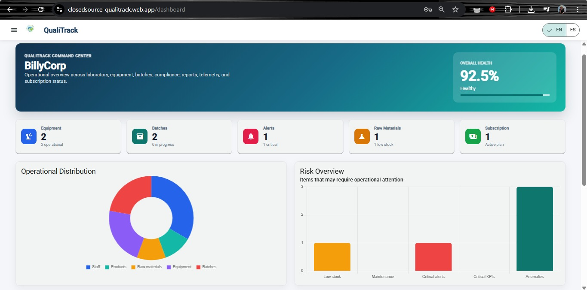
  
<em>Figura: Dashboard con métricas operativas y gráficos en una sola vista.</em>

  <strong>Recomendación:</strong> Priorizar la información crítica mediante una jerarquía visual más clara. Se recomienda agrupar métricas en secciones, destacar alertas críticas con mayor prominencia y añadir filtros rápidos por módulo. También se puede incluir una vista resumida para usuarios operativos y una vista avanzada para administradores o QA Managers.

<strong>Problema 4: Falta de explicación durante el primer tiempo de carga del backend.</strong>

<strong>Severidad:</strong> 2

  <strong>Heurística/Principio violada(o):</strong> Visibility of system status.

  <strong>Problema:</strong> Debido al despliegue del backend en Render, el servicio puede tardar en responder cuando la instancia se reactiva después de un periodo de inactividad. Para el usuario final, esta demora puede percibirse como un error de conexión o una falla de la aplicación si no existe un estado de carga claro.

  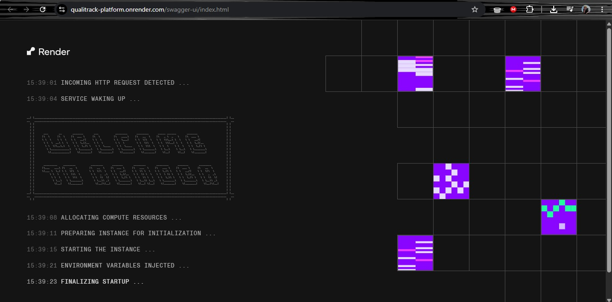
  
<em>Figura: Validación del comportamiento de carga durante la conexión con el backend desplegado.</em>

  <strong>Recomendación:</strong> Implementar mensajes de estado más claros durante operaciones de carga prolongadas, por ejemplo: <em>Conectando con el servidor de QualiTrack...</em> o <em>Estamos preparando la información del laboratorio. Esto puede tomar unos segundos.</em> También se recomienda mantener indicadores de carga visibles.

<strong>Problema 5: Acciones críticas sin confirmación suficientemente explícita.</strong>

<strong>Severidad:</strong> 3

  <strong>Heurística/Principio violada(o):</strong> Error prevention y User control and freedom.

  <strong>Problema:</strong> Algunas acciones de alto impacto, como cancelar una suscripción, actualizar el estado de un lote, modificar datos de laboratorio o cambiar el estado de una alerta, requieren una confirmación más explícita antes de ejecutarse. En un entorno farmacéutico, estas acciones pueden afectar trazabilidad, cumplimiento y operación.

  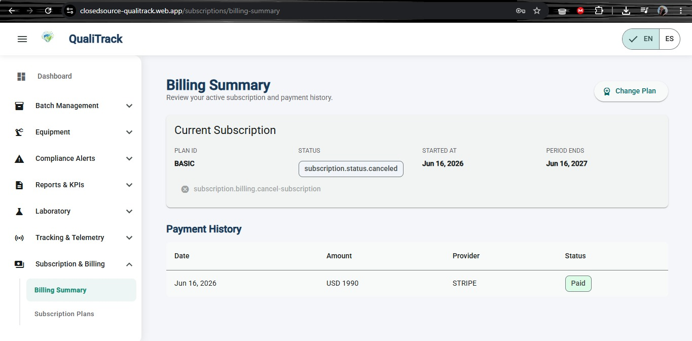
  
<em>Figura: Flujo de acción crítica que requiere mayor prevención de errores.</em>

  <strong>Recomendación:</strong> Incorporar modales de confirmación para acciones irreversibles o sensibles. Estos modales deben indicar claramente la consecuencia de la acción, el recurso afectado y las opciones disponibles: <strong>Confirmar</strong>, <strong>Cancelar</strong> o <strong>Volver</strong>. Para acciones de suscripción, se recomienda informar si el acceso se mantendrá hasta el final del periodo activo.

<h4>Conclusión de la Evaluación Heurística</h4>

La evaluación heurística permitió identificar oportunidades de mejora en la experiencia de usuario de QualiTrack, especialmente en consistencia lingüística, prevención de errores, claridad de mensajes, reducción de carga cognitiva y ayuda contextual. En términos generales, la aplicación presenta una estructura funcional sólida y una arquitectura de información alineada con los Bounded Contexts del dominio farmacéutico.

Sin embargo, para fortalecer la usabilidad en un entorno regulado, se recomienda priorizar la corrección de etiquetas de traducción, mensajes de error amigables, confirmaciones para acciones críticas, indicadores de carga más claros y guías contextuales en formularios técnicos. Estas mejoras contribuirán a que QA Managers, Supervisores de Calidad y Lab Operators puedan usar la plataforma con mayor confianza, reduciendo errores operativos y facilitando la adopción de QualiTrack como solución SaaS para la gestión de calidad farmacéutica.

## 5.4. Video About-the-Product

  El video <strong>"About the Product"</strong> presenta de manera clara y atractiva la propuesta de valor de
  <strong>QualiTrack</strong>, explicando los principales problemas que enfrentan los laboratorios farmacéuticos
  en la gestión de calidad, cumplimiento BPM, trazabilidad de lotes, monitoreo de equipos y control de suscripciones.
  Asimismo, muestra cómo la solución permite digitalizar procesos críticos, centralizar información operativa,
  automatizar alertas y fortalecer el cumplimiento regulatorio mediante una plataforma SaaS integrada.

<h4>Información General del Video</h4>

<table border="1" cellpadding="4" cellspacing="0">
  <tbody>
    <tr>
      <td><strong>Título del Video</strong></td>
      <td>QualiTrack: Pharmaceutical Quality Management with IoT and BPM Compliance</td>
    </tr>
    <tr>
      <td><strong>Duración</strong></td>
      <td>	2 minutos 2 segundos</td>
    </tr>
    <tr>
      <td><strong>Fecha de Grabación</strong></td>
      <td>19/06/2026</td>
    </tr>
    <tr>
      <td><strong>URL YouTube</strong></td>
      <td>
        <a href="https://youtu.be/LpOAo21-778">
          https://youtu.be/LpOAo21-778
        </a>
      </td>
    </tr>
    <tr>
      <td><strong>URL Microsoft Stream</strong></td>
      <td>
        <a href="https://shorturl.at/FCgv3">
          https://shorturl.at/FCgv3
        </a>
      </td>
    </tr>
  </tbody>
</table>

<strong>Screenshot del video:</strong>

  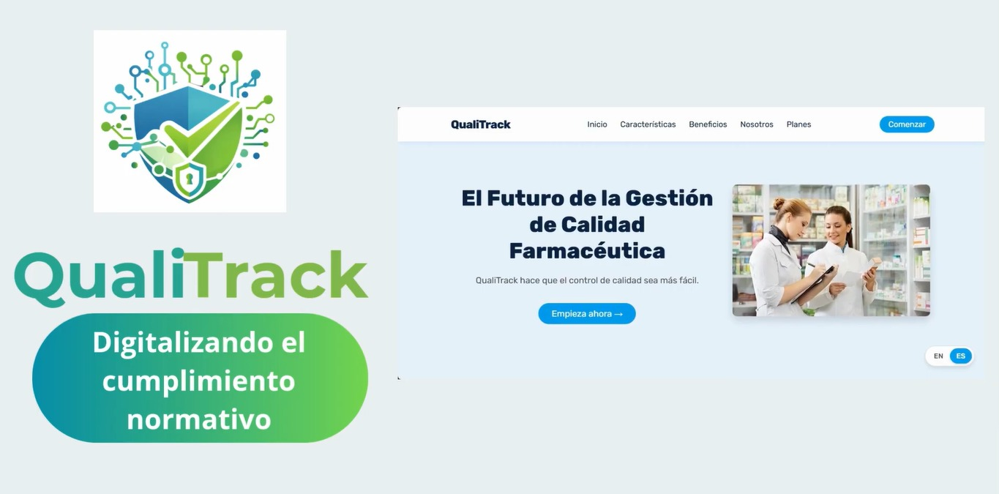
  
<em>Figura: Captura del video About the Product de QualiTrack.</em>

<h4>Contenido del Video</h4>

  El video está estructurado en las siguientes secciones:

<ol>
  <li>
    <strong>Introducción:</strong> Presentación de QualiTrack como una solución SaaS orientada a laboratorios
    farmacéuticos que necesitan mejorar la trazabilidad, el control de calidad y el cumplimiento de buenas
    prácticas de manufactura.
  </li>
  <li>
    <strong>Problema identificado:</strong> Explicación de las dificultades comunes en laboratorios que aún
    dependen de registros manuales, hojas de cálculo, reportes dispersos y controles reactivos para supervisar
    lotes, equipos, materias primas y eventos de cumplimiento.
  </li>
  <li>
    <strong>Propuesta de solución:</strong> Presentación de QualiTrack como una plataforma centralizada que
    permite gestionar laboratorios, personal, equipos, lotes, alertas, reportes, telemetría y suscripciones
    desde una misma aplicación web.
  </li>
  <li>
    <strong>Funcionalidades principales:</strong> Demostración de las características clave de la solución:
    <ul>
      <li>Dashboard operativo con indicadores de salud general del laboratorio.</li>
      <li>Gestión de equipos, estados de telemetría, mediciones e historial operativo.</li>
      <li>Administración de lotes de producción y materias primas asociadas.</li>
      <li>Registro y seguimiento de alertas de desviación y eventos de cumplimiento.</li>
      <li>Generación de reportes, auditoría y KPIs para soporte de decisiones.</li>
      <li>Gestión de planes de suscripción, checkout con Stripe e historial de pagos.</li>
    </ul>
  </li>
  <li>
    <strong>Beneficios para el usuario:</strong> Énfasis en los beneficios para QA Managers, Supervisores de
    Calidad y Lab Operators, tales como reducción de errores manuales, mayor visibilidad operacional,
    trazabilidad centralizada y mejor capacidad de respuesta ante desviaciones.
  </li>
  <li>
    <strong>Llamada a la acción:</strong> Invitación a visitar el Landing Page de QualiTrack, conocer los planes
    disponibles y acceder a la Web Application para explorar las funcionalidades del producto.
  </li>
</ol>

<h4>Inscripción en Landing Page</h4>

  El video <strong>"About the Product"</strong> se encuentra disponible como material audiovisual de presentación
  del producto QualiTrack. Este recurso permite que potenciales clientes comprendan la propuesta de valor antes
  de registrarse, seleccionar un plan o solicitar mayor información sobre la plataforma.

  <strong>URL del Landing Page donde está el video:</strong>
  <a href="https://closedsource-11848.github.io/ClosedSource-LandingPage/">
    https://closedsource-11848.github.io/ClosedSource-LandingPage/
  </a>

  <strong>URL de la Web Application:</strong>
  <a href="https://closedsource-qualitrack.web.app">
    https://closedsource-qualitrack.web.app
  </a>

# Conclusiones

## Conclusiones y recomendaciones

 Al finalizar el ciclo de desarrollo, implementación y validación de la solución <strong>QualiTrack</strong>, el equipo ha llegado a una serie de conclusiones clave, contrastando los resultados obtenidos con los planteamientos iniciales definidos bajo el enfoque Lean UX y el desarrollo ágil basado en Sprints. 
 
<strong>1. Validación de Problem Statements y Supuestos (Assumptions):</strong>
 
 Inicialmente, se planteó como <em>Problem Statement</em> que los laboratorios farmacéuticos enfrentan dificultades para garantizar el cumplimiento de las Buenas Prácticas de Manufactura (BPM) debido a procesos manuales, falta de trazabilidad en tiempo real y limitada integración de datos de telemetría. A partir de la implementación del Landing Page y la validación con usuarios, se confirmó que existe una necesidad real de soluciones digitales que automaticen el monitoreo y control de procesos críticos. 
 
 Asimismo, se validó el supuesto de que los responsables de calidad (QA Managers) valoran altamente la centralización de información y la automatización de alertas. Sin embargo, se identificó que el nivel de exigencia en términos de precisión, auditoría y cumplimiento normativo es incluso mayor al esperado, lo que implica que la solución debe priorizar la confiabilidad, integridad de datos y cumplimiento regulatorio desde sus etapas iniciales. 
 
<strong>2. Contrastación de Hipótesis (Hypothesis Statements):</strong>
 <ul> <li> <strong>Hipótesis de Valor para QA Managers:</strong> Se planteó que "Si proporcionamos dashboards con monitoreo en tiempo real y alertas automáticas, los responsables de calidad podrán detectar desviaciones de forma más eficiente". Los resultados obtenidos en el Sprint 1 (a nivel de propuesta de valor y percepción del usuario) validan esta hipótesis, ya que las funcionalidades relacionadas con monitoreo IoT y control automatizado fueron percibidas como altamente relevantes. </li> <li> <strong>Hipótesis de Valor para Entidades Reguladoras:</strong> Se asumió que "La generación de reportes auditables facilitará los procesos de supervisión y cumplimiento". Esta hipótesis se mantiene validada a nivel conceptual, aunque se identificó que los usuarios requieren no solo reportes estáticos, sino también historiales inmutables, trazabilidad completa y facilidad de exportación para auditorías externas. </li> </ul> 
<strong>3. Cumplimiento de Criterios de Éxito:</strong>
 
 Durante el Sprint 1, se logró implementar y desplegar exitosamente el Landing Page de QualiTrack mediante GitHub Pages, cumpliendo con los criterios de aceptación definidos: navegación completa, presentación clara de la propuesta de valor, soporte bilingüe y acceso a documentos legales. 
 
 No obstante, al tratarse de un primer incremento enfocado en la capa de presentación, aún no se han validado métricas críticas relacionadas con el uso del sistema, tales como eficiencia operativa, reducción de errores o tiempos de respuesta, las cuales serán evaluadas en los siguientes sprints con la implementación del Backend y los servicios de telemetría. 
 
<strong>Recomendaciones (Roadmap):</strong>
 
 En base a los hallazgos obtenidos y las limitaciones actuales del alcance del Sprint 1, se proponen las siguientes líneas de acción para las siguientes etapas del proyecto: 
 <ul> <li> <strong>Implementación del Backend y Servicios IoT:</strong> Priorizar el desarrollo de los Web Services con Spring Boot para la ingesta de datos de telemetría en tiempo real, ya que representan el núcleo funcional de la propuesta de valor de QualiTrack. </li> <li> <strong>Desarrollo del Dashboard Interactivo:</strong> Construir la aplicación frontend completa en Angular que permita visualizar datos en tiempo real, gestionar lotes y monitorear cumplimiento BPM mediante dashboards dinámicos. </li> <li> <strong>Integración de Módulo de Auditoría:</strong> Incorporar funcionalidades de generación de reportes inmutables, historiales de cambios y trazabilidad completa, alineadas con los requerimientos de auditoría del sector farmacéutico. </li> <li> <strong>Validación con Usuarios Reales:</strong> Realizar pruebas de usabilidad y validación con QA Managers y entidades regulatorias para medir el impacto real de la solución y ajustar funcionalidades según feedback directo. </li> <li> <strong>Escalabilidad y Despliegue en Producción:</strong> Preparar la arquitectura para soportar despliegues en la nube (Azure), asegurando alta disponibilidad, seguridad de datos y cumplimiento de estándares industriales. </li> </ul>

<!-- 

## Video About-the-Team

comentario -->

# Bibliografía

<ul>
  <li>
    Brown, S. (2020). <em>The C4 model for visualising software architecture</em>. C4 Model. Recuperado de <a href="https://c4model.com/">https://c4model.com/</a>
  </li>
  <li>
    Cohn, M. (2004). <em>User Stories Applied: For Agile Software Development</em>. Addison-Wesley Professional.
  </li>
  <li>
    Evans, E. (2003). <em>Domain-Driven Design: Tackling Complexity in the Heart of Software</em>. Addison-Wesley Professional.
  </li>
  <li>
    Gothelf, J., & Seiden, J. (2021). <em>Lean UX: Designing Great Products with Agile Teams</em> (3rd ed.). O'Reilly Media.
  </li>
  <li>
    Robertson, J., Robertson, S., & Reed, A. (2023). <em>Mastering the Requirements Process: Getting Requirements Right</em> (4th ed.). Addison-Wesley Professional.
  </li>
  <li>
    Wiegers, K., & Hokanson, C. (2023). <em>Software Requirements Essentials: Core Practices for Successful Business Analysis</em>. Addison-Wesley Professional.
  </li>
  <li>
    Heath, F. (2020). <em>Managing Software Requirements the Agile Way</em>. Packt Publishing.
  </li>
  <li>
    Lee, C. (2023). <em>The Art of Crafting User Stories</em>. O'Reilly Media.
  </li>
  <li>
    Dirección General de Medicamentos, Insumos y Drogas [DIGEMID]. (2018). <em>Manual de Buenas Prácticas de Manufactura de Productos Farmacéuticos</em>. Ministerio de Salud del Perú.
  </li>

  <li>
    Mendel, J. (s.f.). <em>Seriously, what’s your startup’s problem?</em>. Recuperado de <a href="https://medium.com/@jakemendel/seriously-whats-your-startup-s-problemb3a884c54ab4">https://medium.com/@jakemendel/seriously-whats-your-startup-s-problemb3a884c54ab4</a>
  </li>
  <li>
    <em>Lean UX – Chapter 3 (Sampler)</em>. Recuperado de <a href="https://www.scribd.com/document/655516553/Leanux-Sampler">https://www.scribd.com/document/655516553/Leanux-Sampler</a>
  </li>
  <li>
    Dittrich, J. (s.f.). <em>A Beginner’s Guide to Finding User Needs</em>. Recuperado de <a href="https://jdittrich.github.io/userNeedResearchBook/">https://jdittrich.github.io/userNeedResearchBook/</a>
  </li>
  <li>
    Mountain Goat Software. (s.f.). <em>User Stories Articles</em>. Recuperado de <a href="https://www.mountaingoatsoftware.com/blog/tag/user-stories">https://www.mountaingoatsoftware.com/blog/tag/user-stories</a>
  </li>
  <li>
    Sameera, S. (s.f.). <em>How to Write a User Story for an API Product</em>. Recuperado de <a href="https://sameera17w.medium.com/how-to-write-a-user-story-for-an-api-product7af6abd4ad2e">https://sameera17w.medium.com/how-to-write-a-user-story-for-an-api-product7af6abd4ad2e</a>
  </li>

  <li>
    UXPressia. (s.f.). <em>User vs. Buyer Persona: Differences and free template</em>. Recuperado de <a href="https://uxpressia.com/blog/user-persona-vs-buyer-persona-difference">https://uxpressia.com/blog/user-persona-vs-buyer-persona-difference</a>
  </li>
  <li>
    UXPressia. (s.f.). <em>How to create an Impact Map in 4 easy steps?</em>. Recuperado de <a href="https://uxpressia.com/blog/build-impact-map-4-easy-steps">https://uxpressia.com/blog/build-impact-map-4-easy-steps</a>
  </li>
  <li>
    IBM. (s.f.). <em>As-is Scenario Map</em>. Recuperado de <a href="https://www.ibm.com/design/thinking/page/toolkit/activity/as-is-scenario-map">https://www.ibm.com/design/thinking/page/toolkit/activity/as-is-scenario-map</a>
  </li>
  <li>
    IBM. (s.f.). <em>To-be Scenario Map</em>. Recuperado de <a href="https://www.ibm.com/design/thinking/page/toolkit/activity/to-be-scenario-map">https://www.ibm.com/design/thinking/page/toolkit/activity/to-be-scenario-map</a>
  </li>
  <li>
    IBM. (s.f.). <em>Empathy Map</em>. Recuperado de <a href="https://www.ibm.com/design/thinking/page/toolkit/activity/empathy-map">https://www.ibm.com/design/thinking/page/toolkit/activity/empathy-map</a>
  </li>
  <li>
    Nielsen Norman Group. (s.f.). <em>Empathy Mapping</em>. Recuperado de <a href="https://www.nngroup.com/articles/empathy-mapping/">https://www.nngroup.com/articles/empathy-mapping/</a>
  </li>
  <li>
    Nielsen Norman Group. (s.f.). <em>Design Systems 101</em>. Recuperado de <a href="https://www.nngroup.com/articles/design-systems-101/">https://www.nngroup.com/articles/design-systems-101/</a>
  </li>
  <li>
    Nielsen Norman Group. (s.f.). <em>Front-End Style Guides</em>. Recuperado de <a href="https://www.nngroup.com/articles/front-end-style-guides/">https://www.nngroup.com/articles/front-end-style-guides/</a>
  </li>
  <li>
    Nielsen Norman Group. (s.f.). <em>The Four Dimensions of Tone of Voice</em>. Recuperado de <a href="https://www.nngroup.com/articles/tone-of-voice-dimensions/">https://www.nngroup.com/articles/tone-of-voice-dimensions/</a>
  </li>
  <li>
    CareerFoundry. (s.f.). <em>What are User Flows in UX Design?</em>. Recuperado de <a href="https://careerfoundry.com/en/blog/ux-design/what-are-user-flows/">https://careerfoundry.com/en/blog/ux-design/what-are-user-flows/</a>
  </li>

  <li>
    Progressa Lean. (s.f.). <em>5W2H – Técnica de análisis de problemas</em>. Recuperado de <a href="https://www.progressalean.com/5w2h-tecnica-de-analisis-de-problemas/">https://www.progressalean.com/5w2h-tecnica-de-analisis-de-problemas/</a>
  </li>
  <li>
    DZone. (s.f.). <em>Acceptance Criteria in Scrum</em>. Recuperado de <a href="https://dzone.com/articles/acceptance-criteria-in-software-explanation-exampl">https://dzone.com/articles/acceptance-criteria-in-software-explanation-exampl</a>
  </li>
  <li>
    Modern Requirements. (s.f.). <em>Requirements Traceability Matrix</em>. Recuperado de <a href="https://www.modernrequirements.com/blogs/using-a-requirements-traceabilitymatrix-to-improve-project-quality/">https://www.modernrequirements.com/blogs/using-a-requirements-traceabilitymatrix-to-improve-project-quality/</a>
  </li>

  <li>
    Fowler, M. (s.f.). <em>Ubiquitous Language</em>. Recuperado de <a href="https://martinfowler.com/bliki/UbiquitousLanguage.html">https://martinfowler.com/bliki/UbiquitousLanguage.html</a>
  </li>
  <li>
    Open Practice Library. (s.f.). <em>Ubiquitous Language</em>. Recuperado de <a href="https://openpracticelibrary.com/practice/ubiquitous-language/">https://openpracticelibrary.com/practice/ubiquitous-language/</a>
  </li>
  <li>
    Nick Tune. (s.f.). <em>Domain-Driven Architecture Diagrams</em>. Recuperado de <a href="https://medium.com/nick-tune-tech-strategy-blog/domain-driven-architecturediagrams-139a75acb578">https://medium.com/nick-tune-tech-strategy-blog/domain-driven-architecturediagrams-139a75acb578</a>
  </li>
  <li>
    Domain Storytelling. (s.f.). <em>Domain Storytelling and Requirements</em>. Recuperado de <a href="https://domainstorytelling.org/#dst-requirements">https://domainstorytelling.org/#dst-requirements</a>
  </li>
  <li>
    DDD Crew. (s.f.). <em>Big Picture EventStorming</em>. Recuperado de <a href="https://github.com/ddd-by-examples/library/blob/master/docs/big-picture.md">https://github.com/ddd-by-examples/library/blob/master/docs/big-picture.md</a>
  </li>
  <li>
    DDD Crew. (s.f.). <em>Design Level EventStorming</em>. Recuperado de <a href="https://github.com/ddd-by-examples/library/blob/master/docs/design-level.md">https://github.com/ddd-by-examples/library/blob/master/docs/design-level.md</a>
  </li>

  <li>
    <em>The Markdown Guide</em>. Recuperado de <a href="https://www.markdownguide.org/">https://www.markdownguide.org/</a>
  </li>
  <li>
    Noam Tamim. (s.f.). <em>How to use PlantUML with Markdown</em>. Recuperado de <a href="https://gist.github.com/noamtamim/f11982b28602bd7e604c233fbe9d910f">https://gist.github.com/noamtamim/f11982b28602bd7e604c233fbe9d910f</a>
  </li>
  <li>
    Structurizr. (s.f.). <em>Embedding diagrams</em>. Recuperado de <a href="https://docs.structurizr.com/cloud/embed">https://docs.structurizr.com/cloud/embed</a>
  </li>
  <li>
    Connect2Group. (s.f.). <em>Using PlantUML for diagrams</em>. Recuperado de <a href="https://connect2grp.medium.com/using-plantuml-for-creating-clear-and-concisediagrams-2fc621529560">https://connect2grp.medium.com/using-plantuml-for-creating-clear-and-concisediagrams-2fc621529560</a>
  </li>

  <li>
    Driessen, V. (2010). <em>A successful Git branching model</em>. Recuperado de <a href="https://nvie.com/posts/a-successful-git-branching-model/">https://nvie.com/posts/a-successful-git-branching-model/</a>
  </li>
  <li>
    <em>Semantic Versioning 2.0.0</em>. Recuperado de <a href="https://semver.org/">https://semver.org/</a>
  </li>
  <li>
    <em>Conventional Commits</em>. Recuperado de <a href="https://www.conventionalcommits.org/">https://www.conventionalcommits.org/</a>
  </li>
  <li>
    W3Schools. (s.f.). <em>HTML Style Guide</em>. Recuperado de <a href="https://www.w3schools.com/html/html5_syntax.asp">https://www.w3schools.com/html/html5_syntax.asp</a>
  </li>
  <li>
    Google. (s.f.). <em>HTML/CSS Style Guide</em>. Recuperado de <a href="https://google.github.io/styleguide/htmlcssguide.html">https://google.github.io/styleguide/htmlcssguide.html</a>
  </li>
  <li>
    Google. (s.f.). <em>JavaScript Style Guide</em>. Recuperado de <a href="https://google.github.io/styleguide/jsguide.html">https://google.github.io/styleguide/jsguide.html</a>
  </li>
  <li>
    Google. (s.f.). <em>TypeScript Style Guide</em>. Recuperado de <a href="https://google.github.io/styleguide/tsguide.html">https://google.github.io/styleguide/tsguide.html</a>
  </li>
  <li>
    Google. (s.f.). <em>Java Style Guide</em>. Recuperado de <a href="https://google.github.io/styleguide/javaguide.html">https://google.github.io/styleguide/javaguide.html</a>
  </li>
  <li>
    Angular. (s.f.). <em>Angular Coding Style Guide</em>. Recuperado de <a href="https://angular.io/guide/styleguide">https://angular.io/guide/styleguide</a>
  </li>
  <li>
    Spring. (s.f.). <em>Spring Boot Features</em>. Recuperado de <a href="https://docs.spring.io/spring-boot/docs/current/reference/html/features.html">https://docs.spring.io/spring-boot/docs/current/reference/html/features.html</a>
  </li>
  <li>
    SpecFlow. (s.f.). <em>Gherkin Conventions</em>. Recuperado de <a href="https://specflow.org/gherkin/gherkin-conventions-for-readable-specifications/">https://specflow.org/gherkin/gherkin-conventions-for-readable-specifications/</a>
  </li>
  <li>
    HubSpot. (s.f.). <em>Meta Tags and SEO</em>. Recuperado de <a href="https://blog.hubspot.com/marketing/meta-tags">https://blog.hubspot.com/marketing/meta-tags</a>
  </li>
</ul>

## Video About-the-Team

  El video <strong>"About the Team"</strong> presenta al equipo de desarrollo de <strong>ClosedSource</strong>,
  destacando las habilidades, roles y contribuciones de cada integrante en el proyecto <strong>QualiTrack</strong>.
  Este video complementa la documentación del proyecto mostrando el lado humano detrás del desarrollo de la solución,
  así como la participación del equipo en el diseño, implementación, integración, despliegue y validación de la plataforma.

<h4>Información General del Video</h4>

<table border="1" cellpadding="4" cellspacing="0">
  <tbody>
    <tr>
      <td><strong>Título del Video</strong></td>
      <td>ClosedSource: Meet the Team Behind QualiTrack</td>
    </tr>
    <tr>
      <td><strong>Duración</strong></td>
      <td>10 minutos 9 segundos</td>
    </tr>
    <tr>
      <td><strong>Fecha de Grabación</strong></td>
      <td>20/06/2026</td>
    </tr>
    <tr>
      <td><strong>URL YouTube</strong></td>
      <td>
        <a href="https://youtu.be/bGTHeGe3x6U">
          https://youtu.be/bGTHeGe3x6U
        </a>
      </td>
    </tr>
    <tr>
      <td><strong>URL Microsoft Stream</strong></td>
      <td>
        <a href="https://shorturl.at/Yl5A8">
          https://shorturl.at/Yl5A8
        </a>
      </td>
    </tr>
  </tbody>
</table>

<strong>Screenshot del video:</strong>

  
  
<em>Figura: Captura del video About the Team de QualiTrack.</em>

<h4>Contenido del Video</h4>

  El video incluye presentaciones individuales de los integrantes del equipo ClosedSource,
  explicando su participación dentro del desarrollo de QualiTrack y las responsabilidades
  asumidas durante los sprints del proyecto.

<ul>
  <li>Nombre completo de cada integrante del equipo.</li>
  <li>Rol principal dentro del proyecto QualiTrack.</li>
  <li>Responsabilidades asumidas durante el desarrollo.</li>
  <li>Tecnologías y herramientas utilizadas durante la implementación.</li>
  <li>Contribuciones en frontend, backend, base de datos, despliegue, documentación y pruebas.</li>
  <li>Aprendizajes obtenidos durante el desarrollo de una solución SaaS para laboratorios farmacéuticos.</li>
  <li>Expectativas y oportunidades de mejora para futuras iteraciones del producto.</li>
</ul>

<h4>Miembros del Equipo</h4>

<table border="1" cellpadding="4" cellspacing="0">
  <thead>
    <tr>
      <th>Nombre Completo</th>
      <th>Rol Principal</th>
      <th>Contribuciones Destacadas</th>
    </tr>
  </thead>
  <tbody>
    <tr>
      <td>Ruiz Madrid, Billy Jake</td>
      <td>Backend and Frontend Developer</td>
      <td>
        Implementación de funcionalidades frontend en Angular, integración con servicios REST,
        configuración de despliegue en Firebase, soporte en backend Spring Boot, base de datos
        MySQL en Railway e integración del flujo de suscripciones con Stripe.
      </td>
    </tr>
    <tr>
      <td>Becerra Ttito, Felix Orlando</td>
      <td>Backend and Frontend Developer</td>
      <td>
        Colaboración en el desarrollo e integración de funcionalidades del proyecto QualiTrack,
        apoyo en la implementación de módulos de la Web Application, revisión de flujos funcionales
        y participación en la validación de la solución durante el Sprint 3.
      </td>
    </tr>
    <tr>
      <td>Diaz Caruzo, Edgard Daniel</td>
      <td>Backend and Frontend Developer</td>
      <td>
        Desarrollo de módulos funcionales de la Web Application, apoyo en la implementación
        de componentes Angular, validación de vistas y colaboración en la documentación del proyecto.
      </td>
    </tr>
    <tr>
      <td>Viza Quispe, Marlon Packard</td>
      <td>Backend and Frontend Developer</td>
      <td>
        Implementación de funcionalidades asociadas a la gestión operativa del laboratorio,
        apoyo en la estructuración de vistas, revisión de integración frontend-backend y pruebas funcionales.
      </td>
    </tr>
    <tr>
      <td>Castillo Yataco, Mauricio Sebastian</td>
      <td>Backend and Frontend Developer</td>
      <td>
        Diseño y mejora de interfaces de usuario, aplicación de estilos visuales, apoyo en la
        experiencia de usuario de la aplicación y colaboración en la validación de componentes.
      </td>
    </tr>
    <tr>
      <td>Angulo Ramírez, Marcelo Martín</td>
      <td>Backend and Frontend Developer</td>
      <td>
        Desarrollo de secciones de la aplicación web, soporte en integración de APIs,
        revisión de flujos funcionales y colaboración en pruebas, documentación y despliegue.
      </td>
    </tr>
  </tbody>
</table>

<h4>Relación con el Proyecto</h4>

  El video <strong>"About the Team"</strong> evidencia la organización y colaboración del equipo ClosedSource
  durante el desarrollo de QualiTrack. A través de las presentaciones individuales, se muestra cómo cada
  integrante contribuyó a la construcción de una solución orientada a laboratorios farmacéuticos, integrando
  tecnologías como Angular, Spring Boot, MySQL, Firebase Hosting, Render, Railway y Stripe.

  Además, el video permite reforzar la trazabilidad del trabajo realizado durante los sprints, destacando
  la participación del equipo en el desarrollo del Landing Page, la Web Application, los Web Services REST,
  la documentación técnica, la validación funcional y el despliegue cloud de la solución.

# Anexos

<h4>Anexo A: Enlaces de Despliegue y Repositorios</h4>

  A continuación se listan los enlaces correspondientes a los recursos disponibles del proyecto QualiTrack, incluyendo los despliegues de la Landing Page, la aplicación frontend, la API backend y los repositorios del proyecto.

<table border="1" cellpadding="4" cellspacing="0">
  <thead>
    <tr>
      <th>Recurso</th>
      <th>URL</th>
    </tr>
  </thead>
  <tbody>
    <tr>
      <td><strong>Landing Page (GitHub Pages)</strong></td>
      <td>
        <a href="https://closedsource-11848.github.io/ClosedSource-LandingPage/">
          https://closedsource-11848.github.io/ClosedSource-LandingPage/
        </a>
      </td>
    </tr>
    <tr>
      <td><strong>Frontend Web App (Firebase)</strong></td>
      <td>
        <a href="https://closedsource-qualitrack.web.app">
          https://closedsource-qualitrack.web.app
        </a>
      </td>
    </tr>
    <tr>
      <td><strong>Backend API Documentation (Render / Swagger UI)</strong></td>
      <td>
        <a href="https://qualitrack-platform.onrender.com/swagger-ui/index.html">
          https://qualitrack-platform.onrender.com/swagger-ui/index.html
        </a>
      </td>
    </tr>
    <tr>
      <td><strong>Repositorio Landing Page</strong></td>
      <td>
        <a href="https://github.com/ClosedSource-11848/ClosedSource-LandingPage">
          https://github.com/ClosedSource-11848/ClosedSource-LandingPage
        </a>
      </td>
    </tr>
    <tr>
      <td><strong>Repositorio Project Report</strong></td>
      <td>
        <a href="https://github.com/ClosedSource-11848/ClosedSource-Project-Report">
          https://github.com/ClosedSource-11848/ClosedSource-Project-Report
        </a>
      </td>
    </tr>
    <tr>
      <td><strong>Repositorio Frontend</strong></td>
      <td>
        <a href="https://github.com/ClosedSource-11848/ClosedSource-Frontend">
          https://github.com/ClosedSource-11848/ClosedSource-Frontend
        </a>
      </td>
    </tr>
    <tr>
      <td><strong>Repositorio Backend</strong></td>
      <td>
        <a href="https://github.com/ClosedSource-11848/qualitrack-platform">
          https://github.com/ClosedSource-11848/qualitrack-platform
        </a>
      </td>
    </tr>
  </tbody>
</table>

<h4>Anexo B: Videos de Exposiciones</h4>

  Registro de las exposiciones realizadas hasta el hito AV2 correspondiente al Sprint 3.

<table border="1" cellpadding="4" cellspacing="0">
  <thead>
    <tr>
      <th>Entrega / Hito</th>
      <th>Plataforma</th>
      <th>URL</th>
    </tr>
  </thead>
  <tbody>
    <tr>
      <td rowspan="2"><strong>Video de Exposición AV1 (Sprint 1)</strong></td>
      <td>YouTube</td>
      <td>
        <a href="https://shorturl.at/6tJNG">
          [https://shorturl.at/6tJNG]
        </a>
      </td>
    </tr>
    <tr>
      <td>Microsoft Stream</td>
      <td>
        <a href="https://shorturl.at/VP26T">
          [https://shorturl.at/VP26T]
        </a>
      </td>
    </tr>
    <tr>
      <td rowspan="2"><strong>Video de Exposición TB1 (Sprint 2)</strong></td>
      <td>YouTube</td>
      <td>
        <a href="https://shorturl.at/C0LQI">
          [https://shorturl.at/C0LQI]
        </a>
      </td>
    </tr>
    <tr>
      <td>Microsoft Stream</td>
      <td>
        <a href="https://shorturl.at/Vj4Vm">
          [https://shorturl.at/Vj4Vm]
        </a>
      </td>
    </tr>
    <tr>
      <td rowspan="2"><strong>Video de Exposición AV2 (Sprint 3)</strong></td>
      <td>YouTube</td>
      <td>
        <a href="https://shorturl.at/EXc7f">
          [https://shorturl.at/EXc7f]
        </a>
      </td>
    </tr>
    <tr>
      <td>Microsoft Stream</td>
      <td>
        <a href="https://shorturl.at/hZEJ4">
          [https://shorturl.at/hZEJ4]
        </a>
      </td>
    </tr>
  </tbody>
</table>

<h4>Anexo C: Videos del Proyecto</h4>

  Material audiovisual del proyecto QualiTrack relacionado a la presentación del producto y del equipo.

<table border="1" cellpadding="4" cellspacing="0">
  <thead>
    <tr>
      <th>Tipo de Video</th>
      <th>Plataforma</th>
      <th>URL</th>
    </tr>
  </thead>
  <tbody>
    <tr>
      <td rowspan="2"><strong>Video "About the Product"</strong></td>
      <td>YouTube</td>
      <td>
        <a href="https://youtu.be/LpOAo21-778">
          https://youtu.be/LpOAo21-778
        </a>
      </td>
    </tr>
    <tr>
      <td>Microsoft Stream</td>
      <td>
        <a href="https://shorturl.at/FCgv3">
          https://shorturl.at/FCgv3
        </a>
      </td>
    </tr>
    <tr>
      <td rowspan="2"><strong>Video "About the Team"</strong></td>
      <td>YouTube</td>
      <td>
        <a href="https://youtu.be/bGTHeGe3x6U">
          https://youtu.be/bGTHeGe3x6U
        </a>
      </td>
    </tr>
    <tr>
      <td>Microsoft Stream</td>
      <td>
        <a href="https://shorturl.at/Yl5A8">
          https://shorturl.at/Yl5A8
        </a>
      </td>
    </tr>
  </tbody>
</table>
